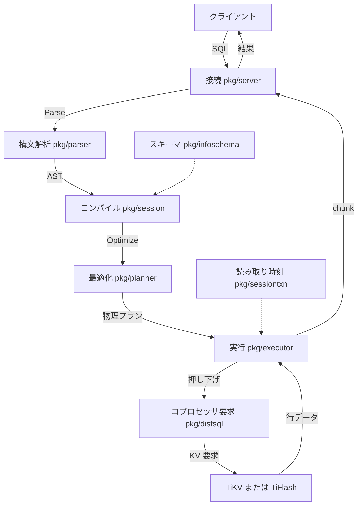

# 第3章 ソースツリーと、1クエリの一生

> **本章で読むソース**
>
> - [`pkg/server/conn.go`](https://github.com/pingcap/tidb/blob/v8.5.6/pkg/server/conn.go)
> - [`pkg/parser/yy_parser.go`](https://github.com/pingcap/tidb/blob/v8.5.6/pkg/parser/yy_parser.go)
> - [`pkg/session/session.go`](https://github.com/pingcap/tidb/blob/v8.5.6/pkg/session/session.go)
> - [`pkg/executor/compiler.go`](https://github.com/pingcap/tidb/blob/v8.5.6/pkg/executor/compiler.go)
> - [`pkg/planner/core/optimizer.go`](https://github.com/pingcap/tidb/blob/v8.5.6/pkg/planner/core/optimizer.go)
> - [`pkg/util/chunk/chunk.go`](https://github.com/pingcap/tidb/blob/v8.5.6/pkg/util/chunk/chunk.go)

## この章の狙い

第1章で TiDB が何であるかを、第2章でエコシステム全体の配置を確認した。
本章は計算層 TiDB のソースツリーを地図として広げ、1つの `SELECT` がどの段をたどって結果になるかを俯瞰する。

目的は2つある。
第一に、`pkg/` の主要ディレクトリが処理のどの段に対応するかを対応づけ、以降の章を読むときの索引にすることである。
第二に、接続から結果送出までの呼び出し経路を実ソースの引用で1本につなぎ、各段の詳細章への入口を示すことである。

各段の内部は専用の章に譲り、本章では「どこからどこへ処理が渡るか」だけを追う。

## 前提

Go の基礎と、SQL が構文解析、最適化、実行という段を踏む一般論を前提とする。
TiDB がストレージ層 TiKV と TiFlash を別プロセスとして持ち、計算層がそこへ読み書きを依頼する構成は第2章で扱った。

## ソースツリーの地図

`pkg/` の直下には40を超えるディレクトリが並ぶ。
1クエリの処理に関わる主要なものを段ごとに並べると、地図はおおむね次のようになる。

| ディレクトリ | 役割 | 詳しく読む章 |
| --- | --- | --- |
| `pkg/server` | クライアント接続と MySQL プロトコルの送受信 | 本章 |
| `pkg/session` | セッション単位の実行経路の調停 | 本章 |
| `pkg/parser` | SQL 文字列を AST へ変換する構文解析 | 第4章 |
| `pkg/planner` | 論理最適化と物理最適化（プランナ） | 第7章、第9章 |
| `pkg/expression` | 式の表現とベクトル化評価 | 第6章 |
| `pkg/statistics` | 統計情報とカーディナリティ推定 | 第8章 |
| `pkg/executor` | 物理プランの実行（エグゼキュータ） | 第12章 |
| `pkg/distsql` | コプロセッサ要求の組み立てと結果合流 | 第13章 |
| `pkg/tablecodec` | 行とインデックスの KV エンコード | 第15章 |
| `pkg/kv` | KV 抽象（スナップショット、トランザクションの interface） | 第16章 |
| `pkg/store` | KV 抽象を満たすドライバ（TiKV クライアントなど） | 第16章 |
| `pkg/sessiontxn` | 楽観、悲観、ステイルリードのトランザクション調停 | 第17章 |
| `pkg/ddl` | 非同期オンライン DDL とバックフィル | 第20章、第21章 |
| `pkg/infoschema` | スキーマ情報のメモリ上の表現 | 第6章、第22章 |
| `pkg/domain` | スキーマとメタデータのライフサイクル管理 | 第22章 |

`SELECT` の主経路は上から `server` で始まり、`parser`、`planner`、`executor`、`distsql`、`tablecodec` と下りていく。
`sessiontxn` と `infoschema` は経路の横で読み取り時刻とスキーマを供給し、`ddl` はスキーマ変更という別系統の入口を持つ。

## 1クエリの一生

ここからは `SELECT` 1文を例に、各ディレクトリへ処理が渡る順を実ソースで追う。
段の流れを先に図で示す。



### 接続と構文解析

クライアントが送った SQL は、接続を担う `pkg/server` の `handleQuery` が受け取る。
この関数はまずセッションの `Parse` を呼び、SQL 文字列を AST の並びへ変換する。

[`pkg/server/conn.go L1738-1748`](https://github.com/pingcap/tidb/blob/v8.5.6/pkg/server/conn.go#L1738-L1748)

```go
func (cc *clientConn) handleQuery(ctx context.Context, sql string) (err error) {
	defer trace.StartRegion(ctx, "handleQuery").End()
	sessVars := cc.ctx.GetSessionVars()
	sc := sessVars.StmtCtx
	prevWarns := sc.GetWarnings()
	var stmts []ast.StmtNode
	cc.ctx.GetSessionVars().SetAlloc(cc.chunkAlloc)
	if stmts, err = cc.ctx.Parse(ctx, sql); err != nil {
		cc.onExtensionSQLParseFailed(sql, err)
		return err
	}
```

構文解析の本体は `pkg/parser` にある。
`Parser.Parse` は内部の `ParseSQL` へ委譲し、その戻り値は `ast.StmtNode` の並びである。

[`pkg/parser/yy_parser.go L178-182`](https://github.com/pingcap/tidb/blob/v8.5.6/pkg/parser/yy_parser.go#L178-L182)

```go
// Parse parses a query string to raw ast.StmtNode.
// If charset or collation is "", default charset and collation will be used.
func (parser *Parser) Parse(sql, charset, collation string) (stmt []ast.StmtNode, warns []error, err error) {
	return parser.ParseSQL(sql, CharsetConnection(charset), CollationConnection(collation))
}
```

ここで SQL 文字列は AST という木構造になる。
字句解析と goyacc 生成のパーサがどう協調するかは第4章で扱う。

### コンパイルと最適化

AST を受け取った後、接続層は `pkg/session` の `ExecuteStmt` を呼ぶ。
この関数のなかで AST を物理プランへ変換するのが「コンパイル」の段である。

[`pkg/session/session.go L2104-2106`](https://github.com/pingcap/tidb/blob/v8.5.6/pkg/session/session.go#L2104-L2106)

```go
	// Transform abstract syntax tree to a physical plan(stored in executor.ExecStmt).
	compiler := executor.Compiler{Ctx: s}
	stmt, err := compiler.Compile(ctx, stmtNode)
```

`Compiler.Compile` は前処理とスキーマ解決を終えたうえで、`pkg/planner` の `Optimize` を呼ぶ。
ここでプランナが論理プランと物理プランを順に組み立てる。

[`pkg/executor/compiler.go L101-105`](https://github.com/pingcap/tidb/blob/v8.5.6/pkg/executor/compiler.go#L101-L105)

```go
	// Build the final physical plan.
	finalPlan, names, err := planner.Optimize(ctx, c.Ctx, nodeW, is)
	if err != nil {
		return nil, err
	}
```

`Optimize` の内側で論理プランを物理プランへ落とすのが、`pkg/planner/core` の `DoOptimize` である。
論理プラン `logic` を受け取り、物理プラン（`base.PhysicalPlan`）と推定コストを返す。

[`pkg/planner/core/optimizer.go L329-343`](https://github.com/pingcap/tidb/blob/v8.5.6/pkg/planner/core/optimizer.go#L329-L343)

```go
// DoOptimize optimizes a logical plan to a physical plan.
func DoOptimize(
	ctx context.Context,
	sctx base.PlanContext,
	flag uint64,
	logic base.LogicalPlan,
) (base.PhysicalPlan, float64, error) {
	sessVars := sctx.GetSessionVars()
	if sessVars.StmtCtx.EnableOptimizerDebugTrace {
		debugtrace.EnterContextCommon(sctx)
		defer debugtrace.LeaveContextCommon(sctx)
	}
	_, finalPlan, cost, err := doOptimize(ctx, sctx, flag, logic)
	return finalPlan, cost, err
}
```

この段で `pkg/statistics` の統計情報がカーディナリティ推定に使われ、`pkg/expression` の式がプランへ組み込まれる。
論理最適化（RBO）は第7章、統計情報は第8章、物理最適化（CBO）は第9章で扱う。
TiKV や TiFlash への押し下げをどう決めるかは第10章と第11章に送る。

### 実行と KV への押し下げ

コンパイルが返す `stmt` は実行可能な物理プランを内に持つ。
`ExecuteStmt` は、ポイント取得で済む短経路（`PointGet`）と、一般の `runStmt` 経路とを分岐する。

[`pkg/session/session.go L2150-2159`](https://github.com/pingcap/tidb/blob/v8.5.6/pkg/session/session.go#L2150-L2159)

```go
	// Execute the physical plan.
	logStmt(stmt, s)

	var recordSet sqlexec.RecordSet
	if stmt.PsStmt != nil { // point plan short path
		recordSet, err = stmt.PointGet(ctx)
		s.txn.changeToInvalid()
	} else {
		recordSet, err = runStmt(ctx, s, stmt)
	}
```

`runStmt` は `pkg/executor` のエグゼキュータを起動し、結果を `sqlexec.RecordSet` として返す。
エグゼキュータは木構造で、上位ノードが下位ノードへ `Next` を呼んで結果を引き寄せる。
読み取りが TiKV や TiFlash へ押し下げられる場合は、`pkg/distsql` がコプロセッサ要求を組み立てて送り、`pkg/tablecodec` が KV のキーとバイト列を行へ復号する。
読み取り時刻とスキーマは `pkg/sessiontxn` と `pkg/infoschema` が供給する。

エグゼキュータの実行モデルは第12章、分散読み取りと結果合流は第13章、KV エンコードは第15章で扱う。

### 結果の送出

`RecordSet` は接続層へ戻り、`pkg/server` が結果をクライアントへ書き出す。
`writeChunks` は `Next` を繰り返し呼び、得られた `chunk` を MySQL プロトコルのパケットへ詰めて送る。

[`pkg/server/conn.go L2358-2362`](https://github.com/pingcap/tidb/blob/v8.5.6/pkg/server/conn.go#L2358-L2362)

```go
		// Here server.tidbResultSet implements Next method.
		err := rs.Next(ctx, req)
		if err != nil {
			return firstNext, err
		}
```

`Next` が空の `chunk` を返したら結果は尽きており、ループを抜けて応答を締める。
これで1クエリの一生が閉じる。

## 高速化の工夫 チャンク単位のベクトル化実行

エグゼキュータが行を1件ずつ受け渡すと、行ごとに `Next` の関数呼び出しとメモリ割り当てが発生し、件数に比例してオーバーヘッドが積み上がる。
TiDB は結果を `chunk` という単位でまとめて受け渡し、この回数を減らす。

`pkg/util/chunk` の `Chunk` は、複数行を列ごとに保持する。
コメントが示すとおり、列のレイアウトは Apache Arrow に倣った連続配置で、復号を介さずに値へアクセスでき、処理が終われば確保済みメモリをリセットして再利用できる。

[`pkg/util/chunk/chunk.go L27-54`](https://github.com/pingcap/tidb/blob/v8.5.6/pkg/util/chunk/chunk.go#L27-L54)

```go
// Chunk stores multiple rows of data in columns. Columns are in Apache Arrow format.
// See https://arrow.apache.org/docs/format/Columnar.html#physical-memory-layout.
// Apache Arrow is not used directly because we want to access MySQL types without decoding.
//
// Values are appended in compact format and can be directly accessed without decoding.
// When the chunk is done processing, we can reuse the allocated memory by resetting it.
//
// All Chunk's API should not do the validation work, and the user should ensure it is used correctly.
type Chunk struct {
	// sel indicates which rows are selected.
	// If it is nil, all rows are selected.
	sel []int

	columns []*Column
	// numVirtualRows indicates the number of virtual rows, which have zero Column.
	// It is used only when this Chunk doesn't hold any data, i.e. "len(columns)==0".
	numVirtualRows int
	// capacity indicates the max number of rows this chunk can hold.
	// TODO: replace all usages of capacity to requiredRows and remove this field
	capacity int

	// requiredRows indicates how many rows the parent executor want.
	requiredRows int

	// inCompleteChunk means some of the columns in the chunk is not filled, used in
	// join probe, the value will always be false unless set it explicitly
	inCompleteChunk bool
}
```

列ごとに値を連続配置すると、同じ列を多数行ぶんまとめて評価でき、1要素ごとの分岐や型判定を1回ずつに薄められる。
1回の `Next` が運ぶのが1行ではなく数百行ぶんの `chunk` になるため、呼び出しと割り当ての回数が件数ぶんからチャンク数ぶんへ減る。
これがベクトル化実行であり、TiDB のエグゼキュータが行指向の素朴な評価より速い理由である。
列指向のメモリ表現と式評価の詳細は第6章と第12章で扱う。

## まとめ

1つの `SELECT` は、`pkg/server` の接続層が受け取り、`pkg/parser` で AST になり、`pkg/session` から `pkg/planner` で物理プランへ最適化され、`pkg/executor` が `chunk` 単位で実行し、必要なら `pkg/distsql` を介して TiKV や TiFlash へ押し下げ、結果を接続層が送り返す。
`pkg/` の主要ディレクトリはこの段に対応づき、横では `pkg/sessiontxn` と `pkg/infoschema` が読み取り時刻とスキーマを供給する。
行ではなく `chunk` を受け渡すベクトル化実行が、呼び出しと割り当ての回数を抑えて実行を速くしている。

各段の内部は以降の章で読む。
本章はその索引として使える。

## 関連する章

- [第1章 TiDB とは何か](01-what-is-tidb.md)
- [第2章 エコシステムとアーキテクチャ](02-architecture.md)
- [第4章 パーサと AST](../part01-frontend/04-parser-and-ast.md)
- [第6章 式、型、スキーマ参照](../part01-frontend/06-expression-and-schema.md)
- [第7章 論理プランと論理最適化（RBO）](../part02-optimizer/07-logical-optimization.md)
- [第8章 統計情報とカーディナリティ推定](../part02-optimizer/08-statistics-and-cardinality.md)
- [第9章 コストモデルと物理最適化（CBO）](../part02-optimizer/09-physical-optimization.md)
- [第12章 ベクトル化実行モデル](../part03-executor/12-vectorized-execution.md)
- [第13章 分散読み取りと結果の合流](../part03-executor/13-distributed-read.md)
- [第15章 行とインデックスの KV エンコード](../part04-txn/15-kv-encoding.md)
- [第16章 KV 抽象とスナップショット](../part04-txn/16-kv-abstraction-and-snapshot.md)
- [第17章 トランザクション調停（楽観、悲観、TSO）](../part04-txn/17-transaction-coordination.md)
- [第22章 PD クライアントと domain](../part05-ddl-infra/22-pd-client-and-domain.md)
