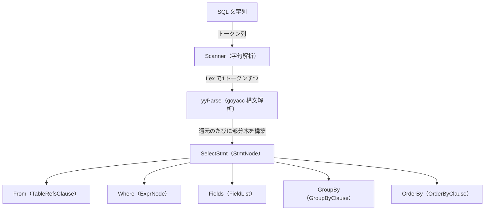

# 第4章 パーサと AST

> **本章で読むソース**
>
> - [`pkg/parser/yy_parser.go`](https://github.com/pingcap/tidb/blob/v8.5.6/pkg/parser/yy_parser.go)
> - [`pkg/parser/lexer.go`](https://github.com/pingcap/tidb/blob/v8.5.6/pkg/parser/lexer.go)
> - [`pkg/parser/misc.go`](https://github.com/pingcap/tidb/blob/v8.5.6/pkg/parser/misc.go)
> - [`pkg/parser/ast/ast.go`](https://github.com/pingcap/tidb/blob/v8.5.6/pkg/parser/ast/ast.go)
> - [`pkg/parser/ast/dml.go`](https://github.com/pingcap/tidb/blob/v8.5.6/pkg/parser/ast/dml.go)
> - [`pkg/parser/hintparserimpl.go`](https://github.com/pingcap/tidb/blob/v8.5.6/pkg/parser/hintparserimpl.go)

## この章の狙い

第3章では1つの `SELECT` が `server` から `parser` へ渡り、構文解析を経て下流の最適化と実行へ流れる経路を俯瞰した。
本章はその最初の段、SQL 文字列を抽象構文木へ変える `pkg/parser` を読む。

TiDB のパーサは MySQL 互換であり、文法そのものは MySQL のリファレンスに沿う。
そのため文法規則を逐一たどるのではなく、TiDB に固有の構造に集中する。
具体的には、字句解析器と構文解析器がどう協調するか、生成される **AST**（abstract syntax tree、抽象構文木）がどんな木で、どう走査されるか、そしてパーサが独立した Go モジュールであることや SQL ヒントを別パーサで扱うことといった TiDB ならではの設計を扱う。

## 前提

Go の基礎と、SQL が字句解析と構文解析という段を踏むという一般論を前提とする。
構文解析器が goyacc（yacc の Go 移植）で文法定義から生成されること、字句解析器がトークン列を構文解析器へ供給することは一般論として扱い、TiDB の実装に即して読む。

## 入口の `Parse` と二段構え

パーサの入口は `Parser.Parse` である。
SQL 文字列と接続文字セット、照合順序を受け取り、文の並び `[]ast.StmtNode` を返す。

[`pkg/parser/yy_parser.go` L180-L182](https://github.com/pingcap/tidb/blob/v8.5.6/pkg/parser/yy_parser.go#L180-L182)

```go
func (parser *Parser) Parse(sql, charset, collation string) (stmt []ast.StmtNode, warns []error, err error) {
	return parser.ParseSQL(sql, CharsetConnection(charset), CollationConnection(collation))
}
```

`Parse` は受け取った文字セットと照合順序を `CharsetConnection` と `CollationConnection` という設定オブジェクトに包み、本体の `ParseSQL` へ渡すだけの薄いラッパーである。
文字セットを引数ではなく可変長の設定オブジェクト列で渡す形をとるのは、文字セット以外にも `SQLMode` などのパラメータを同じ機構で差し込めるようにするためと考えられる。

実体の `ParseSQL` は、字句解析器の状態を入力でリセットしてから goyacc 生成の構文解析器を1度呼ぶ。

[`pkg/parser/yy_parser.go` L149-L176](https://github.com/pingcap/tidb/blob/v8.5.6/pkg/parser/yy_parser.go#L149-L176)

```go
func (parser *Parser) ParseSQL(sql string, params ...ParseParam) (stmt []ast.StmtNode, warns []error, err error) {
	resetParams(parser)
	parser.lexer.reset(sql)
	for _, p := range params {
		if err := p.ApplyOn(parser); err != nil {
			return nil, nil, err
		}
	}
	parser.src = sql
	parser.result = parser.result[:0]

	var l yyLexer = &parser.lexer
	yyParse(l, parser)

	warns, errs := l.Errors()
	if len(warns) > 0 {
		warns = append([]error(nil), warns...)
	} else {
		warns = nil
	}
	if len(errs) != 0 {
		return nil, warns, errors.Trace(errs[0])
	}
	for _, stmt := range parser.result {
		ast.SetFlag(stmt)
	}
	return parser.result, warns, nil
}
```

ここに二段構えが見える。
`parser.lexer` は字句解析器 `Scanner` であり、`yyParse` は goyacc が `parser.y` から生成した構文解析器である。
`Scanner` を `yyLexer` インターフェイス越しに渡しているのは、構文解析器がトークンを1つずつ要求するたびに字句解析器の `Lex` を呼び返す協調動作のためである。
構文解析が終わると、文ごとに `ast.SetFlag` で各文に属性フラグを付け、結果の `parser.result` を返す。

`ParseSQL` の引数に文字セットや照合順序を直接持たず、`ParseParam` という適用関数の列で受けるのは、`Parse` の薄さと対をなす。
`CharsetConnection` などは `ApplyOn` メソッドでパーサ内部の状態を書き換える小さな設定オブジェクトであり、呼び出し側は必要なパラメータだけを渡せばよい。

## 字句解析器 `Scanner` とトークン供給

構文解析器がトークンを要求する窓口が `Scanner.Lex` である。
`Lex` は内部の `scan` を呼んで生のトークンを取り出し、識別子の正規化、文字セット変換、SQL モードに応じた読み替えを施してから構文解析器へ返す。

[`pkg/parser/lexer.go` L229-L250](https://github.com/pingcap/tidb/blob/v8.5.6/pkg/parser/lexer.go#L229-L250)

```go
func (s *Scanner) Lex(v *yySymType) int {
	tok, pos, lit := s.scan()
	s.lastScanOffset = pos.Offset
	s.lastKeyword3 = s.lastKeyword2
	s.lastKeyword2 = s.lastKeyword
	s.lastKeyword = 0
	v.offset = pos.Offset
	v.ident = lit
	if tok == identifier {
		tok = s.handleIdent(v)
	}
	if tok == identifier {
		if tok1 := s.isTokenIdentifier(lit, pos.Offset); tok1 != 0 {
			tok = tok1
			s.lastKeyword = tok1
		}
	}
	if s.sqlMode.HasANSIQuotesMode() &&
		tok == stringLit &&
		s.r.s[v.offset] == '"' {
		tok = identifier
	}
```

`Lex` は直前の3つのキーワードを `lastKeyword` から `lastKeyword3` へずらして記録する。
この履歴は、後述する SQL ヒントを構文として解釈すべきか無視すべきかの判定に使う。
`HasANSIQuotesMode` の分岐のように、SQL モードによってトークンの種類を読み替える処理もここに集まる。
`"abc"` を文字列リテラルと見るか識別子と見るかは SQL モードで変わるため、字句の段で吸収している。

トークンの種類は `Lex` ではなく `scan` が決める。
ここが TiDB の字句解析の機構の中心である。

## 表駆動のトライで字句を切り出す

`scan` は1文字目を読み、その文字から始まる規則を引いてトークンを返す。
規則の引き方はトライ（trie）の探索である。

[`pkg/parser/lexer.go` L401-L430](https://github.com/pingcap/tidb/blob/v8.5.6/pkg/parser/lexer.go#L401-L430)

```go
func (s *Scanner) scan() (tok int, pos Pos, lit string) {
	ch0 := s.r.peek()
	if unicode.IsSpace(rune(ch0)) {
		ch0 = s.skipWhitespace()
	}
	pos = s.r.pos()
	if s.r.eof() {
		// when scanner meets EOF, the returned token should be 0,
		// because 0 is a special token id to remind the parser that stream is end.
		return 0, pos, ""
	}

	if isIdentExtend(ch0) {
		return scanIdentifier(s)
	}

	// search a trie to get a token.
	node := &ruleTable
	for !(node.childs[ch0] == nil || s.r.eof()) {
		node = node.childs[ch0]
		if node.fn != nil {
			return node.fn(s)
		}
		s.r.inc()
		ch0 = s.r.peek()
	}

	tok, lit = node.token, s.r.data(&pos)
	return
}
```

`ruleTable` はトライの根であり、各節点は次の文字でたどる256本の子枝と、確定したときに返すトークン番号、あるいは続きを読む関数を持つ。

[`pkg/parser/misc.go` L57-L63](https://github.com/pingcap/tidb/blob/v8.5.6/pkg/parser/misc.go#L57-L63)

```go
type trieNode struct {
	childs [256]*trieNode
	token  int
	fn     func(s *Scanner) (int, Pos, string)
}

var ruleTable trieNode
```

このトライは起動時の `init` で一度だけ組み立てる。
1文字で決まる記号はトークン番号を直接置き、複数文字の演算子は文字列で枝を伸ばす。

[`pkg/parser/misc.go` L117-L133](https://github.com/pingcap/tidb/blob/v8.5.6/pkg/parser/misc.go#L117-L133)

```go
	initTokenByte('?', paramMarker)
	initTokenByte('=', eq)
	initTokenByte('{', int('{'))
	initTokenByte('}', int('}'))

	initTokenString("||", pipes)
	initTokenString("&&", andand)
	initTokenString("&^", andnot)
	initTokenString(":=", assignmentEq)
	initTokenString("<=>", nulleq)
	initTokenString(">=", ge)
	initTokenString("<=", le)
	initTokenString("!=", neq)
	initTokenString("<>", neqSynonym)
	initTokenString("<<", lsh)
	initTokenString(">>", rsh)
	initTokenString("\\N", null)
```

この設計が字句解析の機構の工夫である。
`scan` は入力を先頭から1文字ずつ読み、各文字でトライの子枝を1段降りるだけで次のトークンを切り出す。
文字1つあたりの処理は子枝の参照という一定回数の操作で済むため、字句解析の総コストは入力の長さに比例した一定速度で進む。
記号やキーワードの種類が増えてもトライの枝が増えるだけで、1文字あたりの探索回数は変わらない。
複数文字の演算子（`<=>` や `>>`）も、候補を文字列比較で総当たりするのではなく、同じトライを1文字ずつ降りる過程で自然に最長一致が決まる。

`?` がプレースホルダの記号 `paramMarker` として最初の文字で確定する点にも注目したい。
プリペアドステートメントのプレースホルダは、字句の段でこの1文字を専用トークンに割り当てることで構文解析器へ渡る。
プレースホルダがどう束縛されプランキャッシュとどう関わるかは第5章で扱う。

## 生成物としての AST

構文解析器が組み立てる木は `ast.StmtNode` を根とする。
すべての AST 節点が満たす基本インターフェイスが `Node` である。

[`pkg/parser/ast/ast.go` L26-L51](https://github.com/pingcap/tidb/blob/v8.5.6/pkg/parser/ast/ast.go#L26-L51)

```go
// Node is the basic element of the AST.
// Interfaces embed Node should have 'Node' name suffix.
type Node interface {
	// Restore returns the sql text from ast tree
	Restore(ctx *format.RestoreCtx) error
	// Accept accepts Visitor to visit itself.
	// The returned node should replace original node.
	// ok returns false to stop visiting.
	//
	// Implementation of this method should first call visitor.Enter,
	// assign the returned node to its method receiver, if skipChildren returns true,
	// children should be skipped. Otherwise, call its children in particular order that
	// later elements depends on former elements. Finally, return visitor.Leave.
	Accept(v Visitor) (node Node, ok bool)
	// Text returns the utf8 encoding text of the element.
	Text() string
	// OriginalText returns the original text of the element.
	OriginalText() string
	// SetText sets original text to the Node.
	SetText(enc charset.Encoding, text string)
	// SetOriginTextPosition set the start offset of this node in the origin text.
	// Only be called when `parser.lexer.skipPositionRecording` equals to false.
	SetOriginTextPosition(offset int)
	// OriginTextPosition get the start offset of this node in the origin text.
	OriginTextPosition() int
}
```

`Node` は2つの能力を要求する。
1つは `Restore` で、AST から SQL 文字列を復元する。
もう1つは `Accept` で、後述する `Visitor` による走査を受け入れる。

文を表す節点は `Node` に印付けの空メソッドを足した派生インターフェイスで区別する。

[`pkg/parser/ast/ast.go` L104-L121](https://github.com/pingcap/tidb/blob/v8.5.6/pkg/parser/ast/ast.go#L104-L121)

```go
// StmtNode represents statement node.
// Name of implementations should have 'Stmt' suffix.
type StmtNode interface {
	Node
	statement()
}

// DDLNode represents DDL statement node.
type DDLNode interface {
	StmtNode
	ddlStatement()
}

// DMLNode represents DML statement node.
type DMLNode interface {
	StmtNode
	dmlStatement()
}
```

`statement` のような空メソッドは値を持たない印にすぎず、`SelectStmt` のような具体型だけがそれを実装する。
これにより、ある節点が文か、文の中でも DDL か DML かを Go の型システムで区別できる。
`SELECT` は DML なので `DMLNode` を満たす。

代表的な文の節点 `SelectStmt` は、SQL の各句をフィールドとして持つ構造体である。

[`pkg/parser/ast/dml.go` L1161-L1206](https://github.com/pingcap/tidb/blob/v8.5.6/pkg/parser/ast/dml.go#L1161-L1206)

```go
type SelectStmt struct {
	dmlNode

	// SelectStmtOpts wraps around select hints and switches.
	*SelectStmtOpts
	// Distinct represents whether the select has distinct option.
	Distinct bool
	// From is the from clause of the query.
	From *TableRefsClause
	// Where is the where clause in select statement.
	Where ExprNode
	// Fields is the select expression list.
	Fields *FieldList
	// GroupBy is the group by expression list.
	GroupBy *GroupByClause
	// Having is the having condition.
	Having *HavingClause
	// WindowSpecs is the window specification list.
	WindowSpecs []WindowSpec
	// OrderBy is the ordering expression list.
	OrderBy *OrderByClause
	// Limit is the limit clause.
	Limit *Limit
	// LockInfo is the lock type
	LockInfo *SelectLockInfo
	// TableHints represents the table level Optimizer Hint for join type
	TableHints []*TableOptimizerHint
	// IsInBraces indicates whether it's a stmt in brace.
	IsInBraces bool
	// WithBeforeBraces indicates whether stmt's with clause is before the brace.
	// It's used to distinguish (with xxx select xxx) and with xxx (select xxx)
	WithBeforeBraces bool
	// QueryBlockOffset indicates the order of this SelectStmt if counted from left to right in the sql text.
	QueryBlockOffset int
	// SelectIntoOpt is the select-into option.
	SelectIntoOpt *SelectIntoOption
	// AfterSetOperator indicates the SelectStmt after which type of set operator
	AfterSetOperator *SetOprType
	// Kind refer to three kind of statement: SelectStmt, TableStmt and ValuesStmt
	Kind SelectStmtKind
	// Lists is filled only when Kind == SelectStmtKindValues
	Lists []*RowExpr
	With  *WithClause
	// AsViewSchema indicates if this stmt provides the schema for the view. It is only used when creating the view
	AsViewSchema bool
}
```

`From` や `Where`、`GroupBy` といったフィールドが、SQL の `FROM` 句、`WHERE` 句、`GROUP BY` 句に1対1で対応する。
構文解析器は文法規則の還元のたびに、これらのフィールドへ部分木を差し込んでいく。
`TableHints` に SQL ヒントの解析結果が入る点は後で扱う。

文単位の AST 構造を図にすると次のようになる。



## `Accept` による走査

AST を組み立てたあと、下流の最適化はこの木を何度も走査して書き換える。
その走査の共通機構が `Visitor` パターンであり、各節点の `Accept` が担う。

[`pkg/parser/ast/ast.go` L138-L150](https://github.com/pingcap/tidb/blob/v8.5.6/pkg/parser/ast/ast.go#L138-L150)

```go
// Visitor visits a Node.
type Visitor interface {
	// Enter is called before children nodes are visited.
	// The returned node must be the same type as the input node n.
	// skipChildren returns true means children nodes should be skipped,
	// this is useful when work is done in Enter and there is no need to visit children.
	Enter(n Node) (node Node, skipChildren bool)
	// Leave is called after children nodes have been visited.
	// The returned node's type can be different from the input node if it is a ExprNode,
	// Non-expression node must be the same type as the input node n.
	// ok returns false to stop visiting.
	Leave(n Node) (node Node, ok bool)
}
```

`Visitor` は `Enter` と `Leave` の2つのメソッドを持つ。
節点を訪れる側はこのインターフェイスを実装し、節点を書き換えたいときは `Enter` か `Leave` が新しい節点を返す。
木をたどる責任は節点側の `Accept` が持ち、訪問側は何をするかだけを書けばよい。

`SelectStmt.Accept` は、自分に `Enter` を適用してから各フィールドの部分木へ `Accept` を再帰的に伝える。

[`pkg/parser/ast/dml.go` L1476-L1526](https://github.com/pingcap/tidb/blob/v8.5.6/pkg/parser/ast/dml.go#L1476-L1526)

```go
func (n *SelectStmt) Accept(v Visitor) (Node, bool) {
	newNode, skipChildren := v.Enter(n)
	if skipChildren {
		return v.Leave(newNode)
	}

	n = newNode.(*SelectStmt)

	if n.With != nil {
		node, ok := n.With.Accept(v)
		if !ok {
			return n, false
		}
		n.With = node.(*WithClause)
	}

	if len(n.TableHints) != 0 {
		newHints := make([]*TableOptimizerHint, len(n.TableHints))
		for i, hint := range n.TableHints {
			node, ok := hint.Accept(v)
			if !ok {
				return n, false
			}
			newHints[i] = node.(*TableOptimizerHint)
		}
		n.TableHints = newHints
	}

	if n.Fields != nil {
		node, ok := n.Fields.Accept(v)
		if !ok {
			return n, false
		}
		n.Fields = node.(*FieldList)
	}

	if n.From != nil {
		node, ok := n.From.Accept(v)
		if !ok {
			return n, false
		}
		n.From = node.(*TableRefsClause)
	}

	if n.Where != nil {
		node, ok := n.Where.Accept(v)
		if !ok {
			return n, false
		}
		n.Where = node.(ExprNode)
	}
```

`Accept` はまず `v.Enter(n)` を呼び、`skipChildren` が真なら子をたどらずに `Leave` だけ呼ぶ。
偽なら、`With`、`TableHints`、`Fields`、`From`、`Where` の順に各フィールドへ `Accept` を伝える。
各フィールドが返した節点で元のフィールドを置き換えるため、走査と同時に木の書き換えができる。
`Enter` が返した節点を `newNode.(*SelectStmt)` で受け直すのは、訪問側が `SelectStmt` 自体を別の節点に差し替えられるようにするためである。

この `Accept` の機構を使って、論理プランへの変換や式の前処理が AST を走査する。
論理プランへどう落ちるかは第7章で扱う。

## TiDB に固有の設計

ここまでが MySQL 互換のパーサに共通する骨格である。
TiDB ならではの設計を3つ挙げる。

第一に、パーサが独立した Go モジュールである。

[`pkg/parser/go.mod` L1-L1](https://github.com/pingcap/tidb/blob/v8.5.6/pkg/parser/go.mod#L1)

```text
module github.com/pingcap/tidb/pkg/parser
```

`pkg/parser` は TiDB 本体とは別の `go.mod` を持ち、独立したモジュールとして公開されている。
パーサだけを外部のツールから依存できるようにするための分離と考えられる。
SQL を解析したいだけのツールが TiDB 本体の重い依存を引き込まずに済む。

第二に、SQL ヒントを別のパーサで扱う。
`/*+ ... */` の中身は通常の SQL 文法とは別の小さな文法であり、専用の `hintParser` が解析する。

[`pkg/parser/hintparserimpl.go` L131-L142](https://github.com/pingcap/tidb/blob/v8.5.6/pkg/parser/hintparserimpl.go#L131-L142)

```go
func (hp *hintParser) parse(input string, sqlMode mysql.SQLMode, initPos Pos) ([]*ast.TableOptimizerHint, []error) {
	hp.result = nil
	hp.lexer.reset(input[3:])
	hp.lexer.SetSQLMode(sqlMode)
	hp.lexer.r.updatePos(Pos{
		Line:   initPos.Line,
		Col:    initPos.Col + 3, // skipped the initial '/*+'
		Offset: 0,
	})
	hp.lexer.inBangComment = true // skip the final '*/' (we need the '*/' for reporting warnings)

	yyhintParse(&hp.lexer, hp)
```

ヒントパーサは独自の字句解析器 `hintScanner` と、goyacc が別途生成した `yyhintParse` を持つ。
主パーサの `Lex` がヒントの開始位置 `lastHintPos` を記録しておき、主パーサがヒントに行き当たるとこの `parse` を呼んでヒント部分だけを解析する。
ヒント文法を主文法に混ぜないことで、ヒントの語彙が普通の識別子と衝突せず、ヒントを認識できない場面では警告にとどめて文全体の解析を続けられる。
ヒントの解析結果が `SelectStmt.TableHints` へ収まり、オプティマイザがそれを読む。

第三に、`Parse` がプレースホルダと文字セットを字句の段で吸収する。
プレースホルダ `?` は前述のとおり字句の段で `paramMarker` トークンになり、文字セットと照合順序は `Parse` が `ParseSQL` へ設定オブジェクトとして渡して `Scanner` の変換に反映される。
構文解析器は接続の文字セットを意識せず、字句解析器が変換済みの識別子と文字列を供給する。

## まとめ

本章は SQL 文字列を AST へ変える `pkg/parser` を読んだ。
入口の `Parse` は文字セットと照合順序を設定オブジェクトに包んで `ParseSQL` へ渡し、`ParseSQL` が字句解析器 `Scanner` と goyacc 生成の構文解析器 `yyParse` を協調させて `[]ast.StmtNode` を組み立てる。
字句解析は表駆動のトライを1文字ずつ降りることで、入力の長さに比例した一定速度でトークンを切り出す。
生成物の AST は `Node` を根とし、文の節点 `SelectStmt` は SQL の各句をフィールドに持ち、`Accept` による `Visitor` 走査で下流が木を書き換える。
TiDB に固有の点として、パーサが独立した Go モジュールであること、SQL ヒントを別パーサで扱うこと、プレースホルダと文字セットを字句の段で吸収することを確認した。

## 関連する章

- [第3章 ソースツリーと、1クエリの一生](../part00-overview/03-source-tree-and-query-flow.md)：パーサが処理経路のどこに位置するかを俯瞰する。
- [第5章 プリペアドステートメントとプランキャッシュ](05-prepared-and-plan-cache.md)：本章で字句の段に現れた `paramMarker` プレースホルダが、どう束縛されプランキャッシュと関わるかを扱う。
- [第7章 論理プランと論理最適化（RBO）](../part02-optimizer/07-logical-optimization.md)：本章の AST が `Accept` 走査を通じて論理プランへ変換される過程を扱う。
