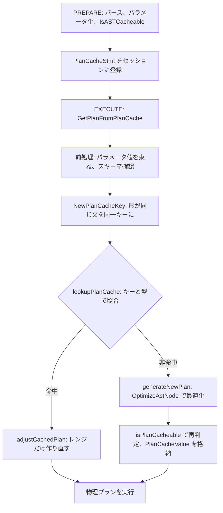

# 第5章 プリペアドステートメントとプランキャッシュ

> **本章で読むソース**
>
> - [`pkg/executor/prepared.go`](https://github.com/pingcap/tidb/blob/v8.5.6/pkg/executor/prepared.go)
> - [`pkg/planner/core/plan_cache_utils.go`](https://github.com/pingcap/tidb/blob/v8.5.6/pkg/planner/core/plan_cache_utils.go)
> - [`pkg/planner/core/plan_cacheable_checker.go`](https://github.com/pingcap/tidb/blob/v8.5.6/pkg/planner/core/plan_cacheable_checker.go)
> - [`pkg/planner/core/plan_cache.go`](https://github.com/pingcap/tidb/blob/v8.5.6/pkg/planner/core/plan_cache.go)

## この章の狙い

第4章で、SQL 文字列が構文解析を経て AST になる流れを読んだ。
本章はその先で、同じ形の文を繰り返し実行するときに最適化の手間をどう省くかを扱う。

題材は2つある。
第一に、**プリペアドステートメント**（`PREPARE`／`EXECUTE`、またはバイナリプロトコルの `COM_STMT_PREPARE`／`COM_STMT_EXECUTE`）の流れである。
文を一度だけパースしてパラメータ化した AST を保持し、実行時にはパラメータ値だけを束ねて与える。

第二に、**プランキャッシュ**である。
同じ文に対して一度作った物理プランをキャッシュしておき、次回の実行では最適化そのものを省く。
本章は、どの文がキャッシュ可能と判定されるか、キャッシュのキーと値がどう作られるか、命中時にプランがどう再利用されるかを実ソースで追う。

## 前提

第4章のパーサと AST の知識を前提とする。
物理プランの生成（オプティマイザ）は第7章と第9章で扱うので、本章ではプランを生成する関数 `OptimizeAstNode` を呼び出す箇所だけを見て、その内部には立ち入らない。
パラメータマーカー（`?`）が AST 上で `*driver.ParamMarkerExpr` というノードになる点は、本章の議論で繰り返し使う。

## プリペアの流れ

`PREPARE st FROM '...'` を実行すると、`PrepareExec` の `Next` が走る。
この関数はまず SQL 文字列をパースして1つの AST にし、続いて `GeneratePlanCacheStmtWithAST` を呼んでプリペア済みの構造体を組み立てる。

[`pkg/executor/prepared.go L131-158`](https://github.com/pingcap/tidb/blob/v8.5.6/pkg/executor/prepared.go#L131-L158)

```go
	stmt, p, paramCnt, err := plannercore.GeneratePlanCacheStmtWithAST(ctx, e.Ctx(), true, stmt0.Text(), stmt0, sessiontxn.GetTxnManager(e.Ctx()).GetTxnInfoSchema())
	if err != nil {
		return err
	}
	if topsqlstate.TopSQLEnabled() {
		e.Ctx().GetSessionVars().StmtCtx.IsSQLRegistered.Store(true)
		topsql.AttachAndRegisterSQLInfo(ctx, stmt.NormalizedSQL, stmt.SQLDigest, vars.InRestrictedSQL)
	}

	e.Ctx().GetSessionVars().PlanID.Store(0)
	e.Ctx().GetSessionVars().PlanColumnID.Store(0)
	e.Ctx().GetSessionVars().MapHashCode2UniqueID4ExtendedCol = nil
	// In MySQL prepare protocol, the server need to tell the client how many column the prepared statement would return when executing it.
	// For a query with on result, e.g. an insert statement, there will be no result, so 'e.Fields' is not set.
	// Usually, p.Schema().Len() == 0 means no result. A special case is the 'do' statement, it looks like 'select' but discard the result.
	if !isNoResultPlan(p) {
		e.Fields = colNames2ResultFields(p.Schema(), p.OutputNames(), vars.CurrentDB)
	}
	if e.ID == 0 {
		e.ID = vars.GetNextPreparedStmtID()
	}
	if e.name != "" {
		vars.PreparedStmtNameToID[e.name] = e.ID
	}

	e.ParamCount = paramCnt
	e.Stmt = stmt
	return vars.AddPreparedStmt(e.ID, stmt)
```

ここで返る `stmt` が、後の `EXECUTE` から参照される本体である。
プリペア結果はステートメント ID と名前に対応づけてセッションに登録される（`AddPreparedStmt`）。
返り値の `paramCnt` はパラメータマーカーの個数であり、バイナリプロトコルではこの個数をクライアントに伝えて、実行時にいくつの値を送ればよいかを知らせる。

### パラメータマーカーの抽出と並べ替え

`GeneratePlanCacheStmtWithAST` の入口では、AST を走査してパラメータマーカーを集める。
集め役は `paramMarkerExtractor` という小さな Visitor で、`*driver.ParamMarkerExpr` を見つけるたびに配列へ追加する。

[`pkg/planner/core/plan_cache_utils.go L77-82`](https://github.com/pingcap/tidb/blob/v8.5.6/pkg/planner/core/plan_cache_utils.go#L77-L82)

```go
func (e *paramMarkerExtractor) Leave(in ast.Node) (ast.Node, bool) {
	if x, ok := in.(*driver.ParamMarkerExpr); ok {
		e.markers = append(e.markers, x)
	}
	return in, true
}
```

Visitor が訪れる順は文字列上の出現順とは限らない。
そこで、抽出したマーカーをソースコード中の位置（`Offset`）で並べ替えてから、先頭から `0` 始まりの順序番号を振る。

[`pkg/planner/core/plan_cache_utils.go L120-129`](https://github.com/pingcap/tidb/blob/v8.5.6/pkg/planner/core/plan_cache_utils.go#L120-L129)

```go
	// The parameter markers are appended in visiting order, which may not
	// be the same as the position order in the query string. We need to
	// sort it by position.
	slices.SortFunc(extractor.markers, func(i, j ast.ParamMarkerExpr) int {
		return cmp.Compare(i.(*driver.ParamMarkerExpr).Offset, j.(*driver.ParamMarkerExpr).Offset)
	})
	paramCount := len(extractor.markers)
	for i := 0; i < paramCount; i++ {
		extractor.markers[i].SetOrder(i)
	}
```

この順序番号により、`EXECUTE ... USING @a, @b` の `@a`、`@b` が文中の `?` のどれに対応するかが決まる。

### プリペア時はパラメータを NULL として扱う

`PREPARE` の時点では実引数が分かっていない。
そこで、各マーカーの値を `NULL` に初期化し、まだ実行中でない印として `InExecute = false` を立てる。

[`pkg/planner/core/plan_cache_utils.go L163-172`](https://github.com/pingcap/tidb/blob/v8.5.6/pkg/planner/core/plan_cache_utils.go#L163-L172)

```go
	// For prepared statements like `prepare st from 'select * from t where a<?'`,
	// parameters are unknown here, so regard them all as NULL.
	// For non-prepared statements, all parameters are already initialized at `ParameterizeAST`, so no need to set NULL.
	if isPrepStmt {
		for i := range extractor.markers {
			param := extractor.markers[i].(*driver.ParamMarkerExpr)
			param.Datum.SetNull()
			param.InExecute = false
		}
	}
```

このあと `destBuilder.Build` を呼んでプランを一度組み立て、戻り値の `PlanCacheStmt` にパラメータマーカーの配列（`Params`）や正規化済み SQL、スキーマバージョンなどを収めて返す。

## キャッシュ可能性の判定

プリペアした文すべてがキャッシュに載るわけではない。
`GeneratePlanCacheStmtWithAST` は、プリペアドステートメントについて `IsASTCacheable` を呼んでキャッシュ可能性を判定し、結果を `PlanCacheStmt.StmtCacheable` に記録する。

[`pkg/planner/core/plan_cache_utils.go L141-161`](https://github.com/pingcap/tidb/blob/v8.5.6/pkg/planner/core/plan_cache_utils.go#L141-L161)

```go
	if (isPrepStmt && !vars.EnablePreparedPlanCache) || // prepared statement
		(!isPrepStmt && !vars.EnableNonPreparedPlanCache) { // non-prepared statement
		cacheable = false
		reason = "plan cache is disabled"
	} else {
		if isPrepStmt {
			cacheable, reason = IsASTCacheable(ctx, sctx.GetPlanCtx(), paramStmt, ret.InfoSchema)
		} else {
			cacheable = true // it is already checked here
		}

		if !cacheable && fixcontrol.GetBoolWithDefault(vars.OptimizerFixControl, fixcontrol.Fix49736, false) {
			sctx.GetSessionVars().StmtCtx.AppendWarning(errors.NewNoStackErrorf("force plan-cache: may use risky cached plan: %s", reason))
			cacheable = true
			reason = ""
		}

		if !cacheable {
			sctx.GetSessionVars().StmtCtx.AppendWarning(errors.NewNoStackError("skip prepared plan-cache: " + reason))
		}
	}
```

キャッシュ不可と判定された文には、その理由が `reason` として残り、警告として積まれる。
`IsASTCacheable` はまず文の種類を絞り、`SELECT`／`UPDATE`／`INSERT`／`DELETE`／`SET` 以外をキャッシュ不可とする。

[`pkg/planner/core/plan_cacheable_checker.go L59-75`](https://github.com/pingcap/tidb/blob/v8.5.6/pkg/planner/core/plan_cacheable_checker.go#L59-L75)

```go
func IsASTCacheable(ctx context.Context, sctx base.PlanContext, node ast.Node, is infoschema.InfoSchema) (bool, string) {
	switch node.(type) {
	case *ast.SelectStmt, *ast.UpdateStmt, *ast.InsertStmt, *ast.DeleteStmt, *ast.SetOprStmt:
	default:
		return false, "not a SELECT/UPDATE/INSERT/DELETE/SET statement"
	}
	checker := cacheableChecker{
		ctx:          ctx,
		sctx:         sctx,
		cacheable:    true,
		schema:       is,
		sumInListLen: 0,
		maxNumParam:  getMaxParamLimit(sctx),
	}
	node.Accept(&checker)
	return checker.cacheable, checker.reason
}
```

### AST を走査して危険な要素を弾く

判定の本体は `cacheableChecker` という Visitor で、AST を下りながらキャッシュに適さない要素に出会うと `cacheable` を `false` に落とす。
代表的な不可条件を見ると、キャッシュが何を避けたいかが分かる。

[`pkg/planner/core/plan_cacheable_checker.go L143-159`](https://github.com/pingcap/tidb/blob/v8.5.6/pkg/planner/core/plan_cacheable_checker.go#L143-L159)

```go
	case *ast.VariableExpr:
		checker.cacheable = false
		checker.reason = "query has user-defined variables is un-cacheable"
		return in, true
	case *ast.ExistsSubqueryExpr, *ast.SubqueryExpr:
		if !checker.sctx.GetSessionVars().EnablePlanCacheForSubquery {
			checker.cacheable = false
			checker.reason = "query has sub-queries is un-cacheable"
			return in, true
		}
		return in, false
	case *ast.FuncCallExpr:
		if _, found := expression.UnCacheableFunctions[node.FnName.L]; found {
			checker.cacheable = false
			checker.reason = fmt.Sprintf("query has '%v' is un-cacheable", node.FnName.L)
			return in, true
		}
```

ユーザー定義変数を含む文を弾くのは、変数の値が実行ごとに変わりうるからである。
非決定的な関数を弾くのも同じ理由で、その判定は `UnCacheableFunctions` というマップへの問い合わせで行う。

[`pkg/expression/function_traits.go L23-46`](https://github.com/pingcap/tidb/blob/v8.5.6/pkg/expression/function_traits.go#L23-L46)

```go
var UnCacheableFunctions = map[string]struct{}{
	ast.Database:             {},
	ast.CurrentUser:          {},
	ast.CurrentRole:          {},
	ast.CurrentResourceGroup: {},
	ast.User:                 {},
	ast.ConnectionID:         {},
	ast.LastInsertId:         {},
	ast.RowCount:             {},
	ast.Version:              {},
	ast.Like:                 {},

	// functions below are incompatible with (non-prep) plan cache, we'll fix them one by one later.
	ast.JSONExtract:      {}, // cannot pass TestFuncJSON
	ast.JSONObject:       {},
	ast.JSONArray:        {},
	ast.Coalesce:         {},
	ast.Convert:          {},
	ast.TimeLiteral:      {},
	ast.DateLiteral:      {},
	ast.TimestampLiteral: {},
	ast.AesEncrypt:       {}, // affected by @@block_encryption_mode
	ast.AesDecrypt:       {},
}
```

`database()` や `current_user()` のように、同じ文でもセッションや接続によって結果が変わる関数がここに並ぶ。
これらをキャッシュすると、別のセッションが古い結果を再利用しかねない。

ほかにも、`order by ?` や `group by ?` のようにパラメータがプランの形そのものを左右する位置に置かれた場合や、システムスキーマやパーティションテーブルへのアクセス（テーブル単位の判定は `checkTableCacheable`）も不可条件になる。
判定が AST 段階で済むので、最適化に進む前に不可の文を切り落とせる。

## プランキャッシュの参照

`EXECUTE` のたびに呼ばれるプランキャッシュの入口が `GetPlanFromPlanCache` である。
この関数は、キャッシュに有効なプランがあればそれを返し、なければオプティマイザを呼んで新しいプランを作る。

[`pkg/planner/core/plan_cache.go L194-241`](https://github.com/pingcap/tidb/blob/v8.5.6/pkg/planner/core/plan_cache.go#L194-L241)

```go
func GetPlanFromPlanCache(ctx context.Context, sctx sessionctx.Context,
	isNonPrepared bool, is infoschema.InfoSchema, stmt *PlanCacheStmt,
	params []expression.Expression) (plan base.Plan, names []*types.FieldName, err error) {
	if err := planCachePreprocess(ctx, sctx, isNonPrepared, is, stmt, params); err != nil {
		return nil, nil, err
	}

	sessVars := sctx.GetSessionVars()
	stmtCtx := sessVars.StmtCtx
	cacheEnabled := false
	if isNonPrepared {
		stmtCtx.SetCacheType(contextutil.SessionNonPrepared)
		cacheEnabled = sessVars.EnableNonPreparedPlanCache // plan-cache might be disabled after prepare.
	} else {
		stmtCtx.SetCacheType(contextutil.SessionPrepared)
		cacheEnabled = sessVars.EnablePreparedPlanCache
	}
	if stmt.StmtCacheable && cacheEnabled {
		stmtCtx.EnablePlanCache()
	}
	if stmt.UncacheableReason != "" {
		stmtCtx.WarnSkipPlanCache(stmt.UncacheableReason)
	}

	var cacheKey, binding, reason string
	var cacheable bool
	if stmtCtx.UseCache() {
		cacheKey, binding, cacheable, reason, err = NewPlanCacheKey(sctx, stmt)
		if err != nil {
			return nil, nil, err
		}
		if !cacheable {
			stmtCtx.SetSkipPlanCache(reason)
		}
	}

	paramTypes := parseParamTypes(sctx, params)
	if stmtCtx.UseCache() {
		cachedVal, hit := lookupPlanCache(ctx, sctx, cacheKey, paramTypes)
		if hit {
			if plan, names, ok, err := adjustCachedPlan(ctx, sctx, cachedVal, isNonPrepared, binding, is, stmt); err != nil || ok {
				return plan, names, err
			}
		}
	}

	return generateNewPlan(ctx, sctx, isNonPrepared, is, stmt, cacheKey, paramTypes)
}
```

流れは4段に分かれる。
前処理（`planCachePreprocess`）でパラメータ値をセッションに置き、テーブルのスキーマバージョンを確認する。
キャッシュを使ってよいなら、`NewPlanCacheKey` でキャッシュのキーを作る。
キーで `lookupPlanCache` を引き、命中すれば `adjustCachedPlan` でプランを実引数に合わせて整え、返す。
非命中なら最後の `generateNewPlan` でオプティマイザを呼ぶ。

### パラメータ値をセッションへ束ねる

前処理の冒頭で、実引数を評価してセッションの `PlanCacheParams` に積む。
これが `EXECUTE` で与えた値を束ねる箇所である。

[`pkg/planner/core/plan_cache.go L61-86`](https://github.com/pingcap/tidb/blob/v8.5.6/pkg/planner/core/plan_cache.go#L61-L86)

```go
func SetParameterValuesIntoSCtx(sctx base.PlanContext, isNonPrep bool, markers []ast.ParamMarkerExpr, params []expression.Expression) error {
	vars := sctx.GetSessionVars()
	vars.PlanCacheParams.Reset()
	for i, usingParam := range params {
		var (
			val types.Datum
			err error
		)
		val, err = usingParam.Eval(sctx.GetExprCtx().GetEvalCtx(), chunk.Row{})
		if err != nil {
			return err
		}
		if isGetVarBinaryLiteral(sctx, usingParam) {
			binVal, convErr := val.ToBytes()
			if convErr != nil {
				return convErr
			}
			val.SetBinaryLiteral(binVal)
		}
		if markers != nil {
			param := markers[i].(*driver.ParamMarkerExpr)
			param.Datum = val
			param.InExecute = true
		}
		vars.PlanCacheParams.Append(val)
	}
```

各実引数を評価して `types.Datum` にし、対応するパラメータマーカーの `Datum` に書き戻したうえで、`PlanCacheParams` に追加する。
`PlanCacheParams` の実体は `PlanCacheParamList` で、値の配列を持つだけの薄い器である。

[`pkg/sessionctx/variable/session.go L2033-2038`](https://github.com/pingcap/tidb/blob/v8.5.6/pkg/sessionctx/variable/session.go#L2033-L2038)

```go
// PlanCacheParamList stores the parameters for plan cache.
// Use attached methods to access or modify parameter values instead of accessing them directly.
type PlanCacheParamList struct {
	paramValues     []types.Datum
	forNonPrepCache bool
}
```

値をマーカーから切り離して別の器に集めておくことが、後で同じプランを別の実引数で使い回す土台になる。

### キャッシュのキーは「形が同じ文」を束ねる

キーを作る `NewPlanCacheKey` は、プランに影響しうる情報をすべて連結してハッシュ列にする。
鍵に入るのは、ユーザー名、データベース名、パラメータを伏せた正規化済み SQL（`StmtText`）、スキーマバージョン、SQL モード、タイムゾーンなどである。

[`pkg/planner/core/plan_cache_utils.go L308-322`](https://github.com/pingcap/tidb/blob/v8.5.6/pkg/planner/core/plan_cache_utils.go#L308-L322)

```go
	hash := make([]byte, 0, len(stmt.StmtText)*2) // TODO: a Pool for this
	hash = append(hash, hack.Slice(userName)...)
	hash = append(hash, hack.Slice(hostName)...)
	hash = append(hash, hack.Slice(stmtDB)...)
	hash = append(hash, hack.Slice(stmt.StmtText)...)
	hash = codec.EncodeInt(hash, stmt.SchemaVersion)
	hash = hashInt64Uint64Map(hash, stmt.RelateVersion)
	hash = append(hash, pruneMode...)
	// Only be set in rc or for update read and leave it default otherwise.
	// In Rc or ForUpdateRead, we should check whether the information schema has been changed when using plan cache.
	// If it changed, we should rebuild the plan. lastUpdatedSchemaVersion help us to decide whether we should rebuild
	// the plan in rc or for update read.
	hash = codec.EncodeInt(hash, latestSchemaVersion)
	hash = codec.EncodeInt(hash, int64(vars.SQLMode))
	hash = codec.EncodeInt(hash, int64(timezoneOffset))
```

ここで使う `StmtText` はパラメータを `?` に伏せた形である。
そのため `a < 1` と `a < 2` は同じキーになり、同じプランを共有する。
スキーマバージョンを鍵に含めるのは、テーブル定義が変わったあとに古いプランを再利用しないためである。

`limit ?` だけは別扱いで、`limit 1` と `limit 10000` を同じプランにすると行数の見積もりがずれるため、パラメータの値そのものをキーに織り込む。

[`pkg/planner/core/plan_cache_utils.go L355-379`](https://github.com/pingcap/tidb/blob/v8.5.6/pkg/planner/core/plan_cache_utils.go#L355-L379)

```go
	// "limit ?" can affect the cached plan: "limit 1" and "limit 10000" should use different plans.
	if len(stmt.limits) > 0 {
		if !vars.EnablePlanCacheForParamLimit {
			return "", "", false, "the switch 'tidb_enable_plan_cache_for_param_limit' is off", nil
		}
		hash = append(hash, '|')
		for _, node := range stmt.limits {
			for _, valNode := range []ast.ExprNode{node.Count, node.Offset} {
				if valNode == nil {
					continue
				}
				if param, isParam := valNode.(*driver.ParamMarkerExpr); isParam {
					typeExpected, val := CheckParamTypeInt64orUint64(param)
					if !typeExpected {
						return "", "", false, "unexpected value after LIMIT", nil
					}
					if val > MaxCacheableLimitCount {
						return "", "", false, "limit count is too large", nil
					}
					hash = codec.EncodeUint(hash, val)
				}
			}
		}
		hash = append(hash, '|')
	}
```

### パラメータ型の整合も確かめる

キーが一致しても、パラメータの型が前回と違えばプランをそのまま使えない。
そこで `lookupPlanCache` は、キーに加えてパラメータ型の配列 `paramTypes` も渡して照合する。

[`pkg/planner/core/plan_cache.go L251-263`](https://github.com/pingcap/tidb/blob/v8.5.6/pkg/planner/core/plan_cache.go#L251-L263)

```go
func lookupPlanCache(ctx context.Context, sctx sessionctx.Context, cacheKey string, paramTypes []*types.FieldType) (cachedVal *PlanCacheValue, hit bool) {
	if instancePlanCacheEnabled(ctx) {
		if v, hit := domain.GetDomain(sctx).GetInstancePlanCache().Get(cacheKey, paramTypes); hit {
			cachedVal = v.(*PlanCacheValue)
			return cachedVal.CloneForInstancePlanCache(ctx, sctx.GetPlanCtx()) // clone the value to solve concurrency problem
		}
	} else {
		if v, hit := sctx.GetSessionPlanCache().Get(cacheKey, paramTypes); hit {
			return v.(*PlanCacheValue), true
		}
	}
	return nil, false
}
```

型の比較は `checkTypesCompatibility4PC` が担い、数値型と文字列型に絞って型の一致を確かめる。
キャッシュに格納される値 `PlanCacheValue` は、プランそのものと出力カラム、パラメータ型の配列を持つ。

[`pkg/planner/core/plan_cache_utils.go L424-432`](https://github.com/pingcap/tidb/blob/v8.5.6/pkg/planner/core/plan_cache_utils.go#L424-L432)

```go
// PlanCacheValue stores the cached Statement and StmtNode.
type PlanCacheValue struct {
	Plan          base.Plan          // not-read-only, session might update it before reusing
	OutputColumns types.NameSlice    // read-only
	memoryUsage   int64              // read-only
	testKey       int64              // test-only
	paramTypes    []*types.FieldType // read-only, all parameters' types, different parameters may share same plan
	stmtHints     *hint.StmtHints    // read-only, hints which set session variables
}
```

`paramTypes` のコメントが述べるとおり、型さえ揃えば異なるパラメータ値が同じプランを共有する。

### 命中時はレンジだけ作り直す

命中したプランは、そのまま実行できるとは限らない。
`a < ?` のようなアクセス条件は、実引数が変われば走査するレンジ（範囲）も変わる。
そこで `adjustCachedPlan` は `RebuildPlan4CachedPlan` を呼び、今回の実引数でレンジを作り直す。

[`pkg/planner/core/plan_cache_rebuild.go L30-49`](https://github.com/pingcap/tidb/blob/v8.5.6/pkg/planner/core/plan_cache_rebuild.go#L30-L49)

```go
// RebuildPlan4CachedPlan will rebuild this plan under current user parameters.
func RebuildPlan4CachedPlan(p base.Plan) (ok bool) {
	sc := p.SCtx().GetSessionVars().StmtCtx
	if !sc.UseCache() {
		return false // plan-cache is disabled for this query
	}

	sc.InPreparedPlanBuilding = true
	defer func() { sc.InPreparedPlanBuilding = false }()
	if err := rebuildRange(p); err != nil {
		sc.AppendWarning(errors.NewNoStackErrorf("skip plan-cache: plan rebuild failed, %s", err.Error()))
		return false // fail to rebuild ranges
	}
	if !sc.UseCache() {
		// in this case, the UseCache flag changes from `true` to `false`, then there must be some
		// over-optimized operations were triggered, return `false` for safety here.
		return false
	}
	return true
}
```

作り直すのはレンジだけで、プランの構造（どのインデックスを使い、どう結合するか）は再利用する。
最適化のうち重い部分を省きつつ、実引数に依存する部分だけを安く更新するのが命中時の処理である。

## 非命中時はプランを作ってキャッシュへ

命中しなかったときは `generateNewPlan` がオプティマイザ `OptimizeAstNode` を呼び、できたプランをキャッシュに入れる。

[`pkg/planner/core/plan_cache.go L307-333`](https://github.com/pingcap/tidb/blob/v8.5.6/pkg/planner/core/plan_cache.go#L307-L333)

```go
	// check whether this plan is cacheable.
	if stmtCtx.UseCache() {
		if cacheable, reason := isPlanCacheable(sctx.GetPlanCtx(), p, len(paramTypes), len(stmt.limits), stmt.hasSubquery); !cacheable {
			stmtCtx.SetSkipPlanCache(reason)
		}
	}

	// put this plan into the plan cache.
	if stmtCtx.UseCache() {
		cached := NewPlanCacheValue(p, names, paramTypes, &stmtCtx.StmtHints)
		stmt.NormalizedPlan, stmt.PlanDigest = NormalizePlan(p)
		stmtCtx.SetPlan(p)
		stmtCtx.SetPlanDigest(stmt.NormalizedPlan, stmt.PlanDigest)
		if instancePlanCacheEnabled(ctx) {
			if cloned, ok := p.CloneForPlanCache(sctx.GetPlanCtx()); ok {
				// Clone this plan before putting it into the cache to avoid read-write DATA RACE. For example,
				// before this session finishes the execution, the next session has started cloning this plan.
				// Time:  | ------------------------------------------------------------------------------- |
				// Sess1: | put plan into cache | ----------- execution (might modify the plan) ----------- |
				// Sess2:                  | start | ------- hit this plan and clone it (DATA RACE) ------- |
				cached.Plan = cloned
				domain.GetDomain(sctx).GetInstancePlanCache().Put(cacheKey, cached, paramTypes)
			}
		} else {
			sctx.GetSessionPlanCache().Put(cacheKey, cached, paramTypes)
		}
	}
```

ここで AST 段階では分からなかった事実をプランの形から再判定する（`isPlanCacheable`）。
TiFlash を使うプランや `PhysicalApply` を含むプランなどはキャッシュ不可になり、不可ならキャッシュに入れずに済ませる。
キャッシュ可能なら `PlanCacheValue` を作り、キーとパラメータ型を添えて格納する。

### セッション単位とインスタンス単位

格納先は2つある。
既定では `sctx.GetSessionPlanCache()`、つまりセッションごとのキャッシュに入る。
`tidb_enable_instance_plan_cache` が有効なら、`instancePlanCacheEnabled` が真になり、TiDB インスタンス全体で共有するインスタンスプランキャッシュに入る。

インスタンスプランキャッシュは複数セッションがプランを共有するため、実行中に書き換えられる `Plan` を素のまま共有するとデータ競合が起きる。
そこで格納前と参照後の両方でプランを複製する（上の `CloneForPlanCache` と、先の `lookupPlanCache` 内の `CloneForInstancePlanCache`）。
セッション単位ではプランを1つのセッションしか触らないので、この複製は要らない。

## プランキャッシュの全体像

ここまでの流れを1つの図にまとめる。



命中の経路は最適化を丸ごと飛ばし、レンジの再構築だけを行う。
非命中の経路だけがオプティマイザを呼び、その結果を次回のために残す。

## 最適化の工夫

プランキャッシュの効きは、パラメータを定数から切り離して「形が同じ SQL」を1つに束ねる設計から来る。
キャッシュキーには実引数そのものではなく、パラメータを `?` に伏せた `StmtText` が入る（`NewPlanCacheKey`）。
そのため `where a < 1` と `where a < 2` は同じキーになり、同じ物理プランを共有する。

実引数に依存するのは走査レンジのような限られた部分だけであり、命中時はそこだけを `RebuildPlan4CachedPlan` で作り直す。
論理最適化と物理最適化という重い処理は省ける。
パラメータ値をマーカーから別の器（`PlanCacheParamList`）へ集めておく前処理が、この「プランは共有し、値だけ差し替える」構造を支えている。

危険な共有は判定で締め出す。
非決定的な関数（`UnCacheableFunctions`）やユーザー定義変数を含む文、`limit ?` のように値がプランの形を左右する位置は、キャッシュ可能性の判定か、キーへの値の織り込みで扱う。
共有してよい文だけを共有することで、最適化のコストを下げつつ誤ったプランの再利用を防いでいる。

## まとめ

プリペアドステートメントは、文を一度パースしてパラメータ化した AST を保持し、実行時にはパラメータ値だけを束ねて与える仕組みである。
プランキャッシュはその上に乗り、パラメータを伏せた形でキーを作って物理プランを共有することで、繰り返し実行される文の最適化コストを省く。

キャッシュ可能性は AST 段階（`IsASTCacheable`）とプラン段階（`isPlanCacheable`）の二段で判定し、非決定的な要素や危険な形を締め出す。
命中時は最適化を飛ばしてレンジだけを作り直し、非命中時はオプティマイザを呼んで結果を格納する。
格納先はセッション単位とインスタンス単位の2種類があり、後者は共有のためにプランを複製する。

## 関連する章

- パラメータマーカーが AST 上のノードになる構文解析は[第4章 パーサと AST](04-parser-and-ast.md)で扱う。
- 非命中時に呼ばれる論理最適化は[第7章 論理プランと論理最適化（RBO）](../part02-optimizer/07-logical-optimization.md)で扱う。
- 物理プランの生成とコストモデルは[第9章 コストモデルと物理最適化（CBO）](../part02-optimizer/09-physical-optimization.md)で扱う。
