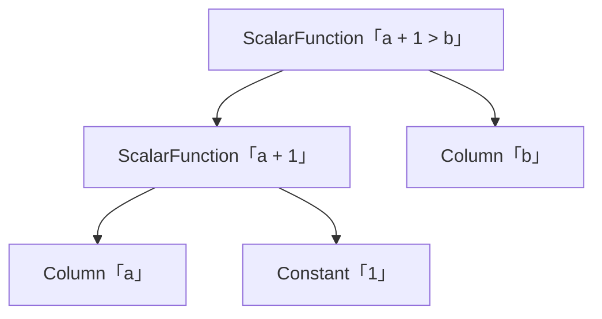

# 第6章 式、型、スキーマ参照

> **本章で読むソース**
>
> - [`pkg/expression/expression.go`](https://github.com/pingcap/tidb/blob/v8.5.6/pkg/expression/expression.go)
> - [`pkg/expression/scalar_function.go`](https://github.com/pingcap/tidb/blob/v8.5.6/pkg/expression/scalar_function.go)
> - [`pkg/expression/column.go`](https://github.com/pingcap/tidb/blob/v8.5.6/pkg/expression/column.go)
> - [`pkg/expression/constant.go`](https://github.com/pingcap/tidb/blob/v8.5.6/pkg/expression/constant.go)
> - [`pkg/types/field_type.go`](https://github.com/pingcap/tidb/blob/v8.5.6/pkg/types/field_type.go)
> - [`pkg/parser/types/field_type.go`](https://github.com/pingcap/tidb/blob/v8.5.6/pkg/parser/types/field_type.go)
> - [`pkg/infoschema/interface.go`](https://github.com/pingcap/tidb/blob/v8.5.6/pkg/infoschema/interface.go)
> - [`pkg/infoschema/infoschema.go`](https://github.com/pingcap/tidb/blob/v8.5.6/pkg/infoschema/infoschema.go)

## この章の狙い

`WHERE a + 1 > b` の `a + 1 > b` のような計算式は、オプティマイザがプランを書き換えるときも、エグゼキュータが各行を判定するときも、同じデータ構造で扱われる。
TiDB はこの計算式を `Expression` インターフェースとして表現し、列参照、定数、関数呼び出しの3系統で組み立てる。
本章では、その3系統の構造と評価の仕組み、評価結果の型を決める型システム、そして式が参照するテーブルの定義をどこから引くかを読む。

AST 上の列名 `a` が、どの段階でどの列を指す `Column` へ解決されるかは第7章で扱う。
本章は式と型そのものの表現に集中し、解決の入口となるスキーマ参照までを範囲とする。

## 前提

第4章でパーサが SQL を AST へ変換し、第5章でプリペアドステートメントのプランキャッシュを読んだ。
本章の `Expression` は、AST を解析した後に構築される実行時の計算式であり、AST のノードそのものではない。
TiDB が行データを表現する `chunk` 型（列指向のバッファ）は第12章で扱う。
本章では、式の評価が `chunk.Row`（1行を指す参照）と `chunk.Column`（列1本ぶんのバッファ）を入出力に取ることだけを前提とする。

## `Expression` インターフェースと3系統

`Expression` は、SQL に現れるすべてのスカラ式を表すインターフェースである。

[`pkg/expression/expression.go` L170-L179](https://github.com/pingcap/tidb/blob/v8.5.6/pkg/expression/expression.go#L170-L179)

```go
// Expression represents all scalar expression in SQL.
type Expression interface {
	VecExpr
	CollationInfo
	base.HashEquals

	Traverse(TraverseAction) Expression

	// Eval evaluates an expression through a row.
	Eval(ctx EvalContext, row chunk.Row) (types.Datum, error)
```

`Eval` は1行 `chunk.Row` を受け取り、評価結果を `types.Datum`（型情報付きの値の入れ物）として返す。
このインターフェースを実装するのは、次の3系統である。

`Column` は、入力行の特定の位置から値を取り出す列参照である。
`Constant` は、`1` や `'abc'` のような定数である。
`ScalarFunction` は、`a + 1` や `substring(b, 5, 3)` のような関数呼び出しであり、引数として別の `Expression` を持つ。

3系統が同じインターフェースを実装するため、`ScalarFunction` の引数には `Column` も `Constant` も別の `ScalarFunction` も入る。
こうして式は木構造になり、葉が `Column` と `Constant`、内部ノードが `ScalarFunction` になる。



### 型ごとの評価メソッド

`Eval` は結果を `Datum` で返すが、`Datum` は値を `interface{}` 相当で包むため、取り出すたびに型の場合分けとメモリ確保が要る。
これを避けるため、`Expression` は戻り値の型を固定した評価メソッドを別に持つ。

[`pkg/expression/expression.go` L181-L188](https://github.com/pingcap/tidb/blob/v8.5.6/pkg/expression/expression.go#L181-L188)

```go
	// EvalInt returns the int64 representation of expression.
	EvalInt(ctx EvalContext, row chunk.Row) (val int64, isNull bool, err error)

	// EvalReal returns the float64 representation of expression.
	EvalReal(ctx EvalContext, row chunk.Row) (val float64, isNull bool, err error)

	// EvalString returns the string representation of expression.
	EvalString(ctx EvalContext, row chunk.Row) (val string, isNull bool, err error)
```

`EvalInt` は `int64` を直接返し、SQL の NULL は2番目の戻り値 `isNull` で表す。
`Datum` を経由しないため、整数を返す式の評価で値を箱に詰める必要がない。
同様に `EvalReal`、`EvalString`、`EvalDecimal`、`EvalTime`、`EvalDuration`、`EvalJSON` が型ごとに用意されている。

呼び出し側は、式が返す型を見てどの `Eval*` を呼ぶかを決める。
`ScalarFunction` の `Eval` は、この振り分けを実装の内側で行っている。

[`pkg/expression/scalar_function.go` L445-L474](https://github.com/pingcap/tidb/blob/v8.5.6/pkg/expression/scalar_function.go#L445-L474)

```go
func (sf *ScalarFunction) Eval(ctx EvalContext, row chunk.Row) (d types.Datum, err error) {
	var (
		res    any
		isNull bool
	)
	intest.AssertNotNil(ctx)
	switch tp, evalType := sf.GetType(ctx), sf.GetType(ctx).EvalType(); evalType {
	case types.ETInt:
		var intRes int64
		intRes, isNull, err = sf.EvalInt(ctx, row)
		if mysql.HasUnsignedFlag(tp.GetFlag()) {
			res = uint64(intRes)
		} else {
			res = intRes
		}
	case types.ETReal:
		res, isNull, err = sf.EvalReal(ctx, row)
	case types.ETDecimal:
		res, isNull, err = sf.EvalDecimal(ctx, row)
	case types.ETDatetime, types.ETTimestamp:
		res, isNull, err = sf.EvalTime(ctx, row)
	case types.ETDuration:
		res, isNull, err = sf.EvalDuration(ctx, row)
	case types.ETJson:
		res, isNull, err = sf.EvalJSON(ctx, row)
	case types.ETVectorFloat32:
		res, isNull, err = sf.EvalVectorFloat32(ctx, row)
	case types.ETString:
		var str string
		str, isNull, err = sf.EvalString(ctx, row)
```

`sf.GetType(ctx).EvalType()` で式の評価型を求め、その型に対応する `Eval*` へ分岐する。
`ETInt` なら `EvalInt`、`ETReal` なら `EvalReal` を呼び、結果を最後に `Datum` へ詰め直す。
評価型 `EvalType` がどう決まるかは、後の型システムの節で読む。

## `Column`、`Constant`、`ScalarFunction`

### `Column` は行の位置から値を引く

`Column` は列参照を表す。

[`pkg/expression/column.go` L276-L285](https://github.com/pingcap/tidb/blob/v8.5.6/pkg/expression/column.go#L276-L285)

```go
type Column struct {
	RetType *types.FieldType `plan-cache-clone:"shallow"`
	// ID is used to specify whether this column is ExtraHandleColumn or to access histogram.
	// We'll try to remove it in the future.
	ID int64
	// UniqueID is the unique id of this column.
	UniqueID int64

	// Index is used for execution, to tell the column's position in the given row.
	Index int
```

`RetType` がこの列の型、`Index` が入力行の中での位置である。
評価は、この `Index` を使って行から値を取り出すだけで済む。

[`pkg/expression/column.go` L542-L559](https://github.com/pingcap/tidb/blob/v8.5.6/pkg/expression/column.go#L542-L559)

```go
func (col *Column) EvalInt(ctx EvalContext, row chunk.Row) (int64, bool, error) {
	if col.GetType(ctx).Hybrid() {
		val := row.GetDatum(col.Index, col.RetType)
		if val.IsNull() {
			return 0, true, nil
		}
		if val.Kind() == types.KindMysqlBit {
			val, err := val.GetBinaryLiteral().ToInt(typeCtx(ctx))
			return int64(val), err != nil, err
		}
		res, err := val.ToInt64(typeCtx(ctx))
		return res, err != nil, err
	}
	if row.IsNull(col.Index) {
		return 0, true, nil
	}
	return row.GetInt64(col.Index), false, nil
}
```

通常の整数列なら、`row.IsNull(col.Index)` で NULL を確認し、`row.GetInt64(col.Index)` で値を返す。
`UniqueID` は列を識別する一意の番号で、二つの `Column` が同じ列かどうかは `UniqueID` の一致で判定する。
`Index` は実行時の行内位置であり、プランが確定するまでは仮の値で、後から入力スキーマに対して解決される。
この解決を行う `ResolveIndices` の流れは第7章で扱う。

`Column` の説明に出てきたインデックス（`Index`）は、行内の位置という意味であり、テーブルのインデックス（索引）とは別物である。
テーブルの索引列は `IsPrefix` フラグなどで区別され、同じ `column.go` 内に定義されている。

### `Constant` は値を直接持つ

`Constant` は定数を表す。

[`pkg/expression/constant.go` L143-L156](https://github.com/pingcap/tidb/blob/v8.5.6/pkg/expression/constant.go#L143-L156)

```go
type Constant struct {
	Value   types.Datum
	RetType *types.FieldType `plan-cache-clone:"shallow"`
	// DeferredExpr holds deferred function in PlanCache cached plan.
	// it's only used to represent non-deterministic functions(see expression.DeferredFunctions)
	// in PlanCache cached plan, so let them can be evaluated until cached item be used.
	DeferredExpr Expression
	// ParamMarker holds param index inside sessionVars.PreparedParams.
	// It's only used to reference a user variable provided in the `EXECUTE` statement or `COM_EXECUTE` binary protocol.
	ParamMarker *ParamMarker
	hashcode    []byte

	collationInfo
}
```

`Value` に評価結果の値を、`RetType` に型を持つ。
プリペアドステートメントの `?` プレースホルダは `ParamMarker` として表され、実行時に与えられた値を引く。
プランキャッシュとの関係で評価を遅らせる必要がある関数は `DeferredExpr` に保持し、キャッシュされたプランが使われる時点で評価する。
この遅延評価が必要になる背景は第5章のプランキャッシュで扱った。

### `ScalarFunction` は関数呼び出し

`ScalarFunction` は関数呼び出しを表す。

[`pkg/expression/scalar_function.go` L41-L49](https://github.com/pingcap/tidb/blob/v8.5.6/pkg/expression/scalar_function.go#L41-L49)

```go
type ScalarFunction struct {
	FuncName model.CIStr
	// RetType is the type that ScalarFunction returns.
	// TODO: Implement type inference here, now we use ast's return type temporarily.
	RetType           *types.FieldType `plan-cache-clone:"shallow"`
	Function          builtinFunc
	hashcode          []byte
	canonicalhashcode []byte
}
```

`FuncName` が関数名、`RetType` が戻り値の型である。
実際の計算は `Function`（`builtinFunc` インターフェース）が担い、引数はその内部に保持される。
`EvalInt` の呼び出しは `Function.evalInt` へ委譲され、関数ごとの実装に届く。
引数自体が `Expression` なので、`a + 1` の `a + 1` を評価するには、まず引数の `Column` と `Constant` を評価し、その結果に加算を適用する。

## 型システム

### `FieldType` が列と式の型を記述する

TiDB の型は `types.FieldType` で記述される。
`types.FieldType` は、パーサ層の `ast.FieldType` への型エイリアスである。

[`pkg/types/field_type.go` L36-L37](https://github.com/pingcap/tidb/blob/v8.5.6/pkg/types/field_type.go#L36-L37)

```go
// FieldType records field type information.
type FieldType = ast.FieldType
```

実体の構造は次のとおりである。

[`pkg/parser/types/field_type.go` L58-L76](https://github.com/pingcap/tidb/blob/v8.5.6/pkg/parser/types/field_type.go#L58-L76)

```go
type FieldType struct {
	// tp is type of the field
	tp byte
	// flag represent NotNull, Unsigned, PriKey flags etc.
	flag uint
	// flen represent size of bytes of the field
	flen int
	// decimal represent decimal length of the field
	decimal int
	// charset represent character set
	charset string
	// collate represent collate rules of the charset
	collate string
	// elems is the element list for enum and set type.
	elems            []string
	elemsIsBinaryLit []bool
	array            bool
	// Please keep in mind that jsonFieldType should be updated if you add a new field here.
}
```

`tp` が MySQL 由来の型コード、`flag` が NotNull や Unsigned などのフラグ、`flen` と `decimal` が桁数と小数部の長さである。
`charset` と `collate` は文字列型の文字集合と照合順序を持つ。
列の型も式の戻り値の型も、すべてこの `FieldType` で表される。

### `EvalType` が評価メソッドの選択を決める

`FieldType` は MySQL の細かい型コードを持つが、式の評価では何十種類もの型コードを直接さばくのは煩雑である。
そこで評価の都合に合わせて、型コードを少数の評価型 `EvalType` に畳み込む。
`ScalarFunction.Eval` が分岐に使っていた `EvalType()` は、この変換を行う。

[`pkg/parser/types/field_type.go` L429-L454](https://github.com/pingcap/tidb/blob/v8.5.6/pkg/parser/types/field_type.go#L429-L454)

```go
func (ft *FieldType) EvalType() EvalType {
	switch ft.GetType() {
	case mysql.TypeTiny, mysql.TypeShort, mysql.TypeInt24, mysql.TypeLong, mysql.TypeLonglong,
		mysql.TypeBit, mysql.TypeYear:
		return ETInt
	case mysql.TypeFloat, mysql.TypeDouble:
		return ETReal
	case mysql.TypeNewDecimal:
		return ETDecimal
	case mysql.TypeDate, mysql.TypeDatetime:
		return ETDatetime
	case mysql.TypeTimestamp:
		return ETTimestamp
	case mysql.TypeDuration:
		return ETDuration
	case mysql.TypeJSON:
		return ETJson
	case mysql.TypeTiDBVectorFloat32:
		return ETVectorFloat32
	case mysql.TypeEnum, mysql.TypeSet:
		if ft.flag&mysql.EnumSetAsIntFlag > 0 {
			return ETInt
		}
	}
	return ETString
}
```

`TypeTiny` から `TypeLonglong` までの整数系や `TypeYear` は `ETInt` に、`TypeFloat` と `TypeDouble` は `ETReal` にまとまる。
この `ETInt` や `ETReal` が、先に読んだ `EvalInt`、`EvalReal` のどれを呼ぶかと対応する。
式の評価が「型コードごと」ではなく「評価型ごと」の分岐で済むのは、この畳み込みがあるためである。

評価時の型変換も `FieldType` を起点に進む。
`a + 1` で `a` が `DECIMAL`、`1` が整数であれば、関数の構築時に引数と戻り値の `FieldType` が決まり、評価ではその型に沿って計算される。
この型推論は関数ごとの構築処理が担い、本章では `FieldType` が型変換の入力になる点までを読む。

## スキーマ参照

### `InfoSchema` からテーブル定義を引く

式が参照する列は、どこかのテーブルに属する。
そのテーブルの定義は、ある時点のスキーマ全体のスナップショットである `InfoSchema` から引く。

[`pkg/infoschema/interface.go` L29-L46](https://github.com/pingcap/tidb/blob/v8.5.6/pkg/infoschema/interface.go#L29-L46)

```go
type InfoSchema interface {
	context.MetaOnlyInfoSchema
	TableByName(ctx stdctx.Context, schema, table pmodel.CIStr) (table.Table, error)
	TableByID(ctx stdctx.Context, id int64) (table.Table, bool)
	// TableItemByID returns a lightweight table meta specified by the given ID,
	// without loading the whole info from storage.
	// So it's all in memory operation. No need to worry about network or disk cost.
	TableItemByID(id int64) (TableItem, bool)
	// TableIDByPartitionID is a pure memory operation, returns the table ID by the partition ID.
	// It's all in memory operation. No need to worry about network or disk cost.
	TableIDByPartitionID(partitionID int64) (tableID int64, ok bool)
	FindTableByPartitionID(partitionID int64) (table.Table, *model.DBInfo, *model.PartitionDefinition)
	// TableItemByPartitionID returns a lightweight table meta specified by the partition ID,
	// without loading the whole info from storage.
	// So it's all in memory operation. No need to worry about network or disk cost.
	TableItemByPartitionID(partitionID int64) (TableItem, bool)
	base() *infoSchema
}
```

`TableByName` はデータベース名とテーブル名を受け取り、`table.Table`（テーブルの実装）を返す。
コメントが述べるとおり、これらの参照はすべてメモリ上の操作であり、ネットワークやディスクのコストはかからない。
スキーマ全体をメモリに保持し、クエリのたびにテーブル定義を引いてもストレージへ問い合わせないのが、この参照を軽くしている仕組みである。

`TableByName` の実体は、名前を二段のマップで引くだけである。

[`pkg/infoschema/infoschema.go` L230-L237](https://github.com/pingcap/tidb/blob/v8.5.6/pkg/infoschema/infoschema.go#L230-L237)

```go
func (is *infoSchema) TableByName(ctx stdctx.Context, schema, table pmodel.CIStr) (t table.Table, err error) {
	if tbNames, ok := is.schemaMap[schema.L]; ok {
		if t, ok = tbNames.tables[table.L]; ok {
			return
		}
	}
	return nil, ErrTableNotExists.FastGenByArgs(schema, table)
}
```

`is.schemaMap[schema.L]` でデータベースを引き、その中の `tables[table.L]` でテーブルを引く。
`schema.L` と `table.L` は名前を小文字化したキーであり、大文字小文字を区別しないテーブル名の照合をマップのキーで実現している。
見つからなければ `ErrTableNotExists` を返す。

引いた `table.Table` から `Meta()` をたどると `TableInfo`（テーブルのメタデータ）が得られ、その列定義 `ColumnInfo` が各列の `FieldType` を持つ。
`InfoSchema` を介して `TableByName` から `TableInfo` へ至り、列の `FieldType` を式の `Column` の `RetType` に与える。
こうして列参照とその型が、テーブル定義に結び付く。

### AST の列名から `Column` への解決は第7章へ

`SELECT a FROM t` の `a` という名前を、`t` のどの列の `Column` に対応させるかは、本章の式の表現とは別の処理である。
`InfoSchema` から引いた `TableInfo` を入力スキーマに変換し、AST の列名を `Column` へ束ねる解決の流れは第7章で扱う。
本章では、式が参照する列の型がどこから来るか、つまり `InfoSchema` から `TableInfo` を経て `FieldType` に至る経路までを読んだ。

## 高速化の工夫 ベクトル化評価

式の評価には、1行ずつの `Eval*` のほかに、列単位でまとめて評価する `VecEval*` がある。

[`pkg/expression/expression.go` L117-L129](https://github.com/pingcap/tidb/blob/v8.5.6/pkg/expression/expression.go#L117-L129)

```go
// VecExpr contains all vectorized evaluation methods.
type VecExpr interface {
	// Vectorized returns if this expression supports vectorized evaluation.
	Vectorized() bool

	// VecEvalInt evaluates this expression in a vectorized manner.
	VecEvalInt(ctx EvalContext, input *chunk.Chunk, result *chunk.Column) error

	// VecEvalReal evaluates this expression in a vectorized manner.
	VecEvalReal(ctx EvalContext, input *chunk.Chunk, result *chunk.Column) error

	// VecEvalString evaluates this expression in a vectorized manner.
	VecEvalString(ctx EvalContext, input *chunk.Chunk, result *chunk.Column) error
```

`VecEvalInt` は1行 `chunk.Row` ではなく、複数行をまとめた `chunk.Chunk` を入力に取り、結果を列1本ぶんの `chunk.Column` に書く。
1行ごとにインターフェースメソッドを呼ぶと、その回数だけ仮想呼び出しと型判定が発生する。
列単位で評価すれば、その分岐が列ごとに一度で済み、内側のループは値の配列を素直に走査できる。
これが行ループのオーバーヘッドを減らす仕組みである。

`Column` のベクトル化評価は、入力チャンクの該当列をそのまま結果へ写すだけで済む。

[`pkg/expression/column.go` L352-L353](https://github.com/pingcap/tidb/blob/v8.5.6/pkg/expression/column.go#L352-L353)

```go
	input.Column(col.Index).CopyReconstruct(input.Sel(), result)
	return nil
```

`input.Column(col.Index)` で列を取り出し、`CopyReconstruct` で結果列へコピーする。
列参照の評価が、行を1つずつ取り出すループではなく、列のコピー一回に畳み込まれている。

評価を1行ずつ行うか列単位で行うかは、式がベクトル化に対応するか（`Vectorized()`）と、セッションでベクトル化が有効かによって切り替わる。
この切り替えと、ベクトル化実行モデル全体の構造は第12章で扱う。

## まとめ

TiDB の式は `Expression` インターフェースで表され、列参照 `Column`、定数 `Constant`、関数呼び出し `ScalarFunction` の3系統が同じインターフェースを実装する。
3系統が同じ型を実装するため、式は `ScalarFunction` を内部ノードとする木構造になる。
評価は `Datum` を返す `Eval` のほか、型ごとに `EvalInt` や `EvalString` を持ち、`Datum` を経由しない経路で箱詰めを避ける。
どの `Eval*` を呼ぶかは、`FieldType` を評価型 `EvalType` に畳み込んだ結果で決まる。
式が参照する列の型は、`InfoSchema` の `TableByName` から `TableInfo` を引き、列の `FieldType` をたどって得る。
列単位の `VecEval*` は、1行ごとのインターフェース呼び出しを列ごとの一度の分岐に畳み込み、行ループのオーバーヘッドを減らす。

## 関連する章

- [第5章 プリペアドステートメントとプランキャッシュ](05-prepared-and-plan-cache.md)：`Constant` の `ParamMarker` と `DeferredExpr` がプランキャッシュとどう関わるかを扱う。
- [第7章 論理プランと論理最適化（RBO）](../part02-optimizer/07-logical-optimization.md)：AST の列名から `Column` への解決と、`ResolveIndices` による `Index` の確定を扱う。
- [第12章 ベクトル化実行モデル](../part03-executor/12-vectorized-execution.md)：`VecEval*` を使ったチャンク単位の実行と、評価経路の切り替えを扱う。
