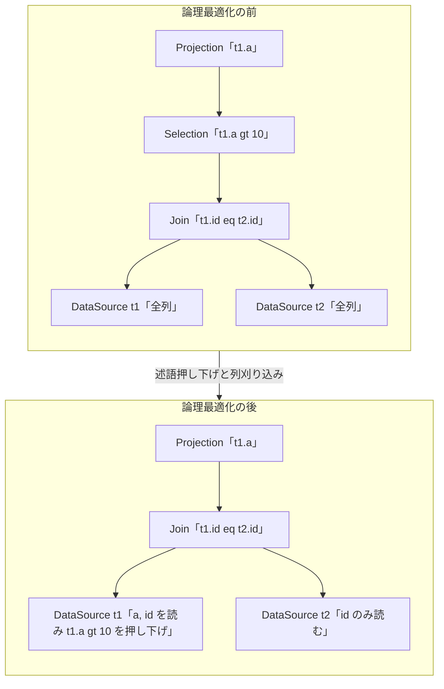

# 第7章 論理プランと論理最適化（RBO）

> **本章で読むソース**
>
> - [`pkg/planner/core/optimizer.go`](https://github.com/pingcap/tidb/blob/v8.5.6/pkg/planner/core/optimizer.go)
> - [`pkg/planner/core/base/plan_base.go`](https://github.com/pingcap/tidb/blob/v8.5.6/pkg/planner/core/base/plan_base.go)
> - [`pkg/planner/core/rule_predicate_push_down.go`](https://github.com/pingcap/tidb/blob/v8.5.6/pkg/planner/core/rule_predicate_push_down.go)
> - [`pkg/planner/core/rule_column_pruning.go`](https://github.com/pingcap/tidb/blob/v8.5.6/pkg/planner/core/rule_column_pruning.go)
> - [`pkg/planner/core/rule_decorrelate.go`](https://github.com/pingcap/tidb/blob/v8.5.6/pkg/planner/core/rule_decorrelate.go)
> - [`pkg/planner/core/operator/logicalop/base_logical_plan.go`](https://github.com/pingcap/tidb/blob/v8.5.6/pkg/planner/core/operator/logicalop/base_logical_plan.go)
> - [`pkg/planner/core/operator/logicalop/logical_selection.go`](https://github.com/pingcap/tidb/blob/v8.5.6/pkg/planner/core/operator/logicalop/logical_selection.go)
> - [`pkg/planner/core/operator/logicalop/logical_datasource.go`](https://github.com/pingcap/tidb/blob/v8.5.6/pkg/planner/core/operator/logicalop/logical_datasource.go)
> - [`pkg/planner/core/operator/logicalop/logical_join.go`](https://github.com/pingcap/tidb/blob/v8.5.6/pkg/planner/core/operator/logicalop/logical_join.go)
> - [`pkg/planner/core/operator/logicalop/logical_plans_misc.go`](https://github.com/pingcap/tidb/blob/v8.5.6/pkg/planner/core/operator/logicalop/logical_plans_misc.go)

## この章の狙い

SQL は「どの行が欲しいか」だけを書き、「どの順序でどう取り出すか」は書かない。
オプティマイザは、その宣言的な問い合わせを実行可能な手順へ変換する。

TiDB はこの変換を2段に分ける。
前半が本章の**論理最適化**で、プランの意味を変えずに形を整える**ルールベース最適化**（RBO、rule based optimization）である。
後半が次章以降の物理最適化で、統計情報とコストを使って実際の演算子を選ぶ。

論理最適化は、AST から組み立てた**論理プラン**の木に対して、述語の押し下げや不要な列の刈り込みといったルールを順に適用する。
どのルールも、出力結果を変えずに、後続の処理が扱う行数や列数を減らす方向へ木を書き換える。
本章では、AST から論理プランを作る入口を簡潔に押さえてから、論理最適化の制御ループ `logicalOptimize` と、代表的なルールを2つ、各演算子が再帰的に処理する仕組みのレベルで読む。

## 前提

第4章でパーサが SQL を AST へ変換し、第6章で式の表現とスキーマ参照を読んだ。
本章は、その式とスキーマを使って組み立てた論理プランを入力にする。
論理プランの各ノードは `LogicalSelection`（絞り込み）、`DataSource`（テーブルスキャン）、`LogicalJoin`（結合）のような論理演算子であり、いずれも `base.LogicalPlan` インターフェースを満たす木のノードである。

物理最適化、統計情報、コスト計算は第8章と第9章で扱う。
本章は、コストを使わずに常に適用してよい書き換えだけを範囲とする。

## AST から論理プランへ

論理最適化の前段として、`PlanBuilder` が AST を論理プランの木へ変換する。
入口は `PlanBuilder.Build` で、文の種類で分岐しながら対応する論理演算子を組み立てる。

[`pkg/planner/core/planbuilder.go` L527-L531](https://github.com/pingcap/tidb/blob/v8.5.6/pkg/planner/core/planbuilder.go#L527-L531)

```go
func (b *PlanBuilder) Build(ctx context.Context, node *resolve.NodeW) (base.Plan, error) {
	// Build might be called recursively, right now they all share the same resolve
	// context, so it's ok to override it.
	b.resolveCtx = node.GetResolveContext()
	b.optFlag |= rule.FlagPruneColumns
```

この段階で、第6章で述べた式とスキーマの解決が行われる。
AST 上に文字列として現れた列名は、所属するテーブルのスキーマを引き当てて、一意な ID を持つ `Column` へ解決される。
解決後の列参照は、論理プランのどのノードでも同じ `Column` を指すため、ルールが木を書き換えても参照の同一性が保たれる。

組み立て直後の論理プランは、SQL の構文をほぼそのまま写した形になっている。
`WHERE` 句は最上位に近い `LogicalSelection` として置かれ、`SELECT` する列の数だけ各ノードがスキーマを持つ。
この素朴な木を、後続の論理最適化が実行に適した形へ整える。

## 論理最適化の制御ループ `logicalOptimize`

論理最適化の本体は `logicalOptimize` である。
ルールの一覧 `optRuleList` を先頭から順にたどり、有効なルールだけをプランへ適用する。

[`pkg/planner/core/optimizer.go` L1004-L1022](https://github.com/pingcap/tidb/blob/v8.5.6/pkg/planner/core/optimizer.go#L1004-L1022)

```go
	for i, rule := range optRuleList {
		// The order of flags is same as the order of optRule in the list.
		// We use a bitmask to record which opt rules should be used. If the i-th bit is 1, it means we should
		// apply i-th optimizing rule.
		if flag&(1<<uint(i)) == 0 || isLogicalRuleDisabled(rule) {
			continue
		}
		opt.AppendBeforeRuleOptimize(i, rule.Name(), logic.BuildPlanTrace)
		var planChanged bool
		logic, planChanged, err = rule.Optimize(ctx, logic, opt)
		if err != nil {
			return nil, err
		}
		// Compute interaction rules that should be optimized again
		interactionRule, ok := optInteractionRuleList[rule]
		if planChanged && ok && isLogicalRuleDisabled(interactionRule) {
			againRuleList = append(againRuleList, interactionRule)
		}
	}
```

各ルールの有効化は、`flag` のビットマスクで制御する。
`optRuleList` の `i` 番目のルールは `flag` の `i` ビット目に対応し、ビットが立っていなければ `continue` で飛ばす。
この対応のため、ルールの並び順と `flag` のビットの並び順は一致させてある。

適用するルール群は固定された配列で定義される。

[`pkg/planner/core/optimizer.go` L78-L104](https://github.com/pingcap/tidb/blob/v8.5.6/pkg/planner/core/optimizer.go#L78-L104)

```go
var optRuleList = []base.LogicalOptRule{
	&GcSubstituter{},
	&ColumnPruner{},
	&ResultReorder{},
	&rule.BuildKeySolver{},
	&DecorrelateSolver{},
	&SemiJoinRewriter{},
	&AggregationEliminator{},
	&SkewDistinctAggRewriter{},
	&ProjectionEliminator{},
	&MaxMinEliminator{},
	&rule.ConstantPropagationSolver{},
	&ConvertOuterToInnerJoin{},
	&PPDSolver{},
	&OuterJoinEliminator{},
	&PartitionProcessor{},
	&CollectPredicateColumnsPoint{},
	&AggregationPushDownSolver{},
	&DeriveTopNFromWindow{},
	&PredicateSimplification{},
	&PushDownTopNOptimizer{},
	&SyncWaitStatsLoadPoint{},
	&JoinReOrderSolver{},
	&ColumnPruner{}, // column pruning again at last, note it will mess up the results of buildKeySolver
	&PushDownSequenceSolver{},
	&ResolveExpand{},
}
```

この配列の順序がルール適用の順序である。
相関サブクエリの結合変換 `DecorrelateSolver`、述語押し下げ `PPDSolver`、列の刈り込み `ColumnPruner` などが並んでいる。
`ColumnPruner` は配列の先頭と末尾の2回現れる。
先に1回刈り込んでおき、他のルールが新たに不要な列を生んだあと、末尾でもう一度刈り込むためである。

各ルールは `base.LogicalOptRule` インターフェースを満たし、`Optimize` で木を受け取って書き換えた木を返す。
`logicalOptimize` 自身は個々のルールの中身を知らず、配列を順に呼び出すだけの薄い制御ループになっている。
ルールの実装を1つずつ独立した型に分けることで、ルールの追加や無効化を配列とビットマスクの操作だけで行える。

論理最適化を終えた木は `doOptimize` がそのまま物理最適化へ渡す。

[`pkg/planner/core/optimizer.go` L277-L291](https://github.com/pingcap/tidb/blob/v8.5.6/pkg/planner/core/optimizer.go#L277-L291)

```go
	flag = adjustOptimizationFlags(flag, logic)
	logic, err := logicalOptimize(ctx, flag, logic)
	if err != nil {
		return nil, nil, 0, err
	}

	if !AllowCartesianProduct.Load() && existsCartesianProduct(logic) {
		return nil, nil, 0, errors.Trace(plannererrors.ErrCartesianProductUnsupported)
	}
	failpoint.Inject("ConsumeVolcanoOptimizePanic", nil)
	planCounter := base.PlanCounterTp(sessVars.StmtCtx.StmtHints.ForceNthPlan)
	if planCounter == 0 {
		planCounter = -1
	}
	physical, cost, err := physicalOptimize(logic, &planCounter)
```

## ルールが演算子をたどる仕組み

代表的な2つのルールに入る前に、ルールが木をどうたどるかを押さえる。
`LogicalPlan` インターフェースは、論理最適化で使うメソッドを各演算子に課す。
そのうち本章で読むのは `PredicatePushDown` と `PruneColumns` である。

[`pkg/planner/core/base/plan_base.go` L205-L211](https://github.com/pingcap/tidb/blob/v8.5.6/pkg/planner/core/base/plan_base.go#L205-L211)

```go
	// PredicatePushDown pushes down the predicates in the where/on/having clauses as deeply as possible.
	// It will accept a predicate that is an expression slice, and return the expressions that can't be pushed.
	// Because it might change the root if the having clause exists, we need to return a plan that represents a new root.
	PredicatePushDown([]expression.Expression, *optimizetrace.LogicalOptimizeOp) ([]expression.Expression, LogicalPlan)

	// PruneColumns prunes the unused columns, and return the new logical plan if changed, otherwise it's same.
	PruneColumns([]*expression.Column, *optimizetrace.LogicalOptimizeOp) (LogicalPlan, error)
```

ルール本体は木の根でこのメソッドを1回呼ぶだけである。
あとは各演算子の実装が、自分の処理を済ませてから子に同じメソッドを呼ぶ。
この再帰によって、1回の呼び出しが木全体をたどる。

演算子ごとに固有の振る舞いがないときは、`BaseLogicalPlan` の既定実装が使われる。
`PredicatePushDown` の既定実装は、受け取った述語をそのまま子へ渡し、子が押し下げきれずに返した述語を、子の上に `LogicalSelection` として被せる。

[`pkg/planner/core/operator/logicalop/base_logical_plan.go` L119-L127](https://github.com/pingcap/tidb/blob/v8.5.6/pkg/planner/core/operator/logicalop/base_logical_plan.go#L119-L127)

```go
func (p *BaseLogicalPlan) PredicatePushDown(predicates []expression.Expression, opt *optimizetrace.LogicalOptimizeOp) ([]expression.Expression, base.LogicalPlan) {
	if len(p.children) == 0 {
		return predicates, p.self
	}
	child := p.children[0]
	rest, newChild := child.PredicatePushDown(predicates, opt)
	AddSelection(p.self, newChild, rest, 0, opt)
	return nil, p.self
}
```

この被せ直しを担うのが `AddSelection` で、押し下げ先で受け取れなかった述語があるときだけ新しい `LogicalSelection` を作る。

[`pkg/planner/core/operator/logicalop/logical_plans_misc.go` L85-L108](https://github.com/pingcap/tidb/blob/v8.5.6/pkg/planner/core/operator/logicalop/logical_plans_misc.go#L85-L108)

```go
func AddSelection(p base.LogicalPlan, child base.LogicalPlan, conditions []expression.Expression, chIdx int, opt *optimizetrace.LogicalOptimizeOp) {
	if len(conditions) == 0 {
		p.Children()[chIdx] = child
		return
	}
	conditions = expression.PropagateConstant(p.SCtx().GetExprCtx(), conditions)
	// Return table dual when filter is constant false or null.
	dual := Conds2TableDual(child, conditions)
	if dual != nil {
		p.Children()[chIdx] = dual
		AppendTableDualTraceStep(child, dual, conditions, opt)
		return
	}

	conditions = constraint.DeleteTrueExprs(p, conditions)
	if len(conditions) == 0 {
		p.Children()[chIdx] = child
		return
	}
	selection := LogicalSelection{Conditions: conditions}.Init(p.SCtx(), p.QueryBlockOffset())
	selection.SetChildren(child)
	p.Children()[chIdx] = selection
	AppendAddSelectionTraceStep(p, child, selection, opt)
}
```

## 述語押し下げ（predicate push down）

述語押し下げは、`WHERE` などの絞り込み条件を、木の上から下のスキャンへできるだけ近づけるルールである。
ルールの入口 `PPDSolver.Optimize` は、木の根で `PredicatePushDown` を1回呼ぶだけである。

[`pkg/planner/core/rule_predicate_push_down.go` L44-L48](https://github.com/pingcap/tidb/blob/v8.5.6/pkg/planner/core/rule_predicate_push_down.go#L44-L48)

```go
func (*PPDSolver) Optimize(_ context.Context, lp base.LogicalPlan, opt *optimizetrace.LogicalOptimizeOp) (base.LogicalPlan, bool, error) {
	planChanged := false
	_, p := lp.PredicatePushDown(nil, opt)
	return p, planChanged, nil
}
```

最初の引数が `nil` なのは、根の上には押し下げるべき外側の述語がないためである。
条件を持つのは木の途中にある `LogicalSelection` であり、押し下げはそこから始まる。

`LogicalSelection.PredicatePushDown` は、自分の条件を上から来た述語に合流させ、まとめて子へ押し下げようとする。

[`pkg/planner/core/operator/logicalop/logical_selection.go` L98-L121](https://github.com/pingcap/tidb/blob/v8.5.6/pkg/planner/core/operator/logicalop/logical_selection.go#L98-L121)

```go
func (p *LogicalSelection) PredicatePushDown(predicates []expression.Expression, opt *optimizetrace.LogicalOptimizeOp) ([]expression.Expression, base.LogicalPlan) {
	predicates = constraint.DeleteTrueExprs(p, predicates)
	p.Conditions = constraint.DeleteTrueExprs(p, p.Conditions)
	var child base.LogicalPlan
	var retConditions []expression.Expression
	var originConditions []expression.Expression
	canBePushDown, canNotBePushDown := splitSetGetVarFunc(p.Conditions)
	originConditions = canBePushDown
	retConditions, child = p.Children()[0].PredicatePushDown(append(canBePushDown, predicates...), opt)
	retConditions = append(retConditions, canNotBePushDown...)
	exprCtx := p.SCtx().GetExprCtx()
	if len(retConditions) > 0 {
		p.Conditions = expression.PropagateConstant(exprCtx, retConditions)
		// Return table dual when filter is constant false or null.
		dual := Conds2TableDual(p, p.Conditions)
		if dual != nil {
			AppendTableDualTraceStep(p, dual, p.Conditions, opt)
			return nil, dual
		}
		return nil, p
	}
	appendSelectionPredicatePushDownTraceStep(p, originConditions, opt)
	return nil, child
}
```

ここで2つの場合に分かれる。
子が条件を受け取りきれず `retConditions` を返したときは、その条件を自分の `Conditions` に保持して `LogicalSelection` を残す。
子が条件をすべて吸収したときは、子が返した述語が空になり、この `LogicalSelection` 自身が不要になるため、子をそのまま返して自分を木から外す。
条件が定数の偽や `NULL` に簡約できたときは、行を返さない `LogicalTableDual` に置き換えて、スキャン自体を省く。

押し下げの終点が `DataSource` である。
`DataSource.PredicatePushDown` は、受け取った述語のうち下層へ送れるものを `PushedDownConds` に確定し、送れなかったものだけを呼び出し元へ返す。

[`pkg/planner/core/operator/logicalop/logical_datasource.go` L219-L229](https://github.com/pingcap/tidb/blob/v8.5.6/pkg/planner/core/operator/logicalop/logical_datasource.go#L219-L229)

```go
func (ds *DataSource) PredicatePushDown(predicates []expression.Expression, opt *optimizetrace.LogicalOptimizeOp) ([]expression.Expression, base.LogicalPlan) {
	predicates = expression.PropagateConstant(ds.SCtx().GetExprCtx(), predicates)
	predicates = constraint.DeleteTrueExprs(ds, predicates)
	// Add tidb_shard() prefix to the condtion for shard index in some scenarios
	// TODO: remove it to the place building logical plan
	predicates = utilfuncp.AddPrefix4ShardIndexes(ds, ds.SCtx(), predicates)
	ds.AllConds = predicates
	ds.PushedDownConds, predicates = expression.PushDownExprs(util.GetPushDownCtx(ds.SCtx()), predicates, kv.UnSpecified)
	appendDataSourcePredicatePushDownTraceStep(ds, opt)
	return predicates, ds
}
```

`PushedDownConds` に入った条件は、後段でスキャンの実行計画に組み込まれ、TiKV のコプロセッサや TiFlash 側で評価される。
これにより、条件を満たさない行を取得する前に弾ける。

結合をまたぐ押し下げには、結合の意味を保つ判断が要る。
`LogicalJoin.PredicatePushDown` は、述語に現れる列がどちらの子に属するかと結合の種類を見て、左右どちらへ送れるかを振り分ける。

[`pkg/planner/core/operator/logicalop/logical_join.go` L204-L227](https://github.com/pingcap/tidb/blob/v8.5.6/pkg/planner/core/operator/logicalop/logical_join.go#L204-L227)

```go
func (p *LogicalJoin) PredicatePushDown(predicates []expression.Expression, opt *optimizetrace.LogicalOptimizeOp) (ret []expression.Expression, retPlan base.LogicalPlan) {
	simplifyOuterJoin(p, predicates)
	var equalCond []*expression.ScalarFunction
	var leftPushCond, rightPushCond, otherCond, leftCond, rightCond []expression.Expression
	switch p.JoinType {
	case LeftOuterJoin, LeftOuterSemiJoin, AntiLeftOuterSemiJoin:
		predicates = p.outerJoinPropConst(predicates)
		dual := Conds2TableDual(p, predicates)
		if dual != nil {
			AppendTableDualTraceStep(p, dual, predicates, opt)
			return ret, dual
		}
		// Handle where conditions
		predicates = expression.ExtractFiltersFromDNFs(p.SCtx().GetExprCtx(), predicates)
		// Only derive left where condition, because right where condition cannot be pushed down
		equalCond, leftPushCond, rightPushCond, otherCond = p.extractOnCondition(predicates, true, false)
		leftCond = leftPushCond
		// Handle join conditions, only derive right join condition, because left join condition cannot be pushed down
		_, derivedRightJoinCond := DeriveOtherConditions(
			p, p.Children()[0].Schema(), p.Children()[1].Schema(), false, true)
		rightCond = append(p.RightConditions, derivedRightJoinCond...)
		p.RightConditions = nil
		ret = append(expression.ScalarFuncs2Exprs(equalCond), otherCond...)
		ret = append(ret, rightPushCond...)
```

外部結合では左右が対称でないため、内部結合と同じには押し下げられない。
左外部結合では、外側である左の `WHERE` 条件だけを左の子へ送り、内側である右へは送らない。
右の `WHERE` 条件を右の子に送ると、結合で `NULL` 補完された行を誤って落としてしまうためである。
このように、押し下げは結合の種類ごとに送れる側を限定して、結果を変えずに行を減らす。

## 列の刈り込み（column pruning）

列の刈り込みは、最終的に使われない列を各演算子のスキーマから取り除くルールである。
入口 `ColumnPruner.Optimize` は、木の根のスキーマ全体を「親が使う列」として `PruneColumns` に渡す。

[`pkg/planner/core/rule_column_pruning.go` L32-L42](https://github.com/pingcap/tidb/blob/v8.5.6/pkg/planner/core/rule_column_pruning.go#L32-L42)

```go
func (*ColumnPruner) Optimize(_ context.Context, lp base.LogicalPlan, opt *optimizetrace.LogicalOptimizeOp) (base.LogicalPlan, bool, error) {
	planChanged := false
	lp, err := lp.PruneColumns(slices.Clone(lp.Schema().Columns), opt)
	if err != nil {
		return nil, planChanged, err
	}
	intest.AssertFunc(func() bool {
		return noZeroColumnLayOut(lp)
	}, "After column pruning, some operator got zero row output. Please fix it.")
	return lp, planChanged, nil
}
```

刈り込みは、述語押し下げとは逆に「親が必要とする列の集合」を上から下へ伝える。
各演算子は、親が要求する列に自分の処理が使う列を足してから子へ渡す。
`LogicalSelection.PruneColumns` は、自分の条件式が参照する列を親の要求に加える。

[`pkg/planner/core/operator/logicalop/logical_selection.go` L124-L133](https://github.com/pingcap/tidb/blob/v8.5.6/pkg/planner/core/operator/logicalop/logical_selection.go#L124-L133)

```go
func (p *LogicalSelection) PruneColumns(parentUsedCols []*expression.Column, opt *optimizetrace.LogicalOptimizeOp) (base.LogicalPlan, error) {
	child := p.Children()[0]
	parentUsedCols = expression.ExtractColumnsFromExpressions(parentUsedCols, p.Conditions, nil)
	var err error
	p.Children()[0], err = child.PruneColumns(parentUsedCols, opt)
	if err != nil {
		return nil, err
	}
	return p, nil
}
```

`ExtractColumnsFromExpressions` で条件式の列を抽出して `parentUsedCols` に足すのは、条件の評価に必要な列を子に残させるためである。
これを忘れると、絞り込みに使う列がスキャンから消えてしまう。

葉の `DataSource` では、伝わってきた要求列の集合をもとに、テーブルから読む列を実際に削る。

[`pkg/planner/core/operator/logicalop/logical_datasource.go` L249-L261](https://github.com/pingcap/tidb/blob/v8.5.6/pkg/planner/core/operator/logicalop/logical_datasource.go#L249-L261)

```go
	for i := len(used) - 1; i >= 0; i-- {
		if !used[i] && !exprUsed[i] {
			// If ds has a shard index, and the column is generated column by `tidb_shard()`
			// it can't prune the generated column of shard index
			if ds.ContainExprPrefixUk &&
				expression.GcColumnExprIsTidbShard(ds.Schema().Columns[i].VirtualExpr) {
				continue
			}
			prunedColumns = append(prunedColumns, ds.Schema().Columns[i])
			ds.Schema().Columns = append(ds.Schema().Columns[:i], ds.Schema().Columns[i+1:]...)
			ds.Columns = append(ds.Columns[:i], ds.Columns[i+1:]...)
		}
	}
```

どこからも要求されず、条件の評価にも使わない列は、スキーマと読み出し列の一覧の両方から外す。
末尾から前へ走査するのは、削除のたびに後ろの添字がずれないようにするためである。
刈り込まれた列は TiKV から取得されなくなり、転送するデータ量とデコードの手間が減る。

## 機構の工夫、葉で行を削り葉で列を削る

論理最適化の効きどころは、述語押し下げと列の刈り込みのいずれも、書き換えの結論が木の葉に集まる点にある。

述語押し下げは、絞り込み条件を `DataSource` の `PushedDownConds` まで運び、スキャンの段で条件を評価させる。
TiKV のコプロセッサや TiFlash が条件を満たさない行をその場で捨てるため、上位の結合や集約には絞り込み後の行だけが届く。
仮に条件を上位に残したままにすると、結合は両側の全行を突き合わせてから条件を適用することになり、突き合わせる行数が条件適用前の規模で膨らむ。
押し下げは、行数が増える前に行を減らすことで、上位演算子の入力規模を小さく保つ。

列の刈り込みは、要求列の集合を根から葉へ伝え、`DataSource` がテーブルから読む列そのものを減らす。
TiKV から TiDB へ転送される列が減り、行ごとのデコードも軽くなる。
どちらのルールも、処理が最も重くなる上位の演算子に渡る前のデータ量を、行と列の両面で削ることをねらっている。

## 相関サブクエリの結合変換（decorrelation）

相関サブクエリは、`DecorrelateSolver` が結合へ変換する。
相関サブクエリは、内側のプランが外側の列を参照する `LogicalApply` として組み立てられる。
`LogicalApply` は外側の各行ごとに内側を評価する演算子であり、そのまま実行すると外側の行数だけ内側が走る。

`DecorrelateSolver.Optimize` は、内側が外側の列に依存していなければ、`LogicalApply` をただの `LogicalJoin` へ置き換える。

[`pkg/planner/core/rule_decorrelate.go` L137-L149](https://github.com/pingcap/tidb/blob/v8.5.6/pkg/planner/core/rule_decorrelate.go#L137-L149)

```go
func (s *DecorrelateSolver) Optimize(ctx context.Context, p base.LogicalPlan, opt *optimizetrace.LogicalOptimizeOp) (base.LogicalPlan, bool, error) {
	planChanged := false
	if apply, ok := p.(*logicalop.LogicalApply); ok {
		outerPlan := apply.Children()[0]
		innerPlan := apply.Children()[1]
		apply.CorCols = coreusage.ExtractCorColumnsBySchema4LogicalPlan(apply.Children()[1], apply.Children()[0].Schema())
		if len(apply.CorCols) == 0 {
			// If the inner plan is non-correlated, the apply will be simplified to join.
			join := &apply.LogicalJoin
			join.SetSelf(join)
			join.SetTP(plancodec.TypeJoin)
			p = join
			appendApplySimplifiedTraceStep(apply, join, opt)
```

依存が残っている場合は、内側の `LogicalSelection` などを外へ引き上げて、相関の参照を結合条件へ移す書き換えを試みる。
変換が成立すれば、外側の各行ごとに内側を回す形が、1回の結合に畳まれる。
結合へ変換できれば、物理最適化が結合アルゴリズムとして効率の良いものを選べるようになり、行ごとの内側評価を避けられる。

## 論理最適化の流れ

ここまでの2つのルールが論理プランをどう書き換えるかを、簡単なクエリで示す。
`SELECT t1.a FROM t1 JOIN t2 ON t1.id = t2.id WHERE t1.a > 10` を例にする。



述語押し下げは `t1.a > 10` を `t1` のスキャンへ運び、独立した `LogicalSelection` を消す。
列の刈り込みは、出力に要る `t1.a` と結合に要る `t1.id`、`t2.id` だけを各スキャンに残し、`t2` 側からは出力にも条件にも使わない列を落とす。
書き換えの後、各スキャンが扱う行と列はいずれも元より少なくなる。

## まとめ

論理最適化は、AST から組み立てた論理プランを、意味を変えずに実行しやすい形へ整えるルールベースの段である。
制御ループ `logicalOptimize` は `optRuleList` のルールをビットマスクで選びながら順に適用し、各ルールは木の根で `PredicatePushDown` や `PruneColumns` を呼ぶだけで木全体をたどる。
述語押し下げは絞り込み条件を葉のスキャンへ運んで早い段で行を削り、列の刈り込みは要求列を葉へ伝えて読む列を削る。
相関サブクエリの結合変換は、行ごとの内側評価を1回の結合へ畳む。
いずれの工夫も、処理が重くなる上位演算子に渡るデータ量を、行と列の両面で減らすことをねらっている。

論理最適化を終えた木は物理最適化へ渡る。
そこで統計情報とコストを使い、各論理演算子に具体的なアルゴリズムを割り当てる。

## 関連する章

- [第6章 式、型、スキーマ参照](../part01-frontend/06-expression-and-schema.md)：論理プランが参照する `Column` への解決と式の表現を扱う。
- [第8章 統計情報とカーディナリティ推定](08-statistics-and-cardinality.md)：物理最適化が使う統計情報と行数推定を扱う。
- [第9章 物理最適化](09-physical-optimization.md)：論理プランへコストを使って物理演算子を割り当てる段を扱う。
