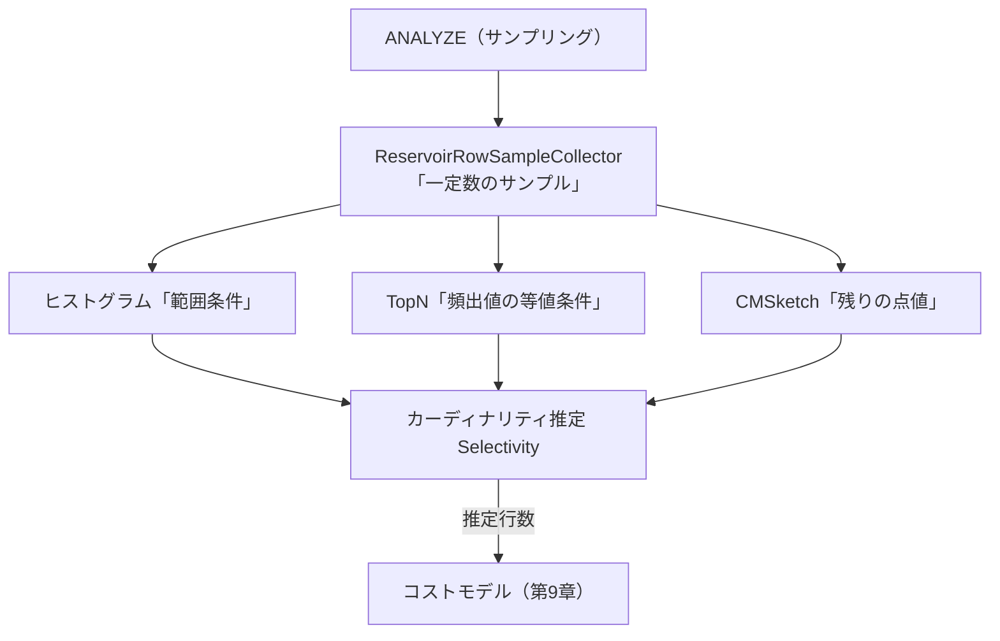

# 第8章 統計情報とカーディナリティ推定

> **本章で読むソース**
>
> - [`pkg/statistics/histogram.go`](https://github.com/pingcap/tidb/blob/v8.5.6/pkg/statistics/histogram.go)
> - [`pkg/statistics/cmsketch.go`](https://github.com/pingcap/tidb/blob/v8.5.6/pkg/statistics/cmsketch.go)
> - [`pkg/statistics/column.go`](https://github.com/pingcap/tidb/blob/v8.5.6/pkg/statistics/column.go)
> - [`pkg/statistics/index.go`](https://github.com/pingcap/tidb/blob/v8.5.6/pkg/statistics/index.go)
> - [`pkg/statistics/row_sampler.go`](https://github.com/pingcap/tidb/blob/v8.5.6/pkg/statistics/row_sampler.go)
> - [`pkg/statistics/builder.go`](https://github.com/pingcap/tidb/blob/v8.5.6/pkg/statistics/builder.go)
> - [`pkg/planner/cardinality/selectivity.go`](https://github.com/pingcap/tidb/blob/v8.5.6/pkg/planner/cardinality/selectivity.go)
> - [`pkg/planner/cardinality/row_count_column.go`](https://github.com/pingcap/tidb/blob/v8.5.6/pkg/planner/cardinality/row_count_column.go)
> - [`pkg/executor/analyze.go`](https://github.com/pingcap/tidb/blob/v8.5.6/pkg/executor/analyze.go)

## この章の狙い

第7章では論理プランを規則で書き換える論理最適化を読んだ。
論理最適化は等価な複数のプランを残すだけで、どれが安いかは決めない。
安さを比べるには、各演算子が何行を処理するかの見積もりが要る。
本章は、その見積もりの土台となる統計情報と、統計情報から行数を推定するカーディナリティ推定を読む。

カーディナリティとは、ある条件を満たす行の数である。
たとえば `WHERE age = 30` が何行に当たるか、`WHERE age BETWEEN 20 AND 40` が何行に当たるかを、表を読まずに統計情報から当てる。
推定した行数を入力として、第9章のコストモデルが各物理プランの実行コストを算出する。

本章で扱うのは次の3つである。
第一に、列とインデックスの分布を表す統計情報の構造（ヒストグラム、Count-Min Sketch、TopN）である。
第二に、その統計情報から等値条件と範囲条件の選択率を求めるカーディナリティ推定の経路である。
第三に、`ANALYZE` がサンプリングで統計情報を作る概観である。

## 前提

Go の基礎と、第7章までで扱った論理プランの構造を前提とする。
ヒストグラムや選択率といった一般的な DB の統計の概念は既知とし、TiDB がそれをどう実装したかを読む。

本章が追う流れは次の図のとおりである。
`ANALYZE` がサンプルから3つの統計を作り、それらを使ってカーディナリティ推定が行数を出し、その行数をコストモデルが受け取る。



## 統計情報の構造

TiDB は列とインデックスごとに統計情報を保持する。
列の統計を表す `Column` 型は、ヒストグラムに加えて `CMSketch`、`TopN`、`FMSketch` を併せ持つ。

[`pkg/statistics/column.go` L27-L43](https://github.com/pingcap/tidb/blob/v8.5.6/pkg/statistics/column.go#L27-L43)

```go
// Column represents a column histogram.
type Column struct {
	LastAnalyzePos types.Datum
	CMSketch       *CMSketch
	TopN           *TopN
	FMSketch       *FMSketch
	Info           *model.ColumnInfo
	Histogram

	// StatsLoadedStatus indicates the status of column statistics
	StatsLoadedStatus
	// PhysicalID is the physical table id,
	// or it could possibly be -1, which means "stats not available".
	// The -1 case could happen in a pseudo stats table, and in this case, this stats should not trigger stats loading.
	PhysicalID int64
	Flag       int64
	StatsVer   int64 // StatsVer is the version of the current stats, used to maintain compatibility
```

インデックスの統計を表す `Index` 型も同じ構成で、ヒストグラム、`CMSketch`、`TopN` を持つ。

[`pkg/statistics/index.go` L28-L37](https://github.com/pingcap/tidb/blob/v8.5.6/pkg/statistics/index.go#L28-L37)

```go
// Index represents an index histogram.
type Index struct {
	LastAnalyzePos types.Datum
	CMSketch       *CMSketch
	TopN           *TopN
	FMSketch       *FMSketch
	Info           *model.IndexInfo
	Histogram
	StatsLoadedStatus
	StatsVer int64 // StatsVer is the version of the current stats, used to maintain compatibility
```

3つの構造はそれぞれ別の問いに答える。
ヒストグラムは「ある範囲に何行あるか」に、`TopN` は「頻出値がいくつ出るか」に、`CMSketch` は「ある点値がおよそ何回出るか」に答える。
組み合わせの意図は後の節で扱う。

### ヒストグラム

ヒストグラムは列の値域をバケットに区切り、各バケットまでの累積件数を持つ等深ヒストグラムである。

[`pkg/statistics/histogram.go` L50-L83](https://github.com/pingcap/tidb/blob/v8.5.6/pkg/statistics/histogram.go#L50-L83)

```go
// Histogram represents statistics for a column or index.
type Histogram struct {
	Tp *types.FieldType

	// Histogram elements.
	//
	// A bucket bound is the smallest and greatest values stored in the bucket. The lower and upper bound
	// are stored in one column.
	//
	// A bucket count is the number of items stored in all previous buckets and the current bucket.
	// Bucket counts are always in increasing order.
	//
	// A bucket repeat is the number of repeats of the bucket value, it can be used to find popular values.
	Bounds  *chunk.Chunk
	Buckets []Bucket

	// Used for estimating fraction of the interval [lower, upper] that lies within the [lower, value].
	// For some types like `Int`, we do not build it because we can get them directly from `Bounds`.
	Scalars   []scalar
	ID        int64 // Column ID.
	NDV       int64 // Number of distinct values. Note that It contains the NDV of the TopN which is excluded from histogram.
	NullCount int64 // Number of null values.
	// LastUpdateVersion is the version that this histogram updated last time.
	LastUpdateVersion uint64

	// TotColSize is the total column size for the histogram.
	// For unfixed-len types, it includes LEN and BYTE.
	TotColSize int64

	// Correlation is the statistical correlation between physical row ordering and logical ordering of
	// the column values. This ranges from -1 to +1, and it is only valid for Column histogram, not for
	// Index histogram.
	Correlation float64
}
```

各バケットは3つの値を持つ。
`Count` はそのバケットまでの累積件数、`Repeat` はバケットの上限値がデータに現れる回数、`NDV` はバケット内の異なり数である。

[`pkg/statistics/histogram.go` L88-L98](https://github.com/pingcap/tidb/blob/v8.5.6/pkg/statistics/histogram.go#L88-L98)

```go
// Bucket store the bucket count and repeat.
type Bucket struct {
	// Count is the number of items till this bucket.
	Count int64
	// Repeat is the number of times the upper-bound value of the bucket appears in the data.
	// For example, in the range [x, y], Repeat indicates how many times y appears.
	// It is used to estimate the row count of values equal to the upper bound of the bucket, similar to TopN.
	Repeat int64
	// NDV is the number of distinct values in the bucket.
	NDV int64
}
```

`Count` が累積件数であることが範囲推定を単純にする。
ある値より小さい行数は、その値が属するバケットまでの累積件数に、バケット内の按分を足せば求まる。

範囲推定の中心は `LessRowCountWithBktIdx` である。
まず `LocateBucket` で値がどのバケットのどこに落ちるかを求め、直前バケットまでの累積件数 `preCount` を起点にする。

[`pkg/statistics/histogram.go` L544-L555](https://github.com/pingcap/tidb/blob/v8.5.6/pkg/statistics/histogram.go#L544-L555)

```go
	preCount := float64(0)
	if bucketIdx > 0 {
		preCount = float64(hg.Buckets[bucketIdx-1].Count)
	}
	if !inBucket {
		return preCount, bucketIdx
	}
	curCount, curRepeat := float64(hg.Buckets[bucketIdx].Count), float64(hg.Buckets[bucketIdx].Repeat)
	if match {
		return curCount - curRepeat, bucketIdx
	}
	return preCount + hg.calcFraction(bucketIdx, &value)*(curCount-curRepeat-preCount), bucketIdx
```

値がバケットの内側に落ちるとき、最後の行が要点である。
バケット内では値が一様に分布すると仮定し、`calcFraction` がバケット下限から値までの割合を返す。
その割合をバケット内の件数に掛けて、按分した行数を `preCount` に足す。
範囲条件 `BETWEEN a AND b` の行数は、`b` 未満の行数から `a` 未満の行数を引いて求める（`BetweenRowCount`）。

等値推定はバケットの `Repeat` を使う。
`EqualRowCount` は、値がバケットの上限値に一致すれば `Repeat` をそのまま返す。

[`pkg/statistics/histogram.go` L450-L463](https://github.com/pingcap/tidb/blob/v8.5.6/pkg/statistics/histogram.go#L450-L463)

```go
	_, bucketIdx, inBucket, match := hg.LocateBucket(sctx, value)
	if !inBucket {
		return 0, false
	}
	if sctx != nil && sctx.GetSessionVars().StmtCtx.EnableOptimizerDebugTrace {
		DebugTraceBuckets(sctx, hg, []int{bucketIdx})
	}
	if match {
		return float64(hg.Buckets[bucketIdx].Repeat), true
	}
	if hasBucketNDV && hg.Buckets[bucketIdx].NDV > 1 {
		return float64(hg.BucketCount(bucketIdx)-hg.Buckets[bucketIdx].Repeat) / float64(hg.Buckets[bucketIdx].NDV-1), true
	}
	return hg.NotNullCount() / float64(hg.NDV), false
```

値が上限値に一致しないときは、バケット内の異なり数で件数を割って1値あたりを求めるか、それも無ければ列全体の非 NULL 件数を NDV で割った平均値を返す。
等深ヒストグラムは各バケットの件数をそろえて区切るので、値が密な区間ほどバケットが細かくなり、按分の誤差が小さくなる。

### TopN と Count-Min Sketch

ヒストグラムは範囲には強いが、偏った分布の等値推定には弱い。
ある値だけが極端に多い列では、その値を含むバケットの件数が平均で薄められ、点推定が外れる。
TiDB はこれを `TopN` と `CMSketch` で補う。

`TopN` は頻出値とその出現数を直に並べた表である。

[`pkg/statistics/cmsketch.go` L525-L533](https://github.com/pingcap/tidb/blob/v8.5.6/pkg/statistics/cmsketch.go#L525-L533)

```go
// TopN stores most-common values, which is used to estimate point queries.
type TopN struct {
	TopN []TopNMeta

	totalCount uint64
	minCount   uint64
	// minCount and totalCount are initialized only once.
	once sync.Once
}
```

`QueryTopN` は値を二分探索し、見つかれば記録した出現数をそのまま返す。

[`pkg/statistics/cmsketch.go` L653-L663](https://github.com/pingcap/tidb/blob/v8.5.6/pkg/statistics/cmsketch.go#L653-L663)

```go
	if c == nil {
		return 0, false
	}
	idx := c.FindTopN(d)
	if sctx != nil && sctx.GetSessionVars().StmtCtx.EnableOptimizerDebugTrace {
		debugtrace.RecordAnyValuesWithNames(sctx, "FindTopN idx", idx)
	}
	if idx < 0 {
		return 0, false
	}
	return c.TopN[idx].Count, true
```

頻出値は数えた実数を持つので、その出現数は誤差なく当たる。
頻出値をヒストグラムから外して別に持つことで、残りの値の分布も平準化され、ヒストグラム側の推定も改善する。

`CMSketch` は頻出でない値の点推定を、固定サイズの2次元配列で近似する確率的データ構造である。

[`pkg/statistics/cmsketch.go` L54-L62](https://github.com/pingcap/tidb/blob/v8.5.6/pkg/statistics/cmsketch.go#L54-L62)

```go
// CMSketch is used to estimate point queries.
// Refer: https://en.wikipedia.org/wiki/Count-min_sketch
type CMSketch struct {
	table        [][]uint32
	count        uint64 // TopN is not counted in count
	defaultValue uint64 // In sampled data, if cmsketch returns a small value (less than avg value / 2), then this will returned.
	depth        int32
	width        int32
}
```

`table` は `depth` 行 `width` 列のカウンタ表である。
値を `depth` 個のハッシュで各行の1セルに対応づけ、その値の出現ごとに対応セルを加算する。
異なる値が同じセルに当たる衝突があるため、各セルは真の出現数以上の値を持つ。
照会では `depth` 個のセルを引き、衝突由来のノイズを差し引いて推定する。

[`pkg/statistics/cmsketch.go` L303-L319](https://github.com/pingcap/tidb/blob/v8.5.6/pkg/statistics/cmsketch.go#L303-L319)

```go
	for i := range c.table {
		j := (h1 + h2*uint64(i)) % uint64(c.width)
		originVals[i] = c.table[i][j]
		if minValue > c.table[i][j] {
			minValue = c.table[i][j]
		}
		noise := (c.count - uint64(c.table[i][j])) / (uint64(c.width) - 1)
		if uint64(c.table[i][j]) == 0 {
			vals[i] = 0
		} else if uint64(c.table[i][j]) < noise {
			vals[i] = temp
		} else {
			vals[i] = c.table[i][j] - uint32(noise) + temp
		}
	}
	slices.Sort(vals)
	res := vals[(c.depth-1)/2] + (vals[c.depth/2]-vals[(c.depth-1)/2])/2
```

`width` が大きいほど衝突が減り推定が正確になるが、その分メモリを使う。
`depth` 行のうち中央値を取るのは、特定の行で偶然大きな衝突が出ても結果が引きずられないようにするためである。
固定サイズで全値の点推定を近似できるので、異なり数が多い列でも統計のメモリが値の種類数に比例して膨らまない。

`QueryValue` は点推定の入口で、まず `TopN` を引き、外れたときだけ `CMSketch` に問い合わせる。

[`pkg/statistics/cmsketch.go` L266-L270](https://github.com/pingcap/tidb/blob/v8.5.6/pkg/statistics/cmsketch.go#L266-L270)

```go
	h1, h2 := murmur3.Sum128(rawData)
	if ret, ok := t.QueryTopN(sctx, rawData); ok {
		return ret, nil
	}
	return c.queryHashValue(sctx, h1, h2), nil
```

## カーディナリティ推定

統計情報の構造を押さえたので、条件式から行数を推定する経路を読む。
入口は `Selectivity` で、選択率（フィルタ後の行数をフィルタ前の行数で割った値）を返す。

[`pkg/planner/cardinality/selectivity.go` L45-L59](https://github.com/pingcap/tidb/blob/v8.5.6/pkg/planner/cardinality/selectivity.go#L45-L59)

```go
// Selectivity is a function calculate the selectivity of the expressions on the specified HistColl.
// The definition of selectivity is (row count after filter / row count before filter).
// And exprs must be CNF now, in other words, `exprs[0] and exprs[1] and ... and exprs[len - 1]`
// should be held when you call this.
// Currently, the time complexity is o(n^2).
func Selectivity(
	ctx planctx.PlanContext,
	coll *statistics.HistColl,
	exprs []expression.Expression,
	filledPaths []*planutil.AccessPath,
) (
	result float64,
	retStatsNodes []*StatsNode,
	err error,
) {
```

`Selectivity` は条件式を列ごと、インデックスごとのアクセス範囲に振り分け、各範囲の行数を求める。
列範囲の行数は `GetRowCountByColumnRanges` が担い、統計が無効なら疑似推定に落とし、有効なら `GetColumnRowCount` を呼ぶ。

[`pkg/planner/cardinality/row_count_column.go` L57-L75](https://github.com/pingcap/tidb/blob/v8.5.6/pkg/planner/cardinality/row_count_column.go#L57-L75)

```go
	if statistics.ColumnStatsIsInvalid(c, sctx, coll, colUniqueID) {
		result, err = getPseudoRowCountByColumnRanges(sc.TypeCtx(), float64(coll.RealtimeCount), colRanges, 0)
		if err == nil && sc.EnableOptimizerCETrace && c != nil {
			ceTraceRange(sctx, coll.PhysicalID, []string{c.Info.Name.O}, colRanges, "Column Stats-Pseudo", uint64(result))
		}
		return result, err
	}
	if sctx.GetSessionVars().StmtCtx.EnableOptimizerDebugTrace {
		debugtrace.RecordAnyValuesWithNames(sctx,
			"Histogram NotNull Count", c.Histogram.NotNullCount(),
			"TopN total count", c.TopN.TotalCount(),
			"Increase Factor", c.GetIncreaseFactor(coll.RealtimeCount),
		)
	}
	result, err = GetColumnRowCount(sctx, c, colRanges, coll.RealtimeCount, coll.ModifyCount, false)
	if sc.EnableOptimizerCETrace {
		ceTraceRange(sctx, coll.PhysicalID, []string{c.Info.Name.O}, colRanges, "Column Stats", uint64(result))
	}
	return result, errors.Trace(err)
```

等値条件の推定 `equalRowCountOnColumn` に、ヒストグラム、`TopN`、`CMSketch` の組み合わせ方が現れる。
統計バージョン2では、まず `TopN` を引いて当たれば実数を返す。
外れたらヒストグラムのバケット上限値（`Repeat`）に一致するか試し、それも外れたら一様分布の仮定で推定する。

[`pkg/planner/cardinality/row_count_column.go` L161-L180](https://github.com/pingcap/tidb/blob/v8.5.6/pkg/planner/cardinality/row_count_column.go#L161-L180)

```go
	// 1. try to find this value in TopN
	if c.TopN != nil {
		rowcount, ok := c.TopN.QueryTopN(sctx, encodedVal)
		if ok {
			return float64(rowcount), nil
		}
	}
	// 2. try to find this value in bucket.Repeat(the last value in every bucket)
	histCnt, matched := c.Histogram.EqualRowCount(sctx, val, true)
	// Calculate histNDV here as it's needed for both the underrepresented check and later calculations
	histNDV := float64(c.Histogram.NDV - int64(c.TopN.Num()))
	// also check if this last bucket end value is underrepresented
	if matched && !IsLastBucketEndValueUnderrepresented(sctx,
		&c.Histogram, val, histCnt, histNDV, realtimeRowCount, modifyCount) {
		return histCnt, nil
	}
	// 3. use uniform distribution assumption for the rest, and address special cases for out of range
	// or all values assumed to be contained within TopN.
	rowEstimate := estimateRowCountWithUniformDistribution(sctx, c, realtimeRowCount, modifyCount)
	return rowEstimate, nil
```

この3段の優先順位が、3つの構造を組み合わせる意図を示す。
頻出値は `TopN` で実数を当て、バケット境界の値はその `Repeat` で当て、残りの平凡な値は一様分布で近似する。
偏った分布でも、誤差が出やすい頻出値を実数で押さえるので、選択率の見積もりが大きく外れにくい。
インデックス範囲の行数も `GetRowCountByIndexRanges` が同じ部品（ヒストグラム、`TopN`、`CMSketch`）で推定する。

## ANALYZE による統計収集

これまで読んだ統計情報は `ANALYZE` 文が作る。
`ANALYZE` は表を全件読むのではなく、一定数のサンプルを抜き出し、そこから分布を推定する。
収集の入口は `AnalyzeExec` のワーカで、タスクを列とインデックスに振り分けて押し下げ実行する。

[`pkg/executor/analyze.go` L522-L535](https://github.com/pingcap/tidb/blob/v8.5.6/pkg/executor/analyze.go#L522-L535)

```go
		switch task.taskType {
		case colTask:
			select {
			case <-e.errExitCh:
				return
			case resultsCh <- analyzeColumnsPushDownEntry(e.gp, task.colExec):
			}
		case idxTask:
			select {
			case <-e.errExitCh:
				return
			case resultsCh <- analyzeIndexPushdown(task.idxExec):
			}
		}
```

サンプリングは `ReservoirRowSampleCollector` の `sampleRow` が行う。
各行に乱数の重みを振り、サンプルが上限 `MaxSampleSize` に満たない間は無条件に追加する。
満杯になった後は、保持中の最小重みより大きい重みの行だけを最小要素と置き換える。

[`pkg/statistics/row_sampler.go` L351-L370](https://github.com/pingcap/tidb/blob/v8.5.6/pkg/statistics/row_sampler.go#L351-L370)

```go
func (s *ReservoirRowSampleCollector) sampleRow(row []types.Datum, rng *rand.Rand) {
	weight := rng.Int63()
	if len(s.Samples) < s.MaxSampleSize {
		s.Samples = append(s.Samples, &ReservoirRowSampleItem{
			Columns: row,
			Weight:  weight,
		})
		if len(s.Samples) == s.MaxSampleSize {
			heap.Init(&s.Samples)
		}
		return
	}
	if s.Samples[0].Weight < weight {
		s.Samples[0] = &ReservoirRowSampleItem{
			Columns: row,
			Weight:  weight,
		}
		heap.Fix(&s.Samples, 0)
	}
}
```

これはリザーバサンプリングであり、表を1回流すだけで、各行を等確率で選んだサンプルを `MaxSampleSize` 件に保つ。
保持件数が表のサイズに依らず一定なので、巨大表でもサンプル収集のメモリと処理量が抑えられる。

サンプルから統計を作るとき、サンプルでの件数を全表のスケールに引き伸ばす必要がある。
ヒストグラムを作る `BuildHistAndTopN` は、全行数をサンプル数で割った係数を掛けてバケット件数を補正する。

[`pkg/statistics/builder.go` L318-L322](https://github.com/pingcap/tidb/blob/v8.5.6/pkg/statistics/builder.go#L318-L322)

```go
	hg := NewHistogram(id, ndv, nullCount, 0, tp, numBuckets, collector.TotalSize)

	sampleNum := int64(len(samples))
	// As we use samples to build the histogram, the bucket number and repeat should multiply a factor.
	sampleFactor := float64(count) / float64(len(samples))
```

`TopN` をサンプルから選ぶときには経験則が入る。
頻度の高い順に並べたサンプルのうち、`numTop` 番目の値の頻度の3分の2を下回る値は `TopN` に採らない。

[`pkg/statistics/cmsketch.go` L120-L134](https://github.com/pingcap/tidb/blob/v8.5.6/pkg/statistics/cmsketch.go#L120-L134)

```go
	numTop = min(sampleNDV, numTop) // Ensure numTop no larger than sampNDV.
	// Only element whose frequency is not smaller than 2/3 multiples the
	// frequency of the n-th element are added to the TopN statistics. We chose
	// 2/3 as an empirical value because the average cardinality estimation
	// error is relatively small compared with 1/2.
	var actualNumTop uint32
	for ; actualNumTop < sampleNDV && actualNumTop < numTop*2; actualNumTop++ {
		if actualNumTop >= numTop && sorted[actualNumTop].cnt*3 < sorted[numTop-1].cnt*2 {
			break
		}
		if sorted[actualNumTop].cnt == 1 {
			break
		}
		sumTopN += sorted[actualNumTop].cnt
	}
```

頻度が緩やかに減る列で `TopN` の境目を機械的に固定すると、境目付近の似た頻度の値を恣意的に分けてしまう。
3分の2という閾値は、その分け方が選択率の平均誤差を抑える点で経験的に選ばれた値だとコメントは述べる。
選ばれた `TopN` の出現数も、サンプルでの実数にスケール比を掛けて全表の数に直す（`buildCMSAndTopN`）。

## 統計が古いと推定がずれる

`ANALYZE` 後に表が更新されても、統計は自動では作り直されない。
そのため統計の総行数と現在の実行時行数がずれていく。
`GetIncreaseFactor` は、最後の `ANALYZE` 以降にデータが増えた割合を返す。

[`pkg/statistics/histogram.go` L626-L629](https://github.com/pingcap/tidb/blob/v8.5.6/pkg/statistics/histogram.go#L626-L629)

```go
// GetIncreaseFactor will return a factor of data increasing after the last analysis.
func (hg *Histogram) GetIncreaseFactor(totalCount int64) float64 {
	columnCount := hg.TotalRowCount()
	if columnCount == 0 {
```

推定はこの係数で現在の行数へ補正されるが、新しく追加された値の分布まではヒストグラムに入っていない。
統計を作った時点に存在しなかった範囲への条件は、ヒストグラムの外側に落ちて推定の根拠を欠く。
推定行数が実際から外れると、第9章のコストモデルがそのずれた行数でコストを計算し、安いはずの索引走査を選ばずに全表走査を選ぶような誤った計画につながる。
だからカーディナリティ推定の精度は、統計をデータの変化に追従させ続けることに依存する。

## まとめ

カーディナリティ推定は、ヒストグラム、`TopN`、`CMSketch` という役割の違う3つの統計から、条件に合う行数を当てる。
ヒストグラムは累積件数で範囲条件を、`TopN` は実数で頻出値の等値条件を、`CMSketch` は固定サイズの近似で残りの点値を担う。
等値推定は `TopN`、バケットの `Repeat`、一様分布の順に優先して当て、偏った分布でも頻出値を実数で押さえる。

統計収集の `ANALYZE` は、リザーバサンプリングで一定数のサンプルを保ち、そこからスケール比でヒストグラムと `TopN` を全表の規模へ補正する。
これにより巨大表でも収集コストを一定に抑えながら分布を推定できる。
推定した行数は第9章のコストモデルへ渡り、物理プランの選択を左右する。

## 関連する章

- [第7章 論理プランと論理最適化（RBO）](07-logical-optimization.md)：本章の推定が比べる候補となる、論理的に等価なプランを規則で導く段。
- [第9章 コストモデルと物理最適化（CBO）](09-physical-optimization.md)：本章の推定行数を入力としてコストを算出し、物理プランを選ぶ段。
