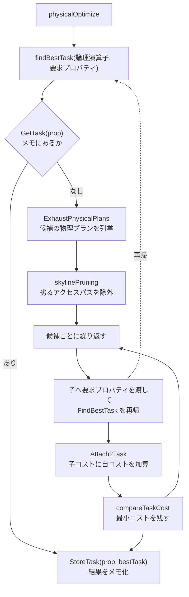

# 第9章 コストモデルと物理最適化（CBO）

> **本章で読むソース**
>
> - [`pkg/planner/core/optimizer.go`](https://github.com/pingcap/tidb/blob/v8.5.6/pkg/planner/core/optimizer.go)
> - [`pkg/planner/core/find_best_task.go`](https://github.com/pingcap/tidb/blob/v8.5.6/pkg/planner/core/find_best_task.go)
> - [`pkg/planner/core/exhaust_physical_plans.go`](https://github.com/pingcap/tidb/blob/v8.5.6/pkg/planner/core/exhaust_physical_plans.go)
> - [`pkg/planner/core/base/task_base.go`](https://github.com/pingcap/tidb/blob/v8.5.6/pkg/planner/core/base/task_base.go)
> - [`pkg/planner/core/plan_cost_ver2.go`](https://github.com/pingcap/tidb/blob/v8.5.6/pkg/planner/core/plan_cost_ver2.go)
> - [`pkg/planner/core/plan_cost_ver1.go`](https://github.com/pingcap/tidb/blob/v8.5.6/pkg/planner/core/plan_cost_ver1.go)
> - [`pkg/planner/property/physical_property.go`](https://github.com/pingcap/tidb/blob/v8.5.6/pkg/planner/property/physical_property.go)

## この章の狙い

第7章で論理最適化を終えた論理プランは、`Join` や `DataSource` といった「何をするか」を表す演算子の木である。
同じ論理結合でも、実行方法には HashJoin、IndexJoin、MergeJoin があり、同じテーブル読み取りにも全表スキャンとインデックススキャンがある。
どの実装を選ぶかでコストは桁違いに変わる。

本章では、論理プランから実行可能な**物理プラン**を選ぶコストベース最適化（CBO）を読む。
入口は `physicalOptimize` で、そこから各論理演算子が候補の物理実装を列挙し、第8章で求めた行数推定とアクセス方式からコストを計算し、最小コストの組み合わせを選ぶ。
この選択を再帰的に部分木へ伝える `findBestTask` の構造と、実装選択を駆動する**物理プロパティ**、そしてコストの計算式までを範囲とする。

## 前提

第7章で論理プラン `LogicalPlan` の木が完成し、第8章で各演算子の出力行数を推定する統計情報を読んだ。
本章のコスト計算は、その行数推定を入力に取る。
物理プランをコプロセッサへ押し下げる仕組みは第10章、TiFlash と MPP を選ぶ判断は第11章で扱う。
本章では、物理プランを選ぶ枠組みそのものに集中する。

## `physicalOptimize` が物理最適化の入口になる

論理最適化を終えたプランは `physicalOptimize` に渡される。
この関数は、まず統計を導出してから、根に要求する物理プロパティを組み立て、`FindBestTask` を呼ぶ。

[`pkg/planner/core/optimizer.go` L1042-L1056](https://github.com/pingcap/tidb/blob/v8.5.6/pkg/planner/core/optimizer.go#L1042-L1056)

```go
func physicalOptimize(logic base.LogicalPlan, planCounter *base.PlanCounterTp) (plan base.PhysicalPlan, cost float64, err error) {
	if logic.SCtx().GetSessionVars().StmtCtx.EnableOptimizerDebugTrace {
		debugtrace.EnterContextCommon(logic.SCtx())
		defer debugtrace.LeaveContextCommon(logic.SCtx())
	}
	if _, err := logic.RecursiveDeriveStats(nil); err != nil {
		return nil, 0, err
	}

	preparePossibleProperties(logic)

	prop := &property.PhysicalProperty{
		TaskTp:      property.RootTaskType,
		ExpectedCnt: math.MaxFloat64,
	}
```

`RecursiveDeriveStats` が木の各演算子の統計を導出し、これが後段のコスト計算の行数になる。
根に渡す `prop` は、結果を TiDB ノード上に集める `RootTaskType` を要求し、行数の上限 `ExpectedCnt` を無限大に置く。
`ExpectedCnt` は、上位が途中で読み取りを打ち切る場合の見込み行数で、無限大は全件を要求することを表す。

入口の `prop` を渡して `FindBestTask` を呼ぶと、その戻り値が最良の物理プランを内包した `task` になる。

[`pkg/planner/core/optimizer.go` L1078-L1099](https://github.com/pingcap/tidb/blob/v8.5.6/pkg/planner/core/optimizer.go#L1078-L1099)

```go
	logic.SCtx().GetSessionVars().StmtCtx.TaskMapBakTS = 0
	t, _, err := logic.FindBestTask(prop, planCounter, opt)
	if err != nil {
		return nil, 0, err
	}
	if *planCounter > 0 {
		logic.SCtx().GetSessionVars().StmtCtx.AppendWarning(errors.NewNoStackError("The parameter of nth_plan() is out of range"))
	}
	if t.Invalid() {
		errMsg := "Can't find a proper physical plan for this query"
		if config.GetGlobalConfig().DisaggregatedTiFlash && !logic.SCtx().GetSessionVars().IsMPPAllowed() {
			errMsg += ": cop and batchCop are not allowed in disaggregated tiflash mode, you should turn on tidb_allow_mpp switch"
		}
		return nil, 0, plannererrors.ErrInternal.GenWithStackByArgs(errMsg)
	}

	if err = t.Plan().ResolveIndices(); err != nil {
		return nil, 0, err
	}
	cost, err = getPlanCost(t.Plan(), property.RootTaskType, optimizetrace.NewDefaultPlanCostOption())
	return t.Plan(), cost, err
}
```

`FindBestTask` が返した `t` から `t.Plan()` で物理プランを取り出し、`ResolveIndices` で各演算子の列参照を入力スキーマ上の位置に確定する。
この `ResolveIndices` が、第6章で読んだ `Column` の `Index`（行内位置）を最終的に解決する処理である。
最後に `getPlanCost` で全体のコストを計算し、物理プランとコストを返す。
`t.Invalid()` が真になる、つまり妥当な物理プランが見つからない場合は、ここでエラーになる。

## `task` がコスト付きの部分プランを運ぶ

`FindBestTask` の戻り値である `task` は、ある論理部分木に対して選ばれた物理プランと、その実行先の種別をまとめた抽象である。

[`pkg/planner/core/base/task_base.go` L22-L37](https://github.com/pingcap/tidb/blob/v8.5.6/pkg/planner/core/base/task_base.go#L22-L37)

```go
type Task interface {
	// Count returns current task's row count.
	Count() float64
	// Copy return a shallow copy of current task with the same pointer to p.
	Copy() Task
	// Plan returns current task's plan.
	Plan() PhysicalPlan
	// Invalid returns whether current task is invalid.
	Invalid() bool
	// ConvertToRootTask will convert current task as root type.
	// Here we change return type as interface to avoid import cycle.
	// Basic interface definition shouldn't depend on concrete implementation structure.
	ConvertToRootTask(ctx PlanContext) Task
	// MemoryUsage returns the memory usage of current task.
	MemoryUsage() int64
}
```

`task` の実装は3種類ある。
`RootTask` は TiDB ノード上で実行する部分プランを、`CopTask` は TiKV のコプロセッサへ押し下げる部分プランを、`MppTask` は TiFlash の MPP として実行する部分プランを表す。
種別を分けるのは、実行先の違うコストを直接比べられないからである。
コプロセッサ側の処理はいつ完了するかが読めず、コプロセッサのコストと TiDB ノードのコストを同じ土俵で大小比較すると不公平になる。
そこで、要求する物理プロパティに実行先の種別 `TaskTp` を含め、同じ種別どうしだけをコストで比べる。

`ConvertToRootTask` は、コプロセッサや MPP の `task` を TiDB ノード上の `RootTask` へ変換する。
コプロセッサで処理しきれない演算が現れた時点で、結果を TiDB ノードへ吸い上げて以降を `RootTask` として続ける。

## 物理プロパティが実装選択を駆動する

実装の選択を駆動するのが `PhysicalProperty` である。
これは、ある演算子が出力に満たすべき性質、つまり「どんな順序で、どの実行先に、何件まで」を表す。

[`pkg/planner/property/physical_property.go` L244-L290](https://github.com/pingcap/tidb/blob/v8.5.6/pkg/planner/property/physical_property.go#L244-L290)

```go
type PhysicalProperty struct {
	// SortItems contains the required sort attributes.
	SortItems []SortItem

	// TaskTp means the type of task that an operator requires.
	//
	// It needs to be specified because two different tasks can't be compared
	// with cost directly. e.g. If a copTask takes less cost than a rootTask,
	// we can't sure that we must choose the former one. Because the copTask
	// must be finished and increase its cost in sometime, but we can't make
	// sure the finishing time. So the best way to let the comparison fair is
	// to add TaskType to required property.
	TaskTp TaskType

	// ExpectedCnt means this operator may be closed after fetching ExpectedCnt
	// records.
	ExpectedCnt float64

	// hashcode stores the hash code of a PhysicalProperty, will be lazily
	// calculated when function "HashCode()" being called.
	hashcode []byte

	// indicates that whether we are allowed to add an enforcer.
	CanAddEnforcer bool

	// If the partition type is hash, the data should be reshuffled by partition cols.
	MPPPartitionCols []*MPPPartitionColumn

	// which types the exchange sender belongs to, only take effects when it's a mpp task.
	MPPPartitionTp MPPPartitionType

	// SortItemsForPartition means these sort only need to sort the data of one partition, instead of global.
	// It is added only if it is used to sort the sharded data of the window function.
	// Non-MPP tasks do not care about it.
	SortItemsForPartition []SortItem

	// RejectSort means rejecting the sort property from its children, but it only works for MPP tasks.
	// Non-MPP tasks do not care about it.
	RejectSort bool

	CTEProducerStatus cteProducerStatus

	VectorProp struct {
		*expression.VectorHelper
		TopK uint32
	}
}
```

`SortItems` が要求される並び順、`TaskTp` が実行先の種別、`ExpectedCnt` が要求行数である。
`SortItems` が空でない物理プロパティは、出力がその列で整列していることを要求する。
たとえば上位に `ORDER BY a` があれば、子に `a` 順の出力を要求する物理プロパティが下りてくる。

この要求を満たす実装だけが候補になる。
インデックススキャンはインデックス順の出力を自然に提供できるので、`a` 順を要求されたとき、`a` のインデックスを使うスキャンは並べ替えなしで要求を満たす。
全表スキャンは順序を保証しないので、同じ要求を満たすには上に並べ替え演算子を載せる必要がある。
こうして物理プロパティが、各演算子で比較する候補の集合を絞る。

## 各演算子が候補の物理プランを列挙する

論理演算子から候補の物理プランを生成するのが `ExhaustPhysicalPlans` である。
結合の場合、`exhaustPhysicalPlans4LogicalJoin` が MergeJoin、IndexJoin、HashJoin を順に組み立てる。

[`pkg/planner/core/exhaust_physical_plans.go` L2079-L2107](https://github.com/pingcap/tidb/blob/v8.5.6/pkg/planner/core/exhaust_physical_plans.go#L2079-L2107)

```go
	if !p.IsNAAJ() {
		// naaj refuse merge join and index join.
		mergeJoins := GetMergeJoin(p, prop, p.Schema(), p.StatsInfo(), p.Children()[0].StatsInfo(), p.Children()[1].StatsInfo())
		if (p.PreferJoinType&h.PreferMergeJoin) > 0 && len(mergeJoins) > 0 {
			return mergeJoins, true, nil
		}
		joins = append(joins, mergeJoins...)

		indexJoins, forced := tryToGetIndexJoin(p, prop)
		if forced {
			return indexJoins, true, nil
		}
		joins = append(joins, indexJoins...)
	}

	hashJoins, forced := getHashJoins(p, prop)
	if forced && len(hashJoins) > 0 {
		return hashJoins, true, nil
	}
	joins = append(joins, hashJoins...)

	if p.PreferJoinType > 0 {
		// If we reach here, it means we have a hint that doesn't work.
		// It might be affected by the required property, so we enforce
		// this property and try the hint again.
		return joins, false, nil
	}
	return joins, true, nil
}
```

`GetMergeJoin`、`tryToGetIndexJoin`、`getHashJoins` が各実装の物理プランを返し、`joins` に集める。
ヒントで結合方法が指定されていれば、対応する実装だけを返して候補を絞る（`PreferMergeJoin` のときに `mergeJoins` をそのまま返す経路）。
ヒントがなければ3系統すべてを候補に積み、後でコスト比較に委ねる。

候補を列挙するとき、各物理プランは子に要求する物理プロパティを自分で決める。
MergeJoin は、両側の入力が結合キー順に整列していることを前提に動くので、子に結合キーでの並び順を要求する。

[`pkg/planner/core/exhaust_physical_plans.go` L102-L125](https://github.com/pingcap/tidb/blob/v8.5.6/pkg/planner/core/exhaust_physical_plans.go#L102-L125)

```go
func (p *PhysicalMergeJoin) tryToGetChildReqProp(prop *property.PhysicalProperty) ([]*property.PhysicalProperty, bool) {
	all, desc := prop.AllSameOrder()
	lProp := property.NewPhysicalProperty(property.RootTaskType, p.LeftJoinKeys, desc, math.MaxFloat64, false)
	rProp := property.NewPhysicalProperty(property.RootTaskType, p.RightJoinKeys, desc, math.MaxFloat64, false)
	lProp.CTEProducerStatus = prop.CTEProducerStatus
	rProp.CTEProducerStatus = prop.CTEProducerStatus
	if !prop.IsSortItemEmpty() {
		// sort merge join fits the cases of massive ordered data, so desc scan is always expensive.
		if !all {
			return nil, false
		}
		if !prop.IsPrefix(lProp) && !prop.IsPrefix(rProp) {
			return nil, false
		}
		if prop.IsPrefix(rProp) && p.JoinType == logicalop.LeftOuterJoin {
			return nil, false
		}
		if prop.IsPrefix(lProp) && p.JoinType == logicalop.RightOuterJoin {
			return nil, false
		}
	}

	return []*property.PhysicalProperty{lProp, rProp}, true
}
```

`lProp` と `rProp` が、左右の子に要求する物理プロパティである。
それぞれ左結合キー `LeftJoinKeys`、右結合キー `RightJoinKeys` での並び順を要求する。
この要求が子へ下りていき、子はその順序を満たせる実装（たとえば結合キーのインデックススキャン）だけを候補にする。
こうして上位の MergeJoin が必要とする順序が、下位のスキャン選択まで伝播する。

## `findBestTask` が部分木ごとに最小コストを選ぶ

各演算子の `findBestTask` は、要求された物理プロパティに対して、候補の物理プランそれぞれで部分木を組み立て、最小コストの `task` を返す。

[`pkg/planner/core/find_best_task.go` L505-L540](https://github.com/pingcap/tidb/blob/v8.5.6/pkg/planner/core/find_best_task.go#L505-L540)

```go
func findBestTask(lp base.LogicalPlan, prop *property.PhysicalProperty, planCounter *base.PlanCounterTp,
	opt *optimizetrace.PhysicalOptimizeOp) (bestTask base.Task, cntPlan int64, err error) {
	p := lp.GetBaseLogicalPlan().(*logicalop.BaseLogicalPlan)
	// If p is an inner plan in an IndexJoin, the IndexJoin will generate an inner plan by itself,
	// and set inner child prop nil, so here we do nothing.
	if prop == nil {
		return nil, 1, nil
	}
	// Look up the task with this prop in the task map.
	// It's used to reduce double counting.
	bestTask = p.GetTask(prop)
	if bestTask != nil {
		planCounter.Dec(1)
		return bestTask, 1, nil
	}

	canAddEnforcer := prop.CanAddEnforcer

	if prop.TaskTp != property.RootTaskType && !prop.IsFlashProp() {
		// Currently all plan cannot totally push down to TiKV.
		p.StoreTask(prop, base.InvalidTask)
		return base.InvalidTask, 0, nil
	}

	cntPlan = 0
	// prop should be read only because its cached hashcode might be not consistent
	// when it is changed. So we clone a new one for the temporary changes.
	newProp := prop.CloneEssentialFields()
	var plansFitsProp, plansNeedEnforce []base.PhysicalPlan
	var hintWorksWithProp bool
	// Maybe the plan can satisfy the required property,
	// so we try to get the task without the enforced sort first.
	plansFitsProp, hintWorksWithProp, err = p.Self().ExhaustPhysicalPlans(newProp)
	if err != nil {
		return nil, 0, err
	}
```

冒頭の `p.GetTask(prop)` が、同じ物理プロパティでこの部分木を既に最適化済みなら、その結果をそのまま返す。
これがメモ化であり、同じ部分問題を二度解かないようにする（後述）。

メモにない場合は `ExhaustPhysicalPlans(newProp)` で候補の物理プランを `plansFitsProp` に列挙する。
候補は2系統に分かれる。
`plansFitsProp` は、要求された順序をそのまま満たせる実装である。
順序を満たせない場合に上へ並べ替え演算子を載せる（エンフォース）系統が `plansNeedEnforce` で、要求順序を空にして候補を取り直す。

列挙した候補から最小コストの `task` を選ぶのが `enumeratePhysicalPlans4Task` である。

[`pkg/planner/core/find_best_task.go` L195-L257](https://github.com/pingcap/tidb/blob/v8.5.6/pkg/planner/core/find_best_task.go#L195-L257)

```go
	for _, pp := range physicalPlans {
		timeStampNow := p.GetLogicalTS4TaskMap()
		savedPlanID := p.SCtx().GetSessionVars().PlanID.Load()

		childTasks, curCntPlan, childCnts, err = iteration(p, pp, childTasks, childCnts, prop, opt)
		if err != nil {
			return nil, 0, err
		}

		// This check makes sure that there is no invalid child task.
		if len(childTasks) != p.ChildLen() {
			continue
		}

		// If the target plan can be found in this physicalPlan(pp), rebuild childTasks to build the corresponding combination.
		if planCounter.IsForce() && int64(*planCounter) <= curCntPlan {
			p.SCtx().GetSessionVars().PlanID.Store(savedPlanID)
			curCntPlan = int64(*planCounter)
			err := rebuildChildTasks(p, &childTasks, pp, childCnts, int64(*planCounter), timeStampNow, opt)
			if err != nil {
				return nil, 0, err
			}
		}

		// Combine the best child tasks with parent physical plan.
		curTask := pp.Attach2Task(childTasks...)
		if curTask.Invalid() {
			continue
		}

		// An optimal task could not satisfy the property, so it should be converted here.
		if _, ok := curTask.(*RootTask); !ok && prop.TaskTp == property.RootTaskType {
			curTask = curTask.ConvertToRootTask(p.SCtx())
		}

		// Enforce curTask property
		if addEnforcer {
			curTask = enforceProperty(prop, curTask, p.Plan.SCtx())
		}

		// Optimize by shuffle executor to running in parallel manner.
		if _, isMpp := curTask.(*MppTask); !isMpp && prop.IsSortItemEmpty() {
			// Currently, we do not regard shuffled plan as a new plan.
			curTask = optimizeByShuffle(curTask, p.Plan.SCtx())
		}

		cntPlan += curCntPlan
		planCounter.Dec(curCntPlan)

		if planCounter.Empty() {
			bestTask = curTask
			break
		}
		appendCandidate4PhysicalOptimizeOp(opt, p, curTask.Plan(), prop)
		// Get the most efficient one.
		if curIsBetter, err := compareTaskCost(curTask, bestTask, opt); err != nil {
			return nil, 0, err
		} else if curIsBetter {
			bestTask = curTask
		}
	}
	return bestTask, cntPlan, nil
}
```

候補 `pp` ごとに、まず `iteration` が各子の最良 `task` を求める。
`childTasks` がそろったら `pp.Attach2Task(childTasks...)` で、子の `task` の上に自分の物理プランを載せた `curTask` を作る。
このとき `Attach2Task` が、子のコストに自分の処理コストを加えて `curTask` のコストを確定する。
最後に `compareTaskCost` で `curTask` と現在の最良 `bestTask` を比べ、安いほうを残す。

子の最良 `task` を求める `iteration` の実体は、子へ要求プロパティを渡して再帰する。

[`pkg/planner/core/find_best_task.go` L268-L284](https://github.com/pingcap/tidb/blob/v8.5.6/pkg/planner/core/find_best_task.go#L268-L284)

```go
	// Find best child tasks firstly.
	childTasks = childTasks[:0]
	// The curCntPlan records the number of possible plans for pp
	curCntPlan := int64(1)
	for j, child := range p.Children() {
		childProp := selfPhysicalPlan.GetChildReqProps(j)
		childTask, cnt, err := child.FindBestTask(childProp, &PlanCounterDisabled, opt)
		childCnts[j] = cnt
		if err != nil {
			return nil, 0, childCnts, err
		}
		curCntPlan = curCntPlan * cnt
		if childTask != nil && childTask.Invalid() {
			return nil, 0, childCnts, nil
		}
		childTasks = append(childTasks, childTask)
	}
```

`selfPhysicalPlan.GetChildReqProps(j)` が、この物理プランが `j` 番目の子に要求するプロパティである。
MergeJoin なら先ほどの `tryToGetChildReqProp` が決めた結合キー順の要求が、ここで子の `FindBestTask` に渡る。
子は自分の `findBestTask` の中で、その要求を満たす実装の中から最小コストの `task` を返す。
この再帰で、葉のスキャンから根まで、各部分木の最小コストが下から積み上がる。

## コストモデルが行数とアクセス方式からコストを決める

`compareTaskCost` は、二つの `task` のコストを `getTaskPlanCost` で求めて比較する。

[`pkg/planner/core/find_best_task.go` L353-L369](https://github.com/pingcap/tidb/blob/v8.5.6/pkg/planner/core/find_best_task.go#L353-L369)

```go
func compareTaskCost(curTask, bestTask base.Task, op *optimizetrace.PhysicalOptimizeOp) (curIsBetter bool, err error) {
	curCost, curInvalid, err := getTaskPlanCost(curTask, op)
	if err != nil {
		return false, err
	}
	bestCost, bestInvalid, err := getTaskPlanCost(bestTask, op)
	if err != nil {
		return false, err
	}
	if curInvalid {
		return false, nil
	}
	if bestInvalid {
		return true, nil
	}
	return curCost < bestCost, nil
}
```

`curCost < bestCost` の単純な比較で、安いほうを選ぶ。
妥当でない `task`（`curInvalid`、`bestInvalid`）はここで負ける側に倒す。
比較の土台になるコストは、物理プランごとの `GetPlanCostVer2` が計算する。

テーブルスキャンのコストは、行数とアクセス方式の組み合わせで決まる。

[`pkg/planner/core/plan_cost_ver2.go` L139-L162](https://github.com/pingcap/tidb/blob/v8.5.6/pkg/planner/core/plan_cost_ver2.go#L139-L162)

```go
// GetPlanCostVer2 returns the plan-cost of this sub-plan, which is:
// plan-cost = rows * log2(row-size) * scan-factor
// log2(row-size) is from experiments.
func (p *PhysicalTableScan) GetPlanCostVer2(taskType property.TaskType, option *optimizetrace.PlanCostOption) (costusage.CostVer2, error) {
	if p.PlanCostInit && !hasCostFlag(option.CostFlag, costusage.CostFlagRecalculate) {
		return p.PlanCostVer2, nil
	}

	var columns []*expression.Column
	if p.StoreType == kv.TiKV { // Assume all columns for TiKV
		columns = p.tblCols
	} else { // TiFlash
		columns = p.schema.Columns
	}
	rows := getCardinality(p, option.CostFlag)
	rowSize := getAvgRowSize(p.StatsInfo(), columns)
	// Ensure rows and rowSize have a reasonable minimum value to avoid underestimation
	if !p.isChildOfIndexLookUp {
		rows = max(MinNumRows, rows)
		rowSize = max(rowSize, MinRowSize)
	}

	scanFactor := getTaskScanFactorVer2(p, p.StoreType, taskType)
	p.PlanCostVer2 = scanCostVer2(option, rows, rowSize, scanFactor)
```

コメントが式を明示している。
スキャンのコストは `rows * log2(row-size) * scan-factor` で、行数 `rows`、1行のバイト長 `rowSize`、実行先ごとのスキャン係数 `scanFactor` の積である。
`rows` は `getCardinality(p, option.CostFlag)` で求め、`scanFactor` は `getTaskScanFactorVer2` で実行先（TiKV か TiFlash か）に応じた係数を引く。
同じ行を読むのでも、TiKV と TiFlash でスキャン係数が違うので、コストが変わる。

実際の計算式は `scanCostVer2` にある。

[`pkg/planner/core/plan_cost_ver2.go` L919-L927](https://github.com/pingcap/tidb/blob/v8.5.6/pkg/planner/core/plan_cost_ver2.go#L919-L927)

```go
func scanCostVer2(option *optimizetrace.PlanCostOption, rows, rowSize float64, scanFactor costusage.CostVer2Factor) costusage.CostVer2 {
	if rowSize < 1 {
		rowSize = 1
	}
	return costusage.NewCostVer2(option, scanFactor,
		// rows * log(row-size) * scanFactor, log2 from experiments
		rows*max(math.Log2(rowSize), 0)*scanFactor.Value,
		func() string { return fmt.Sprintf("scan(%v*logrowsize(%v)*%v)", rows, rowSize, scanFactor) })
}
```

`rows*max(math.Log2(rowSize), 0)*scanFactor.Value` が、コメントどおりの積である。
行数 `rows` がそのまま線形にコストへ効く。
ここで使う `rows` の出どころが、コスト計算と統計をつなぐ。

[`pkg/planner/core/plan_cost_ver1.go` L1250-L1264](https://github.com/pingcap/tidb/blob/v8.5.6/pkg/planner/core/plan_cost_ver1.go#L1250-L1264)

```go
func getCardinality(operator base.PhysicalPlan, costFlag uint64) float64 {
	if hasCostFlag(costFlag, costusage.CostFlagUseTrueCardinality) {
		actualProbeCnt := operator.GetActualProbeCnt(operator.SCtx().GetSessionVars().StmtCtx.RuntimeStatsColl)
		if actualProbeCnt == 0 {
			return 0
		}
		return max(0, getOperatorActRows(operator)/float64(actualProbeCnt))
	}
	rows := operator.StatsCount()
	if rows <= 0 && operator.SCtx().GetSessionVars().CostModelVersion == modelVer2 {
		// 0 est-row can lead to 0 operator cost which makes plan choice unstable.
		rows = 1
	}
	return rows
}
```

`operator.StatsCount()` が、この演算子の出力行数の推定値である。
これは第8章で読んだ統計情報から導いた行数推定であり、コスト計算へまっすぐ入る。
統計が正確なら行数推定が正確になり、行数推定が正確ならコスト比較が正しい実装を選ぶ。
コストモデルが統計に依存するのは、この経路を通るためである。

## 高速化の工夫 スカイラインプルーニングとメモ化

候補の物理プランを総当たりでコスト計算すると、特に `DataSource` のアクセスパスが多いとき、組み合わせが膨らむ。
TiDB は二つの仕組みで探索量を抑える。

一つは**スカイラインプルーニング**である。
`DataSource` のアクセスパス（全表スキャン、各インデックススキャン）を、コスト計算の前に複数の観点で比較し、どの観点でも他に劣るパスを落とす。

[`pkg/planner/core/find_best_task.go` L1296-L1298](https://github.com/pingcap/tidb/blob/v8.5.6/pkg/planner/core/find_best_task.go#L1296-L1298)

```go
// skylinePruning prunes access paths according to different factors. An access path can be pruned only if
// there exists a path that is not worse than it at all factors and there is at least one better factor.
func skylinePruning(ds *logicalop.DataSource, prop *property.PhysicalProperty) []*candidatePath {
```

コメントが基準を述べている。
あるパスは、すべての観点で同等以上かつ少なくとも一つの観点で勝るパスが他に存在するときに限り、落とせる。
観点は、アクセス条件で絞り込める範囲、要求順序に合うか、必要な列をインデックスだけで賄えるか（インデックスのみで読めるなら行本体を引く往復が要らない）などである。

[`pkg/planner/core/find_best_task.go` L1338-L1359](https://github.com/pingcap/tidb/blob/v8.5.6/pkg/planner/core/find_best_task.go#L1338-L1359)

```go
		pruned := false
		for i := len(candidates) - 1; i >= 0; i-- {
			if candidates[i].path.StoreType == kv.TiFlash {
				continue
			}
			result, missingStats := compareCandidates(ds.SCtx(), ds.StatisticTable, prop, candidates[i], currentCandidate, preferRange)
			if missingStats {
				idxMissingStats = true // Ensure that we track idxMissingStats across all iterations
			}
			if result == 1 {
				pruned = true
				// We can break here because the current candidate lost to another plan.
				// This means that we won't add it to the candidates below.
				break
			} else if result == -1 {
				// The current candidate is better - so remove the old one from "candidates"
				candidates = slices.Delete(candidates, i, i+1)
			}
		}
		if !pruned {
			candidates = append(candidates, currentCandidate)
		}
```

`compareCandidates` が二つのパスを観点ごとに比べ、`result == 1` なら今のパスが負けて落ち、`result == -1` なら既存のパスが負けて消える。
これで、コストを計算するまでもなく劣るパスを早期に除き、後段のコスト計算の対象を減らす。

もう一つは**メモ化**である。
`findBestTask` の冒頭で見た `p.GetTask(prop)` が、同じ物理プロパティで同じ部分木を既に解いていれば、その `task` を再利用する。
木が DAG 状に共有される場合や、同じ部分木に同じプロパティが複数回要求される場合に、部分問題を二度解かずに済む。
末尾の `p.StoreTask(prop, bestTask)` が、解いた結果をプロパティをキーにして保存する。

[`pkg/planner/core/find_best_task.go` L601-L604](https://github.com/pingcap/tidb/blob/v8.5.6/pkg/planner/core/find_best_task.go#L601-L604)

```go
END:
	p.StoreTask(prop, bestTask)
	return bestTask, cntPlan, nil
}
```

部分木の最小コストを、物理プロパティをキーにして記憶し再利用するこの構造が、動的計画法に当たる。
要求プロパティを下位へ伝播させて候補を絞り、スカイラインプルーニングで劣るパスを落とし、メモ化で部分問題の再計算を避ける。
これらが組み合わさって、全体の探索量を実行可能な範囲に抑えている。

## 物理最適化の全体像

ここまでの流れを図にまとめる。



論理演算子ごとに `findBestTask` が呼ばれ、候補を列挙し、子へ要求プロパティを渡して再帰し、戻ってきた子の `task` の上に自分の物理プランを載せてコストを比べる。
最小コストの `task` をメモに記憶し、上位へ返す。
この再帰が根まで戻ると、根の `task` に全体の最良物理プランが入る。

## まとめ

物理最適化 `physicalOptimize` は、根に `RootTaskType` を要求する物理プロパティを渡して `FindBestTask` を呼び、最良の物理プランを得る。
各論理演算子の `findBestTask` は、`ExhaustPhysicalPlans` で候補の物理プランを列挙し、子へ要求プロパティを伝播させて再帰し、戻ってきた子の `task` に自分の物理プランを載せてコストを比べ、最小コストの `task` を返す。
物理プロパティは、要求される並び順 `SortItems` と実行先 `TaskTp` を運び、これを満たせる実装だけを候補に絞る。
MergeJoin が子に結合キー順を要求するように、上位の要求が下位のスキャン選択まで伝播する。
コストは、テーブルスキャンなら `rows * log2(row-size) * scan-factor` で、行数 `rows` は第8章の統計から `StatsCount()` で得る。
スカイラインプルーニングで劣るアクセスパスをコスト計算前に落とし、メモ化で部分木の最小コストを物理プロパティをキーに記憶することで、探索量を実行可能な範囲に抑える。

## 関連する章

- [第8章 統計情報とカーディナリティ推定](08-statistics-and-cardinality.md)：本章のコスト計算が入力に取る行数推定 `StatsCount()` の出どころを扱う。
- [第10章 コプロセッサ押し下げ](10-coprocessor-pushdown.md)：物理プランを `CopTask` として TiKV のコプロセッサへ押し下げる仕組みを扱う。
- [第11章 エンジン選択と MPP プラン](11-engine-selection-and-mpp.md)：物理プロパティの `TaskTp` で TiFlash と MPP を選ぶ判断を扱う。
- [第12章 ベクトル化実行モデル](../part03-executor/12-vectorized-execution.md)：選ばれた物理プランを実際に動かすエグゼキュータの実行モデルを扱う。
