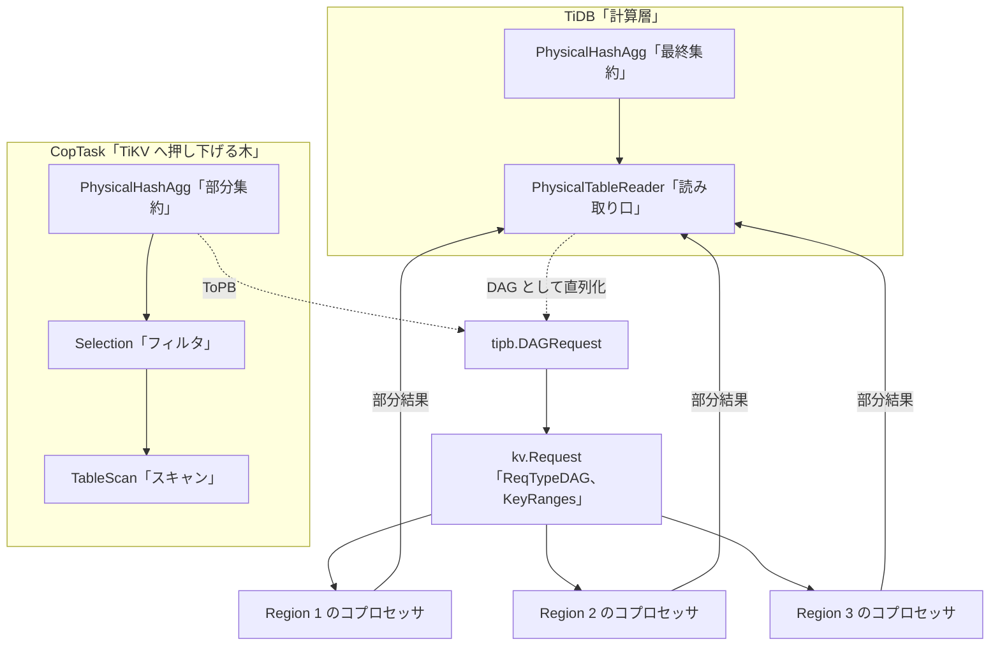

# 第10章 コプロセッサ押し下げ

> **本章で読むソース**
>
> - [`pkg/expression/expr_to_pb.go`](https://github.com/pingcap/tidb/blob/v8.5.6/pkg/expression/expr_to_pb.go)
> - [`pkg/expression/infer_pushdown.go`](https://github.com/pingcap/tidb/blob/v8.5.6/pkg/expression/infer_pushdown.go)
> - [`pkg/planner/core/task_base.go`](https://github.com/pingcap/tidb/blob/v8.5.6/pkg/planner/core/task_base.go)
> - [`pkg/planner/core/task.go`](https://github.com/pingcap/tidb/blob/v8.5.6/pkg/planner/core/task.go)
> - [`pkg/planner/core/plan_to_pb.go`](https://github.com/pingcap/tidb/blob/v8.5.6/pkg/planner/core/plan_to_pb.go)
> - [`pkg/executor/internal/builder/builder_utils.go`](https://github.com/pingcap/tidb/blob/v8.5.6/pkg/executor/internal/builder/builder_utils.go)
> - [`pkg/distsql/request_builder.go`](https://github.com/pingcap/tidb/blob/v8.5.6/pkg/distsql/request_builder.go)

## この章の狙い

TiDB は計算層、TiKV は分散ストレージ層であり、両者はネットワークで隔てられている。
`SELECT count(*) FROM t WHERE a > 100` を素朴に実行すると、TiKV から全行を計算層へ転送し、計算層でフィルタと集計をかけることになる。
転送量も計算層の負荷も、テーブル全体に比例して膨らむ。

**コプロセッサ押し下げ**（coprocessor pushdown）は、スキャン、フィルタ、集約といった処理を TiKV 側で実行させ、絞り込んだ結果だけを計算層へ返させる最適化である。
各 Region を保持する TiKV ノードがその場でデータを処理するので、ネットワークを渡る行数が減り、計算層の処理も軽くなる。

本章では、ある式が TiKV で評価可能かをどう判定して protobuf へ直列化するか、物理プランのどの部分を `CopTask` として TiKV へ押し下げるか、押し下げた木をどう DAG にまとめてコプロセッサ要求へ載せるかを読む。
機構の工夫として、述語と集約を押し下げたうえで各 Region で部分集約し、計算層で最終集約する**2相集約**（two-phase aggregation）を扱う。

## 前提

第9章でコストモデルにもとづく物理最適化（CBO）を読み、物理プランがコスト最小の `Task` を選びながら構築されることを見た。
本章の `CopTask` は、その `Task` の一種であり、TiKV のコプロセッサで実行される部分プランを表す。

第6章で `Expression` インターフェースと `ScalarFunction` を読んだ。
押し下げの判定対象は、この `Expression` の木である。
押し下げ可能と判定された式は、`tipb` パッケージが定義する protobuf 型（`tipb.Expr`）へ直列化される。

コプロセッサ要求が `RequestBuilder` で組み立てられ、`Client.Send` で TiKV へ送られ、Region ごとの部分結果として戻ることは第2章で概観した。
本章は、その要求に載せる DAG をプランナがどう作るかに集中する。
要求を実際に送って結果を合流させる分散読み取りの実装は第13章で扱う。

## 何を押し下げられるか：式の押し下げ判定

押し下げの可否は、まず式の単位で決まる。
TiKV のコプロセッサが評価できる関数は有限であり、TiDB が持つ関数のすべてを TiKV が実装しているわけではない。
そこで TiDB は、式の木をたどって各ノードが押し下げ可能かを判定する。

判定の中心は `canExprPushDown` である。

[`pkg/expression/infer_pushdown.go` L122-L152](https://github.com/pingcap/tidb/blob/v8.5.6/pkg/expression/infer_pushdown.go#L122-L152)

```go
func canExprPushDown(ctx PushDownContext, expr Expression, storeType kv.StoreType, canEnumPush bool) bool {
	pc := ctx.PbConverter()
	if storeType == kv.TiFlash {
		// ... (中略) ...
	}
	switch x := expr.(type) {
	case *CorrelatedColumn:
		return pc.conOrCorColToPBExpr(expr) != nil && pc.columnToPBExpr(&x.Column, true) != nil
	case *Constant:
		return pc.conOrCorColToPBExpr(expr) != nil
	case *Column:
		return pc.columnToPBExpr(x, true) != nil
	case *ScalarFunction:
		return canScalarFuncPushDown(ctx, x, storeType)
	}
	return false
}
```

列参照と定数は、対応する `tipb.Expr` へ変換できれば押し下げ可能とみなす。
関数呼び出し `ScalarFunction` は `canScalarFuncPushDown` に委ね、そこで関数自体が押し下げ対象かを確認したうえで、引数を再帰的に `canExprPushDown` へかける。
木のすべての葉と内部ノードが変換可能なときに限り、その式は押し下げられる。

関数が押し下げ可能かどうかは、宛先ストア種別 `storeType` ごとに用意した許可リストで決まる。
TiKV 向けの一覧が `scalarExprSupportedByTiKV` である。

[`pkg/expression/infer_pushdown.go` L159-L167](https://github.com/pingcap/tidb/blob/v8.5.6/pkg/expression/infer_pushdown.go#L159-L167)

```go
// supported functions tracked by https://github.com/tikv/tikv/issues/5751
func scalarExprSupportedByTiKV(ctx EvalContext, sf *ScalarFunction) bool {
	switch sf.FuncName.L {
	case
		// op functions.
		ast.LogicAnd, ast.LogicOr, ast.LogicXor, ast.UnaryNot, ast.And, ast.Or, ast.Xor, ast.BitNeg, ast.LeftShift, ast.RightShift, ast.UnaryMinus,

		// compare functions.
		ast.LT, ast.LE, ast.EQ, ast.NE, ast.GE, ast.GT, ast.NullEQ, ast.In, ast.IsNull, ast.Like, ast.IsTruthWithoutNull, ast.IsTruthWithNull, ast.IsFalsity,
```

比較演算、論理演算、算術演算といった TiKV のコプロセッサが実装する関数だけが許可される。
TiFlash 向けには別の一覧 `scalarExprSupportedByFlash` があり、同じ式でも宛先によって押し下げの可否が変わる。
TiKV と TiFlash の役割の違いと選択は第11章で扱う。

判定を式のリストへ広げたのが `PushDownExprs` であり、押し下げられる式と計算層に残す式に振り分ける。

[`pkg/expression/infer_pushdown.go` L513-L539](https://github.com/pingcap/tidb/blob/v8.5.6/pkg/expression/infer_pushdown.go#L513-L539)

```go
// PushDownExprsWithExtraInfo split the input exprs into pushed and remained, pushed include all the exprs that can be pushed down
func PushDownExprsWithExtraInfo(ctx PushDownContext, exprs []Expression, storeType kv.StoreType, canEnumPush bool) (pushed []Expression, remained []Expression) {
	for _, expr := range exprs {
		if canExprPushDown(ctx, expr, storeType, canEnumPush) {
			pushed = append(pushed, expr)
		} else {
			remained = append(remained, expr)
		}
	}
	return
}

// PushDownExprs split the input exprs into pushed and remained, pushed include all the exprs that can be pushed down
func PushDownExprs(ctx PushDownContext, exprs []Expression, storeType kv.StoreType) (pushed []Expression, remained []Expression) {
	return PushDownExprsWithExtraInfo(ctx, exprs, storeType, false)
}

// CanExprsPushDownWithExtraInfo return true if all the expr in exprs can be pushed down
func CanExprsPushDownWithExtraInfo(ctx PushDownContext, exprs []Expression, storeType kv.StoreType, canEnumPush bool) bool {
	_, remained := PushDownExprsWithExtraInfo(ctx, exprs, storeType, canEnumPush)
	return len(remained) == 0
}

// CanExprsPushDown return true if all the expr in exprs can be pushed down
func CanExprsPushDown(ctx PushDownContext, exprs []Expression, storeType kv.StoreType) bool {
	return CanExprsPushDownWithExtraInfo(ctx, exprs, storeType, false)
}
```

`remained` が空かどうかを見る `CanExprsPushDown` は、すべての式が押し下げ可能なときだけ真を返す。
集約のように、引数のすべてが押し下げられなければ全体を押し下げられない場合に使う。
フィルタのように一部だけ押し下げて残りを計算層で処理できる場合は、`pushed` と `remained` の振り分けをそのまま使う。

押し下げると決めた式を `tipb.Expr` の列へ直列化するのが `ExpressionsToPBList` である。

[`pkg/expression/expr_to_pb.go` L36-L47](https://github.com/pingcap/tidb/blob/v8.5.6/pkg/expression/expr_to_pb.go#L36-L47)

```go
// ExpressionsToPBList converts expressions to tipb.Expr list for new plan.
func ExpressionsToPBList(ctx EvalContext, exprs []Expression, client kv.Client) (pbExpr []*tipb.Expr, err error) {
	pc := PbConverter{client: client, ctx: ctx}
	for _, expr := range exprs {
		v := pc.ExprToPB(expr)
		if v == nil {
			return nil, plannererrors.ErrInternal.GenWithStack("expression %v cannot be pushed down", expr.StringWithCtx(ctx, errors.RedactLogDisable))
		}
		pbExpr = append(pbExpr, v)
	}
	return
}
```

`ExprToPB` が式の木を再帰的に `tipb.Expr` へ写し、列、定数、関数のそれぞれを protobuf のノードに変換する。
変換に失敗すると `nil` が返るので、ここまでで押し下げ可能と判定された式だけがこの関数に渡される前提になっている。

## どこを押し下げるか：`CopTask` への取り込み

式の押し下げ判定は部品である。
物理プランのうちどの演算子を TiKV へ押し下げるかは、物理最適化で `Task` を組み立てるときに決まる。
TiKV で実行する部分プランを表すのが `CopTask` である。

[`pkg/planner/core/task_base.go` L226-L263](https://github.com/pingcap/tidb/blob/v8.5.6/pkg/planner/core/task_base.go#L226-L263)

```go
type CopTask struct {
	indexPlan             base.PhysicalPlan
	tablePlan             base.PhysicalPlan
	indexLookUpPushDownBy util.IndexLookUpPushDownByType
	// indexPlanFinished means we have finished index plan.
	indexPlanFinished bool
	// keepOrder indicates if the plan scans data by order.
	keepOrder bool
	// ... (中略) ...
	// rootTaskConds stores select conditions containing virtual columns.
	// These conditions can't push to TiKV, so we have to add a selection for rootTask
	rootTaskConds []expression.Expression

	// For table partition.
	physPlanPartInfo *PhysPlanPartInfo

	// expectCnt is the expected row count of upper task, 0 for unlimited.
	// It's used for deciding whether using paging distsql.
	expectCnt uint64
}
```

`tablePlan` と `indexPlan` が、TiKV で実行する演算子の木を保持する。
これらは `PhysicalTableScan` や `PhysicalIndexScan` を根として、その上にフィルタや集約が積まれた木である。
`rootTaskConds` は、仮想列を含むなどの理由で押し下げられず、計算層に残す述語を蓄える。
コメントが述べるとおり、この条件は TiKV へ押せないので、後段で計算層側の `Selection` として復元される。

各物理演算子は、自分の `Attach2Task` で、子の `Task` が `CopTask` ならその木へ自分を積み、そうでなければ計算層へ留まる。
`PhysicalSelection` の押し下げは、フィルタが TiKV で評価できるかを式の判定にかける。

[`pkg/planner/core/task.go` L1167-L1175](https://github.com/pingcap/tidb/blob/v8.5.6/pkg/planner/core/task.go#L1167-L1175)

```go
func (sel *PhysicalSelection) Attach2Task(tasks ...base.Task) base.Task {
	if mppTask, _ := tasks[0].(*MppTask); mppTask != nil { // always push to mpp task.
		if expression.CanExprsPushDown(util.GetPushDownCtx(sel.SCtx()), sel.Conditions, kv.TiFlash) {
			return attachPlan2Task(sel, mppTask.Copy())
		}
	}
	t := tasks[0].ConvertToRootTask(sel.SCtx())
	return attachPlan2Task(sel, t)
}
```

TiKV のコプロセッサ向けには、述語の取り込みは物理最適化のより早い段階でデータソースへ織り込まれている。
この `Attach2Task` が `CanExprsPushDown` を直接呼ぶのは TiFlash の MPP タスク向けであり、押し下げられる条件だけを `MppTask` へ積む。
押し下げられないときは `ConvertToRootTask` で計算層の `RootTask` に変換してから `Selection` を積み、計算層で評価する。

## `CopTask` の合流：計算層が読む `PhysicalTableReader`

`CopTask` はそのままでは結果を返せない。
TiKV から部分結果を受け取り、計算層側で束ねる演算子が必要である。
`ConvertToRootTask` は `CopTask` を `RootTask` へ変換し、その過程で読み取り口となる演算子を木の上に置く。

[`pkg/planner/core/task_base.go` L392-L431](https://github.com/pingcap/tidb/blob/v8.5.6/pkg/planner/core/task_base.go#L392-L431)

```go
	} else {
		tp := t.tablePlan
		for len(tp.Children()) > 0 {
			if len(tp.Children()) == 1 {
				tp = tp.Children()[0]
			} else {
				join := tp.(*PhysicalHashJoin)
				tp = join.Children()[1-join.InnerChildIdx]
			}
		}
		ts := tp.(*PhysicalTableScan)
		p := PhysicalTableReader{
			tablePlan:      t.tablePlan,
			StoreType:      ts.StoreType,
			IsCommonHandle: ts.Table.IsCommonHandle,
		}.Init(ctx, t.tablePlan.QueryBlockOffset())
		p.PlanPartInfo = t.physPlanPartInfo
		p.SetStats(t.tablePlan.StatsInfo())

		// If agg was pushed down in Attach2Task(), the partial agg was placed on the top of tablePlan, the final agg was
		// placed above the PhysicalTableReader, and the schema should have been set correctly for them, the schema of
		// partial agg contains the columns needed by the final agg.
		// ... (中略) ...
		aggPushedDown := false
		switch p.tablePlan.(type) {
		case *PhysicalHashAgg, *PhysicalStreamAgg:
			aggPushedDown = true
		}

		if t.needExtraProj && !aggPushedDown {
			proj := PhysicalProjection{Exprs: expression.Column2Exprs(t.originSchema.Columns)}.Init(ts.SCtx(), ts.StatsInfo(), ts.QueryBlockOffset(), nil)
			proj.SetSchema(t.originSchema)
			proj.SetChildren(p)
			newTask.SetPlan(proj)
		} else {
			newTask.SetPlan(p)
		}
	}
```

`PhysicalTableReader` は、`tablePlan`（TiKV で実行する木）を内部に抱えた読み取り演算子である。
計算層から見ると、この演算子が押し下げた木の結果を Region ごとに読み込み、合流させる窓口になる。
インデックススキャンだけなら `PhysicalIndexReader`、インデックスとテーブルの二段読みなら `PhysicalIndexLookUpReader` が同じ役割を担う。

ここで `CopTask` の `tablePlan` と、計算層の `PhysicalTableReader` を境にして、プランは TiKV 側と計算層側に分かれる。
TiKV 側の木が、次に DAG として直列化される対象である。

## DAG への直列化とコプロセッサ要求

`PhysicalTableReader` の内部の木は、エグゼキュータ構築の段で `tipb.DAGRequest` へ直列化される。
各物理演算子は `ToPB` で自分を `tipb.Executor` へ変換する。
`PhysicalSelection` の `ToPB` が、先に読んだ `ExpressionsToPBList` を呼ぶ箇所である。

[`pkg/planner/core/plan_to_pb.go` L168-L187](https://github.com/pingcap/tidb/blob/v8.5.6/pkg/planner/core/plan_to_pb.go#L168-L187)

```go
func (p *PhysicalSelection) ToPB(ctx *base.BuildPBContext, storeType kv.StoreType) (*tipb.Executor, error) {
	client := ctx.GetClient()
	conditions, err := expression.ExpressionsToPBList(ctx.GetExprCtx().GetEvalCtx(), p.Conditions, client)
	if err != nil {
		return nil, err
	}
	selExec := &tipb.Selection{
		Conditions: conditions,
	}
	executorID := ""
	if storeType == kv.TiFlash {
		var err error
		selExec.Child, err = p.Children()[0].ToPB(ctx, storeType)
		if err != nil {
			return nil, errors.Trace(err)
		}
		executorID = p.ExplainID().String()
	}
	return &tipb.Executor{Tp: tipb.ExecType_TypeSelection, Selection: selExec, ExecutorId: &executorID}, nil
}
```

フィルタの条件式が `tipb.Expr` のリストへ変換され、`tipb.Selection` を包む `tipb.Executor` になる。
`PhysicalTableScan` や `PhysicalHashAgg` にも同じ `ToPB` があり、それぞれ `TableScan` や `Aggregation` の `tipb.Executor` を返す。

演算子ごとの `tipb.Executor` を一つの DAG にまとめるのが `ConstructDAGReq` である。

[`pkg/executor/internal/builder/builder_utils.go` L63-L87](https://github.com/pingcap/tidb/blob/v8.5.6/pkg/executor/internal/builder/builder_utils.go#L63-L87)

```go
// ConstructDAGReq constructs DAGRequest for physical plans
func ConstructDAGReq(ctx sessionctx.Context, plans []plannercore.PhysicalPlan, storeType kv.StoreType) (dagReq *tipb.DAGRequest, err error) {
	dagReq = &tipb.DAGRequest{}
	dagReq.TimeZoneName, dagReq.TimeZoneOffset = timeutil.Zone(ctx.GetSessionVars().Location())
	sc := ctx.GetSessionVars().StmtCtx
	if sc.RuntimeStatsColl != nil {
		collExec := true
		dagReq.CollectExecutionSummaries = &collExec
	}
	dagReq.Flags = sc.PushDownFlags()
	if ctx.GetSessionVars().GetDivPrecisionIncrement() != variable.DefDivPrecisionIncrement {
		var divPrecIncr uint32 = uint32(ctx.GetSessionVars().GetDivPrecisionIncrement())
		dagReq.DivPrecisionIncrement = &divPrecIncr
	}
	if storeType == kv.TiFlash {
		var executors []*tipb.Executor
		executors, err = ConstructTreeBasedDistExec(ctx.GetBuildPBCtx(), plans[0])
		dagReq.RootExecutor = executors[0]
	} else {
		dagReq.Executors, err = ConstructListBasedDistExec(ctx.GetBuildPBCtx(), plans)
	}

	distsql.SetEncodeType(ctx.GetDistSQLCtx(), dagReq)
	return dagReq, err
}
```

TiKV 向けでは、押し下げる演算子を下から順に並べたリスト（`dagReq.Executors`）として DAG を組む。
TiFlash 向けは木構造の `RootExecutor` を使う。
`Flags` には、計算層と同じ評価結果を得るための実行時フラグが乗る。

組み上がった `tipb.DAGRequest` を `kv.Request` に詰めるのが `SetDAGRequest` である。

[`pkg/distsql/request_builder.go` L189-L199](https://github.com/pingcap/tidb/blob/v8.5.6/pkg/distsql/request_builder.go#L189-L199)

```go
func (builder *RequestBuilder) SetDAGRequest(dag *tipb.DAGRequest) *RequestBuilder {
	if builder.err == nil {
		builder.Request.Tp = kv.ReqTypeDAG
		builder.Request.Cacheable = true
		builder.Request.Data, builder.err = dag.Marshal()
		builder.dag = dag
		execCnt := len(dag.Executors)
		if execCnt != 0 && dag.Executors[execCnt-1].GetLimit() != nil {
			limit := dag.Executors[execCnt-1].GetLimit()
			builder.Request.LimitSize = limit.GetLimit()
		}
```

DAG を `Marshal` でバイト列にして `Request.Data` に載せ、要求種別を `ReqTypeDAG` にする。
どの Region のどのキー範囲を読むかは、別に `SetKeyRanges` で与える。

[`pkg/distsql/request_builder.go` L256-L260](https://github.com/pingcap/tidb/blob/v8.5.6/pkg/distsql/request_builder.go#L256-L260)

```go
// SetKeyRanges sets "KeyRanges" for "kv.Request".
func (builder *RequestBuilder) SetKeyRanges(keyRanges []kv.KeyRange) *RequestBuilder {
	builder.Request.KeyRanges = kv.NewNonPartitionedKeyRanges(keyRanges)
	return builder
}
```

`KeyRanges` はスキャンするキー範囲であり、テーブルやインデックスのアクセス範囲から導かれる。
分散読み取りの実装は、このキー範囲を Region 境界で分割し、各 Region を持つ TiKV へ同じ DAG を送る。
範囲の分割と要求の送出、Region ごとの部分結果の合流は第13章で扱う。



## 機構の工夫：2相集約で転送量を削る

述語の押し下げだけでも転送量は減るが、集約はもう一段の工夫を要する。
`GROUP BY` を伴う集約をそのまま計算層に置くと、フィルタ後の全行を計算層へ転送してから集計することになり、Region をまたぐ転送が残る。
TiDB はここで集約を二段に割り、各 Region で**部分集約**してから計算層で**最終集約**する。

二段への分割を担うのが `newPartialAggregate` である。

[`pkg/planner/core/task.go` L1582-L1597](https://github.com/pingcap/tidb/blob/v8.5.6/pkg/planner/core/task.go#L1582-L1597)

```go
func (p *basePhysicalAgg) newPartialAggregate(copTaskType kv.StoreType, isMPPTask bool) (partial, final base.PhysicalPlan) {
	// Check if this aggregation can push down.
	if !CheckAggCanPushCop(p.SCtx(), p.AggFuncs, p.GroupByItems, copTaskType) {
		return nil, p.Self
	}
	partialPref, finalPref, firstRowFuncMap := BuildFinalModeAggregation(p.SCtx(), &AggInfo{
		AggFuncs:     p.AggFuncs,
		GroupByItems: p.GroupByItems,
		Schema:       p.Schema().Clone(),
	}, true, isMPPTask)
	if partialPref == nil {
		return nil, p.Self
	}
	if p.TP() == plancodec.TypeStreamAgg && len(partialPref.GroupByItems) != len(finalPref.GroupByItems) {
		return nil, p.Self
	}
```

まず `CheckAggCanPushCop` で集約関数と `GROUP BY` 項が押し下げ可能かを確かめる。
ここでは集約関数の引数を `CanExprsPushDownWithExtraInfo` にかけ、`AggFuncToPBExpr` で protobuf へ変換できるかも見る。
押し下げられないときは部分集約を作らず、集約全体を計算層に残す。
押し下げられるときは `BuildFinalModeAggregation` が、TiKV で動く部分集約 `partialPref` と、計算層で動く最終集約 `finalPref` の二つに分ける。

たとえば `count(*)` は、各 Region が担当範囲の行数を数えて部分カウントを返し、計算層がその部分カウントを合計する。
`avg(x)` のような関数は、部分集約が和と件数を別々に返し、最終集約が割り算して平均を求める形に分解される。
この分解の中身（どの集約関数をどう二段に割るか）は `BuildFinalModeAggregation` が担うが、本章では二段に割れる事実までを範囲とする。

割った二段を実際に `CopTask` へ取り込むのが `PhysicalHashAgg` の `Attach2Task` である。

[`pkg/planner/core/task.go` L2339-L2380](https://github.com/pingcap/tidb/blob/v8.5.6/pkg/planner/core/task.go#L2339-L2380)

```go
func (p *PhysicalHashAgg) Attach2Task(tasks ...base.Task) base.Task {
	t := tasks[0].Copy()
	if cop, ok := t.(*CopTask); ok {
		if len(cop.rootTaskConds) == 0 && len(cop.idxMergePartPlans) == 0 {
			copTaskType := cop.getStoreType()
			partialAgg, finalAgg := p.newPartialAggregate(copTaskType, false)
			if partialAgg != nil {
				if cop.tablePlan != nil {
					cop.finishIndexPlan()
					partialAgg.SetChildren(cop.tablePlan)
					cop.tablePlan = partialAgg
					// ... (中略) ...
					cop.needExtraProj = false
				} else {
					partialAgg.SetChildren(cop.indexPlan)
					cop.indexPlan = partialAgg
				}
			}
			// ... (中略) ...
			t = cop.ConvertToRootTask(p.SCtx())
			attachPlan2Task(finalAgg, t)
		} else {
			t = cop.ConvertToRootTask(p.SCtx())
			attachPlan2Task(p, t)
		}
	} else if _, ok := t.(*MppTask); ok {
		return p.attach2TaskForMpp(tasks...)
	} else {
		attachPlan2Task(p, t)
	}
	return t
}
```

部分集約 `partialAgg` を `CopTask` の `tablePlan` の上に積み、その木ごと TiKV へ押し下げる。
そのうえで `ConvertToRootTask` で計算層の `RootTask` に変換し、最終集約 `finalAgg` を計算層側へ積む。
こうして TiKV は各 Region で部分集約済みの行だけを返し、計算層はそれを最終集約する。

仮に計算層に残す条件 `rootTaskConds` があるときは、部分集約を作らず集約全体を計算層に置く。
TiKV へ押せない述語を集約より先に評価する必要があり、集約だけを先に押し下げると結果が変わるからである。

この工夫がネットワーク転送量を削るのは、各 Region から返る行数がグループ数に縮むからである。
1億行を100グループへ集計する場合、押し下げなければ1億行が計算層へ渡るのに対し、部分集約すれば Region ごとに高々100行へ縮む。
計算層が受け取る行数は、グループ数に Region 数を掛けた程度に収まる。

## まとめ

コプロセッサ押し下げは、スキャン、フィルタ、集約を TiKV 側で実行させ、絞り込んだ結果だけを計算層へ返させる最適化である。
押し下げの可否はまず式の単位で決まり、`canExprPushDown` が式の木をたどって TiKV のコプロセッサが評価できる関数かを判定する。
押し下げると決めた式は `ExpressionsToPBList` で `tipb.Expr` へ直列化される。

物理プランのうち TiKV で動く部分は `CopTask` の `tablePlan` に積まれ、`PhysicalTableReader` を境に計算層側と分かれる。
TiKV 側の木は `ToPB` と `ConstructDAGReq` で `tipb.DAGRequest` へ直列化され、`SetDAGRequest` と `SetKeyRanges` で `kv.Request` に載って各 Region へ送られる。

集約は2相集約に分割され、各 Region で部分集約してから計算層で最終集約する。
各 Region から返る行数がグループ数程度に縮むため、ネットワーク転送量と計算層の負荷がともに小さくなる。

## 関連する章

- [第9章 コストモデルと物理最適化（CBO）](09-physical-optimization.md)：`CopTask` を含む `Task` をコスト最小で選ぶ物理最適化を扱う。
- [第11章 エンジン選択と MPP プラン](11-engine-selection-and-mpp.md)：TiKV と TiFlash のどちらへ押し下げるか、TiFlash の MPP プランをどう組むかを扱う。
- [第13章 分散読み取りと結果の合流](../part03-executor/13-distributed-read.md)：DAG を載せた要求をキー範囲で Region へ分割して送り、部分結果を合流させる実装を扱う。
