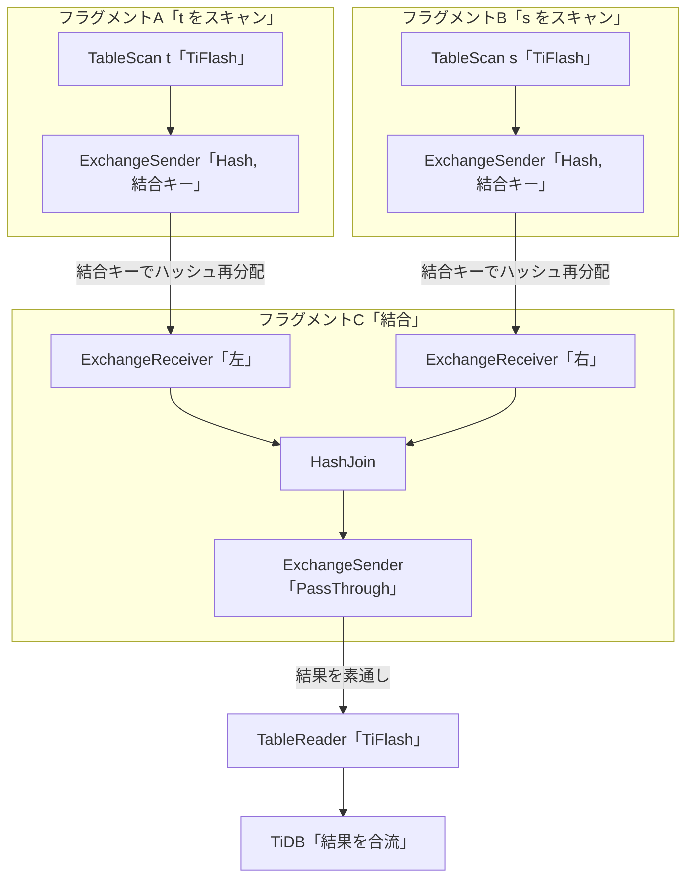

# 第11章 エンジン選択と MPP プラン

> **本章で読むソース**
>
> - [`pkg/planner/core/planbuilder.go`](https://github.com/pingcap/tidb/blob/v8.5.6/pkg/planner/core/planbuilder.go)
> - [`pkg/planner/core/find_best_task.go`](https://github.com/pingcap/tidb/blob/v8.5.6/pkg/planner/core/find_best_task.go)
> - [`pkg/planner/core/physical_plans.go`](https://github.com/pingcap/tidb/blob/v8.5.6/pkg/planner/core/physical_plans.go)
> - [`pkg/planner/core/exhaust_physical_plans.go`](https://github.com/pingcap/tidb/blob/v8.5.6/pkg/planner/core/exhaust_physical_plans.go)
> - [`pkg/planner/core/task.go`](https://github.com/pingcap/tidb/blob/v8.5.6/pkg/planner/core/task.go)
> - [`pkg/planner/core/task_base.go`](https://github.com/pingcap/tidb/blob/v8.5.6/pkg/planner/core/task_base.go)
> - [`pkg/planner/core/fragment.go`](https://github.com/pingcap/tidb/blob/v8.5.6/pkg/planner/core/fragment.go)

## この章の狙い

同じ1つのテーブルを、行指向の TiKV から読むこともできれば、列指向の TiFlash から読むこともできる。
オプティマイザは、どちらのエンジンでスキャンするかをコストで選ぶ。
点アクセス中心のクエリは TiKV を選び、大量の行を集計する分析クエリは TiFlash を選ぶ。

分析クエリで TiFlash を選んだとき、TiDB はさらに **MPP**（massively parallel processing）のプランを組み立てる。
MPP は、複数の TiFlash ノードでデータを再分配しながら結合や集約を分散実行する方式である。
本章では、オプティマイザがエンジンを選ぶ仕組みと、選んだ結果として組み立てる MPP プランの構造を、物理プランの構築コードで読む。

TiDB が担うのは計画だけである。
組み立てた MPP プランを実際に走らせるのは TiFlash であり、その実行機構は別の本で扱う。

## 前提

読者は SQL と一般的なリレーショナルデータベースの基礎を持つものとする。
論理プランから物理プランを選ぶコストベースの枠組みは、物理最適化の章で扱った（[コストモデルと物理最適化（CBO）](09-physical-optimization.md)）。
TiKV へ処理を押し下げるコプロセッサの仕組みは、押し下げの章で扱った（[コプロセッサ押し下げ](10-coprocessor-pushdown.md)）。
本章は、スキャン先のエンジンを選ぶ判断と、TiFlash 向けの分散プランの組み立てに絞る。

エンジンの種別は、計算層からストレージへの要求に乗る `kv.StoreType` で表す。
`TiKV`、`TiFlash`、`TiDB` の3値があり、要求の宛先がどのストアかを示す。
この型は第2章で確認した（[エコシステムとアーキテクチャ](../part00-overview/02-architecture.md)）。

## スキャン候補にエンジンを並べる

エンジン選択は、1つのテーブルに対して読み取り経路（**アクセスパス**）の候補を並べるところから始まる。
TiKV を主キーで全件スキャンする経路、二次インデックスを使う経路に加えて、TiFlash レプリカが使えるなら TiFlash を読む経路も候補に積む。

候補を作る `getPossibleAccessPaths` は、まず TiKV のテーブルパスを積み、TiFlash レプリカが利用可能なときだけ TiFlash パスを追加する。

[`pkg/planner/core/planbuilder.go L1230-L1240`](https://github.com/pingcap/tidb/blob/v8.5.6/pkg/planner/core/planbuilder.go#L1230-L1240)

```go
	tablePath := &util.AccessPath{StoreType: tp}
	fillContentForTablePath(tablePath, tblInfo)
	publicPaths = append(publicPaths, tablePath)

	if tblInfo.TiFlashReplica == nil {
		ctx.GetSessionVars().RaiseWarningWhenMPPEnforced("MPP mode may be blocked because there aren't tiflash replicas of table `" + tblInfo.Name.O + "`.")
	} else if !tblInfo.TiFlashReplica.Available {
		ctx.GetSessionVars().RaiseWarningWhenMPPEnforced("MPP mode may be blocked because tiflash replicas of table `" + tblInfo.Name.O + "` not ready.")
	} else {
		publicPaths = append(publicPaths, genTiFlashPath(tblInfo))
	}
```

TiFlash パスを作る `genTiFlashPath` は、`StoreType` を `kv.TiFlash` に設定したアクセスパスを返す。

[`pkg/planner/core/planbuilder.go L1138-L1142`](https://github.com/pingcap/tidb/blob/v8.5.6/pkg/planner/core/planbuilder.go#L1138-L1142)

```go
func genTiFlashPath(tblInfo *model.TableInfo) *util.AccessPath {
	tiFlashPath := &util.AccessPath{StoreType: kv.TiFlash}
	fillContentForTablePath(tiFlashPath, tblInfo)
	return tiFlashPath
}
```

ここで決まるのは、テーブルが TiFlash レプリカを持ち、それが利用可能（`Available`）なときに限って、TiFlash 経路が候補に並ぶという点である。
レプリカが無い、または同期が未完了なら、候補は TiKV 系のパスだけになる。
TiFlash を強制するヒントが付いていれば、候補が空になることを警告に記録する。

## 利用可能なエンジンで候補を絞る

候補が並んだあと、セッションが読んでよいエンジンを制限する設定が **isolation read engines** である。
ユーザーが `tidb_isolation_read_engines` を `tiflash` だけに設定すれば、TiKV を読む候補は捨てられる。
`filterPathByIsolationRead` が、設定に含まれないストア種別のパスを候補から外す。

[`pkg/planner/core/planbuilder.go L1474-L1489`](https://github.com/pingcap/tidb/blob/v8.5.6/pkg/planner/core/planbuilder.go#L1474-L1489)

```go
	isolationReadEngines := ctx.GetSessionVars().GetIsolationReadEngines()
	availableEngine := map[kv.StoreType]struct{}{}
	var availableEngineStr string
	for i := len(paths) - 1; i >= 0; i-- {
		// availableEngineStr is for warning message.
		if _, ok := availableEngine[paths[i].StoreType]; !ok {
			availableEngine[paths[i].StoreType] = struct{}{}
			if availableEngineStr != "" {
				availableEngineStr += ", "
			}
			availableEngineStr += paths[i].StoreType.Name()
		}
		if _, ok := isolationReadEngines[paths[i].StoreType]; !ok && paths[i].StoreType != kv.TiDB {
			paths = append(paths[:i], paths[i+1:]...)
		}
	}
```

ループは候補を末尾から走査し、`isolationReadEngines` に含まれないストア種別のパスを取り除く。
`kv.TiDB`（計算層自身で処理する経路）だけは常に残す。
この絞り込みのあとに残った候補から、コストの最も小さいものをオプティマイザが選ぶ。
エンジン選択は、別枠の判定ではなく、候補パスのコスト比較に組み込まれている。

## コストで TiFlash を選び、物理スキャンに刻む

残った候補のうちどれを使うかは、物理最適化のコスト比較で決まる。
TiFlash パスが選ばれると、`getOriginalPhysicalTableScan` がそのパスから物理テーブルスキャン `PhysicalTableScan` を組み立てる。
パスの `StoreType` が、そのままスキャンの `StoreType` に書き写される。

[`pkg/planner/core/find_best_task.go L3169-L3186`](https://github.com/pingcap/tidb/blob/v8.5.6/pkg/planner/core/find_best_task.go#L3169-L3186)

```go
func getOriginalPhysicalTableScan(ds *logicalop.DataSource, prop *property.PhysicalProperty, path *util.AccessPath, isMatchProp bool) (*PhysicalTableScan, float64) {
	ts := PhysicalTableScan{
		Table:           ds.TableInfo,
		Columns:         slices.Clone(ds.Columns),
		TableAsName:     ds.TableAsName,
		DBName:          ds.DBName,
		isPartition:     ds.PartitionDefIdx != nil,
		physicalTableID: ds.PhysicalTableID,
		Ranges:          path.Ranges,
		AccessCondition: path.AccessConds,
		StoreType:       path.StoreType,
		HandleCols:      ds.HandleCols,
		tblCols:         ds.TblCols,
		tblColHists:     ds.TblColHists,
		constColsByCond: path.ConstCols,
		prop:            prop,
		filterCondition: slices.Clone(path.TableFilters),
	}.Init(ds.SCtx(), ds.QueryBlockOffset())
```

`PhysicalTableScan` の `StoreType` フィールドが、スキャンの読み取り先を記録する。

[`pkg/planner/core/physical_plans.go L989-L991`](https://github.com/pingcap/tidb/blob/v8.5.6/pkg/planner/core/physical_plans.go#L989-L991)

```go
	StoreType kv.StoreType

	IsMPPOrBatchCop bool // Used for tiflash PartitionTableScan.
```

この `StoreType` が `kv.TiFlash` のとき、スキャンは TiFlash から読む。
要求を送る段では、第2章で見た `kv.Request` の `StoreType` にこの値が乗り、宛先が TiFlash になる。

## TiFlash スキャンを MPP タスクに包む

TiFlash 経路を選んだスキャンは、TiKV のときとは別の入れ物に包まれる。
TiKV へ押し下げるスキャンは **コプロセッサタスク**（`CopTask`）になるが、TiFlash で分散実行するスキャンは **MPP タスク**（`MppTask`）になる。
`convertToTableScan` の中で、要求された物理プロパティが MPP を要求している、または TiFlash 経路を根タスクへ変換してよい条件のとき、スキャンを `MppTask` に包む。

[`pkg/planner/core/find_best_task.go L2790-L2796`](https://github.com/pingcap/tidb/blob/v8.5.6/pkg/planner/core/find_best_task.go#L2790-L2796)

```go
	// In disaggregated tiflash mode, only MPP is allowed, cop and batchCop is deprecated.
	// So if prop.TaskTp is RootTaskType, have to use mppTask then convert to rootTask.
	isTiFlashPath := ts.StoreType == kv.TiFlash
	canMppConvertToRoot := prop.TaskTp == property.RootTaskType && ds.SCtx().GetSessionVars().IsMPPAllowed() && isTiFlashPath
	canMppConvertToRootForDisaggregatedTiFlash := config.GetGlobalConfig().DisaggregatedTiFlash && canMppConvertToRoot
	canMppConvertToRootForWhenTiFlashCopIsBanned := ds.SCtx().GetSessionVars().IsTiFlashCopBanned() && canMppConvertToRoot
	if prop.TaskTp == property.MppTaskType || canMppConvertToRootForDisaggregatedTiFlash || canMppConvertToRootForWhenTiFlashCopIsBanned {
```

条件を満たすと、スキャンを格納した `MppTask` を生成する。

[`pkg/planner/core/find_best_task.go L2850-L2854`](https://github.com/pingcap/tidb/blob/v8.5.6/pkg/planner/core/find_best_task.go#L2850-L2854)

```go
		mppTask := &MppTask{
			p:           ts,
			partTp:      property.AnyType,
			tblColHists: ds.TblColHists,
		}
```

`MppTask` は、TiFlash 上で動くプラン木の断片と、その断片がどう分配されているか（`partTp`、パーティション種別）を保持する。
スキャン直後の段階では分配の制約がないので、`partTp` は `property.AnyType` である。
上位の結合や集約が、自分の必要とする分配をこの `partTp` に課していく。

## ハッシュ再分配で結合キーをそろえる

MPP プランの組み立てで効くのは、結合や集約が子に課す **MPP パーティションプロパティ** である。
これは、子タスクのデータをどのキーでどう分配してほしいかという要求である。
種別は `MPPPartitionType` で表され、結合の主要な選択肢は、両側を結合キーでハッシュ分配する `HashType` と、片側をすべてのノードへ配る `BroadcastType` である。

[`pkg/planner/property/physical_property.go L93-L102`](https://github.com/pingcap/tidb/blob/v8.5.6/pkg/planner/property/physical_property.go#L93-L102)

```go
const (
	// AnyType will not require any special partition types.
	AnyType MPPPartitionType = iota
	// BroadcastType requires current task to broadcast its data.
	BroadcastType
	// HashType requires current task to shuffle its data according to some columns.
	HashType
	// SinglePartitionType requires all the task pass the data to one node (tidb/tiflash).
	SinglePartitionType
)
```

シャッフル結合を組み立てる `tryToGetMppHashJoin` は、結合の左右それぞれに `HashType` の分配を課し、その分配キーに各辺の結合キー（`lPartitionKeys`、`rPartitionKeys`）を指定する。

[`pkg/planner/core/exhaust_physical_plans.go L1987-L1988`](https://github.com/pingcap/tidb/blob/v8.5.6/pkg/planner/core/exhaust_physical_plans.go#L1987-L1988)

```go
		childrenProps[0] = &property.PhysicalProperty{TaskTp: property.MppTaskType, ExpectedCnt: math.MaxFloat64, MPPPartitionTp: property.HashType, MPPPartitionCols: lPartitionKeys, CanAddEnforcer: true, RejectSort: true, CTEProducerStatus: prop.CTEProducerStatus}
		childrenProps[1] = &property.PhysicalProperty{TaskTp: property.MppTaskType, ExpectedCnt: math.MaxFloat64, MPPPartitionTp: property.HashType, MPPPartitionCols: rPartitionKeys, CanAddEnforcer: true, RejectSort: true, CTEProducerStatus: prop.CTEProducerStatus}
```

左右を同じ結合キーのハッシュで分配すると、結合キーが等しい行は必ず同じ TiFlash ノードに集まる。
各ノードは、自分に届いた左右の部分だけでローカルに結合すればよく、ノードをまたいで相手を探す必要がない。
これが、ノードをまたぐ大規模結合を並列化する仕組みである。
集約も同じ考え方で、最終段の集約はグループ化キーで `HashType` 分配を課し、同じグループの行を1つのノードへ集める。

ブロードキャストとの違いは、転送するデータ量にある。
ハッシュ分配は両側の全行をそれぞれの担当ノードへ送り直すが、片側が十分小さければ、小さい側を全ノードへ複製して配る `BroadcastType` のほうが転送量を抑えられる。
オプティマイザは両方を候補として組み立て、コストで安いほうを選ぶ。

## 分配の境界に Exchange を挿入する

課された分配を満たすために、子タスクと親タスクのあいだにデータ再分配の演算子を差し込む。
送信側が `PhysicalExchangeSender`、受信側が `PhysicalExchangeReceiver` である。
送信側は、分配種別（`ExchangeType`）と分配キー（`HashCols`）を保持する。

[`pkg/planner/core/physical_plans.go L1977-L1988`](https://github.com/pingcap/tidb/blob/v8.5.6/pkg/planner/core/physical_plans.go#L1977-L1988)

```go
// PhysicalExchangeSender dispatches data to upstream tasks. That means push mode processing.
type PhysicalExchangeSender struct {
	physicalop.BasePhysicalPlan

	TargetTasks          []*kv.MPPTask
	TargetCTEReaderTasks [][]*kv.MPPTask
	ExchangeType         tipb.ExchangeType
	HashCols             []*property.MPPPartitionColumn
	// Tasks is the mpp task for current PhysicalExchangeSender.
	Tasks           []*kv.MPPTask
	CompressionMode kv.ExchangeCompressionMode
}
```

受信側は、送信側が押し込んでくるデータを受け取る。

[`pkg/planner/core/physical_plans.go L1851-L1859`](https://github.com/pingcap/tidb/blob/v8.5.6/pkg/planner/core/physical_plans.go#L1851-L1859)

```go
// PhysicalExchangeReceiver accepts connection and receives data passively.
type PhysicalExchangeReceiver struct {
	physicalop.BasePhysicalPlan

	Tasks []*kv.MPPTask
	frags []*Fragment

	IsCTEReader bool
}
```

この一対を実際に挿入するのが `enforceExchangerImpl` である。
要求された分配プロパティから送信側の `ExchangeType` と `HashCols` を作り、子の上に送信側を、その上に受信側を積む。

[`pkg/planner/core/task.go L2534-L2551`](https://github.com/pingcap/tidb/blob/v8.5.6/pkg/planner/core/task.go#L2534-L2551)

```go
	ctx := t.p.SCtx()
	sender := PhysicalExchangeSender{
		ExchangeType: prop.MPPPartitionTp.ToExchangeType(),
		HashCols:     prop.MPPPartitionCols,
	}.Init(ctx, t.p.StatsInfo())

	if ctx.GetSessionVars().ChooseMppVersion() >= kv.MppVersionV1 {
		sender.CompressionMode = ctx.GetSessionVars().ChooseMppExchangeCompressionMode()
	}

	sender.SetChildren(t.p)
	receiver := PhysicalExchangeReceiver{}.Init(ctx, t.p.StatsInfo())
	receiver.SetChildren(sender)
	return &MppTask{
		p:        receiver,
		partTp:   prop.MPPPartitionTp,
		hashCols: prop.MPPPartitionCols,
	}
```

分配種別から送信側の `ExchangeType` への変換は `ToExchangeType` が担い、`HashType` は `tipb.ExchangeType_Hash` に対応する。

[`pkg/planner/property/physical_property.go L105-L117`](https://github.com/pingcap/tidb/blob/v8.5.6/pkg/planner/property/physical_property.go#L105-L117)

```go
func (t MPPPartitionType) ToExchangeType() tipb.ExchangeType {
	switch t {
	case BroadcastType:
		return tipb.ExchangeType_Broadcast
	case HashType:
		return tipb.ExchangeType_Hash
	case SinglePartitionType:
		return tipb.ExchangeType_PassThrough
	default:
		log.Warn("generate an exchange with any partition type, which is illegal.")
		return tipb.ExchangeType_PassThrough
	}
}
```

こうして、結合や集約が課した分配の要求が、プラン木の中の `ExchangeSender` と `ExchangeReceiver` の一対として具体化される。

## プランをフラグメントに切り分ける

完成した物理プランは、`ExchangeSender` と `ExchangeReceiver` の境界でいくつかの実行単位に分かれる。
この単位が **フラグメント**（`Fragment`）である。
フラグメントは、ネットワーク通信で区切られた、押し下げ済みプランの一片である。

[`pkg/planner/core/fragment.go L44-L58`](https://github.com/pingcap/tidb/blob/v8.5.6/pkg/planner/core/fragment.go#L44-L58)

```go
// Fragment is cut from the whole pushed-down plan by network communication.
// Communication by pfs are always through shuffling / broadcasting / passing through.
type Fragment struct {
	// following field are filled during getPlanFragment.
	TableScan         *PhysicalTableScan          // result physical table scan
	ExchangeReceivers []*PhysicalExchangeReceiver // data receivers
	CTEReaders        []*PhysicalCTE              // The receivers for CTE storage/producer.

	// following fields are filled after scheduling.
	ExchangeSender *PhysicalExchangeSender // data exporter

	IsRoot bool

	singleton bool // indicates if this is a task running on a single node.
}
```

1つのフラグメントは、頂点に1つの `ExchangeSender`（データの出口）を持ち、葉に `PhysicalTableScan` か `PhysicalExchangeReceiver`（データの入口）を持つ。
フラグメントを切り出す `init` は、`ExchangeSender` から下へたどり、テーブルスキャンか受信側に当たったらそこで止まる。

[`pkg/planner/core/fragment.go L224-L247`](https://github.com/pingcap/tidb/blob/v8.5.6/pkg/planner/core/fragment.go#L224-L247)

```go
func (f *Fragment) init(p base.PhysicalPlan) error {
	switch x := p.(type) {
	case *PhysicalTableScan:
		if f.TableScan != nil {
			return errors.New("one task contains at most one table scan")
		}
		f.TableScan = x
	case *PhysicalExchangeReceiver:
		// TODO: after we support partial merge, we should check whether all the target exchangeReceiver is same.
		f.singleton = f.singleton || x.Children()[0].(*PhysicalExchangeSender).ExchangeType == tipb.ExchangeType_PassThrough
		f.ExchangeReceivers = append(f.ExchangeReceivers, x)
	case *PhysicalUnionAll:
		return errors.New("unexpected union all detected")
	case *PhysicalCTE:
		f.CTEReaders = append(f.CTEReaders, x)
	default:
		for _, ch := range p.Children() {
			if err := f.init(ch); err != nil {
				return errors.Trace(err)
			}
		}
	}
	return nil
}
```

受信側で止まるのは、その先が別のフラグメントだからである。
受信側の下にある送信側は、上流のフラグメントの出口であり、両者のあいだをデータが再分配されながら渡る。
こうして、1つの MPP プランが複数のフラグメントの連なりに分かれ、各フラグメントが TiFlash ノード群に配られて並列に走る。

最上段のフラグメントは、結果を TiDB へ返す。
MPP プランを根タスクへ変換する `ConvertToRootTaskImpl` は、プランの頂点に `PassThrough` の `ExchangeSender` を載せ、TiFlash を読む `PhysicalTableReader` で包む。

[`pkg/planner/core/task_base.go L175-L190`](https://github.com/pingcap/tidb/blob/v8.5.6/pkg/planner/core/task_base.go#L175-L190)

```go
func (t *MppTask) ConvertToRootTaskImpl(ctx base.PlanContext) *RootTask {
	// In disaggregated-tiflash mode, need to consider generated column.
	tryExpandVirtualColumn(t.p)
	sender := PhysicalExchangeSender{
		ExchangeType: tipb.ExchangeType_PassThrough,
	}.Init(ctx, t.p.StatsInfo())
	sender.SetChildren(t.p)

	p := PhysicalTableReader{
		tablePlan: sender,
		StoreType: kv.TiFlash,
	}.Init(ctx, t.p.QueryBlockOffset())
	p.SetStats(t.p.StatsInfo())
	collectPartitionInfosFromMPPPlan(p, t.p)
	rt := &RootTask{}
	rt.SetPlan(p)
```

この `PhysicalTableReader` が、TiDB 側で MPP の結果を集める入口になる。
最上段の送信側は、分配ではなく素通し（`PassThrough`）で、まとめた結果を1つのテーブルリーダへ渡す。
分散読み取りの結果を TiDB がどう受け取り合流させるかは、エグゼキュータの章で扱う（[分散読み取りと結果の合流](../part03-executor/13-distributed-read.md)）。

## MPP 実行の全体像

ここまでで組み立てた構造を、2つのテーブルを結合する分析クエリで見る。



フラグメントAとBは、それぞれ TiFlash 上で `t` と `s` をスキャンし、結合キーでハッシュ再分配して送り出す。
フラグメントCの各ノードは、同じ結合キーの行が左右ともに自分へ届くので、ローカルに結合できる。
結合結果は頂点の素通し送信から `TableReader` を経て TiDB に合流する。
TiDB が組み立てるのはこの構造だけであり、各フラグメントを TiFlash ノードへ配って走らせ、ノード間でデータを再分配する実行は TiFlash が担う。

## 機構の工夫：結合キーのハッシュシャッフル

MPP の分散結合を速くしているのは、結合キーによるハッシュ再分配である。
シャッフル結合では、左右の入力をともに結合キーのハッシュで分配し、同じキーの行を同じ TiFlash ノードへ集める。
各ノードは自分に届いた左右の部分だけでローカル結合を完結でき、ノードをまたいで相手の行を探す通信が要らない。

この分配が効くのは、結合という処理が「同じキーどうしを突き合わせる」操作だからである。
キーが等しい行が必ず同じノードに集まると保証されていれば、結合はノードごとに独立した小さな結合へ分割できる。
1台では収まらない大きなテーブルどうしの結合を、ノード数に応じて水平に分割して並列実行できる。

ハッシュ再分配が常に最善とは限らない。
片側が十分小さいなら、小さい側を全ノードへ複製するブロードキャストのほうが、両側を分配し直すより転送量が少ない。
オプティマイザはシャッフルとブロードキャストの両方を候補に組み立て、統計情報から見積もったデータ量をもとにコストで選ぶ。
分配の方式そのものが、コストベースの選択の対象になっている。

## まとめ

オプティマイザは、1つのテーブルに対して TiKV と TiFlash のスキャン候補を並べ、isolation read engines で読んでよいエンジンに絞ったうえで、コストの最も小さい候補を選ぶ。
TiFlash を選んだスキャンは `PhysicalTableScan` の `StoreType` に `kv.TiFlash` を刻み、コプロセッサタスクではなく MPP タスクに包まれる。
分析クエリでは、結合や集約が子に MPP パーティションプロパティを課し、その境界に `PhysicalExchangeSender` と `PhysicalExchangeReceiver` の一対が挿入される。
プランは `ExchangeSender` と `ExchangeReceiver` の境界で `Fragment` に切り分けられ、各フラグメントが TiFlash ノード群で並列に走る。
結合キーでハッシュ再分配して同じキーを同じノードに集める仕組みが、ノードをまたぐ大規模結合の並列化を支えている。
TiDB が担うのはこの計画までで、フラグメントを配って実行する役割は TiFlash が持つ。

## 関連する章

- [コストモデルと物理最適化（CBO）](09-physical-optimization.md)：物理プランをコストで選ぶ枠組み。
- [コプロセッサ押し下げ](10-coprocessor-pushdown.md)：TiKV へ処理を押し下げる仕組み。
- [エコシステムとアーキテクチャ](../part00-overview/02-architecture.md)：`kv.StoreType` と計算層からストレージへの境界。
- [分散読み取りと結果の合流](../part03-executor/13-distributed-read.md)：分散実行の結果を TiDB が受け取り合流する処理。
