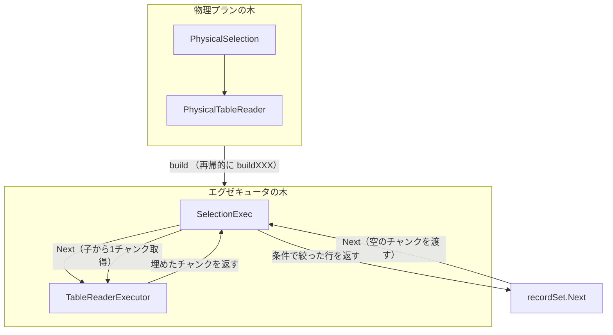

# 第12章 ベクトル化実行モデル

> **本章で読むソース**
>
> - [`pkg/executor/internal/exec/executor.go`](https://github.com/pingcap/tidb/blob/v8.5.6/pkg/executor/internal/exec/executor.go)
> - [`pkg/util/chunk/chunk.go`](https://github.com/pingcap/tidb/blob/v8.5.6/pkg/util/chunk/chunk.go)
> - [`pkg/util/chunk/column.go`](https://github.com/pingcap/tidb/blob/v8.5.6/pkg/util/chunk/column.go)
> - [`pkg/executor/builder.go`](https://github.com/pingcap/tidb/blob/v8.5.6/pkg/executor/builder.go)
> - [`pkg/executor/select.go`](https://github.com/pingcap/tidb/blob/v8.5.6/pkg/executor/select.go)
> - [`pkg/expression/chunk_executor.go`](https://github.com/pingcap/tidb/blob/v8.5.6/pkg/expression/chunk_executor.go)

## この章の狙い

第9章で物理プランの木が選び終わった。
その木は「何をどの順で実行するか」を表す設計図であって、まだデータを動かす機械ではない。

本章では、物理プランの木からエグゼキュータの木を組み立て、結果を上位へ汲み上げる**ベクトル化実行モデル**を読む。
TiDB のエグゼキュータは Volcano 反復子モデルを土台にしながら、1行ずつではなく**チャンク**という列指向のまとまり単位で `Next` を呼ぶ。
この章では、エグゼキュータの契約を定める `Executor` インターフェース、データを運ぶ `Chunk` の構造、物理プランからエグゼキュータを構築する `executorBuilder`、そして列単位の式評価までを範囲とする。

## 前提

第9章で物理プラン `PhysicalPlan` の木が確定し、各演算子が自分の出力スキーマと子演算子への参照を持っている。
本章の構築処理は、この木を入力に取る。
チャンクを実際に詰めるテーブル読み取りそのものは第13章、結合や集約のように複数行をまたいで状態を持つ演算子は第14章で扱う。
本章では、エグゼキュータの土台となる反復の枠組みに集中する。

## `Executor` インターフェースが Open-Next-Close の契約を定める

すべてのエグゼキュータは `Executor` インターフェースを実装する。
中心となるのは `Open`、`Next`、`Close` の3つのメソッドで、これが反復子の生存期間を定める。
`Open` で子を含めて初期化し、`Next` を繰り返して結果を取り出し、`Close` で資源を解放する。

[`pkg/executor/internal/exec/executor.go` L41-L77](https://github.com/pingcap/tidb/blob/v8.5.6/pkg/executor/internal/exec/executor.go#L41-L77)

```go
// Executor is the physical implementation of an algebra operator.
//
// In TiDB, all algebra operators are implemented as iterators, i.e., they
// support a simple Open-Next-Close protocol. See this paper for more details:
//
// "Volcano-An Extensible and Parallel Query Evaluation System"
//
// Different from Volcano's execution model, a "Next" function call in TiDB will
// return a batch of rows, other than a single row in Volcano.
// NOTE: Executors must call "chk.Reset()" before appending their results to it.
type Executor interface {
	NewChunk() *chunk.Chunk
	NewChunkWithCapacity(fields []*types.FieldType, capacity int, maxCachesize int) *chunk.Chunk

	RuntimeStats() *execdetails.BasicRuntimeStats

	HandleSQLKillerSignal() error
	RegisterSQLAndPlanInExecForTopSQL()

	AllChildren() []Executor
	SetAllChildren([]Executor)
	Open(context.Context) error
	Next(ctx context.Context, req *chunk.Chunk) error

	// `Close()` may be called at any time after `Open()` and it may be called with `Next()` at the same time
	Close() error
	Schema() *expression.Schema
	RetFieldTypes() []*types.FieldType
	InitCap() int
	MaxChunkSize() int

	// Detach detaches the current executor from the session context without considering its children.
	//
	// It has to make sure, no matter whether it returns true or false, both the original executor and the returning executor
	// should be able to be used correctly.
	Detach() (Executor, bool)
}
```

このコメントが、TiDB の反復が古典的な Volcano と分かれる点を明言している。
古典的な Volcano では `Next` が1行を返すが、TiDB の `Next` は複数行のまとまりを返す。
署名 `Next(ctx context.Context, req *chunk.Chunk) error` は、行を返り値で戻すのではなく、呼び出し側が用意した出力先のチャンク `req` を受け取り、そこへ結果を書き込む形を取る。
出力先を呼び出し側が所有するため、チャンクを使い回せて、毎回の割り当てを避けられる。

`AllChildren` が子エグゼキュータの並びを返し、これによって `Open` と `Close` が木を再帰的にたどる。
`MaxChunkSize` と `InitCap` は、1回の `Next` が詰めるチャンクの最大行数と初期容量を表し、後述する行数制御の上限になる。

## `BaseExecutor` が共通実装を集める

ほとんどのエグゼキュータは、固有の状態だけを持ち、共通のメソッドを `BaseExecutor` から埋め込みで受け取る。
`BaseExecutor` はセッションコンテキストに加え、子の並び、出力スキーマ、チャンク割り当て器などを束ねた `BaseExecutorV2` を内包する。

[`pkg/executor/internal/exec/executor.go` L356-L371](https://github.com/pingcap/tidb/blob/v8.5.6/pkg/executor/internal/exec/executor.go#L356-L371)

```go
// BaseExecutor holds common information for executors.
type BaseExecutor struct {
	_ constructor.Constructor `ctor:"NewBaseExecutor"`

	ctx sessionctx.Context

	BaseExecutorV2
}

// NewBaseExecutor creates a new BaseExecutor instance.
func NewBaseExecutor(ctx sessionctx.Context, schema *expression.Schema, id int, children ...Executor) BaseExecutor {
	return BaseExecutor{
		ctx:            ctx,
		BaseExecutorV2: NewBaseExecutorV2(ctx.GetSessionVars(), schema, id, children...),
	}
}
```

`BaseExecutorV2` の `Open` は、自分の子を順にたどって `Open` を呼ぶだけの既定実装を持つ。

[`pkg/executor/internal/exec/executor.go` L300-L309](https://github.com/pingcap/tidb/blob/v8.5.6/pkg/executor/internal/exec/executor.go#L300-L309)

```go
// Open initializes children recursively and "childrenResults" according to children's schemas.
func (e *BaseExecutorV2) Open(ctx context.Context) error {
	for _, child := range e.children {
		err := Open(ctx, child)
		if err != nil {
			return err
		}
	}
	return nil
}
```

固有の準備が要る演算子は、自前の `Open` でこの既定実装を呼んでから初期化を足す。
同様に `BaseExecutorV2.Next` は何も書かない空実装で、結果を生むエグゼキュータがこれを上書きする。

[`pkg/executor/internal/exec/executor.go` L322-L325](https://github.com/pingcap/tidb/blob/v8.5.6/pkg/executor/internal/exec/executor.go#L322-L325)

```go
// Next fills multiple rows into a chunk.
func (*BaseExecutorV2) Next(_ context.Context, _ *chunk.Chunk) error {
	return nil
}
```

この埋め込み構造のおかげで、各演算子は子の管理やスキーマ保持を書き直さずに済み、自分のアルゴリズムだけに集中できる。

## チャンクが列指向でデータを運ぶ

エグゼキュータの間を流れるデータの単位が `Chunk` である。
チャンクは複数行を持つが、内部では行ごとにまとめるのではなく、列ごとに値をまとめて持つ。

[`pkg/util/chunk/chunk.go` L27-L54](https://github.com/pingcap/tidb/blob/v8.5.6/pkg/util/chunk/chunk.go#L27-L54)

```go
// Chunk stores multiple rows of data in columns. Columns are in Apache Arrow format.
// See https://arrow.apache.org/docs/format/Columnar.html#physical-memory-layout.
// Apache Arrow is not used directly because we want to access MySQL types without decoding.
//
// Values are appended in compact format and can be directly accessed without decoding.
// When the chunk is done processing, we can reuse the allocated memory by resetting it.
//
// All Chunk's API should not do the validation work, and the user should ensure it is used correctly.
type Chunk struct {
	// sel indicates which rows are selected.
	// If it is nil, all rows are selected.
	sel []int

	columns []*Column
	// numVirtualRows indicates the number of virtual rows, which have zero Column.
	// It is used only when this Chunk doesn't hold any data, i.e. "len(columns)==0".
	numVirtualRows int
	// capacity indicates the max number of rows this chunk can hold.
	// TODO: replace all usages of capacity to requiredRows and remove this field
	capacity int

	// requiredRows indicates how many rows the parent executor want.
	requiredRows int

	// inCompleteChunk means some of the columns in the chunk is not filled, used in
	// join probe, the value will always be false unless set it explicitly
	inCompleteChunk bool
}
```

チャンクは `columns` という `Column` の並びを持ち、各 `Column` が1列分の値を連続領域に詰める。
レイアウトは Apache Arrow に倣う列指向で、Arrow をそのまま使わないのは、MySQL の型をデコードせずに直接アクセスするためだとコメントが述べる。
1列分の値が連続して並ぶので、ある列だけを順になめる処理は、メモリ局所性が高くキャッシュに乗りやすい。

`Column` の実体を見ると、値の本体 `data` と、NULL を1ビットで表す `nullBitmap`、可変長型の各行開始位置 `offsets` を別々の配列で持つ。

[`pkg/util/chunk/column.go` L71-L81](https://github.com/pingcap/tidb/blob/v8.5.6/pkg/util/chunk/column.go#L71-L81)

```go
// Column stores one column of data in Apache Arrow format.
// See https://arrow.apache.org/docs/format/Columnar.html#format-columnar
type Column struct {
	length     int
	nullBitmap []byte  // bit 0 is null, 1 is not null
	offsets    []int64 // used for varLen column. Row i starts from data[offsets[i]]
	data       []byte
	elemBuf    []byte

	avoidReusing bool // avoid reusing the Column by allocator
}
```

固定長型なら `data` を要素サイズで区切るだけで値を取り出せ、可変長型なら `offsets` で各行の境界を引く。
NULL 判定は `nullBitmap` のビットを見るだけで、値そのものを読まずに済む。
この分離によって、1列を一括で走査する式評価が、配列をなめる単純なループに落ちる。

## `RequiredRows` で上位が必要な行数を下位へ伝える

チャンク単位の反復には、上位が途中で打ち切る場合への配慮が要る。
`LIMIT 5` のように5行だけ要る上位が、下位に毎回1024行を作らせては無駄が出る。
そこでチャンクは、親が欲しい行数 `requiredRows` を保持し、`SetRequiredRows` で下位に伝える。

[`pkg/util/chunk/chunk.go` L195-L212](https://github.com/pingcap/tidb/blob/v8.5.6/pkg/util/chunk/chunk.go#L195-L212)

```go
// RequiredRows returns how many rows is considered full.
func (c *Chunk) RequiredRows() int {
	return c.requiredRows
}

// SetRequiredRows sets the number of required rows.
func (c *Chunk) SetRequiredRows(requiredRows, maxChunkSize int) *Chunk {
	if requiredRows <= 0 || requiredRows > maxChunkSize {
		requiredRows = maxChunkSize
	}
	c.requiredRows = requiredRows
	return c
}

// IsFull returns if this chunk is considered full.
func (c *Chunk) IsFull() bool {
	return c.NumRows() >= c.requiredRows
}
```

`SetRequiredRows` は要求行数を上限 `maxChunkSize` で頭打ちにし、範囲外なら最大値へ戻す。
結果を詰めるエグゼキュータは `IsFull` を見て、要求行数に達したら `Next` を打ち切る。
要求行数を初期値の `maxChunkSize` のままにしておけば、`IsFull` は「チャンクが最大行数に達したか」と一致するので、上位が制限をかけない通常の経路はそのまま動く。

## `executorBuilder` が物理プランの木からエグゼキュータの木を組む

物理プランをエグゼキュータへ変換するのが `executorBuilder` である。
入口の `build` は、物理プランの型で分岐し、対応する `buildXXX` を呼ぶ巨大な型スイッチになっている。

[`pkg/executor/builder.go` L166-L217](https://github.com/pingcap/tidb/blob/v8.5.6/pkg/executor/builder.go#L166-L217)

```go
func (b *executorBuilder) build(p base.Plan) exec.Executor {
	switch v := p.(type) {
	case nil:
		return nil
	case *plannercore.CheckTable:
		return b.buildCheckTable(v)
// ... (中略) ...
	case *plannercore.PhysicalLimit:
		return b.buildLimit(v)
```

各 `buildXXX` は、自分の子の物理プランに対して `build` を再帰的に呼び、戻ってきた子エグゼキュータを引数に自分のエグゼキュータを組み立てる。
フィルタを表す `PhysicalSelection` の構築がその典型である。

[`pkg/executor/builder.go` L2131-L2142](https://github.com/pingcap/tidb/blob/v8.5.6/pkg/executor/builder.go#L2131-L2142)

```go
func (b *executorBuilder) buildSelection(v *plannercore.PhysicalSelection) exec.Executor {
	childExec := b.build(v.Children()[0])
	if b.err != nil {
		return nil
	}
	e := &SelectionExec{
		selectionExecutorContext: newSelectionExecutorContext(b.ctx),
		BaseExecutorV2:           exec.NewBaseExecutorV2(b.ctx.GetSessionVars(), v.Schema(), v.ID(), childExec),
		filters:                  v.Conditions,
	}
	return e
}
```

最初の `b.build(v.Children()[0])` が子の物理プランをエグゼキュータへ変換し、その `childExec` を `NewBaseExecutorV2` に渡す。
こうして子から親へエグゼキュータが組み上がり、物理プランの木と同じ形のエグゼキュータの木ができる。
親の `SelectionExec` は、フィルタ条件 `v.Conditions` を自分の状態として持ち、実行時にこれをチャンクへ適用する。

物理プランの木とエグゼキュータの木が、構築と実行でどう対応するかを次に示す。



## チャンク単位の `Next` が木を流れる

構築されたエグゼキュータの木は、根から `Next` を呼ぶと木を下って結果を汲み上げる。
上位が `Next` を呼ぶたびに、空のチャンクが下位へ渡り、下位はそれを満たして返す。

汎用の入口になるのが `exec.Next` ラッパーで、各演算子の `Next` を呼ぶ前後で実行時統計の記録やクエリ強制終了の確認をまとめて行う。

[`pkg/executor/internal/exec/executor.go` L436-L463](https://github.com/pingcap/tidb/blob/v8.5.6/pkg/executor/internal/exec/executor.go#L436-L463)

```go
// Next is a wrapper function on e.Next(), it handles some common codes.
func Next(ctx context.Context, e Executor, req *chunk.Chunk) (err error) {
	defer func() {
		if r := recover(); r != nil {
			err = util.GetRecoverError(r)
		}
	}()
	if e.RuntimeStats() != nil {
		start := time.Now()
		defer func() { e.RuntimeStats().Record(time.Since(start), req.NumRows()) }()
	}

	if err := e.HandleSQLKillerSignal(); err != nil {
		return err
	}

	r, ctx := tracing.StartRegionEx(ctx, reflect.TypeOf(e).String()+".Next")
	defer r.End()

	e.RegisterSQLAndPlanInExecForTopSQL()
	err = e.Next(ctx, req)

	if err != nil {
		return err
	}
	// recheck whether the session/query is killed during the Next()
	return e.HandleSQLKillerSignal()
}
```

統計の記録に渡す `req.NumRows()` は、いま埋まったチャンクの行数である。
1回の `Next` の前後でこれを1度測れば、その呼び出しで処理した全行のコストをまとめて記録できる。

`SelectionExec.Next` は、子からチャンクを引き、条件に合う行だけを出力チャンクへ詰める。
ここにチャンク単位処理と列単位の式評価が両方現れる。

[`pkg/executor/select.go` L748-L784](https://github.com/pingcap/tidb/blob/v8.5.6/pkg/executor/select.go#L748-L784)

```go
// Next implements the Executor Next interface.
func (e *SelectionExec) Next(ctx context.Context, req *chunk.Chunk) error {
	req.GrowAndReset(e.MaxChunkSize())

	if !e.batched {
		return e.unBatchedNext(ctx, req)
	}

	for {
		for ; e.inputRow != e.inputIter.End(); e.inputRow = e.inputIter.Next() {
			if req.IsFull() {
				return nil
			}

			if !e.selected[e.inputRow.Idx()] {
				continue
			}

			req.AppendRow(e.inputRow)
		}
		mSize := e.childResult.MemoryUsage()
		err := exec.Next(ctx, e.Children(0), e.childResult)
		e.memTracker.Consume(e.childResult.MemoryUsage() - mSize)
		if err != nil {
			return err
		}
		// no more data.
		if e.childResult.NumRows() == 0 {
			return nil
		}
		e.selected, err = expression.VectorizedFilter(e.evalCtx, e.enableVectorizedExpression, e.filters, e.inputIter, e.selected)
		if err != nil {
			return err
		}
		e.inputRow = e.inputIter.Begin()
	}
}
```

外側のループは、子から `childResult` チャンクを1つ引いては、その全行をフィルタにかける。
`exec.Next(ctx, e.Children(0), e.childResult)` で子の1チャンクを取り、`VectorizedFilter` でチャンク全体を一括評価して、各行が条件を満たすかを `e.selected` に書く。
内側のループは `e.selected` を見て、通った行だけを出力 `req` へ詰め、`req.IsFull()` になったら戻る。
子のチャンクを使い切ったら、また子の `Next` を呼んで次のチャンクを引く。
出力先 `req` は冒頭の `req.GrowAndReset` で再利用され、行を1つずつ返り値で返す経路がない。

## 行ごとの呼び出しをチャンク単位の評価に畳み込む

このモデルの速さは、関数呼び出しと式評価のオーバーヘッドを行数で割る点にある。
古典的な Volcano では `Next` が1行を返すので、N 行を処理するには N 回の仮想呼び出しが連鎖を上下する。
TiDB は `Next` 1回で最大1024行を運ぶので、同じ N 行に対する `Next` の呼び出し回数は約 1024 分の1に減り、呼び出しと境界チェックの固定費が多数の行で償却される。

式評価でも同じ畳み込みが効く。
`VectorizedFilter` は条件をチャンクへ適用するが、その内側でまず全フィルタがベクトル評価可能かを確かめ、可能でベクトル化が有効なら列単位の評価へ進む。

[`pkg/expression/chunk_executor.go` L432-L449](https://github.com/pingcap/tidb/blob/v8.5.6/pkg/expression/chunk_executor.go#L432-L449)

```go
func VectorizedFilterConsiderNull(ctx EvalContext, vecEnabled bool, filters []Expression, iterator *chunk.Iterator4Chunk, selected []bool, isNull []bool) ([]bool, []bool, error) {
	// canVectorized used to check whether all of the filters can be vectorized evaluated
	canVectorized := true
	for _, filter := range filters {
		if !filter.Vectorized() {
			canVectorized = false
			break
		}
	}

	input := iterator.GetChunk()
	sel := input.Sel()
	var err error
	if canVectorized && vecEnabled {
		selected, isNull, err = vectorizedFilter(ctx, vecEnabled, filters, iterator, selected, isNull)
	} else {
		selected, isNull, err = rowBasedFilter(ctx, filters, iterator, selected, isNull)
	}
```

ベクトル評価の経路では、式は1行ずつではなく1列まるごとを入力に取り、列の連続領域を単純なループでなめる。
列指向チャンクと組み合わさることで、このループはメモリ局所性が高く、行ごとの型分岐やインターフェース越しの値取得を行数ぶん繰り返さずに済む。
すべての条件がベクトル化可能でないときや機能が無効なときは `rowBasedFilter` へ退避するので、評価の正しさはどちらの経路でも保たれる。

チャンクの容量は固定ではなく、必要に応じて倍々に伸ばす。
`reCalcCapacity` は、現在のチャンクが満杯のときだけ容量を2倍にし、上限 `maxChunkSize` で頭打ちにする。

[`pkg/util/chunk/chunk.go` L357-L368](https://github.com/pingcap/tidb/blob/v8.5.6/pkg/util/chunk/chunk.go#L357-L368)

```go
// reCalcCapacity calculates the capacity for another Chunk based on the current
// Chunk. The new capacity is doubled only when the current Chunk is full.
func reCalcCapacity(c *Chunk, maxChunkSize int) int {
	if c.NumRows() < c.capacity {
		return c.capacity
	}
	newCapacity := c.capacity * 2
	if newCapacity == 0 {
		newCapacity = InitialCapacity
	}
	return min(newCapacity, maxChunkSize)
}
```

初期容量は小さく取り、必要なら最大行数まで段階的に広げる。
既定では初期容量が32行、最大が1024行で、少量で終わるクエリには小さなチャンクを割り当て、大量行を流すクエリには大きなチャンクで償却を効かせる。
この適応的な伸長によって、結果が小さいクエリで1024行ぶんのメモリを無駄に確保することを避けつつ、行数が多いときには償却の利点を得られる。

## まとめ

TiDB のエグゼキュータは、Open-Next-Close の反復子契約を `Executor` インターフェースで定め、共通実装を `BaseExecutor` に集める。
`executorBuilder.build` が物理プランの木を再帰的にたどり、子から親へエグゼキュータを組んで同じ形の木を作る。
データはチャンク単位で流れ、`Next` 1回が最大1024行を運ぶことで、仮想呼び出しと式評価の固定費を行数で割る。
チャンクは列指向で値を持つので、フィルタや式は列の連続領域をなめるベクトル評価に落ち、メモリ局所性が高い。
`RequiredRows` による上位からの行数制御と、満杯時にだけ倍化する容量計算が、小さいクエリの無駄と大きいクエリの償却を両立させる。

## 関連する章

- [第9章 コストモデルと物理最適化（CBO）](../part02-optimizer/09-physical-optimization.md)：本章が組み立てるエグゼキュータの入力となる物理プランの木を選ぶ仕組み。
- [第13章 分散読み取りと結果の合流](13-distributed-read.md)：チャンクを実際に満たすテーブル読み取りと、コプロセッサからの結果合流。
- [第14章 結合、集約、ソートの実行](14-join-agg-sort.md)：複数行をまたいで状態を持つ結合や集約のエグゼキュータの実装。
