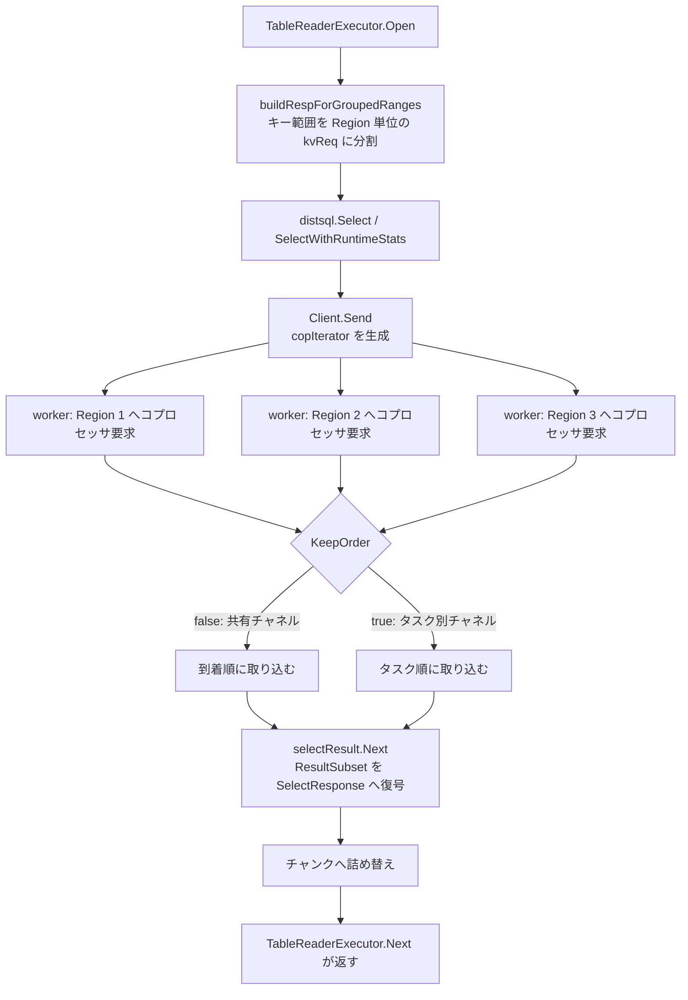

# 第13章 分散読み取りと結果の合流

> **本章で読むソース**
>
> - [`pkg/executor/table_reader.go`](https://github.com/pingcap/tidb/blob/v8.5.6/pkg/executor/table_reader.go)
> - [`pkg/executor/distsql.go`](https://github.com/pingcap/tidb/blob/v8.5.6/pkg/executor/distsql.go)
> - [`pkg/distsql/distsql.go`](https://github.com/pingcap/tidb/blob/v8.5.6/pkg/distsql/distsql.go)
> - [`pkg/distsql/select_result.go`](https://github.com/pingcap/tidb/blob/v8.5.6/pkg/distsql/select_result.go)
> - [`pkg/store/copr/coprocessor.go`](https://github.com/pingcap/tidb/blob/v8.5.6/pkg/store/copr/coprocessor.go)

## この章の狙い

第10章で、述語や集約を TiKV へ押し下げた**コプロセッサ要求**（DAG 要求）が `RequestBuilder` で組み立てられるところまでを読んだ。
本章では、その要求を実際に TiKV へ送り、複数の Region から戻ってくる部分結果を1本のチャンク列に合流させる**分散読み取り**を読む。

押し下げで決まるのは「各 Region で何を計算するか」である。
分散読み取りで決まるのは「その要求をどの Region に、どの順で、どれだけ並行に投げ、戻った断片をどうつなぐか」である。
ひとつのテーブルスキャンは、キー範囲が複数の Region にまたがれば複数のコプロセッサ要求に分かれる。
それらを直列に投げて待てば、Region 数に比例して待ち時間が伸びる。

そこで TiDB は要求を Region 単位に分割して並行に投げ、順序が要らないときは到着順に取り込んで待ち時間を隠す。
この章では、`TableReaderExecutor` が `distsql.Select` を呼んで `SelectResult` を得る流れ、`selectResult` が部分結果をチャンクへ解す流れ、そして並行実行と順序保持を担う `copIterator` の仕組みを順に読む。

## 前提

第10章で、コプロセッサ要求が `kv.Request` として組み立てられ、`Client.Send` で TiKV へ送られ、Region ごとの部分結果として戻ることを概観した。
本章はその要求を送る側、すなわちエグゼキュータと `distsql` 層の実装を読む。

第12章で、エグゼキュータが `Open` で準備し `Next` でチャンク単位に結果を引き出す**ベクトル化実行モデル**を読んだ。
`TableReaderExecutor` もこのモデルに従う。
リーフのエグゼキュータである点が違いで、子エグゼキュータの代わりに TiKV のコプロセッサが結果の供給源になる。

TiKV 側でコプロセッサ要求がどう実行されるかは本書の対象外であり、TiKV を読む別の本に譲る。
本章は、要求を投げて応答を受け取る計算層の側に集中する。

## TableReaderExecutor が要求を送り SelectResult を得る

`TableReaderExecutor` は、DAG 要求を組み立てて TiKV へ送り、テーブルデータを読み出すリーフのエグゼキュータである。
その役割は型のコメントに簡潔に書かれている。

[`pkg/executor/table_reader.go` L135-L136](https://github.com/pingcap/tidb/blob/v8.5.6/pkg/executor/table_reader.go#L135-L136)

```go
// TableReaderExecutor sends DAG request and reads table data from kv layer.
type TableReaderExecutor struct {
```

要求を送る処理は `Open` で起きる。
`Open` は読むべきキー範囲を整理し、`buildRespForGroupedRanges` を呼んで `SelectResult` を構築する。
ここで `SelectResult` は、コプロセッサの部分結果を順に返すイテレータである。

[`pkg/executor/table_reader.go` L333-L348](https://github.com/pingcap/tidb/blob/v8.5.6/pkg/executor/table_reader.go#L333-L348)

```go
	var firstResult distsql.SelectResult
	firstResult, err = e.buildRespForGroupedRanges(ctx, firstPartGroupedRanges)
	if err != nil {
		return err
	}
	if len(secondPartGroupedRanges) == 0 {
		e.resultHandler.open(nil, firstResult)
		return nil
	}
	var secondResult distsql.SelectResult
	secondResult, err = e.buildRespForGroupedRanges(ctx, secondPartGroupedRanges)
	if err != nil {
		return err
	}
	e.resultHandler.open(firstResult, secondResult)
	return nil
```

範囲を2つに分けているのは、符号付き整数の主キーが昇順スキャンと物理的なキー順でずれるためである。
無符号の主キーでは `(MaxInt64, MaxUint64]` の範囲が `[0, MaxInt64]` より物理的に前に並ぶので、順序を保つときは範囲を符号境界で割って別々の `SelectResult` にし、`tableResultHandler` が前半を読み切ってから後半を読む。
順序を保つ必要がなければ後半は空になり、`SelectResult` は1本になる。

`buildRespForGroupedRanges` の中心は、キー範囲ごとに作った `kv.Request` を `SelectResult` へ変換するループである。

[`pkg/executor/table_reader.go` L450-L464](https://github.com/pingcap/tidb/blob/v8.5.6/pkg/executor/table_reader.go#L450-L464)

```go
	results := make([]distsql.SelectResult, 0, len(kvReqs))
	for _, kvReq := range kvReqs {
		result, err := e.SelectResult(ctx, e.dctx, kvReq, exec.RetTypes(e), getPhysicalPlanIDs(e.plans), e.ID())
		if err != nil {
			return nil, err
		}
		results = append(results, result)
	}
	if len(results) == 1 {
		return results[0], nil
	}

	intest.Assert(len(e.byItems) > 0,
		"In current logic, if there are more than one result, len(e.byItems) must be > 0")
	return distsql.NewSortedSelectResults(e.ectx.GetEvalCtx(), results, e.Schema(), e.byItems, e.memTracker), nil
```

`SelectResult` が1本のときは、その `selectResult` の内部で複数 Region への並行アクセスが起きる。
複数本になるのは、パーティションテーブルを順序付きで読むなど、各 `kv.Request` の結果をさらに整列して束ねる必要があるときである。
その場合は `NewSortedSelectResults` が複数の `SelectResult` をマージソートで1本に見せる。
この整列の仕組みは後の節で読む。

ここで呼ばれる `e.SelectResult` は、テスト用のフックを挟むためのラッパーで、実体は `distsql.SelectWithRuntimeStats` である。

[`pkg/executor/table_reader.go` L68-L74](https://github.com/pingcap/tidb/blob/v8.5.6/pkg/executor/table_reader.go#L68-L74)

```go
func (sr selectResultHook) SelectResult(ctx context.Context, dctx *distsqlctx.DistSQLContext, kvReq *kv.Request,
	fieldTypes []*types.FieldType, copPlanIDs []int, rootPlanID int) (distsql.SelectResult, error) {
	if sr.selectResultFunc == nil {
		return distsql.SelectWithRuntimeStats(ctx, dctx, kvReq, fieldTypes, copPlanIDs, rootPlanID)
	}
	return sr.selectResultFunc(ctx, dctx, kvReq, fieldTypes, copPlanIDs)
}
```

インデックスを読む `IndexReaderExecutor`（`pkg/executor/distsql.go`）も同じ構造を取る。
`Open` がキー範囲を組み立て、整列が不要なら1本の `SelectResult` を、必要なら複数本を `NewSortedSelectResults` で束ねたものを `e.result` に持つ。

[`pkg/executor/distsql.go` L396-L405](https://github.com/pingcap/tidb/blob/v8.5.6/pkg/executor/distsql.go#L396-L405)

```go
	if !needMergeSort(e.byItems, len(kvRanges)) {
		kvReq, err := e.buildKVReq(kvRanges)
		if err != nil {
			return err
		}
		e.result, err = e.SelectResult(ctx, e.dctx, kvReq, exec.RetTypes(e), getPhysicalPlanIDs(e.plans), e.ID())
		if err != nil {
			return err
		}
	} else {
```

どちらのエグゼキュータも `Next` では `SelectResult` の `Next` を呼ぶだけになる。
要求を送る判断は `Open` に集約され、`Next` はチャンクを引き出す薄い層に保たれている。

## distsql.Select が要求を送り selectResult を組み立てる

`distsql.Select` は DAG 要求を送り、`SelectResult` を返す関数である。
コメントが入力の契約を示している。
`KeyRanges` は必須で、`Concurrency`、`KeepOrder`、`Desc` などは任意である。

[`pkg/distsql/distsql.go` L56-L58](https://github.com/pingcap/tidb/blob/v8.5.6/pkg/distsql/distsql.go#L56-L58)

```go
// Select sends a DAG request, returns SelectResult.
// In kvReq, KeyRanges is required, Concurrency/KeepOrder/Desc/IsolationLevel/Priority are optional.
func Select(ctx context.Context, dctx *distsqlctx.DistSQLContext, kvReq *kv.Request, fieldTypes []*types.FieldType) (SelectResult, error) {
```

関数の本体は2段に分かれる。
まず `dctx.Client.Send` で要求を送り、`kv.Response` を得る。
この `Send` の内側で要求が Region 単位のタスクに分割され、並行に投げられる。

[`pkg/distsql/distsql.go` L108-L111](https://github.com/pingcap/tidb/blob/v8.5.6/pkg/distsql/distsql.go#L108-L111)

```go
	resp := dctx.Client.Send(ctx, kvReq, dctx.KVVars, option)
	if resp == nil {
		return nil, errors.New("client returns nil response")
	}
```

次に、得た `kv.Response` を `selectResult` に包んで返す。
`selectResult` は応答を解読する役だけを持ち、ネットワークアクセスそのものは `resp` の側にある。

[`pkg/distsql/distsql.go` L121-L132](https://github.com/pingcap/tidb/blob/v8.5.6/pkg/distsql/distsql.go#L121-L132)

```go
	return &selectResult{
		label:              "dag",
		resp:               resp,
		rowLen:             len(fieldTypes),
		fieldTypes:         fieldTypes,
		ctx:                dctx,
		sqlType:            label,
		memTracker:         kvReq.MemTracker,
		storeType:          kvReq.StoreType,
		paging:             kvReq.Paging.Enable,
		distSQLConcurrency: kvReq.Concurrency,
	}, nil
```

`SelectWithRuntimeStats` は `Select` を呼んだうえで、実行統計を集めるためのプラン ID を `selectResult` に書き込むだけの薄いラッパーである。

[`pkg/distsql/distsql.go` L161-L172](https://github.com/pingcap/tidb/blob/v8.5.6/pkg/distsql/distsql.go#L161-L172)

```go
func SelectWithRuntimeStats(ctx context.Context, dctx *distsqlctx.DistSQLContext, kvReq *kv.Request,
	fieldTypes []*types.FieldType, copPlanIDs []int, rootPlanID int) (SelectResult, error) {
	sr, err := Select(ctx, dctx, kvReq, fieldTypes)
	if err != nil {
		return nil, err
	}
	if selectResult, ok := sr.(*selectResult); ok {
		selectResult.copPlanIDs = copPlanIDs
		selectResult.rootPlanID = rootPlanID
	}
	return sr, nil
}
```

ここまでで、`kvReq` に積まれた `Concurrency` と `KeepOrder` が `Client.Send` の内側へ渡り、`selectResult` は1個の `kv.Response` を相手にする構図ができる。
複数 Region への並行アクセスは `kv.Response` の実装、すなわち `copIterator` が担う。

## selectResult が応答をチャンクに解す

`selectResult` は、コプロセッサの部分結果を順に返すイテレータである。
インターフェースのコメントがその役割を示している。

[`pkg/distsql/select_result.go` L71-L72](https://github.com/pingcap/tidb/blob/v8.5.6/pkg/distsql/select_result.go#L71-L72)

```go
// SelectResult is an iterator of coprocessor partial results.
type SelectResult interface {
```

エグゼキュータの `Next` から呼ばれるのが `selectResult.Next` である。
手元に未消費の応答（`selectResp`）が無ければ `fetchResp` で次の応答を取り、応答の符号化方式に応じてチャンクへ展開する。

[`pkg/distsql/select_result.go` L475-L499](https://github.com/pingcap/tidb/blob/v8.5.6/pkg/distsql/select_result.go#L475-L499)

```go
func (r *selectResult) Next(ctx context.Context, chk *chunk.Chunk) error {
	if r.iter != nil {
		return errors.New("selectResult is invalid after IntoIter()")
	}

	chk.Reset()
	if r.selectResp == nil || r.respChkIdx == len(r.selectResp.Chunks) {
		err := r.fetchResp(ctx)
		if err != nil {
			return err
		}
		if r.selectResp == nil {
			return nil
		}
	}
	// TODO(Shenghui Wu): add metrics
	encodeType := r.selectResp.GetEncodeType()
	switch encodeType {
	case tipb.EncodeType_TypeDefault:
		return r.readFromDefault(ctx, chk)
	case tipb.EncodeType_TypeChunk:
		return r.readFromChunk(ctx, chk)
	}
	return errors.Errorf("unsupported encode type:%v", encodeType)
}
```

`fetchResp` は、`resp.Next` を呼んで1個の部分結果（`ResultSubset`）を取り出し、その中身を `tipb.SelectResponse` へ復号する。
この `resp.Next` が、TiKV からの応答を1件受け取るアクセス点である。

[`pkg/distsql/select_result.go` L389-L421](https://github.com/pingcap/tidb/blob/v8.5.6/pkg/distsql/select_result.go#L389-L421)

```go
	for {
		r.respChkIdx = 0
		startTime := time.Now()
		resultSubset, err := r.resp.Next(ctx)
		duration := time.Since(startTime)
		r.fetchDuration += duration
		if err != nil {
			return errors.Trace(err)
		}
		if r.selectResp != nil {
			r.memConsume(-atomic.LoadInt64(&r.selectRespSize))
		}
		if resultSubset == nil {
			r.selectResp = nil
			atomic.StoreInt64(&r.selectRespSize, 0)
			if !r.durationReported {
				// final round of fetch
				// TODO: Add a label to distinguish between success or failure.
				// https://github.com/pingcap/tidb/issues/11397
				if r.paging {
					metrics.DistSQLQueryHistogram.WithLabelValues(r.label, r.sqlType, "paging").Observe(r.fetchDuration.Seconds())
				} else {
					metrics.DistSQLQueryHistogram.WithLabelValues(r.label, r.sqlType, "common").Observe(r.fetchDuration.Seconds())
				}
				r.durationReported = true
			}
			return nil
		}
		r.selectResp = new(tipb.SelectResponse)
		err = r.selectResp.Unmarshal(resultSubset.GetData())
		if err != nil {
			return errors.Trace(err)
		}
```

`resultSubset` が `nil` なら、すべての Region から応答を取り切ったということで、`selectResp` を `nil` にして読み取りを終える。
そうでなければ `Unmarshal` で `SelectResponse` に復号し、本体に含まれる行データのチャンク列を `selectResp.Chunks` に持つ。

復号した `SelectResponse` の中身を、エグゼキュータが渡したチャンクへ詰め替えるのが `readFromChunk` である。
ここに、チャンクのメモリを使い回すための小さな工夫がある。

[`pkg/distsql/select_result.go` L563-L579](https://github.com/pingcap/tidb/blob/v8.5.6/pkg/distsql/select_result.go#L563-L579)

```go
		if r.respChunkDecoder.IsFinished() {
			r.respChunkDecoder.Reset(r.selectResp.Chunks[r.respChkIdx].RowsData)
		}
		// If the next chunk size is greater than required rows * 0.8, reuse the memory of the next chunk and return
		// immediately. Otherwise, splice the data to one chunk and wait the next chunk.
		if r.respChunkDecoder.RemainedRows() > int(float64(chk.RequiredRows())*0.8) {
			if chk.NumRows() > 0 {
				return nil
			}
			r.respChunkDecoder.ReuseIntermChk(chk)
			r.respChkIdx++
			return nil
		}
		r.respChunkDecoder.Decode(chk)
		if r.respChunkDecoder.IsFinished() {
			r.respChkIdx++
		}
```

応答に含まれるチャンクが、要求されたチャンクサイズの8割を超えるほど大きければ、行を1行ずつ詰め替えずに、応答側のチャンクのメモリをそのまま使い回して返す。
小さければ複数の応答チャンクを1つに継ぎ合わせる。
受け取った断片の大きさに合わせて、コピーするか参照を移すかを切り替えている。

## 並行実行と順序保持の切り替え

ここまでで「`selectResult` は1個の `kv.Response` から応答を順に引き出す」ことを見た。
複数 Region への並行アクセスと、その結果をどの順で返すかは、`kv.Response` の実体である `copIterator`（`pkg/store/copr/coprocessor.go`）が担う。

`copIterator` の `Next` は、`KeepOrder` の有無で応答の取り出し方を分ける。
コメントがその設計を一文で述べている。

[`pkg/store/copr/coprocessor.go` L1096-L1097](https://github.com/pingcap/tidb/blob/v8.5.6/pkg/store/copr/coprocessor.go#L1096-L1097)

```go
	// If data order matters, response should be returned in the same order as copTask slice.
	// Otherwise all responses are returned from a single channel.
```

順序が要らないとき（`it.respChan != nil`）は、すべてのワーカーが1本の共有チャネルへ結果を送る。
`Next` はそのチャネルから、どの Region のものであれ先に届いた応答を受け取る。

[`pkg/store/copr/coprocessor.go` L1108-L1120](https://github.com/pingcap/tidb/blob/v8.5.6/pkg/store/copr/coprocessor.go#L1108-L1120)

```go
	} else if it.respChan != nil {
		// Get next fetched resp from chan
		resp, ok, closed = it.recvFromRespCh(ctx, it.respChan)
		if !ok || closed {
			it.actionOnExceed.close()
			return nil, errors.Trace(ctx.Err())
		}
		if resp == finCopResp {
			it.actionOnExceed.destroyTokenIfNeeded(func() {
				it.sendRate.PutToken()
			})
			return it.Next(ctx)
		}
```

順序が要るときは、各タスクが自前のチャネル（`task.respChan`）を持ち、`Next` はタスクを `it.curr` の順に1つずつ消費する。
いま読むべきタスクの応答が届くまで、後続の Region がすでに応答を返していてもそれを返さず待つ。

[`pkg/store/copr/coprocessor.go` L1121-L1144](https://github.com/pingcap/tidb/blob/v8.5.6/pkg/store/copr/coprocessor.go#L1121-L1144)

```go
	} else {
		for {
			if it.curr >= len(it.tasks) {
				// Resp will be nil if iterator is finishCh.
				it.actionOnExceed.close()
				return nil, nil
			}
			task := it.tasks[it.curr]
			resp, ok, closed = it.recvFromRespCh(ctx, task.respChan)
			if closed {
				// Close() is called or context cancelled/timeout, so Next() is invalid.
				return nil, errors.Trace(ctx.Err())
			}
			if ok {
				break
			}
			it.actionOnExceed.destroyTokenIfNeeded(func() {
				it.sendRate.PutToken()
			})
			// Switch to next task.
			it.tasks[it.curr] = nil
			it.curr++
		}
	}
```

どちらの場合も、Region へのコプロセッサ要求はワーカーが並行に投げている。
違うのは取り出し口だけである。
共有チャネルなら到着順、タスク別チャネルならタスク順に取り出す。

`KeepOrder` の値は、第10章で読んだ要求組み立ての段で `SetKeepOrder(e.keepOrder)` として `kv.Request` に積まれ、`Client.Send` を通って `copIterator` の `respChan` の有無を決める。
プランナが順序保持を要求したかどうかが、ここで応答の合流方法に直結する。

### なぜ速いか：到着順の取り込みで待ち時間を隠す

順序を保持しないスキャンでは、`copIterator` は Region 単位のコプロセッサ要求をワーカーで並行に投げ、戻った応答を共有チャネルから到着順に取り込む。
ある Region の応答が遅れても、`Next` は先に届いた別 Region の応答を返して計算層の処理を進められる。
全要求を直列に投げて1件ずつ待つ実装に比べ、Region ごとの待ち時間が重なり合って隠れるので、テーブル全体の読み取り時間は最も遅い Region の応答時間に近づく。

順序を保つときは、この自由を一部手放す。
いま読むべきタスクの応答を待つあいだ、後続の Region がすでに返した応答は手元に積まれるが返せない。
要求自体は並行に投げ続けているので無駄なアクセスにはならないが、取り出しはタスク順に縛られる。
順序が本当に要るとき（`ORDER BY` がインデックス順に解決されるときなど）だけこの制約を課し、要らないときは到着順の自由を享受する。
これが、要求を Region 単位に分割して並列に投げ、順序が不要なら到着順に取り込んで待ち時間を隠す、という機構の核である。

## 複数の SelectResult を整列して束ねる

エグゼキュータが複数本の `SelectResult` を持つときは、それらをマージソートで1本に見せる `sortedSelectResults` を使う。
パーティションテーブルを順序付きで読むなど、Region をまたぐだけでなく `SelectResult` をまたいで整列が要る場合である。

`sortedSelectResults.Next` は、各 `SelectResult` から取り出した先頭行をヒープに入れ、最小の行を順に取り出してチャンクへ詰める。

[`pkg/distsql/select_result.go` L231-L246](https://github.com/pingcap/tidb/blob/v8.5.6/pkg/distsql/select_result.go#L231-L246)

```go
	for c.NumRows() < c.RequiredRows() {
		if ssr.heap.Len() == 0 {
			break
		}

		idx := heap.Pop(ssr.heap).(chunk.RowPtr)
		c.AppendRow(ssr.cachedChunks[idx.ChkIdx].GetRow(int(idx.RowIdx)))
		if int(idx.RowIdx) >= ssr.cachedChunks[idx.ChkIdx].NumRows()-1 {
			if err = ssr.updateCachedChunk(ctx, idx.ChkIdx); err != nil {
				return err
			}
		} else {
			heap.Push(ssr.heap, chunk.RowPtr{ChkIdx: idx.ChkIdx, RowIdx: idx.RowIdx + 1})
		}
	}
	return nil
```

各 `SelectResult` は内部でソート済みの行を返すので、先頭行どうしをヒープで比べれば全体の整列が得られる。
取り出した行が属するチャンクを使い切ったときだけ `updateCachedChunk` で次のチャンクを補充する。
整列が不要なら、エグゼキュータは1本の `SelectResult` を直接返し、このヒープを通さない。

## 全体の流れ

ここまでの流れを図にまとめる。
`TableReaderExecutor.Open` が要求を組み立てて `distsql.Select` を呼び、`copIterator` が Region 単位の要求を並行に投げ、応答が `selectResult` で復号されてチャンクになる。



要求の組み立てと送信は `Open` に集約され、並行アクセスと順序保持は `copIterator` が担い、応答の復号とチャンク化は `selectResult` が担う。
3つの層が役割を分け持つことで、エグゼキュータの `Next` は「次のチャンクを引く」だけの薄い操作に保たれている。

## まとめ

`TableReaderExecutor` と `IndexReaderExecutor` は、押し下げ済みの DAG 要求をキー範囲ごとの `kv.Request` に分け、`distsql.Select` を通して `SelectResult` を得る。
`distsql.Select` は `Client.Send` で要求を送り、得た `kv.Response` を `selectResult` に包む。
複数 Region への並行アクセスは `kv.Response` の実体である `copIterator` が担い、`KeepOrder` の有無で応答の取り出し口を切り替える。
順序が要らなければ共有チャネルから到着順に取り込んで待ち時間を隠し、要るときだけタスク順に縛る。
`selectResult` は受け取った部分結果を `SelectResponse` へ復号し、チャンクのメモリを使い回しながらエグゼキュータのチャンクへ詰め替える。
複数の `SelectResult` をまたいで整列が要るときは、`sortedSelectResults` がヒープで先頭行をマージする。

## 関連する章

- [第10章 コプロセッサ押し下げ](../part02-optimizer/10-coprocessor-pushdown.md)：本章が送る DAG 要求をプランナがどう組み立てるかを読む。
- [第12章 ベクトル化実行モデル](12-vectorized-execution.md)：本章のエグゼキュータが従う `Open` と `Next` のチャンク単位の実行モデルを読む。
- [第14章 結合、集約、ソートの実行](14-join-agg-sort.md)：本章で読み出したチャンクを上位のエグゼキュータがどう処理するかを読む。
