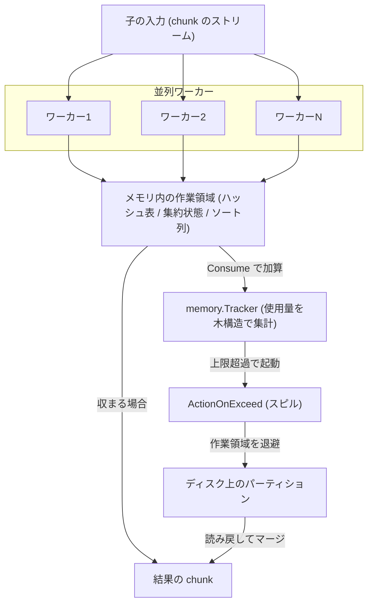

# 第14章 結合、集約、ソートの実行

> **本章で読むソース**
>
> - [`pkg/executor/join/hash_join_v2.go`](https://github.com/pingcap/tidb/blob/v8.5.6/pkg/executor/join/hash_join_v2.go)
> - [`pkg/executor/join/hash_join_base.go`](https://github.com/pingcap/tidb/blob/v8.5.6/pkg/executor/join/hash_join_base.go)
> - [`pkg/executor/aggregate/agg_hash_executor.go`](https://github.com/pingcap/tidb/blob/v8.5.6/pkg/executor/aggregate/agg_hash_executor.go)
> - [`pkg/executor/aggregate/agg_hash_partial_worker.go`](https://github.com/pingcap/tidb/blob/v8.5.6/pkg/executor/aggregate/agg_hash_partial_worker.go)
> - [`pkg/executor/aggregate/agg_hash_final_worker.go`](https://github.com/pingcap/tidb/blob/v8.5.6/pkg/executor/aggregate/agg_hash_final_worker.go)
> - [`pkg/executor/aggregate/agg_spill.go`](https://github.com/pingcap/tidb/blob/v8.5.6/pkg/executor/aggregate/agg_spill.go)
> - [`pkg/executor/sortexec/sort.go`](https://github.com/pingcap/tidb/blob/v8.5.6/pkg/executor/sortexec/sort.go)
> - [`pkg/executor/sortexec/sort_spill.go`](https://github.com/pingcap/tidb/blob/v8.5.6/pkg/executor/sortexec/sort_spill.go)
> - [`pkg/executor/sortexec/sort_partition.go`](https://github.com/pingcap/tidb/blob/v8.5.6/pkg/executor/sortexec/sort_partition.go)
> - [`pkg/util/memory/tracker.go`](https://github.com/pingcap/tidb/blob/v8.5.6/pkg/util/memory/tracker.go)
> - [`pkg/util/memory/action.go`](https://github.com/pingcap/tidb/blob/v8.5.6/pkg/util/memory/action.go)

## この章の狙い

第10章で見たとおり、TiDB はスキャンとフィルタ、そして集約の一部を TiKV のコプロセッサへ押し下げる。
押し下げられない処理、あるいは複数の TiKV ノードから戻った結果をまたいで成立する処理は、計算層が自分で実行する。
本章で読むのは、その計算層で動く代表的な3つの演算子、ハッシュ結合、ハッシュ集約、ソートである。

この3つには共通の性質がある。
いずれも**ブロッキング演算子**であり、入力をすべて、あるいはある単位で読み切るまで結果を1行も返せない。
ハッシュ結合はビルド側を読み切ってハッシュ表を作るまでプローブを始められない。
ハッシュ集約は同じグループの行が入力のどこに散らばっているか分からないため、集約状態を持ち続ける。
ソートは全行を見るまで先頭行を確定できない。
そのため、これらは入力を計算層のメモリに溜め込む。

メモリに溜め込む以上、入力が大きいとメモリを使い尽くす危険がある。
TiDB はこれを2つの機構で受け止める。
1つは複数ワーカーによる並列化で、CPU を使い切って実行時間を縮める。
もう1つはメモリトラッカーによる使用量の監視と、上限を超えたときのディスクへの**スピル**であり、これによって主記憶に載らない入力でもクエリを失敗させずに処理し切る。
本章はこの2つの機構を、3演算子の実装の中で読む。

3演算子に共通する処理の流れを図に示す。
ワーカーが入力をメモリ内の作業領域へ溜め込み、メモリトラッカーが上限超過を検知するとアクションが作業領域をディスクへ退避する、という構造である。



## 前提

第12章でベクトル化実行モデルと `chunk` を読んだ。
本章の演算子も入力と出力を `chunk` 単位で受け渡し、ワーカー間のデータ受け渡しもチャネルを流れる `chunk` で行う。

第13章で分散読み取りを読み、複数の TiKV から戻る結果が計算層で1つのストリームに合流することを見た。
本章の演算子は、その合流したストリームを子の入力として受け取る側にあたる。

第10章で2相集約を扱い、各 Region で部分集約した結果を計算層で最終集約する押し下げを見た。
本章のハッシュ集約も partial と final の2段で動くが、これは計算層の内部でワーカーを2種類に分ける並列化であり、押し下げの2相集約とは別の階層の話である。
両者の対応は集約の節で改めて述べる。

## ハッシュ結合：ビルドとプローブ

等値結合 `t1 JOIN t2 ON t1.a = t2.b` を素朴に二重ループで解くと、左右の行数の積に比例した時間がかかる。
ハッシュ結合は、片側（**ビルド側**）の行を結合キーでハッシュ表に格納し、もう片側（**プローブ側**）を1行ずつ流してハッシュ表を引くことで、これを入力行数の和に比例する時間へ落とす。
TiDB には実装が2世代あり、本章では既定の `hash_join_v2.go` を読む。

実行器の本体が `HashJoinV2Exec` である。

[`pkg/executor/join/hash_join_v2.go` L633-L653](https://github.com/pingcap/tidb/blob/v8.5.6/pkg/executor/join/hash_join_v2.go#L633-L653)

```go
type HashJoinV2Exec struct {
	exec.BaseExecutor
	*HashJoinCtxV2

	ProbeSideTupleFetcher *ProbeSideTupleFetcherV2
	ProbeWorkers          []*ProbeWorkerV2
	BuildWorkers          []*BuildWorkerV2

	workerWg util.WaitGroupWrapper
	waiterWg util.WaitGroupWrapper

	restoredBuildInDisk []*chunk.DataInDiskByChunks
	restoredProbeInDisk []*chunk.DataInDiskByChunks

	prepared  bool
	inRestore bool

	isMemoryClearedForTest bool

	FileNamePrefixForTest string
}
```

`BuildWorkers` と `ProbeWorkers` がスライスである点が要である。
ビルドもプローブも単一のスレッドではなく、複数のワーカーで並列に進む。
ワーカー数は埋め込んだ文脈構造体 `hashJoinCtxBase` の `Concurrency` が持つ。

[`pkg/executor/join/hash_join_base.go` L48-L63](https://github.com/pingcap/tidb/blob/v8.5.6/pkg/executor/join/hash_join_base.go#L48-L63)

```go
type hashJoinCtxBase struct {
	SessCtx        sessionctx.Context
	ChunkAllocPool chunk.Allocator
	// Concurrency is the number of partition, build and join workers.
	Concurrency  uint
	joinResultCh chan *hashjoinWorkerResult
	// closeCh add a lock for closing executor.
	closeCh       chan struct{}
	finished      atomic.Bool
	IsNullEQ      []bool
	buildFinished chan error
	JoinType      logicalop.JoinType
	IsNullAware   bool
	memTracker    *memory.Tracker // track memory usage.
	diskTracker   *disk.Tracker   // track disk usage.
}
```

コメントが明記するとおり、`Concurrency` は**パーティション数**でもあり、ビルドワーカー数でもあり、結合ワーカー数でもある。
`memTracker` と `diskTracker` をこの文脈構造体が持つことにも注目したい。
ハッシュ表が消費するメモリはここで追跡され、後述のスピルの判断材料になる。

### パーティション分割による並列ビルド

複数のワーカーで1つのハッシュ表を並行して更新すると、ロック競合が起きる。
v2 はこれを避けるため、ハッシュ表をハッシュ値で**パーティション**に分割する。
パーティション数は並列度から決まり、ワーカー数とパーティション数の格子としてビルド用の行テーブルを確保する。

[`pkg/executor/join/hash_join_v2.go` L329-L347](https://github.com/pingcap/tidb/blob/v8.5.6/pkg/executor/join/hash_join_v2.go#L329-L347)

```go
// SetupPartitionInfo set up partitionNumber and partitionMaskOffset based on concurrency
func (hCtx *HashJoinCtxV2) SetupPartitionInfo() {
	hCtx.partitionNumber = genHashJoinPartitionNumber(hCtx.Concurrency)
	hCtx.partitionMaskOffset = getPartitionMaskOffset(hCtx.partitionNumber)
}

// initHashTableContext create hashTableContext for current HashJoinCtxV2
func (hCtx *HashJoinCtxV2) initHashTableContext() {
	hCtx.hashTableContext = &hashTableContext{}
	hCtx.hashTableContext.rowTables = make([][]*rowTable, hCtx.Concurrency)
	for index := range hCtx.hashTableContext.rowTables {
		hCtx.hashTableContext.rowTables[index] = make([]*rowTable, hCtx.partitionNumber)
	}
	hCtx.hashTableContext.hashTable = &hashTableV2{
		tables:          make([]*subTable, hCtx.partitionNumber),
		partitionNumber: uint64(hCtx.partitionNumber),
	}
	hCtx.hashTableContext.memoryTracker = memory.NewTracker(memory.LabelForHashTableInHashJoinV2, -1)
}
```

`rowTables` は `[Concurrency][partitionNumber]` の2次元スライスである。
各ワーカーがビルド側の `chunk` を読みながら、行の結合キーのハッシュ値の上位ビットでパーティションを決め、自分の行を `rowTables[ワーカー][パーティション]` に振り分ける。
この段階ではワーカーは自分専用の行テーブルにしか書き込まないため、ワーカー間でロックを取り合う必要がない。

全ワーカーが振り分けを終えると、同じパーティション番号の行テーブルを集めて1つのサブテーブル（`subTable`）へ統合し、そこからハッシュ表を構築する。
この構築もパーティション単位の仕事に分かれているため、再び並列に走らせられる。

[`pkg/executor/join/hash_join_v2.go` L1433-L1453](https://github.com/pingcap/tidb/blob/v8.5.6/pkg/executor/join/hash_join_v2.go#L1433-L1453)

```go
func (e *HashJoinV2Exec) buildHashTable(buildTaskCh chan *buildTask, wg *sync.WaitGroup, errCh chan error, doneCh chan struct{}) {
	for i := uint(0); i < e.Concurrency; i++ {
		wg.Add(1)
		workID := i
		e.workerWg.RunWithRecover(
			func() {
				err := e.BuildWorkers[workID].buildHashTable(buildTaskCh)
				if err != nil {
					errCh <- err
					doneCh <- struct{}{}
				}
			},
			func(r any) {
				if r != nil {
					errCh <- util.GetRecoverError(r)
					doneCh <- struct{}{}
				}
				wg.Done()
			},
		)
	}
```

`buildTaskCh` にパーティション単位の構築タスクが流れ、`Concurrency` 個のワーカーがそこから取り出して並行に処理する。
パーティションが分かれているので、別々のワーカーが別々のサブテーブルを同時に作っても衝突しない。

### プローブの並列化

ビルドが終わると、プローブ側も同じ並列度で流す。

[`pkg/executor/join/hash_join_v2.go` L821-L841](https://github.com/pingcap/tidb/blob/v8.5.6/pkg/executor/join/hash_join_v2.go#L821-L841)

```go
func (e *HashJoinV2Exec) startProbeJoinWorkers(ctx context.Context) {
	if e.inRestore {
		// Wait for the restore build
		err := <-e.buildFinished
		if err != nil {
			return
		}
	}

	for i := uint(0); i < e.Concurrency; i++ {
		workerID := i
		e.workerWg.RunWithRecover(func() {
			defer trace.StartRegion(ctx, "HashJoinWorker").End()
			if e.inRestore {
				e.ProbeWorkers[workerID].restoreAndProbe(e.restoredProbeInDisk[workerID])
			} else {
				e.ProbeWorkers[workerID].runJoinWorker()
			}
		}, e.ProbeWorkers[workerID].handleProbeWorkerPanic)
	}
}
```

各プローブワーカーは `runJoinWorker` でプローブ側の `chunk` を受け取り、行ごとに結合キーのハッシュ値からパーティションを特定し、そのパーティションのサブテーブルだけを引いて一致行を探す。
ハッシュ表が読み取り専用になった後のプローブは、各ワーカーが独立に進められる。

`inRestore` の分岐に現れる `restoreAndProbe` と `restoredProbeInDisk` は、メモリ超過でディスクへ退避した入力を読み戻して再処理する経路である。
ハッシュ結合のスピルは、ビルド側のハッシュ表が大きすぎるときに一部のパーティションをディスクへ書き出し、対応するプローブ側の行も同じパーティションへ退避してから、後で組ごとに読み戻す。
パーティションがすでに分かれているため、スピルの単位も自然にパーティションになる。
スピルの起点となるメモリ監視そのものは、3演算子で共通の機構なので後の節でまとめて読む。

## ハッシュ集約：partial と final の2段

`SELECT a, count(*) FROM t GROUP BY a` のような集約は、同じグループキーを持つ行の集約状態を1つにまとめる。
入力のどこに同じキーの行が現れるか分からないので、集約状態をハッシュ表（グループキーから集約状態への対応表）に持ち、行を読むたびに該当するグループの状態を更新する。
TiDB のハッシュ集約は、これを2種類のワーカーに分けて並列化する。

実行器の本体が `HashAggExec` である。

[`pkg/executor/aggregate/agg_hash_executor.go` L93-L112](https://github.com/pingcap/tidb/blob/v8.5.6/pkg/executor/aggregate/agg_hash_executor.go#L93-L112)

```go
type HashAggExec struct {
	exec.BaseExecutor

	Sc               *stmtctx.StatementContext
	PartialAggFuncs  []aggfuncs.AggFunc
	FinalAggFuncs    []aggfuncs.AggFunc
	partialResultMap aggfuncs.AggPartialResultMapper
	groupSet         set.StringSetWithMemoryUsage
	groupKeys        []string
	cursor4GroupKey  int
	GroupByItems     []expression.Expression
	groupKeyBuffer   [][]byte

	finishCh         chan struct{}
	finalOutputCh    chan *AfFinalResult
	partialOutputChs []chan aggfuncs.AggPartialResultMapper
	inputCh          chan *HashAggInput
	partialInputChs  []chan *chunk.Chunk
	partialWorkers   []HashAggPartialWorker
	finalWorkers     []HashAggFinalWorker
```

集約関数が `PartialAggFuncs` と `FinalAggFuncs` の2組に分かれている点に、2段構成が表れている。
`partialWorkers` が前段、`finalWorkers` が後段のワーカー群である。

前段の partial ワーカーは、入力 `chunk` を分担して読み、自分が読んだ範囲だけで部分的な集約状態を作る。
たとえば `count` なら、自分が見た行のグループごとの件数を数える。
後段の final ワーカーは、全 partial ワーカーが出した部分集約状態を、グループキーごとに1つへ統合し、最終的な集約結果を出す。
`count` の部分件数どうしを足し合わせるのがこれにあたる。

この分担は第10章で見た押し下げの2相集約と形が同じである。
第10章では前段が TiKV の各 Region、後段が計算層という分担だった。
本章の partial と final は、どちらも計算層の内部にあるワーカーである。
コプロセッサ押し下げが効いているクエリでは、TiKV からすでに部分集約された結果が戻り、計算層の partial ワーカーはそれをさらに部分集約し、final ワーカーが束ねる、という入れ子の関係になる。

### 部分集約結果のシャッフル

2段を正しくつなぐには、同じグループキーの部分集約状態が、必ず同じ final ワーカーに集まらなければならない。
そうでなければ、あるグループの集約が複数の final ワーカーに分かれて二重に出力されてしまう。
そこで partial ワーカーは、グループキーのハッシュ値で行き先の final ワーカーを決め、final ワーカーごとに部分集約状態を仕分ける。

partial ワーカーの構造体に、この仕分けの仕組みが現れている。

[`pkg/executor/aggregate/agg_hash_partial_worker.go` L35-L54](https://github.com/pingcap/tidb/blob/v8.5.6/pkg/executor/aggregate/agg_hash_partial_worker.go#L35-L54)

```go
type HashAggPartialWorker struct {
	baseHashAggWorker
	idForTest int
	ctx       sessionctx.Context

	inputCh        chan *chunk.Chunk
	outputChs      []chan aggfuncs.AggPartialResultMapper
	globalOutputCh chan *AfFinalResult

	// Partial worker transmit the HashAggInput by this channel,
	// so that the data fetcher could get the partial worker's HashAggInput
	giveBackCh chan<- *HashAggInput

	partialResultsBuffer  [][]aggfuncs.PartialResult
	partialResultNumInRow int

	// Length of this map is equal to the number of final workers
	// All data in one AggPartialResultMapper are specifically sent to a target final worker.
	// e.g. all data in partialResultsMap[3] should be sent to final worker 3.
	partialResultsMap    []aggfuncs.AggPartialResultMapper
```

`partialResultsMap` はスライスであり、添字が行き先の final ワーカー番号である。
コメントが述べるとおり、`partialResultsMap[3]` の中身はすべて final ワーカー3へ送られる。
各 partial ワーカーは、自分が読んだ行を集約しながら、グループキーのハッシュ値で `partialResultsMap` のどの要素に入れるかを決めていく。

入力を読み切ると、partial ワーカーは仕分け済みの部分集約状態を、対応する出力チャネルへ流す。

[`pkg/executor/aggregate/agg_hash_partial_worker.go` L287-L291](https://github.com/pingcap/tidb/blob/v8.5.6/pkg/executor/aggregate/agg_hash_partial_worker.go#L287-L291)

```go
func (w *HashAggPartialWorker) shuffleIntermData(finalConcurrency int) {
	for i := range finalConcurrency {
		w.outputChs[i] <- w.partialResultsMap[i]
	}
}
```

`outputChs[i]` は final ワーカー `i` の入力チャネルである。
この**シャッフル**によって、同じグループキーの部分集約状態が必ず同じ final ワーカーへ届く。

後段の final ワーカーは、自分宛のチャネルから部分集約状態を受け取り、グループキーごとに統合していく。

[`pkg/executor/aggregate/agg_hash_final_worker.go` L106-L119](https://github.com/pingcap/tidb/blob/v8.5.6/pkg/executor/aggregate/agg_hash_final_worker.go#L106-L119)

```go
func (w *HashAggFinalWorker) consumeIntermData(sctx sessionctx.Context) error {
	for {
		input, ok := w.getPartialInput()
		if !ok {
			return nil
		}

		failpoint.Inject("ConsumeRandomPanic", nil)

		if err := w.mergeInputIntoResultMap(sctx, input); err != nil {
			return err
		}
	}
}
```

`getPartialInput` で部分集約状態を1つ取り出し、`mergeInputIntoResultMap` で自分のグループごとの結果表へ統合する。
全 partial ワーカーがチャネルを閉じるまでこれを繰り返し、その後に最終結果を出力する。

両段のワーカーは、実行の準備段階でまとめて goroutine として起動される。

[`pkg/executor/aggregate/agg_hash_executor.go` L597-L616](https://github.com/pingcap/tidb/blob/v8.5.6/pkg/executor/aggregate/agg_hash_executor.go#L597-L616)

```go
	partialWorkerWaitGroup := &sync.WaitGroup{}
	partialWorkerWaitGroup.Add(len(e.partialWorkers))
	partialStart := time.Now()
	for i := range e.partialWorkers {
		go e.partialWorkers[i].run(e.Ctx(), partialWorkerWaitGroup, len(e.finalWorkers))
	}

	go func() {
		e.waitPartialWorkerAndCloseOutputChs(partialWorkerWaitGroup)
		if partialWallTimePtr != nil {
			atomic.AddInt64(partialWallTimePtr, int64(time.Since(partialStart)))
		}
	}()

	finalWorkerWaitGroup := &sync.WaitGroup{}
	finalWorkerWaitGroup.Add(len(e.finalWorkers))
	finalStart := time.Now()
	for i := range e.finalWorkers {
		go e.finalWorkers[i].run(e.Ctx(), finalWorkerWaitGroup, partialWorkerWaitGroup)
	}
```

partial ワーカーと final ワーカーがそれぞれ並列に走り、両者をチャネルがつなぐ。
partial 群が全員終わると `waitPartialWorkerAndCloseOutputChs` が出力チャネルを閉じ、それを合図に final 群が結果出力へ移る。

## ソート：メモリ内ソートと外部ソート

`ORDER BY` は全行を見るまで先頭を確定できない、典型的なブロッキング演算子である。
ソート実行器 `SortExec` は、入力をメモリに溜めて並べ替え、メモリに収まらない分はディスクへ退避して外部ソートに切り替える。

[`pkg/executor/sortexec/sort.go` L43-L100](https://github.com/pingcap/tidb/blob/v8.5.6/pkg/executor/sortexec/sort.go#L43-L100)

```go
type SortExec struct {
	exec.BaseExecutor

	ByItems    []*plannerutil.ByItems
	fetched    *atomic.Bool
	ExecSchema *expression.Schema

	// keyColumns is the column index of the by items.
	keyColumns []int
	// keyCmpFuncs is used to compare each ByItem.
	keyCmpFuncs []chunk.CompareFunc

	curPartition *sortPartition

	// We can't spill if size of data is lower than the limit
	spillLimit int64

	memTracker  *memory.Tracker
	diskTracker *disk.Tracker

	// TODO delete this variable in the future and remove the unparallel sort
	IsUnparallel bool

	finishCh chan struct{}

	// multiWayMerge uses multi-way merge for spill disk.
	// The multi-way merge algorithm can refer to https://en.wikipedia.org/wiki/K-way_merge_algorithm
	multiWayMerge *multiWayMerger

	FileNamePrefixForTest string

	Unparallel struct {
		Idx int

		// sortPartitions is the chunks to store row values for partitions. Every partition is a sorted list.
		sortPartitions []*sortPartition

		spillAction *sortPartitionSpillDiskAction
	}

	Parallel struct {
		chunkChannel chan *chunkWithMemoryUsage
		// It's useful when spill is triggered and the fetcher could know when workers finish their works.
		fetcherAndWorkerSyncer *sync.WaitGroup
		workers                []*parallelSortWorker

		// Each worker will put their results into the given iter
		sortedRowsIters []*chunk.Iterator4Slice
		merger          *multiWayMerger

		resultChannel chan rowWithError

		spillHelper *parallelSortSpillHelper
		spillAction *parallelSortSpillAction
	}

	enableTmpStorageOnOOM bool
}
```

`SortExec` は `Unparallel` と `Parallel` の2つの実行経路を1つの構造体に同居させている。
どちらの経路でも `memTracker` と `diskTracker` で使用量を追い、超過時には `spillAction` でディスクへ退避する。
`multiWayMerge` がコメントに記すとおり、退避した複数のソート済み列をマージする**多方向マージ**の主体である。
`spillLimit` のコメントが述べるとおり、入力が小さいうちはスピルしない。

ソートの中核は、ソート済みの列をいくつディスクに持っているかで出力方法を切り替える点にある。

[`pkg/executor/sortexec/sort.go` L305-L321](https://github.com/pingcap/tidb/blob/v8.5.6/pkg/executor/sortexec/sort.go#L305-L321)

```go
func (e *SortExec) appendResultToChunkInUnparallelMode(req *chunk.Chunk) error {
	sortPartitionListLen := len(e.Unparallel.sortPartitions)
	if sortPartitionListLen == 0 {
		return nil
	}

	if sortPartitionListLen == 1 {
		if err := e.onePartitionSorting(req); err != nil {
			return err
		}
	} else {
		if err := e.externalSorting(req); err != nil {
			return err
		}
	}
	return nil
}
```

スピルが一度も起きなければ、ソート済みのパーティションは1つだけで、それをそのまま出力する（`onePartitionSorting`）。
途中でスピルが起きると、ディスク上にソート済みのパーティションが複数残る。
このとき `externalSorting` が、複数のソート済み列を `multiWayMerge` で1本のソート済みストリームへマージする。
各パーティションは内部でソート済みなので、各列の先頭を比べて最小を取り出す多方向マージだけで全体の順序が復元できる。
これが**外部ソート**である。

### スピル時のディスク書き出し

メモリ超過が検知されると、そのときメモリにあるパーティションをソートしてからディスクへ書き出す。
書き出しの本体が `spillToDiskImpl` で、行を一時 `chunk` にまとめて順にディスクへ追記する。

[`pkg/executor/sortexec/sort_partition.go` L179-L205](https://github.com/pingcap/tidb/blob/v8.5.6/pkg/executor/sortexec/sort_partition.go#L179-L205)

```go
	for row := s.sliceIter.Next(); !row.IsEmpty(); row = s.sliceIter.Next() {
		tmpChk.AppendRow(row)
		if tmpChk.IsFull() {
			err := s.inDisk.Add(tmpChk)
			if err != nil {
				return err
			}
			tmpChk.Reset()
			s.getMemTracker().HandleKillSignal()
		}
	}

	// Spill the remaining data in tmpChk.
	// Do not spill when tmpChk is empty as `Add` function requires a non-empty chunk
	if tmpChk.NumRows() > 0 {
		err := s.inDisk.Add(tmpChk)
		if err != nil {
			return err
		}
	}

	// Release memory as all data have been spilled to disk
	s.savedRows = nil
	s.sliceIter = nil
	s.getMemTracker().ReplaceBytesUsed(0)
	return nil
}
```

書き出し中も `HandleKillSignal` で kill 要求を確認し、長いスピルの途中でもクエリを中断できるようにしている。
全行を書き出した後、最後に `ReplaceBytesUsed(0)` でこのパーティションのメモリ使用量を0に戻す。
ディスクへ移したデータの分だけ、計算層のメモリが即座に解放される。
これによって、後続の入力を受け入れる余地ができ、入力が主記憶を超えても処理を続けられる。

## 共通機構：メモリトラッカーとスピルの起動

ここまで3演算子それぞれにメモリ超過時のスピルが現れた。
その起点となる監視は、3演算子が共有する `memory.Tracker` が担う。

[`pkg/util/memory/tracker.go` L77-L105](https://github.com/pingcap/tidb/blob/v8.5.6/pkg/util/memory/tracker.go#L77-L105)

```go
type Tracker struct {
	bytesLimit           atomic.Pointer[bytesLimits]
	actionMuForHardLimit actionMu
	actionMuForSoftLimit actionMu
	Killer               *sqlkiller.SQLKiller
	mu                   struct {
		// The children memory trackers. If the Tracker is the Global Tracker, like executor.GlobalDiskUsageTracker,
		// we wouldn't maintain its children in order to avoiding mutex contention.
		children map[int][]*Tracker
		sync.Mutex
	}
	parMu struct {
		parent *Tracker // The parent memory tracker.
		sync.Mutex
	}
	label int // Label of this "Tracker".
	// following fields are used with atomic operations, so make them 64-byte aligned.
	bytesConsumed       int64             // Consumed bytes.
	bytesReleased       int64             // Released bytes.
	maxConsumed         atomicutil.Int64  // max number of bytes consumed during execution.
	SessionID           atomicutil.Uint64 // SessionID indicates the sessionID the tracker is bound.
	IsRootTrackerOfSess bool              // IsRootTrackerOfSess indicates whether this tracker is bound for session
	isGlobal            bool              // isGlobal indicates whether this tracker is global tracker
}

type actionMu struct {
	actionOnExceed ActionOnExceed
	sync.Mutex
}
```

トラッカーは木構造を成す。
`parMu.parent` で親をたどれ、`children` で子を持つ。
演算子のメモリトラッカーは、セッションのトラッカー、さらにサーバ全体のトラッカーへとつながり、使用量は親へ伝播する。
`actionMuForHardLimit` が、上限超過時に実行する**アクション**を持つ。

使用量を加算する入口が `Consume` である。

[`pkg/util/memory/tracker.go` L446-L487](https://github.com/pingcap/tidb/blob/v8.5.6/pkg/util/memory/tracker.go#L446-L487)

```go
func (t *Tracker) Consume(bs int64) {
	if bs == 0 {
		return
	}
	var rootExceed, rootExceedForSoftLimit, sessionRootTracker *Tracker
	for tracker := t; tracker != nil; tracker = tracker.getParent() {
		if tracker.IsRootTrackerOfSess {
			sessionRootTracker = tracker
		}
		bytesConsumed := atomic.AddInt64(&tracker.bytesConsumed, bs)
		bytesReleased := atomic.LoadInt64(&tracker.bytesReleased)
		limits := tracker.bytesLimit.Load()
		if bytesConsumed+bytesReleased >= limits.bytesHardLimit && limits.bytesHardLimit > 0 {
			rootExceed = tracker
		}
		if bytesConsumed+bytesReleased >= limits.bytesSoftLimit && limits.bytesSoftLimit > 0 {
			rootExceedForSoftLimit = tracker
// ... (中略) ...
	tryAction := func(mu *actionMu, tracker *Tracker) {
		mu.Lock()
		defer mu.Unlock()
		for mu.actionOnExceed != nil && mu.actionOnExceed.IsFinished() {
			mu.actionOnExceed = mu.actionOnExceed.GetFallback()
		}
		if mu.actionOnExceed != nil {
			mu.actionOnExceed.Action(tracker)
		}
	}
```

`Consume` は、自分から親へとトラッカーをたどりながら各段の `bytesConsumed` に加算する。
途中で上限 `bytesHardLimit` を超えたトラッカーがあれば、それを `rootExceed` として覚えておく。
ループの後、`rootExceed` が見つかっていれば `tryAction` を呼ぶ。

[`pkg/util/memory/tracker.go` L511-L518](https://github.com/pingcap/tidb/blob/v8.5.6/pkg/util/memory/tracker.go#L511-L518)

```go
	if bs > 0 && rootExceed != nil {
		tryAction(&rootExceed.actionMuForHardLimit, rootExceed)
	}

	if bs > 0 && rootExceedForSoftLimit != nil {
		tryAction(&rootExceedForSoftLimit.actionMuForSoftLimit, rootExceedForSoftLimit)
	}
}
```

`tryAction` は、そのトラッカーに登録されたアクションの `Action` を呼ぶ。
このアクションが演算子ごとのスピル処理であり、メモリの会計とディスクへの退避がここで結びつく。
アクションが満たすべき型が `ActionOnExceed` である。

[`pkg/util/memory/action.go` L30-L45](https://github.com/pingcap/tidb/blob/v8.5.6/pkg/util/memory/action.go#L30-L45)

```go
type ActionOnExceed interface {
	// Action will be called when memory usage exceeds memory quota by the
	// corresponding Tracker.
	Action(t *Tracker)
	// SetFallback sets a fallback action which will be triggered if itself has
	// already been triggered.
	SetFallback(a ActionOnExceed)
	// GetFallback get the fallback action of the Action.
	GetFallback() ActionOnExceed
	// GetPriority get the priority of the Action.
	GetPriority() int64
	// SetFinished sets the finished state of the Action.
	SetFinished()
	// IsFinished returns the finished state of the Action.
	IsFinished() bool
}
```

`SetFallback` と `GetFallback` でアクションを連鎖させられる。
ソートのように退避できる演算子は、まずスピルのアクションを登録し、それでも収まらない最後の砦としてクエリを中断するアクションをフォールバックに置く。
スピルできる間はディスクへ逃がし、本当に手詰まりになったときだけクエリを諦める、という段階的な対処になる。

ハッシュ集約のスピルアクションを見ると、この型を満たしながら集約特有の処理をしているのが分かる。

[`pkg/executor/aggregate/agg_spill.go` L364-L377](https://github.com/pingcap/tidb/blob/v8.5.6/pkg/executor/aggregate/agg_spill.go#L364-L377)

```go
// Action set HashAggExec spill mode.
func (p *ParallelAggSpillDiskAction) Action(t *memory.Tracker) {
	if p.actionImpl(t) {
		return
	}

	p.TriggerFallBackAction(t)
}

// Return true if we successfully set flag
func (p *ParallelAggSpillDiskAction) actionImpl(t *memory.Tracker) bool {
	p.spillHelper.waitForTheEndOfSpill()
	return p.spillHelper.setNeedSpill(p.e.memTracker, t)
}
```

`Action` はまずスピルフラグの設定を試み、成功すれば戻る。
設定できなければ `TriggerFallBackAction` でフォールバックへ進む。
ソートの `sortPartitionSpillDiskAction.Action` も同じ形で、スピルを起動し、必要ならフォールバックに譲る。
3演算子のスピルが、いずれもこの `Consume` からアクションへの同じ経路で起動されている。

### この機構が解くこと

並列化とスピルは、別々の問題を別々の手段で解いている。

並列化が解くのは時間の問題である。
ビルドとプローブ、partial と final を複数ワーカーへ分けることで、CPU を使い切り、入力に比例して延びる処理時間を並列度の分だけ縮める。
ハッシュ結合がパーティションでワーカー間の競合を消し、ハッシュ集約がグループキーのハッシュでシャッフルしてワーカー間の重複を消すのは、いずれも並列化を正しく成り立たせるための仕掛けである。

スピルが解くのはメモリの問題である。
ブロッキング演算子は入力を溜め込むため、入力が大きいとメモリ上限に達する。
このとき素朴な実装ならクエリを失敗させるしかない。
メモリトラッカーが超過を検知し、登録されたアクションが溜め込んだデータをディスクへ退避することで、主記憶に載らない大きさの入力でもクエリを完走させられる。

## まとめ

本章では、計算層で動くブロッキング演算子であるハッシュ結合、ハッシュ集約、ソートの実行を読んだ。
ハッシュ結合 v2 はハッシュ表をパーティションに分け、ワーカーごとに専用の行テーブルへ書き込むことでロック競合なしに並列ビルドし、プローブも同じ並列度で流す。
ハッシュ集約は partial と final の2段にワーカーを分け、グループキーのハッシュで部分集約状態をシャッフルして同じグループを同じ final ワーカーに集める。
ソートはメモリ内で並べ替え、超過分はソート済みのままディスクへ退避し、外部ソートの多方向マージで順序を復元する。
3演算子のスピルは、共通の `memory.Tracker` が使用量を木構造で集計し、上限超過時に登録された `ActionOnExceed` を起動するという1つの経路で動く。
並列化が実行時間を縮め、スピルが大入力での失敗を防ぐ、という2つの機構が、これらの演算子を支えている。

## 関連する章

- [第10章 コプロセッサ押し下げ](../part02-optimizer/10-coprocessor-pushdown.md)：本章の partial と final の2段集約に対応する、TiKV と計算層にまたがる2相集約を扱う。
- [第12章 ベクトル化実行モデル](12-vectorized-execution.md)：本章の演算子が入出力に使う `chunk` とベクトル化実行を扱う。
- [第13章 分散読み取りと結果の合流](13-distributed-read.md)：本章の演算子が子の入力として受け取る、複数 TiKV からの結果の合流を扱う。
