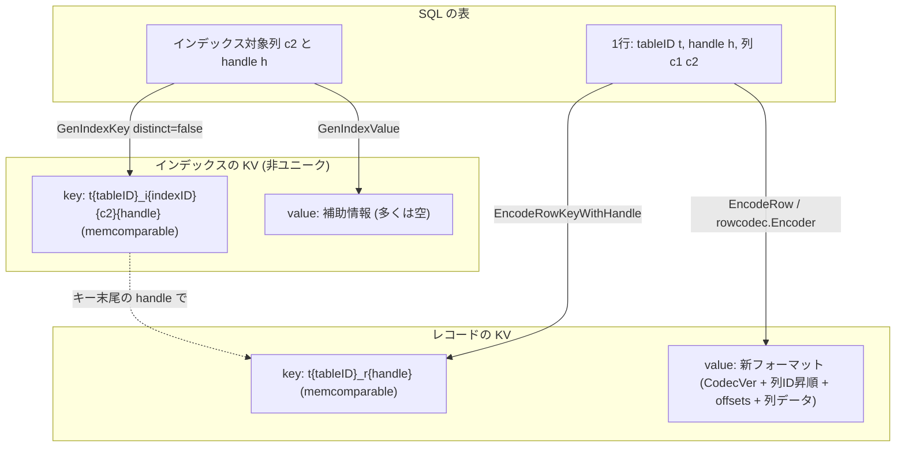

# 第15章 行とインデックスの KV エンコード

> **本章で読むソース**
>
> - [`pkg/tablecodec/tablecodec.go`](https://github.com/pingcap/tidb/blob/v8.5.6/pkg/tablecodec/tablecodec.go)
> - [`pkg/util/codec/codec.go`](https://github.com/pingcap/tidb/blob/v8.5.6/pkg/util/codec/codec.go)
> - [`pkg/util/codec/number.go`](https://github.com/pingcap/tidb/blob/v8.5.6/pkg/util/codec/number.go)
> - [`pkg/util/rowcodec/encoder.go`](https://github.com/pingcap/tidb/blob/v8.5.6/pkg/util/rowcodec/encoder.go)
> - [`pkg/util/rowcodec/row.go`](https://github.com/pingcap/tidb/blob/v8.5.6/pkg/util/rowcodec/row.go)
> - [`pkg/util/rowcodec/common.go`](https://github.com/pingcap/tidb/blob/v8.5.6/pkg/util/rowcodec/common.go)

## この章の狙い

TiDB はリレーショナルな表をユーザーに見せるが、その下で実際にデータを保持するのは TiKV の順序付き KV ストアである。
1行のレコードも、1本のインデックスのエントリも、最終的には1組の `(key, value)` に写されてから TiKV へ書かれる。
本章では、表の `(tableID, handle, columns)` がどのバイト列に符号化され、インデックスがどの別の KV に写るかを読む。

写し方の中心にあるのは、キーを**メモリ比較可能**（**memcomparable**）に符号化するという設計である。
memcomparable とは、符号化後のバイト列を辞書順（`bytes.Compare`）で比べた結果が、元の値の大小と一致するように符号化することを指す。
これにより、KV のバイト順がそのまま行とインデックスの順序になり、SQL の範囲スキャンが KV の範囲スキャンへ素直に落ちる。
本章はこの符号化の規則と、それが範囲スキャンを成立させる仕組みを範囲とする。

## 前提

第6章で、TiDB が行を表現する型システムと、列の値を表す `types.Datum` を扱った。
本章の符号化はすべて `Datum` の並びを入力に取る。
符号化されたキーと値が TiKV へどう渡るか、スナップショットからどう読み戻されるかは第16章で扱う。
本章はあくまで「SQL の表」と「順序付き KV」のあいだの写像そのものに集中する。

なお TiDB が扱うキーには、テーブルとインデックスのプレフィックスのほかにメタデータ用の `m` プレフィックスもあるが、本章はレコードとインデックスの2系統に絞る。

## キーのプレフィックスとハンドル

レコードキーとインデックスキーは、いずれも `t` で始まる共通の骨格を持つ。
プレフィックスの定数は次のように定義されている。

[`pkg/tablecodec/tablecodec.go` L49-L54](https://github.com/pingcap/tidb/blob/v8.5.6/pkg/tablecodec/tablecodec.go#L49-L54)

```go
var (
	tablePrefix     = []byte{'t'}
	recordPrefixSep = []byte("_r")
	indexPrefixSep  = []byte("_i")
	metaPrefix      = []byte{'m'}
)
```

レコードキーは `t{tableID}_r{handle}`、インデックスキーは `t{tableID}_i{indexID}{indexedValues}` という形を取る。
ここで**ハンドル**（**handle**）とは、表の中で1行を一意に指す識別子であり、主キーがクラスタ化インデックスならその主キー値、そうでなければ TiDB が割り当てる内部行 ID（`_tidb_rowid`）が入る。

プレフィックスを組み立てる関数は `appendTableRecordPrefix` である。

[`pkg/tablecodec/tablecodec.go` L1121-L1126](https://github.com/pingcap/tidb/blob/v8.5.6/pkg/tablecodec/tablecodec.go#L1121-L1126)

```go
func appendTableRecordPrefix(buf []byte, tableID int64) []byte {
	buf = append(buf, tablePrefix...)
	buf = codec.EncodeInt(buf, tableID)
	buf = append(buf, recordPrefixSep...)
	return buf
}
```

`tableID` は素のリトルエンディアンではなく `codec.EncodeInt` で符号化される。
この点が後述の memcomparable 設計の入口であり、`t` の直後に来る8バイトが `tableID` の大小をそのまま辞書順で表すようになっている。

## レコードキー：`EncodeRowKey`

レコードキーは、上のプレフィックスに符号化済みのハンドルを連結するだけで完成する。

[`pkg/tablecodec/tablecodec.go` L105-L116](https://github.com/pingcap/tidb/blob/v8.5.6/pkg/tablecodec/tablecodec.go#L105-L116)

```go
// EncodeRowKey encodes the table id and record handle into a kv.Key
func EncodeRowKey(tableID int64, encodedHandle []byte) kv.Key {
	buf := make([]byte, 0, prefixLen+len(encodedHandle))
	buf = appendTableRecordPrefix(buf, tableID)
	buf = append(buf, encodedHandle...)
	return buf
}

// EncodeRowKeyWithHandle encodes the table id, row handle into a kv.Key
func EncodeRowKeyWithHandle(tableID int64, handle kv.Handle) kv.Key {
	return EncodeRowKey(tableID, handle.Encoded())
}
```

`EncodeRowKey` はハンドルをすでに符号化済みのバイト列として受け取り、`EncodeRowKeyWithHandle` は `kv.Handle` から `Encoded()` を呼んで符号化する。
整数ハンドルなら `Encoded()` は8バイトの memcomparable な整数であり、複合主キー（共通ハンドル）なら主キー列を順に memcomparable 符号化したバイト列になる。

逆向きの `DecodeRowKey` は、キーの長さでハンドルの種類を見分ける。

[`pkg/tablecodec/tablecodec.go` L329-L339](https://github.com/pingcap/tidb/blob/v8.5.6/pkg/tablecodec/tablecodec.go#L329-L339)

```go
// DecodeRowKey decodes the key and gets the handle.
func DecodeRowKey(key kv.Key) (kv.Handle, error) {
	if len(key) < RecordRowKeyLen || !hasTablePrefix(key) || !hasRecordPrefixSep(key[prefixLen-2:]) {
		return kv.IntHandle(0), errInvalidKey.GenWithStack("invalid key - %q", key)
	}
	if len(key) == RecordRowKeyLen {
		u := binary.BigEndian.Uint64(key[prefixLen:])
		return kv.IntHandle(codec.DecodeCmpUintToInt(u)), nil
	}
	return kv.NewCommonHandle(key[prefixLen:])
}
```

キーがちょうど `RecordRowKeyLen`（プレフィックス＋8バイト）なら整数ハンドルとして復号し、それより長ければ共通ハンドルとして残りのバイト列を渡す。
整数ハンドルの復号で `binary.BigEndian.Uint64` のあとに `codec.DecodeCmpUintToInt` を通している点が、符号化が単なるビッグエンディアンではないことを示している。

## レコード値：新しい行フォーマット

レコードキーが1行を指し、その値に列の中身がまとまって入る。
列の値の符号化は `EncodeRow` が入口で、エンコーダが有効なら新しい行フォーマットへ、そうでなければ旧フォーマットへ分岐する。

[`pkg/tablecodec/tablecodec.go` L361-L370](https://github.com/pingcap/tidb/blob/v8.5.6/pkg/tablecodec/tablecodec.go#L361-L370)

```go
func EncodeRow(loc *time.Location, row []types.Datum, colIDs []int64, valBuf []byte, values []types.Datum, checksum rowcodec.Checksum, e *rowcodec.Encoder) ([]byte, error) {
	if len(row) != len(colIDs) {
		return nil, errors.Errorf("EncodeRow error: data and columnID count not match %d vs %d", len(row), len(colIDs))
	}
	if e.Enable {
		valBuf = valBuf[:0]
		return e.Encode(loc, colIDs, row, checksum, valBuf)
	}
	return EncodeOldRow(loc, row, colIDs, valBuf, values)
}
```

新しい行フォーマットの符号化本体は `rowcodec.Encoder.Encode` にある。

[`pkg/util/rowcodec/encoder.go` L46-L58](https://github.com/pingcap/tidb/blob/v8.5.6/pkg/util/rowcodec/encoder.go#L46-L58)

```go
func (encoder *Encoder) Encode(loc *time.Location, colIDs []int64, values []types.Datum, checksum Checksum, buf []byte) ([]byte, error) {
	encoder.reset()
	encoder.appendColVals(colIDs, values)
	numCols, notNullIdx := encoder.reformatCols()
	err := encoder.encodeRowCols(loc, numCols, notNullIdx)
	if err != nil {
		return nil, err
	}
	if checksum == nil {
		checksum = NoChecksum{}
	}
	return checksum.encode(encoder, buf)
}
```

`appendColVals` で列 ID と値を取り込み、`reformatCols` で列を非 NULL と NULL に分けて列 ID 昇順に並べ替え、`encodeRowCols` で非 NULL 列の値を順に符号化する。
並べ替えで列 ID を昇順にそろえるのは、読み出し時に列 ID で二分探索できるようにするためである。

並べ替えと符号化を終えた行は `toBytes` でバイト列に直列化される。
ここに新しい行フォーマットの構造がそのまま現れる。

[`pkg/util/rowcodec/row.go` L174-L188](https://github.com/pingcap/tidb/blob/v8.5.6/pkg/util/rowcodec/row.go#L174-L188)

```go
func (r *row) toBytes(buf []byte) []byte {
	buf = append(buf, CodecVer)
	buf = append(buf, r.flags)
	buf = append(buf, byte(r.numNotNullCols), byte(r.numNotNullCols>>8))
	buf = append(buf, byte(r.numNullCols), byte(r.numNullCols>>8))
	if r.large() {
		buf = append(buf, u32SliceToBytes(r.colIDs32)...)
		buf = append(buf, u32SliceToBytes(r.offsets32)...)
	} else {
		buf = append(buf, r.colIDs...)
		buf = append(buf, u16SliceToBytes(r.offsets)...)
	}
	buf = append(buf, r.data...)
	return buf
}
```

先頭の1バイトはバージョン識別子 `CodecVer` であり、値は128に固定されている。

[`pkg/util/rowcodec/common.go` L32-L33](https://github.com/pingcap/tidb/blob/v8.5.6/pkg/util/rowcodec/common.go#L32-L33)

```go
// CodecVer is the constant number that represent the new row format.
const CodecVer = 128
```

旧フォーマットは値の先頭が列 ID の符号化バイトで始まり、これは128より小さい範囲に収まる。
新フォーマットは先頭に128を置くことで、読み出し側が1バイト目を見るだけで両フォーマットを判別できる。
この識別子の後ろには、フラグ、非 NULL 列数、NULL 列数、列 ID の配列、各列のデータ終端を指すオフセット配列、そして列データ本体が続く。
列 ID とオフセットを値の本体から分離し、列 ID を昇順に並べておくことで、特定の列だけを読みたいとき値全体を線形に走査せずに済む。

ここで列データ本体に入る各列の値は、キーとは別の符号化規則で並ぶ。
1列ぶんの符号化は `encodeValueDatum` が担う。

[`pkg/util/rowcodec/encoder.go` L174-L181](https://github.com/pingcap/tidb/blob/v8.5.6/pkg/util/rowcodec/encoder.go#L174-L181)

```go
func encodeValueDatum(loc *time.Location, d *types.Datum, buffer []byte) (nBuffer []byte, err error) {
	switch d.Kind() {
	case types.KindInt64:
		buffer = encodeInt(buffer, d.GetInt64())
	case types.KindUint64:
		buffer = encodeUint(buffer, d.GetUint64())
	case types.KindString, types.KindBytes:
		buffer = append(buffer, d.GetBytes()...)
```

整数は `encodeInt` で値の大きさに応じて1、2、4、8バイトの可変長に詰められ、文字列はそのまま連結される。
ここで使う整数符号化はリトルエンディアンの可変長であって、辞書順と大小が一致しない。

[`pkg/util/rowcodec/common.go` L104-L119](https://github.com/pingcap/tidb/blob/v8.5.6/pkg/util/rowcodec/common.go#L104-L119)

```go
func encodeInt(buf []byte, iVal int64) []byte {
	var tmp [8]byte
	if int64(int8(iVal)) == iVal {
		buf = append(buf, byte(iVal))
	} else if int64(int16(iVal)) == iVal {
		binary.LittleEndian.PutUint16(tmp[:], uint16(iVal))
		buf = append(buf, tmp[:2]...)
	} else if int64(int32(iVal)) == iVal {
		binary.LittleEndian.PutUint32(tmp[:], uint32(iVal))
		buf = append(buf, tmp[:4]...)
	} else {
		binary.LittleEndian.PutUint64(tmp[:], uint64(iVal))
		buf = append(buf, tmp[:8]...)
	}
	return buf
}
```

値は順序付きで保持する必要がなく、列 ID をキーに引けば足りるため、ここでは比較可能性を捨てて大きさ優先の可変長を選んでいる。
キーで使う符号化と値で使う符号化を分け、値側で短いバイト列に詰めることが、レコード値のサイズを抑える工夫になっている。

## インデックスキー：`GenIndexKey`

インデックスは、レコードとは別の KV として書かれる。
キーは `t{tableID}_i{indexID}{indexedValues}` という形で、インデックス対象の列値が `indexID` の後ろに memcomparable で並ぶ。
組み立ては `GenIndexKey` が担う。

[`pkg/tablecodec/tablecodec.go` L1243-L1249](https://github.com/pingcap/tidb/blob/v8.5.6/pkg/tablecodec/tablecodec.go#L1243-L1249)

```go
	key = GetIndexKeyBuf(buf, RecordRowKeyLen+len(indexedValues)*9+9)
	key = appendTableIndexPrefix(key, phyTblID)
	key = codec.EncodeInt(key, idxInfo.ID)
	key, err = codec.EncodeKey(loc, key, indexedValues...)
	if err != nil {
		return nil, false, err
	}
```

`appendTableIndexPrefix` で `t{tableID}_i` を作り、`codec.EncodeInt` で `indexID` を、`codec.EncodeKey` でインデックス対象列の値を符号化して連結する。
レコード値が `encodeValueDatum` を使ったのと対照的に、インデックスキーは `codec.EncodeKey`、すなわち memcomparable 符号化を使う。
インデックスはまさに値で順序を引くための構造なので、キーのバイト順が列値の大小と一致しなければ用をなさない。

スキャン範囲を絞る `EncodeIndexSeekKey` も同じ骨格を共有しており、スキャンの開始キーや終了キーを作るのに使われる。

[`pkg/tablecodec/tablecodec.go` L714-L721](https://github.com/pingcap/tidb/blob/v8.5.6/pkg/tablecodec/tablecodec.go#L714-L721)

```go
// EncodeIndexSeekKey encodes an index value to kv.Key.
func EncodeIndexSeekKey(tableID int64, idxID int64, encodedValue []byte) kv.Key {
	key := make([]byte, 0, RecordRowKeyLen+len(encodedValue))
	key = appendTableIndexPrefix(key, tableID)
	key = codec.EncodeInt(key, idxID)
	key = append(key, encodedValue...)
	return key
}
```

## ユニークと非ユニークでのハンドルの置き方

インデックスからレコードへ辿るには、エントリのどこかにハンドルを持たせる必要がある。
ここでユニークインデックスと非ユニークインデックスで、ハンドルを置く場所が変わる。

`GenIndexKey` は冒頭でインデックスがユニークか、かつ対象値に NULL が無いかを見て `distinct` を決める。

[`pkg/tablecodec/tablecodec.go` L1227-L1239](https://github.com/pingcap/tidb/blob/v8.5.6/pkg/tablecodec/tablecodec.go#L1227-L1239)

```go
	if idxInfo.Unique {
		// See https://dev.mysql.com/doc/refman/5.7/en/create-index.html
		// A UNIQUE index creates a constraint such that all values in the index must be distinct.
		// An error occurs if you try to add a new row with a key value that matches an existing row.
		// For all engines, a UNIQUE index permits multiple NULL values for columns that can contain NULL.
		distinct = true
		for _, cv := range indexedValues {
			if cv.IsNull() {
				distinct = false
				break
			}
		}
	}
```

`distinct` が真、つまり対象値そのものがキーを一意に決めるとき、ハンドルはキーに足さない。
このときキーは列値だけで一意になり、ハンドルは値の側へ回る。
逆に `distinct` が偽の非ユニークインデックスでは、同じ列値の行が複数あり得るため、キーにハンドルを連結して衝突を避ける。

[`pkg/tablecodec/tablecodec.go` L1268-L1278](https://github.com/pingcap/tidb/blob/v8.5.6/pkg/tablecodec/tablecodec.go#L1268-L1278)

```go
		if h.IsInt() {
			// We choose the efficient path here instead of calling `codec.EncodeKey`
			// because the int handle must be an int64, and it must be comparable.
			// This remains correct until codec.encodeSignedInt is changed.
			key = append(key, codec.IntHandleFlag)
			key = codec.EncodeInt(key, h.IntValue())
		} else {
			key = append(key, h.Encoded()...)
		}
	}
	return
```

非ユニークインデックスのハンドルはキー末尾に memcomparable 整数として置かれる。
これにより、同じ列値を持つ複数行が、ハンドル順に隣り合ってキー空間に並ぶ。

ユニークインデックスでは、ハンドルは値の側に入る。
ユニークインデックスの値を作る `EncodeHandleInUniqueIndexValue` は、整数ハンドルなら8バイトのビッグエンディアンを返す。

[`pkg/tablecodec/tablecodec.go` L1807-L1818](https://github.com/pingcap/tidb/blob/v8.5.6/pkg/tablecodec/tablecodec.go#L1807-L1818)

```go
func EncodeHandleInUniqueIndexValue(h kv.Handle, isUntouched bool) []byte {
	if h.IsInt() {
		var data [8]byte
		binary.BigEndian.PutUint64(data[:], uint64(h.IntValue()))
		return data[:]
	}
	var untouchedFlag byte
	if isUntouched {
		untouchedFlag = 1
	}
	return encodeCommonHandle([]byte{untouchedFlag}, h)
}
```

ユニークインデックスのキーが列値だけで一意に定まることには、機能上の意味がある。
一意性制約の検査が、対象列値から作ったキーが既存かどうかを1回の点取得で見るだけで済む。
キーにハンドルまで混ぜると、同じ列値の別行が別キーになってしまい、重複を点取得で弾けなくなる。
ユニークか非ユニークかでハンドルの位置を変えるのは、この一意性検査の効率を保つための設計と考えられる。

## memcomparable 符号化が範囲スキャンを成立させる

ここまで `codec.EncodeInt` と `codec.EncodeKey` が memcomparable の符号化として何度も現れた。
その中身を見ると、なぜバイト順が値の大小に一致するのかがわかる。

`codec.EncodeKey` は内部の `encode` を `comparable1` を真にして呼ぶラッパーである。

[`pkg/util/codec/codec.go` L300-L311](https://github.com/pingcap/tidb/blob/v8.5.6/pkg/util/codec/codec.go#L300-L311)

```go
// EncodeKey appends the encoded values to byte slice b, returns the appended
// slice. It guarantees the encoded value is in ascending order for comparison.
// For decimal type, datum must set datum's length and frac.
func EncodeKey(loc *time.Location, b []byte, v ...types.Datum) ([]byte, error) {
	return encode(loc, b, v, true)
}

// EncodeValue appends the encoded values to byte slice b, returning the appended
// slice. It does not guarantee the order for comparison.
func EncodeValue(loc *time.Location, b []byte, v ...types.Datum) ([]byte, error) {
	return encode(loc, b, v, false)
}
```

`EncodeKey` は昇順の比較順序を保証し、`EncodeValue` は順序を保証しない。
両者は同じ `encode` を呼び、`comparable1` の真偽だけが違う。
この `comparable1` が、各型の符号化で「比較可能な経路」と「大きさ優先の可変長経路」を切り替える。
整数なら次のように分岐する。

[`pkg/util/codec/codec.go` L246-L255](https://github.com/pingcap/tidb/blob/v8.5.6/pkg/util/codec/codec.go#L246-L255)

```go
func encodeSignedInt(b []byte, v int64, comparable1 bool) []byte {
	if comparable1 {
		b = append(b, intFlag)
		b = EncodeInt(b, v)
	} else {
		b = append(b, varintFlag)
		b = EncodeVarint(b, v)
	}
	return b
}
```

比較可能な経路では `EncodeInt` を使う。
その符号化が辞書順と大小を一致させるからくりは、符号ビットの反転にある。

[`pkg/util/codec/number.go` L24-L43](https://github.com/pingcap/tidb/blob/v8.5.6/pkg/util/codec/number.go#L24-L43)

```go
const signMask uint64 = 0x8000000000000000

// EncodeIntToCmpUint make int v to comparable uint type
func EncodeIntToCmpUint(v int64) uint64 {
	return uint64(v) ^ signMask
}

// DecodeCmpUintToInt decodes the u that encoded by EncodeIntToCmpUint
func DecodeCmpUintToInt(u uint64) int64 {
	return int64(u ^ signMask)
}

// EncodeInt appends the encoded value to slice b and returns the appended slice.
// EncodeInt guarantees that the encoded value is in ascending order for comparison.
func EncodeInt(b []byte, v int64) []byte {
	var data [8]byte
	u := EncodeIntToCmpUint(v)
	binary.BigEndian.PutUint64(data[:], u)
	return append(b, data[:]...)
}
```

`int64` の符号付き整数は、2の補数表現のままビッグエンディアンで並べると、負数が正数より大きいビットパターンになり辞書順が狂う。
そこで最上位ビット（符号ビット）を `signMask` で反転してから、ビッグエンディアン8バイトに固定長で並べる。
反転後は、最小の負数が `0x0000...` 付近に、最大の正数が `0xFFFF...` 付近に移り、符号付き整数の大小がそのままバイト列の辞書順に一致する。
固定長8バイトにそろえる点も効いており、可変長だと短いバイト列が辞書順で前に来てしまい大小と食い違うのを防ぐ。

文字列の memcomparable 符号化は `encodeBytes` の比較可能経路が担う。

[`pkg/util/codec/codec.go` L222-L231](https://github.com/pingcap/tidb/blob/v8.5.6/pkg/util/codec/codec.go#L222-L231)

```go
func encodeBytes(b []byte, v []byte, comparable1 bool) []byte {
	if comparable1 {
		b = append(b, bytesFlag)
		b = EncodeBytes(b, v)
	} else {
		b = append(b, compactBytesFlag)
		b = EncodeCompactBytes(b, v)
	}
	return b
}
```

比較可能経路は `EncodeBytes` を使い、バイト列を一定長ごとに区切ってパディングとグループ末尾マーカーを挟む方式で符号化する。
これにより、ある文字列が別の文字列の接頭辞であっても、辞書順が正しく定まる。
照合順序を持つ文字列列では、`encodeString` が照合キーへ変換してから `encodeBytes` を通すため、比較順序はバイト値ではなく照合順序に従う。

これらが組み合わさることで、TiKV 側の効果が生まれる。
`WHERE id BETWEEN 100 AND 200` のような範囲条件は、開始キーと終了キーを `EncodeRowKeyWithHandle` で作るだけで、その2点に挟まれた KV がちょうど条件を満たす行に一致する。
TiKV は KV を順序付きで保持しているので、この2点でスキャン範囲を絞れば、表全体を読まずに該当範囲だけを走査できる。
SQL の範囲スキャンが KV の範囲スキャンへそのまま落ちる根拠が、この memcomparable 符号化にある。

## 1行とインデックスが KV に写る対応

ここまでの写し方を、1行のレコードとそれに対応する非ユニークインデックスを例に図示する。



レコードは `(tableID, handle, columns)` から1組の KV になり、キーがハンドルを、値が列の中身を持つ。
非ユニークインデックスは別の KV になり、キーに対象列値とハンドルを memcomparable で並べ、値は補助情報だけを持つ。
インデックスキー末尾のハンドルは、そのままレコードキーのハンドル部に対応し、インデックスからレコードへ辿る橋渡しになる。
ユニークインデックスならハンドルはキーではなく値に入り、キーは対象列値だけで一意になる。

## まとめ

リレーショナルな1行は、レコードキー `t{tableID}_r{handle}` と新しい行フォーマットの値という1組の KV に写る。
インデックスは別の KV になり、キー `t{tableID}_i{indexID}{indexedValues}` に対象列値が memcomparable で並ぶ。
ユニークインデックスではハンドルを値に、非ユニークインデックスではハンドルをキー末尾に置き、一意性検査の効率と衝突回避を両立させる。

キーは `codec.EncodeKey` の memcomparable 符号化で作られ、符号ビット反転と固定長ビッグエンディアンによってバイトの辞書順が値の大小に一致する。
値は順序を保証しない `encodeValueDatum` で短く詰められ、サイズを抑える。
キーとして必要な比較可能性と、値として必要なコンパクトさを符号化で分けたことが、この章で読んだ写し方の要である。
この符号化のおかげで、SQL の範囲スキャンが TiKV の順序付き KV スキャンへそのまま落ち、範囲を絞った走査が成り立つ。

## 関連する章

- [第6章 式、型、スキーマ参照](../part01-frontend/06-expression-and-schema.md)：本章が符号化する `types.Datum` と型システムを扱う。
- [第16章 KV 抽象とスナップショット](16-kv-abstraction-and-snapshot.md)：符号化したキーと値を TiKV へ渡し、スナップショットから読み戻す層を扱う。
- [第18章 Percolator 2PC を unistore で読む](18-percolator-2pc-unistore.md)：ここで作った KV が2相コミットでどう書き込まれるかを扱う。
