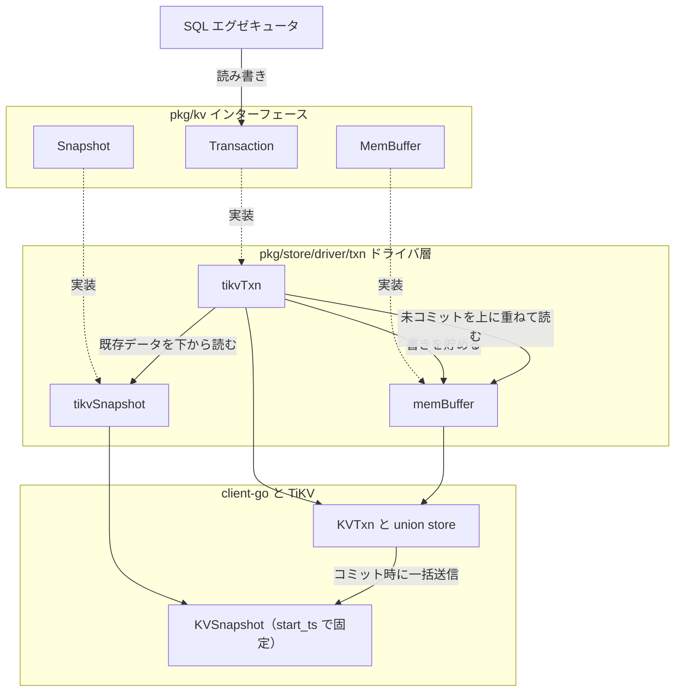

# 第16章 KV 抽象とスナップショット

> **本章で読むソース**
>
> - [`pkg/kv/kv.go`](https://github.com/pingcap/tidb/blob/v8.5.6/pkg/kv/kv.go)（`Transaction`、`Snapshot`、`MemBuffer`、`RetrieverMutator`）
> - [`pkg/store/driver/txn/txn_driver.go`](https://github.com/pingcap/tidb/blob/v8.5.6/pkg/store/driver/txn/txn_driver.go)（`tikvTxn`、`GetSnapshot`）
> - [`pkg/store/driver/txn/snapshot.go`](https://github.com/pingcap/tidb/blob/v8.5.6/pkg/store/driver/txn/snapshot.go)（`tikvSnapshot`）
> - [`pkg/executor/point_get.go`](https://github.com/pingcap/tidb/blob/v8.5.6/pkg/executor/point_get.go)（ポイントゲットの読み取り経路）

## この章の狙い

第15章では、行とインデックスが KV のキーとバイト列へどう変換されるかを読んだ。
本章は、その KV を計算層がどの抽象を通して読み書きするかを扱う。

TiDB の計算層は、分散 KV への直接の RPC を SQL エグゼキュータにさらさない。
代わりに `pkg/kv` パッケージが、読み取りと書き込みを `Transaction`、`Snapshot`、`MemBuffer` という Go のインターフェースに切り出す。
読み取りは、ある時刻に固定された**スナップショット**から行う。
書き込みは、いったん**メモリバッファ**（`MemBuffer`）に貯め、コミット時にまとめて分散 KV へ送る。

本章では、この3つのインターフェースの定義を読み、ドライバ層（`pkg/store/driver/txn`）が client-go のトランザクションをどう包んでこの抽象を満たすかを追う。
本番の2相コミット（2PC）の本体は client-go と TiKV にあり、本章はその抽象境界までを読む。
2PC の調停は[第17章](17-transaction-coordination.md)、`prewrite` と `commit` の実体は[第18章](18-percolator-2pc-unistore.md)で扱う。

## 前提

スナップショット分離（SI）と MVCC の前提を置く。
分散 KV は、各キーに複数バージョンを保持し、読み取りに付与されたタイムスタンプ以下で最新のバージョンを返す。
書き込みは新しいバージョンを追加し、既存バージョンを上書きしない。
トランザクションの開始時に TSO（タイムスタンプオラクル）から得る `start_ts` が、そのトランザクションの読み取り時刻になる。

## 読み書きを分ける3つのインターフェース

`pkg/kv` は、KV 操作を機能ごとに小さなインターフェースへ分解する。
読み取り専用の `Retriever` と書き込み専用の `Mutator` を組にしたものが `RetrieverMutator` である。

[`pkg/kv/kv.go` L182-186](https://github.com/pingcap/tidb/blob/v8.5.6/pkg/kv/kv.go#L182-L186)

```go
// RetrieverMutator is the interface that groups Retriever and Mutator interfaces.
type RetrieverMutator interface {
	Retriever
	Mutator
}
```

`Retriever` は `Get` と範囲走査の `Iter`、`IterReverse` を持ち、`Mutator` は `Set` と `Delete` を持つ。
この分解により、読み取りだけを担う `Snapshot` と、読み書き両方を担う `Transaction` を同じ部品から組み立てられる。

**`MemBuffer`** は、書き込みをコミット前に貯めるメモリ上の KV 集合である。
`RetrieverMutator` を埋め込むので、自分自身を読み返せる。

[`pkg/kv/kv.go` L188-190](https://github.com/pingcap/tidb/blob/v8.5.6/pkg/kv/kv.go#L188-L190)

```go
// MemBuffer is an in-memory kv collection, can be used to buffer write operations.
type MemBuffer interface {
	RetrieverMutator
// ... (中略) ...
```

`MemBuffer` には `Staging`、`Release`、`Cleanup` というステージング操作もある。
1つの SQL 文の書き込みをステージング層に貯め、文が成功すれば上位へ公開し、失敗すれば破棄する。
セーブポイントや楽観的トランザクションの文単位のロールバックが、この層で実現される。

**`Snapshot`** は、KV から取り出した読み取り専用のビューである。
`Retriever` に加えて、複数キーを一括取得する `BatchGet` と、読み取りオプションを設定する `SetOption` を持つ。

[`pkg/kv/kv.go` L696-704](https://github.com/pingcap/tidb/blob/v8.5.6/pkg/kv/kv.go#L696-L704)

```go
// Snapshot defines the interface for the snapshot fetched from KV store.
type Snapshot interface {
	Retriever
	// BatchGet gets a batch of values from snapshot.
	BatchGet(ctx context.Context, keys []Key, options ...BatchGetOption) (map[string]ValueEntry, error)
	// SetOption sets an option with a value, when val is nil, uses the default
	// value of this option. Only ReplicaRead is supported for snapshot
	SetOption(opt int, val any)
}
```

**`Transaction`** は、読み書き両方を担う最上位の抽象である。
`RetrieverMutator` を埋め込み、その上に `Commit`、`Rollback`、`LockKeys` といったトランザクション操作を重ねる。
本章で要となるのは、自分が抱える `MemBuffer` と `Snapshot` を取り出す2つのメソッドである。

[`pkg/kv/kv.go` L300-303](https://github.com/pingcap/tidb/blob/v8.5.6/pkg/kv/kv.go#L300-L303)

```go
	// GetMemBuffer return the MemBuffer binding to this transaction.
	GetMemBuffer() MemBuffer
	// GetSnapshot returns the Snapshot binding to this transaction.
	GetSnapshot() Snapshot
```

`Transaction` への書き込み（`Set` と `Delete`）は `MemBuffer` へ積まれ、`Get` や `Iter` は `MemBuffer` と `Snapshot` を重ねて読む。
この重ね合わせが、次に読む union store の考え方である。

## union store と読み取りの重ね合わせ

ある SQL 文が、いま自分が書いたばかりの行を読み返すことがある。
たとえば `INSERT` の直後に同じトランザクション内で `SELECT` する場合、その行はまだ分散 KV にコミットされておらず、`MemBuffer` の中にしかない。
一方、トランザクション開始前から存在する行は、`Snapshot` から読む。
両者を一枚のビューとして重ねて読むのが**union store**である。
未コミットの書き込み（`MemBuffer`）を上に、スナップショット（既存データ）を下に置き、同じキーがあれば上を優先する。

この重ね合わせは、ドライバ層の `tikvTxn.Get` にそのまま現れる。

[`pkg/store/driver/txn/txn_driver.go` L198-209](https://github.com/pingcap/tidb/blob/v8.5.6/pkg/store/driver/txn/txn_driver.go#L198-L209)

```go
func (txn *tikvTxn) Get(ctx context.Context, k kv.Key, options ...kv.GetOption) (kv.ValueEntry, error) {
	val, err := txn.GetMemBuffer().Get(ctx, k, options...)
	if kv.ErrNotExist.Equal(err) {
		val, err = txn.GetSnapshot().Get(ctx, k, options...)
	}

	if err == nil && val.IsValueEmpty() {
		return kv.ValueEntry{}, kv.ErrNotExist
	}

	return val, err
}
```

まず `MemBuffer` を引き、そこに無ければ（`ErrNotExist`）`Snapshot` へ問い合わせる。
`MemBuffer` に当たれば分散 KV への往復は起きない。
キーがメモリバッファに削除マークとして残っている場合は、値が空（`IsValueEmpty`）になり、`ErrNotExist` に正規化して上位へ「存在しない」と返す。

範囲走査も同じ構図を取る。
`MemBuffer` のイテレータとスナップショットのイテレータを束ね、`NewUnionIter` で1つのイテレータに合流させる。

[`pkg/store/driver/txn/txn_driver.go` L140-158](https://github.com/pingcap/tidb/blob/v8.5.6/pkg/store/driver/txn/txn_driver.go#L140-L158)

```go
func (txn *tikvTxn) Iter(k kv.Key, upperBound kv.Key) (iter kv.Iterator, err error) {
	var dirtyIter, snapIter kv.Iterator
	if dirtyIter, err = txn.GetMemBuffer().Iter(k, upperBound); err != nil {
		return nil, err
	}

	if snapIter, err = txn.GetSnapshot().Iter(k, upperBound); err != nil {
		dirtyIter.Close()
		return nil, err
	}

	iter, err = NewUnionIter(dirtyIter, snapIter, false)
	if err != nil {
		dirtyIter.Close()
		snapIter.Close()
	}

	return iter, err
}
```

メモリバッファ側を `dirtyIter`、スナップショット側を `snapIter` と呼ぶ。
合流したイテレータは、両者をキー順にマージしながら、同じキーでは `dirtyIter` を優先する。
こうして、未コミットの変更を含んだ「いま見えるべき状態」を、キー順に走査できる。

## ドライバ層が client-go を包む

`pkg/kv` のインターフェースは、実装を持たない契約である。
その実装は、ドライバ層 `pkg/store/driver/txn` が client-go のトランザクション型を包んで与える。
`tikvTxn` は、client-go の `tikv.KVTxn` を埋め込んだ構造体である。

[`pkg/store/driver/txn/txn_driver.go` L46-69](https://github.com/pingcap/tidb/blob/v8.5.6/pkg/store/driver/txn/txn_driver.go#L46-L69)

```go
type tikvTxn struct {
	*tikv.KVTxn
	idxNameCache        map[int64]*model.TableInfo
	snapshotInterceptor kv.SnapshotInterceptor
	// columnMapsCache is a cache used for the mutation checker
	columnMapsCache    any
	isCommitterWorking atomic.Bool
	memBuffer          *memBuffer
}

// NewTiKVTxn returns a new Transaction.
func NewTiKVTxn(txn *tikv.KVTxn) kv.Transaction {
	txn.SetKVFilter(TiDBKVFilter{})

	// init default size limits by config
	entryLimit := kv.TxnEntrySizeLimit.Load()
	totalLimit := kv.TxnTotalSizeLimit.Load()
	txn.GetUnionStore().SetEntrySizeLimit(entryLimit, totalLimit)

	return &tikvTxn{
		txn, make(map[int64]*model.TableInfo), nil, nil, atomic.Bool{},
		newMemBuffer(txn.GetMemBuffer(), txn.IsPipelined()),
	}
}
```

`NewTiKVTxn` は、`KVTxn` を `tikvTxn` で包んで `kv.Transaction` として返す。
union store の本体は、埋め込んだ `KVTxn` の側にある（`txn.GetUnionStore()`）。
TiDB 側の `tikvTxn` は、client-go の union store とメモリバッファを `pkg/kv` のインターフェースへ翻訳し、エントリのサイズ上限を設定し、TiDB 固有の KV フィルタ（不要なインデックス書き込みを落とす `TiDBKVFilter`）を差し込む。
メモリバッファ自体も `memBuffer` でラップし、client-go の `tikv.MemBuffer` を `kv.MemBuffer` として見せる（`newMemBuffer`）。

読み取り側のスナップショットも、同じくラッパーで包む。
`tikvTxn.GetSnapshot` は、`KVTxn` が保持するスナップショットを `tikvSnapshot` で包んで返す。

[`pkg/store/driver/txn/txn_driver.go` L131-134](https://github.com/pingcap/tidb/blob/v8.5.6/pkg/store/driver/txn/txn_driver.go#L131-L134)

```go
// GetSnapshot returns the Snapshot binding to this transaction.
func (txn *tikvTxn) GetSnapshot() kv.Snapshot {
	return &tikvSnapshot{txn.KVTxn.GetSnapshot(), txn.snapshotInterceptor}
}
```

`tikvSnapshot` は、client-go の `txnsnapshot.KVSnapshot` を埋め込む。

[`pkg/store/driver/txn/snapshot.go` L33-42](https://github.com/pingcap/tidb/blob/v8.5.6/pkg/store/driver/txn/snapshot.go#L33-L42)

```go
type tikvSnapshot struct {
	*txnsnapshot.KVSnapshot
	// customRetrievers stores all custom retrievers, it is sorted
	interceptor kv.SnapshotInterceptor
}

// NewSnapshot creates a kv.Snapshot with txnsnapshot.KVSnapshot.
func NewSnapshot(snapshot *txnsnapshot.KVSnapshot) kv.Snapshot {
	return &tikvSnapshot{snapshot, nil}
}
```

`tikvSnapshot.Get` は、`KVSnapshot.Get` を呼び、client-go のエラーを TiDB のエラー体系へ変換する。
オプションの差し込みも、ドライバ層が `pkg/kv` の定数を client-go の設定へ振り分ける。
スナップショットがどの時刻を読むかは、`SnapshotTS` オプションが `KVSnapshot.SetSnapshotTS` を呼ぶことで決まる。

[`pkg/store/driver/txn/snapshot.go` L99-100](https://github.com/pingcap/tidb/blob/v8.5.6/pkg/store/driver/txn/snapshot.go#L99-L100)

```go
	case kv.SnapshotTS:
		s.KVSnapshot.SetSnapshotTS(val.(uint64))
```

トランザクションが抱えるスナップショットは、開始時の `start_ts` に固定される。
同じ `start_ts` で読む限り、走査の途中で他のトランザクションがコミットしても、その変更は見えない。
読み取りが他のトランザクションの書き込みと干渉せず、一貫したビューを保てるのは、この時刻固定による。

## 全体の構図

ここまでの3層を1枚にまとめる。
SQL エグゼキュータは `pkg/kv` のインターフェースだけを見て、その背後でドライバ層が client-go を包む。



読み取りは `tikvSnapshot` 越しに `start_ts` 固定で行い、書き込みは `memBuffer` に貯める。
`tikvTxn.Get` や `Iter` が両者を重ねて union store のビューを作る。
コミット時に、貯めた書き込みが client-go の2PC を通してまとめて TiKV へ送られる。

## ポイントゲットの近道

主キーや一意キーの等値条件で1行だけ取る問い合わせには、走査を伴わない近道がある。
ポイントゲットのエグゼキュータは、union store のイテレータを組み立てず、`MemBuffer` と `Snapshot` への単発の `Get` だけで済ませる。

[`pkg/executor/point_get.go` L643-689](https://github.com/pingcap/tidb/blob/v8.5.6/pkg/executor/point_get.go#L643-L689)

```go
// get will first try to get from txn buffer, then check the pessimistic lock cache,
// then the store. Kv.ErrNotExist will be returned if key is not found
func (e *PointGetExecutor) get(ctx context.Context, key kv.Key) ([]byte, error) {
	if len(key) == 0 {
		return nil, kv.ErrNotExist
	}
// ... (中略) ...
	if e.txn.Valid() && !e.txn.IsReadOnly() {
		// We cannot use txn.Get directly here because the snapshot in txn and the snapshot of e.snapshot may be
		// different for pessimistic transaction.
		val, err = kv.GetValue(ctx, e.txn.GetMemBuffer(), key)
		if err == nil {
			return val, err
		}
		if !kv.IsErrNotFound(err) {
			return nil, err
		}
// ... (中略) ...
		// fallthrough to snapshot get.
	}
// ... (中略) ...
	// if not read lock or table was unlock then snapshot get
	return kv.GetValue(ctx, e.snapshot, key)
}
```

書き込みのあるトランザクションでは、まず `MemBuffer` を引いて自分の未コミット書き込みを読む。
そこに無ければ、`Snapshot` への単発取得（`kv.GetValue(ctx, e.snapshot, key)`）へ落ちる。
範囲走査でないため、union イテレータのマージも不要で、1キーの読み取りに最小の経路を通す。

## 高速化の工夫

この抽象には、分散 KV を相手にした2つの設計の工夫がある。

書き込みをメモリバッファへ遅延させ、コミット時に一括送信する。
1回の `Set` ごとに分散 KV へ往復していては、ネットワーク遅延が書き込みの回数だけ積み上がる。
`MemBuffer` に貯めて2PC でまとめて送ることで、往復回数をトランザクション単位に圧縮できる。
同じトランザクション内で書いた行をすぐ読み返す場合も、`MemBuffer` に当たれば往復が消える。

読み取りをスナップショット越しに `start_ts` で固定する。
読み取りに時刻を固定するので、他のトランザクションが途中でコミットしても、走査の一貫したビューは崩れない。
読み取りと書き込みが互いをブロックせず、ロックなしで一貫した読みを得られる。
これが、SI を分散環境で安く実現する土台になる。
ポイントゲットの近道は、この抽象の上で、走査が不要な1行取得に最小経路を与えるさらなる最適化である。

## まとめ

計算層は、分散 KV を `Transaction`、`Snapshot`、`MemBuffer` という `pkg/kv` のインターフェースで抽象化する。
読み取りは `start_ts` で固定したスナップショットから行い、書き込みはメモリバッファへ貯めてコミット時に一括送信する。
両者を重ねて読むのが union store で、`tikvTxn.Get` や `Iter` がメモリバッファを上に、スナップショットを下に置いて1つのビューを作る。
これらの実装は、ドライバ層 `pkg/store/driver/txn` が client-go の `KVTxn` と `KVSnapshot` を包んで与え、本番の2PC は client-go と TiKV が担う。

## 関連する章

- [第15章 行とインデックスの KV エンコード](15-kv-encoding.md)：本章でメモリバッファとスナップショットがやり取りするキーとバイト列が、どう作られるか。
- [第17章 トランザクション調停（楽観、悲観、TSO）](17-transaction-coordination.md)：本章の `Transaction` がコミットへ進むときの楽観と悲観の調停、TSO による時刻取得。
- [第18章 Percolator 2PC を unistore で読む](18-percolator-2pc-unistore.md)：コミット時にメモリバッファの書き込みを `prewrite` と `commit` で送る2PC の実体。
