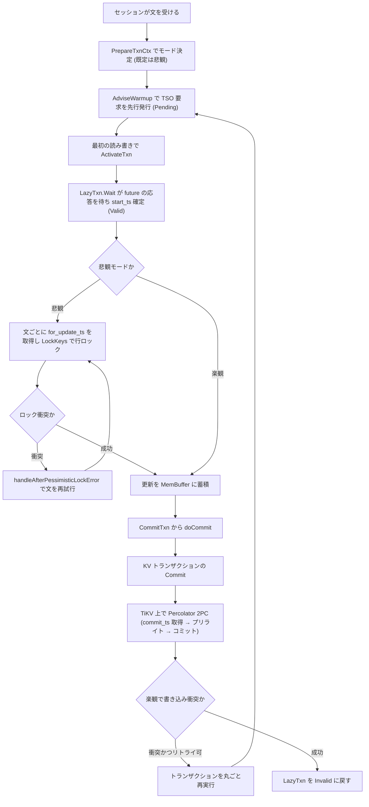

# 第17章 トランザクション調停（楽観、悲観、TSO）

> **本章で読むソース**
>
> - [`pkg/session/txn.go`](https://github.com/pingcap/tidb/blob/v8.5.6/pkg/session/txn.go)
> - [`pkg/sessiontxn/interface.go`](https://github.com/pingcap/tidb/blob/v8.5.6/pkg/sessiontxn/interface.go)
> - [`pkg/sessiontxn/isolation/base.go`](https://github.com/pingcap/tidb/blob/v8.5.6/pkg/sessiontxn/isolation/base.go)
> - [`pkg/sessiontxn/isolation/optimistic.go`](https://github.com/pingcap/tidb/blob/v8.5.6/pkg/sessiontxn/isolation/optimistic.go)
> - [`pkg/sessiontxn/isolation/repeatable_read.go`](https://github.com/pingcap/tidb/blob/v8.5.6/pkg/sessiontxn/isolation/repeatable_read.go)
> - [`pkg/session/session.go`](https://github.com/pingcap/tidb/blob/v8.5.6/pkg/session/session.go)

## この章の狙い

第16章で、`kv.Transaction` と `kv.Snapshot` がトランザクションのバッファと一貫した読み取りビューを抽象化することを読んだ。
本章では、その KV トランザクションをセッションがいつ開始し、各文をどう実行し、どこでコミットするかという**調停**の側を読む。

TiDB のトランザクションは、3つの値で位置づけられる。
読み取りビューを固定する `start_ts`、コミット順序を決める `commit_ts`、そしてこの2つを PD の **TSO** から得る点である。
TSO は全体で単調増加するタイムスタンプを配る役割で、TiDB はトランザクションの開始時と確定時にここから時刻を取る。

セッション側の調停が決めるのは、おもに次の3点である。
いつ TSO を取りに行くか、衝突をいつ検査するか（コミット時か文の実行時か）、そして衝突したときにどこからやり直すかである。
TiDB は楽観と悲観の2つのモードを持ち、それぞれこの3点の答えが違う。
本章は `LazyTxn` による開始の遅延化、`TxnManager` とプロバイダによるモードの切り替え、そしてコミット経路を順に読む。

## 前提

第16章で、セッションは `kv.Transaction` を直接持たず `LazyTxn` でラップして保持することを述べた。
本章はその `LazyTxn` の内部状態と、文ごとに呼ばれるフックの実装を読む。

トランザクションをコミットすると、TiKV 上では Percolator の2相コミット（プリライトとコミット）が走る。
その分散プロトコルの本体は次章以降で読むので、本章ではセッションが `Commit` を呼ぶところまでを追い、2PC の内部には立ち入らない。

PD の TSO と TiKV の行ロックは、計算層から見れば外部のサービスである。
本章はそれらを呼び出す計算層の側に集中し、PD と TiKV は名前で参照する。

## LazyTxn はトランザクションを3状態で持つ

セッションが保持する `LazyTxn` は、`kv.Transaction` をラップして遅延初期化を加えたものである。
型コメントが2つの役割を述べている。
文ごとの変更をいったんバッファに溜めてから本体へ反映する点と、`StartTS()` が本当に要るまで実体を持たない点である。

[`pkg/session/txn.go` L44-L54](https://github.com/pingcap/tidb/blob/v8.5.6/pkg/session/txn.go#L44-L54)

```go
// LazyTxn wraps kv.Transaction to provide a new kv.Transaction.
// 1. It holds all statement related modification in the buffer before flush to the txn,
// so if execute statement meets error, the txn won't be made dirty.
// 2. It's a lazy transaction, that means it's a txnFuture before StartTS() is really need.
type LazyTxn struct {
	// States of a LazyTxn should be one of the followings:
	// Invalid: kv.Transaction == nil && txnFuture == nil
	// Pending: kv.Transaction == nil && txnFuture != nil
	// Valid:	kv.Transaction != nil && txnFuture == nil
	kv.Transaction
	txnFuture *txnFuture
```

状態は3つに分かれる。
実体も `start_ts` の予約もない `Invalid`、TSO の取得を予約済みだが実体はまだない `Pending`、実体を持ち `start_ts` が確定した `Valid` である。
`Pending` は `txnFuture` というプロミスだけを抱えた状態で、`start_ts` を約束はしているが、まだ TSO の応答を待っていない。

状態遷移はメソッド名にそのまま現れる。
`changeToPending` が `txnFuture` を受け取って `Invalid` から `Pending` へ移し、`changePendingToValid` が future の到着を待って `Valid` へ移す。

[`pkg/session/txn.go` L276-L296](https://github.com/pingcap/tidb/blob/v8.5.6/pkg/session/txn.go#L276-L296)

```go
func (txn *LazyTxn) changeToPending(future *txnFuture) {
	txn.Transaction = nil
	txn.txnFuture = future
}

func (txn *LazyTxn) changePendingToValid(ctx context.Context, sctx sessionctx.Context) error {
	if txn.txnFuture == nil {
		return errors.New("transaction future is not set")
	}

	future := txn.txnFuture
	txn.txnFuture = nil

	defer trace.StartRegion(ctx, "WaitTsoFuture").End()
	t, err := future.wait()
	if err != nil {
		txn.Transaction = nil
		return err
	}
	txn.Transaction = t
	txn.initStmtBuf()
```

コミットやロールバックを終えた `LazyTxn` は `changeToInvalid` で `Invalid` に戻る。
実体と future を両方 `nil` にし、未確定のバッファ操作があれば破棄する。

[`pkg/session/txn.go` L329-L335](https://github.com/pingcap/tidb/blob/v8.5.6/pkg/session/txn.go#L329-L335)

```go
func (txn *LazyTxn) changeToInvalid() {
	if txn.stagingHandle != kv.InvalidStagingHandle && !txn.IsPipelined() {
		txn.Transaction.GetMemBuffer().Cleanup(txn.stagingHandle)
	}
	txn.stagingHandle = kv.InvalidStagingHandle
	txn.Transaction = nil
	txn.txnFuture = nil
```

## start_ts の TSO 取得を future で先に投げる

`Pending` の中身である `txnFuture` は、TSO への要求を表すプロミスである。
`future.wait()` が呼ばれて初めて TSO の応答を待ち、得た `startTS` を使って store の `Begin` で KV トランザクションを実際に開く。

[`pkg/session/txn.go` L681-L689](https://github.com/pingcap/tidb/blob/v8.5.6/pkg/session/txn.go#L681-L689)

```go
func (tf *txnFuture) wait() (kv.Transaction, error) {
	startTS, err := tf.future.Wait()
	failpoint.Inject("txnFutureWait", func() {})
	if err == nil {
		if tf.pipelined {
			return tf.store.Begin(tikv.WithTxnScope(tf.txnScope), tikv.WithStartTS(startTS), tikv.WithPipelinedMemDB())
		}
		return tf.store.Begin(tikv.WithTxnScope(tf.txnScope), tikv.WithStartTS(startTS))
	} else if config.GetGlobalConfig().Store == "unistore" {
```

future を作る関数は `newOracleFuture` である。
PD のオラクルから `GetTimestampAsync` で非同期に時刻を取り、`oracle.Future` を返す。
`Async` の名のとおり、この呼び出しは TSO の応答を待たずに即座に戻る。

[`pkg/sessiontxn/isolation/base.go` L628-L643](https://github.com/pingcap/tidb/blob/v8.5.6/pkg/sessiontxn/isolation/base.go#L628-L643)

```go
func newOracleFuture(ctx context.Context, sctx sessionctx.Context, scope string) oracle.Future {
	r, ctx := tracing.StartRegionEx(ctx, "isolation.newOracleFuture")
	defer r.End()

	failpoint.Inject("requestTsoFromPD", func() {
		sessiontxn.TsoRequestCountInc(sctx)
	})

	oracleStore := sctx.GetStore().GetOracle()
	option := &oracle.Option{TxnScope: scope}

	if sctx.GetSessionVars().UseLowResolutionTSO() {
		return oracleStore.GetLowResolutionTimestampAsync(ctx, option)
	}
	return oracleStore.GetTimestampAsync(ctx, option)
}
```

ここに本章の最適化がある。
要求の発行（`GetTimestampAsync`）と応答の待機（`future.wait()` の中の `Wait`）が分かれているので、TIDB は文の準備中に TSO 要求を先に投げ、PD との往復をパース処理やプラン作成と重ねて隠せる。
この先行発行を担うのが、プロバイダの `AdviseWarmup` である。
`AdviseWarmup` は、まだ future が用意されていなければ `prepareTxn` を呼び、`PrepareTSFuture` 経由で `LazyTxn` を `Pending` にする。

[`pkg/sessiontxn/isolation/base.go` L385-L392](https://github.com/pingcap/tidb/blob/v8.5.6/pkg/sessiontxn/isolation/base.go#L385-L392)

```go
// AdviseWarmup provides warmup for inner state
func (p *baseTxnContextProvider) AdviseWarmup() error {
	if p.isTxnPrepared || p.isBeginStmtWithStaleRead() {
		// When executing `START TRANSACTION READ ONLY AS OF ...` no need to warmUp
		return nil
	}
	return p.prepareTxn()
}
```

`start_ts` が実際に要るのは、最初の読み取りや書き込みで KV トランザクションを動かすときである。
そのとき `LazyTxn.Wait` が `Pending` を検出して `changePendingToValid` を呼び、先に投げてあった future の応答を受け取る。
待ち時間は `DurationWaitTS` に記録される。

[`pkg/session/txn.go` L586-L609](https://github.com/pingcap/tidb/blob/v8.5.6/pkg/session/txn.go#L586-L609)

```go
// Wait converts pending txn to valid
func (txn *LazyTxn) Wait(ctx context.Context, sctx sessionctx.Context) (kv.Transaction, error) {
	if !txn.validOrPending() {
		return txn, errors.AddStack(kv.ErrInvalidTxn)
	}
	if txn.pending() {
		defer func(begin time.Time) {
			sctx.GetSessionVars().DurationWaitTS = time.Since(begin)
		}(time.Now())

		// Transaction is lazy initialized.
		// PrepareTxnCtx is called to get a tso future, makes s.txn a pending txn,
		// If Txn() is called later, wait for the future to get a valid txn.
		if err := txn.changePendingToValid(ctx, sctx); err != nil {
			logutil.BgLogger().Warn("active transaction fail",
				zap.Error(err))
			txn.cleanup()
			sctx.GetSessionVars().TxnCtx.StartTS = 0
			return txn, err
		}
		txn.lazyUniquenessCheckEnabled = !sctx.GetSessionVars().ConstraintCheckInPlacePessimistic
	}
	return txn, nil
}
```

遅延化はネットワーク往復の節約にもなる。
読み取りも書き込みもしない文では future の応答を待つ必要がないので、`Valid` への遷移そのものが起きず、TSO の往復が省ける。

## TxnManager とプロバイダがモードを切り替える

セッションは KV トランザクションを直接操作せず、`TxnManager` を通してその開始と文ごとのフックを呼ぶ。
`TxnManager` の実体は、現在の**プロバイダ**（`TxnContextProvider`）に処理を委ねる薄い層である。
プロバイダのインターフェースが、トランザクションの調停に必要な操作を列挙している。

[`pkg/sessiontxn/interface.go` L115-L139](https://github.com/pingcap/tidb/blob/v8.5.6/pkg/sessiontxn/interface.go#L115-L139)

```go
// TxnContextProvider provides txn context
type TxnContextProvider interface {
	TxnAdvisable
	// GetTxnInfoSchema returns the information schema used by txn
	GetTxnInfoSchema() infoschema.InfoSchema
	// GetTxnScope returns the current txn scope
	GetTxnScope() string
	// GetReadReplicaScope returns the read replica scope
	GetReadReplicaScope() string
	// GetStmtReadTS returns the read timestamp used by select statement (not for select ... for update)
	GetStmtReadTS() (uint64, error)
	// GetStmtForUpdateTS returns the read timestamp used by update/insert/delete or select ... for update
	GetStmtForUpdateTS() (uint64, error)
	// GetSnapshotWithStmtReadTS gets snapshot with read ts
	GetSnapshotWithStmtReadTS() (kv.Snapshot, error)
	// GetSnapshotWithStmtForUpdateTS gets snapshot with for update ts
	GetSnapshotWithStmtForUpdateTS() (kv.Snapshot, error)

	// OnInitialize is the hook that should be called when enter a new txn with this provider
	OnInitialize(ctx context.Context, enterNewTxnType EnterNewTxnType) error
	// OnStmtStart is the hook that should be called when a new statement started
	OnStmtStart(ctx context.Context, node ast.StmtNode) error
	// OnPessimisticStmtStart is the hook that should be called when starts handling a pessimistic DML or
	// a pessimistic select-for-update statement.
	OnPessimisticStmtStart(ctx context.Context) error
```

読み取りのタイムスタンプを返すメソッドが2つに分かれている点が、楽観と悲観の違いを映す。
`GetStmtReadTS` は普通の `SELECT` が使う読み取り時刻で、`GetStmtForUpdateTS` は更新系や `SELECT ... FOR UPDATE` が使う時刻である。
楽観モードでは両者がどちらもトランザクションの `start_ts` を返すのに対し、悲観モードでは `GetStmtForUpdateTS` が文ごとに新しい時刻（`for_update_ts`）を取りに行く。

プロバイダの基底 `baseTxnContextProvider` は、共通の `ActivateTxn` を持つ。
`ActivateTxn` は `LazyTxn` を `Valid` にする要であり、`prepareTxn` で future を用意してから `Wait` を呼ぶ。

[`pkg/sessiontxn/isolation/base.go` L271-L291](https://github.com/pingcap/tidb/blob/v8.5.6/pkg/sessiontxn/isolation/base.go#L271-L291)

```go
// ActivateTxn activates the transaction and set the relevant context variables.
func (p *baseTxnContextProvider) ActivateTxn() (kv.Transaction, error) {
	if p.txn != nil {
		return p.txn, nil
	}

	if err := p.prepareTxn(); err != nil {
		return nil, err
	}

	if p.constStartTS != 0 {
		if err := p.replaceTxnTsFuture(sessiontxn.ConstantFuture(p.constStartTS)); err != nil {
			return nil, err
		}
	}

	txnFuture := p.sctx.GetPreparedTxnFuture()
	txn, err := txnFuture.Wait(p.ctx, p.sctx)
	if err != nil {
		return nil, err
	}
```

### 既定は悲観モードである

文の前にトランザクションの準備をするのは `PrepareTxnCtx` である。
ここでモードが決まる。
オートコミットでない（明示的なトランザクション中の）場合や悲観オートコミットが有効な場合に、セッション変数 `TxnMode` が `Pessimistic` なら悲観を選ぶ。
TiDB の `tidb_txn_mode` の既定値は悲観なので、明示的な `BEGIN` の後の文は既定で悲観モードになる。

[`pkg/session/session.go` L4029-L4051](https://github.com/pingcap/tidb/blob/v8.5.6/pkg/session/session.go#L4029-L4051)

```go
func (s *session) PrepareTxnCtx(ctx context.Context) error {
	s.currentCtx = ctx
	if s.txn.validOrPending() {
		return nil
	}

	txnMode := ast.Optimistic
	if !s.sessionVars.IsAutocommit() || (config.GetGlobalConfig().PessimisticTxn.
		PessimisticAutoCommit.Load() && !s.GetSessionVars().BulkDMLEnabled) {
		if s.sessionVars.TxnMode == ast.Pessimistic {
			txnMode = ast.Pessimistic
		}
	}

	if s.sessionVars.RetryInfo.Retrying {
		txnMode = ast.Pessimistic
	}

	return sessiontxn.GetTxnManager(s).EnterNewTxn(ctx, &sessiontxn.EnterNewTxnRequest{
		Type:    sessiontxn.EnterNewTxnBeforeStmt,
		TxnMode: txnMode,
	})
}
```

`EnterNewTxnBeforeStmt` で入ると、`OnInitialize` は `activeNow` を `false` にして、トランザクションをすぐには `Valid` にしない。
これが TSO 遅延化の入り口で、文を準備しても読み書きが起きるまで `start_ts` は確定しない。

[`pkg/sessiontxn/isolation/base.go` L110-L114](https://github.com/pingcap/tidb/blob/v8.5.6/pkg/sessiontxn/isolation/base.go#L110-L114)

```go
	case sessiontxn.EnterNewTxnBeforeStmt:
		activeNow = false
	default:
		return errors.Errorf("Unsupported type: %v", tp)
	}
```

## 楽観モードは衝突をコミット時にだけ検査する

楽観モードのプロバイダは `OptimisticTxnContextProvider` である。
読み取り時刻と更新系時刻の両方を `getTxnStartTS` に向けるので、文の実行中は衝突を一切検査しない。
更新は `LazyTxn` のバッファに溜まるだけで、衝突があるかどうかはコミットまで分からない。

[`pkg/sessiontxn/isolation/optimistic.go` L40-L48](https://github.com/pingcap/tidb/blob/v8.5.6/pkg/sessiontxn/isolation/optimistic.go#L40-L48)

```go
// ResetForNewTxn resets OptimisticTxnContextProvider to an initial state for a new txn
func (p *OptimisticTxnContextProvider) ResetForNewTxn(sctx sessionctx.Context, causalConsistencyOnly bool) {
	*p = emptyOptimisticTxnContextProvider
	p.sctx = sctx
	p.causalConsistencyOnly = causalConsistencyOnly
	p.onTxnActiveFunc = p.onTxnActive
	p.getStmtReadTSFunc = p.getTxnStartTS
	p.getStmtForUpdateTSFunc = p.getTxnStartTS
}
```

楽観モードでは衝突がコミットまで遅れるので、衝突したトランザクションは丸ごとやり直すしかない。
`onTxnActive` はそのトランザクションがリトライ可能かを `CouldRetry` に記録する。

[`pkg/sessiontxn/isolation/optimistic.go` L50-L56](https://github.com/pingcap/tidb/blob/v8.5.6/pkg/sessiontxn/isolation/optimistic.go#L50-L56)

```go
func (p *OptimisticTxnContextProvider) onTxnActive(_ kv.Transaction, tp sessiontxn.EnterNewTxnType) {
	sessVars := p.sctx.GetSessionVars()
	sessVars.TxnCtx.CouldRetry = isOptimisticTxnRetryable(sessVars, tp)
	failpoint.Inject("injectOptimisticTxnRetryable", func(val failpoint.Value) {
		sessVars.TxnCtx.CouldRetry = val.(bool)
	})
}
```

## 悲観モードは文の実行時に行ロックを取る

悲観モードのプロバイダは、繰り返し可能読み取りでは `PessimisticRRTxnContextProvider` である。
コンストラクタが2つの違いを設定する。
トランザクションコンテキストに `IsPessimistic` を立て、KV トランザクションが `Valid` になった瞬間に `kv.Pessimistic` オプションを立てる。

[`pkg/sessiontxn/isolation/repeatable_read.go` L48-L70](https://github.com/pingcap/tidb/blob/v8.5.6/pkg/sessiontxn/isolation/repeatable_read.go#L48-L70)

```go
// NewPessimisticRRTxnContextProvider returns a new PessimisticRRTxnContextProvider
func NewPessimisticRRTxnContextProvider(sctx sessionctx.Context, causalConsistencyOnly bool) *PessimisticRRTxnContextProvider {
	provider := &PessimisticRRTxnContextProvider{
		basePessimisticTxnContextProvider: basePessimisticTxnContextProvider{
			baseTxnContextProvider: baseTxnContextProvider{
				sctx:                  sctx,
				causalConsistencyOnly: causalConsistencyOnly,
				onInitializeTxnCtx: func(txnCtx *variable.TransactionContext) {
					txnCtx.IsPessimistic = true
					txnCtx.Isolation = ast.RepeatableRead
				},
				onTxnActiveFunc: func(txn kv.Transaction, _ sessiontxn.EnterNewTxnType) {
					txn.SetOption(kv.Pessimistic, true)
				},
			},
		},
	}

	provider.getStmtReadTSFunc = provider.getTxnStartTS
	provider.getStmtForUpdateTSFunc = provider.getForUpdateTs

	return provider
}
```

更新系の時刻は `getForUpdateTs` が返す。
楽観モードと違い、文ごとに PD から新しい時刻を取り、それを `for_update_ts` としてトランザクションコンテキストとスナップショットに設定する。
新しい時刻で読み直すので、悲観モードの更新文は他のトランザクションが直前にコミットした最新の値を見て、それに対してロックを取る。

[`pkg/sessiontxn/isolation/repeatable_read.go` L72-L102](https://github.com/pingcap/tidb/blob/v8.5.6/pkg/sessiontxn/isolation/repeatable_read.go#L72-L102)

```go
func (p *PessimisticRRTxnContextProvider) getForUpdateTs() (ts uint64, err error) {
	if p.forUpdateTS != 0 {
		return p.forUpdateTS, nil
	}

	var txn kv.Transaction
	if txn, err = p.ActivateTxn(); err != nil {
		return 0, err
	}

	if p.optimizeForNotFetchingLatestTS {
		p.forUpdateTS = p.sctx.GetSessionVars().TxnCtx.GetForUpdateTS()
		return p.forUpdateTS, nil
	}

	txnCtx := p.sctx.GetSessionVars().TxnCtx
	futureTS := newOracleFuture(p.ctx, p.sctx, txnCtx.TxnScope)

	start := time.Now()
	if ts, err = futureTS.Wait(); err != nil {
		return 0, err
	}
	p.sctx.GetSessionVars().DurationWaitTS += time.Since(start)

	txnCtx.SetForUpdateTS(ts)
	txn.SetOption(kv.SnapshotTS, ts)

	p.forUpdateTS = ts

	return
}
```

行ロック自体は、エグゼキュータが書き込むべきキーを集めて `LazyTxn.LockKeys` を呼ぶことで取る。
`LockKeys` は KV トランザクションの `LockKeys` をラップし、ロック取得中の状態を記録する。
状態を `TxnLockAcquiring` に切り替え、ロックの待機開始時刻 `BlockStartTime` を立て、取得が終わるとそれらを戻す。

[`pkg/session/txn.go` L462-L485](https://github.com/pingcap/tidb/blob/v8.5.6/pkg/session/txn.go#L462-L485)

```go
// LockKeysFunc Wrap the inner transaction's `LockKeys` to record the status
func (txn *LazyTxn) LockKeysFunc(ctx context.Context, lockCtx *kv.LockCtx, fn func(), keys ...kv.Key) error {
	failpoint.Inject("beforeLockKeys", func() {})
	t := time.Now()

	var originState txninfo.TxnRunningState
	txn.mu.Lock()
	originState = txn.mu.TxnInfo.State
	txn.updateState(txninfo.TxnLockAcquiring)
	txn.mu.TxnInfo.BlockStartTime.Valid = true
	txn.mu.TxnInfo.BlockStartTime.Time = t
	txn.mu.Unlock()
	lockFunc := func() {
		if fn != nil {
			fn()
		}
		txn.mu.Lock()
		defer txn.mu.Unlock()
		txn.updateState(originState)
		txn.mu.TxnInfo.BlockStartTime.Valid = false
		txn.mu.TxnInfo.EntriesCount = uint64(txn.Transaction.Len())
	}
	return txn.Transaction.LockKeysFunc(ctx, lockCtx, lockFunc, keys...)
}
```

ここに悲観モードの最適化がある。
文の実行時に行ロックを取って書き込み衝突をその場で検出するので、衝突は文単位で処理でき、トランザクションを丸ごとやり直さずに済む。
別のトランザクションが同じキーをロックしていれば、`LockKeys` は TiKV 側でロックの解放を待ってブロックする。
長く動くトランザクションほど、コミット時の一括検査で衝突が見つかってやり直す代償は大きいので、早い検出が無駄なやり直しを避ける。

衝突が起きたときの文ごとのやり直しは、`handleAfterPessimisticLockError` が調停する。
書き込み衝突なら待機時間がタイムアウトを超えていないかを確かめ、`updateForUpdateTS` で新しい時刻を取り直してから `RetryReady` を返す。
デッドロックでリトライ可能なら同じく文を再試行し、リトライ不可なら誤りとして返す。

[`pkg/sessiontxn/isolation/repeatable_read.go` L260-L264](https://github.com/pingcap/tidb/blob/v8.5.6/pkg/sessiontxn/isolation/repeatable_read.go#L260-L264)

```go
	} else if terror.ErrorEqual(kv.ErrWriteConflict, lockErr) {
		waitTime := time.Since(sessVars.StmtCtx.GetLockWaitStartTime())
		if waitTime.Milliseconds() >= sessVars.LockWaitTimeout {
			return sessiontxn.ErrorAction(tikverr.ErrLockWaitTimeout)
		}
```

## コミット経路は CommitTxn から KV の Commit へ

セッションのコミットは `CommitTxn` から始まる。
`doCommitWithRetry` を呼び、コミット詳細をセッションの統計に取り込む。

[`pkg/session/session.go` L921-L944](https://github.com/pingcap/tidb/blob/v8.5.6/pkg/session/session.go#L921-L944)

```go
func (s *session) CommitTxn(ctx context.Context) error {
	r, ctx := tracing.StartRegionEx(ctx, "session.CommitTxn")
	defer r.End()

	var commitDetail *tikvutil.CommitDetails
	ctx = context.WithValue(ctx, tikvutil.CommitDetailCtxKey, &commitDetail)
	err := s.doCommitWithRetry(ctx)
	if commitDetail != nil {
		s.sessionVars.StmtCtx.MergeExecDetails(nil, commitDetail)
	}

	// record the TTLInsertRows in the metric
	metrics.TTLInsertRowsCount.Add(float64(s.sessionVars.TxnCtx.InsertTTLRowsCount))
	metrics.DDLCommitTempIndexWrite(s.sessionVars.ConnectionID)

	failpoint.Inject("keepHistory", func(val failpoint.Value) {
		if val.(bool) {
			failpoint.Return(err)
		}
	})
	s.sessionVars.TxnCtx.Cleanup()
	s.sessionVars.CleanupTxnReadTSIfUsed()
	return err
}
```

`doCommitWithRetry` の中心は `doCommit` の呼び出しと、その後のリトライ判定である。
読み取り専用のトランザクションは `doCommit` の中で素通りし、書き込みのあるトランザクションだけが実際にコミットされる。

`doCommit` は、コミット前に必要なオプションを設定してから `commitTxnWithTemporaryData` を呼ぶ。
コミット直前の `SetOptionsBeforeCommit` で、2PC がスキーマリースを検証するための `SchemaChecker` などを KV トランザクションに渡す。

[`pkg/session/session.go` L551-L559](https://github.com/pingcap/tidb/blob/v8.5.6/pkg/session/session.go#L551-L559)

```go
	if err = sessiontxn.GetTxnManager(s).SetOptionsBeforeCommit(s.txn.Transaction, commitTSChecker); err != nil {
		return err
	}

	err = s.commitTxnWithTemporaryData(tikvutil.SetSessionID(ctx, sessVars.ConnectionID), &s.txn)
	if err != nil {
		err = s.handleAssertionFailure(ctx, err)
	}
	return err
```

一時テーブルがなければ `commitTxnWithTemporaryData` はそのまま KV トランザクションの `Commit` を呼ぶ。
ここから先が TiKV 上の Percolator 2PC であり、`commit_ts` の取得とプリライト、コミットがその中で進む。

[`pkg/session/session.go` L667-L676](https://github.com/pingcap/tidb/blob/v8.5.6/pkg/session/session.go#L667-L676)

```go
func (s *session) commitTxnWithTemporaryData(ctx context.Context, txn kv.Transaction) error {
	sessVars := s.sessionVars
	txnTempTables := sessVars.TxnCtx.TemporaryTables
	if len(txnTempTables) == 0 {
		failpoint.Inject("mockSleepBeforeTxnCommit", func(v failpoint.Value) {
			ms := v.(int)
			time.Sleep(time.Millisecond * time.Duration(ms))
		})
		return txn.Commit(ctx)
	}
```

KV トランザクションの `Commit` は `LazyTxn.Commit` を経由する。
状態を `TxnCommitting` に切り替えてから内部の `Commit` へ委ね、最後に `reset` で `LazyTxn` を `Invalid` に戻す。

[`pkg/session/txn.go` L402-L408](https://github.com/pingcap/tidb/blob/v8.5.6/pkg/session/txn.go#L402-L408)

```go
// Commit overrides the Transaction interface.
func (txn *LazyTxn) Commit(ctx context.Context) error {
	defer txn.reset()

	txn.mu.Lock()
	txn.updateState(txninfo.TxnCommitting)
	txn.mu.Unlock()
```

## 楽観モードのリトライはトランザクションを丸ごとやり直す

楽観モードでコミットが書き込み衝突で失敗すると、`doCommitWithRetry` がトランザクション全体のリトライを試みる。
リトライするのは、再試行可能な誤りで、バッチ挿入でなく、リトライ上限が正で、悲観でもパイプラインでもない場合に限る。
悲観モードが除かれているのは、悲観なら衝突を文の実行時に処理済みで、コミット時の全体リトライが不要だからである。

[`pkg/session/session.go` L812-L821](https://github.com/pingcap/tidb/blob/v8.5.6/pkg/session/session.go#L812-L821)

```go
		if s.isTxnRetryableError(err) && !s.sessionVars.BatchInsert && commitRetryLimit > 0 && !isPessimistic && !isPipelined {
			logutil.Logger(ctx).Warn("sql",
				zap.String("label", s.GetSQLLabel()),
				zap.Error(err),
				zap.String("txn", s.txn.GoString()))
			// Transactions will retry 2 ~ commitRetryLimit times.
			// We make larger transactions retry less times to prevent cluster resource outage.
			txnSizeRate := float64(txnSize) / float64(kv.TxnTotalSizeLimit.Load())
			maxRetryCount := commitRetryLimit - int64(float64(commitRetryLimit-1)*txnSizeRate)
			err = s.retry(ctx, uint(maxRetryCount))
```

リトライ回数はトランザクションのサイズで減らす。
大きなトランザクションほど何度もやり直すとクラスタの資源を食うので、サイズの割合 `txnSizeRate` に応じて上限を下げる。
これは、楽観モードで衝突がコミットまで遅れることの代償を、大きなトランザクションで抑える調整である。

## トランザクションの一生

ここまでの開始、文の実行、コミットの流れを1本の道筋にまとめる。
悲観モードでは文ごとに行ロックを取り、楽観モードではコミット時にだけ衝突を検査する点が分岐になる。



## まとめ

セッションは `kv.Transaction` を `LazyTxn` でラップし、`Invalid`、`Pending`、`Valid` の3状態で持つ。
`start_ts` の TSO 取得は `AdviseWarmup` で先に投げ、最初の読み書きで `LazyTxn.Wait` が応答を受け取って `Valid` にする。
要求の発行と応答の待機を分けることで、PD との往復を文の準備に重ねて隠し、読み書きのない文では往復そのものを省く。

モードの切り替えは `TxnManager` とプロバイダが担う。
楽観モードは読み取りも更新も `start_ts` で行い、衝突はコミット時にだけ検査するので、衝突したらトランザクションを丸ごとやり直す。
悲観モード（既定）は文ごとに `for_update_ts` を取り直して行ロックを取り、書き込み衝突をその場で検出して文単位で再試行するので、長いトランザクションの無駄なやり直しを避ける。

コミットは `CommitTxn` から `doCommit` を経て KV トランザクションの `Commit` に至り、その先で TiKV 上の Percolator 2PC が走る。

## 関連する章

- [第16章 KV 抽象とスナップショット](16-kv-abstraction-and-snapshot.md)：本章がラップする `kv.Transaction` とスナップショットの抽象。
- [第18章 Percolator 2PC を unistore で読む](18-percolator-2pc-unistore.md)：本章のコミットが起動する2相コミットの本体。
- [第19章 async commit、1PC、GC](19-async-commit-and-gc.md)：コミット経路を短縮する最適化と、不要になった版の回収。
