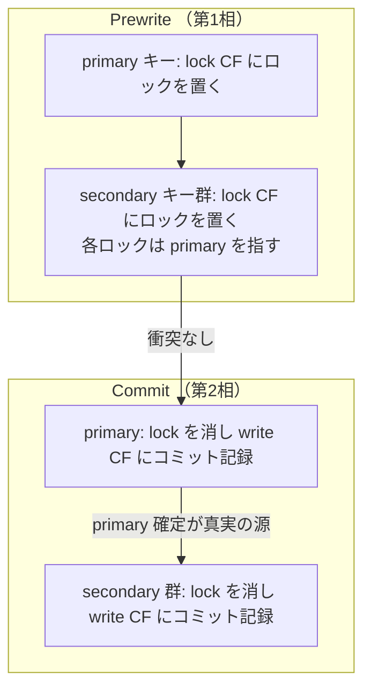

# 第18章 Percolator 2PC を unistore で読む

> **本章で読むソース**
>
> - [`pkg/store/mockstore/unistore/tikv/mvcc.go`](https://github.com/pingcap/tidb/blob/v8.5.6/pkg/store/mockstore/unistore/tikv/mvcc.go)
> - [`pkg/store/mockstore/unistore/tikv/write.go`](https://github.com/pingcap/tidb/blob/v8.5.6/pkg/store/mockstore/unistore/tikv/write.go)
> - [`pkg/store/mockstore/unistore/tikv/mvcc/mvcc.go`](https://github.com/pingcap/tidb/blob/v8.5.6/pkg/store/mockstore/unistore/tikv/mvcc/mvcc.go)
> - [`pkg/store/mockstore/unistore/tikv/mvcc/tikv.go`](https://github.com/pingcap/tidb/blob/v8.5.6/pkg/store/mockstore/unistore/tikv/mvcc/tikv.go)
> - [`pkg/store/mockstore/unistore/tikv/dbreader/db_reader.go`](https://github.com/pingcap/tidb/blob/v8.5.6/pkg/store/mockstore/unistore/tikv/dbreader/db_reader.go)

## この章の狙い

第17章では、TiDB のクライアント側がトランザクションをどう調停するかを読んだ。
本章はその先、KV サーバ側で実際にロックを書き、値を確定させる **Percolator** 方式の分散2相コミット（2PC）と、それを支える MVCC を、サーバの実コードで読む。

具体的に読むのは TiDB に同梱された **unistore** である。
unistore は TiDB のプロセス内で動くテストとお試し用の KV であり、ストレージに badger（Go 製の LSM-tree）を使う。
本番では2PC のコーディネータは client-go（TiDB から呼ぶ KV クライアント）、KV サーバは Rust 実装の TiKV が担う。
unistore は本番の TiKV を置き換える別実装だが、Prewrite、Commit、ロック解決といった Percolator プロトコルの面は本番と同じ形を実装している。
本番の TiKV をそのまま読むより小さく、プロトコルの骨格を1ファイルで追えるため、機構を具体的に読む土台として unistore を選ぶ。

本番との対応を先に押さえる。

| 役割 | 本番 | 本章で読む unistore |
| --- | --- | --- |
| 2PC コーディネータ | client-go（TiDB に組み込み） | client-go（unistore でも同じ） |
| KV サーバ | TiKV（Rust） | unistore の `MVCCStore`（Go） |
| 下層ストレージ | RocksDB | badger（Go 製 LSM-tree） |

つまりコーディネータ側は本番も unistore も client-go で共通であり、置き換わるのは KV サーバの実装だけである。
本章はその KV サーバ側、`MVCCStore` の `Prewrite` と `Commit` を読む。

## 前提

Percolator は Google が BigTable 上に構築した分散トランザクションの方式である。
グローバルに単調増加するタイムスタンプ（TiDB では TSO が払い出す）を使い、各トランザクションは開始時刻 start_ts とコミット時刻 commit_ts の2つを持つ。
Percolator は3つの列族（CF）にデータを分けて持つ。

- **default**：実データを保持し、バージョンを start_ts で区別する CF である。
- **lock**：プリライト中のロックを保持し、キーごとに高々1つのロックが載る CF である。
- **write**：コミット記録を保持し、commit_ts をバージョンとしてどの start_ts の版が確定したかを指す CF である。

読み取りは、start_ts 以前で最新の write レコードを辿り、それが指す default の版を返す。
これにより、コミット済みのスナップショットだけが見える MVCC が成り立つ。

unistore はこの3つの CF を概念として実装するが、物理的な持ち方は TiKV と異なる。
lock CF は専用のインメモリ構造 `lockStore` に、default と write は badger の1つの木に載せ、後者では値そのものと「どの start_ts と commit_ts で確定したか」を `UserMeta` に詰めて表す。
unistore が TiKV 互換の CF 符号化（`WriteCFValue` など）も別に持つことは後述する。

## トランザクションを2相に分ける理由

分散トランザクションでは、1つのトランザクションが書き換えるキー群が複数の Region に分かれて別のノードに載る。
全キーを1回の原子的書き込みで確定する手段はないため、書き込みを2相に分ける。
第1相の **Prewrite** で全キーにロックを置き、衝突がなければ第2相の **Commit** でロックを確定済みの記録に変える。

Percolator が単独で巧妙なのは、コミットの可否を1つのキー（**primary**）に集約する点である。
トランザクションは書き換えるキーの1つを primary に選び、残りを **secondary** とする。
各 secondary のロックは自分の primary がどれかを記録する。
コミットの成否は primary のコミットが成立したか否かだけで決まり、secondary はその決定に従う。
この設計が、コーディネータが落ちても残ったロックから正しい結末を復元できる根拠になる。



## Prewrite：ロックを置き、衝突を見る

`Prewrite` は受け取った変更（mutation）を処理する入口である。
まず変更をキー順にソートし、キーのハッシュでラッチ（同一キーへの並行操作を直列化するインメモリの掛け金）を取る。
楽観的トランザクションか悲観的トランザクションかで分岐するが、本章は楽観的の経路を読む。

[`pkg/store/mockstore/unistore/tikv/mvcc.go` L768-796](https://github.com/pingcap/tidb/blob/v8.5.6/pkg/store/mockstore/unistore/tikv/mvcc.go#L768-L796)

```go
func (store *MVCCStore) Prewrite(reqCtx *requestCtx, req *kvrpcpb.PrewriteRequest) error {
	mutations := sortPrewrite(req)
	regCtx := reqCtx.regCtx
	hashVals := mutationsToHashVals(mutations)

	regCtx.AcquireLatches(hashVals)
	defer regCtx.ReleaseLatches(hashVals)

	isPessimistic := req.ForUpdateTs > 0
	var err error
	if isPessimistic {
		err = store.prewritePessimistic(reqCtx, mutations, req)
	} else {
		err = store.prewriteOptimistic(reqCtx, mutations, req)
	}
	if err != nil {
		return err
	}

	if reqCtx.onePCCommitTS != 0 {
		// TODO: Is it correct to pass the hashVals directly here, considering that some of the keys may
		// have no pessimistic lock?
		if isPessimistic {
			store.lockWaiterManager.WakeUp(req.StartVersion, reqCtx.onePCCommitTS, hashVals)
			store.DeadlockDetectCli.CleanUp(req.StartVersion)
		}
	}
	return nil
}
```

`prewriteOptimistic` は2種類の衝突を順に見る。
まず lock CF を見て、別のトランザクションのロックが既に載っていないかを調べる。

[`pkg/store/mockstore/unistore/tikv/mvcc.go` L1220-1232](https://github.com/pingcap/tidb/blob/v8.5.6/pkg/store/mockstore/unistore/tikv/mvcc.go#L1220-L1232)

```go
func (store *MVCCStore) checkConflictInLockStore(
	req *requestCtx, mutation *kvrpcpb.Mutation, startTS uint64) (*mvcc.Lock, error) {
	req.buf = store.lockStore.Get(mutation.Key, req.buf)
	if len(req.buf) == 0 {
		return nil, nil
	}
	lock := mvcc.DecodeLock(req.buf)
	if lock.StartTS == startTS {
		// Same ts, no need to overwrite.
		return &lock, nil
	}
	return nil, kverrors.BuildLockErr(mutation.Key, &lock)
}
```

ロックが無ければ衝突なしとして処理を進める。
同じ start_ts のロックが既にあれば、それは自分自身が再送した Prewrite なので衝突ではない。
別の start_ts のロックがあれば `ErrLocked` を返し、クライアントにロック解決を促す。

ロックが無いキーには、次に write CF の衝突を見る。
書き込み対象キーの最新版の commit_ts が、自分の start_ts より新しければ、自分が開始した後に別のトランザクションがコミットしたことになる。
これは楽観的トランザクションの書き込み衝突であり、`ErrConflict` を返す。

[`pkg/store/mockstore/unistore/tikv/mvcc.go` L825-838](https://github.com/pingcap/tidb/blob/v8.5.6/pkg/store/mockstore/unistore/tikv/mvcc.go#L825-L838)

```go
	for i, m := range mutations {
		item := items[i]
		if item != nil {
			userMeta := mvcc.DBUserMeta(item.UserMeta())
			if userMeta.CommitTS() > startTS {
				return &kverrors.ErrConflict{
					StartTS:          startTS,
					ConflictTS:       userMeta.StartTS(),
					ConflictCommitTS: userMeta.CommitTS(),
					Key:              item.KeyCopy(nil),
					Reason:           kvrpcpb.WriteConflict_Optimistic,
				}
			}
		}
```

衝突が無ければ、各キーにロックを構築する。
`buildPrewriteLock` が組み立てる `mvcc.Lock` には、このトランザクションの start_ts、TTL、primary のキー、そして mutation の値が入る。
secondary 群のキーも `Secondaries` に持つ（async commit 用、第19章で扱う）。

[`pkg/store/mockstore/unistore/tikv/mvcc.go` L1141-1155](https://github.com/pingcap/tidb/blob/v8.5.6/pkg/store/mockstore/unistore/tikv/mvcc.go#L1141-L1155)

```go
func (store *MVCCStore) buildPrewriteLock(reqCtx *requestCtx, m *kvrpcpb.Mutation, item *badger.Item,
	req *kvrpcpb.PrewriteRequest) (*mvcc.Lock, error) {
	lock := &mvcc.Lock{
		LockHdr: mvcc.LockHdr{
			StartTS:        req.StartVersion,
			TTL:            uint32(req.LockTtl),
			PrimaryLen:     uint16(len(req.PrimaryLock)),
			MinCommitTS:    req.MinCommitTs,
			UseAsyncCommit: req.UseAsyncCommit,
			SecondaryNum:   uint32(len(req.Secondaries)),
		},
		Primary:     req.PrimaryLock,
		Value:       m.Value,
		Secondaries: req.Secondaries,
	}
```

組み立てたロックは、書き込みバッチ経由で lock CF に置かれる。
unistore では lock CF は専用構造 `lockStore` であり、Prewrite はそこへロックを直列化して書く。

[`pkg/store/mockstore/unistore/tikv/write.go` L246-248](https://github.com/pingcap/tidb/blob/v8.5.6/pkg/store/mockstore/unistore/tikv/write.go#L246-L248)

```go
func (wb *writeBatch) Prewrite(key []byte, lock *mvcc.Lock) {
	wb.lockBatch.set(key, lock.MarshalBinary())
}
```

この時点で値そのものはまだ lock CF の中にある（短い値はロックに同梱する）。
default や write CF にはまだ何も確定していない。
Prewrite が全キーで成功して初めて、第2相に進める。

## Commit：primary を確定し、secondary を従わせる

`Commit` は、Prewrite で置いたロックを、確定済みのコミット記録に変える。
本番の client-go は、まず primary を1回 Commit してから secondary 群を Commit する。
unistore の `Commit` 自体はキー群をまとめて受け取って処理するが、確定の意味づけは「ロックを消し、write CF にコミット記録を書く」という1点に集約される。

[`pkg/store/mockstore/unistore/tikv/mvcc.go` L1236-1296](https://github.com/pingcap/tidb/blob/v8.5.6/pkg/store/mockstore/unistore/tikv/mvcc.go#L1236-L1296)

```go
// Commit implements the MVCCStore interface.
func (store *MVCCStore) Commit(req *requestCtx, keys [][]byte, startTS, commitTS uint64) error {
	sortKeys(keys)
	store.updateLatestTS(commitTS)
	regCtx := req.regCtx
	hashVals := keysToHashVals(keys...)
	batch := store.dbWriter.NewWriteBatch(startTS, commitTS, req.rpcCtx)
	regCtx.AcquireLatches(hashVals)
	defer regCtx.ReleaseLatches(hashVals)

	var buf []byte
	var tmpDiff int
	var isPessimisticTxn bool
	for _, key := range keys {
		var lockErr error
		var checkErr error
		var lock mvcc.Lock
		buf = store.lockStore.Get(key, buf)
		if len(buf) == 0 {
			// We never commit partial keys in Commit request, so if one lock is not found,
			// the others keys must not be found too.
			lockErr = kverrors.ErrLockNotFound
		} else {
			lock = mvcc.DecodeLock(buf)
			if lock.StartTS != startTS {
				lockErr = kverrors.ErrReplaced
			}
		}
		if lockErr != nil {
			// Maybe the secondary keys committed by other concurrent transactions using lock resolver,
			// check commit info from store
			checkErr = store.handleLockNotFound(req, key, startTS, commitTS)
			if checkErr == nil {
				continue
			}
			log.Error("commit failed, no correspond lock found",
				zap.Binary("key", key), zap.Uint64("start ts", startTS), zap.String("lock", fmt.Sprintf("%v", lock)), zap.Error(lockErr))
			return lockErr
		}
		if commitTS < lock.MinCommitTS {
			log.Info("trying to commit with smaller commitTs than minCommitTs",
				zap.Uint64("commit ts", commitTS), zap.Uint64("min commit ts", lock.MinCommitTS), zap.Binary("key", key))
			return &kverrors.ErrCommitExpire{
				StartTs:     startTS,
				CommitTs:    commitTS,
				MinCommitTs: lock.MinCommitTS,
				Key:         key,
			}
		}
		isPessimisticTxn = lock.ForUpdateTS > 0
		tmpDiff += len(key) + len(lock.Value)
		batch.Commit(key, &lock)
	}
	atomic.AddInt64(regCtx.Diff(), int64(tmpDiff))
	err := store.dbWriter.Write(batch)
	store.lockWaiterManager.WakeUp(startTS, commitTS, hashVals)
	if isPessimisticTxn {
		store.DeadlockDetectCli.CleanUp(startTS)
	}
	return err
}
```

各キーで、まず lock CF にこのトランザクションのロックが残っているかを見る。
ロックがあり start_ts が一致すれば、`batch.Commit` でコミットを記録する。
ロックが無い、または別の start_ts に置き換わっていれば、`handleLockNotFound` で「既に同じ start_ts でコミット済みではないか」を確認する。
既にコミット済みなら冪等な再送として読み飛ばし、そうでなければ `ErrLockNotFound` を返す。

`batch.Commit` の実体が、3つの CF の状態遷移を引き起こす。

[`pkg/store/mockstore/unistore/tikv/write.go` L250-263](https://github.com/pingcap/tidb/blob/v8.5.6/pkg/store/mockstore/unistore/tikv/write.go#L250-L263)

```go
func (wb *writeBatch) Commit(key []byte, lock *mvcc.Lock) {
	userMeta := mvcc.NewDBUserMeta(wb.startTS, wb.commitTS)
	k := y.KeyWithTs(key, wb.commitTS)
	if lock.Op == uint8(kvrpcpb.Op_PessimisticLock) {
		log.Info("removing a pessimistic lock when committing", zap.Binary("key", key), zap.Uint64("startTS", wb.startTS), zap.Uint64("commitTS", wb.commitTS))
		// Write nothing as if PessimisticRollback is called.
	} else if lock.Op != uint8(kvrpcpb.Op_Lock) {
		wb.dbBatch.set(k, lock.Value, userMeta)
	} else if bytes.Equal(key, lock.Primary) {
		opLockKey := y.KeyWithTs(mvcc.EncodeExtraTxnStatusKey(key, wb.startTS), wb.startTS)
		wb.dbBatch.set(opLockKey, nil, userMeta)
	}
	wb.lockBatch.delete(key)
}
```

通常の `Put` や `Del` では、`commitTS` をバージョンとするキーに値を書き、`UserMeta` に start_ts と commit_ts を詰める。
この badger 側の1エントリが、Percolator の default CF（値）と write CF（commit_ts からその版を指す記録）の両方の役割を1つにまとめたものである。
最後に lock CF からロックを削除する。
これでこのキーは確定し、commit_ts 以後の読み取りから見えるようになる。

`UserMeta` の符号化は16バイトに start_ts と commit_ts を並べただけの素朴なものである。

[`pkg/store/mockstore/unistore/tikv/mvcc/mvcc.go` L152-168](https://github.com/pingcap/tidb/blob/v8.5.6/pkg/store/mockstore/unistore/tikv/mvcc/mvcc.go#L152-L168)

```go
// NewDBUserMeta creates a new DBUserMeta.
func NewDBUserMeta(startTS, commitTS uint64) DBUserMeta {
	m := make(DBUserMeta, 16)
	defaultEndian.PutUint64(m, startTS)
	defaultEndian.PutUint64(m[8:], commitTS)
	return m
}

// CommitTS reads the commitTS from the DBUserMeta.
func (m DBUserMeta) CommitTS() uint64 {
	return defaultEndian.Uint64(m[8:])
}

// StartTS reads the startTS from the DBUserMeta.
func (m DBUserMeta) StartTS() uint64 {
	return defaultEndian.Uint64(m[:8])
}
```

書き込みの順序には決まりがある。
`dbWriter.Write` は default と write 相当の badger 書き込みを先に永続化し、その完了後に lock CF の削除を行う。

[`pkg/store/mockstore/unistore/tikv/write.go` L218-237](https://github.com/pingcap/tidb/blob/v8.5.6/pkg/store/mockstore/unistore/tikv/write.go#L218-L237)

```go
func (writer *dbWriter) Write(batch mvcc.WriteBatch) error {
	wb := batch.(*writeBatch)
	if len(wb.dbBatch.entries) > 0 {
		wb.dbBatch.wg.Add(1)
		writer.dbCh <- &wb.dbBatch
		wb.dbBatch.wg.Wait()
		err := wb.dbBatch.err
		if err != nil {
			return err
		}
	}
	if len(wb.lockBatch.entries) > 0 {
		// We must delete lock after commit succeed, or there will be inconsistency.
		wb.lockBatch.wg.Add(1)
		writer.lockCh <- &wb.lockBatch
		wb.lockBatch.wg.Wait()
		return wb.lockBatch.err
	}
	return nil
}
```

コメントが明示するとおり、ロック削除はコミット記録の永続化が成功した後でなければならない。
順序が逆だと、ロックを消した直後にコミット記録の書き込みが失敗した場合、確定もロックも無い宙ぶらりんのキーが残ってしまう。
コミット記録を先に確実にしておけば、最悪ロックが残っても、それは後述の復元手順で確定済みと判定して解決できる。

## MVCC 読み取り：write を辿って値を得る

読み取りは start_ts を版として渡し、その時刻に見えるべき値を返す。
`GetPair` は、まず lock CF を見てから default や write を読む。

[`pkg/store/mockstore/unistore/tikv/mvcc.go` L1830-1868](https://github.com/pingcap/tidb/blob/v8.5.6/pkg/store/mockstore/unistore/tikv/mvcc.go#L1830-L1868)

```go
// GetPair gets the KvPair
func (store *MVCCStore) GetPair(reqCtx *requestCtx, key []byte, version uint64) (*kvrpcpb.KvPair, error) {
	if reqCtx.isSnapshotIsolation() {
		committedLocks := reqCtx.rpcCtx.CommittedLocks
		if reqCtx.returnCommitTS {
			// set committedLocks to nil if commitTS is needed to make sure all KvPair has CommitTS
			committedLocks = nil
		}
		lockPairs, err := store.CheckKeysLock(version, reqCtx.rpcCtx.ResolvedLocks, committedLocks, key)
		if err != nil {
			return nil, err
		}
		if len(lockPairs) != 0 {
			return &kvrpcpb.KvPair{
				Key:   safeCopy(key),
				Value: safeCopy(getValueFromLock(lockPairs[0].lock)),
			}, nil
		}
	} else if reqCtx.isRcCheckTSIsolationLevel() {
		err := store.CheckKeysLockForRcCheckTS(version, reqCtx.rpcCtx.ResolvedLocks, key)
		if err != nil {
			return nil, err
		}
	}
	val, userMeta, err := reqCtx.getDBReader().Get(key, version)
	if err != nil {
		return nil, err
	}

	var commitTS uint64
	if reqCtx.returnCommitTS && len(userMeta) > 0 {
		commitTS = userMeta.CommitTS()
	}
	return &kvrpcpb.KvPair{
		Key:      safeCopy(key),
		Value:    safeCopy(val),
		CommitTs: commitTS,
	}, err
}
```

スナップショット分離では、まず `CheckKeysLock` でキーにロックが載っていないかを確かめる。
自分の start_ts より前に開始され、まだコミットされていないロックがあれば、その版が確定するまで読めない。
この場合は `ErrLocked` を返し、クライアントにロック解決を促す（ロック解決の機構は第19章で扱う）。

ロックが無ければ、`DBReader.Get` が badger の MVCC 読み取りを行う。
読み取り時刻を start_ts に設定して `txn.Get` を呼ぶと、badger がその時刻以前で最新の版を返す。

[`pkg/store/mockstore/unistore/tikv/dbreader/db_reader.go` L136-159](https://github.com/pingcap/tidb/blob/v8.5.6/pkg/store/mockstore/unistore/tikv/dbreader/db_reader.go#L136-L159)

```go
// Get gets a value with the key and start ts.
func (r *DBReader) Get(key []byte, startTS uint64) ([]byte, mvcc.DBUserMeta, error) {
	r.txn.SetReadTS(startTS)
	if r.RcCheckTS {
		r.txn.SetReadTS(math.MaxUint64)
	}
	item, err := r.txn.Get(key)
	if err != nil && err != badger.ErrKeyNotFound {
		return nil, mvcc.DBUserMeta{}, errors.Trace(err)
	}
	if item == nil {
		return nil, mvcc.DBUserMeta{}, nil
	}
	err = r.CheckWriteItemForRcCheckTSRead(startTS, item)
	if err != nil {
		return nil, mvcc.DBUserMeta{}, errors.Trace(err)
	}

	val, err := item.Value()
	if err != nil {
		return nil, mvcc.DBUserMeta{}, errors.Trace(err)
	}
	return val, item.UserMeta(), nil
}
```

unistore では badger のキーが commit_ts をバージョンに持つため、「start_ts 以前で最新の write を辿る」という Percolator の読み取りが、badger の `SetReadTS` による版選択にそのまま落ちる。
TiKV のように write CF を別に辿って default を引き直す手間が要らないのは、値とコミット情報を1エントリにまとめた unistore の符号化の効き目である。

なお unistore は、TiKV 互換の CF 値符号化も別途持つ。
`ParseWriteCFValue` と `EncodeWriteCFValue` は、write CF の値を P（Put）、D（Delete）、L（Lock）、R（Rollback）の種別と start_ts で表す。

[`pkg/store/mockstore/unistore/tikv/mvcc/tikv.go` L24-33](https://github.com/pingcap/tidb/blob/v8.5.6/pkg/store/mockstore/unistore/tikv/mvcc/tikv.go#L24-L33)

```go
// WriteType defines a write type.
type WriteType = byte

// WriteType
const (
	WriteTypeLock     WriteType = 'L'
	WriteTypeRollback WriteType = 'R'
	WriteTypeDelete   WriteType = 'D'
	WriteTypePut      WriteType = 'P'
)
```

これは TiKV と RPC やデータ形式を揃えるためのものであり、unistore 内部の badger 書き込みそのものは前述の `UserMeta` 方式を使う。
TiKV 本体の write CF はこの P/D/L/R の符号化で持ち、その下層は RocksDB のフォークである（LSM-tree の機構は[RocksDB 本](../../../rocksdb/README.md)に譲る）。

## コーディネータなしで結末を復元する

Percolator が分散ロックをコーディネータなしで回復可能にする仕組みを、unistore のコードで確かめる。
コミットの可否は primary キー1点に集約されている。
`Commit` が primary に対して行う「ロックを消し write CF にコミット記録を書く」操作は、`dbWriter.Write` が1つの badger トランザクションで原子的に確定する。
この瞬間に、このトランザクションがコミットしたか否かが世界に対して確定する。
これを真実の源とし、secondary はその決定に従う。

コーディネータが secondary を確定させる前に落ちたとする。
secondary には start_ts と primary を指すロックだけが残る。
別のトランザクションがこの secondary に出くわすと、ロックが指す primary の状態を問い合わせて結末を判定する。
unistore でこの判定を担うのが `CheckSecondaryLocks` である。

[`pkg/store/mockstore/unistore/tikv/mvcc.go` L597-640](https://github.com/pingcap/tidb/blob/v8.5.6/pkg/store/mockstore/unistore/tikv/mvcc.go#L597-L640)

```go
func (store *MVCCStore) CheckSecondaryLocks(reqCtx *requestCtx, keys [][]byte, startTS uint64) (SecondaryLocksStatus, error) {
	sortKeys(keys)
	hashVals := keysToHashVals(keys...)
	log.S().Debugf("%d check secondary %v", startTS, hashVals)
	regCtx := reqCtx.regCtx
	regCtx.AcquireLatches(hashVals)
	defer regCtx.ReleaseLatches(hashVals)

	batch := store.dbWriter.NewWriteBatch(startTS, 0, reqCtx.rpcCtx)
	locks := make([]*kvrpcpb.LockInfo, 0, len(keys))
	for i, key := range keys {
		lock := store.getLock(reqCtx, key)
		if !(lock != nil && lock.StartTS == startTS) {
			commitTS, err := store.checkCommitted(reqCtx.getDBReader(), key, startTS)
			if err != nil {
				return SecondaryLocksStatus{}, err
			}
			if commitTS > 0 {
				return SecondaryLocksStatus{commitTS: commitTS}, nil
			}
			status := store.checkExtraTxnStatus(reqCtx, key, startTS)
			if status.isOpLockCommitted() {
				return SecondaryLocksStatus{commitTS: status.commitTS}, nil
			}
			if !status.isRollback {
				batch.Rollback(key, false)
				err = store.dbWriter.Write(batch)
			}
			return SecondaryLocksStatus{commitTS: 0}, err
		}
		if lock.Op == uint8(kvrpcpb.Op_PessimisticLock) {
			batch.Rollback(key, true)
			err := store.dbWriter.Write(batch)
			if err != nil {
				return SecondaryLocksStatus{}, err
			}
			store.lockWaiterManager.WakeUp(startTS, 0, []uint64{hashVals[i]})
			store.DeadlockDetectCli.CleanUp(startTS)
			return SecondaryLocksStatus{commitTS: 0}, nil
		}
		locks = append(locks, lock.ToLockInfo(key))
	}
	return SecondaryLocksStatus{locks: locks}, nil
}
```

判定は次の論理で進む。
secondary にこの start_ts のロックがもう無ければ、`checkCommitted` で write CF を見て確定済みか調べる。
確定済みなら commit_ts を返し、呼び手はこの secondary も同じ commit_ts で確定させればよい。
ロックがまだ残っていれば、それを呼び手に返す。
呼び手は別途 primary の状態を問い合わせ、primary が確定済みなら secondary も確定させ、primary がロールバック済みなら secondary も巻き戻す。

primary 自身の状態問い合わせには `CheckTxnStatus` を使う。
primary のロックが TTL を過ぎていれば、問い合わせた側がロールバックを書き込んでよい。

[`pkg/store/mockstore/unistore/tikv/mvcc.go` L519-526](https://github.com/pingcap/tidb/blob/v8.5.6/pkg/store/mockstore/unistore/tikv/mvcc.go#L519-L526)

```go
		// If the lock has already outdated, clean up it.
		if uint64(oracle.ExtractPhysical(lock.StartTS))+uint64(lock.TTL) < uint64(oracle.ExtractPhysical(req.CurrentTs)) {
			// If the resolving lock and primary lock are both pessimistic type, just pessimistic rollback locks.
			if req.ResolvingPessimisticLock && lock.Op == uint8(kvrpcpb.Op_PessimisticLock) {
				batch.PessimisticRollback(req.PrimaryKey)
				return TxnStatus{0, kvrpcpb.Action_TTLExpirePessimisticRollback, nil}, store.dbWriter.Write(batch)
			}
			batch.Rollback(req.PrimaryKey, true)
```

この一連の流れが、コーディネータの生死に依存しない復元を成り立たせる。
primary のコミット可否は1点の原子的書き込みで確定し、その記録は write CF に残る。
secondary に残ったロックは primary を指すので、誰でも primary を見れば結末を一意に決められる。
コーディネータが落ちても、後続のトランザクションがロック解決を肩代わりして、宙ぶらりんのロックを正しい結末（確定または巻き戻し）に収束させる。
分散したロックを集中管理する調停役を置かずに整合性を保てるのは、決定を primary 1点に畳み込み、それを真実の源として secondary を遅延確定させる設計の効き目である。

## まとめ

本章は、Percolator 方式の2PC と MVCC を unistore の実コードで読んだ。
Prewrite は lock CF にロックを置き、既存ロックと新しい write の2種類の衝突を検出する。
Commit は primary のロックを write CF のコミット記録に変えて確定し、その決定に従って secondary を確定させる。
unistore は3つの CF を概念として実装しつつ、物理的には lock CF をインメモリ構造に、default と write を badger の1エントリ（値と `UserMeta` の組）にまとめる。
読み取りは start_ts を版として badger の MVCC に委ね、start_ts 以前で最新の確定版を返す。
復元可能性の核は、コミット可否を primary 1点の原子的操作に集約し、それを真実の源として secondary を遅延確定させる点にある。

## 関連する章

- [第15章 行とインデックスの KV エンコード](15-kv-encoding.md)：本章で確定させた値とキーの符号化形式を扱う。
- [第17章 トランザクション調停（楽観、悲観、TSO）](17-transaction-coordination.md)：本章の KV サーバ側を呼ぶクライアント側の調停を扱う。
- [第19章 async commit、1PC、GC](19-async-commit-and-gc.md)：ロック解決の続きと、primary 確定の往復を省く async commit を扱う。
