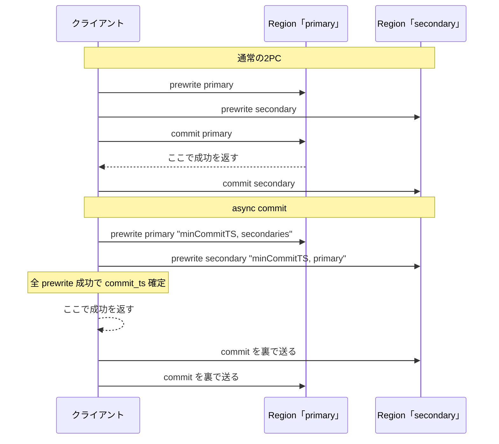
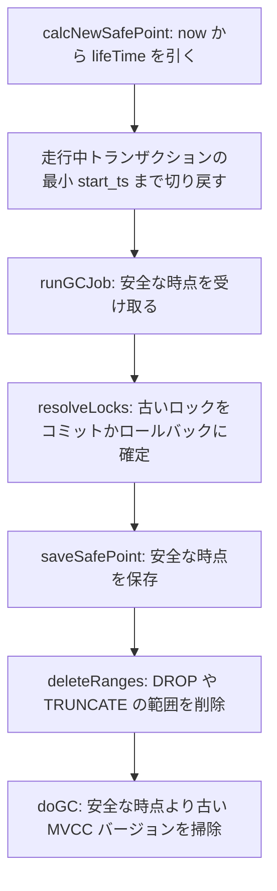

# 第19章 async commit、1PC、GC

> **本章で読むソース**
>
> - [`pkg/sessiontxn/isolation/base.go`](https://github.com/pingcap/tidb/blob/v8.5.6/pkg/sessiontxn/isolation/base.go)
> - [`pkg/kv/option.go`](https://github.com/pingcap/tidb/blob/v8.5.6/pkg/kv/option.go)
> - [`pkg/store/mockstore/unistore/tikv/mvcc.go`](https://github.com/pingcap/tidb/blob/v8.5.6/pkg/store/mockstore/unistore/tikv/mvcc.go)
> - [`pkg/store/mockstore/unistore/tikv/server.go`](https://github.com/pingcap/tidb/blob/v8.5.6/pkg/store/mockstore/unistore/tikv/server.go)
> - [`pkg/store/gcworker/gc_worker.go`](https://github.com/pingcap/tidb/blob/v8.5.6/pkg/store/gcworker/gc_worker.go)

## この章の狙い

第18章で読んだ Percolator の2PC は、コミットを2往復で構成する。
プリライトでロックを書き、続くコミットでプライマリのロックを書き込みに変え、その後でセカンダリのロックを片付ける。
クライアントへ成功を返せるのはプライマリのコミットが永続化された時点であり、ここまでに最短でも TSO の取得とプリライトとプライマリコミットの往復が要る。

本章では、この素朴な2PC を速くする2つの最適化を読む。
**async commit** は、セカンダリのロックが確定するのを待たずにクライアントへ成功を返す。
**1PC**（one-phase commit）は、1つの Region に収まる小さなトランザクションのプリライトとコミットを1回の RPC に畳む。
いずれも、トランザクションの状態をプライマリのロックだけから復元するという Percolator の前提を作り替えることで成り立つ。

加えて、MVCC が積み上げた古いバージョンと、コミットやロールバックが終わったあとに残るロックを掃除する **GC**（garbage collection）を読む。
GC が無ければ、上書きや削除のたびに古い行が残り続け、読み取りのコストとディスク使用量がともに膨らむ。

本番の実体はクライアント側の client-go と TiKV にあり、TiDB は session のコミットオプションを通じて async commit と 1PC の可否を伝える役割を担う。
機構そのものは、第18章と同じく、計算層に同梱された単体ストア **unistore**（`pkg/store/mockstore/unistore`）で読む。

## 前提

第17章のトランザクション調停（楽観、悲観、TSO）と、第18章の Percolator 2PC を unistore で読む内容を前提とする。
プリライト、プライマリ、セカンダリ、`commit_ts`、ロックの構造といった語はそこで導入したものを使う。
TSO とコミットの順序の保証は第17章で扱った。

## async commit と 1PC を TiDB が選ぶ

async commit と 1PC を実際に走らせるのはクライアント側のコミッタだが、その可否は TiDB が session 変数からトランザクションのオプションへ写し取る。
`baseTxnContextProvider` がトランザクションを活性化するときに、`EnableAsyncCommit` と `Enable1PC` を session 変数の値からそのまま設定する。

[`pkg/sessiontxn/isolation/base.go L479-L481`](https://github.com/pingcap/tidb/blob/v8.5.6/pkg/sessiontxn/isolation/base.go#L479-L481)

```go
	txn.SetOption(kv.CommitHook, func(info string, _ error) { sessVars.LastTxnInfo = info })
	txn.SetOption(kv.EnableAsyncCommit, sessVars.EnableAsyncCommit)
	txn.SetOption(kv.Enable1PC, sessVars.Enable1PC)
```

これらのオプションキーは `pkg/kv/option.go` の列挙にある。
`EnableAsyncCommit` と `Enable1PC` に並んで `GuaranteeLinearizability` が定義されている点が、後で効いてくる。

[`pkg/kv/option.go L58-L63`](https://github.com/pingcap/tidb/blob/v8.5.6/pkg/kv/option.go#L58-L63)

```go
	// EnableAsyncCommit indicates whether async commit is enabled
	EnableAsyncCommit
	// Enable1PC indicates whether one-phase commit is enabled
	Enable1PC
	// GuaranteeLinearizability indicates whether to guarantee linearizability at the cost of an extra tso request before prewrite
	GuaranteeLinearizability
```

`GuaranteeLinearizability` は、プリライト前に追加の TSO 取得を払ってでも線形化可能性を保つかどうかを表す。
同じ `SetOptionsOnTxnActive` の中で、自動コミットでない通常のトランザクションや、スナップショット読み取りのときに有効化される。

[`pkg/sessiontxn/isolation/base.go L504-L510`](https://github.com/pingcap/tidb/blob/v8.5.6/pkg/sessiontxn/isolation/base.go#L504-L510)

```go
		txn.SetOption(
			kv.GuaranteeLinearizability,
			!sessVars.IsAutocommit() ||
				sessVars.SnapshotTS > 0 ||
				p.enterNewTxnType == sessiontxn.EnterNewTxnDefault ||
				p.enterNewTxnType == sessiontxn.EnterNewTxnWithBeginStmt,
		)
```

なぜ線形化可能性が async commit と関わるのか。
async commit はクライアント側で `commit_ts` を決める設計のため、TSO が単調に進む保証だけでは外部からの観測順序が `commit_ts` の大小と一致しない場合がある。
TiDB はこの場合にプリライト前のもう1回の TSO 取得（`GuaranteeLinearizability`）を付けて観測順序を `commit_ts` に揃える。
ここまでが TiDB 側の制御であり、フラグを渡したあとの実際のプロトコルはクライアントと TiKV が担う。
本章では機構を unistore で追う。

## async commit のロックを unistore がどう書くか

async commit の核心は、各ロックに `commit_ts` を決める材料とセカンダリの一覧を載せることにある。
プリライトを処理する `prewriteMutations` は、`UseAsyncCommit` か `TryOnePc` のときだけ TSO を取りに行き、そこから `minCommitTS` を組み立てる。

[`pkg/store/mockstore/unistore/tikv/mvcc.go L942-L963`](https://github.com/pingcap/tidb/blob/v8.5.6/pkg/store/mockstore/unistore/tikv/mvcc.go#L942-L963)

```go
func (store *MVCCStore) prewriteMutations(reqCtx *requestCtx, mutations []*kvrpcpb.Mutation,
	req *kvrpcpb.PrewriteRequest, items []*badger.Item) error {
	var minCommitTS uint64
	if req.UseAsyncCommit || req.TryOnePc {
		// Get minCommitTS for async commit protocol. After all keys are locked in memory lock.
		physical, logical, tsErr := store.pdClient.GetTS(context.Background())
		if tsErr != nil {
			return tsErr
		}
		minCommitTS = uint64(physical)<<18 + uint64(logical)
		if req.MaxCommitTs > 0 && minCommitTS > req.MaxCommitTs {
			req.UseAsyncCommit = false
			req.TryOnePc = false
		}
		if req.UseAsyncCommit {
			reqCtx.asyncMinCommitTS = minCommitTS
		}
	}

	if req.UseAsyncCommit && minCommitTS > req.MinCommitTs {
		req.MinCommitTs = minCommitTS
	}
```

`minCommitTS` は、このトランザクションがコミットしてよい最小のタイムスタンプである。
プリライトを受け付けた各 Region がそれぞれ TSO から `minCommitTS` を取り、リクエストの `MinCommitTs` を押し上げる。
最終的な `commit_ts` は、全 Region が返した `minCommitTS` の最大値以上にクライアントが決める。
`MaxCommitTs` を超える `minCommitTS` になった場合は async commit と 1PC を諦めて通常の2PC に落ちる。
このフォールバックがあるため、async commit は「できるときに速い」最適化であって、適用を必ず保証するものではない。

プリライトのロックを組み立てる `buildPrewriteLock` は、`UseAsyncCommit` とセカンダリの数とその一覧をロックへ書き込む。

[`pkg/store/mockstore/unistore/tikv/mvcc.go L1141-L1155`](https://github.com/pingcap/tidb/blob/v8.5.6/pkg/store/mockstore/unistore/tikv/mvcc.go#L1141-L1155)

```go
func (store *MVCCStore) buildPrewriteLock(reqCtx *requestCtx, m *kvrpcpb.Mutation, item *badger.Item,
	req *kvrpcpb.PrewriteRequest) (*mvcc.Lock, error) {
	lock := &mvcc.Lock{
		LockHdr: mvcc.LockHdr{
			StartTS:        req.StartVersion,
			TTL:            uint32(req.LockTtl),
			PrimaryLen:     uint16(len(req.PrimaryLock)),
			MinCommitTS:    req.MinCommitTs,
			UseAsyncCommit: req.UseAsyncCommit,
			SecondaryNum:   uint32(len(req.Secondaries)),
		},
		Primary:     req.PrimaryLock,
		Value:       m.Value,
		Secondaries: req.Secondaries,
	}
```

通常の Percolator では、セカンダリのロックはプライマリの位置だけを指す。
トランザクションがコミット済みかどうかは、プライマリのロックが書き込みに変わったか否かを見て判定する。
これに対し async commit のロックは、`MinCommitTS` とセカンダリの一覧（`Secondaries`）を自分の中に持つ。
この差が、後述するプライマリを待たない状態復元を可能にする。

## CheckSecondaryLocks がセカンダリから状態を復元する

async commit が他のトランザクションへ与える代償は、状態の判定が複雑になることである。
通常の2PC なら、ロックに出会った側はプライマリを1つ調べればトランザクションがコミット済みかどうかを決められる。
async commit ではプライマリの存在に依存しない判定が要るため、セカンダリ群を直接問い合わせる `CheckSecondaryLocks` という RPC が用意されている。

unistore の `MVCCStore` がこの RPC を実装する。
渡されたセカンダリのキー群について、ロックが残っていれば集めて返し、ロックが無ければ書き込みを調べてコミット済みかどうかを判定する。

[`pkg/store/mockstore/unistore/tikv/mvcc.go L596-L640`](https://github.com/pingcap/tidb/blob/v8.5.6/pkg/store/mockstore/unistore/tikv/mvcc.go#L596-L640)

```go
// CheckSecondaryLocks implements the MVCCStore interface.
func (store *MVCCStore) CheckSecondaryLocks(reqCtx *requestCtx, keys [][]byte, startTS uint64) (SecondaryLocksStatus, error) {
	sortKeys(keys)
	hashVals := keysToHashVals(keys...)
	log.S().Debugf("%d check secondary %v", startTS, hashVals)
	regCtx := reqCtx.regCtx
	regCtx.AcquireLatches(hashVals)
	defer regCtx.ReleaseLatches(hashVals)

	batch := store.dbWriter.NewWriteBatch(startTS, 0, reqCtx.rpcCtx)
	locks := make([]*kvrpcpb.LockInfo, 0, len(keys))
	for i, key := range keys {
		lock := store.getLock(reqCtx, key)
		if !(lock != nil && lock.StartTS == startTS) {
			commitTS, err := store.checkCommitted(reqCtx.getDBReader(), key, startTS)
			if err != nil {
				return SecondaryLocksStatus{}, err
			}
			if commitTS > 0 {
				return SecondaryLocksStatus{commitTS: commitTS}, nil
			}
			status := store.checkExtraTxnStatus(reqCtx, key, startTS)
			if status.isOpLockCommitted() {
				return SecondaryLocksStatus{commitTS: status.commitTS}, nil
			}
			if !status.isRollback {
				batch.Rollback(key, false)
				err = store.dbWriter.Write(batch)
			}
			return SecondaryLocksStatus{commitTS: 0}, err
		}
		if lock.Op == uint8(kvrpcpb.Op_PessimisticLock) {
			batch.Rollback(key, true)
			err := store.dbWriter.Write(batch)
			if err != nil {
				return SecondaryLocksStatus{}, err
			}
			store.lockWaiterManager.WakeUp(startTS, 0, []uint64{hashVals[i]})
			store.DeadlockDetectCli.CleanUp(startTS)
			return SecondaryLocksStatus{commitTS: 0}, nil
		}
		locks = append(locks, lock.ToLockInfo(key))
	}
	return SecondaryLocksStatus{locks: locks}, nil
}
```

判定の分岐は3つある。
あるキーで `startTS` のロックが見つからないときは、すでに書き込みになったかを `checkCommitted` で調べ、コミット済みなら `commitTS` を返す（L610-L616）。
コミットでもロールバックでもなければ、その場でロールバックを書いてこのトランザクションを止める（L621-L625）。
すべてのキーで `startTS` のロックが残っていれば、それを `locks` に集めて返す（L637-L639）。

呼び出し口はサーバの `KvCheckSecondaryLocks` ハンドラで、`MVCCStore.CheckSecondaryLocks` の結果をそのまま `Locks` と `CommitTs` に詰めて応答する。

[`pkg/store/mockstore/unistore/tikv/server.go L386-L405`](https://github.com/pingcap/tidb/blob/v8.5.6/pkg/store/mockstore/unistore/tikv/server.go#L386-L405)

```go
// KvCheckSecondaryLocks implements the tikvpb.TikvServer interface.
func (svr *Server) KvCheckSecondaryLocks(ctx context.Context, req *kvrpcpb.CheckSecondaryLocksRequest) (*kvrpcpb.CheckSecondaryLocksResponse, error) {
	reqCtx, err := newRequestCtx(svr, req.Context, "KvCheckSecondaryLocks")
	if err != nil {
		return &kvrpcpb.CheckSecondaryLocksResponse{Error: convertToKeyError(err)}, nil
	}
	defer reqCtx.finish()
	if reqCtx.regErr != nil {
		return &kvrpcpb.CheckSecondaryLocksResponse{RegionError: reqCtx.regErr}, nil
	}
	locksStatus, err := svr.mvccStore.CheckSecondaryLocks(reqCtx, req.Keys, req.StartVersion)
	resp := &kvrpcpb.CheckSecondaryLocksResponse{}
	if err == nil {
		resp.Locks = locksStatus.locks
		resp.CommitTs = locksStatus.commitTS
	} else {
		resp.Error, resp.RegionError = convertToPBError(err)
	}
	return resp, nil
}
```

このハンドラがあることで、ロック衝突に出会ったトランザクションは、衝突相手のセカンダリ群へ `CheckSecondaryLocks` を投げて状態を解決できる。
すべてのセカンダリが `startTS` のロックを保持していれば、コミットに必要なロックが揃っていることが分かるので、各ロックの `MinCommitTS` の最大値から `commit_ts` を導いてコミットへ進められる。
プライマリのロックを介さずに、セカンダリ群だけからトランザクションの帰結を復元できる。

## 高速化の機構：commit_ts を全ロックに載せ、プライマリを待たずに返す

ここまでの部品を、レイテンシの観点でまとめる。

通常の2PC は、プライマリのコミットが永続化された時点で初めてクライアントへ成功を返せる。
コミット段階はプライマリへの往復を必ず1回挟む。
async commit は、プリライト時に各ロックへ `commit_ts` を決める材料（`MinCommitTS`）とセカンダリ一覧（`Secondaries`）を載せておくことで、この前提を作り替える。
全キーのプリライトが成功した時点で、`commit_ts` は各 Region の `minCommitTS` の最大値として確定でき、コミットに必要な情報はすべてロックの中にある。
だからプライマリやセカンダリのロックを書き込みへ変える後処理を待たずに、クライアントへ成功を返せる。
セカンダリの片付けは応答の裏で進められ、もし途中で誰かがロックに出会っても `CheckSecondaryLocks` で状態を復元できる。

機構を一文で言えば、async commit は `commit_ts` をプライマリ1点ではなく全ロックに分散して持たせ、状態復元の単一障害点をなくすことで、コミットの1往復を応答経路から外す。
1PC はさらに踏み込み、1つの Region に収まるトランザクションではプリライトとコミットを1回の RPC に畳む。
unistore の `tryOnePC` は、`minCommitTS` を `commit_ts` として書き込みバッチを組み、プリライトのロックを作りつつ即座にコミットまで書く。

[`pkg/store/mockstore/unistore/tikv/mvcc.go L1092-L1114`](https://github.com/pingcap/tidb/blob/v8.5.6/pkg/store/mockstore/unistore/tikv/mvcc.go#L1092-L1114)

```go
	reqCtx.onePCCommitTS = minCommitTS
	store.updateLatestTS(minCommitTS)
	batch := store.dbWriter.NewWriteBatch(req.StartVersion, minCommitTS, reqCtx.rpcCtx)

	for i, m := range mutations {
		if m.Op == kvrpcpb.Op_CheckNotExists {
			continue
		}
		lock, err1 := store.buildPrewriteLock(reqCtx, m, items[i], req)
		if err1 != nil {
			return false, err1
		}
		// batch.Commit will panic if the key is not locked. So there need to be a special function
		// for it to commit without deleting lock.
		batch.Commit(m.Key, lock)
	}

	if err := store.dbWriter.Write(batch); err != nil {
		return false, err
	}

	return true, nil
}
```

1PC は単一 Region に閉じるため、そもそもセカンダリが存在しない。
ロックを書いてからコミットに変えるのではなく、最初から `commit_ts` 付きの書き込みとして1回で永続化する。
プリライト側の入口（前掲 `prewriteMutations` の L965-L973）で `tryOnePC` が成功すれば、その場で処理を終える。
適用できるのは1つの Region に収まるトランザクションに限られるが、収まるなら往復が1回で済む。

下の図は、通常の2PC と async commit のレイテンシ差を表す。



## GC が掃除する対象と入口

async commit と 1PC が速くする一方で、コミットの積み重ねは古い MVCC バージョンを溜めていく。
GC は2種類のごみを掃除する。
1つは、安全な過去（GC safe point）より古い MVCC バージョンで、もう読まれない上書き前の値や削除済みの行が該当する。
もう1つは、コミットやロールバックの解決が済まずに取り残されたロックである。

GC の入口は `runGCJob` で、安全な時点 `safePoint` を受け取り、解決と掃除を順に走らせる。

[`pkg/store/gcworker/gc_worker.go L742-L807`](https://github.com/pingcap/tidb/blob/v8.5.6/pkg/store/gcworker/gc_worker.go#L742-L807)

```go
func (w *GCWorker) runGCJob(ctx context.Context, safePoint uint64, concurrency gcConcurrency) error {
	failpoint.Inject("mockRunGCJobFail", func() {
		failpoint.Return(errors.New("mock failure of runGCJoB"))
	})
	metrics.GCWorkerCounter.WithLabelValues("run_job").Inc()

	err := w.resolveLocks(ctx, safePoint, concurrency.v)
	if err != nil {
		// ... (中略) ...
		return errors.Trace(err)
	}

	// Save safe point to pd.
	err = w.saveSafePoint(w.tikvStore.GetSafePointKV(), safePoint)
	if err != nil {
		// ... (中略) ...
		return errors.Trace(err)
	}
	// Sleep to wait for all other tidb instances update their safepoint cache.
	time.Sleep(gcSafePointCacheInterval)

	err = w.deleteRanges(ctx, safePoint, concurrency)
	if err != nil {
		// ... (中略) ...
		return errors.Trace(err)
	}
	err = w.redoDeleteRanges(ctx, safePoint, concurrency)
	if err != nil {
		// ... (中略) ...
		return errors.Trace(err)
	}

	if w.checkUseDistributedGC() {
		err = w.uploadSafePointToPD(ctx, safePoint)
		if err != nil {
			// ... (中略) ...
			return errors.Trace(err)
		}
	} else {
		err = w.doGC(ctx, safePoint, concurrency.v)
		if err != nil {
			// ... (中略) ...
			return errors.Trace(err)
		}
	}

	return nil
}
```

順序が重要である。
最初に `resolveLocks` でロックを解決し、その後で安全な時点を PD へ保存し、`deleteRanges` で範囲削除を片付け、最後に `doGC`（分散 GC のときは `uploadSafePointToPD`）で古いバージョンを掃除する。
ロックの解決を先に置くのは、安全な時点より前にプリライトされたまま宙に浮いたトランザクションを確定させてから、古いバージョンを消すためである。
途中の `time.Sleep(gcSafePointCacheInterval)` は、他の TiDB インスタンスが安全な時点のキャッシュを更新するのを待つ。

## GC safe point の決め方

GC が消してよいのは、もう誰も読まないバージョンに限る。
その境目が **GC safe point** で、`calcNewSafePoint` が現在時刻から GC の保持期間 `lifeTime` を引いて求める。

[`pkg/store/gcworker/gc_worker.go L677-L715`](https://github.com/pingcap/tidb/blob/v8.5.6/pkg/store/gcworker/gc_worker.go#L677-L715)

```go
func (w *GCWorker) calcNewSafePoint(ctx context.Context, now time.Time) (*time.Time, uint64, error) {
	lifeTime, err := w.loadDurationWithDefault(gcLifeTimeKey, gcDefaultLifeTime)
	if err != nil {
		return nil, 0, errors.Trace(err)
	}
	*lifeTime, err = w.validateGCLifeTime(*lifeTime)
	if err != nil {
		return nil, 0, err
	}
	metrics.GCConfigGauge.WithLabelValues(gcLifeTimeKey).Set(lifeTime.Seconds())

	lastSafePoint, err := w.loadTime(gcSafePointKey)
	if err != nil {
		return nil, 0, errors.Trace(err)
	}

	safePointValue := w.calcSafePointByMinStartTS(ctx, oracle.GoTimeToTS(now.Add(-*lifeTime)))
	safePointValue, err = w.setGCWorkerServiceSafePoint(ctx, safePointValue)
	if err != nil {
		return nil, 0, errors.Trace(err)
	}

	// safepoint is recorded in time.Time format which strips the logical part of the timestamp.
	// To prevent the GC worker from keeping working due to the loss of logical part when the
	// safe point isn't changed, we should compare them in time.Time format.
	safePoint := oracle.GetTimeFromTS(safePointValue)
	// We should never decrease safePoint.
	if lastSafePoint != nil && !safePoint.After(*lastSafePoint) {
		// ... (中略) ...
		return nil, 0, nil
	}
	return &safePoint, safePointValue, nil
}
```

求め方は3段である。
まず現在時刻から `lifeTime`（既定で10分）を引いた時刻を起点にする。
次に `calcSafePointByMinStartTS` で、走行中のトランザクションが持つ最小の `start_ts` より後ろへは進めないように切り戻す。
これにより、まだ読み取り中のトランザクションが見ているバージョンを消さずに済む。
最後に `setGCWorkerServiceSafePoint` で PD のサービス safe point と突き合わせ、他サービスが必要とする時点より後ろへは進めない。
得た安全な時点が前回より進まないなら GC をしない（`safePoint.After` の判定）。

## ロックの解決と範囲削除

`resolveLocks` は、安全な時点より前のロックをクラスタ全域で解決する。
Region ごとに `ResolveLocksForRange` を走らせ、見つけたロックのプライマリを調べてコミットかロールバックを確定させる。

[`pkg/store/gcworker/gc_worker.go L1207-L1217`](https://github.com/pingcap/tidb/blob/v8.5.6/pkg/store/gcworker/gc_worker.go#L1207-L1217)

```go
	handler := func(ctx context.Context, r tikvstore.KeyRange) (rangetask.TaskStat, error) {
		scanLimit := uint32(tikv.GCScanLockLimit)
		failpoint.Inject("lowScanLockLimit", func() {
			scanLimit = 3
		})
		return tikv.ResolveLocksForRange(ctx, w.regionLockResolver, safePoint, r.StartKey, r.EndKey, tikv.NewGcResolveLockMaxBackoffer, scanLimit)
	}

	runner := rangetask.NewRangeTaskRunner("resolve-locks-runner", w.tikvStore, concurrency, handler)
	// Run resolve lock on the whole TiKV cluster. Empty keys means the range is unbounded.
	err := runner.RunOnRange(ctx, []byte(""), []byte(""))
```

範囲削除 `deleteRanges` は、`DROP TABLE` や `TRUNCATE` のように大きな範囲をまとめて消す操作のために積まれた記録を片付ける。
`gc_delete_range` テーブルから安全な時点より前の範囲を読み、Region ごとに削除を投げる。

[`pkg/store/gcworker/gc_worker.go L809-L823`](https://github.com/pingcap/tidb/blob/v8.5.6/pkg/store/gcworker/gc_worker.go#L809-L823)

```go
// deleteRanges processes all delete range records whose ts < safePoint in table `gc_delete_range`
// `concurrency` specifies the concurrency to send NotifyDeleteRange.
func (w *GCWorker) deleteRanges(
	ctx context.Context,
	safePoint uint64,
	concurrency gcConcurrency,
) error {
	metrics.GCWorkerCounter.WithLabelValues("delete_range").Inc()

	s := createSession(w.store)
	defer s.Close()
	ranges, err := util.LoadDeleteRanges(ctx, s, safePoint)
	if err != nil {
		return errors.Trace(err)
	}
```

最後に古いバージョンそのものを掃除するのが `doGC` で、クラスタ全域を Region ごとに分けて `doGCForRange` を並行に走らせる。

[`pkg/store/gcworker/gc_worker.go L1345-L1361`](https://github.com/pingcap/tidb/blob/v8.5.6/pkg/store/gcworker/gc_worker.go#L1345-L1361)

```go
func (w *GCWorker) doGC(ctx context.Context, safePoint uint64, concurrency int) error {
	metrics.GCWorkerCounter.WithLabelValues("do_gc").Inc()
	logutil.Logger(ctx).Info("start doing gc for all keys", zap.String("category", "gc worker"),
		zap.String("uuid", w.uuid),
		zap.Int("concurrency", concurrency),
		zap.Uint64("safePoint", safePoint))
	startTime := time.Now()

	runner := rangetask.NewRangeTaskRunner(
		"gc-runner",
		w.tikvStore,
		concurrency,
		func(ctx context.Context, r tikvstore.KeyRange) (rangetask.TaskStat, error) {
			return w.doGCForRange(ctx, r.StartKey, r.EndKey, safePoint)
		})

	err := runner.RunOnRange(ctx, []byte(""), []byte(""))
```

`RunOnRange` に空のキー範囲を渡すのは、クラスタ全域を対象にするためである。
範囲を Region 単位に割り、`concurrency` 本の並行度で掃除を進める。
実際にどの書き込みを残しどれを消すかの判定は、各 Region の TiKV が安全な時点を受けて行う。

GC が掃除する流れは下の図のとおりである。



## まとめ

async commit は、プリライト時に各ロックへ `commit_ts` の材料とセカンダリ一覧を載せることで、コミットの1往復を応答経路から外す。
プライマリ1点に頼らずセカンダリ群から状態を復元できるよう、`CheckSecondaryLocks` がセカンダリのロックを直接調べてコミットかロールバックを判定する。
1PC は単一 Region のトランザクションでプリライトとコミットを1回の書き込みに畳む。
いずれも `MaxCommitTs` を超えると通常の2PC へ落ちるため、適用できるときに速くなる最適化である。

TiDB はこれらを session 変数からトランザクションのオプション（`EnableAsyncCommit`、`Enable1PC`、`GuaranteeLinearizability`）へ写し取り、可否をクライアント側へ伝える。

GC は、走行中トランザクションの最小 `start_ts` を尊重して GC safe point を定め、古いロックの解決、範囲削除、古い MVCC バージョンの掃除をこの順に走らせる。
ロックの解決を先に置くことで、宙に浮いたトランザクションを確定させてから古いバージョンを消す。

## 関連する章

- [第17章 トランザクション調停（楽観、悲観、TSO）](17-transaction-coordination.md)：TSO とコミットの順序、楽観と悲観のロックを扱う。
- [第18章 Percolator 2PC を unistore で読む](18-percolator-2pc-unistore.md)：本章が速くする素朴な2PC の構造を扱う。
- 本番のコミッタは client-go、ロックの永続化と GC の実体は TiKV にあり、本章は unistore で機構を読んだ。
