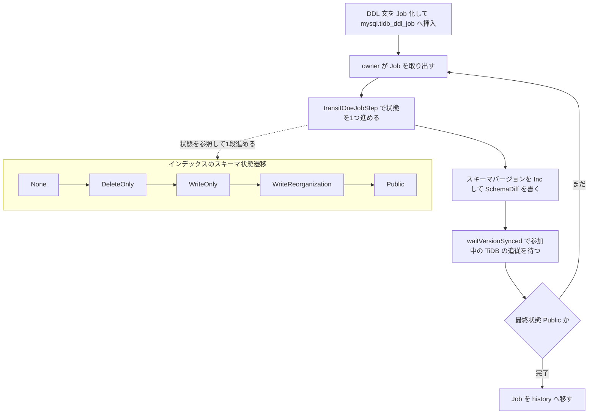

# 第20章 非同期オンライン DDL

> **本章で読むソース**
>
> - [`pkg/ddl/executor.go`](https://github.com/pingcap/tidb/blob/v8.5.6/pkg/ddl/executor.go)
> - [`pkg/ddl/job_submitter.go`](https://github.com/pingcap/tidb/blob/v8.5.6/pkg/ddl/job_submitter.go)
> - [`pkg/ddl/job_scheduler.go`](https://github.com/pingcap/tidb/blob/v8.5.6/pkg/ddl/job_scheduler.go)
> - [`pkg/ddl/job_worker.go`](https://github.com/pingcap/tidb/blob/v8.5.6/pkg/ddl/job_worker.go)
> - [`pkg/ddl/schema_version.go`](https://github.com/pingcap/tidb/blob/v8.5.6/pkg/ddl/schema_version.go)
> - [`pkg/ddl/index.go`](https://github.com/pingcap/tidb/blob/v8.5.6/pkg/ddl/index.go)
> - [`pkg/meta/model/job.go`](https://github.com/pingcap/tidb/blob/v8.5.6/pkg/meta/model/job.go)

## この章の狙い

TiDB は複数のノードが1つのテーブルを共有して読み書きする分散データベースである。
そこで `CREATE INDEX` や `ADD COLUMN` のようにテーブルの定義を変える **DDL** を実行するとき、素朴にスキーマを書き換えただけでは問題が起きる。
あるノードが新しいスキーマを見ているとき、別のノードはまだ古いスキーマで読み書きしているからである。
新しいインデックスがあると思って書き込むノードと、そのインデックスを知らずに行だけを書き換えるノードが混在すると、インデックスと行の整合が崩れる。

本章では、読み書きを止めずにスキーマを変える **非同期オンライン DDL** の仕組みを読む。
要点は2つである。
1つは、DDL を1つの **ジョブ**にしてキューに積み、クラスタで1ノードだけが担う **owner** がそれを順に実行する点である。
もう1つは、スキーマの変更を `None → DeleteOnly → WriteOnly → WriteReorganization → Public` という多段階の **スキーマ状態**に分解し、参加中の TiDB が隣り合う2つの状態にしか同時に存在しないことを保証しながら一段ずつ進める点である。
この段階分けは Google の F1 が示した手法[^f1]に基づく。

代表例として `CREATE INDEX`（`ADD INDEX`）の状態遷移を1つたどる。
インデックスの中身を埋めるバックフィルの実装は第21章へ、スキーマ変更を参加中の TiDB へ伝えるリースと domain の仕組みは第22章へ譲る。

## 前提

第15章で読んだ行とインデックスの KV エンコードを前提とする。
インデックスが行とは別の KV として書かれるため、両者を一貫させる必要があるという点が本章の動機になる。
DDL のジョブは内部テーブル `mysql.tidb_ddl_job` に格納される。
このテーブルへの読み書き自体が TiDB のトランザクションであり、第17章から第19章で読んだトランザクション機構の上に DDL が乗っている。

## DDL 文をジョブにしてキューへ積む

ユーザーが発行した DDL 文は、まず `executor` の `DoDDLJob` で1つの `model.Job` に詰められる。
`DoDDLJobWrapper` がジョブをキューへ送り、その完了をスリープして待つ。

[`pkg/ddl/executor.go L6757-L6782`](https://github.com/pingcap/tidb/blob/v8.5.6/pkg/ddl/executor.go#L6757-L6782)

```go
func (e *executor) DoDDLJob(ctx sessionctx.Context, job *model.Job) error {
	return e.DoDDLJobWrapper(ctx, NewJobWrapper(job, false))
}

func (e *executor) doDDLJob2(ctx sessionctx.Context, job *model.Job, args model.JobArgs) error {
	return e.DoDDLJobWrapper(ctx, NewJobWrapperWithArgs(job, args, false))
}

// DoDDLJobWrapper submit DDL job and wait it finishes.
// When fast create is enabled, we might merge multiple jobs into one, so do not
// depend on job.ID, use JobID from jobSubmitResult.
func (e *executor) DoDDLJobWrapper(ctx sessionctx.Context, jobW *JobWrapper) (resErr error) {
	job := jobW.Job
	job.TraceInfo = &model.TraceInfo{
		ConnectionID: ctx.GetSessionVars().ConnectionID,
		SessionAlias: ctx.GetSessionVars().SessionAlias,
	}
	if mci := ctx.GetSessionVars().StmtCtx.MultiSchemaInfo; mci != nil {
		// In multiple schema change, we don't run the job.
		// Instead, we merge all the jobs into one pending job.
		return appendToSubJobs(mci, jobW)
	}
	e.checkInvolvingSchemaInfoInTest(job)
	// Get a global job ID and put the DDL job in the queue.
	setDDLJobQuery(ctx, job)
	e.deliverJobTask(jobW)
```

同じ関数の少し下に、ジョブが進む状態の順序を述べたコメントがある。
DDL のライフサイクルそのものを言葉にしている。

[`pkg/ddl/executor.go L6844-L6846`](https://github.com/pingcap/tidb/blob/v8.5.6/pkg/ddl/executor.go#L6844-L6846)

```go
	// For a job from start to end, the state of it will be none -> delete only -> write only -> reorganization -> public
	// For every state changes, we will wait as lease 2 * lease time, so here the ticker check is 10 * lease.
	// But we use etcd to speed up, normally it takes less than 0.5s now, so we use 0.5s or 1s or 3s as the max value.
```

ジョブを実際にキューへ書き込むのは `JobSubmitter` である。
`addBatchDDLJobs2Table` がジョブをトランザクションの中で内部テーブルへ挿入する。
ジョブの状態を `queueing` にしてから、`GenGIDAndInsertJobsWithRetry` で `mysql.tidb_ddl_job` へ書き込む。

[`pkg/ddl/job_submitter.go L337-L353`](https://github.com/pingcap/tidb/blob/v8.5.6/pkg/ddl/job_submitter.go#L337-L353)

```go
		setJobStateToQueueing(job)

		if s.serverStateSyncer.IsUpgradingState() && !hasSysDB(job) {
			if err = pauseRunningJob(job, model.AdminCommandBySystem); err != nil {
				logutil.DDLUpgradingLogger().Warn("pause user DDL by system failed", zap.Stringer("job", job), zap.Error(err))
				jobW.cacheErr = err
				continue
			}
			logutil.DDLUpgradingLogger().Info("pause user DDL by system successful", zap.Stringer("job", job))
		}
	}

	se.GetSessionVars().SetDiskFullOpt(kvrpcpb.DiskFullOpt_AllowedOnAlmostFull)
	ddlSe := sess.NewSession(se)
	if err = s.GenGIDAndInsertJobsWithRetry(ctx, ddlSe, jobWs); err != nil {
		return errors.Trace(err)
	}
```

ジョブがテーブルに永続化されたことで、DDL を発行したノードが落ちても、ジョブはクラスタに残って実行される。
発行したノードは実行者ではなく、ジョブの依頼者にすぎない。

## owner だけがジョブを取り出して回す

ジョブを実行するのは、クラスタで1ノードだけが担う owner である。
owner の選出は etcd を使うリーダー選挙で行い、選ばれたノードで `jobScheduler` が起動する。
このスケジューラは owner でのみ動くことが型のコメントに明記されている。

[`pkg/ddl/job_scheduler.go L133-L137`](https://github.com/pingcap/tidb/blob/v8.5.6/pkg/ddl/job_scheduler.go#L133-L137)

```go
// jobScheduler is used to schedule the DDL jobs, it's only run on the DDL owner.
type jobScheduler struct {
	// schCtx is valid only when this node is DDL owner. *ddlCtx already have context
	// named as "ctx", so we use "schCtx" here to avoid confusion.
	schCtx            context.Context
```

owner になったノードは `OnBecomeOwner` で `jobScheduler` を作って `start` する。
スケジューラの本体は `scheduleLoop` であり、その中の `schedule` が無限ループで通知やタイマーを待ち、`loadAndDeliverJobs` でジョブを取り出す。

[`pkg/ddl/job_scheduler.go L302-L335`](https://github.com/pingcap/tidb/blob/v8.5.6/pkg/ddl/job_scheduler.go#L302-L335)

```go
	for {
		if err := s.schCtx.Err(); err != nil {
			return err
		}
		failpoint.Inject("ownerResignAfterDispatchLoopCheck", func() {
			if ingest.ResignOwnerForTest.Load() {
				err2 := s.ownerManager.ResignOwner(context.Background())
				if err2 != nil {
					logutil.DDLLogger().Info("resign meet error", zap.Error(err2))
				}
				ingest.ResignOwnerForTest.Store(false)
			}
		})
		select {
		case <-s.ddlJobNotifyCh:
		case <-ticker.C:
		case _, ok := <-notifyDDLJobByEtcdCh:
			if !ok {
				logutil.DDLLogger().Warn("start worker watch channel closed", zap.String("watch key", addingDDLJobNotifyKey))
				notifyDDLJobByEtcdCh = s.etcdCli.Watch(s.schCtx, addingDDLJobNotifyKey)
				time.Sleep(time.Second)
				continue
			}
		case <-s.schCtx.Done():
			return s.schCtx.Err()
		}
		if err := s.checkAndUpdateClusterState(false); err != nil {
			continue
		}
		failpoint.InjectCall("beforeLoadAndDeliverJobs")
		if err := s.loadAndDeliverJobs(se); err != nil {
			logutil.SampleLogger().Warn("load and deliver jobs failed", zap.Error(err))
		}
	}
```

`loadAndDeliverJobs` は `mysql.tidb_ddl_job` を `select` してジョブを読み出す。
SQL を直接組み立てて、実行中のジョブを除いた残りを `job_id` 順に取得する。

[`pkg/ddl/job_scheduler.go L382-L391`](https://github.com/pingcap/tidb/blob/v8.5.6/pkg/ddl/job_scheduler.go#L382-L391)

```go
	const getJobSQL = `select reorg, job_meta from mysql.tidb_ddl_job where job_id >= %d %s order by job_id`
	var whereClause string
	if ids := s.runningJobs.allIDs(); len(ids) > 0 {
		whereClause = fmt.Sprintf("and job_id not in (%s)", ids)
	}
	sql := fmt.Sprintf(getJobSQL, s.minJobIDRefresher.GetCurrMinJobID(), whereClause)
	rows, err := se.Execute(context.Background(), sql, "load_ddl_jobs")
	if err != nil {
		return errors.Trace(err)
	}
```

取り出したジョブは `deliveryJob` でワーカーに渡る。
ワーカーは1つのジョブが終わるまで `transitOneJobStepAndWaitSync` を繰り返し呼ぶ。
1回の呼び出しがジョブの状態を1つだけ進め、その変更が参加中の TiDB へ行き渡るのを待つ。

[`pkg/ddl/job_scheduler.go L494-L500`](https://github.com/pingcap/tidb/blob/v8.5.6/pkg/ddl/job_scheduler.go#L494-L500)

```go
		for {
			err := s.transitOneJobStepAndWaitSync(wk, jobCtx, jobW)
			if err != nil {
				logutil.DDLLogger().Info("run job failed", zap.Error(err), zap.Stringer("job", jobW))
			} else if jobW.InFinalState() {
				return
			}
```

## 状態を1つ進めて、参加中の TiDB の同期を待つ

`transitOneJobStepAndWaitSync` が1ステップの中身である。
まず状態を進める前に、前回のバージョン同期が完了していなければここで待ち合わせる。
コメントにある「2-version invariant」が、この章の中心になる不変条件である。

[`pkg/ddl/job_scheduler.go L555-L585`](https://github.com/pingcap/tidb/blob/v8.5.6/pkg/ddl/job_scheduler.go#L555-L585)

```go
func (s *jobScheduler) transitOneJobStepAndWaitSync(wk *worker, jobCtx *jobContext, jobW *model.JobW) error {
	failpoint.InjectCall("beforeRunOneJobStep", jobW.Job)
	ownerID := s.ownerManager.ID()
	// suppose we failed to sync version last time, we need to check and sync it
	// before run to maintain the 2-version invariant.
	// if owner not change, we need try to sync when it's un-synced.
	// if owner changed, we need to try sync it if the job is not started by
	// current owner.
	job := jobW.Job
	if jobCtx.isUnSynced(job.ID) || (job.Started() && !jobCtx.maybeAlreadyRunOnce(job.ID)) {
		if variable.EnableMDL.Load() {
			version, err := s.sysTblMgr.GetMDLVer(s.schCtx, job.ID)
			if err == nil {
				err = waitVersionSynced(s.schCtx, jobCtx, job, version)
				if err != nil {
					return err
				}
				s.cleanMDLInfo(job, ownerID)
			} else if !goerrors.Is(err, systable.ErrNotFound) {
				jobCtx.logger.Warn("check MDL info failed", zap.Error(err))
				return err
			}
		} else {
			err := waitVersionSyncedWithoutMDL(s.schCtx, jobCtx, job)
			if err != nil {
				time.Sleep(time.Second)
				return err
			}
		}
		jobCtx.setAlreadyRunOnce(job.ID)
	}
```

待ち合わせのあと、`transitOneJobStep` がジョブを1状態だけ進めて新しいスキーマバージョンを返す。
最後に `updateGlobalVersionAndWaitSynced` で、そのバージョンを参加中の TiDB が取り込むのを待つ。

[`pkg/ddl/job_scheduler.go L587-L609`](https://github.com/pingcap/tidb/blob/v8.5.6/pkg/ddl/job_scheduler.go#L587-L609)

```go
	schemaVer, err := wk.transitOneJobStep(jobCtx, jobW)
	if err != nil {
		jobCtx.logger.Info("handle ddl job failed", zap.Error(err), zap.Stringer("job", job))
		return err
	}
	failpoint.Inject("mockDownBeforeUpdateGlobalVersion", func(val failpoint.Value) {
		if val.(bool) {
			if mockDDLErrOnce == 0 {
				mockDDLErrOnce = schemaVer
				failpoint.Return(errors.New("mock down before update global version"))
			}
		}
	})

	failpoint.InjectCall("beforeWaitSchemaChanged", job, schemaVer)
	// Here means the job enters another state (delete only, write only, public, etc...) or is cancelled.
	// If the job is done or still running or rolling back, we will wait 2 * lease time or util MDL synced to guarantee other servers to update
	// the newest schema.
	if err = updateGlobalVersionAndWaitSynced(s.schCtx, jobCtx, schemaVer, job); err != nil {
		return err
	}
	s.cleanMDLInfo(job, ownerID)
	jobCtx.removeUnSynced(job.ID)
```

`transitOneJobStep` はワーカー側の入口である。
ジョブのメタが他者に書き換えられていないかを楽観的トランザクションで確かめてから、`runOneJobStep` を呼んで具体的な処理に分岐させる。

[`pkg/ddl/job_worker.go L623-L627`](https://github.com/pingcap/tidb/blob/v8.5.6/pkg/ddl/job_worker.go#L623-L627)

```go
	failpoint.InjectCall("onJobRunBefore", job)

	// If running job meets error, we will save this error in job Error and retry
	// later if the job is not cancelled.
	schemaVer, updateRawArgs, runJobErr := w.runOneJobStep(jobCtx, job)
```

`runOneJobStep` は巨大な `switch` でジョブの種類ごとに処理を呼び分ける。
`ADD INDEX` は `onCreateIndex` に向かう。

[`pkg/ddl/job_worker.go L965-L968`](https://github.com/pingcap/tidb/blob/v8.5.6/pkg/ddl/job_worker.go#L965-L968)

```go
	case model.ActionAddIndex:
		ver, err = w.onCreateIndex(jobCtx, job, false)
	case model.ActionAddPrimaryKey:
		ver, err = w.onCreateIndex(jobCtx, job, true)
```

## スキーマ状態とスキーマバージョン

状態遷移の本体に入る前に、スキーマ状態の定義を見る。
列やインデックスといったスキーマ要素は、`SchemaState` という1バイトの列挙を持つ。
各状態が、その要素に対してどの操作を許すかを定義している。

[`pkg/meta/model/job.go L256-L268`](https://github.com/pingcap/tidb/blob/v8.5.6/pkg/meta/model/job.go#L256-L268)

```go
	// StateNone means this schema element is absent and can't be used.
	StateNone SchemaState = iota
	// StateDeleteOnly means we can only delete items for this schema element.
	StateDeleteOnly
	// StateWriteOnly means we can use any write operation on this schema element,
	// but outer can't read the changed data.
	StateWriteOnly
	// StateWriteReorganization means we are re-organizing whole data after write only state.
	StateWriteReorganization
	// StateDeleteReorganization means we are re-organizing whole data after delete only state.
	StateDeleteReorganization
	// StatePublic means this schema element is ok for all write and read operations.
	StatePublic
```

状態を1つ進めるたびに、スキーマバージョンを1つ上げる。
バージョンの採番は `setSchemaVersion` が握り、最終的に `GenSchemaVersion` がメタデータ上のカウンタを `Inc` で増やす。

[`pkg/meta/meta.go L513-L515`](https://github.com/pingcap/tidb/blob/v8.5.6/pkg/meta/meta.go#L513-L515)

```go
func (m *Mutator) GenSchemaVersion() (int64, error) {
	return m.txn.Inc(mSchemaVersionKey, 1)
}
```

バージョンを上げる側の `updateSchemaVersion` は、新しいバージョン番号とジョブの種類から `SchemaDiff` を作り、メタデータへ書き込む。
この差分が、各ノードがスキーマを差分更新するための手がかりになる。

[`pkg/ddl/schema_version.go L315-L324`](https://github.com/pingcap/tidb/blob/v8.5.6/pkg/ddl/schema_version.go#L315-L324)

```go
func updateSchemaVersion(jobCtx *jobContext, job *model.Job, multiInfos ...schemaIDAndTableInfo) (int64, error) {
	schemaVersion, err := jobCtx.setSchemaVersion(job)
	if err != nil {
		return 0, errors.Trace(err)
	}
	diff := &model.SchemaDiff{
		Version:  schemaVersion,
		Type:     job.Type,
		SchemaID: job.SchemaID,
	}
```

新しいバージョンを書いただけでは、まだ owner だけが新スキーマを知っている。
owner は `OwnerUpdateGlobalVersion` で最新バージョンを etcd へ公開し、`waitVersionSynced` で参加中の TiDB がそのバージョンに追いつくのを待つ。

[`pkg/ddl/job_worker.go L1132-L1145`](https://github.com/pingcap/tidb/blob/v8.5.6/pkg/ddl/job_worker.go#L1132-L1145)

```go
	err = jobCtx.schemaVerSyncer.OwnerUpdateGlobalVersion(ctx, latestSchemaVersion)
	if err != nil {
		logutil.DDLLogger().Info("update latest schema version failed", zap.Int64("ver", latestSchemaVersion), zap.Error(err))
		if variable.EnableMDL.Load() {
			return err
		}
		if terror.ErrorEqual(err, context.DeadlineExceeded) {
			// If err is context.DeadlineExceeded, it means waitTime(2 * lease) is elapsed. So all the schemas are synced by ticker.
			// There is no need to use etcd to sync. The function returns directly.
			return nil
		}
	}

	return waitVersionSynced(ctx, jobCtx, job, latestSchemaVersion)
```

`waitVersionSynced` は、隔離されたノードを除く全 TiDB がバージョンを同期したときにだけ戻る。
この待ち合わせがオンライン性の要であり、戻り値が返った時点で「参加中の TiDB が最新バージョン以上にいる」ことが保証される。

[`pkg/ddl/schema_version.go L385-L391`](https://github.com/pingcap/tidb/blob/v8.5.6/pkg/ddl/schema_version.go#L385-L391)

```go
	// WaitVersionSynced returns only when all TiDB schemas are synced(exclude the isolated TiDB).
	err = jobCtx.schemaVerSyncer.WaitVersionSynced(ctx, job.ID, latestSchemaVersion)
	if err != nil {
		logutil.DDLLogger().Info("wait latest schema version encounter error", zap.Int64("ver", latestSchemaVersion),
			zap.Int64("jobID", job.ID), zap.Duration("take time", time.Since(timeStart)), zap.Error(err))
		return err
	}
```

リースを使ったバージョンの追従と、その更新を参加中の TiDB が受け取る仕組みは第22章で扱う。
ここでは「1状態進めるごとに1バージョン上げ、参加中の TiDB の追従を待ってから次へ進む」という骨格を押さえれば足りる。

## CREATE INDEX の状態遷移をたどる

`onCreateIndex` が、インデックス作成の状態遷移を1つの関数にまとめている。
インデックスの現在の状態で `switch` し、1回の呼び出しで1段だけ進める。
進めた直後に `return` し、関数を抜ける。
owner は次のステップでこの関数を再び呼び、今度は1段先の `case` に入る。

最初の `case` は `None → DeleteOnly` である。
インデックスの定義をテーブルに加え、状態を `StateDeleteOnly` にして、バージョンとテーブル情報を書く。

[`pkg/ddl/index.go L1026-L1043`](https://github.com/pingcap/tidb/blob/v8.5.6/pkg/ddl/index.go#L1026-L1043)

```go
SwitchIndexState:
	switch allIndexInfos[0].State {
	case model.StateNone:
		// none -> delete only
		err = initForReorgIndexes(w, job, allIndexInfos)
		if err != nil {
			job.State = model.JobStateCancelled
			return ver, err
		}
		for _, indexInfo := range allIndexInfos {
			indexInfo.State = model.StateDeleteOnly
			moveAndUpdateHiddenColumnsToPublic(tblInfo, indexInfo)
		}
		ver, err = updateVersionAndTableInfoWithCheck(jobCtx, job, tblInfo, originalState != model.StateDeleteOnly)
		if err != nil {
			return ver, err
		}
		job.SchemaState = model.StateDeleteOnly
```

`DeleteOnly` のインデックスは、行を消すときにだけ対応するインデックスエントリも消す。
まだ書き込みの追加はしない。
この段の目的は、古いスキーマで動くノードが行だけを消したときに、新しいスキーマで動くノードがインデックスの掃除を引き受けられる状態を先に用意することである。

次の `case` は `DeleteOnly → WriteOnly` である。

[`pkg/ddl/index.go L1044-L1058`](https://github.com/pingcap/tidb/blob/v8.5.6/pkg/ddl/index.go#L1044-L1058)

```go
	case model.StateDeleteOnly:
		// delete only -> write only
		for _, indexInfo := range allIndexInfos {
			indexInfo.State = model.StateWriteOnly
			_, err = checkPrimaryKeyNotNull(jobCtx, w, job, tblInfo, indexInfo)
			if err != nil {
				break SwitchIndexState
			}
		}

		ver, err = updateVersionAndTableInfo(jobCtx, job, tblInfo, originalState != model.StateWriteOnly)
		if err != nil {
			return ver, err
		}
		job.SchemaState = model.StateWriteOnly
```

`WriteOnly` のインデックスは、挿入と削除と更新のすべてでインデックスエントリを保守する。
ただし読み取りにはまだ使わない。
書き込みだけを先に正しくしておくことで、このあとのバックフィルが「途中から書かれ続けるインデックス」を相手にできる。

3つめの `case` は `WriteOnly → WriteReorganization` である。
このあとに走る再編成のために `SnapshotVer` を初期化する。

[`pkg/ddl/index.go L1059-L1075`](https://github.com/pingcap/tidb/blob/v8.5.6/pkg/ddl/index.go#L1059-L1075)

```go
	case model.StateWriteOnly:
		// write only -> reorganization
		for _, indexInfo := range allIndexInfos {
			indexInfo.State = model.StateWriteReorganization
			_, err = checkPrimaryKeyNotNull(jobCtx, w, job, tblInfo, indexInfo)
			if err != nil {
				break SwitchIndexState
			}
		}

		ver, err = updateVersionAndTableInfo(jobCtx, job, tblInfo, originalState != model.StateWriteReorganization)
		if err != nil {
			return ver, err
		}
		// Initialize SnapshotVer to 0 for later reorganization check.
		job.SnapshotVer = 0
		job.SchemaState = model.StateWriteReorganization
```

最後の `case` は `WriteReorganization → Public` である。
ここで `doReorgWorkForCreateIndex` を呼び、既存の行を走査してインデックスエントリを埋めるバックフィルを実行する。
バックフィルが終わるまで `done` が偽のまま `return` し、owner は同じ状態でこの関数を繰り返し呼ぶ。

[`pkg/ddl/index.go L1076-L1090`](https://github.com/pingcap/tidb/blob/v8.5.6/pkg/ddl/index.go#L1076-L1090)

```go
	case model.StateWriteReorganization:
		// reorganization -> public
		tbl, err := getTable(jobCtx.getAutoIDRequirement(), schemaID, tblInfo)
		if err != nil {
			return ver, errors.Trace(err)
		}

		switch job.ReorgMeta.AnalyzeState {
		case model.AnalyzeStateNone:
			// reorg the index data.
			var done bool
			done, ver, err = doReorgWorkForCreateIndex(w, jobCtx, job, tbl, allIndexInfos)
			if !done {
				return ver, err
			}
```

バックフィルが完了すると、インデックスの状態を `StatePublic` に上げ、バージョンとテーブル情報を最後にもう一度書く。
ここで初めてインデックスが読み取りに使えるようになる。

[`pkg/ddl/index.go L1110-L1132`](https://github.com/pingcap/tidb/blob/v8.5.6/pkg/ddl/index.go#L1110-L1132)

```go
				indexInfo.State = model.StatePublic
			}

			// Inject the failpoint to prevent the progress of index creation.
			failpoint.Inject("create-index-stuck-before-public", func(v failpoint.Value) {
				if sigFile, ok := v.(string); ok {
					for {
						time.Sleep(1 * time.Second)
						if _, err := os.Stat(sigFile); err != nil {
							if os.IsNotExist(err) {
								continue
							}
							failpoint.Return(ver, errors.Trace(err))
						}
						break
					}
				}
			})

			ver, err = updateVersionAndTableInfo(jobCtx, job, tblInfo, originalState != model.StatePublic)
			if err != nil {
				return ver, errors.Trace(err)
			}
```

バックフィルの内部、つまり再編成ワーカーがどう既存行を分割して並列に走査し、書き込み中のインデックスとどう競合を避けるかは第21章で読む。

## なぜ段階を分けると不整合が起きないか

ここまでの工夫を1つにまとめると、隣り合う2つの状態しか、参加中の TiDB に同時に存在させない点に尽きる。
owner は1状態進めるたびにバージョンを上げ、`waitVersionSynced` で参加中の TiDB が追いつくのを待ってから次へ進む。
参加中の TiDB が追いついた時点でしか次へ進まないため、参加中の TiDB は最新の状態 `S` か、1つ前の状態 `S-1` のどちらかにしかいない。
これが先ほどの「2-version invariant」である。

この不変条件が、なぜ古いスキーマと新しいスキーマのノードが混在しても壊れないのかを説明する。
インデックス作成では、隣り合う状態が必ず重なり合う責務を持つように順序が組まれている。
`None` のノードはインデックスを一切知らないが、隣の `DeleteOnly` のノードは少なくとも削除を引き受ける。
だから `None` のノードが行を消しても、`DeleteOnly` のノードが同じ行のインデックスを消せる。
`DeleteOnly` と `WriteOnly` が混在する間は、片方が削除だけ、もう片方が削除と挿入の両方を保守する。
どちらの組み合わせでも、行に対応するインデックスエントリが取り残されることも、行のないインデックスエントリが残ることもない。

仮に `None` から `Public` へ一足飛びに変えたとすると、この重なりが消える。
インデックスを知らないノードが挿入した行にはインデックスエントリが付かず、それを `Public` のノードが読むとインデックス経由でその行を取りこぼす。
1段ずつ進め、各段で隣接2状態の責務を重ねることが、この取りこぼしを防いでいる。

加えて、バージョンの公開に etcd を使う点が速度を稼ぐ。
本来は最大で `2 * lease` のスリープで参加中の TiDB の追従を保証できるが、etcd の通知を併用することで、コメントにあるとおり通常は1状態あたり0.5秒未満で次へ進める。
正しさはリースの待ち時間が、速度は etcd の通知が担う二段構えになっている。



## まとめ

非同期オンライン DDL は、DDL 文を `mysql.tidb_ddl_job` に永続化したジョブへ変え、owner だけがそれを取り出して順に実行する。
owner はスキーマの変更を多段階の状態に分け、1状態進めるごとにスキーマバージョンを1つ上げ、参加中の TiDB がそのバージョンへ追従するのを待ってから次へ進む。
インデックス作成では `None → DeleteOnly → WriteOnly → WriteReorganization → Public` と進み、各段で隣接する2状態の責務を重ねることで、古いスキーマと新しいスキーマのノードが混在しても行とインデックスの整合が保たれる。
バックフィルの中身は第21章、リースによるバージョン追従と domain は第22章で読む。

## 関連する章

- [第15章 行とインデックスの KV エンコード](../part04-txn/15-kv-encoding.md)：インデックスが行とは別の KV になる仕組みであり、状態遷移が守る整合の対象である。
- [第21章 ADD INDEX のバックフィルと分散タスク](21-add-index-backfill.md)：`WriteReorganization → Public` で走るバックフィルの内部と分散タスク化を読む。
- [第22章 PD クライアントと domain](22-pd-client-and-domain.md)：スキーマバージョンをリースで参加中の TiDB へ追従させる仕組みと domain を読む。

[^f1]: 多段階の状態遷移でオンライン性を保つ手法は Google の F1 が示したもので、Ian Rae ほか「Online, Asynchronous Schema Change in F1」（VLDB 2013）に基づく。
