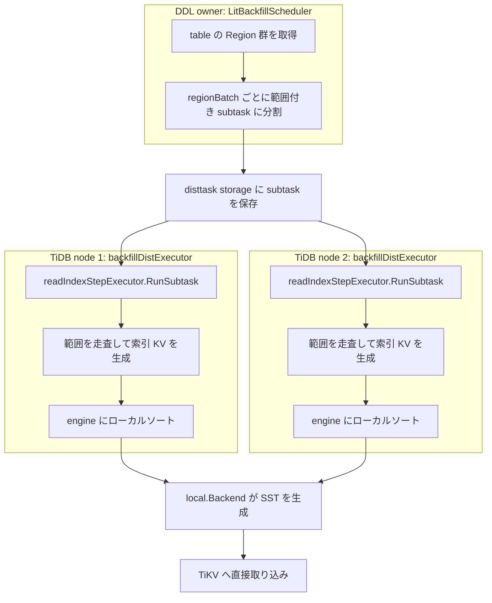

# 第21章 ADD INDEX のバックフィルと分散タスク

> **本章で読むソース**
>
> - [`pkg/ddl/backfilling.go`](https://github.com/pingcap/tidb/blob/v8.5.6/pkg/ddl/backfilling.go)
> - [`pkg/ddl/index.go`](https://github.com/pingcap/tidb/blob/v8.5.6/pkg/ddl/index.go)
> - [`pkg/ddl/ingest/engine.go`](https://github.com/pingcap/tidb/blob/v8.5.6/pkg/ddl/ingest/engine.go)
> - [`pkg/ddl/ingest/backend.go`](https://github.com/pingcap/tidb/blob/v8.5.6/pkg/ddl/ingest/backend.go)
> - [`pkg/ddl/backfilling_dist_scheduler.go`](https://github.com/pingcap/tidb/blob/v8.5.6/pkg/ddl/backfilling_dist_scheduler.go)
> - [`pkg/ddl/backfilling_dist_executor.go`](https://github.com/pingcap/tidb/blob/v8.5.6/pkg/ddl/backfilling_dist_executor.go)
> - [`pkg/ddl/backfilling_read_index.go`](https://github.com/pingcap/tidb/blob/v8.5.6/pkg/ddl/backfilling_read_index.go)
> - [`pkg/disttask/framework/proto/task.go`](https://github.com/pingcap/tidb/blob/v8.5.6/pkg/disttask/framework/proto/task.go)
> - [`pkg/disttask/framework/proto/step.go`](https://github.com/pingcap/tidb/blob/v8.5.6/pkg/disttask/framework/proto/step.go)
> - [`pkg/disttask/framework/scheduler/scheduler.go`](https://github.com/pingcap/tidb/blob/v8.5.6/pkg/disttask/framework/scheduler/scheduler.go)
> - [`pkg/disttask/framework/taskexecutor/interface.go`](https://github.com/pingcap/tidb/blob/v8.5.6/pkg/disttask/framework/taskexecutor/interface.go)

## この章の狙い

`ADD INDEX` の状態遷移は第20章で読んだ。
インデックスが `None → DeleteOnly → WriteOnly → WriteReorganization → Public` と進む途中、`WriteReorganization` の段で TiDB は既存の全行を走査し、それぞれに対応するインデックスエントリを作って書く。
この処理を**バックフィル**と呼ぶ。
状態遷移の枠組みそのものは軽いが、バックフィルは表の行数に比例した重い処理であり、巨大表では数時間に及ぶ。

本章はこのバックフィルの内部を読む。
1台の TiDB が表を **Region** 範囲に分割し、複数のワーカーで並列に走査する仕組みから始める。
次に、インデックス KV をトランザクション経由で書く既定の経路と、ローカルでソートして **SST** を作り TiKV へ直接取り込む**取り込みモード**（**ingest**）の違いを読む。
最後に、このバックフィルを複数の TiDB ノードへ分担する**分散タスク框架**（**disttask**）の連携を読む。
範囲分割と並列化、ソート済み SST の直接取り込みが、巨大表のインデックス作成をどう速くするかを範囲とする。

## 前提

第20章で、`onCreateIndex` がインデックス作成の状態遷移を1つの関数にまとめ、`WriteReorganization → Public` の `case` で `doReorgWorkForCreateIndex` を呼ぶところまで読んだ。
本章はその `doReorgWorkForCreateIndex` の先、つまり再編成ワーカーが既存行をどう分割して並列に走査し、インデックス KV をどう書くかを読む。

インデックスが行とは別の KV になる符号化は第15章で扱った。
バックフィルが最終的に作るのはこのインデックス KV であり、本章はその大量生成と書き込みの経路に集中する。
表を Region 範囲に分けるための Region 情報は PD から取るが、PD クライアントと domain は第22章で扱う。

## バックフィルが走る位置

`onCreateIndex` の `StateWriteReorganization` の `case` が、バックフィルの起点である。

[`pkg/ddl/index.go` L1076-L1089](https://github.com/pingcap/tidb/blob/v8.5.6/pkg/ddl/index.go#L1076-L1089)

```go
	case model.StateWriteReorganization:
		// reorganization -> public
		tbl, err := getTable(jobCtx.getAutoIDRequirement(), schemaID, tblInfo)
		if err != nil {
			return ver, errors.Trace(err)
		}

		switch job.ReorgMeta.AnalyzeState {
		case model.AnalyzeStateNone:
			// reorg the index data.
			var done bool
			done, ver, err = doReorgWorkForCreateIndex(w, jobCtx, job, tbl, allIndexInfos)
			if !done {
				return ver, err
```

`doReorgWorkForCreateIndex` が `done` を返さないあいだ、owner は同じ `StateWriteReorganization` のままこの関数を繰り返し呼ぶ。
バックフィルが途中で落ちても、次に呼ばれたときに途中から再開できる構造になっている。
再開の鍵となるチェックポイントは後段で読む。

## 経路の選択：txn と ingest

バックフィルには複数の方式がある。
どの方式を使うかを `pickBackfillType` が決める。

[`pkg/ddl/index.go` L1592-L1619](https://github.com/pingcap/tidb/blob/v8.5.6/pkg/ddl/index.go#L1592-L1619)

```go
func pickBackfillType(job *model.Job) (model.ReorgType, error) {
	if job.ReorgMeta.ReorgTp != model.ReorgTypeNone {
		// The backfill task has been started.
		// Don't change the backfill type.
		return job.ReorgMeta.ReorgTp, nil
	}
	if !job.ReorgMeta.IsFastReorg {
		job.ReorgMeta.ReorgTp = model.ReorgTypeTxn
		return model.ReorgTypeTxn, nil
	}
	if ingest.LitInitialized {
		if job.ReorgMeta.UseCloudStorage {
			job.ReorgMeta.ReorgTp = model.ReorgTypeIngest
			return model.ReorgTypeIngest, nil
		}
		if err := ingest.LitDiskRoot.PreCheckUsage(); err != nil {
			logutil.DDLIngestLogger().Info("ingest backfill is not available", zap.Error(err))
			return model.ReorgTypeNone, err
		}
		job.ReorgMeta.ReorgTp = model.ReorgTypeIngest
		return model.ReorgTypeIngest, nil
	}
	// The lightning environment is unavailable, but we can still use the txn-merge backfill.
	logutil.DDLLogger().Info("fallback to txn-merge backfill process",
		zap.Bool("lightning env initialized", ingest.LitInitialized))
	job.ReorgMeta.ReorgTp = model.ReorgTypeTxnMerge
	return model.ReorgTypeTxnMerge, nil
}
```

分岐は3通りである。
高速再編成が無効なら `ReorgTypeTxn` を選び、インデックス KV を通常のトランザクションで1件ずつ書く。
高速再編成が有効で ingest 環境（lightning 由来のローカルソート機構）が初期化済みなら `ReorgTypeIngest` を選ぶ。
ingest 環境が使えなければ `ReorgTypeTxnMerge` にフォールバックする。
一度決めた方式は、ジョブが途中から再開しても変えない（先頭の `ReorgTp != ReorgTypeNone` の分岐）。

`txn` 経路はインデックス KV を Percolator トランザクションで書くため、整合は2相コミットが保証するが、書き込みのたびにプリライトとコミットの往復が必要になる。
`ingest` 経路は KV を一度ローカル領域へためてソートし、Region 境界に合わせた SST を作って TiKV へ直接取り込む。
この経路の差が、巨大表でのインデックス作成時間を大きく分ける。

## 1台の中の並列：Region 範囲への分割

方式の違いの下に、共通の骨格がある。
表を Region 範囲に分け、各範囲を1つの**タスク**として複数のワーカーへ配る構造である。
バックフィルワーカーが満たすインターフェースは `backfiller` である。

[`pkg/ddl/backfilling.go` L258-L263](https://github.com/pingcap/tidb/blob/v8.5.6/pkg/ddl/backfilling.go#L258-L263)

```go
type backfiller interface {
	BackfillData(ctx context.Context, handleRange reorgBackfillTask) (taskCtx backfillTaskContext, err error)
	AddMetricInfo(float64)
	GetCtx() *backfillCtx
	String() string
}
```

中核は `BackfillData` で、`reorgBackfillTask` という範囲を1つ受け取って充填する。
`reorgBackfillTask` は処理対象の範囲を `startKey` と `endKey` で持つ。

[`pkg/ddl/backfilling.go` L274-L284](https://github.com/pingcap/tidb/blob/v8.5.6/pkg/ddl/backfilling.go#L274-L284)

```go
type reorgBackfillTask struct {
	physicalTable table.PhysicalTable

	// TODO: Remove the following fields after remove the function of run.
	id       int
	startKey kv.Key
	endKey   kv.Key
	jobID    int64
	sqlQuery string
	priority int
}
```

この範囲は1つの Region におおむね対応する。
範囲のリストは `loadTableRanges` が PD のリージョンキャッシュから取る。

[`pkg/ddl/backfilling.go` L520-L547](https://github.com/pingcap/tidb/blob/v8.5.6/pkg/ddl/backfilling.go#L520-L547)

```go
	rc := s.GetRegionCache()
	maxSleep := 10000 // ms
	bo := tikv.NewBackofferWithVars(ctx, maxSleep, nil)
	var ranges []kv.KeyRange
	maxRetryTimes := util.DefaultMaxRetries
	failpoint.Inject("loadTableRangesNoRetry", func() {
		maxRetryTimes = 1
	})
	err := util.RunWithRetry(maxRetryTimes, util.RetryInterval, func() (bool, error) {
		logutil.DDLLogger().Info("load table ranges from PD",
			zap.Int64("physicalTableID", t.GetPhysicalID()),
			zap.String("start key", hex.EncodeToString(startKey)),
			zap.String("end key", hex.EncodeToString(endKey)))
		rs, err := rc.BatchLoadRegionsWithKeyRange(bo, startKey, endKey, limit)
		if err != nil {
			return false, errors.Trace(err)
		}
		var mockErr bool
		failpoint.InjectCall("beforeLoadRangeFromPD", &mockErr)
		if mockErr {
			return false, kv.ErrTxnRetryable
		}

		ranges = make([]kv.KeyRange, 0, len(rs))
		for _, r := range rs {
			ranges = append(ranges, kv.KeyRange{StartKey: r.StartKey(), EndKey: r.EndKey()})
		}
		err = validateAndFillRanges(ranges, startKey, endKey)
```

`[startKey, endKey)` の区間に属する Region 群を PD から取り、各 Region の境界で `kv.KeyRange` のリストを組み立てる。
表の物理キー空間を Region 単位に切ることが、並列化の最初の刻みである。

## 範囲をワーカーへ配る

範囲分割からワーカー投入までをまとめるのが `writePhysicalTableRecord` である。
シグネチャの直後で、ADD INDEX かつ ingest 方式なら専用経路へ分岐する。

[`pkg/ddl/backfilling.go` L980-L1006](https://github.com/pingcap/tidb/blob/v8.5.6/pkg/ddl/backfilling.go#L980-L1006)

```go
func (dc *ddlCtx) writePhysicalTableRecord(
	ctx context.Context,
	sessPool *sess.Pool,
	t table.PhysicalTable,
	bfWorkerType backfillerType,
	reorgInfo *reorgInfo,
) (err error) {
	startKey, endKey := reorgInfo.StartKey, reorgInfo.EndKey

	if err := dc.isReorgRunnable(ctx, false); err != nil {
		return errors.Trace(err)
	}
	defer func() {
		if err != nil && ctx.Err() != nil {
			err = context.Cause(ctx)
		}
	}()

	failpoint.Inject("MockCaseWhenParseFailure", func(val failpoint.Value) {
		//nolint:forcetypeassert
		if val.(bool) {
			failpoint.Return(errors.New("job.ErrCount:" + strconv.Itoa(int(reorgInfo.Job.ErrorCount)) + ", mock unknown type: ast.whenClause."))
		}
	})
	if bfWorkerType == typeAddIndexWorker && reorgInfo.ReorgMeta.ReorgTp == model.ReorgTypeIngest {
		return dc.addIndexWithLocalIngest(ctx, sessPool, t, reorgInfo)
	}
```

ingest 以外（txn 経路）はこの先で進む。
生成側の goroutine が、範囲のロードとワーカーへの配布を繰り返す。

[`pkg/ddl/backfilling.go` L1081-L1108](https://github.com/pingcap/tidb/blob/v8.5.6/pkg/ddl/backfilling.go#L1081-L1108)

```go
	eg.Go(func() error {
		// we will modify the startKey in this goroutine, so copy them to avoid race.
		start, end := startKey, endKey
		taskIDAlloc := newTaskIDAllocator()
		for {
			kvRanges, err2 := loadTableRanges(egCtx, t, dc.store, start, end, splitKeys, backfillTaskChanSize)
			if err2 != nil {
				return errors.Trace(err2)
			}
			if len(kvRanges) == 0 {
				break
			}
			logutil.DDLLogger().Info("start backfill workers to reorg record",
				zap.Stringer("type", bfWorkerType),
				zap.Int("workerCnt", exec.currentWorkerSize()),
				zap.Int("regionCnt", len(kvRanges)),
				zap.String("startKey", hex.EncodeToString(start)),
				zap.String("endKey", hex.EncodeToString(end)))

			err2 = sendTasks(exec, t, kvRanges, reorgInfo, taskIDAlloc, bfWorkerType)
			if err2 != nil {
				return errors.Trace(err2)
			}

			start = kvRanges[len(kvRanges)-1].EndKey
			if start.Cmp(end) >= 0 {
				break
			}
```

`loadTableRanges` で一定数の Region 範囲を取り、`sendTasks` で各範囲をタスクとして複数ワーカーへ送る。
`start` を最後の範囲の `EndKey` まで進めて次のバッチへ移り、表全体を覆うまで繰り返す。
ワーカーは `taskCh` でタスクを受け取り、`resultCh` で結果を返す。

[`pkg/ddl/backfilling.go` L305-L312](https://github.com/pingcap/tidb/blob/v8.5.6/pkg/ddl/backfilling.go#L305-L312)

```go
type backfillWorker struct {
	backfiller
	taskCh   chan *reorgBackfillTask
	resultCh chan *backfillResult
	ctx      context.Context
	cancel   func()
	wg       *sync.WaitGroup
}
```

複数の `backfillWorker` が同じ `taskCh` から異なる範囲を取り、それぞれの Region を独立に走査する。
Region ごとにキー範囲が交わらないので、ワーカー間でインデックス KV の書き込みが衝突しない。

## ワーカーの内側：範囲を小分けして充填する

ワーカーが1つのタスクを処理する `handleBackfillTask` のループは、受け取った範囲をさらに小さく区切りながら `BackfillData` を呼ぶ。

[`pkg/ddl/backfilling.go` L360-L404](https://github.com/pingcap/tidb/blob/v8.5.6/pkg/ddl/backfilling.go#L360-L404)

```go
	for {
		// Give job chance to be canceled or paused, if we not check it here,
		// we will never cancel the job once there is panic in bf.BackfillData.
		// Because reorgRecordTask may run a long time,
		// we should check whether this ddl job is still runnable.
		err := d.isReorgRunnable(d.ctx, false)
		if err != nil {
			result.err = err
			return result
		}

		taskCtx, err := bf.BackfillData(w.ctx, handleRange)
		if err != nil {
			result.err = err
			return result
		}

		bf.AddMetricInfo(float64(taskCtx.addedCount))
		mergeBackfillCtxToResult(&taskCtx, result)

		// Although `handleRange` is for data in one region, but back fill worker still split it into many
		// small reorg batch size slices and reorg them in many different kv txn.
		// If a task failed, it may contained some committed small kv txn which has already finished the
		// small range reorganization.
		// In the next round of reorganization, the target handle range may overlap with last committed
		// small ranges. This will cause the `redo` action in reorganization.
		// So for added count and warnings collection, it is recommended to collect the statistics in every
		// successfully committed small ranges rather than fetching it in the total result.
		rc.increaseRowCount(int64(taskCtx.addedCount))
		rc.mergeWarnings(taskCtx.warnings, taskCtx.warningsCount)

		if num := result.scanCount - lastLogCount; num >= 90000 {
			lastLogCount = result.scanCount
			logutil.DDLLogger().Info("backfill worker back fill index", zap.Stringer("worker", w),
				zap.Int("addedCount", result.addedCount), zap.Int("scanCount", result.scanCount),
				zap.String("next key", hex.EncodeToString(taskCtx.nextKey)),
				zap.Float64("speed(rows/s)", float64(num)/time.Since(lastLogTime).Seconds()))
			lastLogTime = time.Now()
		}

		handleRange.startKey = taskCtx.nextKey
		if taskCtx.done {
			break
		}
	}
```

`BackfillData` は範囲の先頭から一定行ぶんを処理し、次に処理すべきキー `nextKey` を返す。
ループはそれを `handleRange.startKey` に入れて前へ進め、`done` まで繰り返す。
コメントが述べるとおり、1 Region 分の範囲も内部では多数の小さな KV トランザクションに分かれる。
失敗時に再実行しても、すでにコミット済みの小範囲は再び書かれてもインデックスの整合が崩れないように設計されている。

txn 経路でこの `BackfillData` を実装するのが `addIndexTxnWorker` である。
範囲内の行を読み、一意性をまとめて確認したうえでインデックス KV を作る。

[`pkg/ddl/index.go` L2624-L2637](https://github.com/pingcap/tidb/blob/v8.5.6/pkg/ddl/index.go#L2624-L2637)

```go
		idxRecords, nextKey, taskDone, err := w.fetchRowColVals(txn, handleRange)
		if err != nil {
			return errors.Trace(err)
		}
		taskCtx.nextKey = nextKey
		taskCtx.done = taskDone

		err = w.batchCheckUniqueKey(txn, idxRecords)
		if err != nil {
			return errors.Trace(err)
		}

		for i, idxRecord := range idxRecords {
			taskCtx.scanCount++
```

`fetchRowColVals` で範囲内の行とインデックス対象列を取り、`batchCheckUniqueKey` で一意制約をバッチ確認してから、各行のインデックス KV を1つのトランザクション内で書く。
`nextKey` を返して次の小範囲へ進む流れは、先のループと噛み合う。

## チェックポイントによる再開

バックフィルは長時間走るので、途中で TiDB が落ちても先頭からやり直さずに済む必要がある。
結果を集約する goroutine が、完了したタスクの `nextKey` を追跡し、一定数ごとに永続化する。
順不同に完了するタスクを安全に集約するのが `doneTaskKeeper` である。

[`pkg/ddl/backfilling.go` L1290-L1320](https://github.com/pingcap/tidb/blob/v8.5.6/pkg/ddl/backfilling.go#L1290-L1320)

```go
type doneTaskKeeper struct {
	doneTaskNextKey map[int]kv.Key
	current         int
	nextKey         kv.Key
}

func newDoneTaskKeeper(start kv.Key) *doneTaskKeeper {
	return &doneTaskKeeper{
		doneTaskNextKey: make(map[int]kv.Key),
		current:         0,
		nextKey:         start,
	}
}

func (n *doneTaskKeeper) updateNextKey(doneTaskID int, next kv.Key) {
	if doneTaskID == n.current {
		n.current++
		n.nextKey = next
		for {
			nKey, ok := n.doneTaskNextKey[n.current]
			if !ok {
				break
			}
			delete(n.doneTaskNextKey, n.current)
			n.current++
			n.nextKey = nKey
		}
		return
	}
	n.doneTaskNextKey[doneTaskID] = next
}
```

タスクは並列に走るので完了順は前後する。
`doneTaskKeeper` は連続して完了済みの先頭タスクまでしか `nextKey` を進めない。
途中のタスク ID が抜けていれば、その手前で `nextKey` を止めて穴を残さない。
この `nextKey` を `reorgInfo.UpdateReorgMeta` で `mysql.tidb_ddl_reorg` に書くと、再開時はそのキーから走査をやり直せる。
穴を残さない設計のおかげで、永続化された再開キーより手前は確実に処理済みだと保証できる。

## 取り込みモード：ローカルでソートして SST を取り込む

ここまでが txn 経路の骨格である。
ingest 経路は、同じ範囲走査で得たインデックス KV をトランザクションで書かず、いったんローカル領域へためる。
ためる先の単位が `engineInfo` で、lightning の `OpenedEngine` をラップしている。

[`pkg/ddl/ingest/engine.go` L46-L60](https://github.com/pingcap/tidb/blob/v8.5.6/pkg/ddl/ingest/engine.go#L46-L60)

```go
// engineInfo is the engine for one index reorg task, each task will create several new writers under the
// Opened Engine. Note engineInfo is not thread safe.
type engineInfo struct {
	ctx          context.Context
	jobID        int64
	indexID      int64
	unique       bool
	openedEngine *backend.OpenedEngine

	uuid        uuid.UUID
	cfg         *backend.EngineConfig
	writerCache generic.SyncMap[int, backend.EngineWriter]
	memRoot     MemRoot
	flushLock   *sync.RWMutex
}
```

範囲走査が作ったインデックス KV は、`WriteRow` でこのローカル writer のバッファへ追記される。

[`pkg/ddl/ingest/engine.go` L205-L215](https://github.com/pingcap/tidb/blob/v8.5.6/pkg/ddl/ingest/engine.go#L205-L215)

```go
// WriteRow Write one row into local writer buffer.
func (wCtx *writerContext) WriteRow(ctx context.Context, key, idxVal []byte, handle tidbkv.Handle) error {
	kvs := make([]common.KvPair, 1)
	kvs[0].Key = key
	kvs[0].Val = idxVal
	if handle != nil {
		kvs[0].RowID = handle.Encoded()
	}
	row := kv.MakeRowsFromKvPairs(kvs)
	return wCtx.lWrite.AppendRows(ctx, nil, row)
}
```

ローカルにたまった KV は engine 内でソートされる。
ソートが済むと `Flush` でストレージへ取り込む。

[`pkg/ddl/ingest/engine.go` L86-L100](https://github.com/pingcap/tidb/blob/v8.5.6/pkg/ddl/ingest/engine.go#L86-L100)

```go
// Flush imports all the key-values in engine to the storage.
func (ei *engineInfo) Flush() error {
	if ei.openedEngine == nil {
		logutil.Logger(ei.ctx).Warn("engine is not open, skipping flush",
			zap.Int64("job ID", ei.jobID), zap.Int64("index ID", ei.indexID))
		return nil
	}
	err := ei.openedEngine.Flush(ei.ctx)
	if err != nil {
		logutil.Logger(ei.ctx).Error(LitErrFlushEngineErr, zap.Error(err),
			zap.Int64("job ID", ei.jobID), zap.Int64("index ID", ei.indexID))
		return err
	}
	return nil
}
```

取り込みの本体は lightning の `local.Backend` が担う。
ingest のコンテキストは、この backend を直接保持している。

[`pkg/ddl/ingest/backend.go` L99-L122](https://github.com/pingcap/tidb/blob/v8.5.6/pkg/ddl/ingest/backend.go#L99-L122)

```go
// litBackendCtx implements BackendCtx.
type litBackendCtx struct {
	engines map[int64]*engineInfo
	memRoot MemRoot
	jobID   int64
	tbl     table.Table
	// litBackendCtx doesn't manage the lifecycle of backend, caller should do it.
	backend *local.Backend
	ctx     context.Context
	cfg     *local.BackendConfig
	sysVars map[string]string

	flushing        atomic.Bool
	timeOfLastFlush atomicutil.Time
	updateInterval  time.Duration
	checkpointMgr   *CheckpointManager
	etcdClient      *clientv3.Client
	initTS          uint64
	importTS        uint64

	// unregisterMu prevents concurrent calls of `FinishAndUnregisterEngines`.
	// For details, see https://github.com/pingcap/tidb/issues/53843.
	unregisterMu sync.Mutex
}
```

`local.Backend` は、ソート済みの KV を Region 境界に合わせた SST にまとめ、TiKV へ直接取り込む。
取り込みは TiKV 側で Raft を通じて反映され、行ごとのプリライトとコミットの往復を踏まない。
これが ingest 経路が txn 経路より速い機構である。
KV をソートしてから Region に合わせて流し込むので、TiKV の LSM-tree への書き込みが整列済みになり、ランダムな書き込みに比べて圧縮と取り込みのコストが下がる。

## 複数ノードへの分担：disttask 框架

1台の中での並列化はここまでである。
さらに複数の TiDB ノードでバックフィルを分担するため、TiDB は**分散タスク框架**（**disttask**）を使う。
框架は、タスクを順に実行される複数の**ステップ**に分け、各ステップを並列実行される複数の**サブタスク**に分けるモデルを持つ。

[`pkg/disttask/framework/proto/task.go` L167-L186](https://github.com/pingcap/tidb/blob/v8.5.6/pkg/disttask/framework/proto/task.go#L167-L186)

```go
// Task represents the task of distributed framework.
// A task is abstracted as multiple steps that runs in sequence, each step contains
// multiple sub-tasks that runs in parallel, such as:
//
//	task
//	├── step1
//	│   ├── subtask1
//	│   ├── subtask2
//	│   └── subtask3
//	└── step2
//	    ├── subtask1
//	    ├── subtask2
//	    └── subtask3
//
// tasks are run in the order of rank, and the rank is defined by:
//
//	priority asc, create_time asc, id asc.
type Task struct {
	TaskBase
	// SchedulerID is not used now.
```

框架には2つの役がある。
タスクのライフサイクルを管理しサブタスクを投入する `Scheduler` と、ノード上で割り当てられたサブタスクを実行する `TaskExecutor` である。

[`pkg/disttask/framework/scheduler/scheduler.go` L59-L74](https://github.com/pingcap/tidb/blob/v8.5.6/pkg/disttask/framework/scheduler/scheduler.go#L59-L74)

```go
// Scheduler manages the lifetime of a task
// including submitting subtasks and updating the status of a task.
type Scheduler interface {
	// Init initializes the scheduler, should be called before ExecuteTask.
	// if Init returns error, scheduler manager will fail the task directly,
	// so the returned error should be a fatal error.
	Init() error
	// ScheduleTask schedules the task execution step by step.
	ScheduleTask()
	// Close closes the scheduler, should be called if Init returns nil.
	Close()
	// GetTask returns the task that the scheduler is managing.
	// the task is for read only, it might be accessed by multiple goroutines
	GetTask() *proto.Task
	Extension
}
```

[`pkg/disttask/framework/taskexecutor/interface.go` L70-L85](https://github.com/pingcap/tidb/blob/v8.5.6/pkg/disttask/framework/taskexecutor/interface.go#L70-L85)

```go
type TaskExecutor interface {
	// Init initializes the TaskExecutor, the returned error is fatal, it will fail
	// the task directly, so be careful what to put into it.
	// The context passing in is Manager.ctx, don't use it to init long-running routines,
	// as it will NOT be cancelled when the task is finished.
	// NOTE: do NOT depend on task meta to do initialization, as we plan to pass
	// task-base to the TaskExecutor in the future, if you need to do some initialization
	// based on task meta, do it in GetStepExecutor, as execute.StepExecutor is
	// where subtasks are actually executed.
	Init(context.Context) error
	// Run runs the task, it will try to run each step one by one, if it cannot
	// find any subtask to run for a while(10s now), it will exit, so manager
	// can free and reuse the resource.
	// we assume that all steps will have same resource usage now, will change it
	// when we support different resource usage for different steps.
	Run()
```

`Scheduler` は1つのノード（DDL owner）で動き、サブタスクをストレージへ書く。
各ノードの `TaskExecutor` は、自分に割り当てられたサブタスクを取り出して実行する。
サブタスクが複数ノードへ分散して並列に走ることで、表全体のバックフィルがノード数ぶん速くなる。

## バックフィルのステップ分割

ADD INDEX のバックフィルがどのステップに分かれるかは、`step.go` の定数が定める。

[`pkg/disttask/framework/proto/step.go` L125-L142](https://github.com/pingcap/tidb/blob/v8.5.6/pkg/disttask/framework/proto/step.go#L125-L142)

```go
// Steps of Add Index, each step is represented by one or multiple subtasks.
// the initial step is StepInit(-1)
// steps are processed in the following order:
// - local sort:
// StepInit -> BackfillStepReadIndex -> StepDone
// - global sort:
// StepInit -> BackfillStepReadIndex -> BackfillStepMergeSort -> BackfillStepWriteAndIngest -> StepDone
const (
	BackfillStepReadIndex Step = 1
	// BackfillStepMergeSort only used in global sort, it will merge sorted kv from global storage, so we can have better
	// read performance during BackfillStepWriteAndIngest with global sort.
	// depends on how much kv files are overlapped.
	// When kv files overlapped less than MergeSortOverlapThreshold, there‘re no subtasks.
	BackfillStepMergeSort Step = 2

	// BackfillStepWriteAndIngest write sorted kv into TiKV and ingest it.
	BackfillStepWriteAndIngest Step = 3
)
```

ローカルソートでは `BackfillStepReadIndex` の1ステップだけで、各サブタスクが範囲を読んで索引を作りそのまま取り込む。
グローバルソート（クラウドストレージを使う構成）では、`BackfillStepReadIndex` でソート済み KV をクラウドへ出し、`BackfillStepMergeSort` でそれをまとめ、`BackfillStepWriteAndIngest` で TiKV へ取り込む3ステップになる。

ステップごとにサブタスクを生成するのが、DDL 側の `Scheduler` 実装である `LitBackfillScheduler` の `OnNextSubtasksBatch` である。
`BackfillStepReadIndex` のサブタスクを作る `generateNonPartitionPlan` は、表の Region 群をバッチに区切り、各バッチを範囲付きのサブタスクに変換する。

[`pkg/ddl/backfilling_dist_scheduler.go` L329-L356](https://github.com/pingcap/tidb/blob/v8.5.6/pkg/ddl/backfilling_dist_scheduler.go#L329-L356)

```go
		for i := 0; i < len(recordRegionMetas); i += regionBatch {
			// It should be different for each subtask to determine if there are duplicate entries.
			importTS, err := allocNewTS(ctx, d.store.(kv.StorageWithPD))
			if err != nil {
				return true, nil
			}
			end := i + regionBatch
			if end > len(recordRegionMetas) {
				end = len(recordRegionMetas)
			}
			batch := recordRegionMetas[i:end]
			subTaskMeta := &BackfillSubTaskMeta{
				RowStart: batch[0].StartKey(),
				RowEnd:   batch[len(batch)-1].EndKey(),
				TS:       importTS,
			}
			if i == 0 {
				subTaskMeta.RowStart = startKey
			}
			if end == len(recordRegionMetas) {
				subTaskMeta.RowEnd = endKey
			}
			metaBytes, err := subTaskMeta.Marshal()
			if err != nil {
				return false, err
			}
			subTaskMetas = append(subTaskMetas, metaBytes)
		}
```

`regionBatch` 本の Region を1つのサブタスクにまとめ、その範囲を `RowStart` と `RowEnd` で持たせる。
ここで作ったサブタスクのメタが、各ノードの `TaskExecutor` へ配られる。
1台の中の Region 範囲分割と同じ発想を、ノード間の分担へそのまま広げた形である。

受け取った側で実際に範囲を読んで索引を作るのが、読み取りステップの実行器 `readIndexStepExecutor` の `RunSubtask` である。

[`pkg/ddl/backfilling_read_index.go` L183-L200](https://github.com/pingcap/tidb/blob/v8.5.6/pkg/ddl/backfilling_read_index.go#L183-L200)

```go
func (r *readIndexStepExecutor) RunSubtask(ctx context.Context, subtask *proto.Subtask) error {
	logutil.DDLLogger().Info("read index executor run subtask",
		zap.Bool("use cloud", r.isGlobalSort()))

	r.subtaskSummary.Store(subtask.ID, &readIndexSummary{
		metaGroups: make([]*external.SortedKVMeta, len(r.indexes)),
	})

	var err error
	failpoint.InjectCall("beforeReadIndexStepExecRunSubtask", &err)
	if err != nil {
		return err
	}

	sm, err := decodeBackfillSubTaskMeta(ctx, r.cloudStorageURI, subtask.Meta)
	if err != nil {
		return err
	}
```

`RunSubtask` はサブタスクのメタから範囲（`RowStart` と `RowEnd`）を復元し、その範囲を読んで索引を作る。
範囲の分割は `Scheduler` 側が引き受け、実行器は受け取った範囲を処理することに徹する。
DDL owner の `TaskExecutor` 実装 `backfillDistExecutor` が、現在のステップに応じてこの読み取り実行器などを選ぶ。

## バックフィルの全体像

ここまでの分割と取り込みの流れを1つにまとめる。



図の上段が DDL owner 上の `Scheduler` で、表を Region バッチ単位のサブタスクに割る。
中段が複数ノードの `TaskExecutor` で、割り当てられた範囲を並列に走査して索引 KV を作り、ローカルでソートする。
下段でソート済み KV が SST にまとまり、TiKV へ取り込まれる。
txn 経路を選んだ場合は、ローカルソートと SST 取り込みの代わりに、各範囲の索引 KV をトランザクションで書く。

## まとめ

`ADD INDEX` のバックフィルは、`WriteReorganization` の段で既存全行を走査して索引エントリを作る重い処理である。
TiDB はこれを2段階で並列化する。
1台の中では表を Region 範囲に分け、複数の `backfillWorker` が交わらない範囲を並列に走査する。
複数ノードへは disttask 框架でサブタスクとして分散し、各ノードの `TaskExecutor` が割り当てられた範囲を処理する。
範囲分割が衝突しないキー区間の並列処理を成立させ、`doneTaskKeeper` と reorg メタへのチェックポイントが長時間処理の再開を支える。

最適化の機構は、ingest 経路にある。
索引 KV をトランザクションで1件ずつ書く代わりに、ローカルでソートして Region 境界に合わせた SST を作り、lightning の `local.Backend` で TiKV へ直接取り込む。
2相コミットの往復を踏まず、整列済みの SST を流し込むので、巨大表のインデックス作成が大きく速くなる。
ソート済みデータの直接取り込みが TiKV の LSM-tree でどう受け取られるかは、TiKV のストレージエンジンの領分である。

## 関連する章

- [第20章 非同期オンライン DDL](20-online-ddl.md)：バックフィルが走る `WriteReorganization` を含むスキーマ状態遷移の枠組み。
- [第22章 PD クライアントと domain](22-pd-client-and-domain.md)：表を Region 範囲に分けるための Region 情報を供給する PD クライアント。
- [第15章 行とインデックスの KV エンコード](../part04-txn/15-kv-encoding.md)：バックフィルが作るインデックス KV の符号化規則。
