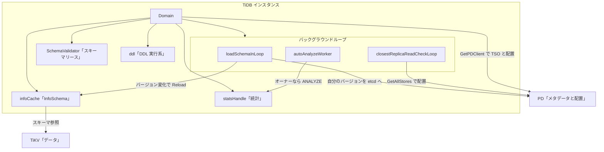

# 第22章 PD クライアントと domain

> **本章で読むソース**
>
> - [`pkg/domain/domain.go`](https://github.com/pingcap/tidb/blob/v8.5.6/pkg/domain/domain.go)
> - [`pkg/domain/schema_validator.go`](https://github.com/pingcap/tidb/blob/v8.5.6/pkg/domain/schema_validator.go)
> - [`pkg/kv/kv.go`](https://github.com/pingcap/tidb/blob/v8.5.6/pkg/kv/kv.go)

## この章の狙い

ここまでの章は、1つの SQL を受けてから結果を返すまでの縦の流れを追ってきた。
パーサ、オプティマイザ、エグゼキュータ、KV エンコード、トランザクション、オンライン DDL である。
これらの部品は、どこかで「いま有効なスキーマは何か」「クラスタ全体で一貫した時刻はどこから来るか」「データはどの TiKV にあるか」を共有していなければ動かない。

本章では、その共有の土台を持つ `Domain` を読む。
`Domain` は1つの TiDB インスタンスにとっての世界であり、InfoSchema（スキーマのスナップショット）、統計ハンドル、DDL の実行系、そして各種のバックグラウンドループを1か所に束ねる。
あわせて、`Domain` が分散基盤 PD とつながる入口（**PD クライアント**）を読む。
TSO の取得とデータ配置の参照は、いずれも PD クライアント経由でクラスタのメタデータへアクセスする。

本書の最終章として、計算層の各部品がどこで分散基盤に接続するのかを `Domain` の視点で振り返り、全体を締めくくる。

## 前提

第20章の非同期オンライン DDL で扱った、スキーマバージョンと etcd を介したバージョン同期を前提とする。
本章の `loadSchemaInLoop` は、そのバージョン変化を受け取る側である。
TSO とコミットの順序は第17章で扱った。
PD と TiKV はクラスタ側のプロセスであり、本章では名前で参照する。

## Domain が束ねるもの

`Domain` 構造体の先頭を見ると、このインスタンスが「世界」として保持する対象が並ぶ。

[`pkg/domain/domain.go L146-L160`](https://github.com/pingcap/tidb/blob/v8.5.6/pkg/domain/domain.go#L146-L160)

```go
type Domain struct {
	store           kv.Storage
	infoCache       *infoschema.InfoCache
	privHandle      *privileges.Handle
	bindHandle      atomic.Value
	statsHandle     atomic.Pointer[handle.Handle]
	statsLease      time.Duration
	ddl             ddl.DDL
	ddlExecutor     ddl.Executor
	ddlNotifier     *notifier.DDLNotifier
	info            *infosync.InfoSyncer
	globalCfgSyncer *globalconfigsync.GlobalConfigSyncer
	m               syncutil.Mutex
	SchemaValidator SchemaValidator
	schemaLease     time.Duration
```

`store` が KV ストアへの接続、`infoCache` がスキーマのキャッシュ、`ddl` と `ddlExecutor` が DDL の駆動、`statsHandle` が統計情報のハンドルである。
`SchemaValidator` と `schemaLease` は、後で読むスキーマリースの仕組みに使う。
1つの TiDB プロセスは原則1つの `Domain` を持ち、セッションやエグゼキュータはこの `Domain` を通じてスキーマや統計へアクセスする。

`Domain` が現在のスキーマを返す口は単純で、キャッシュの最新版をそのまま返すだけである。

[`pkg/domain/domain.go L684-L686`](https://github.com/pingcap/tidb/blob/v8.5.6/pkg/domain/domain.go#L684-L686)

```go
func (do *Domain) InfoSchema() infoschema.InfoSchema {
	return do.infoCache.GetLatest()
}
```

ここで返る `infoschema.InfoSchema` が、第6章で扱ったスキーマ参照の実体である。
プランナがテーブルや列を解決するときに見るのは、この `InfoSchema()` が返すスナップショットである。
問題は、このスナップショットをどう新しく保つかにある。

## スキーマをバージョン付きで読み込む

スキーマの読み込みは `loadInfoSchema` が担う。
このメソッドは、指定した `startTS` の時点で必要なスキーマバージョンを求め、それをキャッシュや差分から組み立てる。
入口では、メタデータの読み手から「いま必要なバージョン」と「いまキャッシュにあるバージョン」を取り出す。

[`pkg/domain/domain.go L299-L316`](https://github.com/pingcap/tidb/blob/v8.5.6/pkg/domain/domain.go#L299-L316)

```go
	m := meta.NewReader(snapshot)
	neededSchemaVersion, err := m.GetSchemaVersionWithNonEmptyDiff()
	if err != nil {
		return nil, false, 0, nil, err
	}
	// fetch the commit timestamp of the schema diff
	schemaTs, err := do.getTimestampForSchemaVersionWithNonEmptyDiff(m, neededSchemaVersion, startTS)
	if err != nil {
		logutil.BgLogger().Warn("failed to get schema version", zap.Error(err), zap.Int64("version", neededSchemaVersion))
		schemaTs = 0
	}

	enableV2 := variable.SchemaCacheSize.Load() > 0
	currentSchemaVersion := int64(0)
	oldInfoSchema := do.infoCache.GetLatest()
	if oldInfoSchema != nil {
		currentSchemaVersion = oldInfoSchema.SchemaMetaVersion()
	}
```

`neededSchemaVersion` が読みたいバージョン、`currentSchemaVersion` がいま持っているバージョンである。
両者が一致するなら、読み込みそのものを省ける。
キャッシュに目的のバージョンがあれば、それを取り出して即座に返す。

[`pkg/domain/domain.go L318-L336`](https://github.com/pingcap/tidb/blob/v8.5.6/pkg/domain/domain.go#L318-L336)

```go
	if is := do.infoCache.GetByVersion(neededSchemaVersion); is != nil {
		isV2, raw := infoschema.IsV2(is)
		if isV2 {
			// Copy the infoschema V2 instance and update its ts.
			// For example, the DDL run 30 minutes ago, GC happened 10 minutes ago. If we use
			// that infoschema it would get error "GC life time is shorter than transaction
			// duration" when visiting TiKV.
			// So we keep updating the ts of the infoschema v2.
			is = raw.CloneAndUpdateTS(startTS)
		}

		// try to insert here as well to correct the schemaTs if previous is wrong
		// the insert method check if schemaTs is zero
		do.infoCache.Insert(is, schemaTs)

		if !isV1V2Switch {
			return is, true, 0, nil, nil
		}
	}
```

キャッシュが当たれば、戻り値の2つ目（`hitCache`）を `true` にして返す。
この場合はスキーマを1行も読み直していない。

キャッシュが外れても、いきなり全テーブルを読み直すとは限らない。
現在のバージョンより新しく、しかも差が小さいなら、差分だけを当てる。

[`pkg/domain/domain.go L346-L347`](https://github.com/pingcap/tidb/blob/v8.5.6/pkg/domain/domain.go#L346-L347)

```go
	if !isV1V2Switch && currentSchemaVersion != 0 && neededSchemaVersion > currentSchemaVersion && neededSchemaVersion-currentSchemaVersion < LoadSchemaDiffVersionGapThreshold {
		is, relatedChanges, diffTypes, err := do.tryLoadSchemaDiffs(useV2, m, currentSchemaVersion, neededSchemaVersion, startTS)
```

`tryLoadSchemaDiffs` は、第20章で1つの DDL ごとに書かれる **schema diff**（変更の差分記録）をバージョンの区間ぶんだけ適用し、変わったテーブルだけを作り直す。
差分の本数が `LoadSchemaDiffVersionGapThreshold`（100）を超える、あるいは差分の適用に失敗したときだけ、全テーブルを読み直す全ロードへ落ちる。
ここで `fetchAllSchemasWithTables` などが走り、`infoschema.NewBuilder` がスキーマを一から組み立てる。

つまり `loadInfoSchema` は、3段の優先順位で「読み込む量」を絞る。
第1にキャッシュ命中なら読み込み0、第2に少数バージョンの前進なら差分だけ、第3にそれ以外で全ロードである。
スキーマの大半は変わらないという前提のもとで、変わったところだけを読む設計になっている。

## Reload が新しいスキーマを取り込む

`loadInfoSchema` を呼ぶ口が `Reload` である。
現在の TSO を取り、その時点のスキーマを読み込んで、結果をスキーマバリデータへ反映する。

[`pkg/domain/domain.go L788-L807`](https://github.com/pingcap/tidb/blob/v8.5.6/pkg/domain/domain.go#L788-L807)

```go
	startTime := time.Now()
	ver, err := do.store.CurrentVersion(kv.GlobalTxnScope)
	if err != nil {
		return err
	}

	version := ver.Ver
	is, hitCache, oldSchemaVersion, changes, err := do.loadInfoSchema(version, false)
	if err != nil {
		if version = getFlashbackStartTSFromErrorMsg(err); version != 0 {
			// use the latest available version to create domain
			version--
			is, hitCache, oldSchemaVersion, changes, err = do.loadInfoSchema(version, false)
		}
	}
	if err != nil {
		metrics.LoadSchemaCounter.WithLabelValues("failed").Inc()
		return err
	}
	metrics.LoadSchemaCounter.WithLabelValues("succ").Inc()
```

キャッシュから取れなかったとき（`!hitCache`）だけ、自分のスキーマバージョンを etcd へ書き戻す。
これが第20章で扱った DDL のバージョン同期の、受け手側の応答である。

[`pkg/domain/domain.go L809-L827`](https://github.com/pingcap/tidb/blob/v8.5.6/pkg/domain/domain.go#L809-L827)

```go
	// only update if it is not from cache
	if !hitCache {
		// loaded newer schema
		if oldSchemaVersion < is.SchemaMetaVersion() {
			// Update self schema version to etcd.
			err = do.ddl.SchemaSyncer().UpdateSelfVersion(context.Background(), 0, is.SchemaMetaVersion())
			if err != nil {
				logutil.BgLogger().Info("update self version failed",
					zap.Int64("oldSchemaVersion", oldSchemaVersion),
					zap.Int64("neededSchemaVersion", is.SchemaMetaVersion()), zap.Error(err))
			}
		}

		// it is full load
		if changes == nil {
			logutil.BgLogger().Info("full load and reset schema validator")
			do.SchemaValidator.Reset()
		}
	}
```

第20章では、DDL を実行する側（オーナー）が新しいバージョンを etcd へ書き、各 TiDB がそのバージョンに追いつくのを待ってから次の状態へ進めた。
本章の `UpdateSelfVersion` がその「追いついた」という応答にあたる。
DDL の安全性は、オーナーが全インスタンスの追従を確認できることに依存しており、この書き戻しがその確認材料になる。

最後に、キャッシュ命中かどうかに関わらずスキーマバリデータのリースを更新する。

[`pkg/domain/domain.go L829-L837`](https://github.com/pingcap/tidb/blob/v8.5.6/pkg/domain/domain.go#L829-L837)

```go
	// lease renew, so it must be executed despite it is cache or not
	do.SchemaValidator.Update(version, oldSchemaVersion, is.SchemaMetaVersion(), changes)
	lease := do.GetSchemaLease()
	sub := time.Since(startTime)
	// Reload interval is lease / 2, if load schema time elapses more than this interval,
	// some query maybe responded by ErrInfoSchemaExpired error.
	if sub > (lease/2) && lease > 0 {
		logutil.BgLogger().Warn("loading schema takes a long time", zap.Duration("take time", sub))
	}
```

## loadSchemaInLoop が変化を待ち受ける

`Reload` を定期的に、かつイベント駆動で呼ぶのが `loadSchemaInLoop` である。
このループは2つの契機で `Reload` を起こす。
1つはリースの半分の周期で動くティッカー、もう1つはスキーマバージョンの変化を伝えるチャネルである。

[`pkg/domain/domain.go L1117-L1182`](https://github.com/pingcap/tidb/blob/v8.5.6/pkg/domain/domain.go#L1117-L1182)

```go
func (do *Domain) loadSchemaInLoop(ctx context.Context) {
	defer util.Recover(metrics.LabelDomain, "loadSchemaInLoop", nil, true)
	// Lease renewal can run at any frequency.
	// Use lease/2 here as recommend by paper.
	ticker := time.NewTicker(do.schemaLease / 2)
	defer func() {
		ticker.Stop()
		logutil.BgLogger().Info("loadSchemaInLoop exited.")
	}()
	syncer := do.ddl.SchemaSyncer()

	for {
		select {
		case <-ticker.C:
			failpoint.Inject("disableOnTickReload", func() {
				failpoint.Continue()
			})
			err := do.Reload()
			if err != nil {
				logutil.BgLogger().Error("reload schema in loop failed", zap.Error(err))
			}
			do.deferFn.check()
		case _, ok := <-syncer.GlobalVersionCh():
			err := do.Reload()
			if err != nil {
				logutil.BgLogger().Error("reload schema in loop failed", zap.Error(err))
			}
			if !ok {
				logutil.BgLogger().Warn("reload schema in loop, schema syncer need rewatch")
				// Make sure the rewatch doesn't affect load schema, so we watch the global schema version asynchronously.
				syncer.WatchGlobalSchemaVer(context.Background())
			}
		// ... (中略) ...
		case <-do.exit:
			return
		}
		do.refreshMDLCheckTableInfo()
		select {
		case do.mdlCheckCh <- struct{}{}:
		default:
		}
	}
}
```

`syncer.GlobalVersionCh()` は、第20章のオーナーが etcd のグローバルバージョンキーを更新したときに通知が流れるチャネルである。
DDL が走ってバージョンが上がると、待っていた `loadSchemaInLoop` がただちに `Reload` を呼び、新しい `InfoSchema` を取り込む。
ティッカーの側は、変化が無いときでもリースを更新し続けるために要る。
周期をリースの半分にするのは、リースが切れる前に必ず1回は更新を試みるためである。

## スキーマリースが再読み込みを省く

ここまでで、`Domain` はスキーマをバージョン付きでキャッシュし、変化したときだけ読み直すことが分かった。
だが、読み取りトランザクションのたびに「自分のスキーマは最新か」を PD やメタデータへ問い合わせるのでは、せっかくのキャッシュが活きない。
ここで効くのが **スキーマリース** である。

スキーマバリデータは、バージョンと、そのバージョンが有効な期限を持つ。

[`pkg/domain/schema_validator.go L70-L80`](https://github.com/pingcap/tidb/blob/v8.5.6/pkg/domain/schema_validator.go#L70-L80)

```go
type schemaValidator struct {
	isStarted          bool
	mux                sync.RWMutex
	lease              time.Duration
	latestSchemaVer    int64
	restartSchemaVer   int64
	do                 *Domain
	latestSchemaExpire time.Time
	// deltaSchemaInfos is a queue that maintain the history of changes.
	deltaSchemaInfos []deltaSchemaInfo
}
```

`Reload` が呼ぶ `Update` は、リースを付与した時刻にリース期間を足した時点を期限（`latestSchemaExpire`）として記録する。

[`pkg/domain/schema_validator.go L143-L147`](https://github.com/pingcap/tidb/blob/v8.5.6/pkg/domain/schema_validator.go#L143-L147)

```go
	// Renew the lease.
	s.latestSchemaVer = currVer
	leaseGrantTime := oracle.GetTimeFromTS(leaseGrantTS)
	leaseExpire := leaseGrantTime.Add(s.lease - time.Millisecond)
	s.latestSchemaExpire = leaseExpire
```

トランザクションがスキーマの妥当性を確かめるとき、`Check` がこの期限を使う。
トランザクションの `txnTS` がスキーマバージョンに対応し、かつ最新バージョンより古くなく、期限内に収まっていれば、追加の問い合わせなしに `ResultSucc` を返す。

[`pkg/domain/schema_validator.go L273-L278`](https://github.com/pingcap/tidb/blob/v8.5.6/pkg/domain/schema_validator.go#L273-L278)

```go
	// Schema unchanged, maybe success or the schema validator is unavailable.
	t := oracle.GetTimeFromTS(txnTS)
	if t.After(s.latestSchemaExpire) {
		return nil, ResultUnknown
	}
	return nil, ResultSucc
```

これがスキーマリースの機構である。
リース期間内であれば、ローカルにキャッシュした `InfoSchema` をそのまま使ってよいと判断でき、毎回メタデータを読み直さずに済む。
期限を過ぎた `txnTS` のときだけ `ResultUnknown` を返し、呼び出し側にスキーマの再確認を促す。
バージョンが変わった場合（`schemaVer < s.latestSchemaVer`）は、変わったテーブルが自分の触るテーブルと重なるかだけを差分の履歴で調べ、重ならなければ通す。

なぜリースが安全なのか。
第20章で見たとおり、DDL のオーナーは新しい状態へ進む前に、リースの2倍にあたる期間を待って全インスタンスの追従を確認する。
だから「リース期間内に再読み込みしていないバージョン」は、クラスタ全体でまだ有効だと保証されている。
リースは、その保証を計算層が再利用するための仕組みであり、スキーマの確認をネットワーク往復から時刻の比較へ置き換える。

## PD クライアントへの入口

ここまでが計算層の内側の話である。
`Domain` がクラスタの外側、すなわち分散基盤 PD とつながる口を見る。
PD クライアントは、ストアが PD と話す能力を持つときだけ取り出せる。

[`pkg/domain/domain.go L1853-L1859`](https://github.com/pingcap/tidb/blob/v8.5.6/pkg/domain/domain.go#L1853-L1859)

```go
// GetPDClient returns the PD client.
func (do *Domain) GetPDClient() pd.Client {
	if store, ok := do.store.(kv.StorageWithPD); ok {
		return store.GetPDClient()
	}
	return nil
}
```

`StorageWithPD` は、PD クライアントを取り出せるストアを表すインタフェースである。

[`pkg/kv/kv.go L792-L796`](https://github.com/pingcap/tidb/blob/v8.5.6/pkg/kv/kv.go#L792-L796)

```go
// StorageWithPD is used to get pd client.
type StorageWithPD interface {
	GetPDClient() pd.Client
	GetPDHTTPClient() pdhttp.Client
}
```

PD クライアントは、本物の TiKV を相手にするストアでだけ得られ、単体ストア unistore のようなテスト用ストアでは `nil` になる。
PD はクラスタのメタデータと配置を司るプロセスで、計算層は PD クライアントを通じて2種類の情報を得る。
1つは TSO であり、第17章で見たコミット順序の基準となる時刻はここから来る。
TSO の取得は KV 層のオラクルが PD クライアントへ委ねる経路で行われ、`Domain` 自身は `Reload` で現在バージョンを取るときなどに間接的にこれを使う。
もう1つはデータの配置であり、どの Region がどの TiKV ストアにあるかを PD が答える。

配置を `Domain` が直に問い合わせる例が、最寄りレプリカ読み取りの判定ループである。
このループは PD クライアントから全ストアの一覧を取り、ストアの所在（ゾーンのラベル）を集計する。

[`pkg/domain/domain.go L1657-L1662`](https://github.com/pingcap/tidb/blob/v8.5.6/pkg/domain/domain.go#L1657-L1662)

```go
	stores, err := pdClient.GetAllStores(ctx, pd.WithExcludeTombstone())
	if err != nil {
		return err
	}

	storeZones := make(map[string]int)
```

ここで得たゾーンの分布をもとに、この TiDB が最寄りの TiKV へ読み取りを向けてよいかを決める。
Region 単位の細かな位置（どのキー範囲がどのストアにあるか）は、KV 層のリージョンキャッシュが PD から取り込んで保持し、コプロセッサ読み取りや書き込みのたびに参照する。
リージョンキャッシュ自体は client-go と TiKV 側の責務であり、本章では `Domain` が配置情報の入口を握ることまでを扱う。

## バックグラウンドループを起こす

`Domain` の最後の役割が、各種のバックグラウンド処理を起動して束ねることである。
`Start` が、これまで読んできたループをまとめて立ち上げる。

[`pkg/domain/domain.go L1522-L1542`](https://github.com/pingcap/tidb/blob/v8.5.6/pkg/domain/domain.go#L1522-L1542)

```go
	// Local store needs to get the change information for every DDL state in each session.
	do.wg.Run(func() {
		do.loadSchemaInLoop(do.ctx)
	}, "loadSchemaInLoop")
	do.wg.Run(do.mdlCheckLoop, "mdlCheckLoop")
	do.wg.Run(do.topNSlowQueryLoop, "topNSlowQueryLoop")
	do.wg.Run(do.infoSyncerKeeper, "infoSyncerKeeper")
	do.wg.Run(do.globalConfigSyncerKeeper, "globalConfigSyncerKeeper")
	do.wg.Run(do.runawayManager.RunawayRecordFlushLoop, "runawayRecordFlushLoop")
	do.wg.Run(do.runawayManager.RunawayWatchSyncLoop, "runawayWatchSyncLoop")
	do.wg.Run(do.requestUnitsWriterLoop, "requestUnitsWriterLoop")
	skipRegisterToDashboard := gCfg.SkipRegisterToDashboard
	if !skipRegisterToDashboard {
		do.wg.Run(do.topologySyncerKeeper, "topologySyncerKeeper")
	}
	pdCli := do.GetPDClient()
	if pdCli != nil {
		do.wg.Run(func() {
			do.closestReplicaReadCheckLoop(do.ctx, pdCli)
		}, "closestReplicaReadCheckLoop")
	}
```

`loadSchemaInLoop` がスキーマ同期、`topNSlowQueryLoop` が低速クエリの保持、`infoSyncerKeeper` がインスタンス情報の同期、`closestReplicaReadCheckLoop` が先ほどの最寄りレプリカ判定である。
`closestReplicaReadCheckLoop` は PD クライアントが取れたときだけ起こす点に注意する。

ループはどれも同じ型を持つ。
ティッカーかチャネルを待ち、契機が来たら処理を1回走らせ、終了チャネルが閉じたら抜ける。
低速クエリのループを例に取ると、10分ごとに期限切れを掃除し、チャネルからクエリが届けば溜め、問い合わせが来れば応答する。

[`pkg/domain/domain.go L874-L895`](https://github.com/pingcap/tidb/blob/v8.5.6/pkg/domain/domain.go#L874-L895)

```go
	for {
		select {
		case now := <-ticker.C:
			do.slowQuery.RemoveExpired(now)
		case info, ok := <-do.slowQuery.ch:
			if !ok {
				return
			}
			do.slowQuery.Append(info)
		case msg := <-do.slowQuery.msgCh:
			req := msg.request
			switch req.Tp {
			case ast.ShowSlowTop:
				msg.result = do.slowQuery.QueryTop(int(req.Count), req.Kind)
			case ast.ShowSlowRecent:
				msg.result = do.slowQuery.QueryRecent(int(req.Count))
			default:
				msg.result = do.slowQuery.QueryAll()
			}
			msg.Done()
		}
	}
```

統計の自動更新も同じ形である。
`autoAnalyzeWorker` は統計のリース周期でティッカーを刻み、自分が統計のオーナーであるときだけ自動 ANALYZE を起こす。

[`pkg/domain/domain.go L2875-L2890`](https://github.com/pingcap/tidb/blob/v8.5.6/pkg/domain/domain.go#L2875-L2890)

```go
	for {
		select {
		case <-analyzeTicker.C:
			if variable.RunAutoAnalyze.Load() && !do.stopAutoAnalyze.Load() && do.statsOwner.IsOwner() {
				statsHandle.HandleAutoAnalyze()
			} else if !variable.RunAutoAnalyze.Load() || !do.statsOwner.IsOwner() {
				// Once the auto analyze is disabled or this instance is not the owner,
				// we close the priority queue to release resources.
				// This would guarantee that when auto analyze is re-enabled or this instance becomes the owner again,
				// the priority queue would be re-initialized.
				statsHandle.ClosePriorityQueue()
			}
		case <-do.exit:
			return
		}
	}
```

`do.statsOwner.IsOwner()` の判定が示すように、クラスタ全体で1つだけ走ればよい仕事（自動 ANALYZE や GC）は、オーナー選出を通じて1インスタンスに絞る。
第19章で読んだ GC も、この形で `Domain` の下に置かれたバックグラウンド処理の1つである。
統計情報そのものの作り方は第8章で扱った。
ここでは、その更新を駆動するループが `Domain` に束ねられている点を押さえる。

## Domain が束ねる構図

ここまでの部品を1枚に置くと、`Domain` がスキーマと統計と DDL とループを束ね、PD から時刻と配置を得る構図が見える。



## 分散基盤の視点で全体を振り返る

最終章として、計算層の各部品がどこで分散基盤に接続するのかを通して見る。

第1部から第3部までの SQL 処理は、見かけ上は1台のデータベースのように振る舞う。
だが内側では、プランナが参照するスキーマは `Domain` の `InfoSchema()` から来て、その鮮度はスキーマリースが保証していた。
オプティマイザが使う統計は `statsHandle` が握り、`autoAnalyzeWorker` がクラスタで1つのオーナーとして更新していた。
コプロセッサ押し下げ（第10章）と分散読み取り（第13章）が向かう先の Region は、PD が配置を答え、リージョンキャッシュがそれを保持していた。

第4部のトランザクションは、より直に分散基盤へ依存する。
コミット順序の基準となる TSO は PD が単調に発番し、Percolator の2PC（第18章）はその時刻でロックとコミットを並べていた。
GC（第19章）は、走行中トランザクションの最小 `start_ts` を尊重しながら安全な時点を PD と突き合わせて進めていた。

第5部のスキーマ管理は、分散基盤の上で「全インスタンスのスキーマを一貫させる」問題を解いていた。
非同期オンライン DDL（第20章）はバージョンを段階的に進め、各インスタンスの追従を etcd で確認した。
その確認材料を返すのが、本章の `Reload` と `loadSchemaInLoop` だった。

これらを1か所に束ねているのが `Domain` である。
1つの TiDB インスタンスは、`Domain` を通じてスキーマと統計とループを内に持ち、PD クライアントを通じて時刻と配置を外から得る。
計算層は状態を持たない計算機ではなく、分散基盤のメタデータをローカルにキャッシュし、リースとバージョンでその鮮度を管理する層である。
本書を通して読んできた縦の流れは、すべてこの土台の上で動いていた。

## まとめ

`Domain` は1つの TiDB インスタンスの世界であり、InfoSchema、統計ハンドル、DDL、各種バックグラウンドループを束ねる。
スキーマの読み込み `loadInfoSchema` は、キャッシュ命中なら読み込み0、少数バージョンの前進なら差分、それ以外で全ロードと、読み込む量を3段で絞る。
`Reload` と `loadSchemaInLoop` が、第20章のスキーマバージョン変化を受けて新しい `InfoSchema` を取り込み、自分のバージョンを etcd へ書き戻す。

スキーマリースは、リース期間内であればローカルの `InfoSchema` を再読み込みせずに使えると判断する機構で、スキーマの確認をネットワーク往復から時刻の比較へ置き換える。
リースが安全なのは、DDL のオーナーが状態を進める前にリースの2倍を待って全インスタンスの追従を確認するからである。

PD との連携は PD クライアント経由で行い、TSO の取得とデータ配置の参照という2つの情報を得る。
バックグラウンドループは `Start` がまとめて起こし、クラスタで1つだけ走ればよい仕事はオーナー選出で1インスタンスに絞る。

## 関連する章

- [第20章 非同期オンライン DDL](20-online-ddl.md)：本章の `loadSchemaInLoop` が受け取るスキーマバージョン同期を扱う。
- [第17章 トランザクション調停（楽観、悲観、TSO）](../part04-txn/17-transaction-coordination.md)：PD が発番する TSO とコミット順序を扱う。
- [第2章 エコシステムとアーキテクチャ](../part00-overview/02-architecture.md)：TiDB と PD と TiKV の役割分担を扱う。
- PD はクラスタのメタデータと配置を司り、TiKV がデータを保持するクラスタ側のプロセスであり、本章は名前で参照した。
