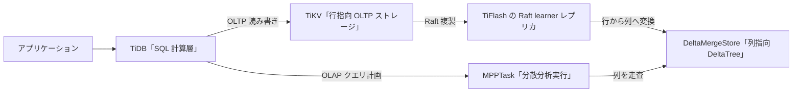

# 第1章 TiFlash とは何か

> **本章で読むソース**
>
> - [`dbms/src/Storages/DeltaMerge/DeltaMergeStore.h`](https://github.com/pingcap/tiflash/blob/v8.5.6/dbms/src/Storages/DeltaMerge/DeltaMergeStore.h)
> - [`dbms/src/Storages/KVStore/KVStore.h`](https://github.com/pingcap/tiflash/blob/v8.5.6/dbms/src/Storages/KVStore/KVStore.h)
> - [`dbms/src/Flash/Mpp/MPPTask.h`](https://github.com/pingcap/tiflash/blob/v8.5.6/dbms/src/Flash/Mpp/MPPTask.h)

## この章の狙い

TiFlash が TiDB エコシステムの中で何を担い、行指向の TiKV とどう役割を分けるかを示す。
TiFlash の3つの特徴を、ストレージ、複製、分散実行のそれぞれを代表する C++ のクラス定義に結び付ける。
導入章なので個々の機構には深入りせず、入口の所在と全体の構図を確定させることに絞る。

## 前提

TiDB エコシステムは、SQL を処理する計算層の TiDB、分散ストレージ層の TiKV、列指向の解析エンジン TiFlash、メタデータと時刻を司る PD から成る。
本書はこのうち TiFlash を読む。
読者には C++ と列指向データベースの基礎を仮定する。
本章のコード引用はすべて pingcap/tiflash のタグ `v8.5.6` に固定する。

## TiFlash の位置付け

**TiFlash** は TiDB エコシステムの列指向 OLAP エンジンであり、行指向の TiKV と並ぶ HTAP のもう一方の柱である。
TiKV が1行を単位にデータを保持して OLTP の点更新と短いトランザクションを受けるのに対し、TiFlash は列を単位にデータを保持して、大量の行を走査する分析クエリを受ける。
同じテーブルのデータが、TiKV には行指向で、TiFlash には列指向で、二重に保持される。
両者は Raft で同期するため、書き込みは TiKV だけに対して行い、TiFlash はその複製を受け取る側に回る。
この役割は3つの特徴に分けて捉えられる。

第1の特徴は列指向ストレージ **DeltaTree** である。
TiFlash は列ごとにデータをまとめて保持し、分析クエリが必要とする列だけを読む。
第2の特徴は **Raft learner** としての複製である。
TiFlash は自分では書き込みを受け付けず、TiKV の Raft グループに learner として参加して行データの複製を受け取る。
第3の特徴は **MPP** による分散実行である。
TiFlash は分析クエリを複数ノードに分散し、ノードをまたいでデータを交換しながら集約や join を並列に処理する。

## 列指向ストレージ DeltaTree

TiFlash の列指向ストレージは **DeltaTree** と呼ばれ、その実体はテーブルごとの `DeltaMergeStore` クラスである。

[`dbms/src/Storages/DeltaMerge/DeltaMergeStore.h L208-L211`](https://github.com/pingcap/tiflash/blob/v8.5.6/dbms/src/Storages/DeltaMerge/DeltaMergeStore.h#L208-L211)

```cpp
class DeltaMergeStore
    : private boost::noncopyable
    , public std::enable_shared_from_this<DeltaMergeStore>
{
```

`DeltaMergeStore` は1つの物理テーブルを受け持ち、そのデータを列の集合として保持する。
実際に保持する列は `store_columns` に置かれる。

[`dbms/src/Storages/DeltaMerge/DeltaMergeStore.h L982-L985`](https://github.com/pingcap/tiflash/blob/v8.5.6/dbms/src/Storages/DeltaMerge/DeltaMergeStore.h#L982-L985)

```cpp
    // The columns we actually store.
    // First three columns are always _tidb_rowid, _INTERNAL_VERSION, _INTERNAL_DELMARK
    // No matter `tidb_rowid` exist in `table_columns` or not.
    ColumnDefinesPtr store_columns;
```

`store_columns` は列の定義（`ColumnDefines`）の集合であり、ユーザの列に加えて行 ID とバージョンと削除マークを先頭に持つ。
列ごとにデータがまとまっていると、分析クエリが必要とする列だけをディスクから読めるので、参照しない列の入出力を避けられる。
同じ列には同じ型の値が並ぶため、圧縮も効きやすい。
列指向が分析に向く理由は[なぜ列指向が OLAP に速いか](../part01-deltatree/04-why-columnar.md)で詳しく扱う。
`DeltaMergeStore` が新しい書き込みを溜める Delta レイヤと、整列済みの Stable レイヤをどう組み合わせるかは[DeltaMergeStore 概観](../part01-deltatree/05-deltamergestore.md)で読む。

## Raft learner として複製を受ける

TiFlash はテーブルのデータを自分で生成せず、TiKV から複製として受け取る。
この複製を受け持つのが `KVStore` クラスである。

[`dbms/src/Storages/KVStore/KVStore.h L123-L130`](https://github.com/pingcap/tiflash/blob/v8.5.6/dbms/src/Storages/KVStore/KVStore.h#L123-L130)

```cpp
/// KVStore manages raft replication and transactions.
/// - Holds all regions in this TiFlash store.
/// - Manages region -> table mapping.
/// - Manages persistence of all regions.
/// - Implements learner read.
/// - Wraps FFI interfaces.
/// - Use `Decoder` to transform row format into col format.
class KVStore final : private boost::noncopyable
```

`KVStore` はこの TiFlash ノードが保持するすべての Region を抱え、Raft の複製を管理する。
TiFlash は TiKV の Raft グループに learner として加わるので、Leader の選挙や提案には関与せず、複製ログの適用だけを受け持つ。
コメントの最後の行が示すとおり、`KVStore` は TiKV から届く行形式のデータを `Decoder` で列形式へ変換し、`DeltaMergeStore` へ渡す。
この行から列への変換が、行指向の TiKV と列指向の TiFlash をつなぐ接点である。
learner として複製を受け取る仕組みと、行から列への変換の流れは[KVStore と Region](../part02-raft-learner/11-kvstore-and-region.md)から読む。
TiKV 側の Raft グループそのものの構造は、TiKV 編の[raftstore の全体像](../../tikv/part02-raft/07-raftstore-overview.md)で扱う。

## MPP による分散分析

TiFlash は1ノードに収まらない規模の分析を、複数ノードへ分散して実行する。
この分散実行の単位が `MPPTask` クラスである。

[`dbms/src/Flash/Mpp/MPPTask.h L68-L71`](https://github.com/pingcap/tiflash/blob/v8.5.6/dbms/src/Flash/Mpp/MPPTask.h#L68-L71)

```cpp
class MPPTask
    : public std::enable_shared_from_this<MPPTask>
    , private boost::noncopyable
{
```

1つの分析クエリは複数の `MPPTask` に分割され、各ノードがそれぞれの `MPPTask` を実行する。
タスクは TiDB から届く要求を受けて準備し、実行を開始する。

[`dbms/src/Flash/Mpp/MPPTask.h L99-L101`](https://github.com/pingcap/tiflash/blob/v8.5.6/dbms/src/Flash/Mpp/MPPTask.h#L99-L101)

```cpp
    void prepare(const mpp::DispatchTaskRequest & task_request);

    void run();
```

`prepare` は TiDB が組み立てた `DispatchTaskRequest` を受け取り、`run` がそのタスクを実行する。
タスクどうしはノードをまたいでデータを交換しながら、集約や join を分担して処理する。
TiDB が分析クエリをどう MPP の計画に落とすかは、TiDB 編の[ストレージエンジンの選択と MPP](../../tidb/part02-optimizer/11-engine-selection-and-mpp.md)で扱う。
TiFlash 側で `MPPTask` がデータを交換する仕組みは[MPPTask と Exchange](../part04-mpp/19-mpptask-and-exchange.md)で読む。

## ClickHouse 由来の実行エンジン

TiFlash の列指向ストレージと Raft 複製は、ClickHouse 由来の実行エンジンの上に載っている。
列の集合を表す `Block`、1列を表す `IColumn`、列の型を表す `DataType` といった基盤を ClickHouse から受け継ぎ、その上に TiFlash 独自の `DeltaMergeStore` と `KVStore` を加えた構成である。
この派生の経緯と、TiFlash がどこを引き継ぎどこを置き換えたかは[ClickHouse 派生のアーキテクチャ](02-architecture.md)で扱う。

## HTAP を支える設計

TiFlash の中心となる設計上の選択は、同じデータを行指向の TiKV と列指向の TiFlash に二重で持たせ、両者を Raft で同期させる点にある。
行指向と列指向は得意な処理が異なるため、1つのストレージ形式で OLTP と OLAP の双方を最適に処理することはできない。
点更新や短いトランザクションは、行をまとめて読み書きする TiKV が速く処理する。
多数の行を走査する集約や join は、必要な列だけを読む TiFlash が速く処理する。
この二者を Raft で同期させると、TiKV への書き込みが learner である TiFlash へそのまま複製されるので、利用者は片方へ書くだけで両方の最新データを保てる。
書き込みの経路を TiKV に一本化したうえで、読み取りだけを処理に応じて TiKV と TiFlash に振り分けることで、1つのデータに対して OLTP と OLAP を別エンジンで最適に処理できる。
TiKV と TiFlash の役割分担の全体像は[TiDB、TiKV との関係](03-relationship-with-tidb-tikv.md)で読む。

全体の構図を図1に示す。



図1　TiKV の行データを Raft learner で受け取り、列指向の DeltaTree に変換して MPP で分析する HTAP の構図。

## まとめ

TiFlash は TiDB エコシステムの列指向 OLAP エンジンであり、行指向の TiKV と並ぶ HTAP のもう一方の柱である。
列指向ストレージ DeltaTree、Raft learner としての複製、MPP による分散実行という3つの特徴で役割を整理できる。
列指向ストレージはテーブルごとの `DeltaMergeStore` が受け持ち、必要な列だけを読むことで分析を速くする。
複製は `KVStore` が learner として受け取り、TiKV から届く行データを列形式へ変換する。
分析クエリは `MPPTask` に分割され、ノードをまたいでデータを交換しながら並列に処理される。
これらは ClickHouse 由来の実行エンジンの上に、TiFlash 独自のストレージと Raft を載せた構成として成り立つ。

## 関連する章

- [ClickHouse 派生のアーキテクチャ](02-architecture.md)：ClickHouse から何を引き継ぎ何を置き換えたかを扱う。
- [TiDB、TiKV との関係（MPP と learner replica）](03-relationship-with-tidb-tikv.md)：TiKV と TiFlash の役割分担を扱う。
- [なぜ列指向が OLAP に速いか](../part01-deltatree/04-why-columnar.md)：列指向が分析に向く理由を読む。
- [KVStore と Region](../part02-raft-learner/11-kvstore-and-region.md)：learner として複製を受ける仕組みを読む。
- [MPPTask と Exchange](../part04-mpp/19-mpptask-and-exchange.md)：`MPPTask` がデータを交換する仕組みを読む。
- [raftstore の全体像](../../tikv/part02-raft/07-raftstore-overview.md)：TiKV 側の Raft グループの構造を扱う。
- [ストレージエンジンの選択と MPP](../../tidb/part02-optimizer/11-engine-selection-and-mpp.md)：TiDB が MPP の計画を組む過程を扱う。
