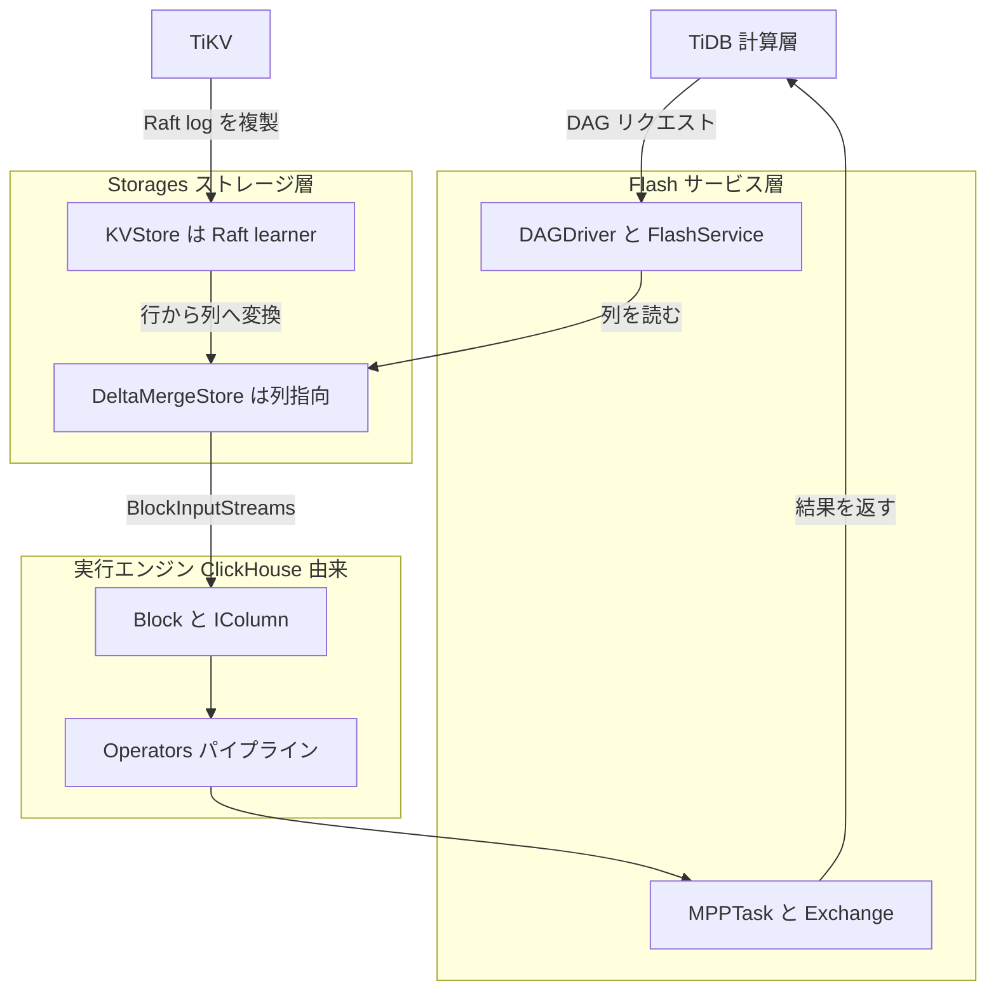

# 第2章 ClickHouse 派生のアーキテクチャ

> **本章で読むソース**
>
> - [`dbms/src/Core/Block.h`](https://github.com/pingcap/tiflash/blob/v8.5.6/dbms/src/Core/Block.h#L39-L46)
> - [`dbms/src/Columns/IColumn.h`](https://github.com/pingcap/tiflash/blob/v8.5.6/dbms/src/Columns/IColumn.h#L40-L50)
> - [`dbms/src/Flash/Coprocessor/DAGDriver.h`](https://github.com/pingcap/tiflash/blob/v8.5.6/dbms/src/Flash/Coprocessor/DAGDriver.h#L40-L43)
> - [`dbms/src/Storages/KVStore/KVStore.h`](https://github.com/pingcap/tiflash/blob/v8.5.6/dbms/src/Storages/KVStore/KVStore.h#L123-L130)
> - [`dbms/src/Storages/DeltaMerge/DeltaMergeStore.h`](https://github.com/pingcap/tiflash/blob/v8.5.6/dbms/src/Storages/DeltaMerge/DeltaMergeStore.h#L463-L482)

## この章の狙い

TiFlash が ClickHouse から何を受け継ぎ、TiDB エコシステム向けに何を足したかを、`dbms/src` の構成と入口クラスに即して示す。
ClickHouse 由来の列指向の実行エンジンを土台と捉え、その上に載る TiFlash 独自のストレージと Raft の層を地図として配置する。
個々の機構の詳細は後続の部に譲り、本章は層の所在と1つの分析クエリが通る道筋を確定させることに絞る。

## 前提

TiFlash は ClickHouse のコードベースから派生した列指向の解析エンジンであり、TiDB エコシステムの OLAP を担う。
本章のコード引用はすべて pingcap/tiflash のタグ `v8.5.6` に固定する。
ソースツリーの C++ 本体は `dbms/src` 以下にあり、本章はその主要なディレクトリを層として読む。
TiFlash の位置付けは [第1章](01-what-is-tiflash.md) で扱ったため、ここでは前提とする。
読者には C++ と列指向データベースの基礎を仮定する。

## ClickHouse から受け継いだ中核

TiFlash の `dbms/src` は ClickHouse の名前空間 `DB` をそのまま引き継いでおり、列指向のメモリ表現と実行エンジンが中核を成す。
主要なディレクトリは次のように層へ対応する。

- `Core`：列の集合を表す `Block` と、その付随情報を置く中核の型を収める。
- `Columns`：列の抽象インターフェース `IColumn` と、その実体である数値列や文字列列の実装を収める。
- `DataTypes`：型の抽象 `IDataType` 系を収め、列のシリアライズと値の解釈を担う。
- `Interpreters`：クエリの解釈と実行コンテキスト `Context`、集約や結合の実装を収める。
- `Operators`：パイプライン実行の演算子を収める。
- `Flash`：coprocessor と MPP のサービス入口を収める。
- `Storages`：ストレージエンジンを収め、配下に `DeltaMerge` と `KVStore` を持つ。

このうちデータ処理の単位は `Block` である。
`Block` は複数の列をまとめて1つの塊として持ち、行ではなく列の集合としてメモリ上に並べる。

[`dbms/src/Core/Block.h`](https://github.com/pingcap/tiflash/blob/v8.5.6/dbms/src/Core/Block.h#L39-L46)

```cpp
class Block
{
private:
    using Container = ColumnsWithTypeAndName;
    using IndexByName = std::map<String, size_t>;

    Container data;
    IndexByName index_by_name;
```

`Block` の実体は `ColumnsWithTypeAndName` の配列であり、各要素は列のデータと型と名前を1つにまとめた組である。
名前から位置を引く `index_by_name` を併せ持つことで、列を名前でも添字でも参照できる。
`Block` がまとめて運ぶ各列が `IColumn` であり、その抽象インターフェースが列指向実行の最小単位を定める。

[`dbms/src/Columns/IColumn.h`](https://github.com/pingcap/tiflash/blob/v8.5.6/dbms/src/Columns/IColumn.h#L40-L50)

```cpp
/// Declares interface to store columns in memory.
class IColumn : public COWPtr<IColumn>
{
private:
    friend class COWPtr<IColumn>;

    /// Creates the same column with the same data.
    /// This is internal method to use from COWPtr.
    /// It performs shallow copy with copy-ctor and not useful from outside.
    /// If you want to copy column for modification, look at 'mutate' method.
    virtual MutablePtr clone() const = 0;
```

`IColumn` は同種の値を連続して保持する列を表し、`COWPtr`（copy on write のポインタ）を継承する。
`IColumn` の操作は要素を1個ずつ扱うのではなく、列の範囲をまとめて挿入したりフィルタしたりする形で定義され、1命令で複数行を処理するベクトル化実行の土台となる。
列の型と直列化を担うのが `DataTypes` の `IDataType` であり、列の値をどう解釈し、どうディスクとの間で変換するかをこの層が決める。
クエリの解釈と実行は `Interpreters` が担い、`Context` を介して集約や結合などの演算へつなぐ。
ここまでが ClickHouse から受け継いだ部分であり、成熟したベクトル化実行エンジンをそのまま土台として使う。

## TiFlash が足した三つの層

ClickHouse の実行エンジンの上に、TiFlash は TiDB エコシステムと整合させるための層を三つ加える。

第1の層は列指向ストレージ **DeltaTree** である。
これは `dbms/src/Storages/DeltaMerge` に置かれ、ClickHouse の `MergeTree` とは別物の独自実装である。
入口の `DeltaMergeStore` は、読み取りを `BlockInputStreams` として返し、ストレージの出力を実行エンジンの単位である `Block` にそろえる。

[`dbms/src/Storages/DeltaMerge/DeltaMergeStore.h`](https://github.com/pingcap/tiflash/blob/v8.5.6/dbms/src/Storages/DeltaMerge/DeltaMergeStore.h#L463-L482)

```cpp
    /// Read rows in two modes:
    ///     when is_fast_scan == false, we will read rows with MVCC filtering, del mark !=0  filter and sorted merge.
    ///     when is_fast_scan == true, we will read rows without MVCC and sorted merge.
    /// `sorted_ranges` should be already sorted and merged.
    BlockInputStreams read(
        const Context & db_context,
        const DB::Settings & db_settings,
        const ColumnDefines & columns_to_read,
        const RowKeyRanges & sorted_ranges,
        size_t num_streams,
        UInt64 start_ts,
        const PushDownFilterPtr & filter,
        const RuntimeFilteList & runtime_filter_list,
        int rf_max_wait_time_ms,
        const String & tracing_id,
        const DMReadOptions & read_opts = {},
        size_t expected_block_size = DEFAULT_BLOCK_SIZE,
        const SegmentIdSet & read_segments = {},
        size_t extra_table_id_index = InvalidColumnID,
        ScanContextPtr scan_context = nullptr);
```

引数の `columns_to_read` が読む列だけを指定し、`start_ts` が MVCC のスナップショット時刻を、`filter` がフィルタの押し下げを受け取る。
読む列を絞り、MVCC で時刻を固定し、フィルタを下へ渡せる構造が、TiDB と整合する読み取りを列指向のまま実現する。
DeltaTree の内部構造は [第5章](../part01-deltatree/05-deltamergestore.md) で読む。

第2の層は **KVStore** であり、`dbms/src/Storages/KVStore` に置かれる。
TiFlash は TiKV から Raft の learner として複製を受け取り、行形式のデータを列形式へ変換してから DeltaTree へ書き込む。
その役割は `KVStore` クラスの宣言に並ぶコメントから読み取れる。

[`dbms/src/Storages/KVStore/KVStore.h`](https://github.com/pingcap/tiflash/blob/v8.5.6/dbms/src/Storages/KVStore/KVStore.h#L123-L130)

```cpp
/// KVStore manages raft replication and transactions.
/// - Holds all regions in this TiFlash store.
/// - Manages region -> table mapping.
/// - Manages persistence of all regions.
/// - Implements learner read.
/// - Wraps FFI interfaces.
/// - Use `Decoder` to transform row format into col format.
class KVStore final : private boost::noncopyable
```

`KVStore` はこのストア上のすべての Region を保持し、learner read を実装し、`Decoder` で行形式を列形式へ変換する。
Region と learner read の詳細は [第11章](../part02-raft-learner/11-kvstore-and-region.md) で扱う。

第3の層は **Flash サービス**であり、`dbms/src/Flash` に置かれる。
これは coprocessor と MPP のエンドポイントを提供し、TiDB から届く DAG リクエストを受け取る入口となる。
coprocessor の駆動を表すのが `DAGDriver` である。

[`dbms/src/Flash/Coprocessor/DAGDriver.h`](https://github.com/pingcap/tiflash/blob/v8.5.6/dbms/src/Flash/Coprocessor/DAGDriver.h#L40-L43)

```cpp
/// An abstraction of driver running DAG request.
/// Now is a naive native executor. Might get evolved to drive MPP-like computation.
template <DAGRequestKind Kind>
class DAGDriver
```

`DAGDriver` は1つの DAG リクエストを駆動する抽象であり、ここから読み取りと演算が始まる。
複数ノードにまたがる分散実行は MPP が担い、その全体像は [第18章](../part04-mpp/18-what-is-mpp.md) で読む。

## 1つの分析クエリが通る層

ここまでの層を、1つの分析クエリの流れに沿って並べると道筋が見える。
クエリはまず Flash サービスが DAG リクエストとして受け取り、対象のテーブルに対する読み取りを `DeltaMergeStore` へ渡す。
`DeltaMergeStore` は必要な列だけを `BlockInputStreams` として返し、KVStore が learner として受けて列へ変換した最新データと、ディスク上の確定データを併せて読む。
読み出された列は `Block` に載り、ClickHouse 由来の演算子がベクトル化して集約や結合を進める。
ノードをまたぐ集約や結合は MPP が Exchange で再分配し、最終結果を TiDB へ返す。
この流れを層として図にすると次のようになる。



各層の内部はそれぞれ後続の部で読む。
本章では、Flash が入口、Storages が DeltaTree と KVStore を抱えるストレージ、`Block` と `IColumn` と Operators が実行エンジンという三層の対応を押さえておけばよい。

## ベクトル化エンジンを土台に独自ストレージと Raft を載せる

このアーキテクチャの工夫は、成熟したベクトル化実行エンジンを土台として、その上に TiDB と整合する独自ストレージと Raft の層を載せた点にある。
土台側の `IColumn` は `COWPtr` を継承し、列をポインタとして共有して変更時にだけ複製する。
そのため `Block` が演算子の間を流れても列データの実体をコピーせずに済み、解析クエリが生む大量の中間結果を低コストで受け渡せる。
この既存のベクトル化実行を保ったまま、TiFlash は DeltaTree で MVCC を TiDB のトランザクションと一致させ、KVStore で TiKV からの Raft learner 複製を受ける。
独自実装をストレージと Raft に限り、実行エンジンを ClickHouse から引き継いだことで、分析クエリの実行性能と、TiKV と同じデータを読む HTAP の一貫性を両立させている。

## まとめ

TiFlash は ClickHouse のコードベースから派生し、`Block` と `IColumn` を中核とする列指向のベクトル化実行エンジンを `dbms/src` に受け継いでいる。
その上に、列指向ストレージ DeltaTree、Raft learner を担う KVStore、coprocessor と MPP の入口である Flash サービスという三つの層を加える。
1つの分析クエリは Flash で受け取り、DeltaTree から必要な列を読み、`Block` でベクトル化して実行し、MPP で分散して TiDB へ返す。
実行エンジンを成熟した ClickHouse から引き継ぎ、独自実装をストレージと Raft に絞ったことが、解析性能と HTAP の一貫性を両立させる設計の要である。

## 関連する章

- [TiFlash とは何か](01-what-is-tiflash.md)：本章が前提とする TiFlash の位置付けを扱う。
- [TiDB、TiKV との関係（MPP と learner replica）](03-relationship-with-tidb-tikv.md)：エコシステム内での連携を扱う。
- [DeltaMergeStore 概観](../part01-deltatree/05-deltamergestore.md)：独自ストレージ DeltaTree の入口を読む。
- [KVStore と Region](../part02-raft-learner/11-kvstore-and-region.md)：Raft learner として複製を受ける層を読む。
- [ベクトル化実行（Block、IColumn、DataType）](../part03-engine/14-vectorized-block.md)：`Block` と `IColumn` の実行を読む。
- [MPP とは](../part04-mpp/18-what-is-mpp.md)：分散実行の全体像を読む。
