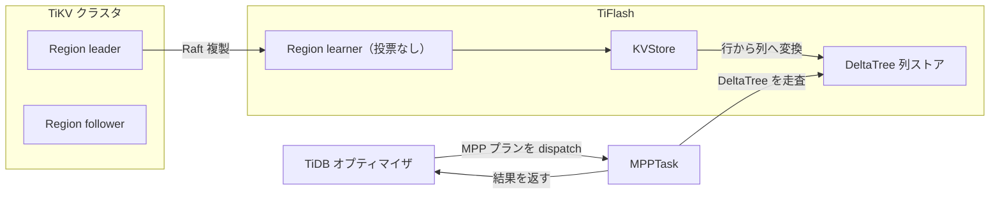

# 第3章 TiDB、TiKV との関係（MPP と learner replica）

> **本章で読むソース**
>
> - [`dbms/src/Storages/KVStore/KVStore.h`](https://github.com/pingcap/tiflash/blob/v8.5.6/dbms/src/Storages/KVStore/KVStore.h)
> - [`dbms/src/Storages/KVStore/Region.h`](https://github.com/pingcap/tiflash/blob/v8.5.6/dbms/src/Storages/KVStore/Region.h)
> - [`dbms/src/Flash/Mpp/MPPTask.h`](https://github.com/pingcap/tiflash/blob/v8.5.6/dbms/src/Flash/Mpp/MPPTask.h)

## この章の狙い

TiFlash は単独で動くデータベースではなく、TiKV から複製を受け、TiDB からクエリを受けて初めて役に立つ。
本章は、その2つの接続を**書き込み軸**と**読み取り軸**に分けて読む。
書き込み軸では、TiFlash が各 Region の Raft learner として TiKV から変更を受け取り、行データを列指向に直して列ストアへ書く道筋を追う。
読み取り軸では、TiDB のオプティマイザが分析クエリに TiFlash を選んだとき、MPP プランがどこで受け止められて分散実行されるかを追う。
クラスの細部は後続の部に譲り、本章では2つの軸の境界面だけを確定する。

## 前提

Region と Peer、Raft のリーダーとフォロワーといった用語は TiKV 編で定義済みとする。
TiFlash はそのクラスタに learner として加わる側であり、Raft 自体の合意手続きは TiKV が回す。
TiDB のオプティマイザが行ストアと列ストアのどちらを選ぶかは TiDB 編で扱う。
列ストア DeltaTree への書き込みの内部と MPP の分散実行は、本書の後続の部に譲る。

次の図は、書き込み軸と読み取り軸が TiFlash の同じ列ストアに向かって合流する様子を示す。



## 書き込み軸：Raft learner として複製を受ける

TiFlash 側でこの store が抱える Region の集合を保持し、Raft の複製とトランザクションを束ねるのが **`KVStore`** である。

[`dbms/src/Storages/KVStore/KVStore.h` L123-L131](https://github.com/pingcap/tiflash/blob/v8.5.6/dbms/src/Storages/KVStore/KVStore.h#L123-L131)

```cpp
/// KVStore manages raft replication and transactions.
/// - Holds all regions in this TiFlash store.
/// - Manages region -> table mapping.
/// - Manages persistence of all regions.
/// - Implements learner read.
/// - Wraps FFI interfaces.
/// - Use `Decoder` to transform row format into col format.
class KVStore final : private boost::noncopyable
{
```

クラスのコメントが役割を列挙している。
この store が抱えるすべての Region を保持し、Region から table への対応を管理し、learner read を実装し、`Decoder` で行フォーマットを列フォーマットへ変換する。
最後の一点が、TiKV から行で届いた変更を列に直すという、TiFlash を列指向たらしめる境界面である。

Raft の書き込みコマンドは、TiKV の proxy 経由で `handleWriteRaftCmd` に届く。

[`dbms/src/Storages/KVStore/KVStore.h` L173-L178](https://github.com/pingcap/tiflash/blob/v8.5.6/dbms/src/Storages/KVStore/KVStore.h#L173-L178)

```cpp
    EngineStoreApplyRes handleWriteRaftCmd(
        const WriteCmdsView & cmds,
        UInt64 region_id,
        UInt64 index,
        UInt64 term,
        TMTContext & tmt);
```

`region_id` で適用先の Region を引き、`index` と `term` でどこまで適用したかを進める。
適用そのものは、対象の `Region` が引き受ける。

**`Region`** は1つの Region 分の KV データを保持する単位であり、その Region への書き込みコマンドを `handleWriteRaftCmd` で適用する。

[`dbms/src/Storages/KVStore/Region.h` L248-L252](https://github.com/pingcap/tiflash/blob/v8.5.6/dbms/src/Storages/KVStore/Region.h#L248-L252)

```cpp
    std::pair<EngineStoreApplyRes, DM::WriteResult> handleWriteRaftCmd(
        const WriteCmdsView & cmds,
        UInt64 index,
        UInt64 term,
        TMTContext & tmt);
```

戻り値の `DM::WriteResult` が、適用した変更が列ストア側の DeltaMerge への書き込みへつながることを示す。
ここで行から列への変換が起き、結果は列指向の DeltaTree に積まれる。
変換と書き込みの内部は[第11章](../part02-raft-learner/11-kvstore-and-region.md)で読む。

TiFlash が各 Region に対して持つ Peer は、投票しない learner である。

[`dbms/src/Storages/KVStore/Region.h` L302-L306](https://github.com/pingcap/tiflash/blob/v8.5.6/dbms/src/Storages/KVStore/Region.h#L302-L306)

```cpp
    // As the placement-rules created for TiFlash, the Region peers
    // in TiFlash must and only response to one <keyspace, table_id>
    // The keyspace_id, table_id this region is belong to
    const KeyspaceID keyspace_id;
    const TableID mapped_table_id;
```

コメントのとおり、TiFlash 用の placement rule で作られた Region の Peer は、1つの `<keyspace, table_id>` だけに対応する。
列ストアにしたいテーブルへ learner の Peer を足すという形で、複製の経路が張られる。

### なぜ learner にするか

OLTP の書き込みは、TiKV のリーダーとフォロワーによる Raft 合意で確定する。
TiFlash の Peer を learner にすると、その合意の定足数に加わらない。
したがって列ストアの更新がどれだけ遅れても、書き込みの確定を待たせない。
learner は確定済みのログを非同期に受け取り、列ストアを後から最新化する。
取引のための書き込み経路と、分析のための列ストア更新を、この一点で切り離している。

## 読み取り軸：MPP で分析クエリを分散実行する

TiDB のオプティマイザが分析クエリに TiFlash を選ぶと、TiDB は MPP プランを作って TiFlash 群へ配る。
受け口は `Flash` サービスで、配られたタスク1つを **`MPPTask`** が表す。

[`dbms/src/Flash/Mpp/MPPTask.h` L68-L71](https://github.com/pingcap/tiflash/blob/v8.5.6/dbms/src/Flash/Mpp/MPPTask.h#L68-L71)

```cpp
class MPPTask
    : public std::enable_shared_from_this<MPPTask>
    , private boost::noncopyable
{
```

1つの `MPPTask` が、TiDB から配られた1つのタスクの実行を担う。

[`dbms/src/Flash/Mpp/MPPTask.h` L99-L101](https://github.com/pingcap/tiflash/blob/v8.5.6/dbms/src/Flash/Mpp/MPPTask.h#L99-L101)

```cpp
    void prepare(const mpp::DispatchTaskRequest & task_request);

    void run();
```

TiDB から届く `mpp::DispatchTaskRequest` を `prepare` が受け取り、`run` が実行を回す。
タスクどうしは tunnel で中間結果をやり取りし、複数の TiFlash ノードにまたがって1つのクエリを分散実行する。
プランの分割や tunnel の仕組みは[第18章](../part04-mpp/18-what-is-mpp.md)で読む。

## 機構の工夫：合意経路から切り離し、Raft の index で鮮度を保つ

learner replica の設計は、列ストアの更新を OLTP の合意経路から外す。
これで分析側の重い書き込みが取引側のレイテンシに干渉しない。
代わりに、learner は非同期に追いつくため、読み取りの時点で最新まで適用済みとは限らないという弱さを抱える。
TiFlash はこのずれを Raft の index で埋める。

[`dbms/src/Storages/KVStore/Region.h` L229-L236](https://github.com/pingcap/tiflash/blob/v8.5.6/dbms/src/Storages/KVStore/Region.h#L229-L236)

```cpp
    // Check if we can read by this index.
    bool checkIndex(UInt64 index) const;
    // Return <WaitIndexStatus, time cost(seconds)> for wait-index.
    std::tuple<WaitIndexStatus, double> waitIndex(
        UInt64 index,
        UInt64 timeout_ms,
        std::function<bool(void)> && check_running,
        const LoggerPtr & log);
```

`checkIndex` は与えた index まで適用済みかを判定し、`waitIndex` はそこへ達するまでスリープして待つ。
TiFlash は TiKV のリーダーから読み取りに必要な index を受け取り、自分の learner がその index まで追いつくのを `waitIndex` で待ってから読む。
合意経路から切り離して分析と取引の干渉を避けつつ、Raft の整合性で読み取りの鮮度を保つというのが、この設計の要点である。
learner read の詳細は[第13章](../part02-raft-learner/13-learner-read.md)で扱う。

## まとめ

TiFlash と TiKV、TiDB の接続は、書き込み軸と読み取り軸の2つで読める。
書き込み軸では、`KVStore` と `Region` が Raft learner として TiKV から変更を受け、`DM::WriteResult` を経て行を列指向の DeltaTree へ直す。
読み取り軸では、TiDB のオプティマイザが配る MPP プランを `MPPTask` が受け、TiFlash 群で分散実行する。
learner にすることで列ストアの更新を OLTP の合意経路から切り離し、`waitIndex` による index 合わせで鮮度を保つ。

## 関連する章

- [第1章 TiFlash とは何か](01-what-is-tiflash.md)：TiFlash の位置づけと全体像。
- [第11章 KVStore と Region](../part02-raft-learner/11-kvstore-and-region.md)：書き込み軸の内部、行から列への変換。
- [第18章 MPP とは](../part04-mpp/18-what-is-mpp.md)：読み取り軸の内部、プラン分割と tunnel。
- [第13章 learner read と読み取り一貫性](../part02-raft-learner/13-learner-read.md)：index 合わせによる鮮度の保証。
- [TiKV 編 第8章 Region と Peer](../../tikv/part02-raft/08-region-and-peer.md)：learner が加わる Raft の Region と Peer。
- [TiDB 編 第11章 エンジン選択と MPP プラン](../../tidb/part02-optimizer/11-engine-selection-and-mpp.md)：オプティマイザが TiFlash と MPP を選ぶ仕組み。
