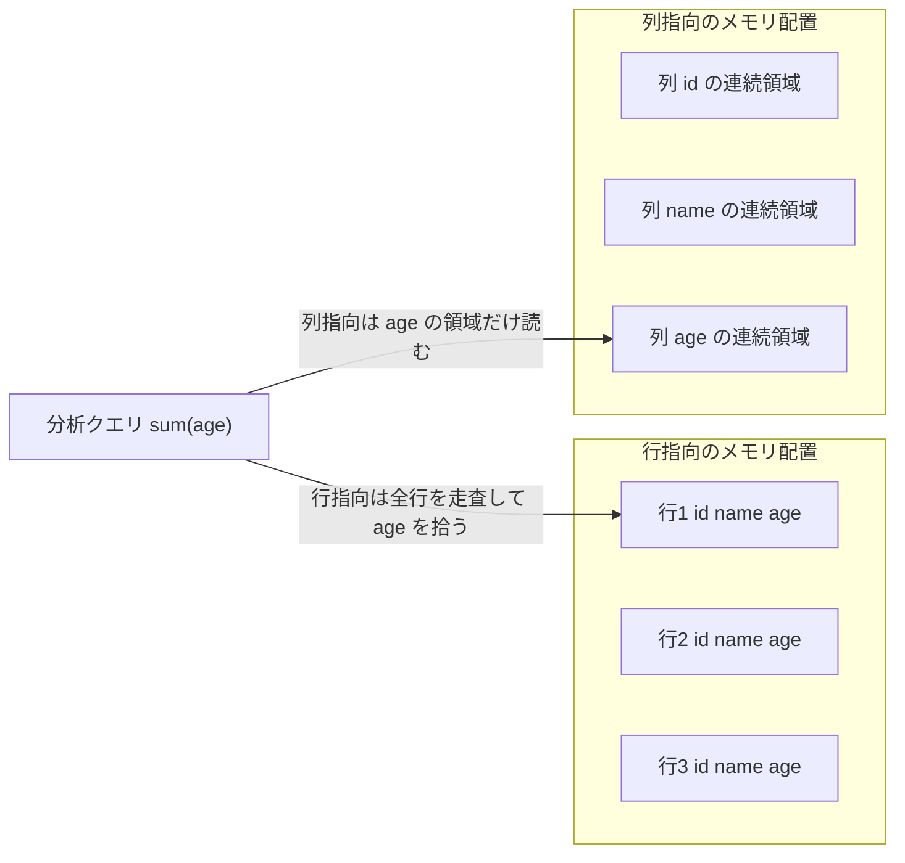

# 第4章 なぜ列指向が OLAP に速いか

> **本章で読むソース**
>
> - [`dbms/src/Core/Block.h`](https://github.com/pingcap/tiflash/blob/v8.5.6/dbms/src/Core/Block.h#L30-L46)
> - [`dbms/src/Columns/IColumn.h`](https://github.com/pingcap/tiflash/blob/v8.5.6/dbms/src/Columns/IColumn.h#L40-L57)
> - [`dbms/src/Columns/IColumn.h`](https://github.com/pingcap/tiflash/blob/v8.5.6/dbms/src/Columns/IColumn.h#L280-L286)
> - [`dbms/src/Columns/ColumnVector.h`](https://github.com/pingcap/tiflash/blob/v8.5.6/dbms/src/Columns/ColumnVector.h#L166-L183)
> - [`dbms/src/Columns/ColumnVector.h`](https://github.com/pingcap/tiflash/blob/v8.5.6/dbms/src/Columns/ColumnVector.h#L400-L403)
> - [`dbms/src/Storages/DeltaMerge/DeltaMergeStore.h`](https://github.com/pingcap/tiflash/blob/v8.5.6/dbms/src/Storages/DeltaMerge/DeltaMergeStore.h#L467-L482)

## この章の狙い

分析クエリが行指向より列指向で速くなる理由を、TiFlash の実コードに即して読む。
TiFlash は ClickHouse 由来の列指向メモリ表現をそのまま受け継いでおり、その最小単位が `IColumn` と `Block` である。
本章はこの2つの型がメモリ上で値をどう並べるかを確認し、そこから速さの理由を3つ機構レベルで導く。
第1部の以降の章で読む DeltaTree の内部構造は、ここで確認する列指向の表現を前提とする。

## 前提

TiFlash の C++ 本体は `dbms/src` 以下にあり、列の集合を表す型は `Core`、1列を表す型は `Columns` に置かれる。
本章のコード引用はすべて pingcap/tiflash のタグ `v8.5.6` に固定する。
TiFlash の位置付けと層の地図は [第2章](../part00-overview/02-architecture.md) で確認したため、ここでは前提とする。
読者には C++ と列指向データベースの基礎を仮定する。

## 列指向の表現

列指向の出発点は、1列の値をまとめて1つのオブジェクトに持つことである。
その抽象が `IColumn` であり、宣言の冒頭が役割を端的に示す。

[`dbms/src/Columns/IColumn.h`](https://github.com/pingcap/tiflash/blob/v8.5.6/dbms/src/Columns/IColumn.h#L40-L57)

```cpp
/// Declares interface to store columns in memory.
class IColumn : public COWPtr<IColumn>
{
private:
    friend class COWPtr<IColumn>;

    /// Creates the same column with the same data.
    /// This is internal method to use from COWPtr.
    /// It performs shallow copy with copy-ctor and not useful from outside.
    /// If you want to copy column for modification, look at 'mutate' method.
    virtual MutablePtr clone() const = 0;

public:
    /// Name of a Column. It is used in info messages.
    virtual std::string getName() const { return getFamilyName(); }

    /// Name of a Column kind, without parameters (example: FixedString, Array).
    virtual const char * getFamilyName() const = 0;
```

`IColumn` は1列分の値の並びをメモリ上に保持するインターフェースを宣言する。
コメントの `store columns in memory` が示すとおり、値は列ごとにまとめて格納される。
この抽象の具体的な実体が、整数や浮動小数点の列を表す `ColumnVector` である。

[`dbms/src/Columns/ColumnVector.h`](https://github.com/pingcap/tiflash/blob/v8.5.6/dbms/src/Columns/ColumnVector.h#L166-L183)

```cpp
/** A template for columns that use a simple array to store.
  */
template <typename T>
class ColumnVector final : public COWPtrHelper<ColumnVectorHelper, ColumnVector<T>>
{
    static_assert(!IsDecimal<T>);

private:
    friend class COWPtrHelper<ColumnVectorHelper, ColumnVector<T>>;

    using Self = ColumnVector<T>;

    struct less;
    struct greater;

public:
    using value_type = T;
    using Container = PaddedPODArray<value_type>;
```

`ColumnVector<T>` は型 `T` の値を `PaddedPODArray<value_type>` という単純な配列に詰めて持つ。
配列は同じ型の値を隙間なく連続して並べるため、1列のデータがメモリ上で1つの連続領域になる。
可変長の文字列を持つ `ColumnString` でも、文字の実体を1つのバッファに連結し、各文字列の境界を別の添字配列で持つことで、列の値をまとめて連続配置する。

この1列の表現を束ねたものが `Block` であり、列指向のデータ処理の単位となる。

[`dbms/src/Core/Block.h`](https://github.com/pingcap/tiflash/blob/v8.5.6/dbms/src/Core/Block.h#L30-L46)

```cpp
/** Container for set of columns for bunch of rows in memory.
  * This is unit of data processing.
  * Also contains metadata - data types of columns and their names
  *  (either original names from a table, or generated names during temporary calculations).
  * Allows to insert, remove columns in arbitary position, to change order of columns.
  */

class Context;

class Block
{
private:
    using Container = ColumnsWithTypeAndName;
    using IndexByName = std::map<String, size_t>;

    Container data;
    IndexByName index_by_name;
```

`Block` はコメントどおり `set of columns for bunch of rows`、すなわち一定行数ぶんの複数の列をまとめて持つ容器である。
実体は `ColumnsWithTypeAndName` の配列で、各要素は列のデータと型と名前を1つにまとめた組である。
名前から位置を引く `index_by_name` を併せ持つため、列は名前でも添字でも参照できる。
ここで押さえるべき構造は、`Block` が行を1つずつ並べるのではなく、列の連続領域を横に並べて持つ点である。

## 行指向と列指向のメモリ配置

行指向と列指向の違いは、同じ表をメモリ上にどの順で並べるかにある。
行指向は1行ぶんの全列の値を隣り合わせに置き、次の行をその後ろに続ける。
列指向は1列ぶんの全行の値を隣り合わせに置き、次の列をその後ろに続ける。
この配置の差を、`age` 列だけを集計するクエリの動きとともに図に示す。



行指向では `age` だけが欲しくても、各行に混在する `id` と `name` を巻き込んで全行を読む。
列指向では `age` の連続領域だけを読み、ほかの列の領域には一度もアクセスしない。
この差が、次に述べる速さの理由の土台になる。

## 必要な列だけ読む

分析クエリは、広い表のうち少数の列に集約や絞り込みをかけることが多い。
列指向では列ごとに連続配置するため、クエリが読む少数の列だけを読み出し、残りの列の I/O を丸ごと省ける。
TiFlash の読み取り入口 `DeltaMergeStore::read` は、この「読む列の指定」を引数で受け取る。

[`dbms/src/Storages/DeltaMerge/DeltaMergeStore.h`](https://github.com/pingcap/tiflash/blob/v8.5.6/dbms/src/Storages/DeltaMerge/DeltaMergeStore.h#L467-L482)

```cpp
    BlockInputStreams read(
        const Context & db_context,
        const DB::Settings & db_settings,
        const ColumnDefines & columns_to_read,
        const RowKeyRanges & sorted_ranges,
        size_t num_streams,
        UInt64 start_ts,
        const PushDownFilterPtr & filter,
        const RuntimeFilteList & runtime_filter_list,
        int rf_max_wait_time_ms,
        const String & tracing_id,
        const DMReadOptions & read_opts = {},
        size_t expected_block_size = DEFAULT_BLOCK_SIZE,
        const SegmentIdSet & read_segments = {},
        size_t extra_table_id_index = InvalidColumnID,
        ScanContextPtr scan_context = nullptr);
```

`columns_to_read` が読む列だけを名指しし、`read` はそれらの列だけを連続領域から取り出して返す。
表が100列あっても2列しか要らないクエリなら、残り98列のディスク I/O とメモリ展開がそのまま消える。
これが列指向の最初の速さであり、機構としては「列ごとの連続配置によって、要らない列の読み出しを物理的に省略できる」ことに帰着する。

## ベクトル化が効く

第2の理由は、同じ型の値が連続するため、1命令で複数の値をまとめて処理しやすいことである。
`IColumn` の操作は要素を1個ずつ扱う形ではなく、列の範囲をまとめて処理する形で定義される。

[`dbms/src/Columns/IColumn.h`](https://github.com/pingcap/tiflash/blob/v8.5.6/dbms/src/Columns/IColumn.h#L280-L286)

```cpp
    using Filter = PaddedPODArray<UInt8>;
    virtual Ptr filter(const Filter & filt, ssize_t result_size_hint) const = 0;

    /// Permutes elements using specified permutation. Is used in sortings.
    /// limit - if it isn't 0, puts only first limit elements in the result.
    using Permutation = PaddedPODArray<size_t>;
    virtual Ptr permute(const Permutation & perm, size_t limit) const = 0;
```

`WHERE` の絞り込みに使う `filter` も、並べ替えに使う `permute` も、列1本ぶんをまとめて受け取り、まとめて結果列を返す。
1行ごとに仮想関数を呼ぶ代わりに、列の配列を1回の呼び出しで舐めるため、関数呼び出しと分岐の回数が行数ぶんから列数ぶんへ減る。
連続配置はループの中身も速くする。

[`dbms/src/Columns/ColumnVector.h`](https://github.com/pingcap/tiflash/blob/v8.5.6/dbms/src/Columns/ColumnVector.h#L400-L403)

```cpp
    bool isFixedAndContiguous() const override { return true; }
    size_t sizeOfValueIfFixed() const override { return sizeof(T); }

    StringRef getRawData() const override { return StringRef(reinterpret_cast<const char *>(data.data()), byteSize()); }
```

`ColumnVector` は `isFixedAndContiguous` が真であり、`getRawData` が列全体を1つの連続バイト列として返す。
値が固定長で隙間なく並ぶため、加算や比較のループは規則的なメモリアクセスになり、コンパイラの自動ベクトル化と SIMD が効く。
行指向のように1行ごとに型の違う値が交互に現れる配置では、この連続したループを組みにくい。
ベクトル化実行の詳細は [第14章](../part03-engine/14-vectorized-block.md) で読む。

## 圧縮が効く

第3の理由は、同じ列の値は型と意味がそろっていて似通うため、圧縮率が高いことである。
1つの列には同じ列定義の値だけが並ぶので、桁数や値域が近く、差分や繰り返しが多い。
そのため連長圧縮や辞書圧縮、基準値からの差分符号化が効きやすく、ディスク上の容量と読み出しのバイト数を同時に減らせる。
行指向のように整数と文字列と日付が1行に混在する並びでは、この性質を引き出しにくい。
ディスク上の列をどう圧縮して持つかは、DeltaTree の確定データ層を読む後続の章で扱う。

## 読み取りが Block 単位で流れる

ここまでの3つの理由は、読み取りが列の束を単位に流れることで実行エンジンへつながる。
`DeltaMergeStore::read` の戻り値の型は `BlockInputStreams` であり、ストレージは行を1つずつではなく `Block`、すなわち列の束を順に吐き出す。
上流のフィルタや集約や結合は、この `Block` を受け取って列単位で処理し、結果をまた `Block` として下流へ渡す。
読み出しから演算までを通して列の連続領域が保たれるため、必要な列だけを読む利点も、ベクトル化の利点も、途中で行へ崩れることなく実行エンジンの末端まで届く。
`DeltaMergeStore` がこの `Block` の流れをどう組み立てるかは [第5章](05-deltamergestore.md) で読む。

## まとめ

列指向の表現は、`IColumn` が1列の値を連続して持ち、`Block` がその列を束ねる構造に集約される。
この配置から速さの理由が3つ導かれる。
必要な列だけを連続領域から読み、要らない列の I/O を丸ごと省けること。
同じ型の値が連続するため、列範囲をまとめて舐めるループに SIMD が効くこと。
同じ列の値が似通うため、圧縮率が高くディスクと読み出しのバイト数を減らせること。
TiFlash の読み取りは `DeltaMergeStore::read` が `BlockInputStreams` として列の束を返し、この3つの利点を実行エンジンの末端まで保ったまま運ぶ。

## 関連する章

- [ClickHouse 派生のアーキテクチャ](../part00-overview/02-architecture.md)：`Block` と `IColumn` が実行エンジンの中核である位置付けを扱う。
- [DeltaMergeStore 概観](05-deltamergestore.md)：列の束 `Block` を返す読み取り入口の内部構造を読む。
- [ベクトル化実行（Block、IColumn、DataType）](../part03-engine/14-vectorized-block.md)：列をまとめて処理するベクトル化実行を読む。
