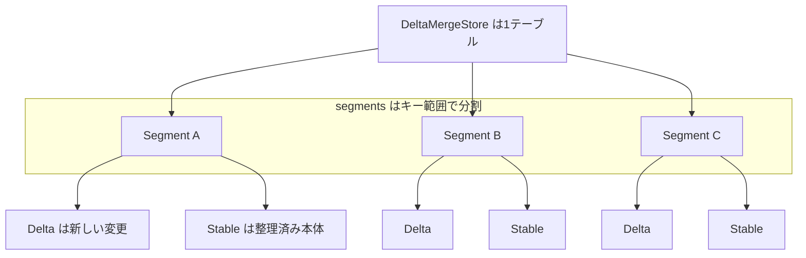

# 第5章 DeltaMergeStore 概観

> **本章で読むソース**
>
> - [`dbms/src/Storages/DeltaMerge/DeltaMergeStore.h`](https://github.com/pingcap/tiflash/blob/v8.5.6/dbms/src/Storages/DeltaMerge/DeltaMergeStore.h#L357-L361)
> - [`dbms/src/Storages/DeltaMerge/DeltaMergeStore.h`](https://github.com/pingcap/tiflash/blob/v8.5.6/dbms/src/Storages/DeltaMerge/DeltaMergeStore.h#L463-L482)
> - [`dbms/src/Storages/DeltaMerge/DeltaMergeStore.h`](https://github.com/pingcap/tiflash/blob/v8.5.6/dbms/src/Storages/DeltaMerge/DeltaMergeStore.h#L378-L382)
> - [`dbms/src/Storages/DeltaMerge/DeltaMergeStore.h`](https://github.com/pingcap/tiflash/blob/v8.5.6/dbms/src/Storages/DeltaMerge/DeltaMergeStore.h#L245-L253)
> - [`dbms/src/Storages/DeltaMerge/DeltaMergeStore.h`](https://github.com/pingcap/tiflash/blob/v8.5.6/dbms/src/Storages/DeltaMerge/DeltaMergeStore.h#L996-L999)
> - [`dbms/src/Storages/DeltaMerge/DeltaMergeStore.cpp`](https://github.com/pingcap/tiflash/blob/v8.5.6/dbms/src/Storages/DeltaMerge/DeltaMergeStore.cpp#L702-L715)
> - [`dbms/src/Storages/DeltaMerge/Segment.h`](https://github.com/pingcap/tiflash/blob/v8.5.6/dbms/src/Storages/DeltaMerge/Segment.h#L77-L84)
> - [`dbms/src/Storages/DeltaMerge/Segment.h`](https://github.com/pingcap/tiflash/blob/v8.5.6/dbms/src/Storages/DeltaMerge/Segment.h#L847-L856)

## この章の狙い

TiFlash の列指向ストレージエンジンである **DeltaTree** の入口クラス `DeltaMergeStore` を読み、テーブルがどのような構造で保持され、書き込みと読み取りがどこを通るかを確定させる。
DeltaTree は ClickHouse の `MergeTree` とは別物の独自実装であり、TiDB のトランザクションと整合する MVCC を持ちながら、列指向のまま頻繁な更新を受け入れる。
本章はその全体像を `DeltaMergeStore` の宣言と `write`／`read`／`ingestFiles` の入口に即して描き、レイヤや Segment の内部は後続の章へ譲る。

## 前提

TiFlash は TiKV から Raft の learner として行データの複製を受け取り、列形式へ変換してから DeltaTree へ書き込む。
DeltaTree のコードは `dbms/src/Storages/DeltaMerge` 以下に置かれ、その入口が `DeltaMergeStore` である。
列指向がなぜ解析クエリに速いかは [第4章](04-why-columnar.md) で扱ったため、本章では前提とする。
本章のコード引用はすべて pingcap/tiflash のタグ `v8.5.6` に固定し、読者には C++ と列指向データベースの基礎を仮定する。

## Delta-Main 構造で書き込みと読み取りを分ける

DeltaTree の土台にあるのは **Delta-Main 構造**である。
新しい変更はまず **Delta**（最近の追記を軽く溜めるレイヤ）に追記し、読み取りのときに Delta と **Stable**（整理済みの本体を保つレイヤ）を重ねて1つの最新像として見せる。
書き込みは追記だけで済ませ、両者を突き合わせて整理する重い作業はバックグラウンドへ回す。

この役割分担は LSM-tree に似る。
LSM-tree も新しい書き込みを上位の層へ追記し、読み取りで複数の層を重ね、コンパクションで下位へ畳む。
違いは、DeltaTree が行ではなく列の塊を扱う点にあり、Stable は列指向ファイルとして並ぶ。
LSM-tree そのものの機構は RocksDB を読む別の本に譲る（TiFlash の Stable と Delta の最下層は [第8章](08-stable-and-dtfile.md) と [第7章](07-delta-and-columnfile.md) で扱う）。

## テーブルを Segment のキー範囲に分ける

`DeltaMergeStore` は1つのテーブルを表し、そのテーブルを **Segment**（連続するキー範囲を受け持つ単位）の列に分けて保持する。
Segment の定義はその宣言の直前のコメントに示される。

[`dbms/src/Storages/DeltaMerge/Segment.h`](https://github.com/pingcap/tiflash/blob/v8.5.6/dbms/src/Storages/DeltaMerge/Segment.h#L77-L84)

```cpp
/// A segment contains many rows of a table. A table is split into segments by consecutive ranges.
///
/// The data of stable value space is stored in "data" storage, while data of delta value space is stored in "log" storage.
/// And all meta data is stored in "meta" storage.
class Segment
    : public std::enable_shared_from_this<Segment>
    , private boost::noncopyable
{
```

テーブルは連続するキー範囲ごとに Segment へ切り分けられ、Stable のデータは `data` ストレージに、Delta のデータは `log` ストレージに、メタ情報は `meta` ストレージに置かれる。
`DeltaMergeStore` はこの Segment を、範囲の終端をキーにしたソート済みのマップで保持する。

[`dbms/src/Storages/DeltaMerge/DeltaMergeStore.h`](https://github.com/pingcap/tiflash/blob/v8.5.6/dbms/src/Storages/DeltaMerge/DeltaMergeStore.h#L996-L999)

```cpp
    /// end of range -> segment
    SegmentSortedMap segments;
    /// Mainly for debug.
    SegmentMap id_to_segment;
```

`segments` は範囲の終端から Segment を引くソート済みマップであり、あるキーを含む Segment を範囲検索で特定できる。
このため書き込みも読み取りも、対象のキー範囲に重なる Segment だけを選んで処理できる。
Segment の分割と併合、範囲の管理の詳細は [第6章](06-segment.md) で読む。

## 各 Segment が Delta と Stable を重ねて持つ

各 Segment は、自分の受け持つキー範囲に対する Delta と Stable を1つずつ抱える。
その実体は `Segment` のメンバとして並ぶ。

[`dbms/src/Storages/DeltaMerge/Segment.h`](https://github.com/pingcap/tiflash/blob/v8.5.6/dbms/src/Storages/DeltaMerge/Segment.h#L847-L856)

```cpp
    RowKeyRange rowkey_range;
    bool is_common_handle;
    size_t rowkey_column_size;
    const PageIdU64 segment_id;
    const PageIdU64 next_segment_id;

    std::atomic<DB::Timestamp> last_check_gc_safe_point = 0;

    const DeltaValueSpacePtr delta;
    const StableValueSpacePtr stable;
```

`rowkey_range` がこの Segment の受け持つキー範囲を表し、`delta` と `stable` がその範囲のデータを二層で保持する。
`DeltaValueSpace` が Delta レイヤを、`StableValueSpace` が Stable レイヤを担い、片方に新しい変更を、もう片方に整理済みの本体を置く。
Delta の内部構造は [第7章](07-delta-and-columnfile.md) で、Stable の内部構造は [第8章](08-stable-and-dtfile.md) で読む。

この構造を図にすると次のようになる。



`DeltaMergeStore` がテーブルを Segment の列へ分け、各 Segment が Delta と Stable を重ねて持つ。
この二層をキー範囲ごとに独立させたことで、ある範囲への集中した更新を、その範囲の Segment の中だけで処理できる。

## 書き込み write は変更を Delta へ追記する

書き込みの入口は `write` である。
TiFlash は learner として受けた変更を列形式の `Block` に詰め、この `write` へ渡す。

[`dbms/src/Storages/DeltaMerge/DeltaMergeStore.h`](https://github.com/pingcap/tiflash/blob/v8.5.6/dbms/src/Storages/DeltaMerge/DeltaMergeStore.h#L357-L361)

```cpp
    DM::WriteResult write(
        const Context & db_context,
        const DB::Settings & db_settings,
        Block & block,
        const RegionAppliedStatus & applied_status = {});
```

`write` は1つの `Block` を受け取り、それを Segment 単位に切り分けて、各 Segment の Delta レイヤへ追記する。
入力の `Block` は handle とバージョンの昇順に整列され、先頭のキーから順に、そのキーを含む Segment を `segments` から引いて書き込む。
1つの `Block` が複数の Segment の範囲にまたがるときは、Segment の境界で切り分けて、範囲ごとに対応する Segment へ追記する。

## 小さな書き込みを Delta キャッシュへ、大きな書き込みをディスクへ

`write` は追記する塊の大きさで経路を二つに分ける。
これが Delta-Main 構造を列指向ストアで成立させる工夫である。

[`dbms/src/Storages/DeltaMerge/DeltaMergeStore.cpp`](https://github.com/pingcap/tiflash/blob/v8.5.6/dbms/src/Storages/DeltaMerge/DeltaMergeStore.cpp#L702-L715)

```cpp
            bool is_small = limit < dm_context->delta_cache_limit_rows / 4
                && alloc_bytes < dm_context->delta_cache_limit_bytes / 4;
            // For small column files, data is appended to MemTableSet, then flushed later.
            // For large column files, data is directly written to PageStorage, while the ColumnFile entry is appended to MemTableSet.
            if (is_small)
            {
                if (segment->writeToCache(*dm_context, block, offset, limit))
                {
                    GET_METRIC(tiflash_storage_subtask_throughput_bytes, type_write_to_cache).Increment(alloc_bytes);
                    GET_METRIC(tiflash_storage_subtask_throughput_rows, type_write_to_cache).Increment(limit);
                    updated_segments.push_back(segment);
                    break;
                }
            }
```

`is_small` は、追記する行数とバイト数がしきい値の4分の1に満たないかを判定する。
小さい塊のときは `writeToCache` でメモリ上の `MemTableSet` に追記し、ディスクへの書き出しは後でまとめて行う。
大きい塊のときは `writeToDisk` で `PageStorage` へ直接書き、列ファイルの実体をその場でディスクに落とす。
小さな更新を逐一ディスクに書かずメモリに溜めることで、列指向ストアでも頻繁で細かな更新を低コストで捌ける。
細かな書き込みが大量のファイル断片を生むのを避け、後続のバックグラウンド処理で大きな塊へまとめる前提が、この経路の分岐に表れている。

## 読み取り read は Delta と Stable を重ねて返す

読み取りの入口は `read` である。
解析クエリは読む列とキー範囲とスナップショット時刻を指定し、結果を `BlockInputStreams` として受け取る。

[`dbms/src/Storages/DeltaMerge/DeltaMergeStore.h`](https://github.com/pingcap/tiflash/blob/v8.5.6/dbms/src/Storages/DeltaMerge/DeltaMergeStore.h#L463-L482)

```cpp
    /// Read rows in two modes:
    ///     when is_fast_scan == false, we will read rows with MVCC filtering, del mark !=0  filter and sorted merge.
    ///     when is_fast_scan == true, we will read rows without MVCC and sorted merge.
    /// `sorted_ranges` should be already sorted and merged.
    BlockInputStreams read(
        const Context & db_context,
        const DB::Settings & db_settings,
        const ColumnDefines & columns_to_read,
        const RowKeyRanges & sorted_ranges,
        size_t num_streams,
        UInt64 start_ts,
        const PushDownFilterPtr & filter,
        const RuntimeFilteList & runtime_filter_list,
        int rf_max_wait_time_ms,
        const String & tracing_id,
        const DMReadOptions & read_opts = {},
        size_t expected_block_size = DEFAULT_BLOCK_SIZE,
        const SegmentIdSet & read_segments = {},
        size_t extra_table_id_index = InvalidColumnID,
        ScanContextPtr scan_context = nullptr);
```

`columns_to_read` が読む列だけを指定し、`sorted_ranges` が読むキー範囲を、`start_ts` が MVCC のスナップショット時刻を、`filter` がフィルタの押し下げを受け取る。
`read` はまず `sorted_ranges` に重なる Segment を選び、Segment ごとに読み取りタスクを作る。
各タスクは、その Segment の Delta（最近の変更）と Stable（確定した本体）を重ね合わせ、`start_ts` で見えるべき版だけを残して1つの列の流れにする。
コメントが示すとおり、通常の読み取りでは MVCC のフィルタと削除マークの除外、そして整列したマージを行い、`is_fast_scan` のときはそれらを省いて素早く走査する。
読み出した列は `BlockInputStreams` として返り、ClickHouse 由来のベクトル化実行エンジンへつながる。
MVCC で版を選びながら Delta と Stable を重ねる手順の詳細は [第9章](09-delta-merge-and-mvcc.md) で読む。

## 取り込み ingestFiles でファイルを直接組み込む

`write` のほかに、列ファイルをまとめて取り込む入口として `ingestFiles` がある。

[`dbms/src/Storages/DeltaMerge/DeltaMergeStore.h`](https://github.com/pingcap/tiflash/blob/v8.5.6/dbms/src/Storages/DeltaMerge/DeltaMergeStore.h#L378-L382)

```cpp
    UInt64 ingestFiles(
        const DMContextPtr & dm_context, //
        const RowKeyRange & range,
        const std::vector<DM::ExternalDTFileInfo> & external_files,
        bool clear_data_in_range);
```

`ingestFiles` は、指定した `range` に収まる複数の外部列ファイルをまとめて DeltaTree へ組み込む。
TiKV のスナップショットを適用するときや、大量データを一括で取り込むときに使い、`Block` を1行ずつ書き直すより安く反映できる。
取り込むファイルが小さければ Delta レイヤへ足し込み、大きければ Segment を分割して Stable へ直接据える経路を選ぶ。
Raft の適用経路からこの取り込みがどう呼ばれるかは [第12章](../part02-raft-learner/12-apply-and-row-to-column.md) で扱う。

## バックグラウンドの Delta Merge と Segment の分割と併合

Delta-Main 構造は、追記で溜まった Delta をいつか Stable へ畳まなければ読み取りが重くなる。
この整理はバックグラウンドのタスクが担い、`DeltaMergeStore` はタスクの種類を列挙で持つ。

[`dbms/src/Storages/DeltaMerge/DeltaMergeStore.h`](https://github.com/pingcap/tiflash/blob/v8.5.6/dbms/src/Storages/DeltaMerge/DeltaMergeStore.h#L245-L253)

```cpp
    enum TaskType
    {
        Split,
        MergeDelta,
        Compact,
        Flush,
        PlaceIndex,
        FlushDTAndKVStore,
    };
```

`MergeDelta` が **Delta Merge**（Segment の Delta を Stable へ畳む整理）であり、これにより読み取り時に重ねる Delta が小さく保たれる。
`Split` は大きくなった Segment を二つに分け、Segment の併合はバックグラウンドの GC スレッドが連続する Segment をまとめて行う。
`Flush` はメモリ上の `MemTableSet` をディスクへ書き出し、`Compact` は Delta 内の断片化した列ファイルを束ねる。
これらは前景の書き込みや読み取りを止めずに進み、データの整理を書き込み経路から切り離す。
Delta Merge の中身は [第9章](09-delta-merge-and-mvcc.md) で、Segment の分割と併合は [第6章](06-segment.md) で読む。

## Delta-Main 構造が頻繁な更新を捌く仕組み

本章で読んだ入口は、Delta-Main 構造の一つの設計に集約できる。
書き込みは新しい変更を Delta へ軽く追記するだけで返り、重い整理を前景から外す。
読み取りは Delta と Stable を重ね、MVCC で版を選んで最新像を作る。
そして溜まった Delta は、バックグラウンドの Delta Merge が Stable へ畳んで読み取りのコストを戻す。

この分担が、列指向ストアで頻繁な更新を捌くという課題を解く。
列指向ファイルは値を列ごとに連続させて圧縮と走査を速くする代わりに、1行ずつの更新を直接当てるのが高くつく。
DeltaTree は更新を Delta への追記に置き換えて当てるコストを下げ、読み取りで重ね合わせて整合を保ち、整理を背景の Delta Merge へ回す。
キー範囲ごとに Segment を独立させたことで、この追記と整理を範囲単位で並行して進められ、テーブル全体を止めずに更新と解析を両立させる。

## まとめ

`DeltaMergeStore` は1つのテーブルを表し、テーブルを Segment のキー範囲に分け、各 Segment が Delta と Stable の二層を持つ。
書き込み `write` は変更を Delta へ追記し、小さな塊はメモリの `MemTableSet` へ、大きな塊はディスクへと経路を分ける。
読み取り `read` は対象範囲の Segment を選び、Delta と Stable を MVCC で重ねて `BlockInputStreams` として返す。
取り込み `ingestFiles` は外部の列ファイルをまとめて据え、バックグラウンドの Delta Merge と Segment の分割と併合が整理を担う。
新しい変更を Delta へ軽く追記し、読み取りで Stable と重ね、重い整理を背景へ回す Delta-Main 構造が、列指向ストアでも頻繁な更新を捌く設計の要である。

## 関連する章

- [なぜ列指向が OLAP に速いか](04-why-columnar.md)：本章が前提とする列指向の利点を扱う。
- [Segment](06-segment.md)：キー範囲の単位と分割と併合の詳細を読む。
- [Delta レイヤと ColumnFile](07-delta-and-columnfile.md)：新しい変更を溜める Delta の内部構造を読む。
- [Stable レイヤと DTFile](08-stable-and-dtfile.md)：整理済みの本体を保つ Stable の内部構造を読む。
- [Delta Merge と MVCC](09-delta-merge-and-mvcc.md)：Delta と Stable を重ねて畳む手順と MVCC を読む。
