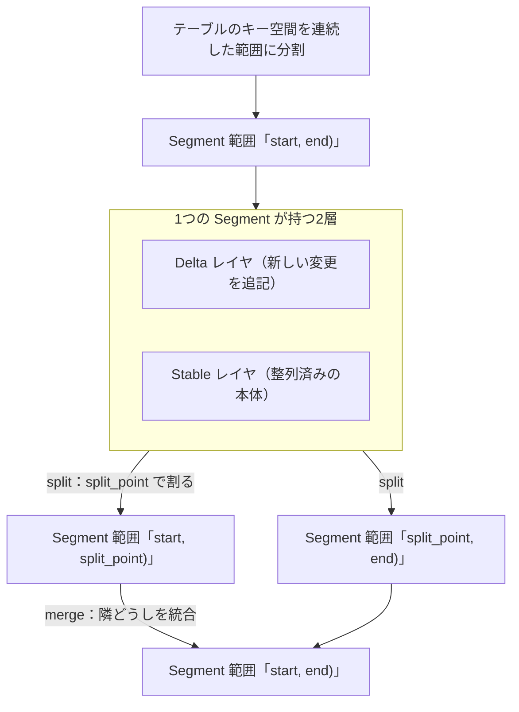

# 第6章 Segment

> **本章で読むソース**
>
> - [`dbms/src/Storages/DeltaMerge/Segment.h`](https://github.com/pingcap/tiflash/blob/v8.5.6/dbms/src/Storages/DeltaMerge/Segment.h)
> - [`dbms/src/Storages/DeltaMerge/Segment.cpp`](https://github.com/pingcap/tiflash/blob/v8.5.6/dbms/src/Storages/DeltaMerge/Segment.cpp)

## この章の狙い

前章の `DeltaMergeStore` は、1つのテーブルを丸ごと抱える入口であった。
そのテーブルを実際に区切って持つ単位が **Segment** である。
本章は、Segment が `[start, end)` という連続したキー範囲を担い、その範囲のデータを Delta と Stable の2層で保持することを読む。
さらに、範囲への読み取り `getInputStream`、範囲への書き込み、そして範囲が大きくなったり小さくなったりしたときの分割と統合を追う。
Delta レイヤと Stable レイヤの内部はそれぞれ後続の章に譲り、本章では Segment がこの2層をどう束ねて1つの範囲を成立させるかに絞る。

## 前提

`DeltaMergeStore` がテーブルを Segment の列に分けて管理することは[第5章](05-deltamergestore.md)で読んだ。
RowKey と RowKeyRange、MVCC の `start_ts` といった用語は本書のここまでで定義済みとする。
RocksDB の SST やコンパクションの機構そのものは RocksDB 編に譲る（TiKV と TiFlash の最下層は RocksDB のフォークを使う）。
Delta と Stable の中身、Delta Merge による整理の詳細は、本章のあとの章で扱う。

## Segment とは何か

Segment は、テーブルの多数の行のうち、連続したキー範囲ぶんを受け持つ単位である。
クラス冒頭のコメントが、その役割と2層構造を端的に述べている。

[`dbms/src/Storages/DeltaMerge/Segment.h` L77-L84](https://github.com/pingcap/tiflash/blob/v8.5.6/dbms/src/Storages/DeltaMerge/Segment.h#L77-L84)

```cpp
/// A segment contains many rows of a table. A table is split into segments by consecutive ranges.
///
/// The data of stable value space is stored in "data" storage, while data of delta value space is stored in "log" storage.
/// And all meta data is stored in "meta" storage.
class Segment
    : public std::enable_shared_from_this<Segment>
    , private boost::noncopyable
{
```

テーブルは連続した範囲によって Segment へ分割される。
そして Stable のデータは「data」ストレージに、Delta のデータは「log」ストレージに、メタデータは「meta」ストレージに分けて置かれる。
Stable は整理済みの本体を、Delta は新しい変更を、それぞれ別の置き場で持つという二分法が、ここで宣言されている。

メンバ変数を見ると、範囲と2層が直接フィールドとして並んでいる。

[`dbms/src/Storages/DeltaMerge/Segment.h` L847-L856](https://github.com/pingcap/tiflash/blob/v8.5.6/dbms/src/Storages/DeltaMerge/Segment.h#L847-L856)

```cpp
    RowKeyRange rowkey_range;
    bool is_common_handle;
    size_t rowkey_column_size;
    const PageIdU64 segment_id;
    const PageIdU64 next_segment_id;

    std::atomic<DB::Timestamp> last_check_gc_safe_point = 0;

    const DeltaValueSpacePtr delta;
    const StableValueSpacePtr stable;
```

`rowkey_range` がこの Segment の担う `[start, end)` である。
`segment_id` が自分の ID、`next_segment_id` が範囲の右隣の Segment の ID であり、Segment は ID で次々につながった片方向リストを成す。
そして `delta` が新しい変更を受ける **DeltaValueSpace**、`stable` が整列済みの本体を持つ **StableValueSpace** である。
このつながりが、テーブルのキー空間全体を隙間なく Segment の列で覆うことを保証する。

ここで Segment 単位に区切る狙いを述べておく。
テーブル全体を1つの塊として扱うと、どこか一部を更新するだけでも全体を相手にする処理が要る。
Segment へ区切れば、書き込みも整理も、その範囲を持つ Segment の中だけで閉じる。
これが、更新と読み取りを範囲ごとに局所化する土台になる。

次の図は、1つの Segment が `[start, end)` を Delta と Stable の2層で持ち、`split_point` で2つに割れる様子を示す。



## 読み取り：Delta と Stable を重ねて1つのストリームにする

読み取りは、まずその時点のデータを固定するスナップショットを取ることから始まる。

[`dbms/src/Storages/DeltaMerge/Segment.cpp` L917-L933](https://github.com/pingcap/tiflash/blob/v8.5.6/dbms/src/Storages/DeltaMerge/Segment.cpp#L917-L933)

```cpp
SegmentSnapshotPtr Segment::createSnapshot(const DMContext & dm_context, bool for_update, CurrentMetrics::Metric metric)
    const
{
    Stopwatch watch;
    SCOPE_EXIT({ dm_context.scan_context->create_snapshot_time_ns += watch.elapsed(); });
    auto delta_snap = delta->createSnapshot(dm_context, for_update, metric);
    auto stable_snap = stable->createSnapshot();
    if (!delta_snap || !stable_snap)
        return {};

    dm_context.scan_context->delta_rows += delta_snap->getRows();
    dm_context.scan_context->delta_bytes += delta_snap->getBytes();
    return std::make_shared<SegmentSnapshot>(
        std::move(delta_snap),
        std::move(stable_snap),
        Logger::get(dm_context.tracing_id));
}
```

`delta` と `stable` のそれぞれからスナップショットを取り、両者を1つの `SegmentSnapshot` にまとめる。
読み取りはこのスナップショット越しに進むため、走査の途中で背景の書き込みや整理が割り込んでも、見える内容は固定される。

スナップショットを使った読み取りの入口が `getInputStream` である。
読み取りモードに応じて、対応する内部メソッドへ振り分ける。

[`dbms/src/Storages/DeltaMerge/Segment.cpp` L1064-L1074](https://github.com/pingcap/tiflash/blob/v8.5.6/dbms/src/Storages/DeltaMerge/Segment.cpp#L1064-L1074)

```cpp
    switch (read_mode)
    {
    case ReadMode::Normal:
        return getInputStreamModeNormal(
            dm_context,
            columns_to_read,
            segment_snap,
            read_ranges,
            filter ? filter->rs_operator : EMPTY_RS_OPERATOR,
            start_ts,
            clipped_block_rows);
```

通常読み取りは `getInputStreamModeNormal` が引き受ける。
その本体で、Delta と Stable を重ねた1本のストリームが組み立てられる。

[`dbms/src/Storages/DeltaMerge/Segment.cpp` L1164-L1188](https://github.com/pingcap/tiflash/blob/v8.5.6/dbms/src/Storages/DeltaMerge/Segment.cpp#L1164-L1188)

```cpp
    else
    {
        stream = getPlacedStream(
            dm_context,
            *read_info.read_columns,
            real_ranges,
            filter,
            segment_snap->stable,
            read_info.getDeltaReader(need_row_id ? ReadTag::MVCC : ReadTag::Query),
            read_info.index_begin,
            read_info.index_end,
            expected_block_size,
            read_tag,
            start_ts,
            need_row_id);
    }

    stream = std::make_shared<DMRowKeyFilterBlockInputStream<true>>(stream, real_ranges, 0);
    stream = std::make_shared<DMVersionFilterBlockInputStream<DM_VERSION_FILTER_MODE_MVCC>>(
        stream,
        columns_to_read,
        start_ts,
        is_common_handle,
        dm_context.tracing_id,
        dm_context.scan_context);
```

`getPlacedStream` が、`stable` の整列済みデータの上に `delta` の変更を重ね合わせた1本のストリームを作る。
その上に2段のフィルタが乗る。
`DMRowKeyFilterBlockInputStream` が読み取り範囲の外の行を落とし、`DMVersionFilterBlockInputStream` が `start_ts` を基準に MVCC の可視性を判定して、古いバージョンや削除済みの行を除く。
読み手から見れば、Delta と Stable に分かれて置かれた同じキーの複数バージョンが、ここで1つの最新像にまとまる。

## 書き込み：Delta へ追記する

Segment への書き込みは、Stable には触れず、すべて `delta` への追記になる。

[`dbms/src/Storages/DeltaMerge/Segment.cpp` L685-L697](https://github.com/pingcap/tiflash/blob/v8.5.6/dbms/src/Storages/DeltaMerge/Segment.cpp#L685-L697)

```cpp
bool Segment::writeToDisk(DMContext & dm_context, const ColumnFilePtr & column_file)
{
    LOG_TRACE(log, "Segment write to disk, rows={} isBigFile={}", column_file->getRows(), column_file->isBigFile());
    return delta->appendColumnFile(dm_context, column_file);
}

bool Segment::writeToCache(DMContext & dm_context, const Block & block, size_t offset, size_t limit)
{
    LOG_TRACE(log, "Segment write to cache, rows={}", limit);
    if (unlikely(limit == 0))
        return true;
    return delta->appendToCache(dm_context, block, offset, limit);
}
```

`writeToDisk` はディスクへ置いた `ColumnFile` を `delta` へ追加し、`writeToCache` はメモリ上のブロックを `delta` のキャッシュへ積む。
どちらも `delta->appendXXX` を呼ぶだけで、Stable は書き換えない。
削除範囲の書き込みも `delta->appendDeleteRange` として Delta へ積まれる。
書き込みが常に Delta への追記で済むため、整列済みの Stable を毎回作り直さずに更新を受けられる。
Delta に積まれた変更を Stable へ織り込み直す処理が Delta Merge であり、[第9章](09-delta-merge-and-mvcc.md)で扱う。

## 分割と統合：範囲を割って整える

Segment は、抱えるデータが増えれば2つに割れ（split）、隣どうしが小さければ1つに統合される（merge）。
これらは本番では「prepare してから apply する」2段で実行される。
テスト用の近道である `split` が、その2段の組み合わせを1か所で見せてくれる。

[`dbms/src/Storages/DeltaMerge/Segment.cpp` L1778-L1795](https://github.com/pingcap/tiflash/blob/v8.5.6/dbms/src/Storages/DeltaMerge/Segment.cpp#L1778-L1795)

```cpp
    auto split_info_opt = prepareSplit(dm_context, schema_snap, segment_snap, opt_split_at, opt_split_mode, wbs);
    if (!split_info_opt.has_value())
        return {};

    auto & split_info = split_info_opt.value();

    wbs.writeLogAndData();
    split_info.my_stable->enableDMFilesGC(dm_context);
    split_info.other_stable->enableDMFilesGC(dm_context);

    SYNC_FOR("before_Segment::applySplit"); // pause without holding the lock on the segment

    auto lock = mustGetUpdateLock();
    auto segment_pair = applySplit(lock, dm_context, segment_snap, wbs, split_info);

    wbs.writeAll();

    return segment_pair;
```

`prepareSplit` が分割の計画である `SplitInfo` を作り、`applySplit` がそれを実際の2つの Segment へ反映する。
重い準備をロックの外で済ませ、`applySplit` だけを更新ロックの下で短く実行する形になっている。
`SplitInfo` は、どこで割るかと、割った両側の Stable を持つ。

[`dbms/src/Storages/DeltaMerge/Segment.h` L121-L128](https://github.com/pingcap/tiflash/blob/v8.5.6/dbms/src/Storages/DeltaMerge/Segment.h#L121-L128)

```cpp
    struct SplitInfo
    {
        bool is_logical;
        RowKeyValue split_point;

        StableValueSpacePtr my_stable;
        StableValueSpacePtr other_stable;
    };
```

`split_point` が分割点、`my_stable` と `other_stable` が割った左右それぞれの Stable である。
`applySplit` は、この `split_point` を境に元の範囲を2つに切る。

[`dbms/src/Storages/DeltaMerge/Segment.cpp` L2312-L2313](https://github.com/pingcap/tiflash/blob/v8.5.6/dbms/src/Storages/DeltaMerge/Segment.cpp#L2312-L2313)

```cpp
    RowKeyRange my_range(rowkey_range.start, split_info.split_point, is_common_handle, rowkey_column_size);
    RowKeyRange other_range(split_info.split_point, rowkey_range.end, is_common_handle, rowkey_column_size);
```

左側が `[start, split_point)`、右側が `[split_point, end)` となり、元の範囲を隙間なく2分する。
この2つの範囲から、新しい Segment が2つ作られる。

[`dbms/src/Storages/DeltaMerge/Segment.cpp` L2339-L2354](https://github.com/pingcap/tiflash/blob/v8.5.6/dbms/src/Storages/DeltaMerge/Segment.cpp#L2339-L2354)

```cpp
    auto new_me = std::make_shared<Segment>( //
        parent_log,
        this->epoch + 1,
        my_range,
        this->segment_id,
        other_segment_id,
        my_delta,
        split_info.my_stable);
    auto other = std::make_shared<Segment>( //
        parent_log,
        INITIAL_EPOCH,
        other_range,
        other_segment_id,
        this->next_segment_id,
        other_delta,
        split_info.other_stable);
```

左側の `new_me` は元の `segment_id` を引き継ぎ、`next_segment_id` を新設の `other` へ向ける。
右側の `other` は元の `next_segment_id` を引き継ぐ。
これで片方向リストの中に新しい Segment が1つ挟み込まれ、テーブルのキー空間の被覆は保たれる。

統合はこの逆向きである。
`prepareMerge` は、統合する Segment が範囲と ID の両面で隣接していることを最初に確かめる。

[`dbms/src/Storages/DeltaMerge/Segment.cpp` L2433-L2445](https://github.com/pingcap/tiflash/blob/v8.5.6/dbms/src/Storages/DeltaMerge/Segment.cpp#L2433-L2445)

```cpp
    for (size_t i = 1; i < ordered_segments.size(); i++)
    {
        RUNTIME_CHECK(
            ordered_segments[i - 1]->rowkey_range.getEnd() == ordered_segments[i]->rowkey_range.getStart(),
            i,
            ordered_segments[i - 1]->info(),
            ordered_segments[i]->info());
        RUNTIME_CHECK(
            ordered_segments[i - 1]->next_segment_id == ordered_segments[i]->segment_id,
            i,
            ordered_segments[i - 1]->info(),
            ordered_segments[i]->info());
    }
```

前の Segment の範囲の終端が次の Segment の範囲の始端に一致し、かつ前の `next_segment_id` が次の `segment_id` と一致することを要求する。
隣り合う Segment だけを統合し、統合後も `[start, end)` の被覆が連続することを担保している。
分割と統合をあわせると、Segment は RocksDB のコンパクションに似た役割を果たす（RocksDB のコンパクション理論は[RocksDB 編 第29章](../../../rocksdb/part05-compaction/29-compaction-theory.md)に譲る）。
大きくなった範囲を割って読み書きの粒度を保ち、小さくなった範囲をまとめて Segment の数を抑える。

## 機構の工夫：論理分割で Stable を書き直さない

分割には物理分割と論理分割があり、`applySplit` の分岐にその差が表れる。

[`dbms/src/Storages/DeltaMerge/Segment.cpp` L2315-L2322](https://github.com/pingcap/tiflash/blob/v8.5.6/dbms/src/Storages/DeltaMerge/Segment.cpp#L2315-L2322)

```cpp
    // In logical split, the newly created two segment shares the same delta column files,
    // because stable content is unmodified.
    auto [my_in_memory_files, my_persisted_files] = split_info.is_logical
        ? delta->cloneAllColumnFiles(lock, dm_context, my_range, wbs)
        : delta->cloneNewlyAppendedColumnFiles(lock, dm_context, my_range, *segment_snap->delta, wbs);
    auto [other_in_memory_files, other_persisted_files] = split_info.is_logical
        ? delta->cloneAllColumnFiles(lock, dm_context, other_range, wbs)
        : delta->cloneNewlyAppendedColumnFiles(lock, dm_context, other_range, *segment_snap->delta, wbs);
```

論理分割では、コメントのとおり Stable の中身を書き換えない。
割った2つの Segment は、同じ Stable の DTFile を範囲だけ違えて共有し、Delta の列ファイルも両側へそのまま複製する。
物理分割が範囲ごとに Stable のデータを実際に読み直して2つの DTFile へ書き分けるのに対し、論理分割は重い書き直しを避けて参照の張り替えだけで分割を終える。
分割点が決まる前提が整うとき、`prepareSplit` はまず論理分割を選び、計算に失敗したときだけ物理分割へ退避する。
テーブルのうちホットな範囲だけを軽い操作で割れるため、テーブル全体を一度に触らずに更新と読み取りの粒度を保てる。
ここが、Segment という単位がもたらす局所性の要点である。

## まとめ

Segment は、テーブルのキー空間を `[start, end)` の連続した範囲に区切る単位であり、`segment_id` と `next_segment_id` で片方向リストを成して空間全体を隙間なく覆う。
各 Segment は新しい変更を受ける Delta と整列済み本体の Stable を持ち、読み取りでは `getInputStream` が両層を重ねて MVCC フィルタ越しの1本のストリームにまとめる。
書き込みは常に Delta への追記で済み、Stable は書き換えない。
範囲が大きくなれば `split` で `split_point` を境に2つへ割り、隣どうしが小さければ `merge` で統合する。
論理分割は Stable を書き直さずに参照の張り替えで割るため、ホットな範囲だけを軽く整えられる。

## 関連する章

- [第5章 DeltaMergeStore 概観](05-deltamergestore.md)：テーブルを Segment の列として管理する入口。
- [第7章 Delta レイヤと ColumnFile](07-delta-and-columnfile.md)：Segment が新しい変更を受ける Delta レイヤの内部。
- [第8章 Stable レイヤと DTFile](08-stable-and-dtfile.md)：Segment が整列済み本体を持つ Stable レイヤと DTFile。
- [第9章 Delta Merge と MVCC](09-delta-merge-and-mvcc.md)：Delta を Stable へ織り込み直す整理と MVCC の判定。
- [RocksDB 編 第29章 コンパクションの理論](../../../rocksdb/part05-compaction/29-compaction-theory.md)：分割と統合が似た役割を果たす LSM-tree のコンパクション。
