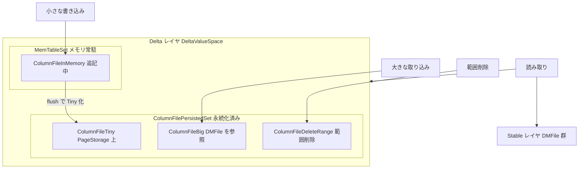

# 第7章 Delta レイヤと ColumnFile

> **本章で読むソース**
>
> - [`dbms/src/Storages/DeltaMerge/Delta/DeltaValueSpace.h`](https://github.com/pingcap/tiflash/blob/v8.5.6/dbms/src/Storages/DeltaMerge/Delta/DeltaValueSpace.h)
> - [`dbms/src/Storages/DeltaMerge/ColumnFile/ColumnFile.h`](https://github.com/pingcap/tiflash/blob/v8.5.6/dbms/src/Storages/DeltaMerge/ColumnFile/ColumnFile.h)
> - [`dbms/src/Storages/DeltaMerge/ColumnFile/ColumnFileInMemory.h`](https://github.com/pingcap/tiflash/blob/v8.5.6/dbms/src/Storages/DeltaMerge/ColumnFile/ColumnFileInMemory.h)
> - [`dbms/src/Storages/DeltaMerge/ColumnFile/ColumnFileTiny.h`](https://github.com/pingcap/tiflash/blob/v8.5.6/dbms/src/Storages/DeltaMerge/ColumnFile/ColumnFileTiny.h)
> - [`dbms/src/Storages/DeltaMerge/ColumnFile/ColumnFileBig.h`](https://github.com/pingcap/tiflash/blob/v8.5.6/dbms/src/Storages/DeltaMerge/ColumnFile/ColumnFileBig.h)
> - [`dbms/src/Storages/DeltaMerge/ColumnFile/ColumnFileDeleteRange.h`](https://github.com/pingcap/tiflash/blob/v8.5.6/dbms/src/Storages/DeltaMerge/ColumnFile/ColumnFileDeleteRange.h)
> - [`dbms/src/Storages/DeltaMerge/Delta/MemTableSet.cpp`](https://github.com/pingcap/tiflash/blob/v8.5.6/dbms/src/Storages/DeltaMerge/Delta/MemTableSet.cpp)
> - [`dbms/src/Storages/DeltaMerge/Delta/ColumnFileFlushTask.cpp`](https://github.com/pingcap/tiflash/blob/v8.5.6/dbms/src/Storages/DeltaMerge/Delta/ColumnFileFlushTask.cpp)

## この章の狙い

第6章で見たとおり、`Segment` は1つの主キー範囲を「Delta レイヤ」と「Stable レイヤ」の2層で保持する。
本章はそのうち新しい書き込みを受ける**Delta レイヤ**を読む。
Delta レイヤの実体は `DeltaValueSpace` であり、その中身は**ColumnFile**という小さな単位の列に分かれている。

列指向ストアは、列を連続領域にまとめて置くからスキャンと圧縮が速い反面、1行の追加や削除をその場で反映するのが高くつく。
TiFlash はこの矛盾を、新しい書き込みをまず Delta レイヤへ追記の形で溜め、確定済みの大きな列ファイル群である Stable レイヤとは分離することで解いている。
この構造は LSM-tree が MemTable と L0 で新しい書き込みを受け、下位のレベルと分離するのと同じ発想である。

本章では `DeltaValueSpace` の二段構成と、4種類の `ColumnFile` がそれぞれ何を表すか、そしてメモリ上の `ColumnFileInMemory` がディスク上の `ColumnFileTiny` へフラッシュされる流れを追う。

## 前提

第5章の `DeltaMergeStore` と第6章の `Segment` を読んでいることを前提とする。
ディスク上の確定データを保持する Stable レイヤと `DMFile` は第8章、Delta と Stable を併せて読む `Delta Merge` と MVCC は第9章、`ColumnFile` のデータを実際に置く `PageStorage` は第10章で扱う。

## Delta レイヤの二段構成

`DeltaValueSpace` は、Delta レイヤを2つの集合に分けて持つ。
1つはディスクに永続化済みの `ColumnFilePersistedSet`、もう1つはメモリにだけ存在する `MemTableSet` である。

[`dbms/src/Storages/DeltaMerge/Delta/DeltaValueSpace.h L72-L78`](https://github.com/pingcap/tiflash/blob/v8.5.6/dbms/src/Storages/DeltaMerge/Delta/DeltaValueSpace.h#L72-L78)

```cpp
    /// column files in `persisted_file_set` are all persisted in disks and can be restored after restart.
    /// column files in `mem_table_set` just resides in memory.
    ///
    /// Note that `persisted_file_set` and `mem_table_set` also forms a one-dimensional space
    /// Specifically, files in `persisted_file_set` precedes files in `mem_table_set`.
    ColumnFilePersistedSetPtr persisted_file_set;
    MemTableSetPtr mem_table_set;
```

コメントが述べるとおり、この2つの集合は連続した1本の列として並ぶ。
`persisted_file_set` の `ColumnFile` 群が古い側に、`mem_table_set` の `ColumnFile` 群が新しい側に来る。
新しい書き込みはまず `mem_table_set` の末尾へ追記され、一定量たまると `persisted_file_set` へ移される。
この移動が後述する「フラッシュ」である。

`MemTableSet` は再起動で失われるメモリ上の集合であり、`ColumnFilePersistedSet` へ定期的にフラッシュされると説明されている。

[`dbms/src/Storages/DeltaMerge/Delta/MemTableSet.h L26-L34`](https://github.com/pingcap/tiflash/blob/v8.5.6/dbms/src/Storages/DeltaMerge/Delta/MemTableSet.h#L26-L34)

```cpp
/// MemTableSet contains column file which data just resides in memory and it cannot be restored after restart.
/// And the column files will be flushed periodically to ColumnFilePersistedSet.
///
/// This class is mostly not thread safe, manipulate on it requires acquire extra synchronization on the DeltaValueSpace
/// Only the method that just access atomic variable can be called without extra synchronization
class MemTableSet
    : public std::enable_shared_from_this<MemTableSet>
    , private boost::noncopyable
{
```

メモリ上の集合とディスク上の集合を分けることで、書き込みの大半はメモリへの追記だけで完了し、ディスクへの書き出しはまとめて1回で済む。

## ColumnFile という抽象

Delta レイヤを構成する最小単位が `ColumnFile` である。
基底クラスのコメントは、`ColumnFile` を「`Segment` に格納されるファイルであり、LSM-tree の SST ファイルに相当する」と位置づけ、具象サブクラスを列挙する。

[`dbms/src/Storages/DeltaMerge/ColumnFile/ColumnFile.h L46-L55`](https://github.com/pingcap/tiflash/blob/v8.5.6/dbms/src/Storages/DeltaMerge/ColumnFile/ColumnFile.h#L46-L55)

```cpp
/// ColumnFile represents the files stored in a Segment, like the "SST File" of LSM-Tree.
/// ColumnFile has several concrete sub-classes that represent different kinds of data.
///
///   ColumnFile
///   |-- ColumnFileInMemory
///   |-- ColumnFilePersisted (column file that can be persisted on disk)
///         |-- ColumnFileTiny
///         |-- ColumnFileDeleteRange
///         |-- ColumnFileBig
class ColumnFile
```

階層は2系統に分かれる。
メモリ上にだけ存在する `ColumnFileInMemory` と、ディスクへ永続化できる `ColumnFilePersisted` である。
後者はさらに `ColumnFileTiny`、`ColumnFileDeleteRange`、`ColumnFileBig` の3種に分かれる。

種別は `Type` という列挙で区別され、読み取りや永続化のときの分岐に使われる。

[`dbms/src/Storages/DeltaMerge/ColumnFile/ColumnFile.h L69-L75`](https://github.com/pingcap/tiflash/blob/v8.5.6/dbms/src/Storages/DeltaMerge/ColumnFile/ColumnFile.h#L69-L75)

```cpp
    enum Type : UInt32
    {
        DELETE_RANGE = 1,
        TINY_FILE = 2,
        BIG_FILE = 3,
        INMEMORY_FILE = 4,
    };
```

`isPersisted()` は `INMEMORY_FILE` 以外をすべて永続化可能とみなす。
つまり `ColumnFileInMemory` だけがメモリ専用で、残りの3種はディスクに置ける。

## ColumnFile の4種類

### ColumnFileInMemory

`ColumnFileInMemory` は、メモリ上の書き込みバッファである。
データ本体は `Cache` として `Block` の形でメモリに持ち、`disable_append` が立つまでは末尾への追記を受け付ける。

[`dbms/src/Storages/DeltaMerge/ColumnFile/ColumnFileInMemory.h L28-L44`](https://github.com/pingcap/tiflash/blob/v8.5.6/dbms/src/Storages/DeltaMerge/ColumnFile/ColumnFileInMemory.h#L28-L44)

```cpp
/// A column file which is only resides in memory
class ColumnFileInMemory : public ColumnFile
{
    friend class ColumnFileInMemoryReader;
    friend struct Remote::Serializer;

private:
    ColumnFileSchemaPtr schema;

    UInt64 rows = 0;
    UInt64 bytes = 0;

    // whether this instance can append any more data.
    bool disable_append = false;

    // The cache data in memory.
    CachePtr cache;
```

`isAppendable()` が追記可能かどうかを返し、追記を打ち切るときは `disableAppend()` を呼ぶ。
4種のうち追記できるのはこの `ColumnFileInMemory` だけで、他の3種は永続化済みなので不変である。
LSM-tree でいえば、これは書き込みを受け付けている可変な MemTable に当たる。

### ColumnFileTiny

`ColumnFileTiny` は、小さな書き込みのデータを `PageStorage` に置いた永続的な列ファイルである。
クラスのコメントは、生成経路が2通りあると述べる。
1つは書き込みが十分大きいときに直接作られる経路、もう1つは `ColumnFileInMemory` をディスクへフラッシュしたときに作られる経路である。

[`dbms/src/Storages/DeltaMerge/ColumnFile/ColumnFileTiny.h L32-L36`](https://github.com/pingcap/tiflash/blob/v8.5.6/dbms/src/Storages/DeltaMerge/ColumnFile/ColumnFileTiny.h#L32-L36)

```cpp
/// A column file which data is stored in PageStorage.
/// It may be created in two ways:
///   1. created directly when writing to storage if the data is large enough
///   2. created when flushed `ColumnFileInMemory` to disk
class ColumnFileTiny : public ColumnFilePersisted
```

`ColumnFileTiny` はデータ本体を自分で持たず、`PageStorage` 上のページ番号 `data_page_id` だけを保持する。
読み取り時はこのページ番号を使って `PageStorage` から列データを取り出す。
ページの管理は第10章で扱う。

### ColumnFileBig

`ColumnFileBig` は、大きな取り込みファイルを1つの `DMFile` として丸ごと指す列ファイルである。

[`dbms/src/Storages/DeltaMerge/ColumnFile/ColumnFileBig.h L31-L32`](https://github.com/pingcap/tiflash/blob/v8.5.6/dbms/src/Storages/DeltaMerge/ColumnFile/ColumnFileBig.h#L31-L32)

```cpp
/// A column file which contains a DMFile. The DMFile could have many Blocks.
class ColumnFileBig : public ColumnFilePersisted
```

`DMFile` は Stable レイヤと同じ列指向ファイル形式であり、内部に複数の `Block` を含む。
第2部で扱う ingest では、大量データを `DMFile` として書き出してから `ColumnFileBig` として Delta レイヤへ取り込む。
こうすると、行を1件ずつ Delta へ追記しなくても、できあがった列ファイルを参照するだけで取り込みが終わる。
`ColumnFileBig` は対象の `Segment` の範囲 `segment_range` を持ち、その範囲に収まる有効行数だけを `valid_rows` として数える。

### ColumnFileDeleteRange

`ColumnFileDeleteRange` は、範囲削除を表す列ファイルである。
データ本体を持たず、削除対象の主キー範囲 `delete_range` だけを保持する。

[`dbms/src/Storages/DeltaMerge/ColumnFile/ColumnFileDeleteRange.h L27-L28`](https://github.com/pingcap/tiflash/blob/v8.5.6/dbms/src/Storages/DeltaMerge/ColumnFile/ColumnFileDeleteRange.h#L27-L28)

```cpp
/// A column file that contains a DeleteRange. It will remove all covered data in the previous column files.
class ColumnFileDeleteRange : public ColumnFilePersisted
```

コメントのとおり、この列ファイルは「自分より前にある列ファイルのうち、範囲に覆われる行をすべて削除する」という意味を持つ。
削除は既存データをその場で消すのではなく、削除を表す列ファイルを末尾へ追記することで表現する。
実際に消えるのは、後で Delta と Stable を併合する `Delta Merge` のときである。
`getDeletes()` が1を返すことからも、この列ファイルが行ではなく削除1件として数えられることが分かる。

## 書き込みの振り分け

書き込みが Delta レイヤへ入るとき、`DeltaMergeStore` はその大きさを見て経路を分ける。
1回の書き込みが `delta_cache_limit_rows` と `delta_cache_limit_bytes` のそれぞれ4分の1より小さいかどうかを `is_small` で判定する。

[`dbms/src/Storages/DeltaMerge/DeltaMergeStore.cpp L702-L705`](https://github.com/pingcap/tiflash/blob/v8.5.6/dbms/src/Storages/DeltaMerge/DeltaMergeStore.cpp#L702-L705)

```cpp
            bool is_small = limit < dm_context->delta_cache_limit_rows / 4
                && alloc_bytes < dm_context->delta_cache_limit_bytes / 4;
            // For small column files, data is appended to MemTableSet, then flushed later.
            // For large column files, data is directly written to PageStorage, while the ColumnFile entry is appended to MemTableSet.
```

小さい書き込みは `MemTableSet` へ追記され、後でまとめてフラッシュされる。
大きい書き込みは、データを直接 `PageStorage` へ書き、`ColumnFile` の見出しだけを `MemTableSet` へ追記する。
小さな書き込みをメモリにいったん集約し、ディスクへの書き出し回数を抑えるのがこの分岐の狙いである。

`MemTableSet` への追記は `appendToCache` が担う。
末尾の列ファイルが追記可能な `ColumnFileInMemory` なら、新しい `Block` をそこへ足し込む。
そうでなければ、新しい `ColumnFileInMemory` を作って末尾に加えてから書き込む。

[`dbms/src/Storages/DeltaMerge/Delta/MemTableSet.cpp L251-L277`](https://github.com/pingcap/tiflash/blob/v8.5.6/dbms/src/Storages/DeltaMerge/Delta/MemTableSet.cpp#L251-L277)

```cpp
void MemTableSet::appendToCache(DMContext & context, const Block & block, size_t offset, size_t limit)
{
    // If the `column_files` is not empty, and the last `column_file` is a `ColumnInMemoryFile`, we will merge the newly block into the last `column_file`.
    ColumnFile::AppendResult append_res;
    size_t append_bytes = block.bytes(offset, limit);
    if (!column_files.empty())
    {
        auto & last_column_file = column_files.back();
        if (last_column_file->isAppendable())
            append_res = last_column_file->append(context, block, offset, limit, append_bytes);
    }

    if (!append_res.success)
    {
        /// Otherwise, create a new `ColumnInMemoryFile` and write into it.

        // Try to reuse the global shared schema block.
        auto schema = getSharedBlockSchemas(context)->getOrCreate(block);
        // Create a new column file.
        auto new_column_file = std::make_shared<ColumnFileInMemory>(schema);
        // Must append the empty `new_column_file` to `column_files` before appending data to it,
        // because `appendColumnFileInner` will update stats related to `column_files` but we will update stats relate to `new_column_file` here.
        appendColumnFileInner(new_column_file);
        append_res = new_column_file->append(context, block, offset, limit, append_bytes);
        if (unlikely(!append_res.success))
            throw Exception("Write to MemTableSet failed", ErrorCodes::LOGICAL_ERROR);
    }
```

末尾の `ColumnFileInMemory` を使い回すことで、連続する小さな書き込みが1つの列ファイルにまとまり、後のフラッシュでまとめてディスクへ移せる。

## InMemory から Tiny へのフラッシュ

`MemTableSet` のデータがたまると、`DeltaValueSpace::flush` がフラッシュを実行する。
フラッシュは2段階に分かれる。
まず `prepare` がメモリ上のデータをディスクへ書き、次に `commit` がメタデータを `ColumnFilePersistedSet` へ反映する。

`prepare` は、各 `ColumnFileInMemory` の `Block` を主キーで整列したうえで `PageStorage` に書き出し、その結果のページ番号 `data_page` を受け取る。

[`dbms/src/Storages/DeltaMerge/Delta/ColumnFileFlushTask.cpp L42-L53`](https://github.com/pingcap/tiflash/blob/v8.5.6/dbms/src/Storages/DeltaMerge/Delta/ColumnFileFlushTask.cpp#L42-L53)

```cpp
    for (auto & task : tasks)
    {
        if (!task.block_data)
            continue;

        IColumn::Permutation perm;
        task.sorted = sortBlockByPk(getExtraHandleColumnDefine(context.is_common_handle), task.block_data, perm);
        if (task.sorted)
            delta_index_updates.emplace_back(task.deletes_offset, task.rows_offset, perm);

        task.data_page = ColumnFileTiny::writeColumnFileData(context, task.block_data, 0, task.block_data.rows(), wbs);
    }
```

`commit` は、書き出し済みのページ番号を使って、メモリ上の各列ファイルを永続的な列ファイルへ作り直す。
`ColumnFileInMemory` は `data_page` を指す `ColumnFileTiny` に置き換わる。
`ColumnFileTiny`、`ColumnFileBig`、`ColumnFileDeleteRange` は、すでに永続的なのでそのまま複製される。

[`dbms/src/Storages/DeltaMerge/Delta/ColumnFileFlushTask.cpp L68-L97`](https://github.com/pingcap/tiflash/blob/v8.5.6/dbms/src/Storages/DeltaMerge/Delta/ColumnFileFlushTask.cpp#L68-L97)

```cpp
    for (auto & task : tasks)
    {
        ColumnFilePersistedPtr new_column_file;
        if (auto * m_file = task.column_file->tryToInMemoryFile(); m_file)
        {
            new_column_file = std::make_shared<ColumnFileTiny>(
                m_file->getSchema(),
                m_file->getRows(),
                m_file->getBytes(),
                task.data_page,
                context);
        }
        // ... (中略) ...
        new_column_files.push_back(new_column_file);
    }
```

作り直した列ファイル群は `appendPersistedColumnFiles` で `ColumnFilePersistedSet` の末尾へ加わり、対応する列ファイルは `removeColumnFilesInFlushTask` で `MemTableSet` から外れる。
こうして、新しい書き込みはメモリの `ColumnFileInMemory` から始まり、フラッシュを経てディスクの `ColumnFileTiny` へ移っていく。

なお、`ColumnFilePersistedSet` の側には、小さな `ColumnFileTiny` どうしを大きな `ColumnFileTiny` にまとめる軽い圧縮 `pickUpMinorCompaction` もある。
これは Delta レイヤ内の整理であり、Delta と Stable を併せる `Delta Merge` とは別の処理である。

## Delta レイヤと Stable レイヤの重ね読み

ここまでの構造を1つの図にまとめる。
書き込みの種類ごとに入口が分かれ、メモリ上の `ColumnFileInMemory` はフラッシュで `ColumnFileTiny` になる。
読み取りは、Delta レイヤの `ColumnFile` 群を Stable レイヤの確定データに重ねて見る。



## 高速化の工夫

Delta レイヤの設計が列指向ストアの更新コストを抑える筋道は、次の3点にまとめられる。

第1に、小さな書き込みをまず `ColumnFileInMemory` へ軽く追記し、`appendToCache` が末尾の列ファイルを使い回すことで、1回ずつのディスク書き込みを避ける。
第2に、たまった `ColumnFileInMemory` をフラッシュでまとめて `ColumnFileTiny` に永続化し、ディスクへの書き出しを1回の書き込みに集約する。
第3に、読み取りは Delta レイヤの `ColumnFile` 群を Stable レイヤに重ねて見るだけでよく、書き込みのたびに巨大な列ファイルを書き換えずに済む。

この「新しい書き込みを Delta に溜め、確定データの Stable とは分離する」という分担は、LSM-tree が MemTable と L0 で書き込みを受け、下位レベルと分離する考え方とそろっている。
範囲削除を `ColumnFileDeleteRange` の追記で表すのも、既存の列を書き換えずに削除を記録するための同じ工夫である。
大きな取り込みを `ColumnFileBig` として `DMFile` ごと参照するのも、行単位の追記を回避してまとめて取り込むための工夫である。

## まとめ

`Segment` の Delta レイヤは `DeltaValueSpace` であり、メモリ上の `MemTableSet` とディスク上の `ColumnFilePersistedSet` の二段で構成される。
Delta レイヤの最小単位は `ColumnFile` で、メモリ専用の `ColumnFileInMemory` と、永続化できる `ColumnFileTiny`、`ColumnFileBig`、`ColumnFileDeleteRange` の4種がある。
小さな書き込みは `ColumnFileInMemory` へ追記され、フラッシュで `ColumnFileTiny` へ移される。
大きな取り込みは `ColumnFileBig`、範囲削除は `ColumnFileDeleteRange` として、いずれも既存の列を書き換えずに追記の形で表される。
読み取りはこれらの `ColumnFile` 群を Stable レイヤに重ねて見ることで、列指向ストアの更新コストを抑える。

## 関連する章

- [第5章 DeltaMergeStore 概観](05-deltamergestore.md)：Delta レイヤを抱える独自ストレージの入口を読む。
- [第6章 Segment](06-segment.md)：Delta レイヤと Stable レイヤを束ねる `Segment` を読む。
- [第8章 Stable レイヤと DTFile](08-stable-and-dtfile.md)：`ColumnFileBig` も指す確定データの列ファイル形式を読む。
- [第9章 Delta Merge と MVCC](09-delta-merge-and-mvcc.md)：Delta レイヤと Stable レイヤを併合し、削除や版を解決する処理を読む。
- [第10章 PageStorage](10-pagestorage.md)：`ColumnFileTiny` のデータを置くページ管理層を読む。
- [第11章 MemTable と InlineSkipList](../../../rocksdb/part02-write-path/11-memtable-skiplist.md)：Delta レイヤと対比される LSM-tree の MemTable を読む。
