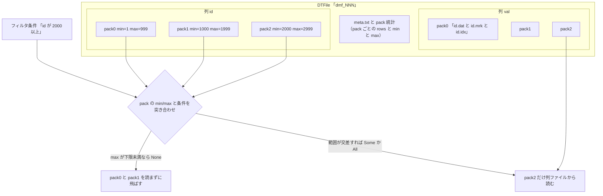

# 第8章 Stable レイヤと DTFile

> **本章で読むソース**
>
> - [`dbms/src/Storages/DeltaMerge/StableValueSpace.h`](https://github.com/pingcap/tiflash/blob/v8.5.6/dbms/src/Storages/DeltaMerge/StableValueSpace.h#L284-L297)
> - [`dbms/src/Storages/DeltaMerge/File/DMFile.h`](https://github.com/pingcap/tiflash/blob/v8.5.6/dbms/src/Storages/DeltaMerge/File/DMFile.h#L105-L111)
> - [`dbms/src/Storages/DeltaMerge/File/DMFileMeta.h`](https://github.com/pingcap/tiflash/blob/v8.5.6/dbms/src/Storages/DeltaMerge/File/DMFileMeta.h#L100-L106)
> - [`dbms/src/Storages/DeltaMerge/File/DMFileUtil.h`](https://github.com/pingcap/tiflash/blob/v8.5.6/dbms/src/Storages/DeltaMerge/File/DMFileUtil.h#L29-L31)
> - [`dbms/src/Storages/DeltaMerge/Index/RSResult.h`](https://github.com/pingcap/tiflash/blob/v8.5.6/dbms/src/Storages/DeltaMerge/Index/RSResult.h#L38-L43)
> - [`dbms/src/Storages/DeltaMerge/File/DMFilePackFilter.cpp`](https://github.com/pingcap/tiflash/blob/v8.5.6/dbms/src/Storages/DeltaMerge/File/DMFilePackFilter.cpp#L103-L120)

## この章の狙い

Segment は、最近の更新を貯める Delta レイヤと、整理済みの本体である Stable レイヤの2層で構成される。
本章は後者の **Stable レイヤ**と、その実体ファイルである **DTFile** を読む。
Stable がどのようなデータを持ち、DTFile がそれを列ごとにどう格納し、読み取り時にフィルタへ合わない部分をどう読み飛ばすかを、ソースに即して確定させる。

## 前提

Segment が Delta と Stable の2層からなることは [第6章](06-segment.md) で扱った。
Delta レイヤと `ColumnFile` の構造は [第7章](07-delta-and-columnfile.md) で読んだため、本章では前提とする。
本章のコード引用はすべて pingcap/tiflash のタグ `v8.5.6` に固定する。
読者には C++ と列指向データベースの基礎を仮定する。

## Stable レイヤが持つもの

Stable レイヤは、Delta レイヤに貯まった更新を [第9章](09-delta-merge-and-mvcc.md) の Delta Merge で整理して作り直した、キー順に並んだ列指向の本体である。
LSM-tree でいえば、整理済みのデータが落ち着く下位レベルに近い。
Stable は Delta Merge で作り直されるまで内容を書き換えず、基本的に不変として扱われる。

その実装が `StableValueSpace` であり、本体のデータは自身では持たず、複数の `DMFile`（DTFile）への参照として保持する。

[`dbms/src/Storages/DeltaMerge/StableValueSpace.h`](https://github.com/pingcap/tiflash/blob/v8.5.6/dbms/src/Storages/DeltaMerge/StableValueSpace.h#L284-L297)

```cpp
private:
    const PageIdU64 id;

    // Valid rows is not always the sum of rows in file,
    // because after logical split, two segments could reference to a same file.
    UInt64 valid_rows{}; /* At most. The actual valid rows may be lower than this value. */
    UInt64 valid_bytes{}; /* At most. The actual valid bytes may be lower than this value. */

    DMFiles files;

    StableProperty property{};
    std::atomic<bool> is_property_cached = false;

    LoggerPtr log;
```

`DMFiles files` が、この Stable を構成する DTFile の並びである。
`valid_rows` と `valid_bytes` は Stable が持つ有効な行数とバイト数だが、コメントが述べるとおり「最大値」でしかない。
論理分割で1つの Segment が2つに割れたとき、両者が同じ DTFile を共有することがあり、各 Stable が指す DTFile の行がすべて自分の範囲に収まるとは限らないためである。
このため Stable は、参照する DTFile の範囲のうち自分に属する部分だけを読み取り時に絞り込む。

Stable は、行数やバイト数とは別に、MVCC に関わる要約も持つ。

[`dbms/src/Storages/DeltaMerge/StableValueSpace.h`](https://github.com/pingcap/tiflash/blob/v8.5.6/dbms/src/Storages/DeltaMerge/StableValueSpace.h#L119-L128)

```cpp
    struct StableProperty
    {
        // when gc_safe_point exceed this version, there must be some data obsolete
        UInt64 gc_hint_version;
        // number of rows including all puts and deletes
        UInt64 num_versions;
        // number of visible rows using the latest timestamp
        UInt64 num_puts;
        // number of rows having at least one version(include delete)
        UInt64 num_rows;
```

`gc_hint_version` は、GC の安全点がこの版を超えると確実に不要なデータが生じることを示すヒントである。
`num_versions` は削除を含む全版の行数、`num_puts` は最新時刻で見える行数、`num_rows` は1つ以上の版を持つ行数を表す。
Stable は基本的に不変なので、この要約は1度計算すれば使い回せる。
`is_property_cached` がその計算済みフラグであり、不変であることをキャッシュの正当性の根拠として使っている。

## DTFile が列ごとに pack 単位で持つもの

Stable の実体である DTFile は、`DMFile` クラスが表す列指向のファイルである。
1つの DTFile はディスク上では `dmf_<file_id>` というディレクトリであり、その中に列ごとのデータファイルとメタ情報が並ぶ。
データを行の塊である **pack**（数千行ほどのまとまり）の単位で区切り、列ごとに pack を順に連ねて格納する。

`DMFile` の行数は、各 pack の統計を合計して求める。

[`dbms/src/Storages/DeltaMerge/File/DMFile.h`](https://github.com/pingcap/tiflash/blob/v8.5.6/dbms/src/Storages/DeltaMerge/File/DMFile.h#L105-L111)

```cpp
    size_t getRows() const
    {
        size_t rows = 0;
        for (const auto & s : meta->pack_stats)
            rows += s.rows;
        return rows;
    }
```

`meta->pack_stats` が pack ごとの統計の配列であり、行数は各 pack の `rows` を足し合わせるだけで得られる。
pack の単位で統計を持つこの構造が、後述する読み飛ばしの土台になる。

pack 1つあたりの統計は `DMFileMeta::PackStat` が表す。

[`dbms/src/Storages/DeltaMerge/File/DMFileMeta.h`](https://github.com/pingcap/tiflash/blob/v8.5.6/dbms/src/Storages/DeltaMerge/File/DMFileMeta.h#L100-L106)

```cpp
    struct PackStat
    {
        UInt32 rows;
        UInt32 not_clean;
        UInt64 first_version;
        UInt64 bytes;
        UInt8 first_tag;
```

`rows` がその pack の行数、`bytes` がバイト数である。
`not_clean` は、その pack に同一キーの複数版や削除が含まれ、MVCC でそのまま読めない行があるかを示す。
`first_version` と `first_tag` は先頭行の版と削除フラグを保持する。
これらは pack を読まずに pack の素性を判断するための要約であり、ディスク上の `pack` という小さなファイルにまとめて置かれる。

列のデータそのものは、列ごとに3種類のファイルへ分けて格納する。

[`dbms/src/Storages/DeltaMerge/File/DMFile.h`](https://github.com/pingcap/tiflash/blob/v8.5.6/dbms/src/Storages/DeltaMerge/File/DMFile.h#L282-L293)

```cpp
    String colDataPath(const FileNameBase & file_name_base) const
    {
        return subFilePath(colDataFileName(file_name_base));
    }
    String colIndexPath(const FileNameBase & file_name_base) const
    {
        return subFilePath(colIndexFileName(file_name_base));
    }
    String colMarkPath(const FileNameBase & file_name_base) const
    {
        return subFilePath(colMarkFileName(file_name_base));
    }
```

3つのパスはそれぞれデータ、インデックス、**mark** に対応し、ファイル名の末尾で見分ける。

[`dbms/src/Storages/DeltaMerge/File/DMFileUtil.h`](https://github.com/pingcap/tiflash/blob/v8.5.6/dbms/src/Storages/DeltaMerge/File/DMFileUtil.h#L29-L31)

```cpp
inline constexpr static const char * DATA_FILE_SUFFIX = ".dat";
inline constexpr static const char * INDEX_FILE_SUFFIX = ".idx";
inline constexpr static const char * MARK_FILE_SUFFIX = ".mrk";
```

`.dat` が列の値を連ねたデータ、`.idx` がその列の pack ごとの min/max を持つインデックス、`.mrk` が mark である。
mark は、pack の番号からその列の `.dat` 内の開始位置への対応表であり、特定の pack だけを `.dat` から取り出すための索引になる。
列ごとにこの3点組を持つため、読み取り側は必要な列の必要な pack だけを、他の列やほかの pack を読まずに取り出せる。

## pack 単位で読み飛ばす rough set filter

DTFile が pack ごとに min/max を持つことは、フィルタ条件に合わない pack を丸ごと読み飛ばすために使う。
この pack 単位の選別を **rough set filter**「rough set filter」と呼ぶ。
判定の結果は `RSResult` で表され、その本体は3値である。

[`dbms/src/Storages/DeltaMerge/Index/RSResult.h`](https://github.com/pingcap/tiflash/blob/v8.5.6/dbms/src/Storages/DeltaMerge/Index/RSResult.h#L38-L43)

```cpp
    enum class ValueResult : UInt8
    {
        Some = 1, // Some values meet requirements and NOT has null, need to read and perform filtering
        None = 2, // No value meets requirements and NOT has null, no need to read
        All = 3, // All values meet requirements NOT has null, need to read and no need perform filtering
    };
```

`None` は、その pack の min/max から判断して条件に合う値が1つも無いことを示し、コメントどおり読む必要がない。
`Some` は一部が合う可能性があるので読んで絞り込む必要があり、`All` は全行が合うので読むが行ごとの再判定は省ける。
pack の min/max とフィルタを突き合わせるだけで `None` を判定できる点が、巨大な Stable から必要な範囲だけを読むための鍵になる。

この判定を pack 全体へ適用するのが `DMFilePackFilter` である。

[`dbms/src/Storages/DeltaMerge/File/DMFilePackFilter.cpp`](https://github.com/pingcap/tiflash/blob/v8.5.6/dbms/src/Storages/DeltaMerge/File/DMFilePackFilter.cpp#L103-L120)

```cpp
    /// Check packs by filter in where clause
    if (filter)
    {
        // Load index based on filter.
        ColIds ids = filter->getColumnIDs();
        for (const auto & id : ids)
        {
            tryLoadIndex(result.param, id);
        }

        const auto check_results = filter->roughCheck(0, pack_count, result.param);
        std::transform(
            result.pack_res.cbegin(),
            result.pack_res.cend(),
            check_results.cbegin(),
            result.pack_res.begin(),
            [](RSResult a, RSResult b) { return a && b; });
    }
```

`filter` は WHERE 句から押し下げられたフィルタであり、`getColumnIDs` で必要な列を取り出し、その列の min/max インデックスだけを `tryLoadIndex` で読み込む。
`roughCheck` が pack ごとに3値の判定を返し、`std::transform` で既存の判定と論理積を取って `pack_res` を更新する。
ここまでの突き合わせはすべて `.idx` の min/max だけを使い、列の `.dat` 本体には触れない。
判定が `None` になった pack は、後段の読み取りで `.dat` から取り出されずに飛ばされる。

この選別がどれだけ効いたかは、`pack_res` のうち読む対象に残った pack を数えて把握する。

[`dbms/src/Storages/DeltaMerge/File/DMFilePackFilterResult.h`](https://github.com/pingcap/tiflash/blob/v8.5.6/dbms/src/Storages/DeltaMerge/File/DMFilePackFilterResult.h#L84-L98)

```cpp
    std::pair<size_t, size_t> validRowsAndBytes(const DMFilePtr & dmfile)
    {
        size_t rows = 0;
        size_t bytes = 0;
        const auto & pack_stats = dmfile->getPackStats();
        for (size_t i = 0; i < pack_stats.size(); ++i)
        {
            if (pack_res[i].isUse())
            {
                rows += pack_stats[i].rows;
                bytes += pack_stats[i].bytes;
            }
        }
        return {rows, bytes};
    }
```

`isUse` は判定が `None` でないことを表し、読む対象に残った pack だけの行数とバイト数を集計する。
`None` の pack は `rows` も `bytes` も加算されず、読み取りの対象から外れる。
この pack 単位の選別を、列の絞り込みと組み合わせる構造を図にすると次のようになる。



## min/max 統計で読まずに飛ばす工夫

本章の機構の工夫は、DTFile が pack ごとに min/max 統計を持ち、フィルタに合わない pack を `.dat` 本体に触れずに丸ごと読み飛ばす点にある。
列の値そのものは pack ごとに数千行が連なって `.dat` に並ぶが、その範囲は `.idx` の min/max という2値へ要約されている。
フィルタ条件と min/max を比べるだけで `None` を判定できるため、条件に合わない pack はデータを1バイトも読まずに除外できる。
時刻でキーが伸びていく時系列のテーブルのように、データがキー順に並んで pack ごとの min/max が重なりにくい場合、範囲条件のクエリは大半の pack を `None` で飛ばせる。
mark がある列構造と組み合わせることで、残った pack の必要な列だけを `.dat` の該当位置から取り出せるので、巨大な Stable に対しても読むデータ量を条件に見合う範囲へ抑えられる。
この pack 単位の選別は、TiDB から押し下げられたフィルタを受けて働く。
フィルタ押し下げと late materialization の全体像は [第21章](../part05-ops/21-pushdown-and-late-materialization.md) で扱う。

## まとめ

Stable レイヤは、Delta Merge で整理してキー順に並べた列指向の本体であり、`StableValueSpace` が複数の DTFile への参照として保持する。
Stable は基本的に不変であり、MVCC の要約をキャッシュして使い回せる。
DTFile は `DMFile` が表す列指向のファイルであり、列ごとに `.dat` のデータ、`.idx` のインデックス、`.mrk` の mark を持ち、データを pack の単位で区切る。
pack ごとに min/max 統計を持つので、フィルタ条件と突き合わせて `None` になった pack は `.dat` に触れずに読み飛ばせる。
この pack 単位の rough set filter が、巨大な Stable から必要な範囲だけを読む工夫であり、押し下げられたフィルタと結び付いて分析クエリの読み取り量を抑える。

## 関連する章

- [Segment](06-segment.md)：Stable と Delta の2層を抱える Segment の構造を扱う。
- [Delta レイヤと ColumnFile](07-delta-and-columnfile.md)：Stable と対になる更新側の層を扱う。
- [Delta Merge と MVCC](09-delta-merge-and-mvcc.md)：Delta を整理して Stable を作り直す処理を扱う。
- [フィルタ押し下げと late materialization](../part05-ops/21-pushdown-and-late-materialization.md)：pack 単位の選別を受けるフィルタ押し下げを扱う。
