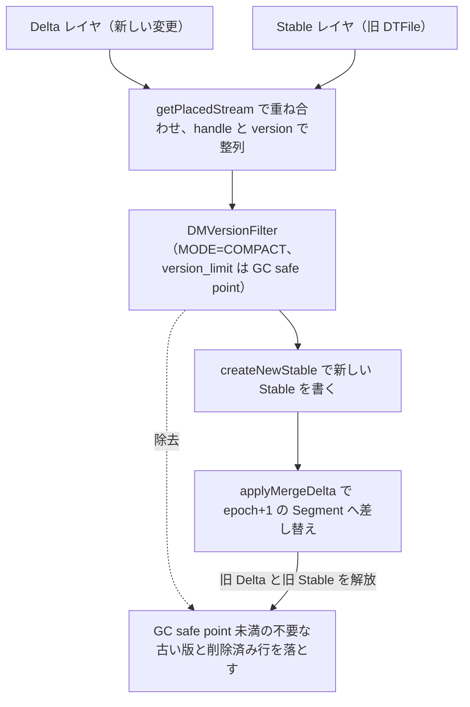

# 第9章 Delta Merge と MVCC

> **本章で読むソース**
>
> - [`dbms/src/Storages/DeltaMerge/Segment.cpp`](https://github.com/pingcap/tiflash/blob/v8.5.6/dbms/src/Storages/DeltaMerge/Segment.cpp)
> - [`dbms/src/Storages/DeltaMerge/DMVersionFilterBlockInputStream.h`](https://github.com/pingcap/tiflash/blob/v8.5.6/dbms/src/Storages/DeltaMerge/DMVersionFilterBlockInputStream.h)
> - [`dbms/src/Storages/DeltaMerge/DeltaMergeStore.cpp`](https://github.com/pingcap/tiflash/blob/v8.5.6/dbms/src/Storages/DeltaMerge/DeltaMergeStore.cpp)
> - [`dbms/src/Storages/DeltaMerge/DeltaMergeStore_InternalBg.cpp`](https://github.com/pingcap/tiflash/blob/v8.5.6/dbms/src/Storages/DeltaMerge/DeltaMergeStore_InternalBg.cpp)

## この章の狙い

第7章と第8章で、Segment が新しい変更を貯める Delta レイヤと、確定済みの列データを置く Stable レイヤの2層からなることを読んだ。
書き込みが続くと Delta が膨らみ、読み取りのたびに Delta を Stable へ重ね合わせるコストが増える。
本章は、その Delta を Stable へ畳む背景処理 **Delta Merge**（`Segment::prepareMergeDelta` と `Segment::applyMergeDelta`）を読む。
あわせて、TiFlash が同じ handle の複数の版をどう区別し、読み取り時にどの版だけを見せるかという **MVCC** の仕組み（`DMVersionFilterBlockInputStream`）を読む。
Delta Merge と MVCC は別の機能ではなく、同じバージョンフィルタを別のパラメータで使う1つの仕掛けである。
畳む処理がそのまま古い版の整理（GC）を兼ねる点が、本章の見どころになる。

## 前提

Segment が Delta と Stable の2層を持つこと、Delta が `ColumnFile` の列で、Stable が `DTFile` であることは第6章から第8章で扱った。
TiFlash は TiKV から Raft learner として行データを複製し、各行に commit_ts に相当する version を付けて列ストアへ積む。
この version の出どころと learner read の一貫性は[第13章](../part02-raft-learner/13-learner-read.md)で扱う。
本章では、すでに version 付きの行が Segment に入っている状態から始める。

TiFlash の各行は、主キーにあたる `handle` 列、版を表す `version` 列、削除を表す `del` 列の3つを内部に持つ。
`DMVersionFilterBlockInputStream` のコンストラクタは、入力ブロックからこの3列の位置（`EXTRA_HANDLE_COLUMN_NAME`、`VERSION_COLUMN_NAME`、`TAG_COLUMN_NAME`）を引き当てて保持する。
同じ `handle` に対する更新は、`version` 違いの複数の行として積み重なる。

## MVCC：同じ handle の版をフィルタで畳む

TiFlash の MVCC は、同じ `handle` を持つ行が version の昇順に並んでいることを前提に、隣り合う行を見比べて要否を決める。
この判定を担うのが `DMVersionFilterBlockInputStream` であり、2つのモードを持つ。

[`dbms/src/Storages/DeltaMerge/DMVersionFilterBlockInputStream.h` L31-L36](https://github.com/pingcap/tiflash/blob/v8.5.6/dbms/src/Storages/DeltaMerge/DMVersionFilterBlockInputStream.h#L31-L36)

```cpp
/// Use the latest rows. For rows with the same handle, only take the rows with biggest version and version <= version_limit.
static constexpr int DM_VERSION_FILTER_MODE_MVCC = 0;
/// Remove the outdated rows. For rows with the same handle, take
/// 1. rows with version >= version_limit are taken,
/// 2. for the rows with smaller verion than version_limit, then take the biggest one of them, if it is not deleted.
static constexpr int DM_VERSION_FILTER_MODE_COMPACT = 1;
```

`MVCC` モードは読み取りのためのモードで、各 `handle` について `version_limit` 以下で最大の版だけを残す。
`COMPACT` モードは整理のためのモードで、`version_limit` 以上の版はすべて残し、`version_limit` 未満の版はその中で最大の1つだけを、削除でなければ残す。
両モードの違いは、行ごとの採否を決める次の式に集約される。

[`dbms/src/Storages/DeltaMerge/DMVersionFilterBlockInputStream.h` L109-L124](https://github.com/pingcap/tiflash/blob/v8.5.6/dbms/src/Storages/DeltaMerge/DMVersionFilterBlockInputStream.h#L109-L124)

```cpp
    inline void checkWithNextIndex(size_t i)
    {
#define cur_handle rowkey_column->getRowKeyValue(i)
#define next_handle rowkey_column->getRowKeyValue(i + 1)
#define cur_version (*version_col_data)[i]
#define next_version (*version_col_data)[i + 1]
#define deleted (*delete_col_data)[i]
        if constexpr (MODE == DM_VERSION_FILTER_MODE_MVCC)
        {
            filter[i] = !deleted && cur_version <= version_limit
                && (cur_handle != next_handle || next_version > version_limit);
        }
        else if constexpr (MODE == DM_VERSION_FILTER_MODE_COMPACT)
        {
            filter[i] = cur_version >= version_limit
                || ((cur_handle != next_handle || next_version > version_limit) && !deleted);
```

`MVCC` モードの式は、行 `i` を残す条件を3つ並べている。
その行が削除でないこと、その version が `version_limit` 以下で見えること、そしてその行がこの `handle` の見える版の中で最後であること（次の行が別の `handle` か、次の version が `version_limit` を超える）である。
version が昇順に並ぶので、この3条件を満たす行は `handle` ごとにちょうど1つ、`version_limit` 以下で最大の版になる。
その最大の版が削除であれば `!deleted` が偽になって落ち、その `handle` は読み取りから消える。

`COMPACT` モードの式は、判定の向きが逆になる。
`cur_version >= version_limit` で、`version_limit` 以上の新しい版は無条件に残す。
それより古い版は、`handle` ごとの最大の1つだけを、削除でない限り残す。
読み取りで残す版と、整理で残す版は、同じ式を `version_limit` の比較方向だけ変えて表している。

判定の本体はこの `checkWithNextIndex` だが、実際の `read` ではこの論理を64行単位でループ展開し、コンパイラのベクトル化を効かせて1ブロックぶんの `filter` をまとめて立てる。
行ごとに分岐する代わりに列方向の単純な比較に置き換えることで、MVCC のフィルタを列指向の走査速度で回す。

## 読み取り経路：read tso でその時点の最新版を見る

読み取りのとき、Segment は Delta と Stable を重ねたストリームの最後段に `MVCC` モードのフィルタを置く。

[`dbms/src/Storages/DeltaMerge/Segment.cpp` L1182-L1188](https://github.com/pingcap/tiflash/blob/v8.5.6/dbms/src/Storages/DeltaMerge/Segment.cpp#L1182-L1188)

```cpp
    stream = std::make_shared<DMVersionFilterBlockInputStream<DM_VERSION_FILTER_MODE_MVCC>>(
        stream,
        columns_to_read,
        start_ts,
        is_common_handle,
        dm_context.tracing_id,
        dm_context.scan_context);
```

ここで `version_limit` に渡る `start_ts` が、この読み取りの **read tso** である。
クエリが指定した read tso を境に、それ以下の最新版だけが各 `handle` から取り出される。
read tso より後にコミットされた版は `cur_version <= version_limit` で落ち、より古い版は次の版に上書きされて落ちる。
TiKV から複製した版付きの行に対して、TiFlash はこのフィルタ1つでスナップショット読み取りを実現する。

## Delta Merge：Delta を Stable へ畳む

Delta が積み上がると、読み取りのたびに Delta を Stable へ重ねる手間と、Delta が占める容量が増える。
Delta Merge は、Delta レイヤと既存の Stable レイヤを統合して新しい Stable を作り、Delta を空に戻す背景処理である。
LSM-tree のコンパクションが複数の SST を1つにまとめるのと同じ位置づけで、TiFlash では Delta の列を Stable の `DTFile` へ畳む。

入口の `Segment::mergeDelta` は、処理を準備と適用の2段に分ける。

[`dbms/src/Storages/DeltaMerge/Segment.cpp` L1436-L1455](https://github.com/pingcap/tiflash/blob/v8.5.6/dbms/src/Storages/DeltaMerge/Segment.cpp#L1436-L1455)

```cpp
SegmentPtr Segment::mergeDelta(DMContext & dm_context, const ColumnDefinesPtr & schema_snap) const
{
    WriteBatches wbs(*dm_context.storage_pool, dm_context.getWriteLimiter());
    auto segment_snap = createSnapshot(dm_context, true, CurrentMetrics::DT_SnapshotOfDeltaMerge);
    if (!segment_snap)
        return {};

    auto new_stable = prepareMergeDelta(dm_context, schema_snap, segment_snap, wbs);

    wbs.writeLogAndData();
    new_stable->enableDMFilesGC(dm_context);

    SYNC_FOR("before_Segment::applyMergeDelta"); // pause without holding the lock on the segment

    auto lock = mustGetUpdateLock();
    auto new_segment = applyMergeDelta(lock, dm_context, segment_snap, wbs, new_stable);

    wbs.writeAll();
    return new_segment;
}
```

`prepareMergeDelta` がスナップショットから新しい Stable を作り、その間 Segment の更新ロックは取らない。
新しい `DTFile` を書き出してデータを永続化したあとで、`applyMergeDelta` の直前に初めて `mustGetUpdateLock` でロックを取る。
重い列の書き出しをロックの外で済ませ、ロックを握るのは差し替えの一瞬だけにすることで、Delta Merge 中も読み書きを止めない。

### 準備：Delta と Stable を重ねて新しい Stable を書く

`prepareMergeDelta` は、Segment のスナップショットから1本のストリームを作り、それを新しい Stable へ書き出す。

[`dbms/src/Storages/DeltaMerge/Segment.cpp` L1457-L1485](https://github.com/pingcap/tiflash/blob/v8.5.6/dbms/src/Storages/DeltaMerge/Segment.cpp#L1457-L1485)

```cpp
StableValueSpacePtr Segment::prepareMergeDelta(
    DMContext & dm_context,
    const ColumnDefinesPtr & schema_snap,
    const SegmentSnapshotPtr & segment_snap,
    WriteBatches & wbs) const
{
    // ... (中略) ...
    auto data_stream = getInputStreamForDataExport(
        dm_context,
        *schema_snap,
        segment_snap,
        rowkey_range,
        dm_context.stable_pack_rows,
        /*reorginize_block*/ true);

    auto new_stable = createNewStable(dm_context, schema_snap, data_stream, segment_snap->stable->getId(), wbs);

    LOG_DEBUG(log, "MergeDelta - Finish prepare, segment={}", info());

    return new_stable;
}
```

`getInputStreamForDataExport` が Delta の更新を Stable に重ね、`handle` と version の昇順に整列した1本の `data_stream` を返す。
そのストリームを `createNewStable` が新しい `DTFile` として書き出し、これが畳んだ後の Stable になる。
重ね合わせと整列の出口に、整理のためのバージョンフィルタが入る。

[`dbms/src/Storages/DeltaMerge/Segment.cpp` L1252-L1256](https://github.com/pingcap/tiflash/blob/v8.5.6/dbms/src/Storages/DeltaMerge/Segment.cpp#L1252-L1256)

```cpp
    data_stream = std::make_shared<DMVersionFilterBlockInputStream<DM_VERSION_FILTER_MODE_COMPACT>>(
        data_stream,
        *read_info.read_columns,
        dm_context.min_version,
        is_common_handle);
```

ここでは `COMPACT` モードを使い、`version_limit` に `dm_context.min_version` を渡す。
`min_version` は **GC safe point**、すなわちどの読み取りの read tso もこれより前の版を見ないという下限の版である。
したがって `COMPACT` フィルタは、GC safe point 以上の版を残しつつ、それより古い版は `handle` ごとに最大の1つだけを残し、残りの古い版や削除済みの行を落とす。
畳んで新しい Stable を書く動作が、そのまま MVCC の古い版の整理を兼ねる。

### 適用：新しい Segment へ差し替えて旧データを消す

`applyMergeDelta` は、準備した新しい Stable と、Delta Merge 中に新たに積まれた `ColumnFile` を束ねて、新しい Segment を作る。

[`dbms/src/Storages/DeltaMerge/Segment.cpp` L1506-L1526](https://github.com/pingcap/tiflash/blob/v8.5.6/dbms/src/Storages/DeltaMerge/Segment.cpp#L1506-L1526)

```cpp
    auto new_me = std::make_shared<Segment>( //
        parent_log,
        epoch + 1,
        rowkey_range,
        segment_id,
        next_segment_id,
        new_delta,
        new_stable);

    // avoid recheck whether to do DeltaMerge using the same gc_safe_point
    new_me->setLastCheckGCSafePoint(context.min_version);

    // Store new meta data
    new_delta->saveMeta(wbs);
    new_me->stable->saveMeta(wbs.meta);
    new_me->serialize(wbs.meta);

    // Remove old segment's delta.
    delta->recordRemoveColumnFilesPages(wbs);
    // Remove old stable's files.
    stable->recordRemovePacksPages(wbs);
```

新しい Segment は `epoch + 1` を持ち、畳んだ後の `new_stable` を Stable に据える。
畳む間に届いた変更は `new_delta` として引き継がれるので、Delta Merge は進行中の書き込みを取りこぼさない。
メタデータを書き終えると、古い Segment の Delta の `ColumnFile` と、古い Stable の `DTFile` の参照を削除リストに積む。
これで畳む前の Delta と Stable が解放され、容量が縮む。

## 背景トリガ：Delta の膨らみを見て自動で畳む

Delta Merge をいつ起動するかは、書き込みのたびに呼ばれる `DeltaMergeStore::checkSegmentUpdate` が Delta の量を見て決める。

[`dbms/src/Storages/DeltaMerge/DeltaMergeStore.cpp` L1645-L1651](https://github.com/pingcap/tiflash/blob/v8.5.6/dbms/src/Storages/DeltaMerge/DeltaMergeStore.cpp#L1645-L1651)

```cpp
    bool should_background_merge_delta
        = ((delta_check_rows >= delta_limit_rows || delta_check_bytes >= delta_limit_bytes) //
           && (delta_rows - delta_last_try_merge_delta_rows >= delta_cache_limit_rows
               || delta_bytes - delta_last_try_merge_delta_bytes >= delta_cache_limit_bytes));
    bool should_foreground_merge_delta_by_rows_or_bytes
        = delta_check_rows >= forceMergeDeltaRows(dm_context) || delta_check_bytes >= forceMergeDeltaBytes(dm_context);
    bool should_foreground_merge_delta_by_deletes = delta_deletes >= forceMergeDeltaDeletes(dm_context);
```

Delta の行数かバイト数が `delta_limit_rows` か `delta_limit_bytes` を超えると、背景スレッドプールに Delta Merge タスクを積む。
Delta がさらに膨れて `forceMergeDelta` の閾値を超えると、書き込みスレッド自身が前景で畳んで書き込みを一時的に止め、Delta が際限なく伸びるのを防ぐ。
削除レンジが溜まりすぎた場合も前景の Delta Merge で畳む。

背景タスクが走り出す直前に、その時点の GC safe point が `min_version` へ取り込まれる。

[`dbms/src/Storages/DeltaMerge/DeltaMergeStore_InternalBg.cpp` L389-L396](https://github.com/pingcap/tiflash/blob/v8.5.6/dbms/src/Storages/DeltaMerge/DeltaMergeStore_InternalBg.cpp#L389-L396)

```cpp
    // Update GC safe point before background task
    // Foreground task don't get GC safe point from remote, but we better make it as up to date as possible.
    if (updateGCSafePoint())
    {
        /// Note that `task.dm_context->global_context` will be free after query is finish. We should not use that in background task.
        task.dm_context->min_version = latest_gc_safe_point.load(std::memory_order_relaxed);
        LOG_DEBUG(log, "Task {} GC safe point: {}", magic_enum::enum_name(task.type), task.dm_context->min_version);
    }
```

`updateGCSafePoint` で PD から最新の GC safe point を引き、`min_version` に載せる。
この `min_version` が、先ほどの `COMPACT` フィルタの `version_limit` になる。
Delta が膨らんだことを引き金に畳む処理を起こし、その時点の GC safe point を境に不要な古い版を落とす経路が、これでつながる。

次の図は、Delta Merge が Delta と Stable から新しい Stable を作り、その途中で GC safe point 未満の不要な版を落とす流れを示す。



## 機構の工夫：畳む処理と版の整理を1つのフィルタで兼ねる

TiFlash は、読み取りの MVCC と Delta Merge の整理を、`DMVersionFilterBlockInputStream` という1つのフィルタにモード違いで束ねている。
読み取りでは `MVCC` モードと read tso を渡し、各 `handle` のその時点の最新版だけを取り出す。
Delta Merge では `COMPACT` モードと GC safe point を渡し、新しい Stable を書きながら、どの読み取りからも見えなくなった古い版と削除済みの行を同時に落とす。
これにより、背景で Delta を Stable へ畳む1回の走査が、読み取りで重ねるべき層を減らすことと、保持する版を減らして容量を縮めることを同時に達成する。

もう1つの工夫は、Delta Merge を準備と適用の2段に割って、重い列の書き出しを Segment の更新ロックの外で行うことである。
新しい Stable の `DTFile` を書き終えてから、差し替えの一瞬だけロックを取る。
これで、容量の大きい列を畳む間も、その Segment への読み書きが止まらない。

## まとめ

Delta Merge は、Segment の Delta レイヤと Stable レイヤを統合して新しい Stable を作る背景処理であり、LSM-tree のコンパクションに相当する。
`Segment::mergeDelta` は処理を `prepareMergeDelta` と `applyMergeDelta` の2段に分け、重い書き出しをロックの外で済ませてから、差し替えだけをロック下で行う。
準備の段では、Delta を Stable に重ねて整列したストリームに `COMPACT` モードのバージョンフィルタをかけ、GC safe point 未満の不要な版を落としながら新しい Stable を書く。
読み取りの段では、同じフィルタを `MVCC` モードと read tso で使い、各 handle のその時点の最新版だけを見せる。
Delta が `delta_limit` を超えると背景で、`forceMergeDelta` を超えると前景で Delta Merge が起き、その時点の GC safe point を境に古い版を整理する。

## 関連する章

- [第6章 Segment](06-segment.md)：Delta Merge が対象とする Segment と、その更新ロックの単位。
- [第7章 Delta レイヤと ColumnFile](07-delta-and-columnfile.md)：畳む対象である Delta レイヤと `ColumnFile` の構造。
- [第8章 Stable レイヤと DTFile](08-stable-and-dtfile.md)：畳んだ結果を書き出す Stable レイヤと `DTFile`。
- [第13章 learner read と読み取り一貫性](../part02-raft-learner/13-learner-read.md)：MVCC のフィルタに渡す read tso と版の出どころ。
- [RocksDB 編 第29章 コンパクションの理論](../../../rocksdb/part05-compaction/29-compaction-theory.md)：Delta Merge が相当する LSM-tree のコンパクションの考え方。
