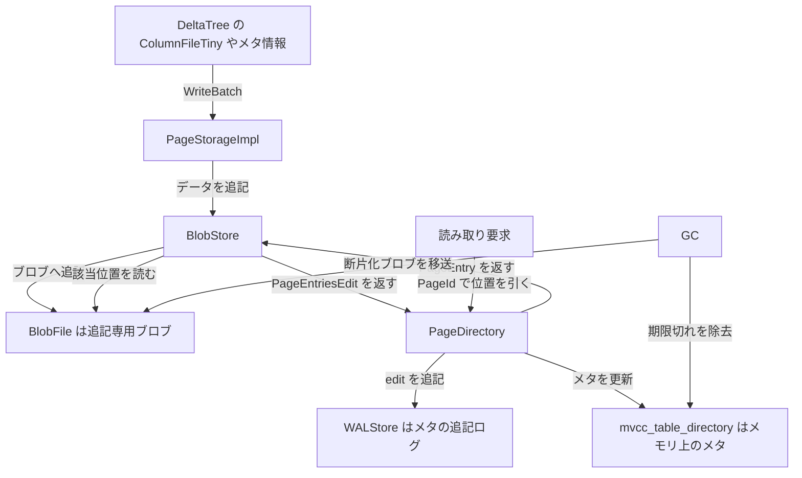

# 第10章 PageStorage

> **本章で読むソース**
>
> - [`dbms/src/Storages/Page/V3/PageStorageImpl.h`](https://github.com/pingcap/tiflash/blob/v8.5.6/dbms/src/Storages/Page/V3/PageStorageImpl.h#L126-L132)
> - [`dbms/src/Storages/Page/Page.h`](https://github.com/pingcap/tiflash/blob/v8.5.6/dbms/src/Storages/Page/Page.h#L50-L69)
> - [`dbms/src/Storages/Page/V3/PageEntry.h`](https://github.com/pingcap/tiflash/blob/v8.5.6/dbms/src/Storages/Page/V3/PageEntry.h#L37-L45)
> - [`dbms/src/Storages/Page/V3/BlobStore.h`](https://github.com/pingcap/tiflash/blob/v8.5.6/dbms/src/Storages/Page/V3/BlobStore.h#L90-L103)
> - [`dbms/src/Storages/Page/V3/PageDirectory.h`](https://github.com/pingcap/tiflash/blob/v8.5.6/dbms/src/Storages/Page/V3/PageDirectory.h#L452-L459)
> - [`dbms/src/Storages/Page/V3/WALStore.h`](https://github.com/pingcap/tiflash/blob/v8.5.6/dbms/src/Storages/Page/V3/WALStore.h#L49-L65)

## この章の狙い

DeltaTree の下層で、データ本体とメタ情報を保存する **PageStorage** を読む。
DeltaTree の Delta レイヤが生む小さな列ファイルや、各構造のメタ情報は、最終的にこの層へバイト列として落ちる。
本章は、PageStorage が可変長のバイト列を ID で読み書きする仕組みと、その書き込みを追記専用のブロブにまとめ、位置情報を別の追記ログで管理し、GC で断片を回収する流れを追う。
DeltaTree がなぜ独自の Page 層を持つのかを、機構の側から説明することを狙う。

## 前提

PageStorage は TiFlash 独自の下層ストアであり、`dbms/src/Storages/Page` 以下に置かれる。
本章のコード引用はすべて pingcap/tiflash のタグ `v8.5.6` に固定し、第3世代の実装 **PageStorage V3**（名前空間 `PS::V3`）を読む。
DeltaTree の全体像は [第5章](05-deltamergestore.md) で、その上に載る Delta レイヤと **ColumnFile** は [第7章](07-delta-and-columnfile.md) で扱ったため、ここでは前提とする。
読者には C++ の基礎と、追記ログを核とするストレージの考え方を仮定する。

## なぜ DeltaTree は独自の Page 層を持つか

DeltaTree が PageStorage を必要とする理由は、書き込みの粒度にある。
Delta レイヤは TiKV から届く更新を、小さな **ColumnFileTiny** として次々に追加する。
個々の列ファイルは数十キロバイトに収まることもあり、これをそのまま個別のファイルにすると、ファイル数とメタデータ更新が膨らむ。
さらに、各 Segment や Delta の構成といったメタ情報は、書き込みのたびに頻繁に更新される。

これらを汎用のファイルシステムへ直接書くと、小さなファイルの大量生成と、その都度のディレクトリ更新が重荷になる。
PageStorage は、この負荷を肩代わりする層として設計されている。
可変長のバイト列を **Page** という単位で扱い、多数の小さな Page を少数の追記専用ファイルへまとめて書き、位置情報だけを軽い追記ログで管理する。
PageStorage の役目は、列ファイルの細かな更新と頻繁なメタ更新を、追記中心の低コストな書き込みへ変換することにある。

## Page と PageEntry

PageStorage が扱う最小の単位が `Page` である。
`Page` は ID とバイト列の組であり、上位の DeltaTree からは「ID を渡すとバイト列が返る」値として見える。

[`dbms/src/Storages/Page/Page.h`](https://github.com/pingcap/tiflash/blob/v8.5.6/dbms/src/Storages/Page/Page.h#L50-L69)

```cpp
struct Page
{
public:
    static Page invalidPage()
    {
        Page page{INVALID_PAGE_U64_ID};
        page.is_valid = false;
        return page;
    }

    explicit Page(PageIdU64 page_id_)
        : page_id(page_id_)
        , is_valid(true)
    {}

    PageIdU64 page_id;
    std::string_view data;
    MemHolder mem_holder;
    // Field offsets inside this page.
    std::set<FieldOffsetInsidePage> field_offsets;
```

`page_id` が Page を一意に指す ID であり、`data` がその中身のバイト列を指す。
`field_offsets` は Page 内部のフィールド境界を持ち、1つの Page をいくつかの区画に分けて、必要なフィールドだけを部分読みする用途に使う。
列ファイルの本体はこの `data` に詰められ、PageStorage はその中身の意味を解釈しない。
PageStorage にとって Page はあくまでバイト列の塊であり、列としての構造を解釈するのは上位の DeltaTree である。

Page の中身がディスク上のどこにあるかを記録するのが `PageEntryV3` である。

[`dbms/src/Storages/Page/V3/PageEntry.h`](https://github.com/pingcap/tiflash/blob/v8.5.6/dbms/src/Storages/Page/V3/PageEntry.h#L37-L45)

```cpp
struct PageEntryV3
{
public:
    BlobFileId file_id = 0; // The id of page data persisted in
    PageSize size = 0; // The size of page data
    PageSize padded_size = 0; // The extra align size of page data
    UInt64 tag = 0;
    BlobFileOffset offset = 0; // The offset of page data in file
    UInt64 checksum = 0; // The checksum of whole page data
```

`PageEntryV3` は、Page のデータがどのブロブファイル（`file_id`）の、どの位置（`offset`）に、どれだけの長さ（`size`）で載っているかを記録する。
これがメタ情報の実体であり、PageStorage は「PageId から `PageEntryV3` を引き、その位置からバイト列を読む」という二段で読み取りを実現する。
データ本体は大きく、位置情報は小さいという非対称が、この層の設計を二つに分ける。

## PageStorageImpl の構成

入口クラス `PageStorageImpl` は、この二つを別々の部品として保持する。

[`dbms/src/Storages/Page/V3/PageStorageImpl.h`](https://github.com/pingcap/tiflash/blob/v8.5.6/dbms/src/Storages/Page/V3/PageStorageImpl.h#L126-L132)

```cpp
    LoggerPtr log;

    u128::PageDirectoryPtr page_directory;

    u128::BlobStoreType blob_store;

    u128::ExternalPageCallbacksManager manager;
```

`blob_store` がデータ本体を持つ **BlobStore** であり、Page のバイト列を追記専用のブロブファイルへ書き込む。
`page_directory` がメタ情報を持つ **PageDirectory** であり、PageId から `PageEntryV3` への対応を管理する。
データとメタを別の部品に分けたことで、データは追記に最適化したブロブへ、メタは小さな追記ログへと、それぞれに合った書き方ができる。
`manager` は外部 Page のコールバックと GC の起動を束ねる部品であり、後述する GC の入口になる。

## 書き込み：ブロブへ追記し、メタを反映する

書き込みは、データとメタの二段で進む。
`writeImpl` は受け取った `WriteBatch` をまず `blob_store` へ渡し、その結果として返るメタの変更を `page_directory` へ反映する。

[`dbms/src/Storages/Page/V3/PageStorageImpl.cpp`](https://github.com/pingcap/tiflash/blob/v8.5.6/dbms/src/Storages/Page/V3/PageStorageImpl.cpp#L139-L141)

```cpp
    // Persist Page data to BlobStore
    auto edit = blob_store.write(std::move(write_batch), PageType::Normal, write_limiter);
    page_directory->apply(std::move(edit), write_limiter);
```

`blob_store.write` がバイト列をブロブへ書き、各 Page の位置を記した `edit`（`PageEntriesEdit`）を返す。
`page_directory->apply` がその `edit` をメタへ適用する。
データの永続化とメタの更新が、この2行に分かれている。

`blob_store.write` の内側では、1つの `WriteBatch` に含まれる全 Page のデータをまとめて、ブロブ上の連続した1区画へ割り当てる。

[`dbms/src/Storages/Page/V3/BlobStore.cpp`](https://github.com/pingcap/tiflash/blob/v8.5.6/dbms/src/Storages/Page/V3/BlobStore.cpp#L516-L518)

```cpp
    size_t actually_allocated_size = all_page_data_size + replenish_size;

    auto [blob_id, offset_in_file] = getPosFromStats(actually_allocated_size, page_type);
```

`getPosFromStats` は、バッチ全体のサイズ `actually_allocated_size` を一度に受け入れられるブロブと、その中の開始位置 `offset_in_file` を返す。
各 Page はこの区画の中へ順に詰められ、それぞれの `file_id` と `offset` が `PageEntryV3` に記録される。
多数の小さな Page を個別のファイルに散らさず、1つのブロブへ続けて追記するため、書き込みはランダムな更新ではなく逐次的な追記になる。
これが、細かな列ファイルの追加を低コストに保つ最初の仕掛けである。

## メタ管理：PageDirectory と WAL

メタ情報を持つ `PageDirectory` は、PageId ごとに複数バージョンのエントリを保持し、スナップショットで一貫した読みを与える。

[`dbms/src/Storages/Page/V3/PageDirectory.h`](https://github.com/pingcap/tiflash/blob/v8.5.6/dbms/src/Storages/Page/V3/PageDirectory.h#L452-L459)

```cpp
// `PageDirectory` store VersionedPageEntries for all pages.
// User can acquire a snapshot from it and get a consist result by the snapshot.
// All its functions are consider concurrent safe.
// User should call `gc` periodic to remove outdated version
// of entries in order to keep the memory consumption as well
// as the restoring time in a reasonable level.
template <typename Trait>
class PageDirectory
```

`PageDirectory` は全 Page の `VersionedPageEntries` をメモリ上のマップ（`mvcc_table_directory`）に持ち、スナップショットの時刻で見える版を選ぶ。
このマップを永続化するのが `WALStore` であり、`PageDirectory::apply` はメタの変更 `edit` を WAL へ追記してから、メモリ上のマップへ反映する。
再起動時には WAL を再生してマップを復元するため、メタは常にディスク上の追記ログに裏打ちされる。
メタ更新はバイト列本体を伴わない小さなレコードであり、これを追記ログに積むだけで済む点が、頻繁なメタ更新を支える二つ目の仕掛けである。

WAL への書き込みには、複数の書き手をまとめる工夫がある。
`apply` を呼ぶ複数のスレッドはキューに並び、先頭の書き手がリーダーとなって全員の `edit` をまとめて WAL へ書き、同期する。

[`dbms/src/Storages/Page/V3/PageDirectory.h`](https://github.com/pingcap/tiflash/blob/v8.5.6/dbms/src/Storages/Page/V3/PageDirectory.h#L651-L658)

```cpp
    // This is a queue of Writers to PageDirectory and is protected by apply_mutex.
    // Every writer enqueue itself to this queue before writing.
    // And the head writer of the queue will become the leader and is responsible to write and sync the WAL.
    // The write process of the leader:
    //   1. scan the queue to find all available writers and merge their edits to the leader's edit;
    //   2. unlock the apply_mutex;
    //   3. write the edits to the WAL and sync it;
    //   4. apply the edit to mvcc_table_directory;
```

リーダーはキュー上の全書き手の `edit` を1つにまとめ、WAL への書き込みと同期を一度だけ行う。
個々の書き手がそれぞれ同期を発行する代わりに、同期の回数をグループ単位へ束ねることで、並行する多数のメタ更新が同期の待ちで詰まりにくくなる。
RocksDB の WAL も同じ発想のグループコミットで書き込みをまとめる。
TiKV と TiFlash の最下層が使う RocksDB の WAL については [RocksDB 編](../../../rocksdb/README.md) に譲る。

## 読み取り：メタで位置を引いてブロブから読む

読み取りは、書き込みと逆の二段で進む。
`readImpl` はまず `page_directory` で PageId から位置を引き、その位置を `blob_store` へ渡してバイト列を読む。

[`dbms/src/Storages/Page/V3/PageStorageImpl.cpp`](https://github.com/pingcap/tiflash/blob/v8.5.6/dbms/src/Storages/Page/V3/PageStorageImpl.cpp#L192-L194)

```cpp
    auto page_entry = throw_on_not_exist ? page_directory->getByID(buildV3Id(ns_id, page_id), snapshot)
                                         : page_directory->getByIDOrNull(buildV3Id(ns_id, page_id), snapshot);
    return blob_store.read(page_entry, read_limiter);
```

`page_directory->getByID` がスナップショットの時刻で見える `PageEntryV3` を返し、`blob_store.read` がその `file_id` と `offset` からデータを読む。
メタはメモリ上のマップ参照で引けるため、ディスクへ問い合わせるのはブロブの該当区画を読む一度だけで済む。
読みたいフィールドだけを指定すれば、`field_offsets` を使って Page 内部の必要な区画だけを部分読みすることもできる。

## GC：期限切れの除去と断片化ブロブの再編

追記中心の書き込みは、古いデータをその場で上書きしない。
Page を更新したり削除したりしても、ブロブ上の旧データはしばらく残り、放置すればブロブは使われない領域で膨らむ。
これを回収するのが GC であり、`gcImpl` は `manager` を介して、メタとブロブの両方を順に整理する。

GC は二段で進む。
第一段は、もう参照されないバージョンのメタを `PageDirectory` から取り除き、対応するブロブ上の領域を空きとして印す処理である。
これはメモリ上の操作が中心で軽い。
第二段が **full GC** であり、断片化が進んだブロブを選び、生きている Page だけを新しいブロブへ移して旧ブロブを捨てる。
どのブロブを full GC の対象にするかは `blob_store.getGCStats` が、断片化の度合いから判定する。

[`dbms/src/Storages/Page/V3/GCDefines.cpp`](https://github.com/pingcap/tiflash/blob/v8.5.6/dbms/src/Storages/Page/V3/GCDefines.cpp#L324-L327)

```cpp
    // 5. Do the BlobStore GC
    // After BlobStore GC, these entries will be migrated to a new blob.
    // Then we should notify MVCC apply the change.
    PageEntriesEdit gc_edit = blob_store.gc(page_type_gc_infos, write_limiter, read_limiter);
```

`blob_store.gc` は対象ブロブの生きた Page を新しいブロブへ移し、移送後の新しい位置を記した `gc_edit` を返す。
続く `gcApply` がこの `gc_edit` を `PageDirectory` へ適用し、メタの位置を新しいブロブへ更新する。
移送が先、メタ更新が後という順序のため、途中でプロセスが落ちても、再起動時の復元で不整合を正せる。
散らばった生存データを少数の新しいブロブへ詰め直すことで、追記で生じた断片が回収され、ブロブの実サイズが利用中のデータ量に近づく。

## 細かな更新を追記と GC で安く保つ

PageStorage の工夫は、書き込みの形をデータとメタで分けた点にある。
データ本体は追記専用のブロブへ、1つのバッチをまとめて1区画へ書くことで、多数の小さな列ファイルをランダム更新ではなく逐次追記に変える。
メタは本体を伴わない小さなレコードで、WAL への追記とメモリ上のマップ更新だけで反映でき、頻繁な更新を軽く保つ。
追記がもたらす断片は GC が二段で回収し、第一段でメモリ上の期限切れを除き、第二段で断片化ブロブの生存データを新ブロブへ詰め直す。

この三つを合わせると、DeltaTree が生む細かな書き込みは次のように流れる。



書き込みはブロブへの追記と WAL への追記に分かれ、読み取りはメタで位置を引いてブロブを読む。
GC がメモリ上の期限切れとブロブの断片を回収し、追記で膨らんだ領域を利用中のデータ量へ戻す。
この構図が、列ファイルの細かな更新と頻繁なメタ更新を、低コストな追記とまとめて行う GC へ落とし込む。

## まとめ

PageStorage は、可変長のバイト列 Page を ID で読み書きする TiFlash 独自の下層ストアである。
入口の `PageStorageImpl` はデータを持つ `BlobStore` とメタを持つ `PageDirectory` に分かれ、書き込みはブロブへの追記とメタの反映、読み取りはメタでの位置引きとブロブ読みという二段で進む。
メタは `PageDirectory` がメモリ上のマップで持ち、`WALStore` の追記ログで永続化し、複数の書き手をまとめるグループコミットで同期を束ねる。
追記で生じる断片は GC が二段で回収し、期限切れのメタを除いたうえで、断片化したブロブの生存データを新しいブロブへ詰め直す。
小さな列ファイルの追加と頻繁なメタ更新を、追記中心の書き込みと GC へ変換することが、DeltaTree が独自の Page 層を持つ理由である。

## 関連する章

- [DeltaMergeStore 概観](05-deltamergestore.md)：PageStorage の上に載る DeltaTree 全体の入口を読む。
- [Delta レイヤと ColumnFile](07-delta-and-columnfile.md)：PageStorage へ落ちる ColumnFileTiny を生む層を読む。
- [Stable レイヤと DTFile](08-stable-and-dtfile.md)：確定データを別形式で持つ Stable レイヤを読む。
- [WAL（ログ）](../../../rocksdb/part02-write-path/10-wal.md)：RocksDB の WAL とグループコミットを対比する。
