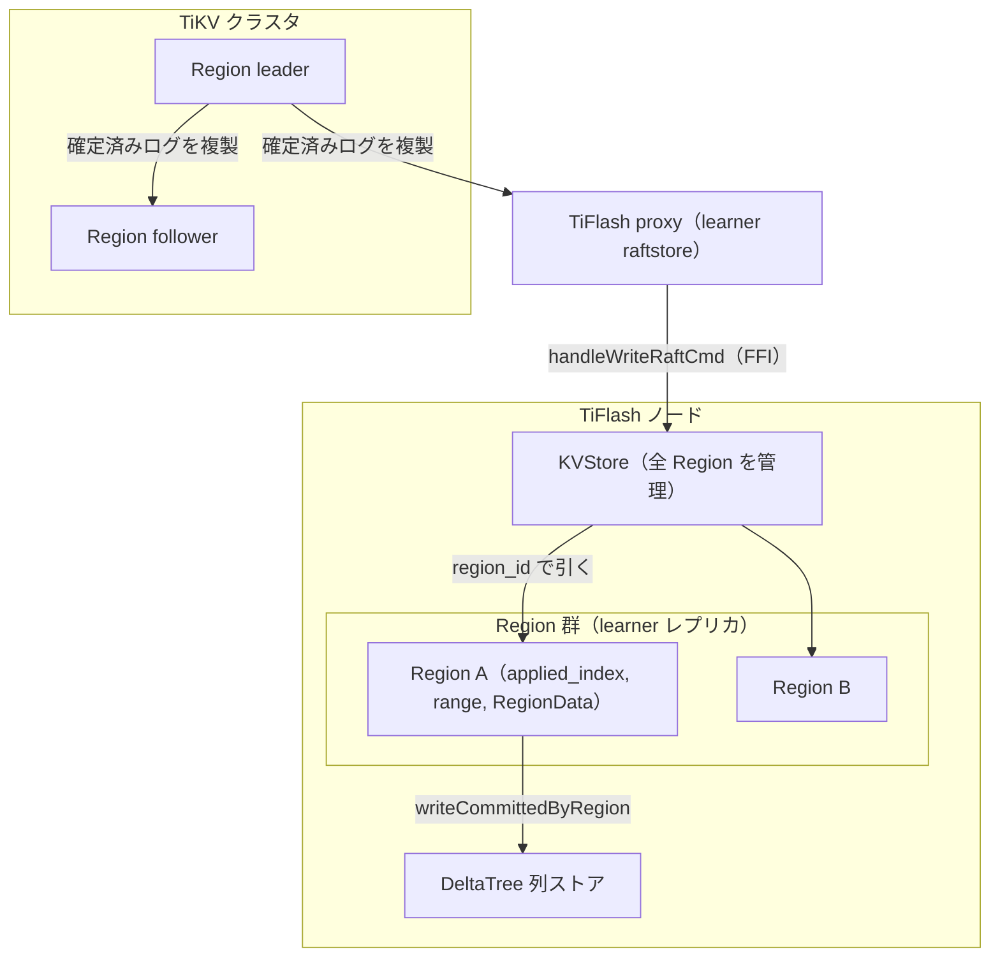

# 第11章 KVStore と Region

> **本章で読むソース**
>
> - [`dbms/src/Storages/KVStore/KVStore.h`](https://github.com/pingcap/tiflash/blob/v8.5.6/dbms/src/Storages/KVStore/KVStore.h)
> - [`dbms/src/Storages/KVStore/KVStore.cpp`](https://github.com/pingcap/tiflash/blob/v8.5.6/dbms/src/Storages/KVStore/KVStore.cpp)
> - [`dbms/src/Storages/KVStore/Region.h`](https://github.com/pingcap/tiflash/blob/v8.5.6/dbms/src/Storages/KVStore/Region.h)
> - [`dbms/src/Storages/KVStore/Region.cpp`](https://github.com/pingcap/tiflash/blob/v8.5.6/dbms/src/Storages/KVStore/Region.cpp)
> - [`dbms/src/Storages/KVStore/MultiRaft/RaftCommandsKVS.cpp`](https://github.com/pingcap/tiflash/blob/v8.5.6/dbms/src/Storages/KVStore/MultiRaft/RaftCommandsKVS.cpp)
> - [`dbms/src/Storages/KVStore/MultiRaft/RaftCommands.cpp`](https://github.com/pingcap/tiflash/blob/v8.5.6/dbms/src/Storages/KVStore/MultiRaft/RaftCommands.cpp)
> - [`dbms/src/Storages/KVStore/MultiRaft/RegionData.h`](https://github.com/pingcap/tiflash/blob/v8.5.6/dbms/src/Storages/KVStore/MultiRaft/RegionData.h)
> - [`dbms/src/Storages/KVStore/FFI/ProxyFFI.cpp`](https://github.com/pingcap/tiflash/blob/v8.5.6/dbms/src/Storages/KVStore/FFI/ProxyFFI.cpp)

## この章の狙い

TiFlash は TiKV のクラスタに learner として加わり、確定済みの書き込みを複製として受け取る。
その入口にあたるのが、ノード上の全 Region を束ねる **`KVStore`** と、1つの Region の learner レプリカを表す **`Region`** である。
[第3章](../part00-overview/03-relationship-with-tidb-tikv.md)では書き込み軸の境界面だけを確定した。
本章はその境界の内側に入り、proxy から届いた書き込みコマンドが Region へ適用されるまでの道筋を読む。
行から列への変換そのものは[第12章](12-apply-and-row-to-column.md)に、index 合わせによる learner read は[第13章](13-learner-read.md)に譲る。

## 前提

Region と Peer、Raft のリーダーとフォロワーとラーナーといった用語は TiKV 編で定義済みとする。
TiKV 側で Raft の合意とログ適用を回す raftstore の構造は、[TiKV 編 第7章](../../tikv/part02-raft/07-raftstore-overview.md)で読んだものを前提にする。
TiFlash はその raftstore に対応する learner 側の構造を持ち、ログを投票せずに受け取るだけである。
TiFlash は内部に TiKV 由来の raftstore をフォークした proxy を抱え、その proxy が learner peer として Raft に加わる。
エントリが確定すると、proxy は FFI を通じて TiFlash の `KVStore` の関数を呼ぶ。

次の図は、TiKV から proxy を経て `KVStore` と各 Region(learner) へ書き込みが流れる構図を示す。



## KVStore がノード上の全 Region を束ねる

`KVStore` は、この TiFlash ノードが抱えるすべての Region を保持し、Region 管理の入口を提供する。

[`dbms/src/Storages/KVStore/KVStore.h` L156-L163](https://github.com/pingcap/tiflash/blob/v8.5.6/dbms/src/Storages/KVStore/KVStore.h#L156-L163)

```cpp
public: // Region Management
    void restore(PathPool & path_pool, const TiFlashRaftProxyHelper *);
    void gcPersistedRegion(Seconds gc_persist_period = Seconds(60 * 5));
    RegionPtr getRegion(RegionID region_id) const;
    RegionMap getRegionsByRangeOverlap(const RegionRange & range) const;
    void traverseRegions(std::function<void(RegionID, const RegionPtr &)> && callback) const;
    RegionPtr genRegionPtr(metapb::Region && region, UInt64 peer_id, UInt64 index, UInt64 term);
    void handleDestroy(UInt64 region_id, TMTContext & tmt);
```

`getRegion` が `region_id` から Region を引き、`getRegionsByRangeOverlap` がキー範囲に重なる Region を集める。
`genRegionPtr` が新しい Region を作り、`handleDestroy` がノードから外れた Region を消す。
これらは `RegionManager` が持つ Region の表を介して働く。

[`dbms/src/Storages/KVStore/KVStore.cpp` L162-L168](https://github.com/pingcap/tiflash/blob/v8.5.6/dbms/src/Storages/KVStore/KVStore.cpp#L162-L168)

```cpp
RegionPtr KVStore::getRegion(RegionID region_id) const
{
    auto manage_lock = genRegionMgrReadLock();
    if (auto it = manage_lock.regions.find(region_id); it != manage_lock.regions.end())
        return it->second;
    return nullptr;
}
```

`getRegion` は `RegionManager` の読み取りロックを取ってから表を引く。
読み取りロックなので、複数のスレッドが別々の Region を同時に引ける。
見つからなければ `nullptr` を返し、呼び出し側はその Region がこのノードに無いと判断する。

## proxy から FFI で書き込みコマンドが届く

proxy は Raft の learner peer としてログの複製を受け、エントリが確定すると TiFlash 側の FFI 関数を呼ぶ。
書き込みコマンドの入口は `HandleWriteRaftCmd` である。

[`dbms/src/Storages/KVStore/FFI/ProxyFFI.cpp` L92-L98](https://github.com/pingcap/tiflash/blob/v8.5.6/dbms/src/Storages/KVStore/FFI/ProxyFFI.cpp#L92-L98)

```cpp
EngineStoreApplyRes HandleWriteRaftCmd(const EngineStoreServerWrap * server, WriteCmdsView cmds, RaftCmdHeader header)
{
    try
    {
        RUNTIME_CHECK(server->tmt != nullptr);
        return server->tmt->getKVStore()
            ->handleWriteRaftCmd(cmds, header.region_id, header.index, header.term, *server->tmt);
```

proxy は確定済みの書き込みを `WriteCmdsView` に詰め、`RaftCmdHeader` に `region_id` と `index`、`term` を載せて渡す。
FFI 関数はそれを `KVStore::handleWriteRaftCmd` へそのまま転送する。
`KVStore` が公開する Raft の読み書き関数は次の2つである。

[`dbms/src/Storages/KVStore/KVStore.h` L165-L178](https://github.com/pingcap/tiflash/blob/v8.5.6/dbms/src/Storages/KVStore/KVStore.h#L165-L178)

```cpp
public: // Raft Read and Write
    EngineStoreApplyRes handleAdminRaftCmd(
        raft_cmdpb::AdminRequest && request,
        raft_cmdpb::AdminResponse && response,
        UInt64 region_id,
        UInt64 index,
        UInt64 term,
        TMTContext & tmt);
    EngineStoreApplyRes handleWriteRaftCmd(
        const WriteCmdsView & cmds,
        UInt64 region_id,
        UInt64 index,
        UInt64 term,
        TMTContext & tmt);
```

`handleWriteRaftCmd` が通常の書き込みを、`handleAdminRaftCmd` が split や merge などの管理コマンドを受ける。
どちらも `region_id` で対象の Region を選び、`index` と `term` でどこまで適用したかを進める。
`handleWriteRaftCmd` は内部で `handleWriteRaftCmdInner` を呼び、そこで対象の Region を引いて適用へ渡す。

[`dbms/src/Storages/KVStore/MultiRaft/RaftCommandsKVS.cpp` L44-L62](https://github.com/pingcap/tiflash/blob/v8.5.6/dbms/src/Storages/KVStore/MultiRaft/RaftCommandsKVS.cpp#L44-L62)

```cpp
EngineStoreApplyRes KVStore::handleWriteRaftCmdInner(
    const WriteCmdsView & cmds,
    UInt64 region_id,
    UInt64 index,
    UInt64 term,
    TMTContext & tmt,
    DM::WriteResult & write_result)
{
    EngineStoreApplyRes apply_res;
    {
        auto region_persist_lock = region_manager.genRegionTaskLock(region_id);

        const RegionPtr region = getRegion(region_id);
        if (region == nullptr)
        {
            return EngineStoreApplyRes::NotFound;
        }

        std::tie(apply_res, write_result) = region->handleWriteRaftCmd(cmds, index, term, tmt);
```

まず `genRegionTaskLock(region_id)` で、その Region 専用のタスクロックを取る。
このロックは Region ごとに分かれているため、別々の Region への適用は互いに待たずに進む。
次に `getRegion` で対象の Region を引き、無ければ `NotFound` を返す。
あとは `region->handleWriteRaftCmd` に適用そのものを委ねる。

## Region が1つの learner レプリカを表す

`Region` は、1つの Region の KV データをすべて保持する単位である。

[`dbms/src/Storages/KVStore/Region.h` L66-L68](https://github.com/pingcap/tiflash/blob/v8.5.6/dbms/src/Storages/KVStore/Region.h#L66-L68)

```cpp
/// Store all kv data of one region. Including 'write', 'data' and 'lock' column families.
class Region : public std::enable_shared_from_this<Region>
{
```

コメントのとおり、1つの Region が持つ write、data、lock の3つのカラムファミリーのデータを抱える。
ここでいう data は、コード上の default カラムファミリーにあたる。

[`dbms/src/Storages/KVStore/MultiRaft/RegionData.h` L124-L132](https://github.com/pingcap/tiflash/blob/v8.5.6/dbms/src/Storages/KVStore/MultiRaft/RegionData.h#L124-L132)

```cpp
private:
    RegionWriteCFData write_cf;
    RegionDefaultCFData default_cf;
    RegionLockCFData lock_cf;
    OrphanKeysInfo orphan_keys_info;

    // Size of data cf & write cf, without lock cf.
    std::atomic<size_t> cf_data_size = 0;
};
```

`RegionData` がその3つを `write_cf`、`default_cf`、`lock_cf` として持つ。
これらは TiKV から届いたままの、まだデコードしていない KV データである。
write CF はコミット記録を、default CF は長い値の本体を、lock CF は未コミットのロックを保持する。
TiKV の Percolator が使う3つのカラムファミリーが、そのまま learner 側に写る。

Region は生データに加えて、適用済み index とキー範囲も持つ。

[`dbms/src/Storages/KVStore/Region.cpp` L105-L108](https://github.com/pingcap/tiflash/blob/v8.5.6/dbms/src/Storages/KVStore/Region.cpp#L105-L108)

```cpp
UInt64 Region::appliedIndex() const
{
    return meta.appliedIndex();
}
```

[`dbms/src/Storages/KVStore/Region.cpp` L255-L258](https://github.com/pingcap/tiflash/blob/v8.5.6/dbms/src/Storages/KVStore/Region.cpp#L255-L258)

```cpp
ImutRegionRangePtr Region::getRange() const
{
    return meta.getRange();
}
```

`appliedIndex` は、この Region がどこまで Raft ログを適用したかを返す。
`getRange` は、この Region が受け持つキー範囲を返す。
どちらも `RegionMeta` が保持し、`RegionData` の生データと合わせて1つの learner レプリカの状態を作る。

## 書き込みの適用本体

Region への適用は `Region::handleWriteRaftCmd` が引き受ける。
先頭で、すでに適用済みのコマンドを弾く。

[`dbms/src/Storages/KVStore/MultiRaft/RaftCommands.cpp` L302-L311](https://github.com/pingcap/tiflash/blob/v8.5.6/dbms/src/Storages/KVStore/MultiRaft/RaftCommands.cpp#L302-L311)

```cpp
std::pair<EngineStoreApplyRes, DM::WriteResult> Region::handleWriteRaftCmd(
    const WriteCmdsView & cmds,
    UInt64 index,
    UInt64 term,
    TMTContext & tmt)
{
    if (index <= appliedIndex())
    {
        return std::make_pair(EngineStoreApplyRes::None, std::nullopt);
    }
```

`index` が現在の適用済み index 以下なら、そのコマンドは適用済みなので何もしない。
proxy が同じエントリを再送しても二重に適用されないため、適用は冪等になる。

カラムファミリーへの反映には順序がある。

[`dbms/src/Storages/KVStore/MultiRaft/RaftCommands.cpp` L447-L469](https://github.com/pingcap/tiflash/blob/v8.5.6/dbms/src/Storages/KVStore/MultiRaft/RaftCommands.cpp#L447-L469)

```cpp
    const auto handle_write_cmd_func = [&]() {
        size_t cmd_write_cf_cnt = 0, cache_written_size = 0;
        auto ori_cache_size = dataSize();
        for (UInt64 i = 0; i < cmds.len; ++i)
        {
            if (cmds.cmd_cf[i] == ColumnFamilyType::Write)
                cmd_write_cf_cnt++;
            else
                handle_by_index_func(i);
        }

        if (cmd_write_cf_cnt)
        {
            for (UInt64 i = 0; i < cmds.len; ++i)
            {
                if (cmds.cmd_cf[i] == ColumnFamilyType::Write)
                    handle_by_index_func(i);
            }
        }
        cache_written_size = dataSize() - ori_cache_size;
        approx_mem_cache_rows += cmd_write_cf_cnt;
        approx_mem_cache_bytes += cache_written_size;
    };
```

`handle_write_cmd_func` は、まず write 以外のカラムファミリー（default と lock）を反映し、そのあとで write カラムファミリーを反映する。
この順序には理由がある。
write CF のコミット記録は値の本体を default CF 側に置く場合があり、コミットを処理する時点でその本体が必要になる。
default CF を先に入れておけば、write CF を処理するときに対応する値がすでにそろっている。
逆順だと、コミット記録が指す値がまだ無い瞬間が生まれてしまう。

write カラムファミリーまで反映したら、コミット済みのデータを列ストアへ流す。

[`dbms/src/Storages/KVStore/MultiRaft/RaftCommands.cpp` L487-L492](https://github.com/pingcap/tiflash/blob/v8.5.6/dbms/src/Storages/KVStore/MultiRaft/RaftCommands.cpp#L487-L492)

```cpp
            /// Flush data right after they are committed.
            RegionDataReadInfoList data_list_to_remove;
            try
            {
                write_result
                    = RegionTable::writeCommittedByRegion(context, shared_from_this(), data_list_to_remove, log, true);
```

`RegionTable::writeCommittedByRegion` が、コミット済みの行を `RegionData` から取り出し、列ストア DeltaTree への書き込みへつなぐ。
このときに行フォーマットから列フォーマットへの変換が起き、結果は `DM::WriteResult` として返る。
変換の中身は[第12章](12-apply-and-row-to-column.md)で読む。

最後に適用済み index を進める。

[`dbms/src/Storages/KVStore/MultiRaft/RaftCommands.cpp` L522-L527](https://github.com/pingcap/tiflash/blob/v8.5.6/dbms/src/Storages/KVStore/MultiRaft/RaftCommands.cpp#L522-L527)

```cpp
        meta.setApplied(index, term);
    }

    meta.notifyAll();

    return std::make_pair(EngineStoreApplyRes::None, std::move(write_result));
```

`meta.setApplied(index, term)` で、この Region の適用済み index をこのコマンドの index まで進める。
`notifyAll` は、この index を待っていた読み取り側を起こす。
この通知が、learner read で `waitIndex` が待ち合わせる相手になる。

## 管理コマンドの適用

通常の書き込みとは別に、Region の形を変える管理コマンドが `handleAdminRaftCmd` に届く。
適用は `RegionRaftCommandDelegate` が引き受ける。

[`dbms/src/Storages/KVStore/Region.h` L341-L350](https://github.com/pingcap/tiflash/blob/v8.5.6/dbms/src/Storages/KVStore/Region.h#L341-L350)

```cpp
    Regions execBatchSplit(
        const raft_cmdpb::AdminRequest & request,
        const raft_cmdpb::AdminResponse & response,
        UInt64 index,
        UInt64 term);
    void execChangePeer(
        const raft_cmdpb::AdminRequest & request,
        const raft_cmdpb::AdminResponse & response,
        UInt64 index,
        UInt64 term);
```

`execBatchSplit` が1つの Region を複数に割り、`execChangePeer` が Peer の増減を反映する。
このほかに merge を担う関数もあり、TiKV 側の Region 構成の変化を learner 側へ写す。
書き込みと同じく、これらも TiKV が確定した結果を後追いで適用するだけで、TiFlash が構成を決めることはない。

## 機構の工夫：投票せず、Region ごとに並列適用する

この経路の設計には、性能と安全の両面で工夫がある。

第1に、TiFlash は learner として複製を受けるだけで、Raft の合意に投票しない。
OLTP の書き込みは TiKV のリーダーとフォロワーの合意で確定し、その定足数に TiFlash は加わらない。
そのため列ストアの更新がどれだけ遅れても、取引側の書き込みレイテンシを引き延ばさない。
learner は確定済みのログを非同期に受け取り、列ストアを後から最新化する。

第2に、適用は Region ごとのタスクロックで仕切られる。
`handleWriteRaftCmdInner` が `genRegionTaskLock(region_id)` で取るロックは Region 単位なので、別々の Region への適用は並列に進む。
`getRegion` の側は読み取りロックで Region の表を引くため、適用中の Region があっても他の Region の検索を妨げない。
多数の Region を抱えるノードでも、書き込みの適用がノード全体の直列点にならない。

第3に、適用は適用済み index による冪等性で守られる。
`index <= appliedIndex()` の判定が再送を弾くため、proxy がエントリを送り直しても列ストアが二重に更新されない。

## まとめ

TiFlash の Raft learner 経路の入口は、`KVStore` と `Region` の2つである。
`KVStore` はノード上の全 Region を束ね、proxy から FFI で届いた `handleWriteRaftCmd` を `region_id` で対応する Region へ振り分ける。
`Region` は1つの learner レプリカを表し、write、default、lock の3カラムファミリーの生データと適用済み index、キー範囲を持つ。
`Region::handleWriteRaftCmd` は、適用済み index で再送を弾き、default と lock を write より先に反映し、コミット済みデータを列ストアへ流してから index を進める。
learner として投票しないことで OLTP のレイテンシから切り離し、Region ごとのタスクロックで適用を並列化する。

## 関連する章

- [第3章 TiDB、TiKV との関係（MPP と learner replica）](../part00-overview/03-relationship-with-tidb-tikv.md)：書き込み軸と読み取り軸の境界面。
- [第12章 Raft log の適用と行から列への変換](12-apply-and-row-to-column.md)：コミット済みデータを列ストアへ流す変換の中身。
- [第13章 learner read と読み取り一貫性](13-learner-read.md)：適用済み index を使った読み取りの鮮度合わせ。
- [TiKV 編 第7章 raftstore の全体像](../../tikv/part02-raft/07-raftstore-overview.md)：learner が対応する TiKV 側のログ適用構造。
