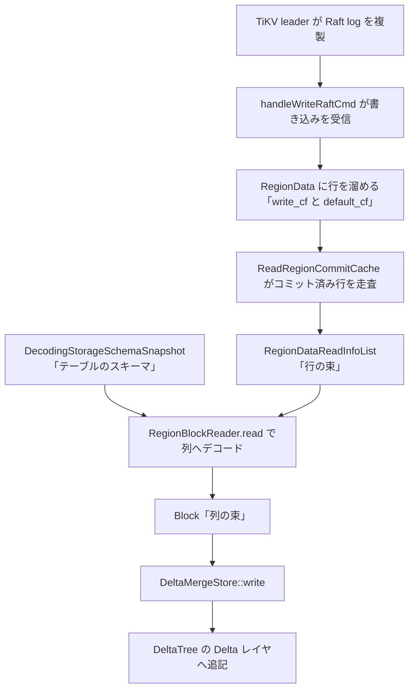

# 第12章 Raft log の適用と行から列への変換

> **本章で読むソース**
>
> - [`dbms/src/Storages/KVStore/Region.h`](https://github.com/pingcap/tiflash/blob/v8.5.6/dbms/src/Storages/KVStore/Region.h#L248-L252)
> - [`dbms/src/Storages/KVStore/MultiRaft/RegionData.h`](https://github.com/pingcap/tiflash/blob/v8.5.6/dbms/src/Storages/KVStore/MultiRaft/RegionData.h#L125-L127)
> - [`dbms/src/Storages/KVStore/MultiRaft/RaftCommands.cpp`](https://github.com/pingcap/tiflash/blob/v8.5.6/dbms/src/Storages/KVStore/MultiRaft/RaftCommands.cpp#L450-L465)
> - [`dbms/src/Storages/KVStore/MultiRaft/RaftCommands.cpp`](https://github.com/pingcap/tiflash/blob/v8.5.6/dbms/src/Storages/KVStore/MultiRaft/RaftCommands.cpp#L485-L492)
> - [`dbms/src/Storages/KVStore/Decode/PartitionStreams.cpp`](https://github.com/pingcap/tiflash/blob/v8.5.6/dbms/src/Storages/KVStore/Decode/PartitionStreams.cpp#L342-L356)
> - [`dbms/src/Storages/KVStore/Decode/RegionBlockReader.h`](https://github.com/pingcap/tiflash/blob/v8.5.6/dbms/src/Storages/KVStore/Decode/RegionBlockReader.h#L24-L39)
> - [`dbms/src/Storages/KVStore/Decode/DecodingStorageSchemaSnapshot.h`](https://github.com/pingcap/tiflash/blob/v8.5.6/dbms/src/Storages/KVStore/Decode/DecodingStorageSchemaSnapshot.h#L43-L50)
> - [`dbms/src/TiDB/Decode/RowCodec.h`](https://github.com/pingcap/tiflash/blob/v8.5.6/dbms/src/TiDB/Decode/RowCodec.h#L27-L34)
> - [`dbms/src/Storages/KVStore/Decode/RegionBlockReader.cpp`](https://github.com/pingcap/tiflash/blob/v8.5.6/dbms/src/Storages/KVStore/Decode/RegionBlockReader.cpp#L226-L238)
> - [`dbms/src/Storages/KVStore/Decode/PartitionStreams.cpp`](https://github.com/pingcap/tiflash/blob/v8.5.6/dbms/src/Storages/KVStore/Decode/PartitionStreams.cpp#L160-L167)
> - [`dbms/src/Storages/KVStore/Decode/PartitionStreams.cpp`](https://github.com/pingcap/tiflash/blob/v8.5.6/dbms/src/Storages/KVStore/Decode/PartitionStreams.cpp#L99-L103)
> - [`dbms/src/Storages/KVStore/Decode/PartitionStreams.cpp`](https://github.com/pingcap/tiflash/blob/v8.5.6/dbms/src/Storages/KVStore/Decode/PartitionStreams.cpp#L238-L253)

## この章の狙い

TiFlash は TiKV から Raft の learner として複製を受け取る。
TiKV が運ぶのは TiDB の tablecodec 形式でエンコードされた**行データ**であり、TiFlash の DeltaTree が読みたいのは**列の束**である。
本章は、複製で受け取った行データが列指向の DeltaTree へ書き込まれるまでの変換を読み、行指向の TiKV と列指向の TiFlash をつなぐ橋がどこに架かっているかを確定させる。

この変換は三段に分かれる。
受信した書き込みを `RegionData` に行のまま溜める段、溜まった行をテーブルのスキーマに従って列ごとにデコードして `Block` へ組み立てる段、列に変換した `Block` を `DeltaMergeStore::write` へ渡して DeltaTree へ書く段である。
本章はこの三段を順に追い、最後にこの経路が行を一度に列化してまとめて書くことで書き込みをバッチ化する仕組みを読む。

## 前提

KVStore と Region の役割は [第11章](11-kvstore-and-region.md) で扱ったため、本章では前提とする。
DeltaTree の入口 `DeltaMergeStore` と、その `write` が `Block` を受けて Segment の Delta レイヤへ追記する流れは [第5章](../part01-deltatree/05-deltamergestore.md) で読んだ。
TiKV が行をどうエンコードするか、すなわち write CF と default CF への分割と TiDB の行フォーマットは、TiDB 編 [第15章](../../tidb/part04-txn/15-kv-encoding.md) で扱う。
本章のコード引用はすべて pingcap/tiflash のタグ `v8.5.6` に固定し、読者には C++ と列指向データベースの基礎を仮定する。

## 受信 handleWriteRaftCmd が行を溜める

Raft の learner として届いた書き込みは、`Region::handleWriteRaftCmd` が受け取る。

[`dbms/src/Storages/KVStore/Region.h`](https://github.com/pingcap/tiflash/blob/v8.5.6/dbms/src/Storages/KVStore/Region.h#L248-L252)

```cpp
    std::pair<EngineStoreApplyRes, DM::WriteResult> handleWriteRaftCmd(
        const WriteCmdsView & cmds,
        UInt64 index,
        UInt64 term,
        TMTContext & tmt);
```

`cmds` は Raft log のエントリから取り出した書き込みコマンドの並びであり、各コマンドはどのカラムファミリーへの put か del かを持つ。
TiKV と同じく、TiFlash の Region も書き込みを3つのカラムファミリーに分けて溜める。

[`dbms/src/Storages/KVStore/MultiRaft/RegionData.h`](https://github.com/pingcap/tiflash/blob/v8.5.6/dbms/src/Storages/KVStore/MultiRaft/RegionData.h#L125-L127)

```cpp
    RegionWriteCFData write_cf;
    RegionDefaultCFData default_cf;
    RegionLockCFData lock_cf;
```

`write_cf` はコミット記録を保持し、キーは handle と commit_ts、値は対応するトランザクションの start_ts と書き込み種別を指す。
`default_cf` は長い行の本体を保持し、`lock_cf` はプリライト中のロックを保持する。
Percolator のこの三層構造は TiKV から受け取った形をそのまま写したものであり、TiFlash はこの段では行を列に直さず、TiKV と同じ行の姿のままメモリ上の `RegionData` に溜める。

`handleWriteRaftCmd` は届いたコマンドを `RegionData` へ適用するが、その適用順に一つの工夫がある。

[`dbms/src/Storages/KVStore/MultiRaft/RaftCommands.cpp`](https://github.com/pingcap/tiflash/blob/v8.5.6/dbms/src/Storages/KVStore/MultiRaft/RaftCommands.cpp#L450-L465)

```cpp
        for (UInt64 i = 0; i < cmds.len; ++i)
        {
            if (cmds.cmd_cf[i] == ColumnFamilyType::Write)
                cmd_write_cf_cnt++;
            else
                handle_by_index_func(i);
        }

        if (cmd_write_cf_cnt)
        {
            for (UInt64 i = 0; i < cmds.len; ++i)
            {
                if (cmds.cmd_cf[i] == ColumnFamilyType::Write)
                    handle_by_index_func(i);
            }
        }
```

最初のループは write CF 以外、すなわち default CF と lock CF のコマンドを先に適用し、write CF のコマンド数だけを数える。
write CF のコマンドが1つでもあれば、2番目のループでそれらをまとめて適用する。
この二段の順序により、コミット記録を適用する時点で、それが指す行の本体が `default_cf` にすでに揃っていることを保証する。
1回の Raft バッチの中で本体とコミット記録が前後しても、本体を先に置いてからコミット記録を当てるため、後段のデコードで本体が見つからない事態を避けられる。

## コミット直後に flush を呼ぶ

`RegionData` に行を溜めたら、`handleWriteRaftCmd` はそのコマンドで新たにコミットされた行を DeltaTree へ流し込む。

[`dbms/src/Storages/KVStore/MultiRaft/RaftCommands.cpp`](https://github.com/pingcap/tiflash/blob/v8.5.6/dbms/src/Storages/KVStore/MultiRaft/RaftCommands.cpp#L485-L492)

```cpp
        if (0 != cmds.len)
        {
            /// Flush data right after they are committed.
            RegionDataReadInfoList data_list_to_remove;
            try
            {
                write_result
                    = RegionTable::writeCommittedByRegion(context, shared_from_this(), data_list_to_remove, log, true);
```

`writeCommittedByRegion` がこの flush の入口であり、コミット済みの行を読み出して列へ変換し、DeltaTree へ書いたうえで、書き終えた行を `RegionData` から取り除く。
コメントが述べるとおり、コミット直後に流すため、`RegionData` はコミット済みの行を長く抱えず、未コミットのプリライトとロックを主に保持する状態へ戻る。

flush の最初の仕事は、`write_cf` を走査してコミット済みの行を1つのリストに集めることである。

[`dbms/src/Storages/KVStore/Decode/PartitionStreams.cpp`](https://github.com/pingcap/tiflash/blob/v8.5.6/dbms/src/Storages/KVStore/Decode/PartitionStreams.cpp#L342-L356)

```cpp
std::optional<RegionDataReadInfoList> ReadRegionCommitCache(const RegionPtr & region, bool lock_region)
{
    auto scanner = region->createCommittedScanner(lock_region, true);

    /// Some sanity checks for region meta.
    if (region->isPendingRemove())
        return std::nullopt;

    /// Read raw KVs from region cache.
    // Shortcut for empty region.
    if (!scanner.hasNext())
        return std::nullopt;

    RegionDataReadInfoList data_list_read;
    data_list_read.reserve(scanner.writeMapSize());
```

`createCommittedScanner` は `write_cf` の各コミット記録を順にたどり、記録ごとに handle と書き込み種別と commit_ts、そして `default_cf` から引いた行の本体を1件の `RegionDataReadInfo` にまとめる。
これを集めた `RegionDataReadInfoList` が、列化を待つ行の束である。
`data_list_read.reserve(scanner.writeMapSize())` がコミット記録の数だけ領域を先に確保し、走査の間の再確保を避ける。
この時点でもデータはまだ行の並びであり、列への変換はこの束を入力として次の段で起きる。

## 行を列へ変換する RegionBlockReader

行の束を列の `Block` へ組み立てるのが `RegionBlockReader` である。

[`dbms/src/Storages/KVStore/Decode/RegionBlockReader.h`](https://github.com/pingcap/tiflash/blob/v8.5.6/dbms/src/Storages/KVStore/Decode/RegionBlockReader.h#L24-L39)

```cpp
/// The Reader to read the region data in `data_list` and decode based on the given table_info and columns, as a block.
class RegionBlockReader : private boost::noncopyable
{
public:
    explicit RegionBlockReader(DecodingStorageSchemaSnapshotConstPtr schema_snapshot_);
    // ... (中略) ...
    template <typename ReadList>
    bool read(Block & block, const ReadList & data_list, bool force_decode);
```

`read` は行の束 `data_list` を受け取り、与えられたスキーマに従ってデコードして1つの `block` に詰める。
何を何列にどの型でデコードするかは、コンストラクタに渡す `DecodingStorageSchemaSnapshot` が握る。
この構造体はテーブルのスキーマを1時点のスナップショットとして固定し、Raft データを一貫した構造でデコードするために使う。

[`dbms/src/Storages/KVStore/Decode/DecodingStorageSchemaSnapshot.h`](https://github.com/pingcap/tiflash/blob/v8.5.6/dbms/src/Storages/KVStore/Decode/DecodingStorageSchemaSnapshot.h#L43-L50)

```cpp
struct DecodingStorageSchemaSnapshot
{
    DecodingStorageSchemaSnapshot(
        DM::ColumnDefinesPtr column_defines_,
        const TiDB::TableInfo & table_info_,
        const DM::ColumnDefine & original_handle_,
        Int64 decoding_schema_epoch_,
        bool with_version_column);
```

`TiDB::TableInfo` が TiDB から同期したテーブル定義であり、どの列 id がどの型を持つかを与える。
スナップショットは列 id でソートしたマップ（`col_id_to_block_pos`）を持ち、各行の値を列 id の順に並んだ `Block` の何番目の列へ入れるかを引けるようにする。
extra handle、削除マーク、バージョンの3列は他の可視列より小さい列 id を割り当てられ、`Block` の先頭に並ぶ。

行1件の値そのものをデコードして列へ追加するのは、TiDB の行フォーマットを解く `appendRowToBlock` である。

[`dbms/src/TiDB/Decode/RowCodec.h`](https://github.com/pingcap/tiflash/blob/v8.5.6/dbms/src/TiDB/Decode/RowCodec.h#L27-L34)

```cpp
bool appendRowToBlock(
    const TiKVValue::Base & raw_value,
    SortedColumnIDWithPosConstIter column_ids_iter,
    SortedColumnIDWithPosConstIter column_ids_iter_end,
    Block & block,
    size_t block_column_pos,
    const DecodingStorageSchemaSnapshotConstPtr & schema_snapshot,
    bool force_decode);
```

`raw_value` が `default_cf` から取った1行分のエンコード済みバイト列であり、`appendRowToBlock` はそれを列ごとに切り出して `block` の対応する列へ1つずつ足す。
TiDB の行フォーマットの中身、すなわち列 id とオフセットの並べ方は TiDB 編 [第15章](../../tidb/part04-txn/15-kv-encoding.md) で扱うため、本章ではこの関数が行バイト列を列の値へ展開する境界として読む。
handle と commit_ts はキー側から取れるため、`RegionBlockReader` は値の本体を `appendRowToBlock` に任せ、handle 列とバージョン列と削除マーク列はキーと書き込み種別から自前で埋める。

## 列を一括で確保してから詰める

`RegionBlockReader::read` の組み立てには、行から列への変換を安く済ませる工夫がある。

[`dbms/src/Storages/KVStore/Decode/RegionBlockReader.cpp`](https://github.com/pingcap/tiflash/blob/v8.5.6/dbms/src/Storages/KVStore/Decode/RegionBlockReader.cpp#L226-L238)

```cpp
    ColumnUInt8::Container & delmark_data = raw_delmark_col->getData();
    delmark_data.reserve(data_list.size());
    version_col_resolver.preRead(data_list.size());
    bool need_decode_value = block.columns() > version_col_resolver.reservedCount();
    if (need_decode_value)
    {
        size_t expected_rows = data_list.size();
        for (size_t pos = next_column_pos; pos < block.columns(); pos++)
        {
            auto * raw_column = const_cast<IColumn *>((block.getByPosition(pos)).column.get());
            raw_column->reserve(expected_rows);
        }
    }
```

デコードを始める前に、削除マーク列とバージョン列、そしてすべての可視列の領域を、束の行数 `data_list.size()` の分だけ一度に確保する。
そのあと束を1行ずつたどり、各行の値を `appendRowToBlock` で列へ足していく。
列ごとに連続した領域へ末尾追記していくため、`Block` は最初から行数分の容量を持ち、行を追加するたびに列の配列を伸ばし直すコストが生じない。
1行ごとに `Block` を作って結合するのではなく、束の全行を1枚の `Block` の各列へまとめて詰めるこの作りが、行から列への変換を束単位のバッチにしている。

## 列に変換した Block を DeltaTree へ書く

組み立てた `Block` を DeltaTree へ書くまでの結節点が、flush 経路の `atomicReadWrite` である。

[`dbms/src/Storages/KVStore/Decode/PartitionStreams.cpp`](https://github.com/pingcap/tiflash/blob/v8.5.6/dbms/src/Storages/KVStore/Decode/PartitionStreams.cpp#L160-L167)

```cpp
        DecodingStorageSchemaSnapshotConstPtr decoding_schema_snapshot;
        std::tie(decoding_schema_snapshot, block_ptr)
            = storage->getSchemaSnapshotAndBlockForDecoding(lock, true, should_handle_version_col);
        block_decoding_schema_epoch = decoding_schema_snapshot->decoding_schema_epoch;

        auto reader = RegionBlockReader(decoding_schema_snapshot);
        if (!reader.read(*block_ptr, data_list_read, force_decode))
            return false;
```

`getSchemaSnapshotAndBlockForDecoding` がスキーマのスナップショットと、そのスキーマに合わせた空の `Block` を1つ返す。
この `Block` は使い回しのために確保された器であり、`RegionBlockReader` がそこへ行の束をデコードして詰める。
デコードに成功したら、その `Block` を storage の `write` へ渡す。

[`dbms/src/Storages/KVStore/Decode/PartitionStreams.cpp`](https://github.com/pingcap/tiflash/blob/v8.5.6/dbms/src/Storages/KVStore/Decode/PartitionStreams.cpp#L99-L103)

```cpp
    auto dm_storage = std::dynamic_pointer_cast<StorageDeltaMerge>(storage);
    rw_ctx.write_result = dm_storage->write(block, rw_ctx.context.getSettingsRef(), applied_status);
    rw_ctx.write_part_cost = watch.elapsedMilliseconds();
    GET_METRIC(tiflash_raft_write_data_to_storage_duration_seconds, type_write)
        .Observe(rw_ctx.write_part_cost / 1000.0);
```

`StorageDeltaMerge::write` が DeltaTree の入口 `DeltaMergeStore::write` へつながり、列に変換した `Block` を Segment 単位に切り分けて各 Segment の Delta レイヤへ追記する。
ここで小さな塊はメモリ上の `MemTableSet` へ、大きな塊はディスクへと経路が分かれ、溜まった Delta はバックグラウンドの Delta Merge が Stable へ畳む。
この先の流れは [第5章](../part01-deltatree/05-deltamergestore.md) で読んだとおりであり、デコードの直後に `releaseDecodingBlock` で器の `Block` を返して次の flush に使い回す。

書き終えた `write_result` は `DM::WriteResult` として上位へ戻り、Delta が一定量たまったときに、そのテーブルのバックグラウンドの Delta Merge や Segment の分割を促す合図になる。
つまり flush は毎回のコミットで起きるが、それを Stable へ畳む重い整理はこの合図を受けて背景でまとめて進み、前景の Raft 適用を止めない。

## スキーマがずれたときのリトライ

行から列への変換は、デコードに使うスキーマが実データと食い違うと失敗する。
TiFlash の Raft 適用とスキーマ同期は厳密には同期しておらず、TiKV 側の DDL より先に新しい行フォーマットの Raft log が届くことがある。
このずれに備えて、書き込み経路は2回まで試す。

[`dbms/src/Storages/KVStore/Decode/PartitionStreams.cpp`](https://github.com/pingcap/tiflash/blob/v8.5.6/dbms/src/Storages/KVStore/Decode/PartitionStreams.cpp#L238-L253)

```cpp
    /// Try read then write once.
    {
        if (atomicReadWrite(rw_ctx, region, data_list_read, false))
        {
            return std::move(rw_ctx.write_result);
        }
    }

    /// If first try failed, sync schema and force read then write.
    {
        GET_METRIC(tiflash_schema_trigger_count, type_raft_decode).Increment();
        Stopwatch watch;
        tmt.getSchemaSyncerManager()->syncTableSchema(context, keyspace_id, table_id);
        auto schema_sync_cost = watch.elapsedMilliseconds();
        LOG_INFO(log, "sync schema cost {} ms, keyspace={} table_id={}", schema_sync_cost, keyspace_id, table_id);
        if (!atomicReadWrite(rw_ctx, region, data_list_read, true))
```

1回目は `force_decode` を `false` にして、手元のスキーマでデコードを試す。
列の数や型が合わずに失敗したら、TiDB から最新のスキーマを同期し、`force_decode` を `true` にして2回目を試す。
2回目は未知の列の追加や欠けた列の除去、型のキャストを許して、デコードを最後までやり切る。
平常時はスキーマが合っているため1回目で抜け、スキーマ同期という重い処理はずれが起きたときだけ走る。
この二段構えにより、毎回の flush でスキーマ同期を待つことなく、まれな DDL 遅延にも取りこぼさず対応できる。

## 行から列への変換の全体像

ここまでの三段を図にすると次のようになる。



TiKV から行のまま受け取り、`RegionData` に溜め、コミット済みの束を取り出し、スキーマで列へデコードし、`Block` を DeltaTree へ書く。
この経路が、行指向の TiKV と列指向の TiFlash の間の橋である。

## バッチ化が行から列への変換を支える

本章で読んだ経路の工夫は、行を1件ずつ列化せず、束にまとめて1枚の `Block` へ変換する点に集約できる。
`handleWriteRaftCmd` は受け取った行を `RegionData` にいったん溜め、flush のときに `ReadRegionCommitCache` がコミット済みの行をまとめて取り出す。
`RegionBlockReader` はその束の行数だけ各列の領域を一度に確保し、全行を列ごとに連続して詰めて1枚の `Block` を作る。
その `Block` を `DeltaMergeStore::write` へ1回で渡すため、DeltaTree への書き込みも束単位になる。

このバッチ化が、行指向から列指向への変換という課題を安く解く。
列指向のストレージは値を列ごとに連続させて圧縮と走査を速くする代わりに、1行ずつの追加が高くつく。
受け取った行をすぐ列化せず一定量を `RegionData` にためてからまとめて列ブロックへ変換すれば、列の配列を伸ばし直すコストと `write` の呼び出し回数の両方を行数で割って薄められる。
さらにデコード用の `Block` を使い回し、スキーマ同期をずれたときだけに限ることで、平常時の flush をデコードと追記の最小限の仕事に保つ。

## まとめ

`Region::handleWriteRaftCmd` は learner として届いた書き込みを受け取り、TiKV と同じ行の姿のまま `write_cf` と `default_cf` と `lock_cf` の3つのカラムファミリーへ溜める。
default CF を先に、write CF を後に適用する二段の順序が、コミット記録を当てる時点で行の本体が揃っていることを保証する。
コミット直後の flush で `ReadRegionCommitCache` がコミット済みの行を1つの束に集め、`RegionBlockReader` が `DecodingStorageSchemaSnapshot` の与えるスキーマに従って束を列ごとにデコードし、`appendRowToBlock` が TiDB の行フォーマットを解いて1枚の `Block` へ詰める。
列に変換した `Block` は `DeltaMergeStore::write` へ渡って DeltaTree の Delta レイヤへ追記され、スキーマがずれたときは同期して `force_decode` で1度だけ再試行する。
受け取った行を溜めてからまとめて列化し、`Block` 単位で書き込むバッチ化が、行指向の TiKV と列指向の TiFlash をつなぐ橋を安く保つ。

## 関連する章

- [KVStore と Region](11-kvstore-and-region.md)：本章が前提とする Region と書き込み受信の枠組みを読む。
- [learner read と読み取り一貫性](13-learner-read.md)：列化して書いたデータを読むときの一貫性を読む。
- [DeltaMergeStore 概観](../part01-deltatree/05-deltamergestore.md)：列の `Block` を受け取る DeltaTree の入口 `write` を読む。
- [行とインデックスの KV エンコード](../../tidb/part04-txn/15-kv-encoding.md)：TiKV が行をどうエンコードするか、TiDB 編で行フォーマットを読む。
