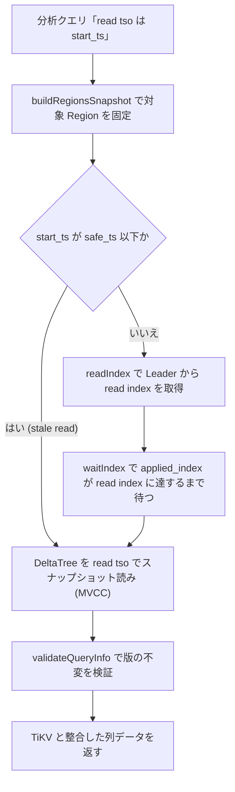

# 第13章 learner read と読み取り一貫性

> **本章で読むソース**
>
> - [`dbms/src/Storages/KVStore/Read/LearnerRead.cpp`](https://github.com/pingcap/tiflash/blob/v8.5.6/dbms/src/Storages/KVStore/Read/LearnerRead.cpp)
> - [`dbms/src/Storages/KVStore/Read/LearnerReadWorker.h`](https://github.com/pingcap/tiflash/blob/v8.5.6/dbms/src/Storages/KVStore/Read/LearnerReadWorker.h)
> - [`dbms/src/Storages/KVStore/Read/LearnerReadWorker.cpp`](https://github.com/pingcap/tiflash/blob/v8.5.6/dbms/src/Storages/KVStore/Read/LearnerReadWorker.cpp)
> - [`dbms/src/Storages/KVStore/Read/ReadIndex.cpp`](https://github.com/pingcap/tiflash/blob/v8.5.6/dbms/src/Storages/KVStore/Read/ReadIndex.cpp)
> - [`dbms/src/Storages/KVStore/MultiRaft/RegionMeta.cpp`](https://github.com/pingcap/tiflash/blob/v8.5.6/dbms/src/Storages/KVStore/MultiRaft/RegionMeta.cpp)
> - [`dbms/src/Storages/KVStore/Region.h`](https://github.com/pingcap/tiflash/blob/v8.5.6/dbms/src/Storages/KVStore/Region.h)

## この章の狙い

第11章と第12章で、TiFlash が Raft の Learner として TiKV から log を受け取り、適用して列ストアへ積むまでを読んだ。
Learner は合意の投票に加わらず、コミット済みの log を非同期に受け取って適用する。
このため、ある瞬間の TiFlash は同じ Region の Leader より遅れている可能性がある。
分析クエリは TiDB が払い出した1つの **read tso**（読み取り時刻）を持ち、その時刻までにコミットされた書き込みをすべて反映した結果を求める。
本章は、遅れうる Learner がこの要求にどう応えるか、その仕組みである **learner read** を読む。

learner read の要は2段階である。
まず TiKV の Leader から、要求時点でコミット済みの log index（read index）を受け取る。
次に、自分の適用済み index がその read index に達するまでスリープして待つ。
待ち合わせが終わった時点で、Learner は read tso までの書き込みをすべて適用し終えている。
あとは read tso をバージョン上限として DeltaTree を MVCC スナップショット読みすれば、TiKV と整合した結果になる。

## 前提

TiFlash が各 Region を `Region` オブジェクトとして保持し、適用済み index を `appliedIndex()` で持つことは[第11章](11-kvstore-and-region.md)で扱った。
Raft log を適用して行を列ストアへ変換し、各行に commit_ts 由来の `version` を付ける流れは[第12章](12-apply-and-row-to-column.md)で扱った。
DeltaTree が `version` をバージョン列として MVCC フィルタで畳み、読み取り時に read tso 以下で最大の版だけを見せることは[第9章](../part01-deltatree/09-delta-merge-and-mvcc.md)で扱った。
read index を Leader 側で確定する Raft の手順は、TiKV 編の[第10章](../../tikv/part02-raft/10-lease-read.md)で扱う。
本章は、これらの上に載る読み取り一貫性の層を読む。

## learner が抱える鮮度の問題

Learner の適用は非同期である。
TiKV の Leader があるトランザクションをコミットした直後でも、その log エントリが TiFlash に届いて適用されるまでには遅延がある。
read tso がそのコミット時刻より後であれば、整合した結果はそのコミットを含まなければならない。
しかし適用が追いついていなければ、TiFlash の列ストアにはまだその行が無い。

そのまま読むと、同じ read tso で TiKV を読んだ場合より古い結果を返してしまう。
この食い違いをなくすには、読む前に「read tso 時点の書き込みがすべて適用済みか」を保証する必要がある。
learner read は、この保証を Raft の index の比較に置き換える。
read tso に対応する書き込みは、Leader 上ではある log index までにコミットされている。
その index まで自分が適用していれば、read tso 時点のデータは手元にそろっている。

## learner read の入口 doLearnerRead

クエリ実行が記憶域から読み始める前に、`doLearnerRead` が対象 Region 群に対して待ち合わせを行う。
この関数は `LearnerReadWorker` を組み立て、対象 Region のスナップショットを固定してから `waitUntilDataAvailable` を呼ぶ。

[`dbms/src/Storages/KVStore/Read/LearnerRead.cpp` L54-L60](https://github.com/pingcap/tiflash/blob/v8.5.6/dbms/src/Storages/KVStore/Read/LearnerRead.cpp#L54-L60)

```cpp
    auto & tmt = context.getTMTContext();
    LearnerReadWorker worker(mvcc_query_info, tmt, for_batch_cop, is_wn_disagg_read, log);
    LearnerReadSnapshot regions_snapshot = worker.buildRegionsSnapshot();
    const auto & [start_time, end_time] = worker.waitUntilDataAvailable( //
        regions_snapshot,
        tmt.batchReadIndexTimeout(),
        tmt.waitIndexTimeout());
```

`buildRegionsSnapshot` は、クエリが対象とする各 `region_id` について `KVStore` から `Region` を引き、スナップショットの版（`version` と `conf_version`）を控えて固定する。
これにより、待ち合わせと読み取りの間に Region の同一性が変わったかどうかを後で検証できる。
`waitUntilDataAvailable` に渡す2つのタイムアウトは、read index を取る段と、適用を待つ段それぞれの上限である。

`waitUntilDataAvailable` の契約は、ヘッダのコメントが2段階として明示している。

[`dbms/src/Storages/KVStore/Read/LearnerReadWorker.h` L102-L109](https://github.com/pingcap/tiflash/blob/v8.5.6/dbms/src/Storages/KVStore/Read/LearnerReadWorker.h#L102-L109)

```cpp
    // Ensure the correctness for reading requests for given regions_snapshot.
    // - Execute read index and get the latest applied indexes from TiKV
    // - Wait until the applied index on this store reach the applied index
    std::tuple<Clock::time_point, Clock::time_point> //
    waitUntilDataAvailable(
        const LearnerReadSnapshot & regions_snapshot,
        UInt64 read_index_timeout_ms,
        UInt64 wait_index_timeout_ms);
```

実装も、read index を取る `readIndex` と、適用を待つ `waitIndex` をこの順に呼ぶ。

[`dbms/src/Storages/KVStore/Read/LearnerReadWorker.cpp` L588-L593](https://github.com/pingcap/tiflash/blob/v8.5.6/dbms/src/Storages/KVStore/Read/LearnerReadWorker.cpp#L588-L593)

```cpp
    const auto start_time = Clock::now();

    Stopwatch watch;
    RegionsReadIndexResult batch_read_index_result = readIndex(regions_snapshot, read_index_timeout_ms, watch);
    watch.restart(); // restart to count the elapsed of wait index
    waitIndex(regions_snapshot, batch_read_index_result, wait_index_timeout_ms, watch);
```

この順序は入れ替えられない。
read index を先に取り、それを目標にして適用を待つからである。
逆に読み取りを先に始めると、データ読みのロックが目標 index の取得を妨げると、`doBatchReadIndex` のコメントが述べている。

## ReadIndex で要求時点の commit index を得る

`readIndex` は対象 Region ごとに ReadIndex 要求を組み立て、TiKV の Leader へ一括で送る。
要求には read tso（`start_ts`）と Region のキー範囲が載る。

[`dbms/src/Storages/KVStore/Read/ReadIndex.cpp` L50-L58](https://github.com/pingcap/tiflash/blob/v8.5.6/dbms/src/Storages/KVStore/Read/ReadIndex.cpp#L50-L58)

```cpp
        // if start_ts is 0, only send read index request to proxy
        if (start_ts)
        {
            request.set_start_ts(start_ts);
            auto * key_range = request.add_ranges();
            // use original tikv key
            key_range->set_start_key(meta_snap.range->comparableKeys().first.key);
            key_range->set_end_key(meta_snap.range->comparableKeys().second.key);
        }
```

要求を受けた Leader は、自分がコミット済みの log index を read index として返す。
この read index は、要求時点で Leader が確定させた書き込みをすべて含む index である。
TiKV 編の[第10章](../../tikv/part02-raft/10-lease-read.md)が示すとおり、Leader はリースまたはハートビートの確認を経てこの index を確定する。
read tso に対応する書き込みは要求時点で Leader 上ではコミット済みなので、その index 以下に収まる。

learner read 全体の流れを図にすると次のようになる。



要求にキー範囲と read tso を載せるのは、Leader 側で範囲内の未解決ロックも調べさせるためである。
read tso と衝突するロックが見つかると、応答は read index ではなくロック情報を返す。
TiFlash はそのロックを `unavailable_regions` に積み、上位層に解消と再試行を委ねる。
read index 要求の往復は、適用の目標を得る役目と、ロックを表に出す役目を兼ねている。

## wait index で適用が read index に追いつくのを待つ

`waitIndex` は対象 Region を1つずつ巡り、その Region の read index を目標として自分の適用が達するまで待つ。

[`dbms/src/Storages/KVStore/Read/LearnerReadWorker.cpp` L457-L477](https://github.com/pingcap/tiflash/blob/v8.5.6/dbms/src/Storages/KVStore/Read/LearnerReadWorker.cpp#L457-L477)

```cpp
        const auto total_wait_index_elapsed_ms = watch.elapsedMilliseconds();
        const auto index_to_wait = batch_read_index_result.find(region_to_query.region_id)->second.read_index();
        // ... (中略) ...
        const auto [wait_res, time_cost] = region->waitIndex(
            index_to_wait,
            timeout_ms,
            [this]() { return tmt.checkRunning(); },
            log);
```

`index_to_wait` は、前段で得た read index である。
`region->waitIndex` は、適用済み index が `index_to_wait` に達するまでブロックする。
待ちが `Finished` 以外で返れば、その Region をタイムアウトとして `unavailable_regions` に積み、上位層の再試行に回す。
待ちが成功した Region については、続けて読み取り対象の範囲についてメモリ上のロックを解消し、確定済みの書き込みを記憶域へ流す。

`Region::waitIndex` は、まず目標 index にすでに達していないかを安価に確かめる。

[`dbms/src/Storages/KVStore/Read/ReadIndex.cpp` L78-L86](https://github.com/pingcap/tiflash/blob/v8.5.6/dbms/src/Storages/KVStore/Read/ReadIndex.cpp#L78-L86)

```cpp
    if (meta.checkIndex(index))
    {
        // already satisfied
        return {WaitIndexStatus::Finished, 0};
    }

    Stopwatch wait_index_watch;
    const auto wait_idx_res = meta.waitIndex(index, timeout_ms, std::move(check_running));
    const auto elapsed_secs = wait_index_watch.elapsedSeconds();
```

すでに達していれば、スリープせずに即座に `Finished` を返す。
適用が先行している Region では、待ち合わせの費用がかからない。
達していなければ `meta.waitIndex` に入り、条件変数で待つ。
log を適用するスレッドが `notifyAll` で起こすたびに、適用済み index が目標に達したかを判定し、達するまでスリープを続ける。

## checkIndex が見る条件

待ち合わせの可否を決める判定は `doCheckIndex` に集約されている。

[`dbms/src/Storages/KVStore/MultiRaft/RegionMeta.cpp` L234-L237](https://github.com/pingcap/tiflash/blob/v8.5.6/dbms/src/Storages/KVStore/MultiRaft/RegionMeta.cpp#L234-L237)

```cpp
bool RegionMeta::doCheckIndex(UInt64 index) const
{
    return region_state.getState() != raft_serverpb::PeerState::Normal || apply_state.applied_index() >= index;
}
```

通常状態の Region では、適用済み index が目標 index 以上になった時点で読み取り可能と判断する。
この不等式が、learner read の一貫性の核心である。
`applied_index() >= index` が成り立つとき、TiFlash は read index までの log をすべて適用し終えている。
read index は read tso 時点の書き込みを含むので、read tso までのデータが手元にそろう。

Region が通常状態でない（分割や移動の途中など）ときは、判定が `true` を返して待ちを打ち切る。
この Region は読み取り対象として正常でないので、待ち続けても意味がない。
待ちを抜けた後で版の検証に回し、整合しなければ再試行させる。

## 待ってから read tso でスナップショットを読む

`waitUntilDataAvailable` が返ると、対象 Region は read tso 時点まで適用済みになっている。
ここでようやくクエリ実行が DeltaTree を読み始める。
読み取りは、read tso をバージョン上限とする MVCC スナップショット読みである（[第9章](../part01-deltatree/09-delta-merge-and-mvcc.md)）。
同じ `handle` に複数の版が積まれていても、read tso 以下で最大の版だけが結果に残る。

待ち合わせと MVCC フィルタが噛み合うことで、結果は TiKV と整合する。
待ち合わせが「read tso 時点の書き込みは適用済み」を保証し、MVCC フィルタが「read tso より後の版は見せない」を保証する。
2つの保証の積として、TiFlash の結果は read tso で TiKV を読んだ結果と一致する。

読み取り用のストリームを組み立てた後、TiFlash は版が変わっていないかを最後に検証する。

[`dbms/src/Storages/KVStore/Read/LearnerRead.cpp` L94-L100](https://github.com/pingcap/tiflash/blob/v8.5.6/dbms/src/Storages/KVStore/Read/LearnerRead.cpp#L94-L100)

```cpp
        else if (region->version() != region_query_info.version)
        {
            // ABA problem may cause because one region is removed and inserted back.
            // if the version of region is changed, the `streams` may has less data because of compaction.
            status = RegionException::RegionReadStatus::EPOCH_NOT_MATCH;
            fail_extra_msg = fmt::format("{} != {}", region->version(), region_query_info.version);
        }
```

待ち合わせの最中に Region の分割や移動が起きると、固定したスナップショットと現在の Region がずれる。
版が変わっていれば `EPOCH_NOT_MATCH` として `RegionException` を投げ、上位層に再試行させる。
これにより、待ち合わせ中の構成変化が一貫性を壊さないようにしている。

## stale read と read index キャッシュ

read index の往復は TiKV の Leader への RPC であり、待ち合わせとあわせて遅延の主因になる。
learner read には、この往復を省く2つの仕組みがある。

1つは **stale read** である。
TiFlash は Region ごとに、ローカルで把握している安全な時刻（safe ts）を持つ。
read tso がこの safe ts 以下なら、read tso 時点の書き込みはすでに適用済みで、未解決ロックも無いと分かる。

[`dbms/src/Storages/KVStore/Read/LearnerReadWorker.cpp` L184-L192](https://github.com/pingcap/tiflash/blob/v8.5.6/dbms/src/Storages/KVStore/Read/LearnerReadWorker.cpp#L184-L192)

```cpp
        // don't stale read in test scenarios.
        bool can_stale_read = mvcc_query_info.start_ts != std::numeric_limits<uint64_t>::max()
            && start_ts <= region_table.getSelfSafeTS(region_id);
        if (can_stale_read)
        {
            batch_read_index_result.emplace(region_id, kvrpcpb::ReadIndexResponse());
            ++stats.num_stale_read;
            continue;
        }
```

`start_ts <= getSelfSafeTS(region_id)` が成り立つ Region は、read index 要求を作らずに飛ばす。
read index を 0 として記録するので、続く `waitIndex` でも待ち合わせが起きない。
読み取り時刻が十分に古ければ、Leader への往復も適用待ちも丸ごと省ける。

もう1つは **read index キャッシュ** である。
同じクエリ（同じ `start_ts`）がロック衝突などで再試行されるとき、前回得た read index を Region ごとに `MvccQueryInfo` が覚えている。
`getReadIndexRes(region_id)` が値を返せば、その read index を再利用して新たな往復を省く。
読み取りの正しさを保ったまま、Leader への RPC 回数を必要最小限に抑える設計である。

## まとめ

learner read は、非同期な Learner の鮮度を Raft の index の比較に置き換えて一貫性を保つ。
TiFlash は読み取りの前に、対象 Region について Leader からコミット済みの read index を取り、自分の適用済み index がそこに達するまでスリープして待つ。
`doCheckIndex` の `applied_index() >= index` が成り立った時点で、read tso 時点の書き込みは手元にそろっている。
あとは read tso をバージョン上限に DeltaTree を MVCC スナップショット読みすれば、結果は TiKV と整合する。
stale read と read index キャッシュは、適用が十分に進んでいる場合や再試行の場合に Leader への往復を省き、一貫性を保ったまま遅延を抑える。

## 関連する章

- [第11章 KVStore と Region](11-kvstore-and-region.md)：read index の待ち合わせが見る `Region` と適用済み index の保持。
- [第12章 Raft log の適用と行から列への変換](12-apply-and-row-to-column.md)：適用済み index を進める log 適用と、行に付く version の出どころ。
- [第9章 Delta Merge と MVCC](../part01-deltatree/09-delta-merge-and-mvcc.md)：待ち合わせの後に read tso でスナップショット読みする MVCC フィルタ。
- [第10章 リース読みと ReadIndex](../../tikv/part02-raft/10-lease-read.md)：TiKV の Leader が read index を確定する Raft の手順。
