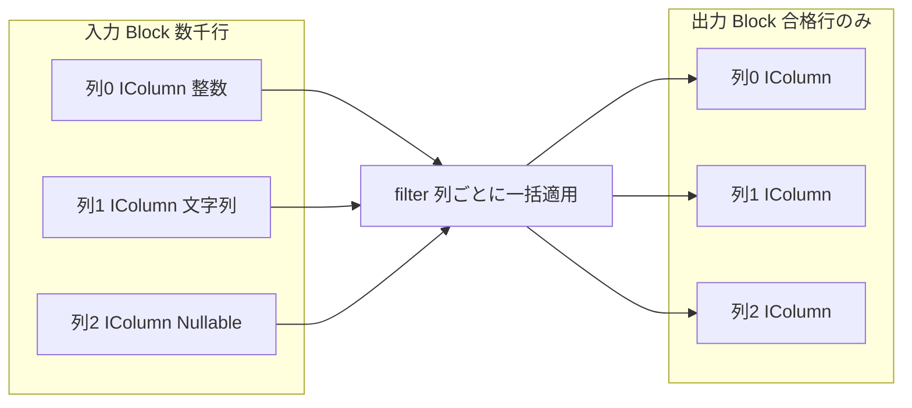

# 第14章 ベクトル化実行（Block、IColumn、DataType）

> **本章で読むソース**
>
> - [`dbms/src/Core/Block.h`](https://github.com/pingcap/tiflash/blob/v8.5.6/dbms/src/Core/Block.h)
> - [`dbms/src/Core/ColumnWithTypeAndName.h`](https://github.com/pingcap/tiflash/blob/v8.5.6/dbms/src/Core/ColumnWithTypeAndName.h)
> - [`dbms/src/Columns/IColumn.h`](https://github.com/pingcap/tiflash/blob/v8.5.6/dbms/src/Columns/IColumn.h)
> - [`dbms/src/Columns/ColumnVector.h`](https://github.com/pingcap/tiflash/blob/v8.5.6/dbms/src/Columns/ColumnVector.h)
> - [`dbms/src/Columns/ColumnVector.cpp`](https://github.com/pingcap/tiflash/blob/v8.5.6/dbms/src/Columns/ColumnVector.cpp)
> - [`dbms/src/Columns/ColumnString.h`](https://github.com/pingcap/tiflash/blob/v8.5.6/dbms/src/Columns/ColumnString.h)
> - [`dbms/src/Columns/ColumnNullable.h`](https://github.com/pingcap/tiflash/blob/v8.5.6/dbms/src/Columns/ColumnNullable.h)
> - [`dbms/src/DataTypes/IDataType.h`](https://github.com/pingcap/tiflash/blob/v8.5.6/dbms/src/DataTypes/IDataType.h)

## この章の狙い

ここから第3部に入り、TiFlash がクエリを実行する仕組みを読む。
TiFlash の実行エンジンは ClickHouse 由来のベクトル化実行を受け継いでおり、その土台が `Block`、`IColumn`、`IDataType` の3つの型である。
本章はこの3つの型を読み、データが1行ずつではなく列の束を単位に流れること、列の操作が要素単位ではなく列単位の一括処理として定義されることを確認する。
第4章では列指向がなぜ OLAP に速いかをメモリ配置の観点から扱ったが、本章はその表現の上で実行エンジンが値をどう処理するかへ進む。

## 前提

TiFlash の C++ 本体は `dbms/src` 以下にあり、列の束は `Core`、1列の値は `Columns`、列の型は `DataTypes` に置かれる。
本章のコード引用はすべて pingcap/tiflash のタグ `v8.5.6` に固定する。
列指向のメモリ配置と、必要な列だけを読む利点は [第4章](../part01-deltatree/04-why-columnar.md) で扱ったため、ここでは前提とする。
読者には C++ と列指向データベースの基礎を仮定する。

## 実行の単位は Block

ベクトル化実行の出発点は、処理の単位を1行ではなく一定行数ぶんの列の束に取ることである。
その束を表す型が `Block` であり、クラスの内部は列の配列と名前の索引だけを持つ。

[`dbms/src/Core/Block.h` L39-L46](https://github.com/pingcap/tiflash/blob/v8.5.6/dbms/src/Core/Block.h#L39-L46)

```cpp
class Block
{
private:
    using Container = ColumnsWithTypeAndName;
    using IndexByName = std::map<String, size_t>;

    Container data;
    IndexByName index_by_name;
```

`Block` の実体は `ColumnsWithTypeAndName`、すなわち列を要素とする配列である。
`Block` は行の配列ではなく列の配列を持つ。
名前から位置を引く `index_by_name` を併せ持つため、列は添字でも名前でも参照できる。
配列の各要素は、列のデータと型と名前を1つにまとめた `ColumnWithTypeAndName` という組である。

[`dbms/src/Core/ColumnWithTypeAndName.h` L33-L37](https://github.com/pingcap/tiflash/blob/v8.5.6/dbms/src/Core/ColumnWithTypeAndName.h#L33-L37)

```cpp
struct ColumnWithTypeAndName
{
    ColumnPtr column;
    DataTypePtr type;
    String name;
```

1つの組は、列の値を持つ `column`、列の型を司る `type`、列名 `name` の3つからなる。
`column` が `IColumn`、`type` が `IDataType` であり、`Block` はこの組を横に並べて1つの表の断片を表す。
`Block` から個々の列を取り出す入口は、位置と名前の2系統で用意される。

[`dbms/src/Core/Block.h` L81-L88](https://github.com/pingcap/tiflash/blob/v8.5.6/dbms/src/Core/Block.h#L81-L88)

```cpp
    ColumnWithTypeAndName & getByPosition(size_t position) { return data[position]; }
    const ColumnWithTypeAndName & getByPosition(size_t position) const { return data[position]; }

    ColumnWithTypeAndName & safeGetByPosition(size_t position);
    const ColumnWithTypeAndName & safeGetByPosition(size_t position) const;

    ColumnWithTypeAndName & getByName(const std::string & name);
    const ColumnWithTypeAndName & getByName(const std::string & name) const;
```

`getByPosition` は配列の添字で列を直に返し、`getByName` は名前から位置を引いて列を返す。
実行エンジンの演算子は、入力 `Block` から必要な列をこの入口で取り出し、列単位で処理して出力 `Block` を組み立てる。
`Block` が持つ行数と列数は、それぞれ `rows` と `columns` で取れる。

[`dbms/src/Core/Block.h` L106-L109](https://github.com/pingcap/tiflash/blob/v8.5.6/dbms/src/Core/Block.h#L106-L109)

```cpp
    /// Returns number of rows from first column in block, not equal to nullptr. If no columns, returns 0.
    size_t rows() const;

    size_t columns() const { return data.size(); }
```

`columns` は列配列の要素数をそのまま返す。
`rows` は最初の非 null 列の要素数を返すので、`Block` の行数は各列がそろって持つ値の個数になる。
1つの `Block` には数千行といった単位の行がまとまって入るため、後述する列単位のループは1回の呼び出しに多数の行を載せられる。

## 列を表す IColumn

`Block` の各列の値を持つのが `IColumn` である。
`IColumn` は1列分の値の並びをメモリ上に保持するインターフェースを宣言する。

[`dbms/src/Columns/IColumn.h` L40-L57](https://github.com/pingcap/tiflash/blob/v8.5.6/dbms/src/Columns/IColumn.h#L40-L57)

```cpp
/// Declares interface to store columns in memory.
class IColumn : public COWPtr<IColumn>
{
private:
    friend class COWPtr<IColumn>;

    /// Creates the same column with the same data.
    /// This is internal method to use from COWPtr.
    /// It performs shallow copy with copy-ctor and not useful from outside.
    /// If you want to copy column for modification, look at 'mutate' method.
    virtual MutablePtr clone() const = 0;

public:
    /// Name of a Column. It is used in info messages.
    virtual std::string getName() const { return getFamilyName(); }

    /// Name of a Column kind, without parameters (example: FixedString, Array).
    virtual const char * getFamilyName() const = 0;
```

`IColumn` は `COWPtr<IColumn>` を継承する。
`COWPtr` は copy-on-write のスマートポインタであり、列を複製せずに参照を共有し、書き換えが要るときにだけ実体を複製する。
演算子の間で `Block` を受け渡すとき、変更しない列はポインタの共有で済むため、列の中身を都度コピーする費用を避けられる。
この `IColumn` の派生として、整数列の `ColumnVector`、文字列列の `ColumnString`、NULL を持つ列の `ColumnNullable` などが実装される。

## 列の一括操作

`IColumn` の操作は、要素を1個ずつ扱うのではなく、列の範囲をまとめて処理する形で定義される。
他の列から値の範囲をまとめて取り込む `insertRangeFrom` が、その典型である。

[`dbms/src/Columns/IColumn.h` L137-L140](https://github.com/pingcap/tiflash/blob/v8.5.6/dbms/src/Columns/IColumn.h#L137-L140)

```cpp
    /// Appends range of elements from other column with the same type.
    /// Could be used to concatenate columns.
    /// Note: the source column and the destination column must be of the same type, can not ColumnXXX->insertRangeFrom(ConstColumnXXX, ...)
    virtual void insertRangeFrom(const IColumn & src, size_t start, size_t length) = 0;
```

`insertRangeFrom` は元の列の `start` から `length` 個の値を1回の呼び出しでまとめて追加する。
列どうしの連結や `Block` の積み上げは、行を1個ずつ移すのではなく、この範囲単位の取り込みで進む。
絞り込みと並べ替えも、列1本を丸ごと受け取って結果列を返す形で宣言される。

[`dbms/src/Columns/IColumn.h` L274-L286](https://github.com/pingcap/tiflash/blob/v8.5.6/dbms/src/Columns/IColumn.h#L274-L286)

```cpp
    /** Removes elements that don't match the filter.
      * Is used in WHERE and HAVING operations.
      * If result_size_hint > 0, then makes advance reserve(result_size_hint) for the result column;
      *  if 0, then don't makes reserve(),
      *  otherwise (i.e. < 0), makes reserve() using size of filtered column.
      */
    using Filter = PaddedPODArray<UInt8>;
    virtual Ptr filter(const Filter & filt, ssize_t result_size_hint) const = 0;

    /// Permutes elements using specified permutation. Is used in sortings.
    /// limit - if it isn't 0, puts only first limit elements in the result.
    using Permutation = PaddedPODArray<size_t>;
    virtual Ptr permute(const Permutation & perm, size_t limit) const = 0;
```

`filter` は `WHERE` や `HAVING` の絞り込みに使い、各行を残すかどうかを表す `UInt8` の選択ビット列 `filt` を受け取って、合格した行だけの新しい列を返す。
`permute` は並べ替えに使い、行の入れ替え順を表す `Permutation` を受け取って、その順に並べ替えた列を返す。
どちらも入力は列1本、出力も列1本であり、1行ごとの呼び出しは現れない。
`filter` を `Block` の全列に同じ選択ビット列で適用すれば、`WHERE` を満たす行だけを残した `Block` が、列単位の処理の連なりだけで得られる。



図の入力 `Block` は3つの列を束ねており、`filter` は同じ選択ビット列を各列へ列単位で適用する。
処理は `Block` を受けて `Block` を返す形で流れ、その間に値が行へばらされることはない。

## 具体的な列の実装

抽象 `IColumn` の下に、型ごとに最適化された具体クラスが並ぶ。
固定長の数値列 `ColumnVector` は、値を単純な配列に隙間なく詰めて持つ。

[`dbms/src/Columns/ColumnVector.h` L181-L183](https://github.com/pingcap/tiflash/blob/v8.5.6/dbms/src/Columns/ColumnVector.h#L181-L183)

```cpp
public:
    using value_type = T;
    using Container = PaddedPODArray<value_type>;
```

`ColumnVector<T>` の格納先は `PaddedPODArray<value_type>`、すなわち型 `T` の値を連続して並べた配列である。
同じ型の値が1つの連続領域に並ぶため、加算や比較のループは規則的なメモリアクセスになり、後述する SIMD が効く。
可変長の文字列列 `ColumnString` は、固定長配列に収まらない値を2つの配列で表す。

[`dbms/src/Columns/ColumnString.h` L44-L52](https://github.com/pingcap/tiflash/blob/v8.5.6/dbms/src/Columns/ColumnString.h#L44-L52)

```cpp
private:
    friend class COWPtrHelper<IColumn, ColumnString>;

    /// Maps i'th position to offset to i+1'th element. Last offset maps to the end of all chars (is the size of all chars).
    Offsets offsets;

    /// Bytes of strings, placed contiguously.
    /// For convenience, every string ends with terminating zero byte. Note that strings could contain zero bytes in the middle.
    Chars_t chars;
```

`ColumnString` は全文字列のバイトを `chars` に連結して持ち、各文字列の終端位置を `offsets` に持つ。
文字列の実体が1つのバッファに連続するため、可変長でも列の値はまとめて連続配置され、`n` 番目の文字列は `offsets` の差分で切り出せる。
NULL を持ちうる列は `ColumnNullable` が表し、値の列と NULL かどうかのビット列を分けて持つ。

[`dbms/src/Columns/ColumnNullable.h` L205-L207](https://github.com/pingcap/tiflash/blob/v8.5.6/dbms/src/Columns/ColumnNullable.h#L205-L207)

```cpp
private:
    ColumnPtr nested_column;
    ColumnPtr null_map;
```

`ColumnNullable` は実際の値を別の `IColumn`（`nested_column`）に委ね、各行が NULL かどうかを `null_map` という `UInt8` の列で並列に持つ。
値と NULL 標識を分けるため、`nested_column` 側はそのまま連続配置の利点を保ち、NULL の判定は別のビット列の一括走査で済む。
どの具体クラスも、値を列ごとにまとめて連続領域へ並べるという方針を共有する。

## 型と直列化を司る IDataType

`Block` の各列が持つもう1つの要素が、型を表す `IDataType` である。
`IDataType` は SQL の型を表し、値の直列化と復元の方法を司る。

[`dbms/src/DataTypes/IDataType.h` L40-L47](https://github.com/pingcap/tiflash/blob/v8.5.6/dbms/src/DataTypes/IDataType.h#L40-L47)

```cpp
/** Properties of data type.
  * Contains methods for serialization/deserialization.
  * Implementations of this interface represent a data type (example: UInt8)
  *  or parapetric family of data types (example: Array(...)).
  *
  * DataType is totally immutable object. You can always share them.
  */
class IDataType : private boost::noncopyable
```

`IDataType` はコメントどおり不変であり、同じ型のインスタンスはどこでも共有してよい。
型は値の入れ物である列を作る役割も持ち、その入口が `createColumn` である。

[`dbms/src/DataTypes/IDataType.h` L245-L247](https://github.com/pingcap/tiflash/blob/v8.5.6/dbms/src/DataTypes/IDataType.h#L245-L247)

```cpp
    /** Create empty column for corresponding type.
      */
    virtual MutableColumnPtr createColumn() const = 0;
```

`createColumn` は、その型に対応する空の `IColumn` を生成する。
`UInt64` 型なら `ColumnVector<UInt64>`、文字列型なら `ColumnString` というように、型が自分の列の具体クラスを選んで作る。
これにより `ColumnWithTypeAndName` の3要素は、型が列の作り方を決め、列が値を持つという関係で結びつく。
型のもう1つの役割が、列の値をディスクやネットワーク向けのバイト列へ変換する直列化である。

[`dbms/src/DataTypes/IDataType.h` L187-L191](https://github.com/pingcap/tiflash/blob/v8.5.6/dbms/src/DataTypes/IDataType.h#L187-L191)

```cpp
    /** Override these methods for data types that require just single stream (most of data types).
      */
    virtual void serializeBinaryBulk(const IColumn & column, WriteBuffer & ostr, size_t offset, size_t limit) const;
    virtual void deserializeBinaryBulk(IColumn & column, ReadBuffer & istr, size_t limit, double avg_value_size_hint)
        const;
```

`serializeBinaryBulk` は列を1個ずつではなく、`offset` から `limit` 個の範囲をまとめてバイト列へ書き出す。
復元する `deserializeBinaryBulk` も列へまとめて読み込むため、型が違っても直列化の単位は列の範囲にそろう。
直列化までもが列の一括処理として定義されることで、ストレージとの読み書きもベクトル化の枠の中に収まる。

## ベクトル化がなぜ速いか

ここまでの型から、ベクトル化実行が速い理由を機構レベルで2つ取り出せる。
1つは、1命令で複数の値を同時に処理する SIMD である。
`ColumnVector` の `filter` は、選択ビット列を16バイトずつまとめて調べる SSE2 の経路を持つ。

[`dbms/src/Columns/ColumnVector.cpp` L269-L303](https://github.com/pingcap/tiflash/blob/v8.5.6/dbms/src/Columns/ColumnVector.cpp#L269-L303)

```cpp
#if __SSE2__
    /** A slightly more optimized version.
        * Based on the assumption that often pieces of consecutive values
        *  completely pass or do not pass the filter.
        * Therefore, we will optimistically check the parts of `SIMD_BYTES` values.
        */

    static constexpr size_t SIMD_BYTES = 16;
    const __m128i zero16 = _mm_setzero_si128();
    const UInt8 * filt_end_sse = filt_pos + size / SIMD_BYTES * SIMD_BYTES;

    while (filt_pos < filt_end_sse)
    {
        int mask
            = _mm_movemask_epi8(_mm_cmpgt_epi8(_mm_loadu_si128(reinterpret_cast<const __m128i *>(filt_pos)), zero16));

        if (0 == mask)
        {
            /// Nothing is inserted.
        }
        else if (0xFFFF == mask)
        {
            res_data.insert(data_pos, data_pos + SIMD_BYTES);
        }
        else
        {
            for (size_t i = 0; i < SIMD_BYTES; ++i)
                if (filt_pos[i])
                    res_data.push_back(data_pos[i]);
        }

        filt_pos += SIMD_BYTES;
        data_pos += SIMD_BYTES;
    }
#endif
```

この経路は選択ビット列を16要素ずつ読み、その16要素がすべて不合格なら何も書かず、すべて合格ならまとめて16要素をコピーする。
合否が混在する塊だけを1要素ずつ調べるため、連続して合格または不合格になりやすい実データでは、分岐とコピーの大半が16要素単位に畳まれる。
値が固定長で連続するという列指向の配置が、このまとめ読みを成り立たせている。

もう1つは、行ごとの仮想関数呼び出しを列1回に償却することである。
`IColumn` の操作は仮想関数であり、行ごとに呼べば毎回の仮想ディスパッチが積み上がる。
TiFlash はこれを避けるため、列を散らす `scatter` の本体をテンプレートで実装し、具体型への変換を1回だけ行う。

[`dbms/src/Columns/IColumn.h` L499-L519](https://github.com/pingcap/tiflash/blob/v8.5.6/dbms/src/Columns/IColumn.h#L499-L519)

```cpp
    /// Template is to de-virtualize calls to insertFrom method.
    /// In derived classes (that use final keyword), implement scatter method as call to scatterImpl.
    template <typename Derived>
    std::vector<MutablePtr> scatterImpl(ColumnIndex num_columns, const Selector & selector) const
    {
        size_t num_rows = size();

        RUNTIME_CHECK_MSG(
            num_rows == selector.size(),
            "Size of selector: {} doesn't match size of column: {}",
            selector.size(),
            num_rows);

        ScatterColumns columns;
        initializeScatterColumns(columns, num_columns, num_rows);

        for (size_t i = 0; i < num_rows; ++i)
            static_cast<Derived &>(*columns[selector[i]]).insertFrom(*this, i);

        return columns;
    }
```

コメントの `de-virtualize calls to insertFrom` が示すとおり、`scatterImpl` は要素を入れる先を `Derived` 型へ `static_cast` してからループに入る。
ループ内の `insertFrom` は仮想呼び出しではなく具体型のメソッド呼び出しになり、コンパイラはインライン展開できる。
仮想ディスパッチの費用は `Block` の処理1回あたり数回に償却され、行数ぶんは積み上がらない。
列単位の一括操作が、行ごとの仮想関数呼び出しを `Block` 単位の密なループへ畳み込み、CPU を効率よく使う構図である。

## まとめ

TiFlash の実行エンジンは、ClickHouse 由来のベクトル化実行を3つの型で支える。
`Block` は一定行数ぶんの列の束であり、処理は1行ではなくこの束を単位に流れる。
`IColumn` は1列の値をまとめて持ち、`filter` や `permute` や `insertRangeFrom` を列単位の一括操作として定義する。
`IDataType` は列の型と直列化を司り、`createColumn` で自分の列を作り、`serializeBinaryBulk` で列の範囲をまとめて読み書きする。
速さの機構は、固定長で連続する列に SIMD を効かせることと、仮想関数呼び出しを `Block` 単位に償却することの2つに集約される。
次章からは、この `Block` を演算子の間でどう流すかを読む。

## 関連する章

- [なぜ列指向が OLAP に速いか](../part01-deltatree/04-why-columnar.md)：`Block` と `IColumn` のメモリ配置と、必要な列だけを読む利点を扱う。
- [パイプライン実行モデル（Operators）](15-pipeline-operators.md)：`Block` を演算子の間で流すパイプライン実行を読む。
- [式評価](17-expression-evaluation.md)：列単位の一括処理として式を評価する仕組みを読む。
- [ベクトル化実行モデル](../../tidb/part03-executor/12-vectorized-execution.md)：TiDB 計算層の `chunk` によるベクトル化と対比する。
