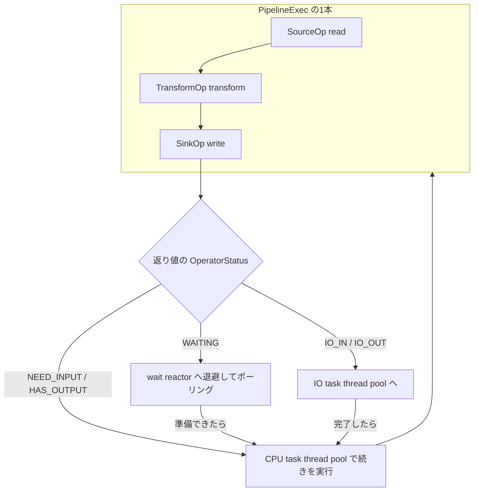

# 第15章 パイプライン実行モデル（Operators）

> **本章で読むソース**
>
> - [`dbms/src/Operators/Operator.h`](https://github.com/pingcap/tiflash/blob/v8.5.6/dbms/src/Operators/Operator.h)
> - [`dbms/src/Operators/UnorderedSourceOp.cpp`](https://github.com/pingcap/tiflash/blob/v8.5.6/dbms/src/Operators/UnorderedSourceOp.cpp)
> - [`dbms/src/Flash/Pipeline/Exec/PipelineExec.h`](https://github.com/pingcap/tiflash/blob/v8.5.6/dbms/src/Flash/Pipeline/Exec/PipelineExec.h)
> - [`dbms/src/Flash/Pipeline/Exec/PipelineExec.cpp`](https://github.com/pingcap/tiflash/blob/v8.5.6/dbms/src/Flash/Pipeline/Exec/PipelineExec.cpp)
> - [`dbms/src/Flash/Pipeline/Schedule/Tasks/Impls/PipelineTaskBase.h`](https://github.com/pingcap/tiflash/blob/v8.5.6/dbms/src/Flash/Pipeline/Schedule/Tasks/Impls/PipelineTaskBase.h)
> - [`dbms/src/Flash/Pipeline/Schedule/Tasks/Task.h`](https://github.com/pingcap/tiflash/blob/v8.5.6/dbms/src/Flash/Pipeline/Schedule/Tasks/Task.h)
> - [`dbms/src/Flash/Pipeline/Schedule/TaskScheduler.h`](https://github.com/pingcap/tiflash/blob/v8.5.6/dbms/src/Flash/Pipeline/Schedule/TaskScheduler.h)
> - [`dbms/src/Flash/Pipeline/Schedule/ThreadPool/TaskThreadPool.cpp`](https://github.com/pingcap/tiflash/blob/v8.5.6/dbms/src/Flash/Pipeline/Schedule/ThreadPool/TaskThreadPool.cpp)
> - [`dbms/src/Flash/Pipeline/Schedule/Reactor/WaitReactor.cpp`](https://github.com/pingcap/tiflash/blob/v8.5.6/dbms/src/Flash/Pipeline/Schedule/Reactor/WaitReactor.cpp)

## この章の狙い

第14章で、TiFlash がデータを `Block` という列の束で持ち、`IColumn` の上でベクトル化して計算することを読んだ。
本章は、その `Block` を演算子から演算子へ流して1つのクエリを実行する仕組みを読む。

TiFlash には2つの実行モデルが共存する。
古いほうは `BlockInputStream` のプル型で、最終段が `read()` を呼ぶと、その呼び出しが上流へ再帰的に伝わって `Block` を引き出す。
新しいほうが本章で読む**パイプライン実行モデル**であり、演算子を状態を持つ部品として並べ、上流が下流へ `Block` を押し込むプッシュ型で動く。
プッシュ型に変えた狙いは、I/O 待ちや上流待ちでスレッドを占有させず、限られたスレッドを計算に集中させることにある。

## 前提

演算子のあいだを流れるデータ単位が `Block` であり、列ごとに `IColumn` を持つことは[第14章](14-vectorized-block.md)で扱った。
集約や join のように上流を全部読み終えてから出力を始める演算子（パイプラインの区切り）が、このモデルでどう表されるかは[第16章](16-aggregation-and-join.md)で扱う。
ノードをまたいで `Block` を送受信する Exchange の演算子は[第20章](../part04-mpp/20-mpp-flow-and-tidb.md)で扱う。
本章は、1つのノードの中で演算子を並べて回す土台に絞る。

## プル型 BlockInputStream の限界

プル型では、1本のクエリは最終段から上流へ伸びる入力ストリームの木になる。
この木を1つのスレッドが受け持ち、`read()` の再帰呼び出しでデータを引き出す。
途中に I/O 待ち（記憶域からのセグメント読みや、ネットワーク越しの受信）が挟まると、その `read()` はデータが来るまで返らない。
待っているあいだ、スレッドはブロックしたまま動けない。

並列度を上げるにはストリームの本数だけスレッドを増やすしかない。
待ちが多いクエリほど、待つだけのスレッドを大量に抱えることになる。
スレッド数を増やせばコンテキストスイッチと記憶域の消費が膨らみ、減らせば待ちのあいだ CPU が遊ぶ。
プッシュ型のパイプラインは、この「待ちとスレッドの結びつき」を切るために導入された。

## 演算子の3系統 SourceOp、TransformOp、SinkOp

パイプラインを作る部品は `Operator` であり、役割によって3系統に分かれる。
読み出しの `SourceOp`、変換の `TransformOp`、出力の `SinkOp` である。

`SourceOp` はパイプラインの先頭に立ち、記憶域や受信キューから `Block` を取り出す。

[`dbms/src/Operators/Operator.h` L118-L130](https://github.com/pingcap/tiflash/blob/v8.5.6/dbms/src/Operators/Operator.h#L118-L130)

```cpp
// The running status returned by Source can only be `HAS_OUTPUT`.
class SourceOp : public Operator
{
public:
    SourceOp(PipelineExecutorContext & exec_context_, const String & req_id)
        : Operator(exec_context_, req_id)
    {}
    // read will inplace the block when return status is HAS_OUTPUT;
    // Even after source has finished, source op still needs to return an empty block and HAS_OUTPUT,
    // because there are many operators that need an empty block as input, such as JoinProbe and WindowFunction.
    OperatorStatus read(Block & block);
    virtual OperatorStatus readImpl(Block & block) = 0;
};
```

`read` が引数の `block` をその場で書き換え、返り値で自分の状態を伝える。
コメントが述べるとおり、`SourceOp` が返せる実行状態は `HAS_OUTPUT` だけである。
読み終えた後も空の `Block` と `HAS_OUTPUT` を返し続けるのは、空入力を必要とする下流の演算子があるからである。

`TransformOp` は中間段で、入力 `Block` を受けて計算し、出力 `Block` を下流へ渡す。
`transform` が入力を受け取って変換し、内部に出力をためる演算子は `tryOutput` で取り出しを試す。
`SinkOp` は最終段で、上流から来た `Block` を結果キューや Exchange の送信側へ書き出す。

[`dbms/src/Operators/Operator.h` L162-L174](https://github.com/pingcap/tiflash/blob/v8.5.6/dbms/src/Operators/Operator.h#L162-L174)

```cpp
// The running status returned by Sink can only be `NEED_INPUT`.
class SinkOp : public Operator
{
public:
    SinkOp(PipelineExecutorContext & exec_context_, const String & req_id)
        : Operator(exec_context_, req_id)
    {}
    OperatorStatus prepare();
    virtual OperatorStatus prepareImpl() { return OperatorStatus::NEED_INPUT; }

    OperatorStatus write(Block && block);
    virtual OperatorStatus writeImpl(Block && block) = 0;
};
```

`write` が `Block` を右辺値で受け取り、所有権ごと書き出す。
`SinkOp` が返せる実行状態は `NEED_INPUT` だけである。
つまりパイプラインの両端は対称で、先頭は出力できる状態しか取らず、末尾は入力を求める状態しか取らない。

## 演算子を駆動する OperatorStatus

3系統に共通するのは、どのメソッドも `OperatorStatus` を返して「次に自分をどう扱ってほしいか」を呼び手へ伝える点である。

[`dbms/src/Operators/Operator.h` L32-L49](https://github.com/pingcap/tiflash/blob/v8.5.6/dbms/src/Operators/Operator.h#L32-L49)

```cpp
enum class OperatorStatus
{
    /// finish status
    FINISHED,
    /// cancel status
    CANCELLED,
    /// waiting status
    WAITING,
    WAIT_FOR_NOTIFY,
    /// io status
    IO_IN,
    IO_OUT,
    /// running status
    // means that TransformOp/SinkOp needs to input a block to do the calculation,
    NEED_INPUT,
    // means that SourceOp/TransformOp outputs a block as input to the subsequent operators.
    HAS_OUTPUT,
};
```

`NEED_INPUT` と `HAS_OUTPUT` は、CPU 上ですぐ進められる実行中の状態である。
`NEED_INPUT` は「計算するための入力 `Block` が欲しい」を、`HAS_OUTPUT` は「下流へ渡せる `Block` が手元にある」を表す。
この2つが、上流から下流への押し込みを進める基本の合図になる。

残りは、CPU をいったん手放すべき状態である。
`IO_IN` と `IO_OUT` は記憶域やネットワークの読み書きで待つ状態を表す。
`WAITING` は何かの条件が整うのをポーリングで待つ状態、`WAIT_FOR_NOTIFY` は外部からの通知で起こされるまで待つ状態を表す。
`FINISHED` と `CANCELLED` は、それぞれ正常終了と取り消しを表す。
演算子が CPU 以外の理由で進めないときは、ブロックして待つのではなく、対応する状態を返して呼び手に委ねる。

## PipelineExec が Source から Sink までを1本で回す

並べた演算子の列を1つにまとめて回すのが `PipelineExec` である。
先頭の `SourceOp` から複数の `TransformOp` を経て末尾の `SinkOp` までを1本のパイプラインとして保持し、その実行を `execute` が1回分進める。

実行の本体 `executeImpl` は、まず下流側から入力を引き出し、得た `Block` を上流から下流へ押し流す。

[`dbms/src/Flash/Pipeline/Exec/PipelineExec.cpp` L128-L151](https://github.com/pingcap/tiflash/blob/v8.5.6/dbms/src/Flash/Pipeline/Exec/PipelineExec.cpp#L128-L151)

```cpp
OperatorStatus PipelineExec::executeImpl()
{
    assert(!awaitable);
    assert(!io_op);
    assert(!waiting_for_notify);

    Block block;
    size_t start_transform_op_index = 0;
    auto op_status = fetchBlock(block, start_transform_op_index);
    // If the status `fetchBlock` returns isn't `HAS_OUTPUT`, it means that `fetchBlock` did not return a block.
    if (op_status != OperatorStatus::HAS_OUTPUT)
        return op_status;

    // start from the next transform op after fetched block transform op.
    for (size_t transform_op_index = start_transform_op_index; transform_op_index < transform_ops.size();
         ++transform_op_index)
    {
        const auto & transform_op = transform_ops[transform_op_index];
        op_status = transform_op->transform(block);
        HANDLE_OP_STATUS(transform_op, op_status, OperatorStatus::HAS_OUTPUT);
    }
    op_status = sink_op->write(std::move(block));
    HANDLE_LAST_OP_STATUS(sink_op, op_status);
}
```

`fetchBlock` は `Block` を1つ調達する役で、末尾から先頭へ向かって試す。
まず `SinkOp::prepare` で末尾が入力を受け付けられるか確かめ、次に各 `TransformOp::tryOutput` で内部にためた出力が無いか後ろから順に試し、無ければ最後に `SourceOp::read` で先頭から読み出す。
途中の `tryOutput` が出力を出せた場合は、その演算子の1つ下流から計算を再開すればよいので、`start_transform_op_index` にその位置を記録する。

`Block` が手に入ると、`executeImpl` はそれを `start_transform_op_index` から末尾の手前まで `transform` で順に通し、最後に `SinkOp::write` で書き出す。
ここで使う `HANDLE_OP_STATUS` は、演算子が `HAS_OUTPUT` を返したときだけ次へ進み、それ以外の状態（`IO_IN` や `WAITING` など）を返したときはその演算子を控えて状態をそのまま返すマクロである。
たとえば途中の `transform` が `WAITING` を返せば、`PipelineExec` はその演算子を `awaitable` に控えて `WAITING` を呼び手へ返す。
このとき、すでに調達した `Block` の続きは演算子の内部にとどまり、次に進める状態へ移ってから処理が再開する。

この往復を図にすると、パイプラインは下流から入力を引き、上流から出力を押す2方向の流れになる。



## 待ちを状態で表す UnorderedSourceOp の読み出し

状態で駆動するという設計が具体的に何をするのかは、DeltaTree からセグメントを読む `UnorderedSourceOp` を見るとわかる。
この `SourceOp` は、別働の読み取りスレッドが用意した `Block` をキューから引き取る。

[`dbms/src/Operators/UnorderedSourceOp.cpp` L39-L67](https://github.com/pingcap/tiflash/blob/v8.5.6/dbms/src/Operators/UnorderedSourceOp.cpp#L39-L67)

```cpp
OperatorStatus UnorderedSourceOp::readImpl(Block & block)
{
    if unlikely (done)
        return OperatorStatus::HAS_OUTPUT;

    while (true)
    {
        if (!task_pool->tryPopBlock(block))
        {
            setNotifyFuture(task_pool.get());
            return OperatorStatus::WAIT_FOR_NOTIFY;
        }

        if (block)
        {
            if unlikely (block.rows() == 0)
            {
                block.clear();
                continue;
            }
            return OperatorStatus::HAS_OUTPUT;
        }
        else
        {
            done = true;
            return OperatorStatus::HAS_OUTPUT;
        }
    }
}
```

`tryPopBlock` はキューから `Block` を取り出そうとして、即座に成否を返す。
取り出せれば `HAS_OUTPUT` を返して下流へ渡す。
取り出せなければ、読み取りスレッドがまだ用意できていないということなので、ブロックして待つ代わりに `setNotifyFuture` で通知の口を登録し、`WAIT_FOR_NOTIFY` を返して即座に制御を手放す。
プル型なら `read()` の中でキューがブロックしていたところを、プッシュ型では「待ち」という状態の返却に置き換えている。
読み取りスレッドが新しい `Block` を積んだときにこの口へ通知が届き、演算子は実行可能な状態へ戻る。

## パイプラインをタスクに分けてスケジュールする

`PipelineExec` を実際にスレッドの上で回すのは、それを包む**タスク**である。
`PipelineTaskBase` が `PipelineExec` を保持し、その返す `OperatorStatus` をタスクの状態 `ExecTaskStatus` へ翻訳する。

[`dbms/src/Flash/Pipeline/Schedule/Tasks/Impls/PipelineTaskBase.h` L25-L30](https://github.com/pingcap/tiflash/blob/v8.5.6/dbms/src/Flash/Pipeline/Schedule/Tasks/Impls/PipelineTaskBase.h#L25-L30)

```cpp
/// Map the execution result of PipelineExec to Task
/// As follows
/// - OperatorStatus::FINISHED/CANCELLED       ==>     ExecTaskStatus::FINISHED/CANCELLED
/// - OperatorStatus::IO_IN/IO_OUT             ==>     ExecTaskStatus::IO_IN/IO_OUT
/// - OperatorStatus::WAITING                  ==>     ExecTaskStatus::WAITING
/// - OperatorStatus::NEED_INPUT/HAS_OUTPUT    ==>     ExecTaskStatus::RUNNING
```

`NEED_INPUT` も `HAS_OUTPUT` も、タスクから見ればどちらも「CPU 上で続きを実行できる」状態なので、まとめて `RUNNING` に写す。
I/O と待ちはそのまま対応する状態へ写す。
こうして演算子の細かい状態がタスクの状態へ畳まれ、スケジューラはタスクの状態だけを見て扱いを決められる。

タスクの状態は次の `ExecTaskStatus` で表される。

[`dbms/src/Flash/Pipeline/Schedule/Tasks/Task.h` L36-L46](https://github.com/pingcap/tiflash/blob/v8.5.6/dbms/src/Flash/Pipeline/Schedule/Tasks/Task.h#L36-L46)

```cpp
enum class ExecTaskStatus
{
    WAIT_FOR_NOTIFY,
    WAITING,
    RUNNING,
    IO_IN,
    IO_OUT,
    FINISHED,
    ERROR,
    CANCELLED,
};
```

タスクは `RUNNING` を中心に、`WAITING` や `IO_IN` などへ移り、また `RUNNING` へ戻る状態機械として動く。
この状態が、タスクをどの実行設備へ載せるかを決める。

設備は `TaskScheduler` が3つ持つ。

[`dbms/src/Flash/Pipeline/Schedule/TaskScheduler.h` L82-L90](https://github.com/pingcap/tiflash/blob/v8.5.6/dbms/src/Flash/Pipeline/Schedule/TaskScheduler.h#L82-L90)

```cpp
private:
    TaskThreadPool<CPUImpl> cpu_task_thread_pool;

    TaskThreadPool<IOImpl> io_task_thread_pool;

    WaitReactor wait_reactor;

    LoggerPtr logger = Logger::get();
};
```

CPU タスクのスレッドプールは演算子の計算を回す。
I/O タスクのスレッドプールは記憶域やネットワークのブロックする読み書きを担う。
そして `WaitReactor` は、待ち状態のタスクをポーリングして実行可能になったかを調べる専用の設備である。
クエリの実行は、まずパイプラインから複数のイベントを生成し、イベントが多数のタスクを生んでこの `TaskScheduler` へ投入する流れになる。

## CPU を遊ばせないスケジューリング

このモデルの最適化の核は、待ちのあるタスクを CPU タスクのスレッドプールから追い出し、CPU を計算で埋め続ける点にある。
CPU タスクのスレッドプールがタスクを1回実行した後、その返り値の状態によって行き先を振り分ける。

[`dbms/src/Flash/Pipeline/Schedule/ThreadPool/TaskThreadPool.cpp` L113-L127](https://github.com/pingcap/tiflash/blob/v8.5.6/dbms/src/Flash/Pipeline/Schedule/ThreadPool/TaskThreadPool.cpp#L113-L127)

```cpp
    switch (status_after_exec)
    {
    case ExecTaskStatus::RUNNING:
        task->endTraceMemory();
        scheduler.submitToCPUTaskThreadPool(std::move(task));
        break;
    case ExecTaskStatus::IO_IN:
    case ExecTaskStatus::IO_OUT:
        task->endTraceMemory();
        scheduler.submitToIOTaskThreadPool(std::move(task));
        break;
    case ExecTaskStatus::WAITING:
        task->endTraceMemory();
        scheduler.submitToWaitReactor(std::move(task));
        break;
```

`RUNNING` のままなら CPU タスクのスレッドプールへ戻して計算を続けさせる。
`IO_IN` や `IO_OUT` なら I/O タスクのスレッドプールへ移し、ブロックする読み書きを CPU スレッドの外で待たせる。
`WAITING` なら `WaitReactor` へ退避させる。
要点は、I/O や待ちに入ったタスクが CPU スレッドを1つも占有しないことである。
CPU スレッドは、計算を進められる `RUNNING` のタスクだけを次々と拾えるので、待ちがあっても遊ばない。

退避したタスクの面倒を見るのが `WaitReactor` である。
`WaitReactor` は1つのスレッドで待ち中のタスク群を巡回し、各タスクの `await` を呼んで進めるようになったかを確かめる。

[`dbms/src/Flash/Pipeline/Schedule/Reactor/WaitReactor.cpp` L37-L54](https://github.com/pingcap/tiflash/blob/v8.5.6/dbms/src/Flash/Pipeline/Schedule/Reactor/WaitReactor.cpp#L37-L54)

```cpp
bool WaitReactor::awaitAndCollectReadyTask(WaitingTask && task)
{
    assert(task.first);
    auto * task_ptr = task.second;
    auto status = task_ptr->await();
    switch (status)
    {
    case ExecTaskStatus::WAITING:
        return false;
    case ExecTaskStatus::RUNNING:
        task_ptr->profile_info.elapsedAwaitTime();
        cpu_tasks.push_back(std::move(task.first));
        return true;
    case ExecTaskStatus::IO_IN:
    case ExecTaskStatus::IO_OUT:
        task_ptr->profile_info.elapsedAwaitTime();
        io_tasks.push_back(std::move(task.first));
        return true;
```

`await` がまだ `WAITING` を返すなら、`false` を返してそのタスクを巡回対象に残す。
`RUNNING` に変われば `cpu_tasks` に積み、`IO_IN` や `IO_OUT` に変われば `io_tasks` に積む。
巡回が一周すると、積んだタスクをまとめて CPU や I/O のスレッドプールへ送り返す。
多数の待ちタスクを1スレッドのポーリングに集約することで、待ち1件ごとにスレッドを割く事態を避けている。

ポーリングは空回りするとそれ自体が CPU を浪費する。
`WaitReactor` は待ちタスクが無いあいだ短いスピンを挟み、一定回数を超えると2ミリ秒スリープして CPU を譲る。

もう1つ、CPU タスクのスレッドプールは1つのタスクを長く握りすぎないようにしている。

[`dbms/src/Flash/Pipeline/Schedule/ThreadPool/TaskThreadPool.cpp` L102-L109](https://github.com/pingcap/tiflash/blob/v8.5.6/dbms/src/Flash/Pipeline/Schedule/ThreadPool/TaskThreadPool.cpp#L102-L109)

```cpp
    while (true)
    {
        status_after_exec = Impl::exec(task);
        total_time_spent += task->profile_info.elapsedFromPrev();
        // The executing task should yield if it takes more than `YIELD_MAX_TIME_SPENT_NS`.
        if (!Impl::isTargetStatus(status_after_exec) || total_time_spent >= YIELD_MAX_TIME_SPENT_NS)
            break;
    }
```

`RUNNING` を返し続けるタスクは、この `while` の中で連続して実行される。
ただし累積実行時間が `YIELD_MAX_TIME_SPENT_NS` を超えると、たとえまだ `RUNNING` でもループを抜けてキューへ戻す。
1本の重いパイプラインが1スレッドを占有し続けるのを防ぎ、他のタスクへ順番を回す協調的なスケジューリングである。

## まとめ

パイプライン実行モデルは、演算子を `OperatorStatus` を返す状態機械にして、上流から下流へ `Block` を押し流すプッシュ型で動く。
`SourceOp`、`TransformOp`、`SinkOp` を `PipelineExec` が1本にまとめ、下流から入力を引き上流から出力を押す往復で1回分の実行を進める。
演算子が I/O や待ちに入るときはブロックせず、対応する状態を返して制御を手放す。
`PipelineExec` を包むタスクはこの状態を `ExecTaskStatus` へ畳み、`TaskScheduler` が状態に応じて CPU タスクのスレッドプール、I/O タスクのスレッドプール、`WaitReactor` へ振り分ける。
待ちと I/O を CPU スレッドの外へ退避させることで、CPU スレッドは計算可能なタスクだけを回し続け、限られたスレッドで高い並列度を出せる。

## 関連する章

- [第14章 ベクトル化実行（Block、IColumn、DataType）](14-vectorized-block.md)：演算子のあいだを流れる `Block` と、その上のベクトル化計算。
- [第16章 集約と join の列指向実装](16-aggregation-and-join.md)：上流を読み切ってから出力する区切りの演算子が、このモデルでどう表されるか。
- [第20章 MPP の実行フローと TiDB 連携](../part04-mpp/20-mpp-flow-and-tidb.md)：ノードをまたいで `Block` を送受信する Exchange の演算子とパイプラインの接続。
