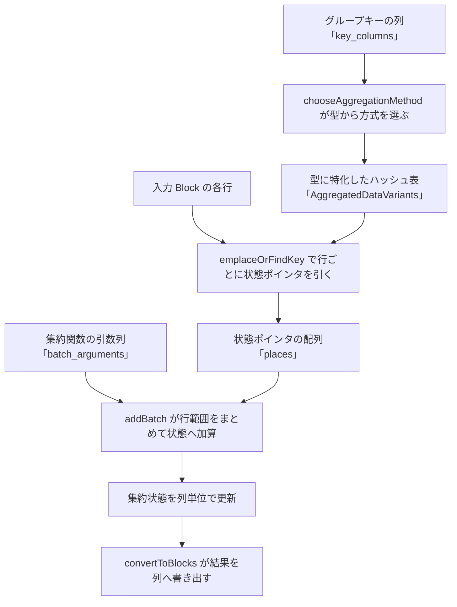

# 第16章 集約と join の列指向実装

> **本章で読むソース**
>
> - [`dbms/src/Interpreters/Aggregator.h`](https://github.com/pingcap/tiflash/blob/v8.5.6/dbms/src/Interpreters/Aggregator.h#L77-L84)
> - [`dbms/src/Interpreters/Aggregator.h`](https://github.com/pingcap/tiflash/blob/v8.5.6/dbms/src/Interpreters/Aggregator.h#L914-L924)
> - [`dbms/src/Interpreters/Aggregator.h`](https://github.com/pingcap/tiflash/blob/v8.5.6/dbms/src/Interpreters/Aggregator.h#L1343-L1344)
> - [`dbms/src/Interpreters/Aggregator.cpp`](https://github.com/pingcap/tiflash/blob/v8.5.6/dbms/src/Interpreters/Aggregator.cpp#L554-L565)
> - [`dbms/src/Interpreters/Aggregator.cpp`](https://github.com/pingcap/tiflash/blob/v8.5.6/dbms/src/Interpreters/Aggregator.cpp#L660-L669)
> - [`dbms/src/Interpreters/Aggregator.cpp`](https://github.com/pingcap/tiflash/blob/v8.5.6/dbms/src/Interpreters/Aggregator.cpp#L785-L793)
> - [`dbms/src/Interpreters/Aggregator.cpp`](https://github.com/pingcap/tiflash/blob/v8.5.6/dbms/src/Interpreters/Aggregator.cpp#L839-L852)
> - [`dbms/src/Interpreters/Join.h`](https://github.com/pingcap/tiflash/blob/v8.5.6/dbms/src/Interpreters/Join.h#L200-L205)
> - [`dbms/src/Interpreters/JoinHashMap.h`](https://github.com/pingcap/tiflash/blob/v8.5.6/dbms/src/Interpreters/JoinHashMap.h#L135-L146)
> - [`dbms/src/Interpreters/Join.cpp`](https://github.com/pingcap/tiflash/blob/v8.5.6/dbms/src/Interpreters/Join.cpp#L711-L724)
> - [`dbms/src/Interpreters/JoinPartition.cpp`](https://github.com/pingcap/tiflash/blob/v8.5.6/dbms/src/Interpreters/JoinPartition.cpp#L507-L521)
> - [`dbms/src/Interpreters/Join.cpp`](https://github.com/pingcap/tiflash/blob/v8.5.6/dbms/src/Interpreters/Join.cpp#L1243-L1250)
> - [`dbms/src/Interpreters/Join.cpp`](https://github.com/pingcap/tiflash/blob/v8.5.6/dbms/src/Interpreters/Join.cpp#L1265-L1277)
> - [`dbms/src/Operators/AggregateBuildSinkOp.cpp`](https://github.com/pingcap/tiflash/blob/v8.5.6/dbms/src/Operators/AggregateBuildSinkOp.cpp#L43-L44)
> - [`dbms/src/Operators/HashJoinBuildSink.cpp`](https://github.com/pingcap/tiflash/blob/v8.5.6/dbms/src/Operators/HashJoinBuildSink.cpp#L31-L35)

## この章の狙い

分析クエリの実行時間の多くは、グループごとの集計とテーブル間の結合に費やされる。
TiFlash はこの2つを、`GROUP BY` のための**ハッシュ集約**と、等値結合のための**ハッシュ join** で実装する。
どちらも入力が列の束である `Block` であり、内部にハッシュ表を1つ持ち、入力を1行ずつたどってハッシュ表を引く。
本章は、この行ごとのハッシュ表アクセスを、列指向の入力に対してどう安く回すかを読む。

ハッシュ集約は `Aggregator`、ハッシュ join は `Join` がそれぞれ受け持つ。
両者に共通するのは、グループキーや結合キーの型に特化したハッシュ表をあらかじめ選び、行ごとの分岐を減らす設計である。
本章は集約から先に読み、キーの型でハッシュ表を切り替える仕組みと、引いた集約状態を行範囲ごとにまとめて更新する仕組みを確かめる。
そのうえで join のビルドとプローブを読み、最後に2つの演算をパイプラインへつなぐ Operator を読む。

## 前提

入力と出力の単位である `Block` と、列を表す `IColumn`、列の型を表す `DataType` は [第14章](14-vectorized-block.md) で扱う。
集約と join はパイプラインの演算子として実行され、その実行モデルと Operator の枠組みは [第15章](15-pipeline-operators.md) で読む。
本章のコード引用はすべて pingcap/tiflash のタグ `v8.5.6` に固定し、読者には C++ と列指向データベースの基礎を仮定する。
TiFlash は ClickHouse から派生しており、本章の `Aggregator` と `Join` もその系譜の実装を TiDB エコシステム向けに拡張したものである。

## ハッシュ集約の入口は Block 単位で回る

`Aggregator` の集約は、入力 `Block` を1枚受け取る `executeOnBlock` を入口とする。

[`dbms/src/Interpreters/Aggregator.h`](https://github.com/pingcap/tiflash/blob/v8.5.6/dbms/src/Interpreters/Aggregator.h#L1343-L1344)

```cpp
    /// Process one block. Return false if the processing should be aborted.
    bool executeOnBlock(AggProcessInfo & agg_process_info, AggregatedDataVariants & result, size_t thread_num);
```

第1引数の `agg_process_info` は処理中の `Block` と、その中で次に処理すべき行の範囲を持つ作業状態である。
第2引数の `result` が集約結果を溜めるハッシュ表であり、グループキーから集約状態へのマップを保持する。
`executeOnBlock` は `Block` の各行についてグループキーを計算し、`result` のハッシュ表を引いて対応する集約状態を取り出し、その行の値を状態へ加える。
つまり集約は `Block` 単位で呼ばれ、1回の呼び出しの中で `Block` の行を順にハッシュ表へ畳み込む。

## グループキーの型に特化したハッシュ表

集約結果を溜める `result` の実体は `AggregatedDataVariants` である。
この型は、グループキーの型ごとに異なるハッシュ表を持ち分ける。

[`dbms/src/Interpreters/Aggregator.h`](https://github.com/pingcap/tiflash/blob/v8.5.6/dbms/src/Interpreters/Aggregator.h#L77-L84)

```cpp
using AggregatedDataWithUInt8Key = FixedImplicitZeroHashMapWithCalculatedSize<UInt8, AggregateDataPtr>;
using AggregatedDataWithUInt16Key = FixedImplicitZeroHashMap<UInt16, AggregateDataPtr>;

using AggregatedDataWithUInt32Key = HashMap<UInt32, AggregateDataPtr, HashCRC32<UInt32>>;
using AggregatedDataWithUInt64Key = HashMap<UInt64, AggregateDataPtr, HashCRC32<UInt64>>;

using AggregatedDataWithShortStringKey = StringHashMap<AggregateDataPtr>;
using AggregatedDataWithStringKey = HashMapWithSavedHash<StringRef, AggregateDataPtr>;
```

いずれもキーから `AggregateDataPtr`、すなわち集約状態の置かれたメモリへのポインタへ引くハッシュ表である。
8ビットキーは256個の配列で済む `FixedImplicitZeroHashMap` を使い、ハッシュ計算すら省く。
32ビットと64ビットの整数キーは `HashCRC32` でハッシュした `HashMap` を使い、文字列キーは保存済みハッシュ付きの専用ハッシュ表を使う。
キーの型に合わせて表の構造とハッシュ関数を変えることで、整数1個のキーを文字列のように扱う無駄を避ける。

どの表を使うかは列挙型 `Type` で表され、`AggregatedDataVariants` はそのうち1つだけを実体化する。

[`dbms/src/Interpreters/Aggregator.h`](https://github.com/pingcap/tiflash/blob/v8.5.6/dbms/src/Interpreters/Aggregator.h#L914-L924)

```cpp
    enum class Type
    {
        EMPTY = 0,
        without_key,

#define M(NAME, IS_TWO_LEVEL) NAME,
        APPLY_FOR_AGGREGATED_VARIANTS(M)
#undef M
    };

    Type type{Type::EMPTY};
```

`without_key` は `GROUP BY` を持たない全体集約のための特別な状態で、ハッシュ表を持たず1つの状態に畳む。
それ以外の各 `Type` が、上で見たキー別ハッシュ表のいずれかに対応する。

どの `Type` を選ぶかは `chooseAggregationMethod` がグループキーの型から決める。

[`dbms/src/Interpreters/Aggregator.cpp`](https://github.com/pingcap/tiflash/blob/v8.5.6/dbms/src/Interpreters/Aggregator.cpp#L554-L565)

```cpp
    /// Single numeric key.
    if (params.keys_size == 1 && types_not_null[0]->isValueRepresentedByNumber())
    {
        size_t size_of_field = types_not_null[0]->getSizeOfValueInMemory();
        if (size_of_field == 1)
            return AggregatedDataVariants::Type::key8;
        if (size_of_field == 2)
            return AggregatedDataVariants::Type::key16;
        if (size_of_field == 4)
            return AggregatedDataVariants::Type::key32;
        if (size_of_field == 8)
            return AggregatedDataVariants::Type::key64;
```

グループキーが数値1列なら、その値が何バイトかだけで `key8` から `key64` までを選ぶ。
複数列のキーや文字列キーには別の分岐があり、固定長キーをまとめて128ビットや256ビットに詰める方式や、可変長を直列化する方式へ進む。
キーの形が決まればハッシュ表の型もコンパイル時に確定するため、後段の集約ループは型ごとに特化したコードとして展開される。

## 行で状態を引き、列で状態を更新する

選んだハッシュ表に対して実際に集約を回すのが `executeImpl` である。
この関数はまずキー列から `State` を組み立て、`executeImplBatch` へ渡す。

[`dbms/src/Interpreters/Aggregator.cpp`](https://github.com/pingcap/tiflash/blob/v8.5.6/dbms/src/Interpreters/Aggregator.cpp#L660-L669)

```cpp
void NO_INLINE Aggregator::executeImpl(
    Method & method,
    Arena * aggregates_pool,
    AggProcessInfo & agg_process_info,
    TiDB::TiDBCollators & collators) const
{
    typename Method::State state(agg_process_info.key_columns, key_sizes, collators);

    executeImplBatch<collect_hit_rate, only_lookup>(method, state, aggregates_pool, agg_process_info);
}
```

`state` はキー列を束ねた補助構造で、行番号を渡すとその行のグループキーをハッシュ表用のキーに変換する。
`Method` はキーの型に特化したハッシュ表の方式であり、`key_columns` から各行のキーを取り出す処理が型に応じて選ばれる。

`executeImplBatch` の中核は2段に分かれる。
前段は `Block` の行を1つずつたどり、行ごとに集約状態のポインタを引いて配列へ控える。

[`dbms/src/Interpreters/Aggregator.cpp`](https://github.com/pingcap/tiflash/blob/v8.5.6/dbms/src/Interpreters/Aggregator.cpp#L785-L793)

```cpp
    std::unique_ptr<AggregateDataPtr[]> places(new AggregateDataPtr[agg_size]);
    std::optional<size_t> processed_rows;

    for (size_t i = agg_process_info.start_row; i < agg_process_info.start_row + agg_size; ++i)
    {
        AggregateDataPtr aggregate_data = nullptr;

        auto emplace_result_holder
            = emplaceOrFindKey<only_lookup>(method, state, i, *aggregates_pool, sort_key_containers);
```

`emplaceOrFindKey` は行 `i` のグループキーでハッシュ表を引き、既存のグループならその状態、新規のグループなら新たに確保した状態を返す。
返ってきた状態のポインタは `places` 配列の対応位置に入る。
この前段が終わると、`Block` の各行がどのグループの状態へ向かうかを `places` が行の並び順のまま記録した状態になる。

後段は、集約関数ごとに `places` を渡し、行範囲をまとめて状態へ加える。

[`dbms/src/Interpreters/Aggregator.cpp`](https://github.com/pingcap/tiflash/blob/v8.5.6/dbms/src/Interpreters/Aggregator.cpp#L839-L852)

```cpp
    if (processed_rows)
    {
        /// Add values to the aggregate functions.
        for (AggregateFunctionInstruction * inst = agg_process_info.aggregate_functions_instructions.data(); inst->that;
             ++inst)
        {
            inst->batch_that->addBatch(
                agg_process_info.start_row,
                *processed_rows - agg_process_info.start_row + 1,
                places.get(),
                inst->state_offset,
                inst->batch_arguments,
                aggregates_pool);
        }
```

`addBatch` は集約関数1つにつき1回呼ばれ、行範囲と `places`、そしてその関数の引数列 `batch_arguments` を受け取る。
たとえば `sum(x)` なら、`x` の列と各行の状態ポインタを渡し、関数内のループで列の値を対応する状態へ足し込む。
集約関数の種類による分岐は `addBatch` の呼び出し1回に集約され、行ごとに関数の種類を判定し直す必要がない。

ここに集約の最適化の機構がある。
キーの型に特化したハッシュ表を選んでおくことで、キーの取り出しとハッシュは型ごとに展開された分岐のないコードになる。
そのうえで状態の引き当てと状態の更新を2段に分け、更新を `addBatch` で列の塊として回すため、集約関数の仮想呼び出しが行数ぶんではなく集約関数の個数ぶんに減る。
列の値を連続してたどりながら、行ごとに引いておいた状態へ加算するこの作りが、列指向の入力に対して集約を安く回す。

## ハッシュ集約のデータフロー

ここまでの流れを図にすると次のようになる。



グループキーから方式を選び、型に特化したハッシュ表で行ごとに状態を引き、引いた状態を集約関数ごとにまとめて更新する。
集約が終われば、ハッシュ表のキーと状態を結果の `Block` の列へ書き出して次の演算子へ渡す。

## ハッシュ join のビルドは列からハッシュ表を作る

join に移る。
`Join` の公開入口は、ビルド側の `insertFromBlock` とプローブ側の `joinBlock` である。

[`dbms/src/Interpreters/Join.h`](https://github.com/pingcap/tiflash/blob/v8.5.6/dbms/src/Interpreters/Join.h#L200-L205)

```cpp
    void insertFromBlock(const Block & block, size_t stream_index);

    /** Join data from the map (that was previously built by calls to insertFromBlock) to the block with data from "left" table.
      * Could be called from different threads in parallel.
      */
    Block joinBlock(ProbeProcessInfo & probe_process_info, bool dry_run = false) const;
```

`insertFromBlock` は結合の右側、すなわちビルド側の `Block` を受け取り、結合キーからハッシュ表を作る。
`joinBlock` は左側、すなわちプローブ側の `Block` を受け取り、そのハッシュ表を引いて一致した右側の行を結合する。
集約と同じく、join のハッシュ表も結合キーの型に特化した方式を選ぶ。

[`dbms/src/Interpreters/JoinHashMap.h`](https://github.com/pingcap/tiflash/blob/v8.5.6/dbms/src/Interpreters/JoinHashMap.h#L135-L146)

```cpp
#define APPLY_FOR_JOIN_VARIANTS(M) \
    M(key8)                        \
    M(key16)                       \
    M(key32)                       \
    M(key64)                       \
    M(key_string)                  \
    M(key_strbinpadding)           \
    M(key_strbin)                  \
    M(key_fixed_string)            \
    M(keys128)                     \
    M(keys256)                     \
    M(serialized)
```

`JoinMapMethod` はこの一覧から選ばれ、整数キーや文字列キー、複数列をまとめた固定長キーごとに異なるハッシュ表を持つ。
集約の `AggregatedDataVariants` と同じ発想で、結合キーの形が決まればハッシュ表の型も確定し、キーの取り出しが型に特化したコードになる。

ビルド側でハッシュ表を埋める実体は、`insertFromBlockInternal` から呼ばれる `JoinPartition::insertBlockIntoMaps` である。

[`dbms/src/Interpreters/Join.cpp`](https://github.com/pingcap/tiflash/blob/v8.5.6/dbms/src/Interpreters/Join.cpp#L711-L724)

```cpp
        /// Fill the hash table.
        JoinPartition::insertBlockIntoMaps(
            partitions,
            rows,
            key_columns,
            key_sizes,
            collators,
            stored_block,
            null_map,
            stream_index,
            getBuildConcurrency(),
            enable_fine_grained_shuffle,
            enable_join_spill,
            probe_cache_column_threshold);
```

`key_columns` はビルド側 `Block` から抜き出した結合キーの列であり、`stored_block` は値を引くために保持しておく `Block` そのものである。
ハッシュ表に入れるのはキーから行への参照であり、右側の列の値を表へコピーするのではなく、保持した `Block` の行番号を指す。
列指向の `Block` を1つ持ったまま、その行をハッシュ表から参照する形にすることで、結合のために列をほどいて行へ並べ直す必要がない。

同じ結合キーを持つ右側の行が複数あれば、それらは連結リストとしてつながる。

[`dbms/src/Interpreters/JoinPartition.cpp`](https://github.com/pingcap/tiflash/blob/v8.5.6/dbms/src/Interpreters/JoinPartition.cpp#L507-L521)

```cpp
        auto emplace_result = key_getter.emplaceKey(map, i, pool.arena, sort_key_container);

        if (emplace_result.isInserted())
            new (&emplace_result.getMapped()) typename Map::mapped_type(stored_block, i, 0);
        else
        {
            /** The first element of the list is stored in the value of the hash table, the rest in the pool.
                 * We will insert each time the element into the second place.
                 * That is, the former second element, if it was, will be the third, and so on.
                 */
            auto elem
                = reinterpret_cast<MappedType *>(pool.arena.alignedAlloc(sizeof(MappedType), alignof(MappedType)));
            new (elem) typename Map::mapped_type(stored_block, i);
            insertRowToList(pool, &emplace_result.getMapped(), elem, cache_column_threshold);
        }
```

`emplaceKey` が結合キーでハッシュ表の枠を引き、新規キーならその枠に最初の行参照を置く。
同じキーが再び来たら、枠の参照を先頭とする連結リストの2番目にコメントどおり差し込む。
こうして1つの結合キーに複数の右側行がぶら下がり、プローブ時にはその連結リストをたどって一致行をすべて取り出せる。

## プローブは列を引いて結果を列へ書く

プローブ側の `joinBlock` は、内部で `doJoinBlockHash` を呼ぶ。
ここで右側の出力列を、まず空の列として用意する。

[`dbms/src/Interpreters/Join.cpp`](https://github.com/pingcap/tiflash/blob/v8.5.6/dbms/src/Interpreters/Join.cpp#L1243-L1250)

```cpp
        added_columns.push_back(src_column.column->cloneEmpty());
        if (src_column.type && src_column.type->haveMaximumSizeOfValue())
        {
            // todo figure out more accurate `rows`
            added_columns.back()->reserve(rows);
        }
        right_indexes.push_back(index);
    }
```

`added_columns` がプローブ結果に付け足す右側の列で、出力する列ごとに空の列を1つ用意し、固定長の型なら行数ぶんの容量を先に確保する。
`right_indexes` は、その列が右側 `Block` の何番目の列に対応するかを覚えておくための添字である。
結果を行の構造体として組み立てるのではなく、最初から列の器を並べておき、後の照合でそこへ値を末尾追記していく。

照合の本体は `JoinPartition::probeBlock` が担う。

[`dbms/src/Interpreters/Join.cpp`](https://github.com/pingcap/tiflash/blob/v8.5.6/dbms/src/Interpreters/Join.cpp#L1265-L1277)

```cpp
    JoinPartition::probeBlock(
        partitions,
        rows,
        probe_process_info.hash_join_data->key_columns,
        key_sizes,
        added_columns,
        probe_process_info.null_map,
        current_offset,
        offsets_to_replicate,
        right_indexes,
        collators,
        join_build_info,
        probe_process_info);
```

`probeBlock` はプローブ側の `key_columns` を1行ずつたどり、結合キーでビルド側のハッシュ表を引く。
一致した右側の行の連結リストをたどり、`right_indexes` の指す列の値を `added_columns` の対応する列へ追記する。
左側1行に右側が複数一致すれば左側の行を複製する必要があり、その複製回数は `offsets_to_replicate` に記録され、左側の列はあとでこの回数に従ってまとめて複製される。
プローブもまた、列を引いて列へ書く形になっており、結合結果は左側の列の複製と右側の列の追記を合わせた `Block` として出る。

## パイプラインと並列度への接続

`Aggregator` と `Join` は、[第15章](15-pipeline-operators.md) で読むパイプラインの演算子の内側で駆動される。
集約のビルド側は `AggregateBuildSinkOp` であり、受け取った `Block` を集約コンテキストへ渡す。

[`dbms/src/Operators/AggregateBuildSinkOp.cpp`](https://github.com/pingcap/tiflash/blob/v8.5.6/dbms/src/Operators/AggregateBuildSinkOp.cpp#L43-L44)

```cpp
    agg_context->buildOnBlock(index, block);
    return agg_context->needSpill(index) ? OperatorStatus::IO_OUT : OperatorStatus::NEED_INPUT;
```

`buildOnBlock` は内部で `Aggregator::executeOnBlock` を呼び、`Block` を1枚ずつハッシュ表へ畳む。
join のビルド側は `HashJoinBuildSink` であり、同じく `Block` を1枚ずつハッシュ表へ流す。

[`dbms/src/Operators/HashJoinBuildSink.cpp`](https://github.com/pingcap/tiflash/blob/v8.5.6/dbms/src/Operators/HashJoinBuildSink.cpp#L31-L35)

```cpp
        return OperatorStatus::FINISHED;
    }
    join_ptr->insertFromBlock(block, op_index);
    block.clear();
    return join_ptr->hasBuildSideMarkedSpillData(op_index) ? OperatorStatus::IO_OUT : OperatorStatus::NEED_INPUT;
```

どちらの演算子も、入力 `Block` を受け取るたびに `executeOnBlock` や `insertFromBlock` を呼び、ハッシュ表を少しずつ育てる。
ビルドが終わってからプローブや結果の取り出しへ進むため、ビルドとプローブはパイプライン上の別の段になる。

集約と join はどちらも並列度を持つ。
`Aggregator` はスレッドごとに別のハッシュ表へ集約し、`Join` は結合キーで分けた `partitions` の各区画を別スレッドが受け持つ。
`insertFromBlock` と `joinBlock` に渡る `stream_index` がこの区画を指し、同じ結合キーが同じ区画へ集まるように `Block` を振り分ける。
1ノードの中での区画分けに加え、MPP では複数ノードにまたがってキーで再分配する。
キーを基準に行を集める仕組みは [第18章](../part04-mpp/18-what-is-mpp.md) のシャッフルへつながり、同じ結合キーや同じグループキーを同じノードへ寄せてから、ノード内でここまで読んだハッシュ表を組む。

## まとめ

ハッシュ集約は `Aggregator` が受け持ち、`AggregatedDataVariants` がグループキーの型ごとにハッシュ表を持ち分ける。
`chooseAggregationMethod` がキーの型から方式を選び、`executeImplBatch` は行ごとに集約状態のポインタを `places` へ引いてから、集約関数ごとに `addBatch` で行範囲をまとめて状態へ加える。
キーの型に特化したハッシュ表と、状態の更新を列の塊で回す2段構えが、集約関数の分岐を行数から関数の個数へ減らし、列指向の入力に集約を安く重ねる。

ハッシュ join は `Join` が受け持ち、ビルド側の `insertFromBlock` が結合キーからハッシュ表を作り、値として保持した `Block` の行への参照を置く。
同じキーの右側行は連結リストでつながり、プローブ側の `joinBlock` はキーでハッシュ表を引いて一致行をたどり、右側の列を `added_columns` へ追記して結果の `Block` を組む。
集約も join も、列を引いて列へ書く形を保ち、キーの型特化と区画分けで並列に回り、MPP のシャッフルと組んで分散の集計と結合を支える。

## 関連する章

- [ベクトル化実行（Block、IColumn、DataType）](14-vectorized-block.md)：集約と join の入出力である `Block` と列の表現を読む。
- [パイプライン実行モデル（Operators）](15-pipeline-operators.md)：`Aggregator` と `Join` を駆動する演算子の枠組みを読む。
- [式評価](17-expression-evaluation.md)：集約関数の引数やフィルタを評価する仕組みを読む。
- [MPP とは](../part04-mpp/18-what-is-mpp.md)：キーで行を再分配して分散の集約と結合を回すシャッフルを読む。
- [結合、集約、ソートの実行](../../tidb/part03-executor/14-join-agg-sort.md)：TiDB 編で行指向のハッシュ集約とハッシュ join の実装と対比する。
