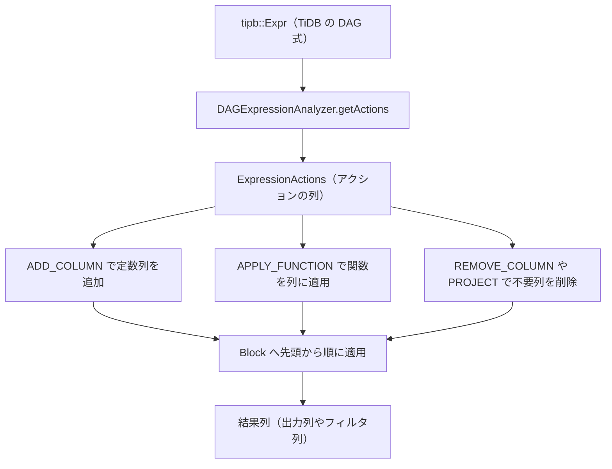

# 第17章 式評価

> **本章で読むソース**
>
> - [`dbms/src/Interpreters/ExpressionActions.h`](https://github.com/pingcap/tiflash/blob/v8.5.6/dbms/src/Interpreters/ExpressionActions.h#L56-L75)
> - [`dbms/src/Interpreters/ExpressionActions.cpp`](https://github.com/pingcap/tiflash/blob/v8.5.6/dbms/src/Interpreters/ExpressionActions.cpp#L349-L365)
> - [`dbms/src/Interpreters/ExpressionActions.cpp`](https://github.com/pingcap/tiflash/blob/v8.5.6/dbms/src/Interpreters/ExpressionActions.cpp#L546-L550)
> - [`dbms/src/Functions/IFunction.h`](https://github.com/pingcap/tiflash/blob/v8.5.6/dbms/src/Functions/IFunction.h#L258-L265)
> - [`dbms/src/Functions/IFunction.h`](https://github.com/pingcap/tiflash/blob/v8.5.6/dbms/src/Functions/IFunction.h#L69-L74)
> - [`dbms/src/Functions/FunctionsComparison.h`](https://github.com/pingcap/tiflash/blob/v8.5.6/dbms/src/Functions/FunctionsComparison.h#L76-L97)
> - [`dbms/src/Flash/Coprocessor/DAGExpressionAnalyzerHelper.cpp`](https://github.com/pingcap/tiflash/blob/v8.5.6/dbms/src/Flash/Coprocessor/DAGExpressionAnalyzerHelper.cpp#L511-L524)
> - [`dbms/src/Flash/Coprocessor/DAGUtils.cpp`](https://github.com/pingcap/tiflash/blob/v8.5.6/dbms/src/Flash/Coprocessor/DAGUtils.cpp#L799-L819)
> - [`dbms/src/Flash/Coprocessor/DAGExpressionAnalyzer.cpp`](https://github.com/pingcap/tiflash/blob/v8.5.6/dbms/src/Flash/Coprocessor/DAGExpressionAnalyzer.cpp#L923-L937)
> - [`dbms/src/Flash/Coprocessor/DAGExpressionAnalyzer.cpp`](https://github.com/pingcap/tiflash/blob/v8.5.6/dbms/src/Flash/Coprocessor/DAGExpressionAnalyzer.cpp#L994-L1004)

## この章の狙い

`SELECT a + 1 FROM t WHERE b > 10` のような SQL には、出力する式（`a + 1`）と絞り込みの条件（`b > 10`）が含まれる。
TiFlash はこうした式を、行を1件ずつ走査して評価するのではなく、列をまとめて処理する一連の操作へ変換してから Block に適用する。
本章は、その変換を担う `ExpressionActions` と、列単位で計算する関数 `IFunction`、そして TiDB から届いた DAG 式を TiFlash の関数へ対応づける `DAGExpressionAnalyzer` を読み、式が列指向のまま評価される筋道を確定させる。

## 前提

TiFlash のクエリ実行は **Block**（複数の列をまとめた処理単位）を流す形を取り、各列は `IColumn` の派生として連続したメモリに値を並べる。
Block と列の基礎は [第14章](14-vectorized-block.md) で扱ったため、本章では前提とする。
個々の式評価は、[第15章](15-pipeline-operators.md) で扱うパイプラインの各オペレータが Block を受け取った内側で起きる。
本章のコード引用はすべて pingcap/tiflash のタグ `v8.5.6` に固定し、読者には C++ と列指向データベースの基礎を仮定する。

## 式を「列への操作の列」に展開する

TiFlash は式を木のまま再帰評価せず、**ExpressionActions**（Block に対する操作を順番に並べたもの）へ展開する。
その1ステップが **ExpressionAction** であり、列の追加、関数の適用、列の削除といった種別を持つ。

[`dbms/src/Interpreters/ExpressionActions.h` L56-L75](https://github.com/pingcap/tiflash/blob/v8.5.6/dbms/src/Interpreters/ExpressionActions.h#L56-L75)

```cpp
struct ExpressionAction
{
public:
    enum Type
    {
        ADD_COLUMN,
        REMOVE_COLUMN,
        COPY_COLUMN,

        APPLY_FUNCTION,

        JOIN,

        /// Reorder and rename the columns, delete the extra ones. The same column names are allowed in the result.
        PROJECT,

        EXPAND,

        CONVERT_TO_NULLABLE,
    };
```

`a + 1 > 10` のような式は、いくつかのアクションへ平らに展開される。
定数 `1` と `10` は `ADD_COLUMN` で定数列として Block に置かれ、`a + 1` は `plus` の `APPLY_FUNCTION`、その結果と `10` の比較は `greater` の `APPLY_FUNCTION` になる。
中間結果はすべて Block 内の名前付き列として残り、後段が不要にする列は `REMOVE_COLUMN` か `PROJECT` で落とす。
木構造をたどる再帰評価ではなく、列への操作を一列に並べる形に直すのがこの展開の要点である。

## アクションを Block に順に適用する

展開された `ExpressionActions` の実行は、アクションを先頭から順に Block へ適用するだけの単純なループである。

[`dbms/src/Interpreters/ExpressionActions.cpp` L546-L550](https://github.com/pingcap/tiflash/blob/v8.5.6/dbms/src/Interpreters/ExpressionActions.cpp#L546-L550)

```cpp
void ExpressionActions::execute(Block & block) const
{
    for (const auto & action : actions)
        action.execute(block);
}
```

各アクションのうち、式の計算の中心は `APPLY_FUNCTION` である。

[`dbms/src/Interpreters/ExpressionActions.cpp` L349-L365](https://github.com/pingcap/tiflash/blob/v8.5.6/dbms/src/Interpreters/ExpressionActions.cpp#L349-L365)

```cpp
    case APPLY_FUNCTION:
    {
        ColumnNumbers arguments(argument_names.size());
        for (size_t i = 0; i < argument_names.size(); ++i)
        {
            if (!block.has(argument_names[i]))
                throw Exception("Not found column: '" + argument_names[i] + "'", ErrorCodes::NOT_FOUND_COLUMN_IN_BLOCK);
            arguments[i] = block.getPositionByName(argument_names[i]);
        }

        size_t num_columns_without_result = block.columns();
        block.insert({nullptr, result_type, result_name});

        function->execute(block, arguments, num_columns_without_result);

        break;
    }
```

このアクションは、引数の列名を Block 内の列位置へ解決し、結果を入れる空の列を Block の末尾に追加してから、関数を呼ぶ。
関数には Block と、引数の列位置の並び、結果列の位置だけが渡る。
関数は引数の列を読み、結果列の中身を書き込む。
入出力がいずれも Block 内の列であり、1回の呼び出しが列1本ぶんの値をまとめて埋める点がベクトル評価の骨格になる。

次の図は、TiDB から届いた式が `ExpressionActions` へ展開され、Block に列単位で適用されるまでの流れを示す。



## 関数は列をまとめて受け取り、列を返す

`APPLY_FUNCTION` が呼ぶ関数の実体は `IFunction` 系のクラスである。
個々の関数は `executeImpl` を実装し、ここで列単位の計算を行う。

[`dbms/src/Functions/IFunction.h` L258-L265](https://github.com/pingcap/tiflash/blob/v8.5.6/dbms/src/Functions/IFunction.h#L258-L265)

```cpp
class IFunction
{
public:
    virtual ~IFunction() = default;

    virtual String getName() const = 0;

    virtual void executeImpl(Block & block, const ColumnNumbers & arguments, size_t result) const = 0;
```

`executeImpl` の引数は、Block と、引数列の位置 `arguments`、結果列の位置 `result` である。
関数は `arguments` が指す列から `IColumn` を取り出し、内部の配列を走査して計算し、`result` の列へ書き戻す。
個々の値ではなく列1本を単位に受け渡すため、関数呼び出しと型分岐は列ごとに1回で済み、行ごとには発生しない。

列単位の計算がどのような形になるかは、比較演算の内側を見ると分かる。
2つの数値列を比較する `NumComparisonImpl` は、両方の列の配列を先頭から末尾まで走査し、結果の `UInt8` 列へ真偽を書き込む。

[`dbms/src/Functions/FunctionsComparison.h` L76-L97](https://github.com/pingcap/tiflash/blob/v8.5.6/dbms/src/Functions/FunctionsComparison.h#L76-L97)

```cpp
    static void NO_INLINE
    vectorVector(const PaddedPODArray<A> & a, const PaddedPODArray<B> & b, PaddedPODArray<UInt8> & c)
    {
        /** GCC 4.8.2 vectorizes a loop only if it is written in this form.
          * In this case, if you loop through the array index (the code will look simpler),
          *  the loop will not be vectorized.
          */

        size_t size = a.size();
        const A * __restrict a_pos = &a[0];
        const B * __restrict b_pos = &b[0];
        UInt8 * __restrict c_pos = &c[0];
        const A * a_end = a_pos + size;

        while (a_pos < a_end)
        {
            *c_pos = Op::apply(*a_pos, *b_pos);
            ++a_pos;
            ++b_pos;
            ++c_pos;
        }
    }
```

このループは、入力2列のポインタを `__restrict` で別領域だと宣言し、添字ではなくポインタの前進で書く。
コメントが述べるとおり、この形にしておくとコンパイラが内側ループを SIMD 命令へまとめやすい。
列の境界検査や型の判定はループの外で1回だけ済ませ、ループ内は単純な算術と書き込みだけを繰り返す。

## 定数畳み込みと短絡

定数は、式の評価のたびに計算し直さずに済むよう、あらかじめ定数列として畳み込まれる。
リテラルは展開のときに `ADD_COLUMN` で1要素の定数列として Block に置かれ、以降は他の列と同じく列として扱われる。
すべての引数が定数の関数呼び出しは、既定の実装で1行ぶんの列に対して評価してから定数列へ広げ直せる。

[`dbms/src/Functions/IFunction.h` L69-L74](https://github.com/pingcap/tiflash/blob/v8.5.6/dbms/src/Functions/IFunction.h#L69-L74)

```cpp
    /** If the function have non-zero number of arguments,
      *  and if all arguments are constant, that we could automatically provide default implementation:
      *  arguments are converted to ordinary columns with single value, then function is executed as usual,
      *  and then the result is converted to constant column.
      */
    virtual bool useDefaultImplementationForConstants() const { return false; }
```

短絡については、列単位の評価という枠組みが制約になる。
条件分岐を含む式でも、各枝の引数列は関数を呼ぶ前にすべて評価されてから渡る。
そのため、ある行で結果が確定したからといって、その行の残りの枝の評価を飛ばす行ごとの短絡は既定では行わない。

## TiDB の式を TiFlash の関数へ対応づける

ここまでの `ExpressionActions` は、TiDB から届く DAG 式を変換して組み立てる。
その変換を担うのが `DAGExpressionAnalyzer` であり、`tipb::Expr` を再帰的にたどってアクションを足していく。
スカラ関数の式は、各子を先に列へ評価し、その列名を引数として関数を適用する。

[`dbms/src/Flash/Coprocessor/DAGExpressionAnalyzerHelper.cpp` L511-L524](https://github.com/pingcap/tiflash/blob/v8.5.6/dbms/src/Flash/Coprocessor/DAGExpressionAnalyzerHelper.cpp#L511-L524)

```cpp
String DAGExpressionAnalyzerHelper::buildDefaultFunction(
    DAGExpressionAnalyzer * analyzer,
    const tipb::Expr & expr,
    const ExpressionActionsPtr & actions)
{
    const String & func_name = getFunctionName(expr);
    Names argument_names;
    for (const auto & child : expr.children())
    {
        String name = analyzer->getActions(child, actions);
        argument_names.push_back(name);
    }
    return analyzer->applyFunction(func_name, argument_names, actions, getCollatorFromExpr(expr));
}
```

ここで `getFunctionName` が、TiDB のスカラ関数シグネチャを TiFlash 側の関数名へ翻訳する。

[`dbms/src/Flash/Coprocessor/DAGUtils.cpp` L799-L819](https://github.com/pingcap/tiflash/blob/v8.5.6/dbms/src/Flash/Coprocessor/DAGUtils.cpp#L799-L819)

```cpp
const String & getFunctionName(const tipb::Expr & expr)
{
    if (isAggFunctionExpr(expr))
    {
        return getAggFunctionName(expr);
    }
    else if (isWindowFunctionExpr(expr))
    {
        return getWindowFunctionName(expr);
    }
    else
    {
        auto it = scalar_func_map.find(expr.sig());
        if (it == scalar_func_map.end())
            throw TiFlashException(
                Errors::Coprocessor::Unimplemented,
                "{} is not supported.",
                tipb::ScalarFuncSig_Name(expr.sig()));
        return it->second;
    }
}
```

`scalar_func_map` は `tipb::ScalarFuncSig` から関数名への対応表である。
たとえば整数のキャストを表すシグネチャは `tidb_cast` に対応づき、比較や算術のシグネチャはそれぞれ対応する TiFlash の関数名へ写る。
対応表に無いシグネチャは未実装として例外になり、その式は TiFlash では評価されずに TiKV 側へ残る。

翻訳された関数名から実際のアクションを作るのが `applyFunction` である。

[`dbms/src/Flash/Coprocessor/DAGExpressionAnalyzer.cpp` L923-L937](https://github.com/pingcap/tiflash/blob/v8.5.6/dbms/src/Flash/Coprocessor/DAGExpressionAnalyzer.cpp#L923-L937)

```cpp
String DAGExpressionAnalyzer::applyFunction(
    const String & func_name,
    const Names & arg_names,
    const ExpressionActionsPtr & actions,
    const TiDB::TiDBCollatorPtr & collator)
{
    String result_name = genFuncString(func_name, arg_names, {collator});
    if (actions->getSampleBlock().has(result_name))
        return result_name;
    const FunctionBuilderPtr & function_builder = FunctionFactory::instance().get(func_name, context);
    const ExpressionAction & action
        = ExpressionAction::applyFunction(function_builder, arg_names, result_name, collator);
    actions->add(action);
    return result_name;
}
```

`applyFunction` は、関数名と引数列名から結果列の名前を決め、`FunctionFactory` から該当の関数を取り出して `APPLY_FUNCTION` アクションを追加する。
結果列の名前は関数名と引数から組み立てるため、同じ式が二度現れたときは既存の列を使い回し、重複した計算を避ける。
戻り値は結果列の名前であり、これが次の式の引数列名として連鎖していく。

## WHERE 条件を1つのフィルタ列に畳む

WHERE 句の評価も、同じ仕組みの上に乗る。
`appendWhere` は、条件式から1本の **フィルタ列**（行ごとに残すか落とすかを表す `UInt8` の列）を作り、その列名を後段が要求する出力として登録する。

[`dbms/src/Flash/Coprocessor/DAGExpressionAnalyzer.cpp` L994-L1004](https://github.com/pingcap/tiflash/blob/v8.5.6/dbms/src/Flash/Coprocessor/DAGExpressionAnalyzer.cpp#L994-L1004)

```cpp
String DAGExpressionAnalyzer::appendWhere(
    ExpressionActionsChain & chain,
    const google::protobuf::RepeatedPtrField<tipb::Expr> & conditions)
{
    auto & last_step = initAndGetLastStep(chain);

    String filter_column_name = buildFilterColumn(last_step.actions, conditions);

    last_step.required_output.push_back(filter_column_name);
    return filter_column_name;
}
```

条件が複数あるときは、それぞれを列へ評価したうえで `and` 関数で1本に畳み込む。
こうして得たフィルタ列を、フィルタのオペレータが Block にあてて行を絞り込む。
条件もまた1本の `UInt8` 列として評価される点で、出力式の評価と同じ枠組みに収まる。
フィルタをテーブルスキャンへ押し下げ、必要な列だけを後から実体化する流れは [第21章](../part05-ops/21-pushdown-and-late-materialization.md) で扱う。

## 列単位評価が行ごとの評価より速い理由

式評価の高速化は、式を列への操作の列へ展開し、各関数が列を1本ずつ受け取って処理する設計から来る。
行を1件ずつ木構造でたどる評価では、各行で関数の呼び出しと型分岐が起き、その間接呼び出しの回数は行数に比例する。
`ExpressionActions` はこの分岐を列ごとに1回へまとめ、`IFunction::executeImpl` の内側では `vectorVector` のような単純なループだけを回す。
ループ内は型が確定した連続メモリ上の繰り返しになり、コンパイラの自動ベクトル化で1命令が複数要素をまとめて処理しやすい。
定数を定数列へ畳み込み、同じ式の結果列を使い回す工夫も、列という単位を保ったまま無駄な計算を減らすために効く。

## まとめ

TiFlash は式を木のまま再帰評価せず、`ExpressionActions` という列への操作の列へ展開する。
`ExpressionActions::execute` はアクションを Block へ順に適用し、`APPLY_FUNCTION` は引数列を解決して結果列を追加し、`IFunction::executeImpl` が列をまとめて計算する。
TiDB の DAG 式は `DAGExpressionAnalyzer` が `tipb::Expr` をたどって変換し、`getFunctionName` がスカラ関数シグネチャを TiFlash の関数名へ対応づけ、`applyFunction` がアクションを組み立てる。
WHERE 条件も1本のフィルタ列として同じ仕組みで評価され、列単位の処理が行ごとの間接呼び出しを避けて評価を速くする。

## 関連する章

- [第14章 ベクトル化実行（Block、IColumn、DataType）](14-vectorized-block.md)：式評価が読み書きする Block と `IColumn` の構造を扱う。
- [第15章 パイプライン実行モデル（Operators）](15-pipeline-operators.md)：式評価が起きるオペレータと Block の流れを扱う。
- [第21章 フィルタ押し下げと late materialization](../part05-ops/21-pushdown-and-late-materialization.md)：フィルタ列をスキャンへ押し下げ、必要な列を後から実体化する仕組みを扱う。
- [第10章 コプロセッサ押し下げ](../../tidb/part02-optimizer/10-coprocessor-pushdown.md)：TiDB が式を DAG として TiFlash や TiKV へ押し下げる側を扱う。
