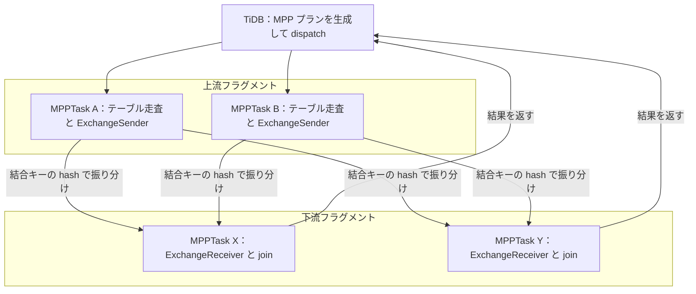

# 第18章 MPP とは

> **本章で読むソース**
>
> - [`dbms/src/Flash/Coprocessor/DAGContext.h`](https://github.com/pingcap/tiflash/blob/v8.5.6/dbms/src/Flash/Coprocessor/DAGContext.h)
> - [`dbms/src/Flash/Mpp/MPPTask.h`](https://github.com/pingcap/tiflash/blob/v8.5.6/dbms/src/Flash/Mpp/MPPTask.h)
> - [`dbms/src/Flash/Mpp/ExchangeReceiver.h`](https://github.com/pingcap/tiflash/blob/v8.5.6/dbms/src/Flash/Mpp/ExchangeReceiver.h)

## この章の狙い

第3部までで読んだ集約と join は、1つの TiFlash ノードの中で完結する実行だった。
しかし分析クエリの中には、1ノードのメモリと CPU では捌けない規模のものがある。
特に、複数の大きなテーブルをまたぐ結合は、あるノードが持つ行と別のノードが持つ行を突き合わせる必要がある。
この突き合わせを複数ノードで分担する方式が **MPP**（Massively Parallel Processing）である。
MPP は、複数の TiFlash ノードでデータを再分配（シャッフル）し、ノードをまたぐ分散結合や分散集約を並列に実行する。

本章は第4部の導入として、MPP の考え方と、コプロセッサとの違い、そして実行を担う `MPPTask` と Exchange の輪郭を確定する。
個々の仕組みの詳細は[第19章](19-mpptask-and-exchange.md)と[第20章](20-mpp-flow-and-tidb.md)に譲る。

## 前提

ノード内のハッシュ集約とハッシュ join の実装は[第16章](../part03-engine/16-aggregation-and-join.md)で読んだ。
TiDB のオプティマイザがエンジンを選び、TiFlash 向けに MPP プランを組み立てる仕組みは TiDB 編で扱う（[TiDB 編 第11章](../../tidb/part02-optimizer/11-engine-selection-and-mpp.md)）。
単一の Region を対象に計算を押し下げる TiKV のコプロセッサは TiKV 編で読んだ（[TiKV 編 第18章](../../tikv/part04-coprocessor/18-coprocessor.md)）。
本章のコード引用はすべて pingcap/tiflash のタグ `v8.5.6` に固定し、読者には C++ と分散データベースの基礎を仮定する。

## コプロセッサとの違いは再分配の有無

MPP の位置づけは、TiKV のコプロセッサと並べると見えやすい。
TiFlash が受け取る実行要求の種別は、`DAGContext` の `DAGRequestKind` で表される。

[`dbms/src/Flash/Coprocessor/DAGContext.h` L142-L148](https://github.com/pingcap/tiflash/blob/v8.5.6/dbms/src/Flash/Coprocessor/DAGContext.h#L142-L148)

```cpp
enum class DAGRequestKind
{
    Cop,
    CopStream,
    BatchCop,
    MPP,
};
```

`Cop`、`CopStream`、`BatchCop` はいずれもコプロセッサ方式の要求であり、`MPP` だけが別の種別として並ぶ。
コプロセッサ方式に共通するのは、各ノードが自分の持つデータを局所的に処理し、部分結果をそのまま上位へ返す点である。
ノードをまたいでデータを移し替える段がないため、2つの大きなテーブルの結合のように、突き合わせるべき行が別々のノードに散らばる処理は、この方式だけでは分散実行できない。
`MPP` の種別は、ここにノード間の再分配（シャッフル）を1段加える。

`DAGContext` は要求がどの種別かを判定する述語を持ち、MPP かどうかと、そのタスクが結果を TiDB へ返す根のタスクかどうかを区別する。

[`dbms/src/Flash/Coprocessor/DAGContext.h` L255-L260](https://github.com/pingcap/tiflash/blob/v8.5.6/dbms/src/Flash/Coprocessor/DAGContext.h#L255-L260)

```cpp
    bool isCop() const { return kind == DAGRequestKind::Cop; }
    bool isCopStream() const { return kind == DAGRequestKind::CopStream; }
    bool isBatchCop() const { return kind == DAGRequestKind::BatchCop; }
    bool isMPPTask() const { return kind == DAGRequestKind::MPP; }
    /// root mpp task means mpp task that send data back to TiDB
    bool isRootMPPTask() const { return is_root_mpp_task; }
```

`isMPPTask` は要求が MPP 方式かを返し、`isRootMPPTask` はそのタスクが結果を TiDB へ送り返す根のフラグメントかを返す。
根でないタスクは、結果を上位の別のタスクへ渡す。
つまり1つの MPP クエリは複数のフラグメントに分かれ、フラグメントどうしが再分配でつながって、最後に根のフラグメントが TiDB へ結果を返す。

## MPPTask は1ノード上の1フラグメントを担う

TiDB が組み立てた MPP プランは複数のフラグメントに分割され、各フラグメントは各 TiFlash ノードの上で1つの `MPPTask` として走る。

[`dbms/src/Flash/Mpp/MPPTask.h` L68-L71](https://github.com/pingcap/tiflash/blob/v8.5.6/dbms/src/Flash/Mpp/MPPTask.h#L68-L71)

```cpp
class MPPTask
    : public std::enable_shared_from_this<MPPTask>
    , private boost::noncopyable
{
```

1つの `MPPTask` が、TiDB から配られた1つのフラグメントの実行を1ノード上で受け持つ。
TiDB から届く要求を受け取る入口と、実行を回す入口は、それぞれ `prepare` と `run` である。

[`dbms/src/Flash/Mpp/MPPTask.h` L99-L101](https://github.com/pingcap/tiflash/blob/v8.5.6/dbms/src/Flash/Mpp/MPPTask.h#L99-L101)

```cpp
    void prepare(const mpp::DispatchTaskRequest & task_request);

    void run();
```

`prepare` は TiDB が送る `mpp::DispatchTaskRequest` を受け取り、このノードが担うフラグメントの実行木と、他ノードとの接続を準備する。
`run` がその実行を回す。
同じクエリに属する `MPPTask` が複数のノードに同時に存在し、互いに中間結果を渡し合って1つのクエリを分散実行する。

## Exchange でフラグメント間のデータを再分配する

フラグメントどうしをつなぐのが **Exchange** である。
`prepare` の準備の一部として、`MPPTask` は上流から送られてくるデータを受け取る口を初期化する。

[`dbms/src/Flash/Mpp/MPPTask.h` L145-L145](https://github.com/pingcap/tiflash/blob/v8.5.6/dbms/src/Flash/Mpp/MPPTask.h#L145-L145)

```cpp
    void initExchangeReceivers();
```

受け取り側の実体が `ExchangeReceiver` である。

[`dbms/src/Flash/Mpp/ExchangeReceiver.h` L97-L102](https://github.com/pingcap/tiflash/blob/v8.5.6/dbms/src/Flash/Mpp/ExchangeReceiver.h#L97-L102)

```cpp
template <typename RPCContext>
class ExchangeReceiverBase
{
public:
    static constexpr bool is_streaming_reader = true;
    static constexpr auto name = "ExchangeReceiver";
```

クラス名のとおり、`ExchangeReceiver` は上流のフラグメントから流れてくるデータを受け取るストリーミングの読み手である。
いくつの上流から受け取るか、そして細粒度シャッフルのストリーム数はいくつかは、構築時に渡される。

[`dbms/src/Flash/Mpp/ExchangeReceiver.h` L105-L112](https://github.com/pingcap/tiflash/blob/v8.5.6/dbms/src/Flash/Mpp/ExchangeReceiver.h#L105-L112)

```cpp
    ExchangeReceiverBase(
        std::shared_ptr<RPCContext> rpc_context_,
        size_t source_num_,
        size_t max_streams_,
        const String & req_id,
        const String & executor_id,
        uint64_t fine_grained_shuffle_stream_count,
        const Settings & settings);
```

`source_num_` は、このノードへデータを送ってくる上流の送り手の数である。
上流の各ノードに置かれた送り手（`ExchangeSender`、詳細は[第19章](19-mpptask-and-exchange.md)）が、自分の持つ行を宛先ノードごとに振り分けて送り、各 `ExchangeReceiver` がそれらを束ねて受け取る。
`fine_grained_shuffle_stream_count` は、1つの受け取り口の中をさらに複数のストリームへ細かく分けて並列度を上げるための値である。

受け取った1件ずつをフラグメントの実行木へ渡すのが `receive` である。

[`dbms/src/Flash/Mpp/ExchangeReceiver.h` L119-L120](https://github.com/pingcap/tiflash/blob/v8.5.6/dbms/src/Flash/Mpp/ExchangeReceiver.h#L119-L120)

```cpp
    ReceiveStatus receive(size_t stream_id, ReceivedMessagePtr & recv_msg);
    ReceiveStatus tryReceive(size_t stream_id, ReceivedMessagePtr & recv_msg);
```

`receive` は指定したストリームから次のメッセージを取り出し、`tryReceive` はブロックせずに取れる範囲で取り出す。
取り出したデータは復号されて `Block` になり、[第16章](../part03-engine/16-aggregation-and-join.md)で読んだハッシュ表へ流れていく。
こうして、上流のどのノードから来た行も、宛先で同じ結合キーごとに集まったうえで、ノード内のハッシュ join やハッシュ集約に入る。

## 機構の工夫：結合キーのハッシュシャッフルで巨大 join をノード横断に分散する

分散結合を成り立たせるのは、Exchange がデータをどの宛先へ振り分けるかである。
結合キーのハッシュ値で宛先ノードを決めると、同じ結合キーを持つ行は、左右どちらのテーブルから来たものでも、必ず同じノードの同じ `ExchangeReceiver` へ集まる。
集まったあとは、ノード内で[第16章](../part03-engine/16-aggregation-and-join.md)のハッシュ join を組めばよい。
突き合わせるべき行が同じノードに揃っているため、各ノードは結合キー空間の一部分だけを受け持ち、互いに独立して並列に結合を進められる。

次の図は、2つの上流フラグメントが結合キーのハッシュ値で行を振り分け、下流の各ノードでノード横断の分散 join を組む構図を示す。



この振り分けが効く理由は、単一ノードの上限を分割して回避できる点にある。
1ノードに全データを集めてから結合すると、そのノードのメモリと CPU が処理規模の上限になる。
結合キーでハッシュシャッフルすると、各ノードが担うのはキー空間の一部分に対応する行だけになり、ノード内に組むハッシュ表もその分だけ小さくなる。
ノードを増やせば1ノードあたりの担当が減るため、単一ノードのメモリと CPU では捌けない規模の結合を、ノードを横断して並列にこなせる。

振り分け方はハッシュだけではない。
片方のテーブルが十分小さければ、ハッシュで分けずに全ノードへ同じものを配るブロードキャストの方が安く、Exchange はこの2つの振り分けを使い分ける（[第19章](19-mpptask-and-exchange.md)）。

## まとめ

MPP は、複数の TiFlash ノードでデータを再分配しながら、ノードをまたぐ結合と集約を並列実行する方式である。
単一の Region を局所処理して部分結果を返すコプロセッサと違い、MPP は Exchange によるノード間の再分配を1段持つ。
TiDB が組み立てた MPP プランは複数のフラグメントに分かれ、各フラグメントは各ノードの上で1つの `MPPTask` として走り、`prepare` で接続を整えて `run` で実行する。
フラグメント間は Exchange でつながり、`ExchangeReceiver` が上流の各ノードから送られた行を受け取る。
結合キーのハッシュ値で宛先を決めることで、同じキーの行を同じノードへ集め、単一ノードのメモリと CPU の上限を超える規模の結合をノード横断で並列化する。

## 関連する章

- [第3章 TiDB、TiKV との関係（MPP と learner replica）](../part00-overview/03-relationship-with-tidb-tikv.md)：MPP プランを受け止める読み取り軸の境界面。
- [第19章 MPPTask と Exchange](19-mpptask-and-exchange.md)：`MPPTask` の実行と Exchange の送り手側、振り分け方の詳細。
- [第20章 MPP の実行フローと TiDB 連携](20-mpp-flow-and-tidb.md)：MPP クエリ全体の実行フローと TiDB との連携。
- [第16章 集約と join の列指向実装](../part03-engine/16-aggregation-and-join.md)：再分配で同じノードへ集めた行を処理するノード内のハッシュ join と集約。
- [TiDB 編 第11章 エンジン選択と MPP プラン](../../tidb/part02-optimizer/11-engine-selection-and-mpp.md)：オプティマイザが TiFlash を選び MPP プランを組み立てる仕組み。
- [TiKV 編 第18章 コプロセッサ](../../tikv/part04-coprocessor/18-coprocessor.md)：単一 Region に計算を押し下げるコプロセッサとの対比。
