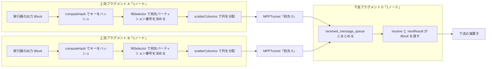

# 第19章 MPPTask と Exchange

> **本章で読むソース**
>
> - [`dbms/src/Flash/Mpp/MPPTask.h`](https://github.com/pingcap/tiflash/blob/v8.5.6/dbms/src/Flash/Mpp/MPPTask.h#L99-L101)
> - [`dbms/src/Flash/Mpp/MPPTask.cpp`](https://github.com/pingcap/tiflash/blob/v8.5.6/dbms/src/Flash/Mpp/MPPTask.cpp#L459-L465)
> - [`dbms/src/Flash/Mpp/MPPTaskManager.h`](https://github.com/pingcap/tiflash/blob/v8.5.6/dbms/src/Flash/Mpp/MPPTaskManager.h#L60-L69)
> - [`dbms/src/Flash/Mpp/MPPTunnel.h`](https://github.com/pingcap/tiflash/blob/v8.5.6/dbms/src/Flash/Mpp/MPPTunnel.h#L88-L93)
> - [`dbms/src/Flash/Mpp/MPPTunnel.cpp`](https://github.com/pingcap/tiflash/blob/v8.5.6/dbms/src/Flash/Mpp/MPPTunnel.cpp#L166-L175)
> - [`dbms/src/Flash/Mpp/MPPTunnelSet.h`](https://github.com/pingcap/tiflash/blob/v8.5.6/dbms/src/Flash/Mpp/MPPTunnelSet.h#L52-L56)
> - [`dbms/src/Flash/Mpp/HashBaseWriterHelper.cpp`](https://github.com/pingcap/tiflash/blob/v8.5.6/dbms/src/Flash/Mpp/HashBaseWriterHelper.cpp#L52-L59)
> - [`dbms/src/Flash/Mpp/HashPartitionWriter.cpp`](https://github.com/pingcap/tiflash/blob/v8.5.6/dbms/src/Flash/Mpp/HashPartitionWriter.cpp#L190-L198)
> - [`dbms/src/Flash/Mpp/ExchangeReceiver.h`](https://github.com/pingcap/tiflash/blob/v8.5.6/dbms/src/Flash/Mpp/ExchangeReceiver.h#L215-L224)
> - [`dbms/src/Flash/Mpp/ExchangeReceiver.cpp`](https://github.com/pingcap/tiflash/blob/v8.5.6/dbms/src/Flash/Mpp/ExchangeReceiver.cpp#L468-L488)

## この章の狙い

MPP のクエリは複数のフラグメントに分かれ、各フラグメントが複数ノードで並列に走る。
本章は、その1ノード上の1フラグメントを表す `MPPTask` と、フラグメント間でデータを再分配する **Exchange** を読む。
`MPPTask` が DAG を実行器に組んで走らせ、その出力を `ExchangeSender` がハッシュで宛先パーティションへ振り分け、トンネルを通して下流の `ExchangeReceiver` へ送る道筋を追う。

送り手と受け手は別ノードに置かれ、その間を結ぶのが `MPPTunnel` である。
ExchangeSender は出力 `Block` の行を結合キーやグループキーのハッシュで割り振り、宛先ごとのトンネルへ書き込む。
ExchangeReceiver は上流の複数フラグメントから非同期に `Block` を受け取り、1つの待ち行列にまとめて下流の演算子へ渡す。
本章は、この再分配がどのように宛先を決め、どのように並列化されるかを確かめる。

## 前提

MPP の全体像、フラグメント、シャッフルの考え方は [第18章](18-what-is-mpp.md) で扱う。
Exchange が運ぶ `Block` と列を表す `IColumn` は [第14章](../part03-engine/14-vectorized-block.md)、その `Block` を流すパイプラインの演算子は [第15章](../part03-engine/15-pipeline-operators.md) で読む。
キーで行を寄せてからノード内でハッシュ表を組む流れは [第16章](../part03-engine/16-aggregation-and-join.md) の集約と join につながる。
本章のコード引用はすべて pingcap/tiflash のタグ `v8.5.6` に固定し、読者には C++ と分散クエリの基礎を仮定する。

## MPPTask は1ノード上の1フラグメント

`MPPTask` は、TiDB から配られた1つのフラグメントを1ノードで実行する単位である。
外から見た入口は `prepare` と `run` の2つに分かれる。

[`dbms/src/Flash/Mpp/MPPTask.h`](https://github.com/pingcap/tiflash/blob/v8.5.6/dbms/src/Flash/Mpp/MPPTask.h#L99-L101)

```cpp
    void prepare(const mpp::DispatchTaskRequest & task_request);

    void run();
```

`prepare` は配信要求 `DispatchTaskRequest` を受け取り、DAG を組み立てて実行できる状態にするまでを同期で行う。
`run` はその後の実行を別スレッドへ渡し、フラグメントの計算と出力の送信を進める。
このように準備と実行を分けるのは、すべてのトンネルが張られて初めてタスクを公開し、下流からの接続要求に応えられるようにするためである。

タスクは ID で一意に識別され、`MPPTaskManager` がノード上の全タスクを ID で引ける表に保持する。
`MPPTaskManager` の内側にある `MPPGatherTaskSet` が、`MPPTaskId` をキーとする `task_map` を持つ。

[`dbms/src/Flash/Mpp/MPPTaskManager.h`](https://github.com/pingcap/tiflash/blob/v8.5.6/dbms/src/Flash/Mpp/MPPTaskManager.h#L60-L69)

```cpp
    void registerTask(const MPPTaskId & task_id)
    {
        assert(task_map.find(task_id) == task_map.end());
        task_map[task_id] = nullptr;
    }
    void makeTaskActive(const MPPTaskPtr & task)
    {
        assert(task_map.find(task->getId()) != task_map.end());
        task_map[task->getId()] = task;
    }
```

`registerTask` は ID だけを先に枠として登録し、値はまだ `nullptr` のまま置く。
`makeTaskActive` がその枠に実体を入れて、ほかのタスクから見えるようにする。
2段に分けるのは、トンネルを張り終える前にタスクが公開されて、下流が空の状態へ接続しに来るのを防ぐためである。

## prepare はトンネルを張ってからタスクを公開する

`prepare` は、エンコードされた実行計画から `DAGContext` を作り、`registerTask` で枠を取り、続いてトンネルを張ってからタスクを公開する。
この順序が `prepare` の中心にある。

[`dbms/src/Flash/Mpp/MPPTask.cpp`](https://github.com/pingcap/tiflash/blob/v8.5.6/dbms/src/Flash/Mpp/MPPTask.cpp#L459-L465)

```cpp
    injectFailPointBeforeRegisterTunnel(dag_context->isRootMPPTask());
    registerTunnels(task_request);

    LOG_DEBUG(log, "begin to make the task {} public", id.toString());

    injectFailPointBeforeMakeMPPTaskPublic(dag_context->isRootMPPTask());
    std::tie(result, reason) = manager->makeTaskActive(shared_from_this());
```

`registerTunnels` がフラグメントの出力先ぶんのトンネルを用意し、そのあとで `makeTaskActive` がタスクを公開する。
公開の時点でトンネルはすべて張られているため、下流の `ExchangeReceiver` が接続要求を送ってくれば、対応するトンネルがすでに待っている。
`run` を呼ぶ前にここまでを終えるので、実行が始まる頃には送信経路の骨組みができている。

## run と preprocess が受信器と実行器を組む

`run` は実行を別スレッドへ切り離し、その中で `runImpl` を回す。

[`dbms/src/Flash/Mpp/MPPTask.cpp`](https://github.com/pingcap/tiflash/blob/v8.5.6/dbms/src/Flash/Mpp/MPPTask.cpp#L201-L204)

```cpp
void MPPTask::run()
{
    newThreadManager()->scheduleThenDetach(true, "MPPTask", [self = shared_from_this()] { self->runImpl(); });
}
```

`runImpl` はタスクの状態を `RUNNING` へ移したあと `preprocess` を呼び、上流からの受信器と、このフラグメントを計算する実行器を組み立てる。

[`dbms/src/Flash/Mpp/MPPTask.cpp`](https://github.com/pingcap/tiflash/blob/v8.5.6/dbms/src/Flash/Mpp/MPPTask.cpp#L477-L483)

```cpp
void MPPTask::preprocess()
{
    auto start_time = Clock::now();
    initExchangeReceivers();
    LOG_DEBUG(log, "init exchange receiver done");
    query_executor_holder.set(queryExecute(*context));
    LOG_DEBUG(log, "init query executor done");
```

`initExchangeReceivers` は DAG をたどって `ExchangeReceiver` 型の演算子を見つけ、上流フラグメントから読む受信器を1つずつ作る。
`queryExecute` は DAG を実体の実行器、すなわちパイプラインへ変換する。
受信器が入力側、実行器が計算側、そして `prepare` で張ったトンネルが出力側になり、この3つがそろってフラグメントが動き出す。
`preprocess` のあと `runImpl` はスケジューラの許可を待ってから実行器を走らせ、出力を最後まで書き終えると受信器を閉じる。

## ExchangeSender はパーティションごとにトンネルを持つ

フラグメントの出力は、下流の受信タスクの数だけトンネルを開いて送る。
`registerTunnels` は、ExchangeSender が持つ受信タスクのメタ情報を1つずつたどり、宛先ごとに `MPPTunnel` を作る。

[`dbms/src/Flash/Mpp/MPPTask.cpp`](https://github.com/pingcap/tiflash/blob/v8.5.6/dbms/src/Flash/Mpp/MPPTask.cpp#L227-L238)

```cpp
        /// when the receiver task is root task, it should never be local tunnel
        bool is_local = context->getSettingsRef().enable_local_tunnel && task_meta.task_id() != -1
            && meta.address() == task_meta.address();
        bool is_async = !is_local && context->getSettingsRef().enable_async_server;
        MPPTunnelPtr tunnel = std::make_shared<MPPTunnel>(
            task_meta,
            task_request.meta(),
            timeout,
            queue_limit,
            is_local,
            is_async,
            log->identifier());
```

宛先タスクが同じノードにいれば `is_local` を立て、gRPC を経由せずメモリ上で渡すトンネルにする。
別ノードなら、非同期 gRPC を使うかどうかを `is_async` で決める。
作ったトンネルは、受信タスクの ID をキーにしてトンネル集合へ登録される。

[`dbms/src/Flash/Mpp/MPPTask.cpp`](https://github.com/pingcap/tiflash/blob/v8.5.6/dbms/src/Flash/Mpp/MPPTask.cpp#L247-L251)

```cpp
        MPPTaskId task_id(task_meta);
        RUNTIME_CHECK_MSG(
            id.gather_id.gather_id == task_id.gather_id.gather_id,
            "MPP query has different gather id, should be something wrong in TiDB side");
        tunnel_set_local->registerTunnel(task_id, tunnel);
```

トンネルの転送方式は3種類あり、`TunnelSenderMode` で区別する。

[`dbms/src/Flash/Mpp/MPPTunnel.h`](https://github.com/pingcap/tiflash/blob/v8.5.6/dbms/src/Flash/Mpp/MPPTunnel.h#L88-L93)

```cpp
enum class TunnelSenderMode
{
    SYNC_GRPC, // Using sync grpc writer
    LOCAL, // Expose internal memory access, no grpc writer needed
    ASYNC_GRPC // Using async grpc writer
};
```

同期 gRPC は専用スレッドが送信を回し、ローカルは gRPC を介さずメモリで渡し、非同期 gRPC は1要素ずつ非同期に送る。
どの方式でも、送り手は出力 `Block` を内部の送信待ち行列へ積み、その先で実際の転送が進む。

トンネルを束ねる `MPPTunnelSet` は、登録順にトンネルを `tunnels` ベクタへ並べ、受信タスク ID から添字を引く表も持つ。

[`dbms/src/Flash/Mpp/MPPTunnelSet.h`](https://github.com/pingcap/tiflash/blob/v8.5.6/dbms/src/Flash/Mpp/MPPTunnelSet.h#L52-L56)

```cpp
    void registerTunnel(const MPPTaskId & id, const TunnelPtr & tunnel);

    TunnelPtr getTunnelByReceiverTaskId(const MPPTaskId & id);

    uint16_t getPartitionNum() const { return tunnels.size(); }
```

`getPartitionNum` はトンネルの本数をそのままパーティション数として返す。
つまり、トンネルの添字がそのまま宛先パーティションの番号になり、行をどのトンネルへ書くかを決めることが、行をどのノードへ送るかを決めることに等しい。

## ハッシュで宛先パーティションを決める

ハッシュパーティションの本体は、出力 `Block` の各行がどのパーティションへ行くかを決める計算にある。
`HashPartitionWriter` はまず、パーティションキーの列からハッシュ値を求める。

[`dbms/src/Flash/Mpp/HashBaseWriterHelper.cpp`](https://github.com/pingcap/tiflash/blob/v8.5.6/dbms/src/Flash/Mpp/HashBaseWriterHelper.cpp#L97-L103)

```cpp
    hash.reset(rows);
    /// compute hash values
    for (size_t i = 0; i < partition_col_ids.size(); ++i)
    {
        const auto & column = block.getByPosition(partition_col_ids[i]).column;
        column->updateWeakHash32(hash, collators[i], partition_key_containers[i]);
    }
```

`updateWeakHash32` はパーティションキーの各列を順にハッシュへ畳み込み、行ごとに32ビットのハッシュ値を作る。
複数列をキーにする場合も、同じ `hash` を列ごとに更新して1つの値にまとめる。

ハッシュ値が決まると、`fillSelector` がそれを宛先パーティションの番号へ写す。

[`dbms/src/Flash/Mpp/HashBaseWriterHelper.cpp`](https://github.com/pingcap/tiflash/blob/v8.5.6/dbms/src/Flash/Mpp/HashBaseWriterHelper.cpp#L52-L59)

```cpp
    selector.resize(rows);
    for (size_t i = 0; i < rows; ++i)
    {
        /// Row from interval [(2^32 / part_num) * i, (2^32 / part_num) * (i + 1)) goes to partition with number i.
        selector[i] = hash_data[i]; /// [0, 2^32)
        selector[i] *= part_num; /// [0, part_num * 2^32), selector stores 64 bit values.
        selector[i] >>= 32u; /// [0, part_num)
    }
```

ここに再分配の最適化の機構がある。
ハッシュ値を `part_num` 倍してから32ビット右シフトすると、`[0, 2^32)` の値が `[0, part_num)` の整数へ均等に写る。
剰余演算を使わず、64ビットの乗算とシフトだけでパーティション番号を得るため、行数ぶんの除算を避けられる。
同じキーは同じハッシュ値になり、どの送り手も同じ計算で同じパーティション番号に写すため、結合キーやグループキーが同じ行は、ノードをまたいでも同じ下流ノードへ集まる。

求めた `selector` は、`Block` の全列を1度のパスでパーティションごとに振り分ける添字として使われる。
列指向の `Block` を行へほどかず、列のまま `selector` に従って分配するため、再分配のあとも下流はベクトル化した `Block` を受け取る。
分配が終わると、`HashPartitionWriter` はパーティションごとの列束を対応する宛先へ書く。

[`dbms/src/Flash/Mpp/HashPartitionWriter.cpp`](https://github.com/pingcap/tiflash/blob/v8.5.6/dbms/src/Flash/Mpp/HashPartitionWriter.cpp#L190-L198)

```cpp
    for (size_t part_id = 0; part_id < partition_num; ++part_id)
    {
        writer->partitionWrite(
            dest_block_header,
            std::move(dest_columns[part_id]),
            part_id,
            data_codec_version,
            compression_method);
    }
```

`partitionWrite` は最終的に、`part_id` を添字として `MPPTunnelSet` の `write` を呼ぶ。

[`dbms/src/Flash/Mpp/MPPTunnelSet.cpp`](https://github.com/pingcap/tiflash/blob/v8.5.6/dbms/src/Flash/Mpp/MPPTunnelSet.cpp#L42-L47)

```cpp
template <typename Tunnel>
void MPPTunnelSetBase<Tunnel>::write(TrackedMppDataPacketPtr && data, size_t index)
{
    assert(index < tunnels.size());
    tunnels[index]->write(std::move(data));
}
```

`index` がパーティション番号であり、その番号のトンネルへデータを渡す。
`MPPTunnel::write` は、トンネルが接続済みになるのを待ってから、送信待ち行列へデータを積む。

[`dbms/src/Flash/Mpp/MPPTunnel.cpp`](https://github.com/pingcap/tiflash/blob/v8.5.6/dbms/src/Flash/Mpp/MPPTunnel.cpp#L166-L175)

```cpp
    {
        std::unique_lock lk(mu);
        waitUntilConnectedOrFinished(lk);
        RUNTIME_CHECK_MSG(tunnel_sender != nullptr, "write to tunnel {} which is already closed.", tunnel_id);
    }

    FAIL_POINT_TRIGGER_EXCEPTION(FailPoints::random_tunnel_write_failpoint);

    auto pushed_data_size = data->getPacket().ByteSizeLong();
    if (tunnel_sender->push(std::move(data)))
```

`waitUntilConnectedOrFinished` は、下流の受信器がこのトンネルに接続するまで送信側を待たせる。
接続が済めば `tunnel_sender->push` で待ち行列へ積み、あとは方式ごとの送り手が下流へ運ぶ。

## ExchangeReceiver は複数上流を非同期に受けて1つの待ち行列にまとめる

下流のフラグメントでは、`ExchangeReceiver` が上流の複数フラグメントから `Block` を受け取り、1つの待ち行列にまとめる。
受信器は、受け取りを集約する `received_message_queue` と、接続ごとの非同期ハンドラ、生きている接続数を持つ。

[`dbms/src/Flash/Mpp/ExchangeReceiver.h`](https://github.com/pingcap/tiflash/blob/v8.5.6/dbms/src/Flash/Mpp/ExchangeReceiver.h#L215-L224)

```cpp
    ReceivedMessageQueue received_message_queue;

    std::vector<std::unique_ptr<AsyncRequestHandler<RPCContext>>> async_handler_ptrs;

    std::mutex mu;
    std::condition_variable cv;
    /// should lock `mu` when visit these members
    Int32 live_local_connections;
    Int32 live_connections;
    ExchangeReceiverState state;
```

上流フラグメントの数は `source_num` で表され、受信器はそのぶんの接続を張る。
`setUpConnection` は、`source_num` ぶんの要求を1つずつ作り、ローカルか同期 gRPC か非同期 gRPC かに振り分ける。

[`dbms/src/Flash/Mpp/ExchangeReceiver.cpp`](https://github.com/pingcap/tiflash/blob/v8.5.6/dbms/src/Flash/Mpp/ExchangeReceiver.cpp#L468-L488)

```cpp
    for (size_t index = 0; index < source_num; ++index)
    {
        auto req = rpc_context->makeRequest(index);
        if (rpc_context->supportAsync(req))
        {
            async_requests.push_back(std::move(req));
            has_remote_conn = true;
        }
        else if (req.is_local)
        {
            local_requests.push_back(req);
        }
        else
        {
            setUpSyncConnection(std::move(req));
            has_remote_conn = true;
        }
    }

    setUpLocalConnections(local_requests, has_remote_conn);
    setUpAsyncConnection(std::move(async_requests));
```

非同期 gRPC の接続は、上流ごとに `AsyncRequestHandler` を作って受信を進める。

[`dbms/src/Flash/Mpp/ExchangeReceiver.cpp`](https://github.com/pingcap/tiflash/blob/v8.5.6/dbms/src/Flash/Mpp/ExchangeReceiver.cpp#L522-L534)

```cpp
template <typename RPCContext>
void ExchangeReceiverBase<RPCContext>::createAsyncRequestHandler(Request && request)
{
    async_handler_ptrs.push_back(std::make_unique<AsyncRequestHandler<RPCContext>>(
        &received_message_queue,
        rpc_context,
        std::move(request),
        exc_log->identifier(),
        [this](bool meet_error, const String & local_err_msg, const LoggerPtr & log) {
            this->connectionDone(meet_error, local_err_msg, log);
        }));
    --connection_uncreated_num;
}
```

各ハンドラは同じ `received_message_queue` を指し、上流から届いたパケットをそこへ積む。
ここに受信側の最適化の機構がある。
非同期 gRPC は、1つの上流の応答を待つあいだ受信スレッドをブロックせずに済むため、複数の上流からの受信を並行して進められる。
すべての上流が同じ待ち行列へ積むので、上流の数が増えても下流から見える入口は1つにまとまる。

下流の演算子は、この待ち行列から `receive` で `Block` を取り出す。

[`dbms/src/Flash/Mpp/ExchangeReceiver.cpp`](https://github.com/pingcap/tiflash/blob/v8.5.6/dbms/src/Flash/Mpp/ExchangeReceiver.cpp#L786-L790)

```cpp
ReceiveStatus ExchangeReceiverBase<RPCContext>::receive(size_t stream_id, ReceivedMessagePtr & recv_msg)
{
    verifyStreamId(stream_id);
    return toReceiveStatus(received_message_queue.pop<true>(stream_id, recv_msg));
}
```

`receive` は待ち行列からメッセージを1つ取り出し、`nextResult` がそれをデコードして `Block` に戻す。
受信が待ち行列を介するため、上流からの転送と下流での消費は切り離され、どちらかが速くても遅くても待ち行列が緩衝する。
すべての上流が接続を終え、`live_connections` が0になり、待ち行列が空になると、受信器は終端を返して下流の演算子を止める。

## 出力が再分配される道筋

ここまでの送り手と受け手を1本の道筋にすると、次のようになる。



上流 A と上流 B はどちらも、同じキーの行を同じ計算で宛先パーティション0へ写し、それぞれのトンネルから下流フラグメント0へ送る。
下流の受信器は2つの上流を非同期に受け、1つの待ち行列にまとめてから、`receive` を通して下流の演算子へ渡す。
こうして、同じキーの行がノードをまたいで1つのノードに集まり、ノード内のハッシュ集約や join がそのキーで動けるようになる。

## まとめ

`MPPTask` は1ノード上の1フラグメントを表し、`prepare` で DAG を組んでトンネルを張ってからタスクを公開し、`run` で実行を別スレッドへ渡す。
`MPPTaskManager` はノード上の全タスクを `MPPTaskId` で引ける表に持ち、枠の登録と公開を2段に分けて、接続経路が整う前にタスクが見えるのを防ぐ。
`runImpl` の `preprocess` が上流からの `ExchangeReceiver` と実行器を組み、`prepare` で用意した出力トンネルと合わせてフラグメントを動かす。

ExchangeSender はパーティションキーをハッシュし、乗算とシフトで宛先パーティション番号を求め、列指向の `Block` を1度のパスでパーティションごとに分配して、宛先ごとのトンネルへ書く。
同じキーが同じパーティションへ写るため、結合キーやグループキーが同じ行はノードをまたいで同じ下流ノードへ集まる。
ExchangeReceiver は上流の数だけ接続を張り、非同期 gRPC で複数上流から並行して受け取り、1つの `received_message_queue` にまとめて下流へ渡すことで、ノード間のデータ再分配を並列に進める。

## 関連する章

- [第18章 MPP とは](18-what-is-mpp.md)：フラグメントとシャッフルの考え方、本章の `MPPTask` と Exchange が置かれる全体像を扱う。
- [第20章 MPP の実行フローと TiDB 連携](20-mpp-flow-and-tidb.md)：TiDB がフラグメントを配り、`MPPTask` を起動して結果を集める一連の流れを扱う。
- [第16章 集約と join の列指向実装](../part03-engine/16-aggregation-and-join.md)：Exchange が寄せたキーで動くハッシュ集約とハッシュ join のノード内実装を扱う。
- [第15章 パイプライン実行モデル（Operators）](../part03-engine/15-pipeline-operators.md)：ExchangeReceiver と ExchangeSender が接続するパイプラインと `Block` の流れを扱う。
