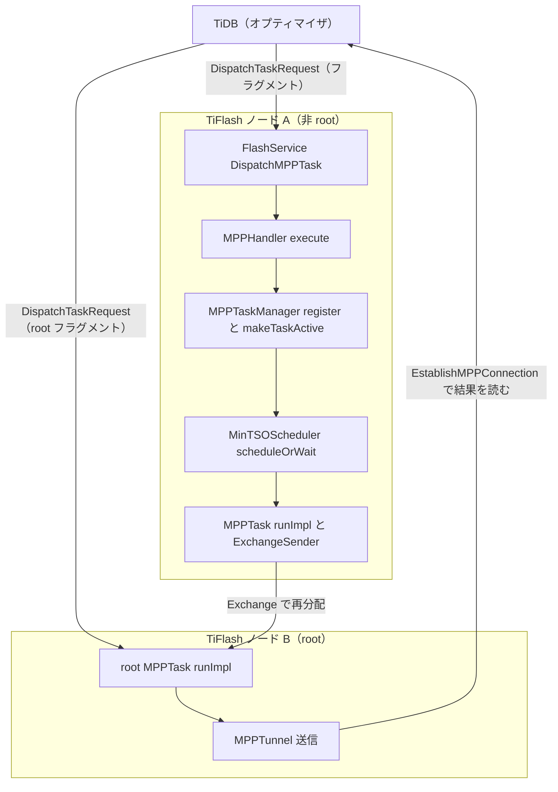

# 第20章 MPP の実行フローと TiDB 連携

> **本章で読むソース**
>
> - [`dbms/src/Flash/FlashService.cpp`](https://github.com/pingcap/tiflash/blob/v8.5.6/dbms/src/Flash/FlashService.cpp)
> - [`dbms/src/Flash/Mpp/MPPHandler.cpp`](https://github.com/pingcap/tiflash/blob/v8.5.6/dbms/src/Flash/Mpp/MPPHandler.cpp)
> - [`dbms/src/Flash/Mpp/MPPTask.cpp`](https://github.com/pingcap/tiflash/blob/v8.5.6/dbms/src/Flash/Mpp/MPPTask.cpp)
> - [`dbms/src/Flash/Mpp/MPPTaskManager.h`](https://github.com/pingcap/tiflash/blob/v8.5.6/dbms/src/Flash/Mpp/MPPTaskManager.h)
> - [`dbms/src/Flash/Mpp/MPPTaskManager.cpp`](https://github.com/pingcap/tiflash/blob/v8.5.6/dbms/src/Flash/Mpp/MPPTaskManager.cpp)
> - [`dbms/src/Flash/Mpp/MPPTaskScheduleEntry.cpp`](https://github.com/pingcap/tiflash/blob/v8.5.6/dbms/src/Flash/Mpp/MPPTaskScheduleEntry.cpp)
> - [`dbms/src/Flash/Mpp/MinTSOScheduler.h`](https://github.com/pingcap/tiflash/blob/v8.5.6/dbms/src/Flash/Mpp/MinTSOScheduler.h)
> - [`dbms/src/Flash/Mpp/MinTSOScheduler.cpp`](https://github.com/pingcap/tiflash/blob/v8.5.6/dbms/src/Flash/Mpp/MinTSOScheduler.cpp)

## この章の狙い

第18章で MPP が何であるか、第19章で `MPPTask` と Exchange が1つのフラグメントをどう実行し再分配するかを読んだ。
本章は視点を1段上げ、TiDB が1本の MPP クエリを TiFlash 群へ投げてから結果が返るまでの全体フローを読む。
追うのは4つの局面である。
TiDB が各フラグメントを各 TiFlash ノードへ配る**ディスパッチ**、受けたノードが `MPPTask` を作って登録する**登録**、メモリ過負荷を避けてタスクの並行数を絞る**スケジューリング**、各タスクが実行して最上位のタスクが結果を TiDB へ返す**実行と返却**である。

第18章と第19章が1ノード内のフラグメント実行に閉じていたのに対し、本章はノードをまたいだ制御の流れを主題にする。
とりわけ、複数ノードが同時にメモリ不足へ陥ってもクエリが止まらないようにする `MinTSOScheduler` の仕組みを、機構のレベルで読む。

## 前提

MPP クエリのプランが TiDB のオプティマイザでフラグメントに切り分けられ、どのフラグメントを TiFlash へ押し下げるかが決まることは[第11章](../../tidb/part02-optimizer/11-engine-selection-and-mpp.md)で扱った。
1つのフラグメントが `MPPTask` として実行され、`ExchangeSender` と `ExchangeReceiver` でノード間を再分配することは[第19章](19-mpptask-and-exchange.md)で扱った。
タスクの内側が `PipelineExec` と演算子で回ることは[第15章](../part03-engine/15-pipeline-operators.md)で扱った。
本章は、これらを束ねる外側の制御を読む。

## TiDB からの dispatch を受ける入口

TiDB はフラグメントごとに、それを担うべき TiFlash ノードへ `DispatchMPPTask` という gRPC を送る。
リクエストの本体 `DispatchTaskRequest` には、フラグメントの実行計画を符号化した `encoded_plan`、開始タイムスタンプなどを収めた `TaskMeta`、読むべき Region の範囲が入る。
1つのフラグメントが複数ノードに分散して読まれるときは、ノードごとに1つのタスクが立つので、同じフラグメントから複数の `DispatchTaskRequest` が別々のノードへ飛ぶ。

受け口は `FlashService::DispatchMPPTask` である。

[`dbms/src/Flash/FlashService.cpp` L486-L489](https://github.com/pingcap/tiflash/blob/v8.5.6/dbms/src/Flash/FlashService.cpp#L486-L489)

```cpp
grpc::Status FlashService::DispatchMPPTask(
    grpc::ServerContext * grpc_context,
    const mpp::DispatchTaskRequest * request,
    mpp::DispatchTaskResponse * response)
```

この関数は MPP バージョンの整合やメトリクスの計上を済ませたあと、リクエストを `MPPHandler` へ渡して実処理を委ねる。

[`dbms/src/Flash/FlashService.cpp` L551-L552](https://github.com/pingcap/tiflash/blob/v8.5.6/dbms/src/Flash/FlashService.cpp#L551-L552)

```cpp
    MPPHandler mpp_handler(*request);
    return mpp_handler.execute(db_context, response);
```

`DispatchMPPTask` は同期 RPC だが、タスクの実行完了を待って返るわけではない。
返すのはディスパッチの受理可否だけであり、計算結果は後述する別経路で TiDB へ送られる。

## MPPTask の生成と起動

`MPPHandler::execute` は、計画の組み立て、タスクとトンネルの登録、実行スレッドの起動までを担う。

[`dbms/src/Flash/Mpp/MPPHandler.cpp` L80-L92](https://github.com/pingcap/tiflash/blob/v8.5.6/dbms/src/Flash/Mpp/MPPHandler.cpp#L80-L92)

```cpp
        task = MPPTask::newTask(task_request.meta(), context);
        task->prepare(task_request);

        addRetryRegion(context, response);

// ... (中略) ...
        task->run();
```

`newTask` が `MPPTask` を `shared_ptr` で作り、`prepare` が計画の復元と登録を行い、`run` が実行を別スレッドへ切り離す。
`prepare` の中で同期的に行われるのが登録であり、`run` の中で非同期に進むのが実行とスケジューリングである。
この境目が、`DispatchMPPTask` が結果を待たずに返れる理由になる。

`prepare` は符号化された計画を復元し、`read_tso` に開始タイムスタンプを、`schema_version` にスキーマ版を設定する。
そのうえで、このタスクが最上位かどうかを判定する。
`ExchangeSender` の宛先メタが1つだけで、その `task_id` が `-1` のとき、宛先は TiDB 自身であり、このタスクは結果を TiDB へ直接返す**root タスク**である。

## タスクの登録は register と makeTaskActive の二段階

`prepare` は、復元した計画を `MPPTaskManager` へ二段階で登録する。
第一段の `registerTask` は、タスクの存在をマネージャに記録するが、まだ他タスクからは見えない状態に置く。

[`dbms/src/Flash/Mpp/MPPTaskManager.h` L244-L245](https://github.com/pingcap/tiflash/blob/v8.5.6/dbms/src/Flash/Mpp/MPPTaskManager.h#L244-L245)

```cpp
    /// registerTask make the task info stored in MPPTaskManager, but it is still not visible to other mpp tasks before makeTaskActive.
    /// After registerTask, the related query_task_set can't be cleaned before unregisterTask is called
```

第二段の `makeTaskActive` で、タスクは初めて他タスクから引けるようになる。
`prepare` はこの2つを、あいだにトンネルの登録を挟んで順に呼ぶ。

[`dbms/src/Flash/Mpp/MPPTask.cpp` L451-L465](https://github.com/pingcap/tiflash/blob/v8.5.6/dbms/src/Flash/Mpp/MPPTask.cpp#L451-L465)

```cpp
    auto [result, reason] = manager->registerTask(this);
// ... (中略) ...
    std::tie(result, reason) = manager->makeTaskActive(shared_from_this());
```

二段階に分ける理由は、タスクの可視化とトンネルの用意の順序を保つことにある。
別ノードの `ExchangeReceiver` がこのタスクへ接続しに来るのは、トンネルが登録され、タスクが可視になってからでなければならない。
先に可視化してしまうと、トンネルがまだ無い瞬間に接続要求が届き、取りこぼす恐れがある。

登録先のデータ構造は階層を持つ。
1本のクエリは `MPPQueryId` で識別され、その下に gather（`MPPGatherId` で識別される実行単位）があり、gather の下に各タスクが並ぶ。
`registerTask` は、この階層をたどって gather のタスク集合へタスクを記録する。

[`dbms/src/Flash/Mpp/MPPTaskManager.cpp` L449-L457](https://github.com/pingcap/tiflash/blob/v8.5.6/dbms/src/Flash/Mpp/MPPTaskManager.cpp#L449-L457)

```cpp
    if (gather_task_set->isTaskRegistered(task->id))
    {
        return {false, "task is already registered"};
    }
    gather_task_set->registerTask(task->id);
    task->is_registered = true;
    task->initProcessListEntry(query->process_list_entry);
    task->initQueryOperatorSpillContexts(query->mpp_query_operator_spill_contexts);
    return {true, ""};
```

大半のクエリは gather を1つだけ持つ。
gather の階層が要るのは、同じクエリに複数の読み取り単位がぶら下がる場合に、それぞれを独立に登録して中断できるようにするためである。

## min-tso スケジューラによる並行数の制御

登録を終えたタスクは `run` で実行スレッドへ移り、計画を組み立てて必要スレッド数を見積もったあと、`scheduleOrWait` で実行枠の確保を試みる。

[`dbms/src/Flash/Mpp/MPPTask.cpp` L792-L798](https://github.com/pingcap/tiflash/blob/v8.5.6/dbms/src/Flash/Mpp/MPPTask.cpp#L792-L798)

```cpp
void MPPTask::scheduleOrWait()
{
    if (!manager->tryToScheduleTask(schedule_entry))
    {
        schedule_entry.waitForSchedule();
    }
}
```

`tryToScheduleTask` が成功すればそのまま実行へ進み、失敗すれば `waitForSchedule` でスレッドが空くまでブロックする。
ここで枠を絞るのが `MinTSOScheduler` である。
このスケジューラの狙いは、ヘッダのコメントが端的に述べている。

[`dbms/src/Flash/Mpp/MinTSOScheduler.h` L31-L34](https://github.com/pingcap/tiflash/blob/v8.5.6/dbms/src/Flash/Mpp/MinTSOScheduler.h#L31-L34)

```cpp
/// scheduling tasks in the set according to the tso order under the soft limit of threads, but allow the min_query_id query to preempt threads under the hard limit of threads.
/// The min_query_id query avoids the deadlock resulted from threads competition among nodes.
/// schedule tasks under the lock protection of the task manager.
/// NOTE: if the updated min-tso query has waiting tasks, necessarily scheduling them, otherwise the query would hang.
```

スケジューラは推定スレッド使用量に2つの上限を設ける。
通常のクエリは、ソフト上限 `thread_soft_limit` の範囲内でしか枠を取れない。
ただし、開始タイムスタンプが最小のクエリ `min_query_id` だけは、ハード上限 `thread_hard_limit` までスレッドを横取りできる。
判定の本体は、この2条件の論理和で書かれている。

[`dbms/src/Flash/Mpp/MinTSOScheduler.cpp` L311-L316](https://github.com/pingcap/tiflash/blob/v8.5.6/dbms/src/Flash/Mpp/MinTSOScheduler.cpp#L311-L316)

```cpp
    auto check_for_new_min_tso
        = query_id <= group_entry.min_query_id && global_estimated_thread_usage + needed_threads <= thread_hard_limit;
    auto check_for_not_min_tso = (group_entry.active_set.size() < active_set_soft_limit
                                  || group_entry.active_set.find(query_id) != group_entry.active_set.end())
        && (group_entry.estimated_thread_usage + needed_threads <= thread_soft_limit);
    if (check_for_new_min_tso || check_for_not_min_tso)
```

`check_for_new_min_tso` は、自分が最小タイムスタンプ以下であり、かつハード上限に収まるなら通すという条件である。
`check_for_not_min_tso` は、稼働中クエリ数が `active_set_soft_limit` 未満で、かつソフト上限に収まるなら通すという条件である。
どちらかが成り立てば、タスクは稼働集合へ入って `SCHEDULED` になる。

どちらも成り立たないとき、扱いは自分が `min_query_id` かどうかで分かれる。
自分が最小タイムスタンプのクエリなら、ソフト上限ではなくハード上限まで使えるはずなので、それでも足りないのは異常である。

[`dbms/src/Flash/Mpp/MinTSOScheduler.cpp` L348-L350](https://github.com/pingcap/tiflash/blob/v8.5.6/dbms/src/Flash/Mpp/MinTSOScheduler.cpp#L348-L350)

```cpp
        bool is_query_id_min = query_id <= group_entry.min_query_id;
        fiu_do_on(FailPoints::random_min_tso_scheduler_failpoint, is_query_id_min = true;);
        if (is_query_id_min) /// the min_query_id query should fully run, otherwise throw errors here.
```

コメントが述べるとおり、最小タイムスタンプのクエリは完走しきるべき対象であり、ここで枠を取れないなら例外を投げて打ち切る。
最小でないクエリなら、待ち集合へ回して空きを待たせる。

[`dbms/src/Flash/Mpp/MinTSOScheduler.cpp` L382-L385](https://github.com/pingcap/tiflash/blob/v8.5.6/dbms/src/Flash/Mpp/MinTSOScheduler.cpp#L382-L385)

```cpp
        if (!isWaiting)
        {
            group_entry.waiting_set.insert(query_id);
            query_task_set->waiting_tasks.push(schedule_entry.getMPPTaskId());
```

待ちに回されたタスクは、クエリ単位の待ち集合 `waiting_set` と、タスク単位の待ち行列 `waiting_tasks` の両方へ積まれる。
このタスクを起こす側の `schedule_entry` は、条件変数で寝て待つ。

[`dbms/src/Flash/Mpp/MPPTaskScheduleEntry.cpp` L39-L51](https://github.com/pingcap/tiflash/blob/v8.5.6/dbms/src/Flash/Mpp/MPPTaskScheduleEntry.cpp#L39-L51)

```cpp
bool MPPTaskScheduleEntry::schedule(ScheduleState state)
{
    std::unique_lock lock(schedule_mu);
    if (schedule_state == ScheduleState::WAITING)
    {
        auto log_level = state == ScheduleState::SCHEDULED ? Poco::Message::PRIO_DEBUG : Poco::Message::PRIO_WARNING;
        LOG_IMPL(log, log_level, "task is {}.", state == ScheduleState::SCHEDULED ? "scheduled" : "failed to schedule");
        schedule_state = state;
        schedule_cv.notify_one();
        return true;
    }
    return false;
}
```

`waitForSchedule` は `schedule_cv` の上で `WAITING` でなくなるのを待ち、`schedule` が状態を `SCHEDULED` などに変えて `notify_one` で起こす。
枠が空くきっかけは、別のタスクの完了である。
タスクが終わるとスレッドが返り、その契機で待ち中のクエリが順に拾われる。

[`dbms/src/Flash/Mpp/MinTSOScheduler.cpp` L208-L209](https://github.com/pingcap/tiflash/blob/v8.5.6/dbms/src/Flash/Mpp/MinTSOScheduler.cpp#L208-L209)

```cpp
    /// as tasks release some threads, so some tasks would get scheduled.
    scheduleWaitingQueries(group_entry, task_manager, log);
```

`scheduleWaitingQueries` は待ち集合を `std::set` の昇順、すなわちタイムスタンプの小さいクエリから順にたどって枠を割り当て直す。
古いクエリを先に通すこの順序が、次に述べる deadlock 回避の土台になる。

### なぜ min-tso 順がノード間 deadlock を防ぐか

ここがこのスケジューラの最適化の核である。
MPP では、あるノードの非 root タスクが、別ノードの上流タスクからの `Block` 到着を待ってブロックすることがある。
仮に各ノードが独立に別々のクエリを優先すると、次の膠着が起こりうる。
ノード A はクエリ X を優先してソフト上限まで埋め、クエリ Y のタスクを待たせる。
ノード B はクエリ Y を優先して同様に埋め、クエリ X のタスクを待たせる。
X は B 上のタスクが進まないので完了できず、Y は A 上のタスクが進まないので完了できない。
どちらも完了しないからスレッドが返らず、待ちが永遠に解けない。

`MinTSOScheduler` は、全ノードが同じ大域最小タイムスタンプのクエリを `min_query_id` として選ぶことで、この循環を断つ。
タイムスタンプは TiDB が TSO から採番する大域的に順序付いた値なので、どのノードでも最小クエリの選定は一致する。
その1つのクエリだけは、各ノードでソフト上限を越えてハード上限まで枠を確保できる。
結果として、メモリ過負荷の下でも最小タイムスタンプのクエリだけは全ノードで枠を得て完走し、スレッドを返す。
スレッドが返れば次に古いクエリが最小になって完走でき、少なくとも1本ずつは必ず前進する。
これが、メモリ不足でも全体が止まらない仕組みである。

## 実行と root タスクからの結果返却

枠を得たタスクは `runImpl` の中で実行へ移る。
`runImpl` はタスクの状態を `INITIALIZING` から `RUNNING` へ移し、`preprocess` で `ExchangeReceiver` とクエリ実行器を組み立て、`scheduleOrWait` を経て本体を回す。

[`dbms/src/Flash/Mpp/MPPTask.cpp` L572](https://github.com/pingcap/tiflash/blob/v8.5.6/dbms/src/Flash/Mpp/MPPTask.cpp#L572-L572)

```cpp
        auto result = query_executor_holder->execute();
```

`execute` の内側が、第15章のパイプライン実行モデルと第19章の Exchange である。
非 root タスクは計算した `Block` を `ExchangeSender` から下流ノードの `ExchangeReceiver` へ送り、root タスクは集約しきった結果を TiDB へ送る。
送り先の違いはトンネルの種別に現れる。

[`dbms/src/Flash/Mpp/MPPTask.cpp` L227-L229](https://github.com/pingcap/tiflash/blob/v8.5.6/dbms/src/Flash/Mpp/MPPTask.cpp#L227-L229)

```cpp
        /// when the receiver task is root task, it should never be local tunnel
        bool is_local = context->getSettingsRef().enable_local_tunnel && task_meta.task_id() != -1
            && meta.address() == task_meta.address();
```

同一ノード内の宛先には、ネットワークを経ずメモリで渡す `is_local` のトンネルを使える。
だが宛先が TiDB のとき、その `task_id` は `-1` であって `task_id != -1` を満たさないので、`is_local` は必ず偽になる。
root タスクから TiDB への結果は、つねにネットワーク越しのトンネルで送られる。

実行が成功すると、root タスクは残りの出力を書き切ってから受信側を閉じる。

[`dbms/src/Flash/Mpp/MPPTask.cpp` L613-L616](https://github.com/pingcap/tiflash/blob/v8.5.6/dbms/src/Flash/Mpp/MPPTask.cpp#L613-L616)

```cpp
            // finish MPPTunnel
            finishWrite();
            // finish receiver
            receiver_set->close();
```

TiDB 側は、`DispatchMPPTask` の応答とは別に、root タスクのトンネルへ `EstablishMPPConnection` で接続し、そこから結果ストリームを読み出す。
ディスパッチで実行を起動し、別の接続で結果を引く2経路に分かれているのは、`DispatchMPPTask` が結果を待たずに早く返れる設計の裏返しである。

## 全体フロー

ここまでの4局面を1枚に束ねると、TiDB と TiFlash 群のあいだの制御は次のようになる。



図の左の縦の連なりが、1ノードがディスパッチを受けてから実行へ至る流れである。
横の `Exchange` の矢印が第19章の再分配であり、右下から TiDB へ戻る矢印が本章で読んだ結果返却である。

## まとめ

TiDB は MPP プランをフラグメントへ分け、各フラグメントを `DispatchMPPTask` で TiFlash ノードへ配る。
受けたノードは `FlashService::DispatchMPPTask` から `MPPHandler::execute` へ進み、`MPPTask` を生成して `prepare` で登録し、`run` で実行を別スレッドへ切り離す。
登録は `registerTask` と `makeTaskActive` の二段階で、トンネルが整うまでタスクを不可視に保つ。
実行へ移る前に `MinTSOScheduler` が並行数を絞り、ソフト上限とハード上限の2段で枠を割り当てる。
最小タイムスタンプのクエリだけをハード上限まで優先するこの方式は、全ノードが同じクエリを優先することでノード間 deadlock を断ち、メモリ不足の下でも少なくとも1本のクエリを完走させる。
実行を終えた root タスクは、`DispatchMPPTask` の応答とは別経路の `EstablishMPPConnection` トンネルで、結果を TiDB へ返す。

## 関連する章

- [第18章 MPP とは](18-what-is-mpp.md)：本章が前提とする MPP の全体像とフラグメント分割。
- [第19章 MPPTask と Exchange](19-mpptask-and-exchange.md)：1つのフラグメントの実行とノード間再分配の内側。
- [第15章 パイプライン実行モデル（Operators）](../part03-engine/15-pipeline-operators.md)：`MPPTask` の内側で `Block` を流すパイプラインの土台。
- [第11章 エンジン選択と MPP プラン](../../tidb/part02-optimizer/11-engine-selection-and-mpp.md)：TiDB 側でフラグメントを切り分け、TiFlash へ押し下げる判断。
