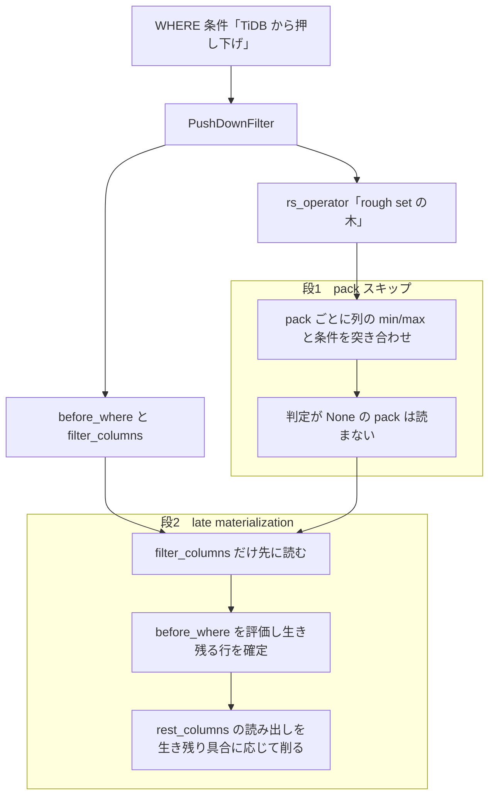

# 第21章 フィルタ押し下げと late materialization

> **本章で読むソース**
>
> - [`dbms/src/Storages/DeltaMerge/Filter/RSOperator.h`](https://github.com/pingcap/tiflash/blob/v8.5.6/dbms/src/Storages/DeltaMerge/Filter/RSOperator.h)
> - [`dbms/src/Storages/DeltaMerge/Filter/Greater.h`](https://github.com/pingcap/tiflash/blob/v8.5.6/dbms/src/Storages/DeltaMerge/Filter/Greater.h)
> - [`dbms/src/Storages/DeltaMerge/Index/RoughCheck.h`](https://github.com/pingcap/tiflash/blob/v8.5.6/dbms/src/Storages/DeltaMerge/Index/RoughCheck.h)
> - [`dbms/src/Storages/DeltaMerge/Filter/PushDownFilter.h`](https://github.com/pingcap/tiflash/blob/v8.5.6/dbms/src/Storages/DeltaMerge/Filter/PushDownFilter.h)
> - [`dbms/src/Storages/DeltaMerge/Filter/PushDownFilter.cpp`](https://github.com/pingcap/tiflash/blob/v8.5.6/dbms/src/Storages/DeltaMerge/Filter/PushDownFilter.cpp)
> - [`dbms/src/Storages/DeltaMerge/Segment.cpp`](https://github.com/pingcap/tiflash/blob/v8.5.6/dbms/src/Storages/DeltaMerge/Segment.cpp)
> - [`dbms/src/Storages/DeltaMerge/LateMaterializationBlockInputStream.h`](https://github.com/pingcap/tiflash/blob/v8.5.6/dbms/src/Storages/DeltaMerge/LateMaterializationBlockInputStream.h)
> - [`dbms/src/Storages/DeltaMerge/LateMaterializationBlockInputStream.cpp`](https://github.com/pingcap/tiflash/blob/v8.5.6/dbms/src/Storages/DeltaMerge/LateMaterializationBlockInputStream.cpp)

## この章の狙い

分析クエリの `WHERE` 句は、テーブルの大半の行を捨てることが多い。
捨てる行をディスクから読まずに済ませられれば、その分だけ読み取りが速くなる。
TiFlash は、TiDB から押し下げられた条件を読み取り経路で使い、不要な読み出しを2段で削る。

1段目は**フィルタ押し下げ**である。
DTFile の pack ごとの min/max 統計と条件を突き合わせ、条件に合う値を含まない pack を丸ごと読み飛ばす。
2段目は **late materialization**（遅延実体化）である。
フィルタに使う列だけを先に読んで生き残る行を確定し、残りの列の読み出しを生き残り具合に応じてブロックや pack の単位で削る。

本章は、押し下げられた条件が pack スキップ用の `RSOperator` になる経路と、同じ条件を使う late materialization の読み取りストリームを、ソースに即して読む。

## 前提

[第8章 Stable レイヤと DTFile](../part01-deltatree/08-stable-and-dtfile.md)で、DTFile が列ごとに pack 単位でデータと min/max インデックスを持ち、`DMFilePackFilter` がフィルタと突き合わせて pack ごとの判定（`pack_res`）を `None` と `Some` と `All` の3値で更新する流れを見た。
本章はその続きとして、条件がどのように `RSOperator` の木へ変換され、min/max からどう3値が決まるかを先に確定させる。
そのうえで、同じ押し下げ条件を使って列の読み出し自体を絞る late materialization を読む。

押し下げ条件が TiDB のオプティマイザでどう選ばれ、コプロセッサ要求に載るかは TiDB 編の[コプロセッサ押し下げ](../../tidb/part02-optimizer/10-coprocessor-pushdown.md)で扱う。
TiFlash 側の式評価の仕組みは[第17章 式評価](../part03-engine/17-expression-evaluation.md)で扱う。

## WHERE 条件を pack スキップ用の RSOperator に変える

押し下げられた条件は、`RSOperator` を頂点とする木に変換される。
比較の葉は列と定数を1組持ち、論理演算（`And`、`Or`、`Not`）が葉を束ねる。
たとえば `id > 2000` は `Greater` という葉になる。

[`dbms/src/Storages/DeltaMerge/Filter/Greater.h`](https://github.com/pingcap/tiflash/blob/v8.5.6/dbms/src/Storages/DeltaMerge/Filter/Greater.h#L23-L36)

```cpp
class Greater : public ColCmpVal
{
public:
    Greater(const Attr & attr_, const Field & value_)
        : ColCmpVal(attr_, value_)
    {}

    String name() override { return "greater"; }

    RSResults roughCheck(size_t start_pack, size_t pack_count, const RSCheckParam & param) override
    {
        return minMaxCheckCmp<RoughCheck::CheckGreater>(start_pack, pack_count, param, attr, value);
    }
};
```

`Greater` は基底の `ColCmpVal` から、比較対象の列 `attr` と定数 `value` を受け取る。
`roughCheck` は、判定対象の pack 区間（`start_pack` から `pack_count` 個）に対して、pack ごとの3値判定を並べた `RSResults` を返す。
条件の種類ごとに葉のクラスが分かれており、`createGreater` や `createEqual` や `createAnd` などの生成関数が `RSOperator.cpp` で対応するクラスを作る。

`roughCheck` が列の min/max を参照する入口が `minMaxCheckCmp` である。

[`dbms/src/Storages/DeltaMerge/Filter/RSOperator.h`](https://github.com/pingcap/tiflash/blob/v8.5.6/dbms/src/Storages/DeltaMerge/Filter/RSOperator.h#L162-L173)

```cpp
template <typename Op>
RSResults minMaxCheckCmp(
    size_t start_pack,
    size_t pack_count,
    const RSCheckParam & param,
    const Attr & attr,
    const Field & value)
{
    auto rs_index = getRSIndex(param, attr);
    return rs_index ? rs_index->minmax->checkCmp<Op>(start_pack, pack_count, value, rs_index->type)
                    : RSResults(pack_count, RSResult::Some);
}
```

`getRSIndex` は、その列の min/max インデックス（`rs_index`）を `param` から探す。
インデックスがあれば `checkCmp` が pack ごとに min/max と定数を比較し、無ければ全 pack を `Some` として返す。
`Some` は、その pack を読んで行ごとに再判定する必要があることを表す。
インデックスが無い列は読み飛ばせないため、安全側に倒して全 pack を読む対象に残すわけである。

## min/max と条件を突き合わせて pack を3値に判定する

`checkCmp` が pack ごとに呼ぶ判定本体が `RoughCheck` の構造体である。
`Greater` に対応する `CheckGreater` を読むと、min/max から3値がどう決まるかが分かる。

[`dbms/src/Storages/DeltaMerge/Index/RoughCheck.h`](https://github.com/pingcap/tiflash/blob/v8.5.6/dbms/src/Storages/DeltaMerge/Index/RoughCheck.h#L86-L107)

```cpp
struct CheckGreater
{
    template <typename T>
    static RSResult check(const Field & v, const DataTypePtr & type, const T & min, const T & max)
    {
        if (!IS_LEGAL(v, min))
            return RSResult::Some;

        //    if (v >= max)
        //        return None;
        //    else if (v < min)
        //        return All;
        //    return Some;

        if (GREATER_EQ(v, max))
            return RSResult::None;
        else if (LESS(v, min))
            return RSResult::All;
        else
            return RSResult::Some;
    }
};
```

`v` が条件の定数、`min` と `max` がその pack のその列の最小値と最大値である。
`id > 2000` を例にすると、定数 `v` は 2000 を表す。
pack の最大値が 2000 以下（`v >= max`）なら、その pack に 2000 を超える行は1つも無いので `None` になり、読まずに飛ばせる。
pack の最小値が 2000 を超える（`v < min`）なら、全行が条件を満たすので `All` になり、読むが行ごとの再評価は省ける。
それ以外は一部だけ合う可能性があり `Some` になる。

この3値が pack ごとに並んだものを、`DMFilePackFilter` が既存の判定と論理積して `pack_res` を更新し、`None` の pack を読み取り対象から外す。
その流れは第8章で読んだとおりであり、min/max だけを見て pack の `.dat` 本体には触れない点が、I/O を粗く削る土台になる。

## 押し下げフィルタを束ねる PushDownFilter

pack スキップ用の `RSOperator` と、late materialization 用の式とは、同じ押し下げ条件から作られる。
両者を1つにまとめて読み取り経路へ渡す入れ物が `PushDownFilter` である。

[`dbms/src/Storages/DeltaMerge/Filter/PushDownFilter.h`](https://github.com/pingcap/tiflash/blob/v8.5.6/dbms/src/Storages/DeltaMerge/Filter/PushDownFilter.h#L81-L97)

```cpp
    // Rough set operator
    RSOperatorPtr rs_operator;
    // Filter expression actions and the name of the tmp filter column
    // Used construct the FilterBlockInputStream
    const ExpressionActionsPtr before_where;
    // The projection after the filter, used to remove the tmp filter column
    // Used to construct the ExpressionBlockInputStream
    // Note: usually we will remove the tmp filter column in the LateMaterializationBlockInputStream, this only used for unexpected cases
    const ExpressionActionsPtr project_after_where;
    const String filter_column_name;
    // The columns needed by the filter expression
    const ColumnDefinesPtr filter_columns;
    // The expression actions used to cast the timestamp/datetime column
    const ExpressionActionsPtr extra_cast;
    // If the extra_cast is not null, the types of the columns may be changed
    const ColumnDefinesPtr columns_after_cast;
};
```

`rs_operator` が pack スキップに使う木である。
`before_where` は条件式そのものを評価するアクションで、`filter_columns` はその式が必要とする列の定義である。
`filter_column_name` は、評価結果（その行が条件を通るか）を入れる一時列の名前である。

`filter_columns` は、読み取る列全体のうち、押し下げ条件が参照する列だけを取り出した部分集合になる。

[`dbms/src/Storages/DeltaMerge/Filter/PushDownFilter.cpp`](https://github.com/pingcap/tiflash/blob/v8.5.6/dbms/src/Storages/DeltaMerge/Filter/PushDownFilter.cpp#L44-L59)

```cpp
    // Get the columns of the filter, is a subset of columns_to_read
    std::unordered_set<ColumnID> filter_col_id_set;
    for (const auto & expr : pushed_down_filters)
    {
        getColumnIDsFromExpr(expr, table_scan_column_info, filter_col_id_set);
    }
    auto filter_columns = std::make_shared<DM::ColumnDefines>();
    filter_columns->reserve(filter_col_id_set.size());
    for (const auto & cid : filter_col_id_set)
    {
        RUNTIME_CHECK_MSG(
            columns_to_read_map.contains(cid),
            "Filter ColumnID({}) not found in columns_to_read_map",
            cid);
        filter_columns->emplace_back(columns_to_read_map.at(cid));
    }
```

`getColumnIDsFromExpr` が押し下げ条件の各式から列 ID を集め、その列だけを `filter_columns` に詰める。
この `filter_columns` と、残りの列との分け方が、次に読む late materialization の要になる。

## フィルタ列だけを先に読む late materialization

読み取りストリームを組む `Segment` は、押し下げ条件の式（`before_where`）がある場合に late materialization を選ぶ。

[`dbms/src/Storages/DeltaMerge/Segment.cpp`](https://github.com/pingcap/tiflash/blob/v8.5.6/dbms/src/Storages/DeltaMerge/Segment.cpp#L3755-L3767)

```cpp
    if (filter && filter->before_where)
    {
        // if has filter conditions pushed down, use late materialization
        return getLateMaterializationStream(
            bitmap_filter,
            dm_context,
            columns_to_read,
            segment_snap,
            real_ranges,
            filter,
            start_ts,
            read_data_block_rows);
    }
```

`getLateMaterializationStream` は、まず `filter_columns` だけを読むストリームを作り、その上に条件式を評価する `FilterBlockInputStream` を重ねる。
そのあとで、読み取る列全体から `filter_columns` を取り除いた**残りの列**（`rest_columns`）を求める。

[`dbms/src/Storages/DeltaMerge/Segment.cpp`](https://github.com/pingcap/tiflash/blob/v8.5.6/dbms/src/Storages/DeltaMerge/Segment.cpp#L3666-L3683)

```cpp
    filter_column_stream = std::make_shared<FilterBlockInputStream>(
        filter_column_stream,
        filter->before_where,
        filter->filter_column_name,
        dm_context.tracing_id);
    filter_column_stream->setExtraInfo("push down filter");

    auto rest_columns_to_read = std::make_shared<ColumnDefines>(columns_to_read);
    // remove columns of pushed down filter
    for (const auto & col : *filter_columns)
    {
        rest_columns_to_read->erase(
            std::remove_if(
                rest_columns_to_read->begin(),
                rest_columns_to_read->end(),
                [&](const ColumnDefine & c) { return c.id == col.id; }),
            rest_columns_to_read->end());
    }
```

`filter_column_stream` はフィルタ列を読み、条件式を評価して、各行が条件を通るかを示すフィルタを付ける。
`rest_columns_to_read` は、フィルタ列を除いた残りの列の定義であり、別のストリームで読む。
2つのストリームは `LateMaterializationBlockInputStream` が束ね、フィルタ列のブロックで残り列のブロックを絞ってから列方向に連結する。
その手順は、ストリームの宣言の冒頭にそのまま書かれている。

[`dbms/src/Storages/DeltaMerge/LateMaterializationBlockInputStream.h`](https://github.com/pingcap/tiflash/blob/v8.5.6/dbms/src/Storages/DeltaMerge/LateMaterializationBlockInputStream.h#L25-L30)

```cpp
/** BlockInputStream to do late materialization.
  * 1. Read one block of the filter column.
  * 2. Run pushed down filter on the block, return block and filter.
  * 3. Read one block of the rest columns, join the two block by columns, and assign the filter to the returned block before return.
  * 4. Repeat 1-3 until the filter column stream is empty.
  */
```

フィルタ列を読んで条件を評価し（手順1から2）、その結果で残り列を読み（手順3）、連結して返す。
残り列の読み出しは、フィルタ列で生き残る行が確定したあとに回される。

## 生き残り具合に応じて残り列の読み出しを削る

late materialization が速いのは、生き残る行を先に確定し、コストの高い残り列の読み出しを、生き残り具合に応じてブロックや pack の単位で削れるからである。
`read` の中で、フィルタ列のブロックに対する判定結果を数え、生き残った行数（`passed_count`）で残り列の読み方を切り替える。

[`dbms/src/Storages/DeltaMerge/LateMaterializationBlockInputStream.cpp`](https://github.com/pingcap/tiflash/blob/v8.5.6/dbms/src/Storages/DeltaMerge/LateMaterializationBlockInputStream.cpp#L102-L109)

```cpp
        size_t rows = filter_column_block.rows();
        // bitmap_filter[start_offset, start_offset + rows] & filter -> filter
        bitmap_filter->rangeAnd(*filter, filter_column_block.startOffset(), rows);

        if (size_t passed_count = countBytesInFilter(*filter); passed_count == 0)
        {
            // if all rows are filtered, skip the next block of rest_column_stream
            if (size_t skipped_rows = rest_column_stream->skipNextBlock(); skipped_rows == 0)
```

条件式の結果に MVCC の可視性ビットマップ（`bitmap_filter`）を論理積してから、生き残る行数を数える。
生き残りが 0 なら、残り列の対応ブロックは1行も要らないので、`skipNextBlock` でそのブロックを読まずに飛ばす。
フィルタ列という細い列を読むだけで、残り列のブロック全体の読み出しを丸ごと省けるわけである。

生き残りがある場合は、捨てる行数（`filter_out_count`）の大きさで読み方を変える。

[`dbms/src/Storages/DeltaMerge/LateMaterializationBlockInputStream.cpp`](https://github.com/pingcap/tiflash/blob/v8.5.6/dbms/src/Storages/DeltaMerge/LateMaterializationBlockInputStream.cpp#L126-L136)

```cpp
            auto filter_out_count = rows - passed_count;
            if (filter_out_count >= DEFAULT_MERGE_BLOCK_SIZE * 2)
            {
                // When DEFAULT_MERGE_BLOCK_SIZE < row_left < DEFAULT_MERGE_BLOCK_SIZE * 2,
                // the possibility of skipping a pack in the next block is quite small, less than 1%.
                // And the performance read and then filter is is better than readWithFilter,
                // so only if the number of rows left after filtering out is large enough,
                // we can skip some packs of the next block, call readWithFilter to get the next block.
                rest_column_block = rest_column_stream->readWithFilter(*filter);
                filterFilterColumnBlock(header, filter_column_block, *filter, passed_count, filter_column_name);
            }
```

捨てる行が十分多いとき（しきい値 `DEFAULT_MERGE_BLOCK_SIZE * 2` 以上）は、`readWithFilter` を使う。
これは残り列を読むときにフィルタを渡し、生き残る行を1つも含まない pack を読み出しの段階で飛ばす。
捨てる行が少ないときは、pack を飛ばせる見込みが薄いため、ブロックをそのまま読んでから生き残る行で絞る。
読んでから絞る方が速い領域では `readWithFilter` を避ける、というコメントの判断がここに表れている。

この2通りの切り替えにより、残り列に対しては、ブロック全体の読み飛ばし（`skipNextBlock`）と pack 単位の読み飛ばし（`readWithFilter`）と読んでから絞る経路を、生き残り具合に応じて使い分ける。
重い残り列の読み出しと展開は、全行が落ちたブロックを丸ごと飛ばし、多くが落ちた場合は pack 単位で削り、少ない場合は読んでから絞る、という3通りで抑えられる。

## 2段の絞り込みの全体像

ここまでの2段を1つの流れにすると、押し下げ条件が pack スキップと late materialization の双方を駆動する構造が見える。



段1は、min/max という pack の要約だけを見て、条件に合わない pack を読み取りから外し、I/O を粗く削る。
段2は、残った pack の中で、フィルタ列を先に評価して生き残る行を確定し、残り列の読み出しを生き残り具合に応じてブロックや pack の単位で削る。
段1が読むべき pack の集合を粗く決め、段2がその中で読むべき列と行をさらに細かく絞る、という役割分担である。

## まとめ

TiFlash の読み取りは、TiDB から押し下げられた `WHERE` 条件を2段で使って不要な読み出しを削る。
1段目のフィルタ押し下げは、条件を `RSOperator` の木にして DTFile の pack ごとの min/max と突き合わせ、`None` と判定した pack を読み飛ばす。
2段目の late materialization は、条件が参照する `filter_columns` だけを先に読んで生き残る行を確定し、`rest_columns` の読み出しを生き残り具合に応じてブロックや pack の単位で削る。
`PushDownFilter` が両段の材料（`rs_operator` と `before_where`、`filter_columns`）を1つに束ね、同じ条件で双方を駆動する。
機構の工夫は、フィルタ列という細い列を先に評価して生き残る行を確定し、コストの高い残り列の読み出しと展開を、全落ちのブロックは丸ごと飛ばし、多くが落ちた場合は pack 単位で削り、少ない場合は読んでから絞る形で抑える点にある。

## 関連する章

- [第8章 Stable レイヤと DTFile](../part01-deltatree/08-stable-and-dtfile.md)：pack 単位の min/max と `DMFilePackFilter` による pack スキップの土台。
- [第17章 式評価](../part03-engine/17-expression-evaluation.md)：`before_where` が評価する条件式の仕組み。
- [第22章 S3 disaggregated と GC、運用](22-disaggregated-and-ops.md)：押し下げフィルタを使うストレージ計算分離の読み取り経路。
- [コプロセッサ押し下げ](../../tidb/part02-optimizer/10-coprocessor-pushdown.md)：TiDB 編で、条件がオプティマイザでどう選ばれ TiFlash へ押し下げられるかを扱う。
