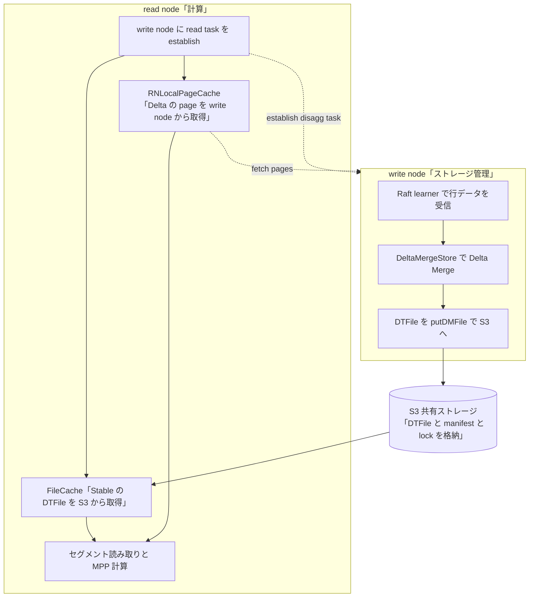

# 第22章 S3 disaggregated と GC、運用

> **本章で読むソース**
>
> - [`dbms/src/Storages/StorageDisaggregated.h`](https://github.com/pingcap/tiflash/blob/v8.5.6/dbms/src/Storages/StorageDisaggregated.h)
> - [`dbms/src/Storages/DeltaMerge/Remote/DataStore/DataStoreS3.h`](https://github.com/pingcap/tiflash/blob/v8.5.6/dbms/src/Storages/DeltaMerge/Remote/DataStore/DataStoreS3.h)
> - [`dbms/src/Storages/S3/S3Filename.h`](https://github.com/pingcap/tiflash/blob/v8.5.6/dbms/src/Storages/S3/S3Filename.h)
> - [`dbms/src/Storages/S3/FileCache.h`](https://github.com/pingcap/tiflash/blob/v8.5.6/dbms/src/Storages/S3/FileCache.h)
> - [`dbms/src/Storages/DeltaMerge/Remote/RNLocalPageCache.h`](https://github.com/pingcap/tiflash/blob/v8.5.6/dbms/src/Storages/DeltaMerge/Remote/RNLocalPageCache.h)
> - [`dbms/src/Storages/DeltaMerge/Remote/RNLocalPageCache.cpp`](https://github.com/pingcap/tiflash/blob/v8.5.6/dbms/src/Storages/DeltaMerge/Remote/RNLocalPageCache.cpp)
> - [`dbms/src/Storages/S3/S3GCManager.h`](https://github.com/pingcap/tiflash/blob/v8.5.6/dbms/src/Storages/S3/S3GCManager.h)
> - [`dbms/src/Storages/S3/S3GCManager.cpp`](https://github.com/pingcap/tiflash/blob/v8.5.6/dbms/src/Storages/S3/S3GCManager.cpp)

## この章の狙い

これまでの章で見た TiFlash は、列指向ストレージと計算を同じノードに同居させていた。
Raft learner で受けた行データを DeltaTree に書き込み、DTFile を自ノードのディスクに置き、同じノードで MPP の計算を走らせる構成である。
この構成では、計算を増やしたいときにストレージも一緒に増え、ストレージを増やしたいときに計算も一緒に増える。

近年の TiFlash には、計算とストレージを分ける **S3 disaggregated** という構成がある。
Stable レイヤの DTFile を S3 などの共有ストレージに置き、ノードを**書き込みノード**（write node）と**読み取りノード**（read node）に分ける。
write node は Raft learner として行データを受け、DeltaTree を回し、生成した DTFile を S3 へ上げる。
read node は自分でデータを保持せず、S3 上の DTFile を読み、ローカルキャッシュに温めてから計算する。

本章は本書の締めとして、この分離構成を読む。
read node の入口になる `StorageDisaggregated`、DTFile を S3 へ上げる write node 側の `DataStoreS3`、read node が S3 を温める2層のローカルキャッシュ、そして使われなくなった DTFile を片づける S3 GC を、ソースに即して順に見る。

## 前提

[第8章 Stable レイヤと DTFile](../part01-deltatree/08-stable-and-dtfile.md)で、Stable レイヤのデータが列ごとに pack 単位でまとまった DTFile になり、`.dat` 本体と min/max インデックスを別ファイルで持つことを見た。
[第10章 PageStorage](../part01-deltatree/10-pagestorage.md)で、Delta レイヤの `ColumnFile` などの可変データが page 単位で `PageStorage` に格納され、page ごとに ID で読み書きされることを見た。
本章の分離構成では、この2層がそれぞれ別の置き場と別のキャッシュで扱われる。
Stable の DTFile は S3 に置かれ、Delta の page は write node に残り、read node はそれぞれを別経路で温める。

read node が読み取りに使う押し下げフィルタの仕組みは[第21章 フィルタ押し下げと late materialization](21-pushdown-and-late-materialization.md)で扱った。
`StorageDisaggregated` も同じ押し下げフィルタを組み立てて read task に載せる。

## 計算とストレージを分ける StorageDisaggregated

read node でテーブルスキャンの入口になるストレージが `StorageDisaggregated` である。
通常の `StorageDeltaMerge` が自ノードの `DeltaMergeStore` を読むのに対し、`StorageDisaggregated` は共有ストレージ越しに読む。
その入口が `readThroughS3` という補助関数で、名前のとおり S3 を経由して読む。

[`dbms/src/Storages/StorageDisaggregated.h`](https://github.com/pingcap/tiflash/blob/v8.5.6/dbms/src/Storages/StorageDisaggregated.h#L75-L82)

```cpp
private:
    // helper functions for building the task read from a shared remote storage system (e.g. S3)
    BlockInputStreams readThroughS3(const Context & db_context, unsigned num_streams);
    void readThroughS3(
        PipelineExecutorContext & exec_context,
        PipelineExecGroupBuilder & group_builder,
        const Context & db_context,
        unsigned num_streams);
```

read node は自分のデータを持たないため、どのセグメントをどう読むかを write node に問い合わせる必要がある。
その問い合わせを組み立てるのが `buildReadTaskForWriteNode` である。

[`dbms/src/Storages/StorageDisaggregated.h`](https://github.com/pingcap/tiflash/blob/v8.5.6/dbms/src/Storages/StorageDisaggregated.h#L88-L93)

```cpp
    void buildReadTaskForWriteNode(
        const Context & db_context,
        const DM::ScanContextPtr & scan_context,
        const pingcap::coprocessor::BatchCopTask & batch_cop_task,
        std::mutex & output_lock,
        DM::SegmentReadTasks & output_seg_tasks);
```

read node は write node に対し、読み取り対象のセグメントを確定する要求（`EstablishDisaggTaskRequest`）を送る。
write node はその時点のデータに対するスナップショットを作り、どの DTFile とどの page を読めばよいかを read node に返す。
read node はこの結果を `SegmentReadTasks` に詰め、各タスクのデータを S3 と write node から取りにいく。
write node 側のスナップショットには寿命があり、`WNDisaggSnapshotManager` が登録時刻からの有効期限を持って管理し、期限切れを背景処理で片づける。

## write node が DTFile を S3 へ上げる

read node が S3 から DTFile を読めるのは、write node が生成した DTFile を S3 に上げているからである。
共有ストレージへの DTFile の出し入れを抽象化したのが `IDataStore` であり、S3 実装が `DataStoreS3` である。
write node 側は `putDMFile` で、ローカルで作った DTFile を S3 に置く。

[`dbms/src/Storages/DeltaMerge/Remote/DataStore/DataStoreS3.h`](https://github.com/pingcap/tiflash/blob/v8.5.6/dbms/src/Storages/DeltaMerge/Remote/DataStore/DataStoreS3.h#L32-L36)

```cpp
    /**
     * Blocks until a local DMFile is successfully put in the remote data store.
     * Should be used by a write node.
     */
    void putDMFile(DMFilePtr local_dmfile, const S3::DMFileOID & oid, bool remove_local) override;
```

`putDMFile` は、DTFile を構成する各ファイル（列ごとの `.dat`、インデックス、メタ）を S3 へ並行にアップロードする。
このとき、メタ以外のファイルを先に上げ、最後にメタを上げる。
メタのアップロードが成功して初めて DTFile のアップロード成功とみなす順序であり、途中で失敗した中途半端な DTFile を read node に見せないための順序と考えられる。

read node 側は逆に、S3 上の DTFile をローカルキャッシュへ用意する `prepareDMFile` を使う。

[`dbms/src/Storages/DeltaMerge/Remote/DataStore/DataStoreS3.h`](https://github.com/pingcap/tiflash/blob/v8.5.6/dbms/src/Storages/DeltaMerge/Remote/DataStore/DataStoreS3.h#L50-L59)

```cpp
    /**
     * Blocks until a DMFile in the remote data store is successfully prepared in a local cache.
     * If the DMFile exists in the local cache, it will not be prepared again.
     *
     * Returns a "token", which can be used to rebuild the `DMFile` object.
     * The DMFile in the local cache may be invalidated if you deconstructs the token.
     *
     * Should be used by a read node.
     */
    IPreparedDMFileTokenPtr prepareDMFile(const S3::DMFileOID & oid, UInt64 page_id) override;
```

同じ `IDataStore` の口を、write node は `putDMFile` で書き手として、read node は `prepareDMFile` で読み手として使う。
read node はすでにキャッシュにある DTFile を上書きで用意し直さず、無い分だけを取りにいく。
返ってくる「トークン」から `DMFile` オブジェクトを組み直し、以後はローカルの DTFile を読むかのように列を読む。

## S3 上のオブジェクト配置

read node と write node が同じ DTFile を指せるのは、S3 上のオブジェクトキーの付け方が決まっているからである。
`S3Filename` のコメントが、S3 に置かれる4種のオブジェクトとそのキーの組み立て方を示している。

[`dbms/src/Storages/S3/S3Filename.h`](https://github.com/pingcap/tiflash/blob/v8.5.6/dbms/src/Storages/S3/S3Filename.h#L44-L55)

```cpp
/// Specifically, there are 4 kinds of objects stored on S3
/// - CheckpointManifest
/// - DataFile, including CheckpointDataFile and DTFile in the Stable layer
/// - LockFile, its key point to a DataFile that is held by a tiflash node
/// - DelMark, its key point to a DataFile that is marked as deleted
///
/// CheckpointManifest are stored with a store_id prefix: "s${store_id}/manifest/mf_${upload_seq}".
///
/// DataFile are also stored with a store_id prefix: "s${store_id}/data/${data_subpath}"
/// - for CheckpointDataFile, data_subpath is "dat_${upload_seq}_{dat_index}"
/// - for StableDTFile, data_subpath is "t_${table_id}/dmf_${dmf_id}"
/// - for StableDTFile under keyspace, data_subpath is "ks_${ks_id}_t_${table_id}/dmf_${dmf_id}"
```

Stable レイヤの DTFile は `DataFile` として、上げた write node の store ID を接頭辞にした `s${store_id}/data/...` のキーで置かれる。
ある write node が上げた DTFile を別の TiFlash が読めるため、その DTFile が今も使われているかを示すのが `LockFile` である。
誰も使わなくなった DTFile には `DelMark`（削除マーク）が付く。
`CheckpointManifest` は、ある時点でどの DataFile が有効かを束ねた目録であり、後で見る S3 GC が有効な lock を集める起点になる。

このキー設計には、GC を軽くする狙いが表れている。
lock はすべて `lock/s${store_id}/` という共通の接頭辞の下に置かれるため、GC は少ない回数の S3 の `LIST` 要求で、ある store の lock をまとめて走査できる。

## read node がローカルキャッシュで温める

read node は、Stable と Delta の2層をそれぞれ別のキャッシュで温める。
Stable の DTFile は S3 にあるため、`FileCache` が S3 から必要なファイルをローカルディスクへ落として保持する。

[`dbms/src/Storages/S3/FileCache.h`](https://github.com/pingcap/tiflash/blob/v8.5.6/dbms/src/Storages/S3/FileCache.h#L239-L244)

```cpp
    /// Download the file if it is not in the local cache and returns the
    /// file guard of the local cache file. When file guard is alive,
    /// local file will not be evicted.
    FileSegmentPtr downloadFileForLocalRead(
        const S3::S3FilenameView & s3_fname,
        const std::optional<UInt64> & filesize);
```

`FileCache` はファイルの種類（メタ、インデックス、列データなど）ごとにキャッシュ優先度を持ち、LRU で容量を超えた分を退避する。
使用中のファイルにはファイルガードが立ち、ガードが生きている間は退避されない。
列データの本体は推定サイズが大きく、メタやインデックスは小さいため、種類ごとに優先度を変えて、小さくて何度も要る要約を残りやすくする設計と考えられる。

Delta レイヤの page は S3 ではなく write node 側に残るため、別のキャッシュが要る。
それが `RNLocalPageCache` であり、write node から取った page をローカルの `PageStorage` に保持する。

[`dbms/src/Storages/DeltaMerge/Remote/RNLocalPageCache.h`](https://github.com/pingcap/tiflash/blob/v8.5.6/dbms/src/Storages/DeltaMerge/Remote/RNLocalPageCache.h#L100-L107)

```cpp
/**
 * Only used in disaggregated read node. It caches pages in a local PageStorage
 * instance to avoid repeatedly pulling page data from disaggregated write nodes.
 */
class RNLocalPageCache
    : public std::enable_shared_from_this<RNLocalPageCache>
    , private boost::noncopyable
{
```

コメントのとおり、`RNLocalPageCache` は read node 専用で、write node から page を繰り返し引かずに済ませるためのキャッシュである。
Stable の DTFile を温める `FileCache` と、Delta の page を温める `RNLocalPageCache` の2層で、read node は共有ストレージと write node からの読み取りを地元の読み取りに変える。

## ローカルページキャッシュの占有と取得漏れの判定

`RNLocalPageCache` の中心は、クエリが必要とする page をまとめて確保する `occupySpace` である。
この関数は、必要な page をキャッシュが収めきれるまで待ち、確保した page を退避から守る**ガード**を返し、同時にキャッシュに無い page の一覧を返す。
キャッシュ照合の本体が、次の取得漏れ判定である。

[`dbms/src/Storages/DeltaMerge/Remote/RNLocalPageCache.cpp`](https://github.com/pingcap/tiflash/blob/v8.5.6/dbms/src/Storages/DeltaMerge/Remote/RNLocalPageCache.cpp#L388-L401)

```cpp
    auto snapshot = storage->getGeneralSnapshot("RNLocalPageCache.occupySpace");
    std::vector<PageOID> missing_ids;
    for (size_t i = 0; i < n; ++i)
    {
        // Pages may be occupied but not written yet, so we always return missing pages according
        // to the storage.
        if (const auto & page_entry = storage->getEntry(keys[i], snapshot); page_entry.isValid())
        {
            scan_context->disagg_read_cache_hit_size += page_sizes[i];
            continue;
        }
        missing_ids.push_back(pages[i]);
        scan_context->disagg_read_cache_miss_size += page_sizes[i];
    }
```

ローカルの `PageStorage` に有効なエントリがある page はキャッシュヒットで、地元から読める。
エントリが無い page は `missing_ids` に積まれ、キャッシュミスとして数えられる。
read node は、この `missing_ids` の page だけを write node から取りにいき、取れた page をキャッシュへ書き込む。
ヒットした page は write node に問い合わせずに読むため、同じ page を何度も引くクエリほど、write node への往復が減る。

確保にあたっては、`occupySpace` が page の合計サイズ分の空きを待つ。
空きが足りなければ条件変数で待ち、退避によって空きが出るまでスリープしながら段階的に待ち時間を延ばす。
確保した page にはガードが立ち、クエリが生きている間はその page が LRU の退避対象から外れる。
クエリが終わってガードが外れた page は退避可能に戻り、容量を超えた分から退避される。
使用中の page を退避しない一方で、使い終わった page は速やかに退避候補へ戻すことで、限られたローカル容量で動いているクエリのデータを守る。

## 分離構成の全体像

ここまでを1つの図にすると、write node が S3 へ DTFile を上げ、read node が S3 と write node の双方から温めて計算する分離構成が見える。



write node は書き込みと Delta Merge と DTFile のアップロードに専念し、read node は計算とキャッシュに専念する。
Stable の DTFile は S3 という共有の置き場を介して両者で共有され、Delta の page は write node から read node へ取り寄せる。
この分離により、計算を増やしたいときは read node だけを足し、ストレージの面倒を見る write node はそのままにできる。

機構の工夫は、Stable の DTFile を S3 に置いて write node から切り離し、read node がそれをローカルキャッシュで温めてから読む点にある。
DTFile を共有ストレージに預けたことで、read node はデータを保持せずに済み、必要な分だけをキャッシュに引き込む。
ローカルキャッシュが、共有ストレージや write node への往復を地元の読み取りに変えるため、計算ノードを弾力的に増減させても1クエリあたりの読み取りコストを抑えられる。

## 使われなくなった DTFile を片づける S3 GC

DTFile を S3 に置きっぱなしにすると、Delta Merge で作り替えられて使われなくなった古い DTFile が溜まり続ける。
これを片づけるのが `S3GCManager` であり、store ごとに GC を回す `runForStore` が起点になる。

[`dbms/src/Storages/S3/S3GCManager.cpp`](https://github.com/pingcap/tiflash/blob/v8.5.6/dbms/src/Storages/S3/S3GCManager.cpp#L191-L201)

```cpp
    // Parse from the latest manifest and collect valid lock files
    // collect valid lock files from preserved manifests
    std::unordered_set<String> valid_lock_files = getValidLocksFromManifest(
        manifests.preservedManifests(config.manifest_preserve_count, config.manifest_expired_hour, gc_timepoint));
    LOG_INFO(log, "latest manifest, key={} n_locks={}", manifests.latestManifestKey(), valid_lock_files.size());
    GET_METRIC(tiflash_storage_s3_gc_seconds, type_read_locks)
        .Observe(watch.elapsedMillisecondsFromLastTime() / 1000.0);

    // Scan and remove the expired locks
    const auto lock_prefix = S3Filename::getLockPrefix();
    cleanUnusedLocks(gc_store_id, lock_prefix, manifests.latestUploadSequence(), valid_lock_files, gc_timepoint);
```

GC はまず、保持対象の manifest から、今も有効な lock の集合（`valid_lock_files`）を集める。
次に lock の接頭辞の下を走査し、有効な集合に含まれない期限切れの lock を消す。
どの TiFlash からも lock されなくなった DataFile には削除マークが付き、最終的に実体が消える。
削除の実体は2通りあり、`Lifecycle` 方式は S3 側のライフサイクル管理に消去を任せ、`ScanThenDelete` 方式は GC 自身が期限切れの削除マーク付きデータを走査して消す。
有効性の判定を lock の有無に寄せたことで、GC は個々の DTFile の参照関係を辿らずに、lock の一覧と manifest の照合だけで不要なファイルを選び出せる。

## まとめ

S3 disaggregated は、Stable レイヤの DTFile を S3 に置き、TiFlash を write node と read node に分ける構成である。
write node は Raft learner で行データを受けて DeltaTree を回し、`DataStoreS3::putDMFile` で DTFile を S3 へ上げる。
read node は `StorageDisaggregated` を入口に、write node へ read task を建てて読み取り対象を確定し、Stable の DTFile を `FileCache` で、Delta の page を `RNLocalPageCache` でローカルに温めてから計算する。
`occupySpace` は必要な page を確保してガードで守り、キャッシュに無い page だけを write node から取り寄せる。
使われなくなった DTFile は `S3GCManager` が、有効な lock の集合と manifest を照合して選び出し、ライフサイクル管理かスキャンで消す。
機構の工夫は、DTFile を共有ストレージに預けて計算ノードから切り離し、read node がローカルキャッシュで温めることで、計算とストレージを独立にスケールさせる点にある。

これで本書を締めくくる。
列指向ストレージ DeltaTree から Raft learner、ベクトル化実行、MPP、そして計算とストレージの分離まで、TiFlash が分析クエリを速くする工夫を機構レベルで読んできた。

## 関連する章

- [第8章 Stable レイヤと DTFile](../part01-deltatree/08-stable-and-dtfile.md)：S3 に置かれる DTFile の中身と、pack 単位の min/max インデックス。
- [第10章 PageStorage](../part01-deltatree/10-pagestorage.md)：read node が write node から取り寄せ、`RNLocalPageCache` に温める Delta の page の格納層。
- [第12章 Raft log の適用と行から列への変換](../part02-raft-learner/12-apply-and-row-to-column.md)：write node が DTFile を作る前段の、行から列への変換。
- [第21章 フィルタ押し下げと late materialization](21-pushdown-and-late-materialization.md)：`StorageDisaggregated` も同じ押し下げフィルタを read task に載せて不要な読み出しを削る。
