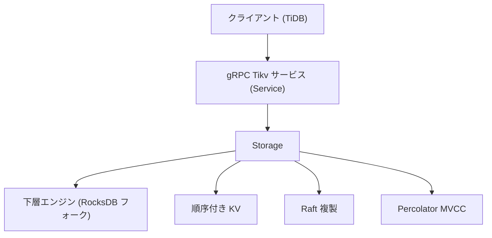

# 第1章 TiKV とは何か

> **本章で読むソース**
>
> - [`src/storage/mod.rs`](https://github.com/tikv/tikv/blob/v8.5.6/src/storage/mod.rs)
> - [`src/server/service/kv.rs`](https://github.com/tikv/tikv/blob/v8.5.6/src/server/service/kv.rs)
> - [`components/engine_traits/src/cf_defs.rs`](https://github.com/tikv/tikv/blob/v8.5.6/components/engine_traits/src/cf_defs.rs)

## この章の狙い

TiKV が TiDB エコシステムの中で何を担い、どの層に位置するかを示す。
TiKV の役割を構造体や gRPC サービスの定義に結び付け、後続の各部がどの論点を引き継ぐかを前方リンクで案内する。
導入章なので個々の機構には深入りせず、入口の所在と全体の構図を確定させることに絞る。

## 前提

TiDB エコシステムは、SQL を処理する計算層の TiDB、分散ストレージ層の TiKV、列指向の解析エンジン TiFlash、メタデータと時刻を司る PD から成る。
本書はこのうち TiKV を読む。
読者には Rust と分散システムの基礎を仮定する。
本章のコード引用はすべて tikv/tikv のタグ `v8.5.6` に固定する。

## TiKV の位置付け

**TiKV** は分散トランザクショナルキーバリューストアであり、TiDB エコシステムのストレージ層を担う。
TiDB が SQL を解析して実行計画を組み立てるのに対し、TiKV はその下でデータを順序付き KV として保持し、複数ノードに複製し、トランザクションのサーバ側を実装する。
この役割は3つの柱に分けて捉えられる。

第1の柱は**順序付き KV**である。
TiDB は行と索引をバイト列のキーへエンコードし、TiKV はそれをキー順に並んだ KV として保持する。
キーが順序付きなので、ある範囲のスキャンが連続したキー走査になり、SQL の範囲条件をそのまま範囲読み取りへ写せる。
キーのエンコード規則は TiDB 側で定義されるため、その詳細は TiDB 編の [KV エンコード](../../tidb/part04-txn/15-kv-encoding.md) に譲る。

第2の柱は **Raft による複製**である。
TiKV はキー空間を **Region** という連続したキー範囲の単位に分割し、各 Region を複数ノードに複製する。
1つの Region のレプリカ群は1つの Raft グループを形成し、Raft の合意によって複製の整合を保つ。
Region と Peer の関係、複製の進み方は第2章と第2部で扱う。

第3の柱は **MVCC と Percolator** である。
TiKV は **MVCC（多版同時実行制御）** によって、1つのキーに対し複数のバージョンを時刻付きで保持する。
その上に **Percolator** 方式の2相コミット（2PC）のサーバ側を実装し、複数 Region にまたがる書き込みを原子的にコミットさせる。
クライアント側の2PC 調整は TiDB が担い、そのプロトコルは TiDB 編の [Percolator](../../tidb/part04-txn/18-percolator-2pc-unistore.md) で扱う。
サーバ側のプリライトとコミットの実装は本書第3部で読む。

## リクエストの入口と Storage

TiKV へのリクエストは gRPC で届く。
gRPC の `Tikv` サービスを実装する `Service` が各 RPC を受け、トランザクション KV API を実装する `Storage` へ渡す。
`Storage` は読み取りと書き込みの API を持つ構造体であり、エンジン、トランザクションのスケジューラ、読み取り用スレッドプール、並行制御の管理を抱える。

[`src/storage/mod.rs L197-L206`](https://github.com/tikv/tikv/blob/v8.5.6/src/storage/mod.rs#L197-L206)

```rust
pub struct Storage<E: Engine, L: LockManager, F: KvFormat> {
    // TODO: Too many Arcs, would be slow when clone.
    engine: E,

    sched: TxnScheduler<E, L>,

    /// The thread pool used to run most read operations.
    read_pool: ReadPoolHandle,

    concurrency_manager: ConcurrencyManager,
```

型引数の `E: Engine` が下層のストレージエンジンを、`L: LockManager` がロック管理を、`F: KvFormat` がキーの形式を抽象化する。
読み取りは `read_pool` 上で実行し、書き込みは `sched`（`TxnScheduler`）へ送る。
この2系統に対応して、`Storage` の入口も読み取り系と書き込み系に分かれる。

読み取り系の代表は `Storage::get` である。
指定したキーの値を、`start_ts` という時刻のスナップショットから取得する。

[`src/storage/mod.rs L609-L619`](https://github.com/tikv/tikv/blob/v8.5.6/src/storage/mod.rs#L609-L619)

```rust
    pub fn get(
        &self,
        ctx: Context,
        key: Key,
        start_ts: TimeStamp,
    ) -> impl Future<Output = Result<(Option<Value>, KvGetStatistics)>> {
        self.get_entry(ctx, key, start_ts, false).map(|result| {
            let (entry, stats) = result?;
            Ok((entry.map(|e| e.value), stats))
        })
    }
```

引数に `start_ts` を取る点が、TiKV の読み取りが MVCC のスナップショット読み取りであることを示す。
読み取りは `start_ts` の時点で確定していたバージョンだけを見て、それ以降のコミットは見えない。
実体は `get_entry` が担い、その先でスナップショットからキーのバージョンを解決する。

書き込み系の代表は `sched_txn_command` である。
プリライトやコミットといったトランザクションコマンドを受け取り、スケジューラへ投入する。

[`src/storage/mod.rs L1807-L1811`](https://github.com/tikv/tikv/blob/v8.5.6/src/storage/mod.rs#L1807-L1811)

```rust
    pub fn sched_txn_command<T: StorageCallbackType>(
        &self,
        cmd: TypedCommand<T>,
        callback: Callback<T>,
    ) -> Result<()> {
```

書き込みは値を直接返さず、`callback` で結果を受け取る非同期の形を取る。
同じキーへの並行コマンドを直列化する必要があるため、書き込みはスケジューラを経由する。
スケジューラと直列化の機構は第5部で読む。

## gRPC サービスから Storage への接続

`Storage` を呼び出す入口は、gRPC の `Tikv` サービスである。
`Service` が `Tikv` トレイトを実装し、各 RPC のハンドラを定義する。

[`src/server/service/kv.rs L297-L306`](https://github.com/tikv/tikv/blob/v8.5.6/src/server/service/kv.rs#L297-L306)

```rust
impl<E: Engine, L: LockManager, F: KvFormat> Tikv for Service<E, L, F> {
    handle_request!(kv_get, future_get, GetRequest, GetResponse, has_time_detail);
    handle_request!(kv_scan, future_scan, ScanRequest, ScanResponse);
    handle_request!(
        kv_prewrite,
        future_prewrite,
        PrewriteRequest,
        PrewriteResponse,
        has_time_detail
    );
```

`Tikv` トレイトは `kvproto` の gRPC 生成コードに由来し、RPC ごとのメソッドを定める。
各ハンドラは `handle_request!` マクロで生成される。
このマクロは RPC のメソッドと、リクエストを処理する関数を対応付ける。
読み取りの `kv_get` は `future_get` を呼び、`future_get` が `Storage::get` から `get_entry` へ至る。
書き込みの `kv_prewrite` は `future_prewrite` を呼び、`future_prewrite` が `sched_txn_command` を呼ぶ。
gRPC から `Storage` までの接続の詳細は [gRPC サービスとリクエストの流れ](03-grpc-and-request-flow.md) で扱う。

全体の構図を図1に示す。



図1　gRPC から Storage を経て下層エンジンへ至る経路と、Storage が担う3つの柱。

## カラムファミリと下層エンジン

TiKV は KV を1つの空間に混ぜず、用途ごとの **CF（column family）** に分けて保持する。
CF の名前は定数で定義される。

[`components/engine_traits/src/cf_defs.rs L3-L7`](https://github.com/tikv/tikv/blob/v8.5.6/components/engine_traits/src/cf_defs.rs#L3-L7)

```rust
pub type CfName = &'static str;
pub const CF_DEFAULT: CfName = "default";
pub const CF_LOCK: CfName = "lock";
pub const CF_WRITE: CfName = "write";
pub const CF_RAFT: CfName = "raft";
```

MVCC のデータ配置は `default`、`lock`、`write` の3つに分かれる。
`default` がキーの値そのものを、`lock` がプリライトで置くロックを、`write` がコミットの記録を保持する。
`raft` は Raft が用いるデータに対応する。
この3 CF への配置と読み書きの規則は第1部と第3部で読む。

下層のストレージエンジンは `KvEngine` トレイト（`components/engine_traits/src/engine.rs`）で抽象化される。
`Storage` の型引数 `E: Engine` がこの抽象の上に乗り、具体的なエンジンの違いを `Storage` から隠す。
実装としては RocksDB を使う。
TiKV は上流の RocksDB をそのまま使わず、独自に拡張したフォークを下層に置く。
LSM-tree の機構そのものは [RocksDB 編](../../../rocksdb/README.md) に譲る。

## 分散設計の工夫

TiKV の中心となる設計上の選択は、キー空間を Region に分割し、各 Region を独立した Raft グループで複製する点にある。
Region ごとに別の Raft グループを持たせるのは、1台のノードに収まらない規模を水平にスケールさせ、かつ各 Region の内部では強整合を保つためである。
Region を分割の単位にすると、データ量が増えても Region を割って別のノードへ移せるので、容量と負荷を複数ノードへ広げられる。
それでいて、1つの Region のレプリカ群が1つの Raft グループを成すため、その Region 内の読み書きは Raft の合意の上で順序が確定し、強整合が保たれる。
分割の単位を合意の単位に一致させたことで、スケールと強整合が両立する。
Region の管理、分割、複製の進み方は第2章と第2部で順に読む。

## まとめ

TiKV は TiDB エコシステムのストレージ層を担う分散トランザクショナルキーバリューストアである。
順序付き KV、Raft による複製、Percolator 方式の MVCC という3つの柱で役割を整理できる。
リクエストは gRPC の `Tikv` サービスから入り、`handle_request!` が生成するハンドラを経て `Storage` へ渡る。
読み取りは `kv_get` から `future_get` を経て `Storage::get` と `get_entry` へ、書き込みは `kv_prewrite` から `future_prewrite` を経て `sched_txn_command` へ至る。
KV は `default`、`lock`、`write`、`raft` の CF に分かれ、下層は `KvEngine` トレイトで抽象化された RocksDB のフォークが受け持つ。

## 関連する章

- [アーキテクチャ、Store と Region と Peer](02-architecture.md)：Region と Peer の関係と全体構成を扱う。
- [gRPC サービスとリクエストの流れ](03-grpc-and-request-flow.md)：gRPC から `Storage` への接続を追う。
- [raftstore の全体像](../part02-raft/07-raftstore-overview.md)：Region を複製する Raft の層を読む。
- [MVCC のエンコード](../part03-txn/12-mvcc-encoding.md)：CF への MVCC データ配置を読む。
- [KV エンコード](../../tidb/part04-txn/15-kv-encoding.md)：TiDB が行と索引を KV へ変換する規則を扱う。
- [Percolator](../../tidb/part04-txn/18-percolator-2pc-unistore.md)：2相コミットのクライアント側を扱う。
