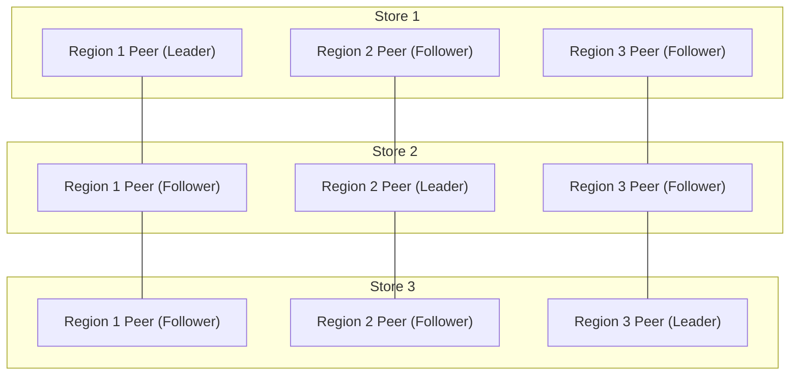
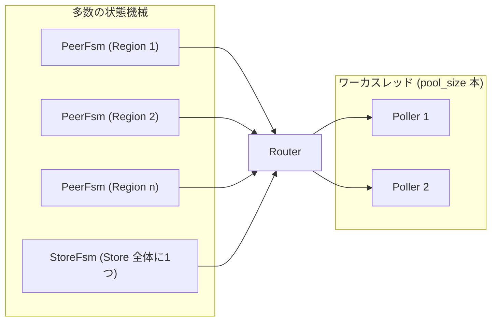

# 第2章 アーキテクチャ、Store と Region と Peer

> **本章で読むソース**
>
> - [`components/raftstore/src/store/peer.rs`](https://github.com/tikv/tikv/blob/v8.5.6/components/raftstore/src/store/peer.rs)
> - [`components/raftstore/src/store/fsm/peer.rs`](https://github.com/tikv/tikv/blob/v8.5.6/components/raftstore/src/store/fsm/peer.rs)
> - [`components/raftstore/src/store/fsm/store.rs`](https://github.com/tikv/tikv/blob/v8.5.6/components/raftstore/src/store/fsm/store.rs)
> - [`components/batch-system/src/fsm.rs`](https://github.com/tikv/tikv/blob/v8.5.6/components/batch-system/src/fsm.rs)
> - [`components/batch-system/src/batch.rs`](https://github.com/tikv/tikv/blob/v8.5.6/components/batch-system/src/batch.rs)

## この章の狙い

TiKV のクラスタを構成する Store、Region、Peer の3つの単位を定義し、それらが Raft グループとどう対応するかを構造体の定義に結び付けて示す。
第1章は1ノードの内部でリクエストが gRPC から `Storage` へ至る経路を追った。
本章はノードをまたいだ全体構成へ視点を移し、1つの Store に多数の Region が同居し、各 Region のレプリカがノードを越えて1つの Raft グループを作る構図を確定させる。
あわせて、多数の Raft グループを少数のスレッドで回す `batch-system` の機構を読む。

## 前提

TiKV はキー空間を範囲で区切った **Region** という単位で複製とスケジューリングを行う。
この設計の動機と、Region を独立した Raft グループで複製する狙いは第1章で扱った。
本章のコード引用はすべて tikv/tikv のタグ `v8.5.6` に固定する。
Region のレプリカ配置を司る PD は名前で参照し、その内部は[PD との連携](../part05-ops/21-pd-integration.md)で扱う。

## Store と Region と Peer

3つの単位は包含関係ではなく、役割の異なる3つの軸である。

**Store** は1つの TiKV ノードに対応する。
1つの Store は多数の Region を載せ、それぞれの複製の一部を保持する。

**Region** はキー空間を `[start_key, end_key)` の範囲で区切った単位である。
TiKV は連続したキー範囲を1つの Region に束ね、複製とスケジューリングをこの単位で行う。
データ量が増えると Region は範囲の途中で分割され、Region の数が増えていく。

**Peer** はある Region の1つのレプリカである。
1つの Region は複数の Store に Peer を持ち、それらの Peer 群が1つの **Raft グループ**を形成する。
Raft グループの中では1つの Peer が **Leader** となって読み書きの提案を受け、残りの Peer は **Follower** として複製を受け取る。

これらの軸の関係を図1に示す。
3つの Store が3つの Region を分担し、各 Region の Peer 群が Store をまたいで Raft グループを作る。



図1　3つの Store が Region 1 から Region 3 を分担し、同じ Region の Peer 群が Store をまたいで1つの Raft グループを作る。

## Peer 構造体と Raft グループ

Region の1つのレプリカは、`raftstore` の `Peer` 構造体として表される。
`Peer` は自分が属する Region の ID と、その Region の Raft 状態機械を抱える。

[`components/raftstore/src/store/peer.rs L711-L720`](https://github.com/tikv/tikv/blob/v8.5.6/components/raftstore/src/store/peer.rs#L711-L720)

```rust
    /// The ID of the Region which this Peer belongs to.
    region_id: u64,
    // TODO: remove it once panic!() support slog fields.
    /// Peer_tag, "[region <region_id>] <peer_id>"
    pub tag: String,
    /// The Peer meta information.
    pub peer: metapb::Peer,

    /// The Raft state machine of this Peer.
    pub raft_group: RawNode<PeerStorage<EK, ER>>,
```

`region_id` がこの Peer の属する Region を指す。
`raft_group` がこの Peer の Raft 状態機械であり、Raft ライブラリの `RawNode` を保持する。
ここが要点で、Raft グループはクラスタ全体に1つではなく、Peer ごとに1つ持つ。
1つの Store に多数の `Peer` が載れば、その Store は多数の `RawNode`、すなわち多数の Raft グループを同時に進めることになる。
`Peer` の状態機械の進め方、提案から適用までの流れは[Region と Peer](../part02-raft/08-region-and-peer.md)で読む。

## PeerFsm と StoreFsm

`Peer` を `batch-system` の状態機械として包むのが `PeerFsm` である。
`PeerFsm` は `Peer` を内側に持ち、メッセージの受信口とスケジューリング用の状態を加える。

[`components/raftstore/src/store/fsm/peer.rs L146-L151`](https://github.com/tikv/tikv/blob/v8.5.6/components/raftstore/src/store/fsm/peer.rs#L146-L151)

```rust
pub struct PeerFsm<EK, ER>
where
    EK: KvEngine,
    ER: RaftEngine,
{
    pub peer: Peer<EK, ER>,
```

`PeerFsm` は Region ごとに1つ存在する。
Store に載る Region が増えれば、その Store の `PeerFsm` も同じ数だけ増える。

これに対し、Store 全体に1つだけ存在するのが `StoreFsm` である。
Region の作成や分割の受け付け、定期処理など、特定の Region に属さない Store 全体の仕事を受け持つ。

[`components/raftstore/src/store/fsm/store.rs L758-L764`](https://github.com/tikv/tikv/blob/v8.5.6/components/raftstore/src/store/fsm/store.rs#L758-L764)

```rust
pub struct StoreFsm<EK>
where
    EK: KvEngine,
{
    store: Store,
    receiver: Receiver<StoreMsg<EK>>,
}
```

Store が抱える Region の一覧は、`StoreFsm` とは別に `StoreMeta` が保持する。
`StoreMeta` はこの Store 上の全 Region のメタ情報を集約する。

[`components/raftstore/src/store/fsm/store.rs L152-L157`](https://github.com/tikv/tikv/blob/v8.5.6/components/raftstore/src/store/fsm/store.rs#L152-L157)

```rust
pub struct StoreMeta {
    pub store_id: Option<u64>,
    /// region_end_key -> region_id
    pub region_ranges: BTreeMap<Vec<u8>, u64>,
    /// region_id -> region
    pub regions: HashMap<u64, Region>,
```

`regions` が Region ID から Region への対応を持つ。
`region_ranges` が Region の終端キーから Region ID への対応を `BTreeMap` で持つ。
`BTreeMap` はキー順に並ぶため、あるキーがどの Region に属するかを範囲検索で引ける。
キーから Region を引く操作は読み書きの経路で頻繁に起きるので、この索引が Store 上の Region 検索を支える。

## batch-system による多重化

ここまでで、1つの Store に多数の `PeerFsm` と1つの `StoreFsm` が同居することを見た。
これらの状態機械を、Region の数だけスレッドを立てて回すわけにはいかない。
Region が数万に達すれば、スレッド数も同じ規模になり、文脈切り替えの負荷でつぶれてしまう。
`batch-system` は、多数の状態機械を少数のスレッドで多重化することでこの問題を解く。

多重化される状態機械は、共通の `Fsm` トレイトを実装する。
`Fsm` は状態機械が受け取るメッセージの型と、停止したかどうかを問い合わせる口を定める。

[`components/batch-system/src/fsm.rs L41-L46`](https://github.com/tikv/tikv/blob/v8.5.6/components/batch-system/src/fsm.rs#L41-L46)

```rust
pub trait Fsm: Send + 'static {
    type Message: Send + ResourceMetered;

    const FSM_TYPE: FsmType;

    fn is_stopped(&self) -> bool;
```

`PeerFsm` と `StoreFsm` はどちらもこの `Fsm` を実装する。
`batch-system` は両者を、多数の通常 FSM（`PeerFsm`）と1つの制御 FSM（`StoreFsm`）として扱う。

状態機械の処理内容は、`Fsm` とは別の `PollHandler` トレイトに置かれる。
`PollHandler` は、準備のできた制御 FSM を処理する `handle_control` と、準備のできた通常 FSM を処理する `handle_normal` を定める。

[`components/batch-system/src/batch.rs L298-L314`](https://github.com/tikv/tikv/blob/v8.5.6/components/batch-system/src/batch.rs#L298-L314)

```rust
pub trait PollHandler<N, C>: Send + 'static {
    /// This function is called at the very beginning of every round.
    fn begin<F>(&mut self, _batch_size: usize, update_cfg: F)
    where
        for<'a> F: FnOnce(&'a Config);

    /// This function is called when the control FSM is ready.
    ///
    /// If `Some(len)` is returned, this function will not be called again until
    /// there are more than `len` pending messages in `control` FSM.
    ///
    /// If `None` is returned, this function will be called again with the same
    /// FSM `control` in the next round, unless it is stopped.
    fn handle_control(&mut self, control: &mut C) -> Option<usize>;

    /// This function is called when some normal FSMs are ready.
    fn handle_normal(&mut self, normal: &mut impl DerefMut<Target = N>) -> HandleResult;
```

状態機械とハンドラを束ねて回すのが `BatchSystem` である。
`BatchSystem` は通常 FSM の型 `N` と制御 FSM の型 `C` を型引数に取り、固定数のワーカスレッドを抱える。

[`components/batch-system/src/batch.rs L522-L528`](https://github.com/tikv/tikv/blob/v8.5.6/components/batch-system/src/batch.rs#L522-L528)

```rust
pub struct BatchSystem<N: Fsm, C: Fsm> {
    name_prefix: Option<String>,
    router: BatchRouter<N, C>,
    receiver: Receiver<FsmTypes<N, C>>,
    low_receiver: Receiver<FsmTypes<N, C>>,
    pool_size: usize,
    max_batch_size: usize,
```

`pool_size` がワーカスレッドの本数を決める。
`raftstore` はこの `BatchSystem` を `N = PeerFsm`、`C = StoreFsm` として具体化する。
各ワーカは、メッセージの届いた `PeerFsm` を `pool_size` 本のスレッドで分担して処理する。
Region が何万あっても、スレッド数は `pool_size` のまま変わらない。

処理の流れを図2に示す。



図2　多数の `PeerFsm` と1つの `StoreFsm` を、`Router` を介して `pool_size` 本のワーカスレッドへ振り分ける。

## 分散設計の工夫

TiKV の状態機械の運用には、機構の異なる2つの工夫が重なっている。

第1の工夫は、Raft グループを Region ごとに分けたことである。
クラスタ全体を1つの巨大な Raft グループで複製すると、すべての書き込みが1つの Leader を通り、合意の進行が直列化されて律速になる。
TiKV は Region ごとに小さな Raft グループを持たせ、各 Region の Leader を別々の Store に散らす。
これにより書き込みは Region 単位で別々の Leader に分かれ、複数の Store で並行に合意を進められる。
これが TiKV の **マルチラフト** であり、書き込みのスループットを Region の数とノードの数に応じて広げる。

第2の工夫は、その多数の Raft グループを `batch-system` で多重化したことである。
マルチラフトは Raft グループの数を増やすが、グループごとにスレッドを立てては、増えた分だけ文脈切り替えの負荷が跳ね返る。
`batch-system` は多数の `PeerFsm` を `pool_size` 本のワーカで回し、メッセージの届いた FSM だけをまとめて1回のバッチで処理する。
スレッド数を Region 数から切り離したことで、マルチラフトの並列性を、固定された少数のスレッドの上で受け止められる。

## まとめ

TiKV のクラスタは、ノードに対応する Store、キー範囲に対応する Region、Region のレプリカに対応する Peer の3軸で構成される。
1つの Store は多数の Region の Peer を載せ、同じ Region の Peer 群は Store をまたいで1つの Raft グループを作り、その中の1つが Leader、残りが Follower となる。
`Peer` 構造体は `region_id` と Raft 状態機械 `raft_group` を持ち、Raft グループは Peer ごとに1つ存在する。
`Peer` を包む `PeerFsm` は Region ごとに1つ、`StoreFsm` は Store に1つ存在し、Store 上の Region 一覧は `StoreMeta` の `region_ranges` と `regions` が保持する。
これら多数の状態機械は `batch-system` の `Fsm` と `PollHandler` を介し、`BatchSystem` が抱える `pool_size` 本のワーカスレッドで多重化される。

## 関連する章

- [TiKV とは何か](01-what-is-tikv.md)：Region に分割して Raft で複製する設計の動機を扱う。
- [raftstore の全体像](../part02-raft/07-raftstore-overview.md)：`batch-system` を含む Raft の層の全体構成を読む。
- [Region と Peer](../part02-raft/08-region-and-peer.md)：`Peer` の状態機械が提案から適用へ進む流れを読む。
- [PD との連携](../part05-ops/21-pd-integration.md)：PD が Region のレプリカ配置とバランスを司る仕組みを扱う。
