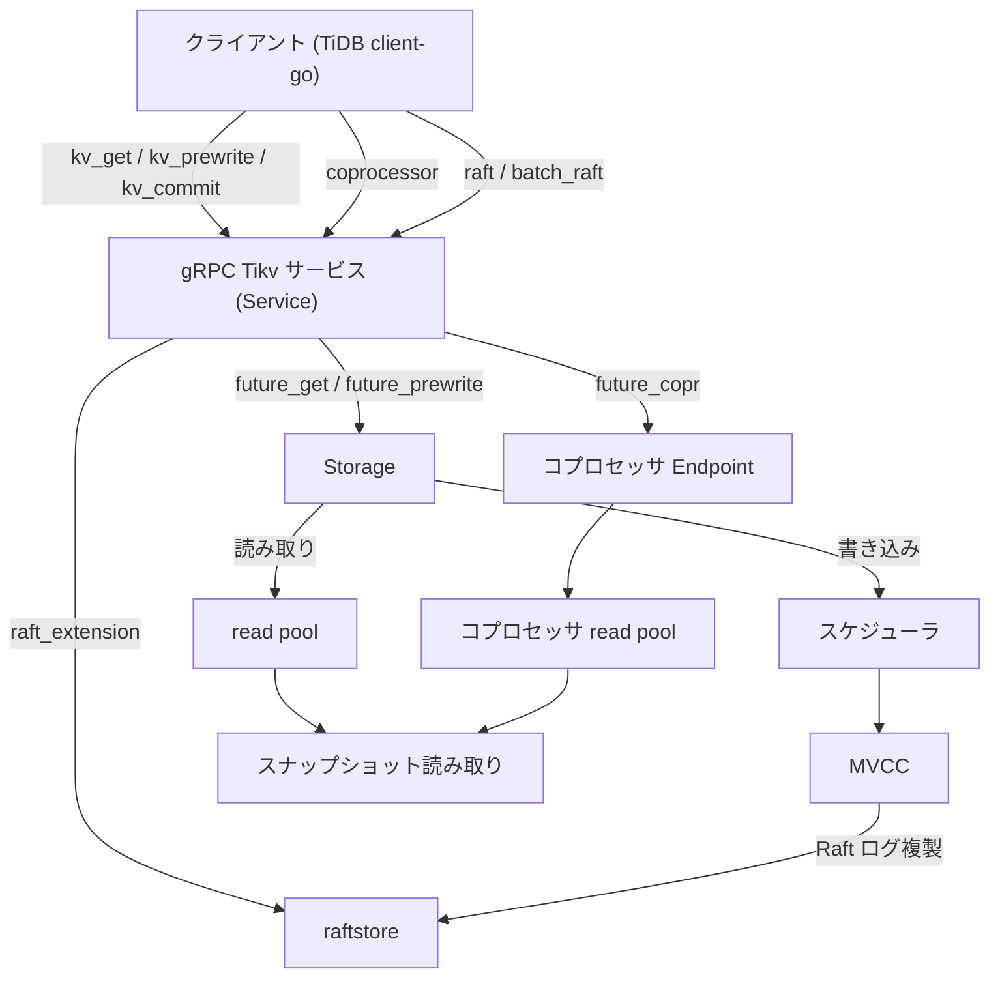

# 第3章 gRPC サービスとリクエストの流れ

> **本章で読むソース**
>
> - [`src/server/service/kv.rs`](https://github.com/tikv/tikv/blob/v8.5.6/src/server/service/kv.rs)
> - [`src/storage/mod.rs`](https://github.com/tikv/tikv/blob/v8.5.6/src/storage/mod.rs)
> - [`src/coprocessor/endpoint.rs`](https://github.com/tikv/tikv/blob/v8.5.6/src/coprocessor/endpoint.rs)

## この章の狙い

クライアントから届いたリクエストが、TiKV の中でどの経路へ振り分けられるかを俯瞰する。
TiDB の `client-go` が発行するトランザクション系の KV RPC、コプロセッサ要求、それに Region 間で交わされる Raft メッセージは、いずれも同じ gRPC の `Tikv` サービスを入口とする。
この入口から先で経路が3つに分かれることを、ハンドラの実体まで追って確定させる。
個々の経路の内部はそれぞれの章に譲り、本章は地図に徹する。

## 前提

第1章で、リクエストが gRPC の `Tikv` サービスから入り、トランザクション KV API を実装する `Storage` へ渡ることを確認した。
本章はその接続を、入口の `Service` から `Storage`、コプロセッサの `Endpoint`、`raftstore` の3方向へ展開する。
コード引用はすべて tikv/tikv のタグ `v8.5.6` に固定する。

## 入口は1つの Tikv サービス

TiKV のサーバ側 RPC は、`kvproto` が生成する `Tikv` トレイトに集約される。
`Service` 構造体がこのトレイトを実装し、すべての RPC ハンドラを1つの型に束ねる。
`Service` は経路ごとの処理先を、それぞれ別のフィールドとして抱える。

[`src/server/service/kv.rs L77-L89`](https://github.com/tikv/tikv/blob/v8.5.6/src/server/service/kv.rs#L77-L89)

```rust
/// Service handles the RPC messages for the `Tikv` service.
pub struct Service<E: Engine, L: LockManager, F: KvFormat> {
    cluster_id: u64,
    store_id: u64,
    /// Used to handle requests related to GC.
    // TODO: make it Some after GC is supported for v2.
    gc_worker: GcWorker<E>,
    // For handling KV requests.
    storage: Storage<E, L, F>,
    // For handling coprocessor requests.
    copr: Endpoint<E>,
    // For handling coprocessor v2 requests.
    copr_v2: coprocessor_v2::Endpoint,
```

`storage` がトランザクション系の KV RPC を、`copr` がコプロセッサ要求を受け持つ。
Raft メッセージには専用フィールドがなく、ハンドラが `storage` の保持するエンジンから取り出した `raft_extension` を経て `raftstore` へ流す。
入口は1つでも、この3つの処理先で経路が分かれる。

## トランザクション系 KV の経路

`kv_get` や `kv_prewrite` のようなトランザクション系 RPC のハンドラは、`handle_request!` マクロが一括で生成する。
マクロは RPC のメソッド名と、リクエストを処理する `future_*` 関数を対応付ける。

[`src/server/service/kv.rs L297-L306`](https://github.com/tikv/tikv/blob/v8.5.6/src/server/service/kv.rs#L297-L306)

```rust
impl<E: Engine, L: LockManager, F: KvFormat> Tikv for Service<E, L, F> {
    handle_request!(kv_get, future_get, GetRequest, GetResponse, has_time_detail);
    handle_request!(kv_scan, future_scan, ScanRequest, ScanResponse);
    handle_request!(
        kv_prewrite,
        future_prewrite,
        PrewriteRequest,
        PrewriteResponse,
        has_time_detail
    );
```

`handle_request!` の本体は、対応する `future_*` 関数を呼び、その `Future` を gRPC の非同期タスクとして `spawn` する。
処理が終われば結果を `sink` へ書き戻す。

[`src/server/service/kv.rs L256-L277`](https://github.com/tikv/tikv/blob/v8.5.6/src/server/service/kv.rs#L256-L277)

```rust
            let resp = $future_name(&self.storage, req);
            let task = async move {
                let resp = resp.await?;
                let elapsed = begin_instant.saturating_elapsed();
                set_total_time!(resp, elapsed, $time_detail);
                sink.success(resp).await?;
                GRPC_MSG_HISTOGRAM_STATIC
                    .$fn_name
                    .get(resource_group_priority)
                    .observe(elapsed.as_secs_f64());
                record_request_source_metrics(source, elapsed);
                ServerResult::Ok(())
            }
            .map_err(|e| {
                log_net_error!(e, "kv rpc failed";
                    "request" => stringify!($fn_name)
                );
                GRPC_MSG_FAIL_COUNTER.$fn_name.inc();
            })
            .map(|_|());

            ctx.spawn(task);
```

ここから先が、読み取りと書き込みで分かれる。

### 読み取りは read pool で実行する

読み取りの `kv_get` は `future_get` を呼ぶ。
`future_get` は `Storage::get_entry` を呼び、その `Future` を待って `GetResponse` を組み立てる。

[`src/server/service/kv.rs L1555-L1574`](https://github.com/tikv/tikv/blob/v8.5.6/src/server/service/kv.rs#L1555-L1574)

```rust
fn future_get<E: Engine, L: LockManager, F: KvFormat>(
    storage: &Storage<E, L, F>,
    mut req: GetRequest,
) -> impl Future<Output = ServerResult<GetResponse>> {
    let tracker = GLOBAL_TRACKERS.insert(Tracker::new(RequestInfo::new(
        req.get_context(),
        RequestType::KvGet,
        req.get_version(),
    )));
    set_tls_tracker_token(tracker);
    with_tls_tracker(|tracker| {
        tracker.metrics.grpc_req_size = req.compute_size() as u64;
    });
    let start = Instant::now();
    let v = storage.get_entry(
        req.take_context(),
        Key::from_raw(req.get_key()),
        req.get_version().into(),
        req.get_need_commit_ts(),
    );
```

`get_entry` は実際の読み取りを、gRPC スレッドではなく専用の **read pool** へ投入する。
`req.get_version()` を `start_ts` として渡し、その時刻のスナップショットから値を解決する。
スナップショットの取得と値の解決は、`read_pool_spawn_with_busy_check` に渡した非同期ブロックの中で動く。

[`src/storage/mod.rs L659-L700`](https://github.com/tikv/tikv/blob/v8.5.6/src/storage/mod.rs#L659-L700)

```rust
        self.read_pool_spawn_with_busy_check(
            busy_threshold,
            async move {
                let stage_scheduled_ts = Instant::now();
                tls_collect_query(
                    ctx.get_region_id(),
                    ctx.get_peer(),
                    key.as_encoded(),
                    key.as_encoded(),
                    false,
                    QueryKind::Get,
                );
                with_tls_tracker(|tracker| {
                    record_network_in_bytes(tracker.metrics.grpc_req_size);
                });

                KV_COMMAND_COUNTER_VEC_STATIC.get(CMD).inc();
                SCHED_COMMANDS_PRI_COUNTER_VEC_STATIC
                    .get(priority_tag)
                    .inc();

                deadline.check()?;

                Self::check_api_version(api_version, ctx.api_version, CMD, [key.as_encoded()])?;

                let command_duration = Instant::now();

                // The bypass_locks and access_locks set will be checked at most once.
                // `TsSet::vec` is more efficient here.
                let bypass_locks = TsSet::vec_from_u64s(ctx.take_resolved_locks());
                let access_locks = TsSet::vec_from_u64s(ctx.take_committed_locks());

                let snap_ctx = prepare_snap_ctx(
                    &ctx,
                    iter::once(&key),
                    start_ts,
                    &bypass_locks,
                    &concurrency_manager,
                    CMD,
                )?;
                let snapshot =
                    Self::with_tls_engine(|engine| Self::snapshot(engine, snap_ctx)).await?;
```

読み取りはスナップショットを取り、MVCC の規則に従って `start_ts` 時点のバージョンを返す。
スナップショットの仕組みと MVCC の解決は第3部と第4部で読む。

### 書き込みはスケジューラへ投入する

書き込みの `kv_prewrite` は `future_prewrite` を呼ぶ。
プリライトやコミットのような書き込み系ハンドラは、`txn_command_future!` マクロが生成する。
マクロの本体は、リクエストをトランザクションコマンドへ変換し、`Storage::sched_txn_command` へ送る。
結果は値を直接返さず、`paired_future_callback` が作る `cb` と `f` の対を通じてコールバックで受け取る。

[`src/server/service/kv.rs L2369-L2387`](https://github.com/tikv/tikv/blob/v8.5.6/src/server/service/kv.rs#L2369-L2387)

```rust
            let (cb, f) = paired_future_callback();
            let res = storage.sched_txn_command($req.into(), cb);

            async move {
                defer!{{
                    GLOBAL_TRACKERS.remove($tracker);
                }};
                let $v = match res {
                    Err(e) => Err(e),
                    Ok(_) => f.await?,
                };
                let mut $resp = $resp_ty::default();
                if let Some(err) = extract_region_error(&$v) {
                    $resp.set_region_error(err);
                } else {
                    $else_branch
                }
                Ok($resp)
            }
```

`sched_txn_command` は、キーのサイズや API バージョンを検査したうえで、コマンドをスケジューラの `run_cmd` へ渡す。

[`src/storage/mod.rs L1874-L1882`](https://github.com/tikv/tikv/blob/v8.5.6/src/storage/mod.rs#L1874-L1882)

```rust
        with_tls_tracker(|tracker| {
            tracker.req_info.start_ts = cmd.ts().into_inner();
            tracker.req_info.request_type = cmd.request_type();
        });

        fail_point!("storage_drop_message", |_| Ok(()));
        self.sched.run_cmd(cmd, T::callback(callback));

        Ok(())
```

スケジューラは同じキーへの並行コマンドを直列化し、その後で MVCC の処理を進める。
プリライトやコミットが書き込むデータは、最終的に `raftstore` の Raft ログ複製を経てから各レプリカへ適用される。
スケジューラと直列化の機構は第20章で、プリライトの中身は第13章で読む。

## コプロセッサの経路

コプロセッサ要求は、`kv_get` のような `handle_request!` 生成のハンドラを通らない。
`coprocessor` ハンドラが個別に定義され、`future_copr` を経て `Endpoint` へ渡る。

[`src/server/service/kv.rs L549-L569`](https://github.com/tikv/tikv/blob/v8.5.6/src/server/service/kv.rs#L549-L569)

```rust
    fn coprocessor(&mut self, ctx: RpcContext<'_>, req: Request, sink: UnarySink<Response>) {
        reject_if_cluster_id_mismatch!(req, self, ctx, sink);
        forward_unary!(self.proxy, coprocessor, ctx, req, sink);
        let source = req.get_context().get_request_source().to_owned();
        let resource_control_ctx = req.get_context().get_resource_control_context();
        let mut resource_group_priority = ResourcePriority::unknown;
        if let Some(resource_manager) = &self.resource_manager {
            resource_manager.consume_penalty(resource_control_ctx);
            resource_group_priority =
                ResourcePriority::from(resource_control_ctx.override_priority);
        }

        GRPC_RESOURCE_GROUP_COUNTER_VEC
            .with_label_values(&[
                resource_control_ctx.get_resource_group_name(),
                resource_control_ctx.get_resource_group_name(),
            ])
            .inc();

        let begin_instant = Instant::now();
        let future = future_copr(&self.copr, Some(ctx.peer()), req);
```

`future_copr` は `self.copr`、すなわち `Endpoint` の `parse_and_handle_unary_request` を呼ぶだけの薄いラッパーである。

[`src/server/service/kv.rs L2289-L2296`](https://github.com/tikv/tikv/blob/v8.5.6/src/server/service/kv.rs#L2289-L2296)

```rust
fn future_copr<E: Engine>(
    copr: &Endpoint<E>,
    peer: Option<String>,
    req: Request,
) -> impl Future<Output = ServerResult<MemoryTraceGuard<Response>>> {
    let ret = copr.parse_and_handle_unary_request(req, peer);
    async move { Ok(ret.await) }
}
```

`Endpoint` は、コプロセッサ要求を走らせる専用の read pool を抱える。

[`src/coprocessor/endpoint.rs L70-L75`](https://github.com/tikv/tikv/blob/v8.5.6/src/coprocessor/endpoint.rs#L70-L75)

```rust
pub struct Endpoint<E: Engine> {
    /// The thread pool to run Coprocessor requests.
    read_pool: ReadPoolHandle,

    /// The concurrency limiter of the coprocessor.
    semaphore: Option<Arc<Semaphore>>,
```

`parse_and_handle_unary_request` は、要求をパースしてメモリロックを検査したのち、`handle_unary_request` を呼ぶ。
`handle_unary_request` は、構築したハンドラの `Future` を `read_pool_spawn_with_memory_quota_check` で read pool へ投入する。

[`src/coprocessor/endpoint.rs L593-L607`](https://github.com/tikv/tikv/blob/v8.5.6/src/coprocessor/endpoint.rs#L593-L607)

```rust
        let (tx, rx) = oneshot::channel();
        let future =
            Self::handle_unary_request_impl(self.semaphore.clone(), tracker, r.handler_builder)
                .in_resource_metering_tag(resource_tag)
                .map(move |res| {
                    let _ = tx.send(res);
                });
        let res = self.read_pool_spawn_with_memory_quota_check(
            allocated_bytes,
            future,
            priority,
            task_id,
            metadata,
            resource_limiter,
        );
```

コプロセッサは TiDB から押し下げられたフィルタや集約を、TiKV のローカルなスナップショット上で評価する。
これにより、行を1件ずつ TiDB へ転送せずに済み、ネットワーク転送と TiDB 側の処理を減らせる。
押し下げの中身と式評価は第18章で、TiDB 側で要求を組み立てる側は TiDB 編の [分散読み取り](../../tidb/part03-executor/13-distributed-read.md) で扱う。

## Raft メッセージの経路

`raft` ハンドラは、Region 間で交わされる Raft メッセージのストリームを受ける。
これはクライアントからの要求ではなく、別の TiKV ノードから届く複製のためのメッセージである。
ハンドラはエンジンから `raft_extension` を取り出し、受け取った各メッセージを `handle_raft_message` で `raftstore` へ流す。

[`src/server/service/kv.rs L757-L778`](https://github.com/tikv/tikv/blob/v8.5.6/src/server/service/kv.rs#L757-L778)

```rust
        let store_id = self.store_id;
        let ch = self.storage.get_engine().raft_extension();
        let reject_messages_on_memory_ratio = self.reject_messages_on_memory_ratio;

        let res = async move {
            let mut stream = stream.map_err(Error::from);
            while let Some(msg) = stream.try_next().await? {
                RAFT_MESSAGE_RECV_COUNTER.inc();
                let reject = needs_reject_raft_append(reject_messages_on_memory_ratio);
                if let Err(err @ RaftStoreError::StoreNotMatch { .. }) =
                    Self::handle_raft_message(store_id, &ch, msg, reject)
                {
                    // Return an error here will break the connection, only do that for
                    // `StoreNotMatch` to let tikv to resolve a correct address from PD
                    return Err(Error::from(err));
                }
                if let Some(ref counter) = message_received {
                    counter.inc();
                }
            }
            Ok::<(), Error>(())
        };
```

Raft メッセージは `Storage` も `Endpoint` も経由せず、`raftstore` の層へ直接渡る。
`raftstore` の全体像は第7章で読む。

## 振り分けの全体像

3つの経路を図1にまとめる。



図1　gRPC の `Tikv` サービスから3経路への振り分け。

トランザクション系は `Storage` へ入り、読み取りは read pool、書き込みはスケジューラと MVCC を経て `raftstore` の Raft ログ複製へ至る。
コプロセッサ系は `Endpoint` の専用 read pool へ入る。
Raft メッセージは `raftstore` へ直接届く。

## 経路を分けることによる隔離

3経路への振り分けには、CPU バウンドな処理を gRPC スレッドから隔離する狙いがある。

書き込みは、Raft のログ複製を経てから各レプリカへ適用する。
クライアントへ応答を返す前に過半数のレプリカへログを複製するため、応答は値ではなくコールバックで非同期に受け取る形を取る。
gRPC スレッドはコマンドをスケジューラへ渡したら手を離し、複製の完了を待たない。

読み取りとコプロセッサは、それぞれ別の read pool で実行する。
スナップショットを読んで MVCC を解決する読み取りも、フィルタや集約を評価するコプロセッサも、CPU を多く使う。
これを gRPC の受信スレッドで直接走らせると、受信処理が詰まって他の RPC の取り込みが遅れる。
専用スレッドプールへ逃がすことで、重い処理が受信を止めない。

さらにコプロセッサの read pool は、読み取りの read pool とも別である。
用途の違うワークロードを別プールに置くことで、コプロセッサの重いスキャンが点取得の応答を巻き込んで遅らせる事態を避けられる。
プールが詰まりかけたときは、`parse_and_handle_unary_request` がキュー投入の前に `check_busy_threshold` で混雑を検査し、gRPC スレッドの段階で `server_is_busy` を返してキュー待ちを避ける。

## まとめ

クライアントのリクエストは、すべて gRPC の `Tikv` サービスを入口とし、そこで3経路へ振り分けられる。
トランザクション系 KV RPC は `handle_request!` 生成のハンドラから `future_*` 関数を経て `Storage` へ入り、読み取りは read pool、書き込みはスケジューラと MVCC を経て `raftstore` へ至る。
コプロセッサ要求は `coprocessor` ハンドラから `future_copr` を経て `Endpoint` の専用 read pool へ入る。
Raft メッセージは `raft` ハンドラから `raft_extension` を経て `raftstore` へ直接渡る。
読み取りとコプロセッサを専用スレッドプールへ隔離し、書き込みを Raft ログ複製を経た非同期適用にすることで、CPU バウンドな処理が gRPC の受信を止めない構造になっている。

## 関連する章

- [TiKV とは何か](01-what-is-tikv.md)：gRPC サービスと `Storage` の関係を導入する。
- [ストレージエンジン抽象（engine_traits）](../part01-engine/04-engine-traits.md)：read pool が読むスナップショットの抽象を扱う。
- [raftstore の全体像](../part02-raft/07-raftstore-overview.md)：書き込みと Raft メッセージが流れ込む層を読む。
- [Prewrite（第1相）](../part03-txn/13-prewrite.md)：書き込み経路で動くプリライトの中身を扱う。
- [コプロセッサ](../part04-coprocessor/18-coprocessor.md)：押し下げと式評価を扱う。
- [スケジューラと latch](../part05-ops/20-scheduler-and-latch.md)：書き込みコマンドの直列化を扱う。
- [分散読み取り](../../tidb/part03-executor/13-distributed-read.md)：TiDB がコプロセッサ要求を組み立てる側を扱う。
