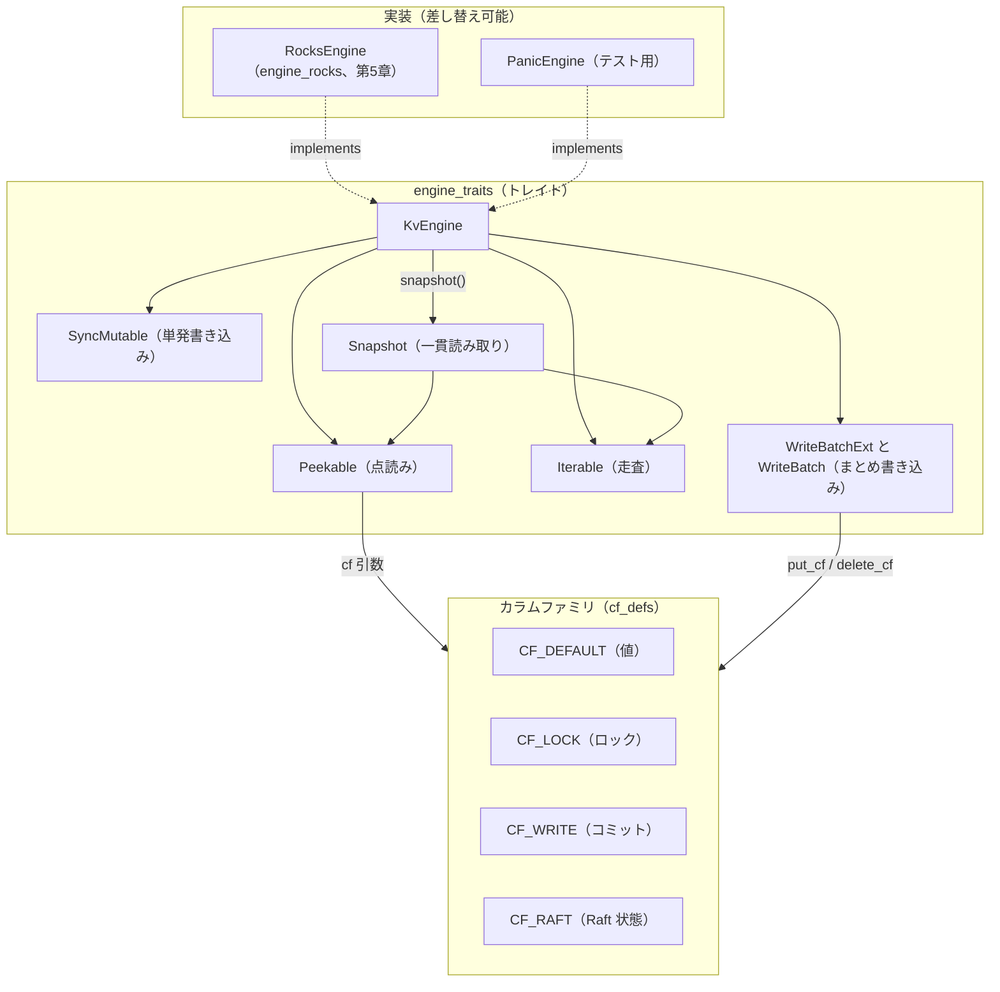

# 第4章 ストレージエンジン抽象（engine_traits）

> **本章で読むソース**
>
> - [`components/engine_traits/src/lib.rs`](https://github.com/tikv/tikv/blob/v8.5.6/components/engine_traits/src/lib.rs)
> - [`components/engine_traits/src/engine.rs`](https://github.com/tikv/tikv/blob/v8.5.6/components/engine_traits/src/engine.rs)
> - [`components/engine_traits/src/peekable.rs`](https://github.com/tikv/tikv/blob/v8.5.6/components/engine_traits/src/peekable.rs)
> - [`components/engine_traits/src/iterable.rs`](https://github.com/tikv/tikv/blob/v8.5.6/components/engine_traits/src/iterable.rs)
> - [`components/engine_traits/src/mutable.rs`](https://github.com/tikv/tikv/blob/v8.5.6/components/engine_traits/src/mutable.rs)
> - [`components/engine_traits/src/write_batch.rs`](https://github.com/tikv/tikv/blob/v8.5.6/components/engine_traits/src/write_batch.rs)
> - [`components/engine_traits/src/snapshot.rs`](https://github.com/tikv/tikv/blob/v8.5.6/components/engine_traits/src/snapshot.rs)
> - [`components/engine_traits/src/cf_defs.rs`](https://github.com/tikv/tikv/blob/v8.5.6/components/engine_traits/src/cf_defs.rs)

## この章の狙い

TiKV が永続化に使う具体的なストレージエンジンは RocksDB だが、上位のコードは RocksDB の型を直接は呼ばない。
あいだに `engine_traits` というトレイトだけのクレートが挟まり、上位のコードはこのトレイトを境界として書かれている。
本章は、その中心トレイト `KvEngine` と、読み書きの口にあたる `Peekable`、`Iterable`、`SyncMutable`、`WriteBatch`、`Snapshot` を実ソースから読み、何のためにエンジンを抽象するのかを確定させる。
あわせて、TiKV のデータを4つのカラムファミリへ振り分ける定数 `CF_DEFAULT` から `CF_RAFT` までを押さえ、これらが第12章で扱う Percolator のロックと書き込みの格納先につながることを述べる。

## 前提

第3章で、トランザクション系の KV RPC が `Storage` へ渡り、その先でエンジンからスナップショットを取って読むことを確認した。
そこで `Engine` や `Snapshot` と呼んでいた境界の実体が、本章で読む `engine_traits` のトレイト群である。
コード引用はすべて tikv/tikv のタグ `v8.5.6` に固定する。
下層の RocksDB そのものの仕組み（LSM-tree、SST、カラムファミリの実装）は、本書ではなく既存の RocksDB 編へ譲る。
TiKV はそこからフォークした RocksDB を `engine_rocks` 経由で使う。

## なぜトレイトで抽象するのか

`engine_traits` クレートの冒頭コメントが、このクレートの目的をそのまま述べている。
RocksDB 以外のエンジンを将来差し替えられるよう、TiKV が永続化に必要とする機能をすべて抽象する試みであり、しかもこのクレート自身は RocksDB へ依存してはならないと明記する。

[`components/engine_traits/src/lib.rs L3-L10`](https://github.com/tikv/tikv/blob/v8.5.6/components/engine_traits/src/lib.rs#L3-L10)

```rust
//! A generic TiKV storage engine
//!
//! This is a work-in-progress attempt to abstract all the features needed by
//! TiKV to persist its data, so that storage engines other than RocksDB may be
//! added to TiKV in the future.
//!
//! This crate **must not have any transitive dependencies on RocksDB**. The
//! RocksDB implementation is in the `engine_rocks` crate.
```

依存を持ち込まない制約には実利がある。
上位のコードがトレイトの上だけで書かれていれば、RocksDB 実装の `engine_rocks`（第5章）を、テスト用の `engine_panic` や別エンジンに差し替えられる。
`engine_panic` は全メソッドが `panic!()` を返すだけの空実装で、エンジンを実際に触らないコードの単体テストで型を満たすために使う。

[`components/engine_panic/src/engine.rs L10-L18`](https://github.com/tikv/tikv/blob/v8.5.6/components/engine_panic/src/engine.rs#L10-L18)

```rust
#[derive(Clone, Debug)]
pub struct PanicEngine;

impl KvEngine for PanicEngine {
    type Snapshot = PanicSnapshot;

    fn snapshot(&self) -> Self::Snapshot {
        panic!()
    }
```

このように同じ `KvEngine` を複数の型が実装するため、上位のコードは具体型ではなくジェネリックなエンジン型を境界にとって書ける。

## 中心トレイト KvEngine

`KvEngine` は、このクレートが定義する主役の型である。
注目すべきは、`KvEngine` 自身がほとんどメソッドを持たず、機能ごとに分けた多数のトレイトを継承（スーパートレイト）して束ねている点にある。

[`components/engine_traits/src/engine.rs L12-L37`](https://github.com/tikv/tikv/blob/v8.5.6/components/engine_traits/src/engine.rs#L12-L37)

```rust
/// A TiKV key-value store
pub trait KvEngine:
    Peekable
    + SyncMutable
    + Iterable
    + WriteBatchExt
    + DbOptionsExt
    + CfNamesExt
    + CfOptionsExt
    + ImportExt
    + SstExt
    + CompactExt
    + RangePropertiesExt
    + MvccPropertiesExt
    + TtlPropertiesExt
    + TablePropertiesExt
    + PerfContextExt
    + MiscExt
    + Send
    + Sync
    + Clone
    + Debug
    + Unpin
    + Checkpointable
    + 'static
{
```

スーパートレイトの並びのうち、データの読み書きに直結するのは先頭の4つである。
`Peekable` が点読み、`Iterable` が走査、`SyncMutable` が単発の書き込み、`WriteBatchExt` が書き込みをまとめる口を与える。
`KvEngine` 本体が直接定義するのは、一貫した読み取りビューを切り出す `snapshot` と、書き込みをディスクへ同期する `sync` などわずかである。

[`components/engine_traits/src/engine.rs L38-L45`](https://github.com/tikv/tikv/blob/v8.5.6/components/engine_traits/src/engine.rs#L38-L45)

```rust
    /// A consistent read-only snapshot of the database
    type Snapshot: Snapshot;

    /// Create a snapshot
    fn snapshot(&self) -> Self::Snapshot;

    /// Syncs any writes to disk
    fn sync(&self) -> Result<()>;
```

`Snapshot` は関連型として宣言され、実装側が自分のスナップショット型を結び付ける。
RocksDB 実装の `RocksEngine` なら `type Snapshot = RocksSnapshot` を、`PanicEngine` なら `PanicSnapshot` を割り当てる。
これにより、`KvEngine` を境界にとったコードは具体的なスナップショット型を知らずに `snapshot()` を呼べる。

## 読み取りの口、Peekable と Iterable

読み取りには2つの口がある。
1つ目の `Peekable` は、キーを1つ渡して値を引く点読みである。
既定のカラムファミリから引く `get_value` と、カラムファミリを名前で指定する `get_value_cf` を持ち、キーが無ければ `None` を返す。

[`components/engine_traits/src/peekable.rs L38-L49`](https://github.com/tikv/tikv/blob/v8.5.6/components/engine_traits/src/peekable.rs#L38-L49)

```rust
    fn get_value(&self, key: &[u8]) -> Result<Option<Self::DbVector>> {
        self.get_value_opt(&ReadOptions::default(), key)
    }

    /// Read a value for a key from a given column family.
    ///
    /// Uses the default options.
    ///
    /// Returns `None` if the key does not exist.
    fn get_value_cf(&self, cf: &str, key: &[u8]) -> Result<Option<Self::DbVector>> {
        self.get_value_cf_opt(&ReadOptions::default(), cf, key)
    }
```

カラムファミリの指定が `&str` 1個で済む点に、抽象の設計が表れている。
カラムファミリはエンジンに固有の概念ではなく、名前という共通の語彙でトレイト境界を越える。

2つ目の `Iterable` は、範囲を順に走査する口である。
カラムファミリを指定してイテレータを作る `iterator_opt` を必須メソッドとし、その上に範囲走査の `scan` を既定実装として載せる。

[`components/engine_traits/src/iterable.rs L133-L157`](https://github.com/tikv/tikv/blob/v8.5.6/components/engine_traits/src/iterable.rs#L133-L157)

```rust
pub trait Iterable {
    type Iterator: Iterator + MetricsExt;

    fn iterator_opt(&self, cf: &str, opts: IterOptions) -> Result<Self::Iterator>;

    fn iterator(&self, cf: &str) -> Result<Self::Iterator> {
        self.iterator_opt(cf, IterOptions::default())
    }

    /// scan the key between start_key(inclusive) and end_key(exclusive),
    /// the upper bound is omitted if end_key is empty
    fn scan<F>(
        &self,
        cf: &str,
        start_key: &[u8],
        end_key: &[u8],
        fill_cache: bool,
        f: F,
    ) -> Result<()>
    where
        F: FnMut(&[u8], &[u8]) -> Result<bool>,
    {
        let iter_opt = iter_option(start_key, end_key, fill_cache);
        scan_impl(self.iterator_opt(cf, iter_opt)?, start_key, f)
    }
```

このイテレータは、エンジン上で走査するときも一貫したビューの上を動く。
モジュールのコメントは、スナップショットを作らずにエンジンを直接走査する場合でも、暗黙にスナップショットを取ってからその上を走るかのように振る舞うと述べている。

## 書き込みの口、SyncMutable と WriteBatch

書き込みにも2つの口がある。
単発の書き込みは `SyncMutable` が受け持つ。
`put` と `delete`、それぞれのカラムファミリ版、そして範囲削除の `delete_range` を与え、いずれも1操作ずつエンジンへ反映する。

[`components/engine_traits/src/mutable.rs L5-L16`](https://github.com/tikv/tikv/blob/v8.5.6/components/engine_traits/src/mutable.rs#L5-L16)

```rust
pub trait SyncMutable {
    fn put(&self, key: &[u8], value: &[u8]) -> Result<()>;

    fn put_cf(&self, cf: &str, key: &[u8], value: &[u8]) -> Result<()>;

    fn delete(&self, key: &[u8]) -> Result<()>;

    fn delete_cf(&self, cf: &str, key: &[u8]) -> Result<()>;

    fn delete_range(&self, begin_key: &[u8], end_key: &[u8]) -> Result<()>;

    fn delete_range_cf(&self, cf: &str, begin_key: &[u8], end_key: &[u8]) -> Result<()>;
```

複数の書き込みをまとめて1度に反映する口が `WriteBatch` である。
まず `WriteBatchExt` がエンジンに「バッチを作る能力」を与える。
`write_batch` でバッチを作り、関連型 `WriteBatch` がそのバッチの型になる。

[`components/engine_traits/src/write_batch.rs L5-L20`](https://github.com/tikv/tikv/blob/v8.5.6/components/engine_traits/src/write_batch.rs#L5-L20)

```rust
/// Engines that can create write batches
pub trait WriteBatchExt: Sized {
    type WriteBatch: WriteBatch;

    /// The number of puts/deletes made to a write batch before the batch should
    /// be committed with `write`. More entries than this will cause
    /// `should_write_to_engine` to return true.
    ///
    /// In practice it seems that exceeding this number of entries is possible
    /// and does not result in an error. It isn't clear the consequence of
    /// exceeding this limit.
    const WRITE_BATCH_MAX_KEYS: usize;

    fn write_batch(&self) -> Self::WriteBatch;
    fn write_batch_with_cap(&self, cap: usize) -> Self::WriteBatch;
}
```

作ったバッチは `Mutable` を継承しており、`put` や `delete` をバッチ内部のバッファへ積んでいく。
積み終えたら `write` を呼ぶと、ためた書き込みが1度にエンジンへ反映される。
ここが本章で挙げる機構の工夫である。
`WriteBatch` のコメントは、バッチがアトミックであり、ディスクへ書かれた時点でその全効果が、システム内の他の書き込みすべてより前か後ろのどちらかにまとまって見えると述べている。

[`components/engine_traits/src/write_batch.rs L56-L67`](https://github.com/tikv/tikv/blob/v8.5.6/components/engine_traits/src/write_batch.rs#L56-L67)

```rust
/// Batches of multiple writes that are committed atomically
///
/// Each write batch consists of a series of commands: put, delete
/// delete_range, and their column-family-specific equivalents.
///
/// Because write batches are atomic, once written to disk all their effects are
/// visible as if all other writes in the system were written either before or
/// after the batch. This includes range deletes.
///
/// The exact strategy used by WriteBatch is up to the implementation.
/// RocksDB though _seems_ to serialize the writes to an in-memory buffer,
/// and then write the whole serialized batch to disk at once.
```

このアトミック性が効くのは、Raft ログを適用するときである。
1つのログエントリが複数のキー（たとえば異なるカラムファミリのロックと値）を書き換えるとき、それらを別々の `put` で反映すると、途中でクラッシュした場合に半端な状態が残りうる。
1つの `WriteBatch` にまとめて `write` すれば、全部反映されるか何も反映されないかのどちらかになり、適用後の状態が常に整合する。
書き込みをまとめる口をトレイト側で共通化したことで、上位のコードはエンジンを問わずこのアトミックな反映を使える。

`WriteBatch` はさらに、`set_save_point` でセーブポイントを積み、`rollback_to_save_point` で直近のセーブポイント以降の操作だけを巻き戻す口を持つ。
バッチを組み立てる途中で一部の操作を取り消せるため、適用ロジックが条件に応じて書き込みを差し替えられる。

## スナップショットによる一貫した読み取り

`Snapshot` は、データベースの一貫した読み取り専用ビューである。
トレイトとしての本体は短く、要点は `where` 節のトレイト境界にある。
`Snapshot` は `Peekable` と `Iterable` を満たすことが要求され、点読みと走査の両方をビューの上で提供する。

[`components/engine_traits/src/snapshot.rs L11-L21`](https://github.com/tikv/tikv/blob/v8.5.6/components/engine_traits/src/snapshot.rs#L11-L21)

```rust
pub trait Snapshot
where
    Self:
        'static + Peekable + Iterable + CfNamesExt + SnapshotMiscExt + Send + Sync + Sized + Debug,
{
    /// Whether the snapshot acquired hit the in memory engine. It always
    /// returns false if the in memory engine is disabled.
    fn in_memory_engine_hit(&self) -> bool {
        false
    }
}
```

`KvEngine::snapshot()` でスナップショットを取ると、以後その上での読み取りは、取得時点のデータベースの状態を一貫して見る。
コプロセッサやトランザクションの読み取りは、まずこのスナップショットを取り、その上で点読みと走査を行う。
読み取りの口（`Peekable` と `Iterable`）をエンジンとスナップショットで共通にしてあるため、同じ読み取りコードがエンジン直読みとスナップショット読みのどちらにも使える。

## カラムファミリ、データの4つの格納先

TiKV は、すべてのキーと値をいずれかのカラムファミリに置く。
カラムファミリは独立したデータストアのように扱える区画で、`cf_defs.rs` が4つの名前を定数として固定する。

[`components/engine_traits/src/cf_defs.rs L3-L12`](https://github.com/tikv/tikv/blob/v8.5.6/components/engine_traits/src/cf_defs.rs#L3-L12)

```rust
pub type CfName = &'static str;
pub const CF_DEFAULT: CfName = "default";
pub const CF_LOCK: CfName = "lock";
pub const CF_WRITE: CfName = "write";
pub const CF_RAFT: CfName = "raft";
// Cfs that should be very large generally.
pub const LARGE_CFS: &[CfName] = &[CF_DEFAULT, CF_LOCK, CF_WRITE];
pub const ALL_CFS: &[CfName] = &[CF_DEFAULT, CF_LOCK, CF_WRITE, CF_RAFT];
pub const DATA_CFS: &[CfName] = &[CF_DEFAULT, CF_LOCK, CF_WRITE];
pub const DATA_CFS_LEN: usize = DATA_CFS.len();
```

4つの役割は次のとおりである。

- **`CF_DEFAULT`**：行の値そのものを置く既定のカラムファミリ。
- **`CF_LOCK`**：Percolator のプリライトで掴むトランザクションのロックを置く。
- **`CF_WRITE`**：コミット済みのバージョン情報（コミットタイムスタンプとそのバージョンの種別）を置く。
- **`CF_RAFT`**：Region ごとの Raft 適用状態などを置く。

このうち `CF_DEFAULT`、`CF_LOCK`、`CF_WRITE` の3つを `DATA_CFS` とまとめ、データ本体のカラムファミリとして扱う。
`CF_LOCK` と `CF_WRITE` の役割分担は、第12章で扱う Percolator の MVCC エンコードの土台になる。
プリライトはロックを `CF_LOCK` に書き、コミットはそのロックを消して `CF_WRITE` にコミットレコードを書く、という流れにそのまま対応する。

名前を定数にそろえておく利点は、文字列リテラルの取り違えを避けられることだけではない。
`name_to_cf` や `is_data_cf` のような補助関数が、空文字列を `CF_DEFAULT` とみなすなどの正規化を1か所に集約できる。

[`components/engine_traits/src/cf_defs.rs L23-L32`](https://github.com/tikv/tikv/blob/v8.5.6/components/engine_traits/src/cf_defs.rs#L23-L32)

```rust
pub fn name_to_cf(name: &str) -> Option<CfName> {
    if name.is_empty() {
        return Some(CF_DEFAULT);
    }
    ALL_CFS.iter().copied().find(|c| name == *c)
}

pub fn is_data_cf(cf: &str) -> bool {
    DATA_CFS.iter().any(|c| *c == cf)
}
```

## 実装との関係

ここまでのトレイトを実際に満たすのが、RocksDB 実装の `RocksEngine` である（詳しくは第5章）。
`RocksEngine` は内部に `Arc<DB>` を抱え、`KvEngine` を実装して関連型 `Snapshot` を `RocksSnapshot` に結び付ける。

[`components/engine_rocks/src/engine.rs L187-L192`](https://github.com/tikv/tikv/blob/v8.5.6/components/engine_rocks/src/engine.rs#L187-L192)

```rust
impl KvEngine for RocksEngine {
    type Snapshot = RocksSnapshot;

    fn snapshot(&self) -> RocksSnapshot {
        RocksSnapshot::new(self.db.clone())
    }
```

同じトレイトを `PanicEngine` も実装するため、上位のコードは `RocksEngine` か `PanicEngine` かを意識せず、`KvEngine` を境界にとって書ける。
本番では `RocksEngine`、テストでは `PanicEngine`、と差し替えられるのは、読み書きの口をすべてトレイト側へ寄せたからである。

下の図に、`KvEngine` が継承する読み書きの口、4つのカラムファミリの並び、そして実装との関係をまとめる。



## まとめ

`engine_traits` は、TiKV を具体的なストレージエンジンから切り離すトレイトだけのクレートである。
中心の `KvEngine` は、点読みの `Peekable`、走査の `Iterable`、単発書き込みの `SyncMutable`、まとめ書き込みの `WriteBatchExt` を継承して読み書きの口を束ね、`snapshot()` で一貫した読み取りビュー `Snapshot` を切り出す。
書き込みを `WriteBatch` にためて1度に反映する口を共通化したことで、上位のコードはエンジンを問わずアトミックな反映を使える。
データは `CF_DEFAULT` から `CF_RAFT` までの4つのカラムファミリに振り分けられ、`CF_LOCK` と `CF_WRITE` の役割分担が Percolator のロックとコミットの格納先につながる。
クレートが RocksDB へ依存しないことで、本番の `RocksEngine` とテスト用の `PanicEngine` を同じ境界で差し替えられる。

## 関連する章

- [第3章 gRPC サービスとリクエストの流れ](../part00-overview/03-grpc-and-request-flow.md)：本章のトレイトが、リクエスト経路でいう `Engine` と `Snapshot` の実体である。
- [第5章 RocksDB 統合とカラムファミリ](05-engine-rocks-and-cf.md)：`KvEngine` を実装する `RocksEngine` と、カラムファミリの実体を読む。
- [第12章 MVCC のエンコード](../part03-txn/12-mvcc-encoding.md)：`CF_LOCK` と `CF_WRITE` に何をどうエンコードして置くかを読む。
