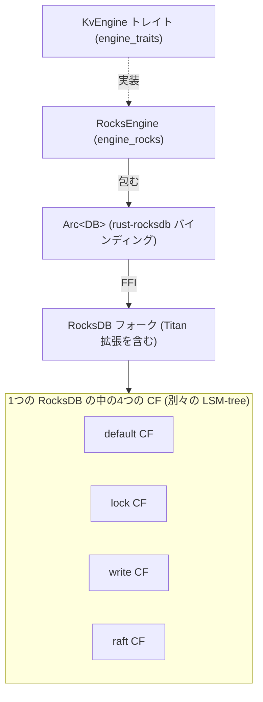

# 第5章 RocksDB 統合とカラムファミリ

> **本章で読むソース**
>
> - [`components/engine_rocks/src/engine.rs`](https://github.com/tikv/tikv/blob/v8.5.6/components/engine_rocks/src/engine.rs)
> - [`components/engine_rocks/src/write_batch.rs`](https://github.com/tikv/tikv/blob/v8.5.6/components/engine_rocks/src/write_batch.rs)
> - [`components/engine_rocks/src/snapshot.rs`](https://github.com/tikv/tikv/blob/v8.5.6/components/engine_rocks/src/snapshot.rs)
> - [`components/engine_rocks/src/cf_options.rs`](https://github.com/tikv/tikv/blob/v8.5.6/components/engine_rocks/src/cf_options.rs)
> - [`components/engine_traits/src/cf_defs.rs`](https://github.com/tikv/tikv/blob/v8.5.6/components/engine_traits/src/cf_defs.rs)
> - [`src/config/mod.rs`](https://github.com/tikv/tikv/blob/v8.5.6/src/config/mod.rs)

## この章の狙い

第4章はストレージエンジンの抽象 `engine_traits` を読み、`KvEngine` がどの操作を要求するかを確定させた。
本章はその抽象の RocksDB 実装 `engine_rocks` を読み、`RocksEngine` が `KvEngine` をどう満たすかを構造体と `impl` に結び付けて示す。
あわせて、TiKV が RocksDB を1つの大きな鍵値ストアとして使わず、用途の異なる4つの**カラムファミリ**（**CF**）に分ける設計を読む。
4つの CF がそれぞれ独立した LSM-tree になり、別々の設定で運用される点を、CF ごとの設定構造体に結び付けて確定させる。

## 前提

`engine_rocks` は `KvEngine` の RocksDB 実装であり、下層では rust-rocksdb バインディングを介して C++ の RocksDB を呼ぶ。
TiKV が使う RocksDB は、上流の facebook/rocksdb をそのまま使うのではなく、値分離ストレージ Titan などの拡張を取り込んだフォークである。
そのため `engine_rocks` のコードには `TitanDBOptions` や Titan 向けの設定が現れる。
本章のコード引用はすべて tikv/tikv のタグ `v8.5.6` に固定する。

LSM-tree そのものの機構、すなわち MemTable から SST への書き出し、SST のフォーマット、コンパクションは、この章では扱わない。
これらは RocksDB 編に譲り、本章は `engine_rocks` が RocksDB を `KvEngine` として包む層と、CF の分割という TiKV 側の設計に絞る。

## RocksEngine が KvEngine を包む

`RocksEngine` は RocksDB のハンドル `DB` を `Arc` で抱える薄いラッパーである。

[`components/engine_rocks/src/engine.rs L146-L155`](https://github.com/tikv/tikv/blob/v8.5.6/components/engine_rocks/src/engine.rs#L146-L155)

```rust
#[derive(Clone, Debug)]
pub struct RocksEngine {
    db: Arc<DB>,
    support_multi_batch_write: bool,
    #[cfg(feature = "trace-lifetime")]
    _id: trace::TabletTraceId,
    // Used to ensure mutual exclusivity between compaction filter writes and the SST ingestion
    // operation.
    pub ingest_latch: Arc<RangeLatch>,
}
```

中身は RocksDB の `DB` への `Arc` であり、`RocksEngine` 自体は `Clone` できる。
`Arc` で包むことで、複数の所有者が同じ RocksDB インスタンスを共有しても、実体は1つに保たれる。
`support_multi_batch_write` は書き込みバッチの経路で使う設定値で、後述する。

`RocksEngine` が `KvEngine` を実装する本体は次の `impl` である。

[`components/engine_rocks/src/engine.rs L187-L196`](https://github.com/tikv/tikv/blob/v8.5.6/components/engine_rocks/src/engine.rs#L187-L196)

```rust
impl KvEngine for RocksEngine {
    type Snapshot = RocksSnapshot;

    fn snapshot(&self) -> RocksSnapshot {
        RocksSnapshot::new(self.db.clone())
    }

    fn sync(&self) -> Result<()> {
        self.db.sync_wal().map_err(r2e)
    }
```

`KvEngine` が要求する関連型 `Snapshot` には `RocksSnapshot` を割り当てる。
`snapshot()` は `db` の `Arc` を複製してスナップショットを作り、`sync()` は RocksDB の WAL を同期する。
それぞれが `self.db` のメソッドへ転送するだけの薄さで、ラッパーの役割が読み取れる。

読み書きの各操作も、`engine_traits` の小さなトレイトを RocksDB のメソッドへ転送する形で実装される。
たとえば1件書き込みは `SyncMutable` の `put_cf` が引き受ける。

[`components/engine_rocks/src/engine.rs L253-L256`](https://github.com/tikv/tikv/blob/v8.5.6/components/engine_rocks/src/engine.rs#L253-L256)

```rust
    fn put_cf(&self, cf: &str, key: &[u8], value: &[u8]) -> Result<()> {
        let handle = get_cf_handle(&self.db, cf)?;
        self.db.put_cf(handle, key, value).map_err(r2e)
    }
```

`put_cf` は CF 名から RocksDB の CF ハンドルを引き、そのハンドルに対して書き込む。
ここに CF が現れる。
`engine_traits` の読み書きはどれも CF 名を引数に取り、`engine_rocks` はそれを RocksDB の CF ハンドルへ解決する。
CF が何であり、なぜ分けるのかを次に読む。



図1　`RocksEngine` が `KvEngine` を実装して RocksDB のフォークを包み、その RocksDB が4つの CF を別々の LSM-tree として保持する。

## 4つのカラムファミリ

CF の名前は `engine_traits` に定数として定義される。

[`components/engine_traits/src/cf_defs.rs L3-L11`](https://github.com/tikv/tikv/blob/v8.5.6/components/engine_traits/src/cf_defs.rs#L3-L11)

```rust
pub type CfName = &'static str;
pub const CF_DEFAULT: CfName = "default";
pub const CF_LOCK: CfName = "lock";
pub const CF_WRITE: CfName = "write";
pub const CF_RAFT: CfName = "raft";
// Cfs that should be very large generally.
pub const LARGE_CFS: &[CfName] = &[CF_DEFAULT, CF_LOCK, CF_WRITE];
pub const ALL_CFS: &[CfName] = &[CF_DEFAULT, CF_LOCK, CF_WRITE, CF_RAFT];
pub const DATA_CFS: &[CfName] = &[CF_DEFAULT, CF_LOCK, CF_WRITE];
```

4つの CF が定義され、それぞれ役割を持つ。

**default** は実データを置く CF である。
Percolator のトランザクションがコミットしたあとの、行の値そのものがここに入る。

**lock** は Percolator のロックを置く CF である。
プリライト中のトランザクションが対象キーに置く一時的なロックがここに入り、コミットまたはロールバックで消える。
短命で件数も限られるため、`DATA_CFS` には含まれるが、データの本体は持たない。

**write** はコミット記録、すなわち MVCC のバージョンを置く CF である。
あるキーがどのタイムスタンプでコミットされ、どのバージョンの値を指すかの索引がここに入る。
MVCC のエンコードがどうなっているか、`write` と `default` がどう連携して1つの値を表すかは[MVCC のエンコード](../part03-txn/12-mvcc-encoding.md)で読む。

**raft** は Raft ログを置く CF である。
ただし `cf_defs.rs` の `DATA_CFS` には `raft` が含まれない。
`default`、`lock`、`write` の3つがユーザーデータを構成する `DATA_CFS` で、`raft` はそれとは別系統である。
TiKV は Raft ログを KV エンジンの `raft` CF に置く構成と、専用の Raft ログエンジンに分離する構成の両方を持つ。
後者の分離する構成は[Raft ログエンジン](06-raft-log-engine.md)で読む。

`ALL_CFS` は4つすべて、`DATA_CFS` はユーザーデータの3つを列挙する。
RocksDB を開くときにはこれらの定数で CF を指定し、1つの RocksDB の中に複数の CF を作る。

## CF ごとの設定と Titan

CF を分ける狙いは、CF ごとに別々の設定で LSM-tree を運用できることにある。
`engine_rocks` の CF 設定は `RocksCfOptions` が表す。

[`components/engine_rocks/src/cf_options.rs L78-L83`](https://github.com/tikv/tikv/blob/v8.5.6/components/engine_rocks/src/cf_options.rs#L78-L83)

```rust
impl CfOptions for RocksCfOptions {
    type TitanCfOptions = RocksTitanDbOptions;

    fn new() -> Self {
        RocksCfOptions::from_raw(RawCfOptions::default())
    }
```

`RocksCfOptions` は `CfOptions` トレイトを実装し、その関連型 `TitanCfOptions` に `RocksTitanDbOptions` を割り当てる。
ここに Titan が現れる。
`RocksCfOptions` は Titan 向けの設定を CF 単位で受け取れる。

[`components/engine_rocks/src/cf_options.rs L117-L119`](https://github.com/tikv/tikv/blob/v8.5.6/components/engine_rocks/src/cf_options.rs#L117-L119)

```rust
    fn set_titan_cf_options(&mut self, opts: &Self::TitanCfOptions) {
        self.0.set_titandb_options(opts.as_raw())
    }
```

**Titan** は RocksDB のフォークに取り込まれた値分離ストレージで、大きな値を SST とは別の領域に置いてコンパクションの負荷を下げる。
これを CF 単位で有効にできるため、大きな値を持つ `default` CF だけ Titan を使うといった使い分けができる。

CF ごとの具体的な設定値は TiKV 本体の `src/config/mod.rs` にある。
CF ごとに別々の設定構造体が定義され、`default`、`write`、`lock`、`raft` がそれぞれ `DefaultCfConfig`、`WriteCfConfig`、`LockCfConfig`、`RaftCfConfig` を持つ。
このうち圧縮の設定を `default` と `lock` で比べると、分割の狙いが読み取れる。
`default` CF はレベルごとに段階的な圧縮をかける。

[`src/config/mod.rs L732-L740`](https://github.com/tikv/tikv/blob/v8.5.6/src/config/mod.rs#L732-L740)

```rust
            compression_per_level: [
                DBCompressionType::No,
                DBCompressionType::No,
                DBCompressionType::Lz4,
                DBCompressionType::Lz4,
                DBCompressionType::Lz4,
                DBCompressionType::Zstd,
                DBCompressionType::Zstd,
            ],
```

浅いレベルは無圧縮で書き込みを軽くし、深いレベルほど LZ4 から Zstd へと圧縮率を上げる。
深いレベルには長命なデータがたまるため、容量を圧縮で抑える効果が大きい。

対して `lock` CF はどのレベルも無圧縮にする。

[`src/config/mod.rs L1032-L1032`](https://github.com/tikv/tikv/blob/v8.5.6/src/config/mod.rs#L1032-L1032)

```rust
            compression_per_level: [DBCompressionType::No; 7],
```

`lock` のロックは短命で、すぐに消える。
圧縮しても効く前に消えてしまうため、圧縮の CPU コストを払う意味が薄い。
同じ RocksDB の中でも、CF を分けてあるからこそ、`default` には段階圧縮、`lock` には無圧縮という別々の方針を当てられる。

## 書き込みバッチ RocksWriteBatchVec

複数の書き込みをまとめて1回で RocksDB に渡す経路が書き込みバッチである。
`RocksEngine` の書き込みバッチ型は `RocksWriteBatchVec` で、`WriteBatchExt` の実装で割り当てられる。

[`components/engine_rocks/src/write_batch.rs L13-L25`](https://github.com/tikv/tikv/blob/v8.5.6/components/engine_rocks/src/write_batch.rs#L13-L25)

```rust
impl WriteBatchExt for RocksEngine {
    type WriteBatch = RocksWriteBatchVec;

    const WRITE_BATCH_MAX_KEYS: usize = 256;

    fn write_batch(&self) -> RocksWriteBatchVec {
        RocksWriteBatchVec::new(
            Arc::clone(self.as_inner()),
            WRITE_BATCH_MAX_KEY_NUM,
            1,
            self.support_multi_batch_write(),
        )
    }
```

`RocksWriteBatchVec` は名前のとおり、1つのバッチではなく RocksDB の `WriteBatch` を複数本の `Vec` として持つ。

[`components/engine_rocks/src/write_batch.rs L32-L47`](https://github.com/tikv/tikv/blob/v8.5.6/components/engine_rocks/src/write_batch.rs#L32-L47)

```rust
/// `RocksWriteBatchVec` is for method `MultiBatchWrite` of RocksDB, which
/// splits a large WriteBatch into many smaller ones and then any thread could
/// help to deal with these small WriteBatch when it is calling
/// `MultiBatchCommit` and wait the front writer to finish writing.
/// `MultiBatchWrite` will perform much better than traditional
/// `pipelined_write` when TiKV writes very large data into RocksDB.
/// We will remove this feature when `unordered_write` of RocksDB becomes more
/// stable and becomes compatible with Titan.
pub struct RocksWriteBatchVec {
    db: Arc<DB>,
    wbs: Vec<RawWriteBatch>,
    save_points: Vec<usize>,
    index: usize,
    batch_size_limit: usize,
    support_write_batch_vec: bool,
}
```

複数本に分けるのは、RocksDB の `MultiBatchWrite` という書き込みモードのためである。
原文のコメントが述べるとおり、1つの大きな `WriteBatch` を多数の小さな `WriteBatch` に分割し、コミット時に他のスレッドが分担して書き込めるようにする。
TiKV が非常に大きなデータを RocksDB へ書くとき、この方式は従来の `pipelined_write` より性能が出る。

分割は書き込みのたびに `check_switch_batch` が判定する。

[`components/engine_rocks/src/write_batch.rs L84-L98`](https://github.com/tikv/tikv/blob/v8.5.6/components/engine_rocks/src/write_batch.rs#L84-L98)

```rust
    /// `check_switch_batch` will split a large WriteBatch into many smaller
    /// ones. This is to avoid a large WriteBatch blocking write_thread too
    /// long.
    #[inline(always)]
    fn check_switch_batch(&mut self) {
        if self.support_write_batch_vec
            && self.batch_size_limit > 0
            && self.wbs[self.index].count() >= self.batch_size_limit
        {
            self.index += 1;
            if self.index >= self.wbs.len() {
                self.wbs.push(RawWriteBatch::default());
            }
        }
    }
```

`Mutable` の `put` や `put_cf` は、書き込む前にこの `check_switch_batch` を呼ぶ。
今のバッチに溜まった件数が `batch_size_limit` に達していれば `index` を次に進め、必要なら新しい `WriteBatch` を確保する。
こうして大きな書き込みは自動的に複数本に分かれる。
ただし分割が働くのは `support_write_batch_vec` が真のとき、すなわち `RocksEngine` が `support_multi_batch_write` を持つときに限る。
`RocksEngine` 構造体が抱えていた `support_multi_batch_write` は、この分割を有効にするかどうかを決める設定だった。

CF への書き込みは1件書き込みと同じく CF ハンドルへ転送される。

[`components/engine_rocks/src/write_batch.rs L208-L212`](https://github.com/tikv/tikv/blob/v8.5.6/components/engine_rocks/src/write_batch.rs#L208-L212)

```rust
    fn put_cf(&mut self, cf: &str, key: &[u8], value: &[u8]) -> Result<()> {
        self.check_switch_batch();
        let handle = get_cf_handle(self.db.as_ref(), cf)?;
        self.wbs[self.index].put_cf(handle, key, value).map_err(r2e)
    }
```

1つの `RocksWriteBatchVec` には複数の CF への書き込みを混ぜられる。
Percolator のプリライトは `lock` CF と `default` CF への書き込みを1つのバッチにまとめ、原子的に適用する。
複数 CF をまたいだ書き込みを1回の RocksDB 書き込みで原子的に反映できる点が、CF を1つの RocksDB の中の別ツリーとして持つ構成の利点になる。

## スナップショット

一貫した読み取りのために、`RocksEngine` は `RocksSnapshot` を返す。

[`components/engine_rocks/src/snapshot.rs L27-L36`](https://github.com/tikv/tikv/blob/v8.5.6/components/engine_rocks/src/snapshot.rs#L27-L36)

```rust
impl RocksSnapshot {
    pub fn new(db: Arc<DB>) -> Self {
        unsafe {
            RocksSnapshot {
                snap: db.unsafe_snap(),
                db,
            }
        }
    }
}
```

`RocksSnapshot` は RocksDB のスナップショット `UnsafeSnap` を取り、そのスナップショットを通して読む。
RocksDB のスナップショットはシーケンス番号を1つ固定し、その時点までの書き込みだけを見せる。
そのため、スナップショットを取った後に他のスレッドが書き込んでも、この読み取りには反映されない。
TiKV はこの一貫した読み取りの上に MVCC の読み取りを組み立てる。
RocksDB のスナップショットとシーケンス番号の機構は RocksDB 編の[シーケンス番号と Snapshot/MVCC](../../../rocksdb/part06-version/36-snapshot-mvcc.md)で読む。

## CF 分割という最適化

CF を分ける工夫を機構として整理する。

TiKV のデータは、アクセスパターンの異なる種類が混在する。
`lock` のロックは短命で、件数が少なく、プリライトからコミットまでの間だけ存在してすぐ消える。
`default` の実データは長命で、量も多く、いったん書けば長く残る。
`write` のコミット記録はその中間で、MVCC のバージョンとして積み上がる。

これらを1つの LSM-tree に混ぜると、短命なロックの大量の削除（トゥームストーン）が、長命なデータの SST に混ざり込む。
混ざったままでは、長命なデータを読むときにも短命なロックの削除痕を踏み越えることになり、コンパクションもロックの増減に引きずられる。
CF を分けると、ロックは `lock` の LSM-tree の中だけで生成と削除を繰り返し、`default` の LSM-tree には波及しない。
短命なロックと長命なデータが別々の LSM-tree に分かれるため、一方の書き込みの増減がもう一方のコンパクションを乱さない。

さらに、CF ごとに設定を変えられることが、この分割を実利に変える。
前節で見たとおり、`default` はレベルごとの段階圧縮で容量を抑え、`lock` は無圧縮で短命なロックの CPU コストを省く。
LSM-tree を分けたうえで、各ツリーのコンパクションと圧縮をアクセスパターンに合わせて別々に調整する。
これが TiKV が RocksDB を単一の鍵値ストアとして使わず、4つの CF に分ける理由である。

## まとめ

`RocksEngine` は RocksDB の `DB` を `Arc` で抱える薄いラッパーで、`KvEngine` を実装して読み書きを RocksDB のメソッドへ転送する。
TiKV は1つの RocksDB の中に `default`、`lock`、`write`、`raft` の4つの CF を持ち、それぞれ実データ、Percolator のロック、MVCC のコミット記録、Raft ログという役割を担う。
4つの CF は別々の LSM-tree であり、`RocksCfOptions` と TiKV 本体の CF ごとの設定構造体を通して、圧縮や Titan の有無を別々に調整できる。
書き込みは `RocksWriteBatchVec` がまとめ、大きなバッチを `MultiBatchWrite` 向けに複数本へ分割し、複数 CF への書き込みを1回で原子的に反映する。
読み取りは `RocksSnapshot` が RocksDB のスナップショットを固定し、一貫した読み取りを支える。
CF を分ける工夫は、短命なロックと長命なデータを別の LSM-tree に置いてコンパクションの干渉を避け、各 CF の圧縮を用途に合わせて最適化することにある。

## 関連する章

- [ストレージエンジン抽象（engine_traits）](04-engine-traits.md)：`RocksEngine` が実装する `KvEngine` の抽象を扱う。
- [Raft ログエンジン](06-raft-log-engine.md)：Raft ログを `raft` CF ではなく専用エンジンに分離する構成を読む。
- [MVCC のエンコード](../part03-txn/12-mvcc-encoding.md)：`write` CF と `default` CF が連携して1つの値を表すエンコードを読む。
- [シーケンス番号と Snapshot/MVCC](../../../rocksdb/part06-version/36-snapshot-mvcc.md)：RocksDB 編で、`RocksSnapshot` が依る RocksDB のスナップショットとシーケンス番号の機構を読む。
- [カラムファミリー](../../../rocksdb/part06-version/35-column-family.md)：RocksDB 編で、CF が RocksDB 内部でどう別々の LSM-tree として表されるかを読む。
- [コンパクションの理論](../../../rocksdb/part05-compaction/29-compaction-theory.md)：RocksDB 編で、CF を分ける動機となる LSM-tree のコンパクションの機構を読む。
