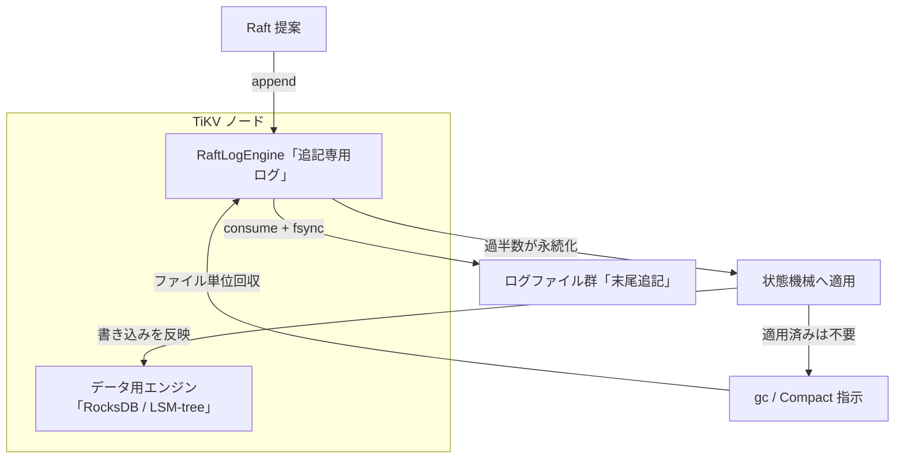

# 第6章 Raft ログエンジン

> **本章で読むソース**
>
> - [`components/engine_traits/src/raft_engine.rs`](https://github.com/tikv/tikv/blob/v8.5.6/components/engine_traits/src/raft_engine.rs)
> - [`components/raft_log_engine/src/engine.rs`](https://github.com/tikv/tikv/blob/v8.5.6/components/raft_log_engine/src/engine.rs)

## この章の狙い

TiKV は1つのノードに2つのストレージを持つ。
ユーザのキー値を保持する**データ用エンジン**と、Raft の合意ログを保持する**Raft ログエンジン**である。
第5章は前者を担う RocksDB 統合とカラムファミリを扱った。
本章は後者を読む。

Raft ログエンジンの抽象は `RaftEngine` トレイトであり、その本番実装が `RaftLogEngine` である。
本章では、Raft ログの追記と取得と切り詰めという3つの操作をトレイトの定義で確かめ、それらが追記専用ログの上でどう実装されるかを追う。
そのうえで、なぜ Raft ログをデータと別のエンジンに分けるのかを、書き込み増幅と fsync のまとめという観点から説明する。

## 前提

TiKV のキー空間は Region 単位で区切られ、各 Region のレプリカ群が1つの Raft グループを作る。
この構図は第2章で確定させた。
Raft グループは、書き込みをまず合意ログのエントリとして全レプリカに複製し、過半数が永続化した時点でコミットして状態機械に適用する。
本章のコード引用はすべて tikv/tikv のタグ `v8.5.6` に固定する。

下層のストレージエンジンに RocksDB を使う点は第5章で扱った。
Raft ログエンジンは RocksDB を使わず、`raft-engine` クレートという独立した追記専用ログを内部に持つ。
両者の違いが本章の主題である。

## RaftEngine トレイトが定める操作

Raft ログエンジンに求められる操作は `RaftEngine` トレイトに集約されている。
このトレイトは読み取り専用部分の `RaftEngineReadOnly` を継承し、書き込み用のログバッチ型 `LogBatch` を関連型として持つ。

[`components/engine_traits/src/raft_engine.rs` L83-L94](https://github.com/tikv/tikv/blob/v8.5.6/components/engine_traits/src/raft_engine.rs#L83-L94)

```rust
// TODO: Refactor common methods between Kv and Raft engine into a shared trait.
pub trait RaftEngine: RaftEngineReadOnly + PerfContextExt + Clone + Sync + Send + 'static {
    type LogBatch: RaftLogBatch;

    fn log_batch(&self, capacity: usize) -> Self::LogBatch;

    /// Synchronize the Raft engine.
    fn sync(&self) -> Result<()>;

    /// Consume the write batch by moving the content into the engine itself
    /// and return written bytes.
    fn consume(&self, batch: &mut Self::LogBatch, sync: bool) -> Result<usize>;
```

書き込みは2段で進む。
まず `log_batch` で `RaftLogBatch` を作り、そこへエントリや状態を積む。
次に `consume` でバッチをエンジンに渡し、必要に応じて fsync まで行う。
この分離が、後で述べる fsync のまとめを可能にする。

エントリの追記は読み取り側ではなく書き込みバッチ側の `RaftLogBatch::append` が担う。

[`components/engine_traits/src/raft_engine.rs` L158-L171](https://github.com/tikv/tikv/blob/v8.5.6/components/engine_traits/src/raft_engine.rs#L158-L171)

```rust
pub trait RaftLogBatch: Send {
    /// Append continuous entries to the batch.
    ///
    /// All existing entries with same index will be overwritten. If
    /// `overwrite_to` is set to a larger value, then entries in
    /// `[entries.last().get_index(), overwrite_to)` will be deleted.
    /// Nothing will be deleted if entries is empty. Note: `RaftLocalState`
    /// won't be updated in this call.
    fn append(
        &mut self,
        raft_group_id: u64,
        overwrite_to: Option<u64>,
        entries: Vec<Entry>,
    ) -> Result<()>;
```

`append` は `raft_group_id` ごとに連続したエントリを積む。
同じインデックスのエントリが既にあれば上書きする。
Leader が交代したときなどに古い未コミットエントリを正しい内容で置き換えるための仕様である。

取得は単一エントリを引く `get_entry` が基本になる。

[`components/engine_traits/src/raft_engine.rs` L39-L39](https://github.com/tikv/tikv/blob/v8.5.6/components/engine_traits/src/raft_engine.rs#L39-L39)

```rust
    fn get_entry(&self, raft_group_id: u64, index: u64) -> Result<Option<Entry>>;
```

切り詰めは `gc` が担う。
適用済みのエントリはもう要らないので、インデックスで範囲を指定してまとめて消す。

[`components/engine_traits/src/raft_engine.rs` L113-L114](https://github.com/tikv/tikv/blob/v8.5.6/components/engine_traits/src/raft_engine.rs#L113-L114)

```rust
    /// Like `cut_logs` but the range could be very large.
    fn gc(&self, raft_group_id: u64, from: u64, to: u64, batch: &mut Self::LogBatch) -> Result<()>;
```

`gc` は即座にログを消すのではなく、与えられた `batch` に切り詰めの指示を積むだけである。
実際の削除は、そのバッチを `consume` したときにエンジン側でまとめて行われる。

## RaftLogEngine による実装

`RaftEngine` の本番実装が `RaftLogEngine` である。
その実体は `raft-engine` クレートの `Engine` を `Arc` で包んだだけの薄いラッパーである。

[`components/raft_log_engine/src/engine.rs` L336-L349](https://github.com/tikv/tikv/blob/v8.5.6/components/raft_log_engine/src/engine.rs#L336-L349)

```rust
#[derive(Clone)]
pub struct RaftLogEngine(Arc<RawRaftEngine<ManagedFileSystem>>);

impl RaftLogEngine {
    pub fn new(
        config: RaftEngineConfig,
        key_manager: Option<Arc<DataKeyManager>>,
        rate_limiter: Option<Arc<IoRateLimiter>>,
    ) -> Result<Self> {
        let file_system = Arc::new(ManagedFileSystem::new(key_manager, rate_limiter));
        Ok(RaftLogEngine(Arc::new(
            RawRaftEngine::open_with_file_system(config, file_system).map_err(transfer_error)?,
        )))
    }
```

ここで `RawRaftEngine` は `raft_engine::Engine` の別名であり、TiKV 側の同名トレイトと衝突しないように改名して取り込んでいる。
`ManagedFileSystem` は暗号化と I/O レート制限を挟むファイルシステム層であり、その下は通常のファイル入出力である。
RocksDB のような LSM-tree は介在しない。

エントリの追記は、トレイトの `append` を `raft-engine` の `add_entries` へ委譲するだけである。

[`components/raft_log_engine/src/engine.rs` L395-L406](https://github.com/tikv/tikv/blob/v8.5.6/components/raft_log_engine/src/engine.rs#L395-L406)

```rust
impl RaftLogBatchTrait for RaftLogBatch {
    fn append(
        &mut self,
        raft_group_id: u64,
        _overwrite_to: Option<u64>,
        entries: Vec<Entry>,
    ) -> Result<()> {
        // overwrite is handled within raft log engine.
        self.0
            .add_entries::<MessageExtTyped>(raft_group_id, &entries)
            .map_err(transfer_error)
    }
```

トレイトでは `overwrite_to` で上書き範囲を指定できたが、ここでは引数名が `_overwrite_to` となっていて使われない。
コメントが示すとおり、上書きの処理は `raft-engine` の内部で完結するためである。

書き込みの確定は `consume` が担う。

[`components/raft_log_engine/src/engine.rs` L657-L661](https://github.com/tikv/tikv/blob/v8.5.6/components/raft_log_engine/src/engine.rs#L657-L661)

```rust
    fn consume(&self, batch: &mut Self::LogBatch, sync: bool) -> Result<usize> {
        // Always use ForegroundWrite as all `consume` calls share the same write queue.
        let _guard = WithIoType::new(IoType::ForegroundWrite);
        self.0.write(&mut batch.0, sync).map_err(transfer_error)
    }
```

`sync` が真のときだけ fsync まで行う。
コメントは、すべての `consume` が同じ書き込みキューを共有することを述べている。
複数の書き込みが1つのキューに集まる構造は、後述する fsync のまとめの前提になる。

切り詰めの `gc` は、削除コマンドをバッチに積む形で実装されている。

[`components/raft_log_engine/src/engine.rs` L686-L697](https://github.com/tikv/tikv/blob/v8.5.6/components/raft_log_engine/src/engine.rs#L686-L697)

```rust
    fn gc(
        &self,
        raft_group_id: u64,
        _from: u64,
        to: u64,
        batch: &mut Self::LogBatch,
    ) -> Result<()> {
        batch
            .0
            .add_command(raft_group_id, Command::Compact { index: to });
        Ok(())
    }
```

`gc` は `to` までを消す `Compact` コマンドをバッチに積むだけである。
古いエントリを1件ずつ消すのではなく、論理的な切り詰め位置を1つ記録する。
追記専用ログでは、その位置より前を含むログファイルが全 Region で不要になった時点で、ファイルごとまとめて回収できる。
ファイル単位の回収は `manual_purge` が `purge_expired_files` を呼んで行う。

## RocksDB の raft CF を使う旧方式との違い

`raft-engine` を使う前の TiKV は、Raft ログをデータと同じ RocksDB 上の専用カラムファミリ（raft CF）に書いていた。
RocksDB は LSM-tree であり、書き込みはまず WAL とメモリ上の MemTable に入り、後でフラッシュとコンパクションを通じて SST へ段階的に降りていく。
このため Raft ログのように追記と切り詰めを繰り返すデータでも、書いた直後に消える短命なエントリが何度も下層へ書き戻され、書き込み増幅を生む。
切り詰めもキー単位の削除（トゥームストーン）として表現され、実体の解放はコンパクションを待つ。

`RaftLogEngine` は Raft ログを LSM-tree に載せず、追記専用ログとして別エンジンに分離する。
エントリは末尾に追記され、切り詰めは論理的な位置の記録に置き換わり、ファイル単位で回収される。
LSM-tree のフラッシュとコンパクションを経由しないため、短命なログがコンパクションで何度も書き戻される増幅を避けられる。
LSM-tree の機構そのものは[RocksDB 編](../../../rocksdb/part03-sst/15-block-based-table-builder.md)に譲る。

## 高速化の工夫：データと干渉しない追記専用ログ

Raft ログとユーザデータは、寿命と書き込みパターンが異なる。
Raft ログは追記が中心で、適用が済めば切り詰められる短命なデータである。
ユーザデータは長命で、読み取りに備えて整列とコンパクションを重ねる価値がある。
この2つを同じ LSM-tree に同居させると、短命なログまでデータのコンパクションに巻き込まれ、無駄な書き込み増幅を負う。

`RaftLogEngine` は Raft ログを追記専用エンジンへ分離し、この巻き込みを断つ。
ログは末尾追記とファイル単位回収だけで済み、データの LSM-tree コンパクションと I/O 経路を共有しない。
さらに、すべての `consume` が同じ書き込みキューを共有するため、複数 Region の書き込みを1つのバッチにまとめ、1回の fsync でまとめて永続化できる。
Raft では過半数のレプリカがログを永続化するまで書き込みをコミットできないので、fsync の回数は遅延に直結する。
書き込みをまとめて fsync を減らすことが、そのままコミット遅延の短縮になる。

この構図と、追記から適用、切り詰めへ至る流れを図1に示す。



図の左の流れが Raft ログ、右下の流れがユーザデータである。
提案されたエントリは `append` でログバッチに積まれ、`consume` で末尾追記されて fsync される。
過半数が永続化するとコミットされ、状態機械を通じてユーザデータがデータ用エンジンへ反映される。
適用が済んだエントリは `gc` で切り詰め位置が記録され、不要になったログファイルがまとめて回収される。
この回収と適用の流れは、提案と適用を扱う第9章、ならびに raftstore 全体を俯瞰する第7章へつながる。

## まとめ

TiKV は Raft ログを保持する `RaftLogEngine` を、ユーザデータを保持する RocksDB と別に持つ。
`RaftEngine` トレイトは追記の `append`、取得の `get_entry`、切り詰めの `gc` を定め、`RaftLogEngine` はそれらを `raft-engine` クレートの追記専用ログへ委譲する。
Raft ログは短命で追記中心、ユーザデータは長命という寿命の違いに合わせて2つを分けることで、短命なログを LSM-tree のコンパクションに巻き込む書き込み増幅を避け、複数 Region の書き込みを1回の fsync にまとめてコミット遅延を抑える。

## 関連する章

- [第5章 RocksDB 統合とカラムファミリ](05-engine-rocks-and-cf.md)：本章が分離する相手であるデータ用エンジンの実装を扱う。
- [第7章 raftstore の全体像](../part02-raft/07-raftstore-overview.md)：Raft ログエンジンを使う raftstore の全体構成を俯瞰する。
- [第9章 提案と適用](../part02-raft/09-propose-and-apply.md)：エントリの追記から適用、切り詰めへ至る流れをコードで追う。
