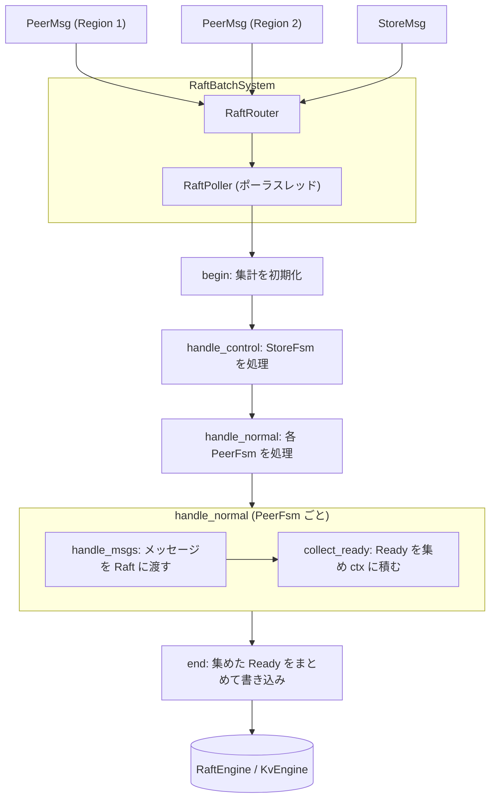

# 第7章 raftstore の全体像

> **本章で読むソース**
>
> - [`components/raftstore/src/store/fsm/store.rs`](https://github.com/tikv/tikv/blob/v8.5.6/components/raftstore/src/store/fsm/store.rs)
> - [`components/raftstore/src/store/fsm/peer.rs`](https://github.com/tikv/tikv/blob/v8.5.6/components/raftstore/src/store/fsm/peer.rs)
> - [`components/raftstore/src/store/msg.rs`](https://github.com/tikv/tikv/blob/v8.5.6/components/raftstore/src/store/msg.rs)
> - [`components/raftstore/src/store/peer.rs`](https://github.com/tikv/tikv/blob/v8.5.6/components/raftstore/src/store/peer.rs)
> - [`components/batch-system/src/batch.rs`](https://github.com/tikv/tikv/blob/v8.5.6/components/batch-system/src/batch.rs)

## この章の狙い

TiKV で Raft による複製を司るのが `raftstore` である。
本章はその全体像を読み、1回のポーリングがメッセージを受けてから書き込みを終えるまでの流れをたどる。

`raftstore` は2層の状態機械でできている。
Store 全体に1つの `StoreFsm` と、Region ごとに1つの `PeerFsm` である。
この多数の `PeerFsm` を少数のスレッドで回すのが `RaftBatchSystem` であり、各スレッドの本体が `RaftPoller` である。
1回のポーリングは、届いたメッセージを各 `PeerFsm` に配り、Raft を進め、生成された `Ready` をまとめて書き込む。
個々の提案（propose）と適用（apply）の中身は[第9章](09-propose-and-apply.md)で扱う。
本章は、その手前の枠組みを読む。

## 前提

[第2章](../part00-overview/02-architecture.md)で、`PeerFsm` と `StoreFsm`、および両者を多重化する `batch-system` の骨格を読んだ。
本章はその上に立ち、`raftstore` がこの仕組みをどう具体化し、1回のポーリングで何をするかを読む。
`batch-system` の `Fsm` トレイトや `BatchSystem` 構造体の定義は第2章に譲り、本章は `RaftPoller` の処理に進む。

## 2層の状態機械と RaftBatchSystem

`raftstore` の状態機械は2層に分かれる。
Region のレプリカ1つを表す `Peer` を `batch-system` の状態機械として包んだものが `PeerFsm` である。

[`components/raftstore/src/store/fsm/peer.rs L146-L151`](https://github.com/tikv/tikv/blob/v8.5.6/components/raftstore/src/store/fsm/peer.rs#L146-L151)

```rust
pub struct PeerFsm<EK, ER>
where
    EK: KvEngine,
    ER: RaftEngine,
{
    pub peer: Peer<EK, ER>,
```

`PeerFsm` は Region ごとに1つ存在し、その Region に対する Raft メッセージや書き込み提案を受け取る。
これに対し、Store 全体に1つだけ存在するのが `StoreFsm` である。

[`components/raftstore/src/store/fsm/store.rs L758-L764`](https://github.com/tikv/tikv/blob/v8.5.6/components/raftstore/src/store/fsm/store.rs#L758-L764)

```rust
pub struct StoreFsm<EK>
where
    EK: KvEngine,
{
    store: Store,
    receiver: Receiver<StoreMsg<EK>>,
}
```

`StoreFsm` は Store 全体に関わる仕事を引き受ける。
具体的には、宛先 Region がまだ存在しない Raft メッセージの受け口、Store 単位の定期処理、スナップショットの掃除などである。

この2層を1つにまとめて駆動するのが `RaftBatchSystem` である。

[`components/raftstore/src/store/fsm/store.rs L1647-L1655`](https://github.com/tikv/tikv/blob/v8.5.6/components/raftstore/src/store/fsm/store.rs#L1647-L1655)

```rust
pub struct RaftBatchSystem<EK: KvEngine, ER: RaftEngine> {
    system: BatchSystem<PeerFsm<EK, ER>, StoreFsm<EK>>,
    apply_router: ApplyRouter<EK>,
    apply_system: ApplyBatchSystem<EK>,
    router: RaftRouter<EK, ER>,
    workers: Option<Workers<EK>>,
    store_writers: StoreWriters<EK, ER>,
    node_start_time: Timespec, // monotonic_raw_now
}
```

内側の `system` フィールドが、第2章で読んだ汎用の `BatchSystem` を `N = PeerFsm`、`C = StoreFsm` として具体化したものである。
ここで通常 FSM が `PeerFsm`、制御 FSM が `StoreFsm` という対応が確定する。
`RaftBatchSystem` はこのほかに、適用処理を担う別系統の `apply_system` や、メッセージの宛先を引く `router` も持つ。
適用側の `apply_system` は[第9章](09-propose-and-apply.md)で扱い、本章は複製の本体である `system` を読む。

## PeerMsg と StoreMsg

状態機械を駆動するのはメッセージである。
`PeerFsm` 宛のメッセージは `PeerMsg`、`StoreFsm` 宛のメッセージは `StoreMsg` という列挙型で表す。

[`components/raftstore/src/store/msg.rs L837-L870`](https://github.com/tikv/tikv/blob/v8.5.6/components/raftstore/src/store/msg.rs#L837-L870)

```rust
pub enum PeerMsg<EK: KvEngine> {
    /// Raft message is the message sent between raft nodes in the same
    /// raft group. Messages need to be redirected to raftstore if target
    /// peer doesn't exist.
    RaftMessage(Box<InspectedRaftMessage>, Option<Instant>),
    /// Raft command is the command that is expected to be proposed by the
    /// leader of the target raft group. If it's failed to be sent, callback
    /// usually needs to be called before dropping in case of resource leak.
    RaftCommand(Box<RaftCommand<EK::Snapshot>>),
    /// Tick is periodical task. If target peer doesn't exist there is a
    /// potential that the raft node will not work anymore.
    Tick(PeerTick),
    /// Result of applying committed entries. The message can't be lost.
    ApplyRes(Box<ApplyTaskRes<EK::Snapshot>>),
    /// Message that can't be lost but rarely created. If they are lost, real
    /// bad things happen like some peers will be considered dead in the
    /// group.
    SignificantMsg(Box<SignificantMsg<EK::Snapshot>>),
    /// Start the FSM.
    Start,
    /// A message only used to notify a peer.
    Noop,
    Persisted {
        peer_id: u64,
        ready_number: u64,
    },
    /// Message that is not important and can be dropped occasionally.
    CasualMessage(Box<CasualMessage<EK>>),
    /// Ask region to report a heartbeat to PD.
    HeartbeatPd,
    /// Asks region to change replication mode.
    UpdateReplicationMode,
    Destroy(u64),
}
```

本章で追うのは、おもに `RaftMessage` と `RaftCommand` である。
`RaftMessage` は同じ Raft グループの別 Peer から届く Raft プロトコルのメッセージで、`RaftCommand` は Leader に対して提案される書き込みコマンドである。
`Tick` は定期処理の起動、`ApplyRes` は適用結果の通知であり、いずれも `PeerFsm` を1ステップ進める入力になる。

`StoreMsg` は Store 全体に関わる入力を表す。

[`components/raftstore/src/store/msg.rs L936-L962`](https://github.com/tikv/tikv/blob/v8.5.6/components/raftstore/src/store/msg.rs#L936-L962)

```rust
pub enum StoreMsg<EK>
where
    EK: KvEngine,
{
    RaftMessage(Box<InspectedRaftMessage>),

    StoreUnreachable {
        store_id: u64,
    },

    // Compaction finished event
    CompactedEvent(EK::CompactedEvent),

    // Clear region size and keys for all regions in the range, so we can force them to
    // re-calculate their size later.
    ClearRegionSizeInRange {
        start_key: Vec<u8>,
        end_key: Vec<u8>,
    },

    Tick(StoreTick),
    Start {
        store: metapb::Store,
    },

    /// Asks the store to update replication mode.
    UpdateReplicationMode(ReplicationStatus),
```

`StoreMsg::RaftMessage` は、宛先の `PeerFsm` がまだ作られていない Raft メッセージの受け皿になる。
Store はこのメッセージから新しい Region のレプリカを作り、対応する `PeerFsm` を起こす。

## RaftPoller とポーリング1回の流れ

`RaftBatchSystem` の内側のワーカスレッドは、それぞれ1つの `RaftPoller` を持って回る。
`RaftPoller` は `batch-system` の `PollHandler` を実装した型で、ポーリングの実体である。

[`components/raftstore/src/store/fsm/store.rs L971-L987`](https://github.com/tikv/tikv/blob/v8.5.6/components/raftstore/src/store/fsm/store.rs#L971-L987)

```rust
pub struct RaftPoller<EK: KvEngine + 'static, ER: RaftEngine + 'static, T: 'static> {
    tag: String,
    store_msg_buf: Vec<StoreMsg<EK>>,
    peer_msg_buf: Vec<PeerMsg<EK>>,
    timer: TiInstant,
    poll_ctx: PollContext<EK, ER, T>,
    messages_per_tick: usize,
    cfg_tracker: Tracker<Config>,
    trace_event: TraceEvent,
    last_flush_time: TiInstant,
    need_flush_events: bool,

    // previous metrics count
    previous_append: u64,
    previous_message: u64,
    previous_snapshot: u64,
}
```

`store_msg_buf` と `peer_msg_buf` は、FSM の受信口から取り出したメッセージを一時的にためる作業用バッファである。
`poll_ctx` は1回のポーリングで使う共有文脈で、各種スケジューラや書き込み経路、その回の集計値を抱える。

`batch-system` の汎用ポーリングループは、FSM のバッチを取り出すたびに `PollHandler` のフックを順に呼ぶ。

[`components/batch-system/src/batch.rs L399-L411`](https://github.com/tikv/tikv/blob/v8.5.6/components/batch-system/src/batch.rs#L399-L411)

```rust
            self.handler.begin(max_batch_size, |cfg| {
                self.max_batch_size = cfg.max_batch_size();
            });
            max_batch_size = std::cmp::max(self.max_batch_size, batch.normals.len());

            if batch.control.is_some() {
                let len = self.handler.handle_control(batch.control.as_mut().unwrap());
                if batch.control.as_ref().unwrap().is_stopped() {
                    batch.remove_control(&self.router.control_box);
                } else if let Some(len) = len {
                    batch.release_control(&self.router.control_box, len);
                }
            }
```

ループは `begin` で1回ぶんの集計を初期化し、制御 FSM があれば `handle_control` で `StoreFsm` を処理し、続いてバッチ内の各通常 FSM を `handle_normal` で1つずつ処理する。
最後に `end` を呼んでまとめの仕事をする。
`RaftPoller` はこの3つのフックに `raftstore` 固有の処理を埋める。

`handle_normal` が `PeerFsm` 1つを処理する本体である。

[`components/raftstore/src/store/fsm/store.rs L1076-L1129`](https://github.com/tikv/tikv/blob/v8.5.6/components/raftstore/src/store/fsm/store.rs#L1076-L1129)

```rust
    fn handle_normal(
        &mut self,
        peer: &mut impl DerefMut<Target = PeerFsm<EK, ER>>,
    ) -> HandleResult {
        let mut handle_result = HandleResult::KeepProcessing;

        // ... (中略) ...

        while self.peer_msg_buf.len() < self.messages_per_tick {
            match peer.receiver.try_recv() {
                // TODO: we may need a way to optimize the message copy.
                Ok(msg) => {
                    // ... (中略) ...
                    self.peer_msg_buf.push(msg);
                }
                Err(TryRecvError::Empty) => {
                    handle_result = HandleResult::stop_at(0, false);
                    break;
                }
                Err(TryRecvError::Disconnected) => {
                    peer.stop();
                    handle_result = HandleResult::stop_at(0, false);
                    break;
                }
            }
        }

        let mut delegate = PeerFsmDelegate::new(peer, &mut self.poll_ctx);
        delegate.handle_msgs(&mut self.peer_msg_buf);
        // No readiness is generated and using sync write, skipping calling ready and
        // release early.
        if !delegate.collect_ready() && self.poll_ctx.sync_write_worker.is_some() {
            if let HandleResult::StopAt { skip_end, .. } = &mut handle_result {
                *skip_end = true;
            }
        }

        handle_result
    }
```

`handle_normal` は3つの段に分かれる。
まず `peer.receiver` から `peer_msg_buf` へメッセージを取り出す。
次に `PeerFsmDelegate` を作り、`handle_msgs` で取り出したメッセージを処理する。
最後に `collect_ready` で、その `Peer` が生成した `Ready` を集める。

`PeerFsmDelegate` は、`PeerFsm` とポーリング文脈 `PollContext` を一時的に束ねた処理用の構造体である。

[`components/raftstore/src/store/fsm/peer.rs L622-L629`](https://github.com/tikv/tikv/blob/v8.5.6/components/raftstore/src/store/fsm/peer.rs#L622-L629)

```rust
pub struct PeerFsmDelegate<'a, EK, ER, T: 'static>
where
    EK: KvEngine,
    ER: RaftEngine,
{
    fsm: &'a mut PeerFsm<EK, ER>,
    ctx: &'a mut PollContext<EK, ER, T>,
}
```

`PeerFsm` 自身はメッセージの受信口と状態だけを持ち、処理ロジックは持たない。
ポーリングのたびに `PeerFsmDelegate` がその `PeerFsm` と共有文脈 `ctx` を束ね、処理の主体になる。
1つのポーラスレッドが多数の `PeerFsm` を順に処理できるのは、文脈 `ctx` をデリゲート側に置き、`PeerFsm` には Region 固有の状態だけを残すこの分担による。

## handle_msgs によるメッセージ処理

`handle_msgs` は、取り出したメッセージを種類ごとに振り分ける。

[`components/raftstore/src/store/fsm/peer.rs L643-L667`](https://github.com/tikv/tikv/blob/v8.5.6/components/raftstore/src/store/fsm/peer.rs#L643-L667)

```rust
    pub fn handle_msgs(&mut self, msgs: &mut Vec<PeerMsg<EK>>) {
        let timer = SlowTimer::from_millis(100);
        let count = msgs.len();
        #[allow(const_evaluatable_unchecked)]
        let mut distribution = [0; PeerMsg::<EK>::COUNT];
        // As the detail of one msg is not very useful when handling multiple messages,
        // only format the msg detail in slow log when there is only one message.
        let detail = if msgs.len() == 1 {
            msgs.first().map(|m| format!("{:?}", m))
        } else {
            None
        };

        for m in msgs.drain(..) {
            // skip handling remain messages if fsm is destroyed. This can aviod handling
            // arbitary messages(e.g. CasualMessage::ForceCompactRaftLogs) that may need
            // to read raft logs which maybe lead to panic.
            // We do not skip RaftCommand because raft commond callback should always be
            // handled or it will cause panic.
            if self.fsm.stopped && !matches!(&m, PeerMsg::RaftCommand(_)) {
                continue;
            }
            distribution[m.discriminant()] += 1;
            match m {
                PeerMsg::RaftMessage(msg, sent_time) => {
```

`for` ループはバッファ内のメッセージを順に取り出し、`match` で種類ごとに処理を呼び分ける。
`RaftMessage` なら `on_raft_message` で Raft プロトコルのメッセージを Raft グループに渡し、`RaftCommand` なら書き込み提案を `propose_raft_command` などに回す。
`Tick` は定期処理、`ApplyRes` は適用結果の取り込みになる。

`handle_msgs` の中では、`Ready` をまだ書き込まない。
`RaftMessage` を渡しても `RaftCommand` を提案しても、Raft グループの内部状態が進むだけで、ディスクへの永続化やネットワーク送信はこの時点では行わない。
書き込むべき内容は、次の `collect_ready` でまとめて取り出される。

## collect_ready による Ready の収集

メッセージの処理で Raft が進むと、永続化や送信が必要な出力がたまる。
これを Raft では `Ready` と呼ぶ。
`collect_ready` がその `Ready` を取り出す。

[`components/raftstore/src/store/fsm/peer.rs L2215-L2242`](https://github.com/tikv/tikv/blob/v8.5.6/components/raftstore/src/store/fsm/peer.rs#L2215-L2242)

```rust
    pub fn collect_ready(&mut self) -> bool {
        let has_ready = self.fsm.has_ready;
        self.fsm.has_ready = false;
        if !has_ready || self.fsm.stopped {
            return false;
        }
        self.ctx.pending_count += 1;
        self.ctx.has_ready = true;
        let res = self.fsm.peer.handle_raft_ready_append(self.ctx);
        if let Some(r) = res {
            self.on_role_changed(r.state_role);
            if r.has_new_entries {
                self.register_raft_gc_log_tick();
                self.register_entry_cache_evict_tick();
            }
            self.ctx.ready_count += 1;
            self.ctx.raft_metrics.ready.has_ready_region.inc();

            if self.fsm.peer.leader_unreachable {
                self.fsm.reset_hibernate_state(GroupState::Chaos);
                self.register_raft_base_tick();
                self.fsm.peer.leader_unreachable = false;
            }

            return r.has_write_ready;
        }
        false
    }
```

`has_ready` が立っていなければ、その `Peer` は何も生成していないので即座に戻る。
立っていれば `handle_raft_ready_append` を呼び、Raft グループから `Ready` を取り出して書き込みタスクを組み立てる。
この時点で `ctx.has_ready` が立ち、`ctx.ready_count` が増える。
集計値が `PollContext` に積まれていく点に注目したい。
個々の `PeerFsm` は自分の書き込みを直接ディスクに送らず、共有文脈 `ctx` へ「書くものがある」という事実と書き込みタスクを残すだけである。

実際のディスク書き込みは、バッチ内のすべての `PeerFsm` を処理し終えたあとの `end` フックでまとめて行われる。

[`components/raftstore/src/store/fsm/store.rs L1159-L1206`](https://github.com/tikv/tikv/blob/v8.5.6/components/raftstore/src/store/fsm/store.rs#L1159-L1206)

```rust
    fn end(&mut self, peers: &mut [Option<impl DerefMut<Target = PeerFsm<EK, ER>>>]) {
        if self.poll_ctx.has_ready {
            // Only enable the fail point when the store id is equal to 3, which is
            // the id of slow store in tests.
            fail_point!("on_raft_ready", self.poll_ctx.store_id() == 3, |_| {});
        }
        let mut latency_inspect = std::mem::take(&mut self.poll_ctx.pending_latency_inspect);
        let mut dur = self.timer.saturating_elapsed();

        for inspector in &mut latency_inspect {
            inspector.record_store_process(dur);
        }
        let write_begin = TiInstant::now();
        if let Some(write_worker) = &mut self.poll_ctx.sync_write_worker {
            if self.poll_ctx.has_ready {
                write_worker.write_to_db(false);

                for mut inspector in latency_inspect {
                    inspector.record_store_write(write_begin.saturating_elapsed());
                    inspector.finish();
                }

                for peer in peers.iter_mut().flatten() {
                    PeerFsmDelegate::new(peer, &mut self.poll_ctx).post_raft_ready_append();
                }
            } else {
                for inspector in latency_inspect {
                    inspector.finish();
                }
            }
        } else {
            // ... (中略) ...
        }
```

`end` は `poll_ctx.has_ready` が立っているときだけ書き込みに進む。
同期書き込みの経路では `write_to_db` を1回呼び、その回のポーリングで集まった全 `Peer` の書き込みをまとめてデータベースへ落とす。
書き込みが終わったあとで、各 `Peer` の `post_raft_ready_append` を呼んで後処理を進める。

ここまでの流れを図7に示す。



図7　`RaftBatchSystem` がメッセージを `RaftPoller` に渡し、各 `PeerFsm` の `handle_msgs` で Raft を進め、`collect_ready` で集めた `Ready` を `end` でまとめて書き込む。

## 最適化の工夫　Ready のバッチ書き込み

`raftstore` の核となる工夫は、ポーリング1回の中で `Ready` の書き込みをまとめることである。
なぜまとめるのかは、`Ready` の永続化がディスクへの fsync を伴う重い操作だからである。

もし `PeerFsm` ごとに `Ready` をその場で書き込むと、バッチに 100 個の `Peer` が入った回では 100 回のディスク書き込みが並ぶ。
TiKV はそうせず、`handle_normal` の中の `collect_ready` では書き込みタスクを共有文脈 `ctx` に積むだけにとどめる。
そしてバッチ内のすべての `Peer` を処理し終えた `end` で、`write_to_db` を1回だけ呼んで全 `Peer` の書き込みをまとめてディスクへ落とす。
これにより、多数の Region で同時に進む Raft の出力を1回の I/O に束ね、fsync の回数を `Peer` の数から1回へ減らせる。

`handle_raft_ready_append` の戻り値の `has_write_ready` も、この設計を支える。

[`components/raftstore/src/store/peer.rs L508-L512`](https://github.com/tikv/tikv/blob/v8.5.6/components/raftstore/src/store/peer.rs#L508-L512)

```rust
pub struct ReadyResult {
    pub state_role: Option<StateRole>,
    pub has_new_entries: bool,
    pub has_write_ready: bool,
}
```

`has_write_ready` は、その `Peer` が今回ディスク書き込みを要する `Ready` を出したかを表す。
`collect_ready` はこの値を返し、ポーリングループは1つでも書き込みのある `Peer` があれば `ctx.has_ready` を立てる。
`end` はこのフラグを見て、書くものがある回だけ `write_to_db` に進む。
処理した `Peer` がすべて読み取りや空振りで終わった回は、ディスク書き込みそのものを省ける。

この設計は、マルチラフトと相補的である。
[第2章](../part00-overview/02-architecture.md)で読んだとおり、TiKV は1つの Store に多数の Region を載せ、それぞれが小さな Raft グループとして並行に動く。
Region を増やすほど同時に進む Raft の出力も増えるが、`raftstore` はそれを少数のポーラスレッドで集約し、1回の I/O にまとめることで、Region 数に書き込み回数が比例して膨らむのを防ぐ。

## まとめ

`raftstore` は2層の状態機械でできている。
Store 全体に1つの `StoreFsm` と、Region ごとに1つの `PeerFsm` であり、両者を `RaftBatchSystem` が少数のスレッドで多重化する。
各スレッドの本体である `RaftPoller` は `batch-system` の `PollHandler` を実装し、1回のポーリングで `begin`、`handle_normal`、`end` の順に進む。

`handle_normal` は各 `PeerFsm` について、受信メッセージを `handle_msgs` で Raft に渡し、生成された `Ready` を `collect_ready` で集める。
このとき書き込みはせず、書き込みタスクを共有文脈 `ctx` に積むだけにとどめる。
バッチ内の全 `Peer` を処理し終えた `end` で、集めた `Ready` を `write_to_db` で1回にまとめて書き込み、多数の Region の永続化を1回の I/O に束ねる。

提案と適用の中身、すなわち `handle_msgs` が呼ぶ `propose_raft_command` の先と、適用側の `apply_system` の処理は次章以降で読む。

## 関連する章

- [第2章 アーキテクチャ、Store と Region と Peer](../part00-overview/02-architecture.md)：`PeerFsm` と `StoreFsm`、`batch-system` の骨格を読んだ前提の章。
- [第8章 Region と Peer](08-region-and-peer.md)：`PeerFsm` が包む `Peer` 構造体と Region の状態を読む。
- [第9章 提案と適用](09-propose-and-apply.md)：`handle_msgs` が呼ぶ propose と、`apply_system` による適用の中身を読む。
