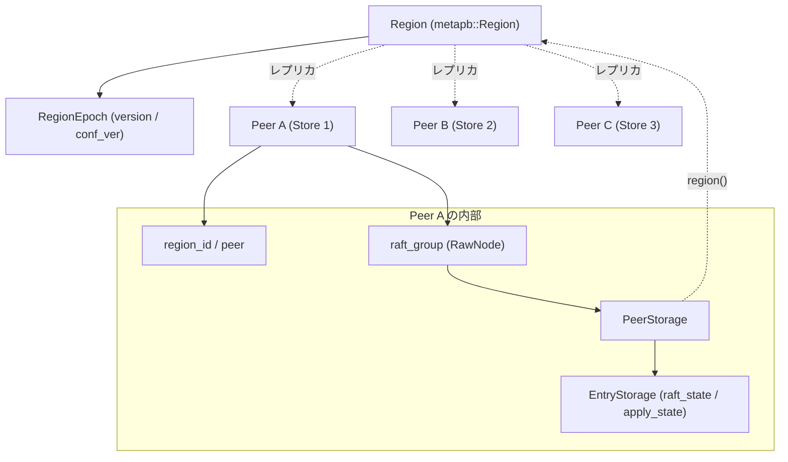

# 第8章 Region と Peer

> **本章で読むソース**
>
> - [`components/raftstore/src/store/peer.rs`](https://github.com/tikv/tikv/blob/v8.5.6/components/raftstore/src/store/peer.rs)
> - [`components/raftstore/src/store/peer_storage.rs`](https://github.com/tikv/tikv/blob/v8.5.6/components/raftstore/src/store/peer_storage.rs)
> - [`components/raftstore/src/store/entry_storage.rs`](https://github.com/tikv/tikv/blob/v8.5.6/components/raftstore/src/store/entry_storage.rs)
> - [`components/raftstore/src/store/util.rs`](https://github.com/tikv/tikv/blob/v8.5.6/components/raftstore/src/store/util.rs)

## この章の狙い

TiKV はキー空間を **Region** という連続区間に分割し、各 Region を複数の Store にレプリカとして配置する。
1つのレプリカが1つの Raft グループのメンバであり、それを表す実体が `Peer` である。
本章は `Peer` 構造体が何を保持し、その永続状態を `PeerStorage` がどう Raft クレートへ渡すかを読む。
あわせて、分割やメンバ変更の前後を区別する `RegionEpoch` が、古いルーティングのリクエストを安全に弾く仕組みを扱う。

## 前提

第7章で `raftstore` の全体像を扱う。
Store が複数の `Peer` を束ね、`PollHandler` がメッセージを駆動する点は前章に譲り、本章は単一の `Peer` の内部に踏み込む。
Raft の合意アルゴリズムそのもの（選挙、ログ複製、コミット）は外部の `raft-rs` クレートが担い、TiKV はその `RawNode` と `Storage` トレイトを実装する側に回る。

## Region と Peer の関係

Region はキー範囲とメンバ集合を表すメタ情報であり、`metapb::Region` として表現される。
同じ Region の各レプリカは別々の Store に存在し、それぞれが `region_id` を共有しつつ自分の `peer_id` を持つ。
1つの Store 内では、その Store が担当するレプリカごとに1つの `Peer` が存在する。

`Peer` は `region_id` と、自分自身のメンバ情報 `peer`（`metapb::Peer`）を保持する。

[`components/raftstore/src/store/peer.rs` L705-L720](https://github.com/tikv/tikv/blob/v8.5.6/components/raftstore/src/store/peer.rs#L705-L720)

```rust
#[derive(Getters, MutGetters)]
pub struct Peer<EK, ER>
where
    EK: KvEngine,
    ER: RaftEngine,
{
    /// The ID of the Region which this Peer belongs to.
    region_id: u64,
    // TODO: remove it once panic!() support slog fields.
    /// Peer_tag, "[region <region_id>] <peer_id>"
    pub tag: String,
    /// The Peer meta information.
    pub peer: metapb::Peer,

    /// The Raft state machine of this Peer.
    pub raft_group: RawNode<PeerStorage<EK, ER>>,
```

`raft_group` は `raft-rs` の `RawNode` であり、これが Raft の状態機械の本体である。
型引数を見ると `RawNode<PeerStorage<EK, ER>>` となっており、`RawNode` は永続化層として `PeerStorage` を内部に保持する。
ここに本章の構造が現れる。
`Peer` は Raft の駆動役 `RawNode` を抱え、`RawNode` は永続状態を `PeerStorage` に委ね、`PeerStorage` は下層の2つのエンジン（KV エンジンと Raft エンジン）へ書き込む。

Region のメタ情報そのものは `Peer` が直接持たず、`PeerStorage` 側に置かれる。
`region()` は `PeerStorage` の `region()` へ委譲する薄いアクセサである。

[`components/raftstore/src/store/peer.rs` L1536-L1539](https://github.com/tikv/tikv/blob/v8.5.6/components/raftstore/src/store/peer.rs#L1536-L1539)

```rust
    #[inline]
    pub fn region(&self) -> &metapb::Region {
        self.get_store().region()
    }
```

`get_store()` は `raft_group` の内部ストレージ、すなわち `PeerStorage` への参照を返す。

[`components/raftstore/src/store/peer.rs` L1790-L1793](https://github.com/tikv/tikv/blob/v8.5.6/components/raftstore/src/store/peer.rs#L1790-L1793)

```rust
    #[inline]
    pub fn get_store(&self) -> &PeerStorage<EK, ER> {
        self.raft_group.store()
    }
```

この委譲によって、Region のメタ情報は Raft の永続状態と同じ場所に置かれる。
分割やメンバ変更で Region が更新されるとき、メタ情報と Raft 状態を1つのストレージ層でまとめて扱えるようになる。

## Peer の構築

`Peer::new` は、Store ID と設定、下層エンジン、Region とメンバ情報を受け取り、`PeerStorage` を作ってから `RawNode` を組み立てる。

[`components/raftstore/src/store/peer.rs` L971-L1003](https://github.com/tikv/tikv/blob/v8.5.6/components/raftstore/src/store/peer.rs#L971-L1003)

```rust
        let ps = PeerStorage::new(
            engines,
            region,
            region_scheduler,
            raftlog_fetch_scheduler,
            peer.get_id(),
            tag.clone(),
            raft_metrics,
        )?;
        let applied_index = ps.applied_index();

        let raft_cfg = raft::Config {
            id: peer.get_id(),
            election_tick: cfg.raft_election_timeout_ticks,
            heartbeat_tick: cfg.raft_heartbeat_ticks,
            min_election_tick: cfg.raft_min_election_timeout_ticks,
            max_election_tick: cfg.raft_max_election_timeout_ticks,
            max_size_per_msg: cfg.raft_max_size_per_msg.0,
            max_inflight_msgs: cfg.raft_max_inflight_msgs,
            applied: applied_index,
            check_quorum: !cfg.unsafe_disable_check_quorum,
            skip_bcast_commit: true,
            pre_vote: cfg.prevote,
            max_committed_size_per_ready: MAX_COMMITTED_SIZE_PER_READY,
            priority: if peer.is_witness { -1 } else { 0 },
            // always disable applying unpersisted log at initialization,
            // will enable it after applying to the current last_index.
            max_apply_unpersisted_log_limit: 0,
            ..Default::default()
        };

        let logger = slog_global::get_global().new(slog::o!("region_id" => region.get_id()));
        let raft_group = RawNode::new(&raft_cfg, ps, &logger)?;
```

注目すべきは `applied: applied_index` である。
`PeerStorage` を作った直後に、永続化済みの適用済み index を読み出し、それを `raft::Config` に渡してから `RawNode::new` を呼ぶ。
これにより、再起動した `Peer` は前回どこまでログを適用したかを Raft に伝え、すでに適用したエントリを二重に適用しないで済む。
ピア ID が `INVALID_ID` のときは構築前に弾かれ、無効なメンバから Raft グループが組み上がることを防ぐ。

## PeerStorage が Raft へ渡す永続状態

`PeerStorage` は、Raft が必要とする永続状態を下層エンジンに保存し、`raft-rs` の `Storage` トレイトを実装して読み出し口を提供する。
構造体は KV エンジンと Raft エンジンの組 `engines` を持ち、Region のメタ情報 `region` と、ログエントリを扱う `entry_storage` を抱える。

[`components/raftstore/src/store/peer_storage.rs` L229-L247](https://github.com/tikv/tikv/blob/v8.5.6/components/raftstore/src/store/peer_storage.rs#L229-L247)

```rust
pub struct PeerStorage<EK, ER>
where
    EK: KvEngine,
{
    pub engines: Engines<EK, ER>,

    peer_id: u64,
    peer: Option<metapb::Peer>, // when uninitialized the peer info is unknown.
    region: metapb::Region,

    snap_state: RefCell<SnapState>,
    gen_snap_task: RefCell<Option<GenSnapTask>>,
    region_scheduler: Scheduler<RegionTask>,
    snap_tried_cnt: RefCell<usize>,

    entry_storage: EntryStorage<EK, ER>,

    pub tag: String,
}
```

`PeerStorage` が `raft::Storage` を実装することで、Raft クレートは永続化の詳細を知らずに済む。
トレイト実装は、初期状態、エントリ取得、term 取得、最初と最後の index、スナップショットの各メソッドを `entry_storage` などへ委譲する。

[`components/raftstore/src/store/peer_storage.rs` L265-L301](https://github.com/tikv/tikv/blob/v8.5.6/components/raftstore/src/store/peer_storage.rs#L265-L301)

```rust
impl<EK, ER> Storage for PeerStorage<EK, ER>
where
    EK: KvEngine,
    ER: RaftEngine,
{
    fn initial_state(&self) -> raft::Result<RaftState> {
        self.initial_state()
    }

    fn entries(
        &self,
        low: u64,
        high: u64,
        max_size: impl Into<Option<u64>>,
        context: GetEntriesContext,
    ) -> raft::Result<Vec<Entry>> {
        let max_size = max_size.into();
        self.entry_storage
            .entries(low, high, max_size.unwrap_or(u64::MAX), context)
    }

    fn term(&self, idx: u64) -> raft::Result<u64> {
        self.entry_storage.term(idx)
    }

    fn first_index(&self) -> raft::Result<u64> {
        Ok(self.entry_storage.first_index())
    }

    fn last_index(&self) -> raft::Result<u64> {
        Ok(self.entry_storage.last_index())
    }

    fn snapshot(&self, request_index: u64, to: u64) -> raft::Result<Snapshot> {
        self.snapshot(request_index, to)
    }
}
```

`initial_state` は、再起動時に Raft が状態を復元するための入口である。
永続化された `HardState`（term、投票先、コミット index）を取り出し、空でなければ Region のメンバ集合から `ConfState` を組んで返す。

[`components/raftstore/src/store/peer_storage.rs` L367-L384](https://github.com/tikv/tikv/blob/v8.5.6/components/raftstore/src/store/peer_storage.rs#L367-L384)

```rust
    pub fn initial_state(&self) -> raft::Result<RaftState> {
        let hard_state = self.raft_state().get_hard_state().clone();
        if hard_state == HardState::default() {
            assert!(
                !self.is_initialized(),
                "peer for region {:?} is initialized but local state {:?} has empty hard \
                 state",
                self.region,
                self.raft_state()
            );

            return Ok(RaftState::new(hard_state, ConfState::default()));
        }
        Ok(RaftState::new(
            hard_state,
            util::conf_state_from_region(self.region()),
        ))
    }
```

`PeerStorage` は `EntryStorage` への `Deref` を実装しているため、`raft_state()` や `apply_state()`、`applied_index()` といった状態アクセサは `EntryStorage` 側の実装にそのまま届く。
`applied_index` は適用済みの最大 index を返し、その値は `RaftApplyState` から取り出される。

[`components/raftstore/src/store/entry_storage.rs` L1037-L1060](https://github.com/tikv/tikv/blob/v8.5.6/components/raftstore/src/store/entry_storage.rs#L1037-L1060)

```rust
    #[inline]
    pub fn raft_state(&self) -> &RaftLocalState {
        &self.raft_state
    }

    #[inline]
    pub fn raft_state_mut(&mut self) -> &mut RaftLocalState {
        &mut self.raft_state
    }

    #[inline]
    pub fn applied_index(&self) -> u64 {
        self.apply_state.get_applied_index()
    }

    #[inline]
    pub fn set_apply_state(&mut self, apply_state: RaftApplyState) {
        self.apply_state = apply_state;
    }

    #[inline]
    pub fn apply_state(&self) -> &RaftApplyState {
        &self.apply_state
    }
```

ここで2種類の状態を区別しておく。
`raft_state`（`RaftLocalState`）は `HardState` と最後のログ index を保持し、合意の進行に関わる状態である。
`apply_state`（`RaftApplyState`）は適用済みの index を保持し、状態機械への反映がどこまで進んだかを表す。
合意とは別に適用の進捗を持つことで、`Peer` は「コミット済みだがまだ適用していないログ」を追跡できる。
第9章の提案と適用は、このコミットと適用の分離の上に成り立つ。

## RegionEpoch による stale リクエストの排除

複数の Store に分かれたレプリカへ、クライアント（TiDB 側のリージョンキャッシュ）はどこかの Region 情報を頼りにリクエストを送る。
ところが Region は分割やメンバ変更で形が変わる。
古い Region 情報を握ったままのリクエストが届くと、すでにそのキーを担当しなくなった `Peer` が誤って応答する危険がある。
これを防ぐのが `RegionEpoch` である。

`RegionEpoch` は `version` と `conf_ver` の2つの単調増加カウンタを持つ。
`version` はキー範囲を変える操作（分割やマージ）で増え、`conf_ver` はメンバ変更（ピアの追加と削除）で増える。
`is_epoch_stale` は、片方でも小さければ古い（stale）と判定する。

[`components/raftstore/src/store/util.rs` L188-L192](https://github.com/tikv/tikv/blob/v8.5.6/components/raftstore/src/store/util.rs#L188-L192)

```rust
// check whether epoch is staler than check_epoch.
pub fn is_epoch_stale(epoch: &metapb::RegionEpoch, check_epoch: &metapb::RegionEpoch) -> bool {
    epoch.get_version() < check_epoch.get_version()
        || epoch.get_conf_ver() < check_epoch.get_conf_ver()
}
```

どの操作がどちらのカウンタを変えるかは `admin_cmd_epoch_lookup` が定める。
この表は、各 admin コマンドについて「適用前にどちらのカウンタを検査するか」と「適用後にどちらを増やすか」を返す。

[`components/raftstore/src/store/util.rs` L226-L254](https://github.com/tikv/tikv/blob/v8.5.6/components/raftstore/src/store/util.rs#L226-L254)

```rust
pub fn admin_cmd_epoch_lookup(admin_cmp_type: AdminCmdType) -> AdminCmdEpochState {
    match admin_cmp_type {
        AdminCmdType::InvalidAdmin => AdminCmdEpochState::new(false, false, false, false),
        AdminCmdType::CompactLog => AdminCmdEpochState::new(false, false, false, false),
        AdminCmdType::ComputeHash => AdminCmdEpochState::new(false, false, false, false),
        AdminCmdType::VerifyHash => AdminCmdEpochState::new(false, false, false, false),
        // Change peer
        AdminCmdType::ChangePeer => AdminCmdEpochState::new(false, true, false, true),
        AdminCmdType::ChangePeerV2 => AdminCmdEpochState::new(false, true, false, true),
        // Split
        AdminCmdType::Split => AdminCmdEpochState::new(true, true, true, false),
        AdminCmdType::BatchSplit => AdminCmdEpochState::new(true, true, true, false),
        // Merge
        AdminCmdType::PrepareMerge => AdminCmdEpochState::new(true, true, true, true),
        AdminCmdType::CommitMerge => AdminCmdEpochState::new(true, true, true, false),
        AdminCmdType::RollbackMerge => AdminCmdEpochState::new(true, true, true, false),
        // Transfer leader
        AdminCmdType::TransferLeader => AdminCmdEpochState::new(false, false, false, false),
        // PrepareFlashback could be committed successfully before a split being applied, so we need
        // to check the epoch to make sure it's sent to a correct key range.
        // NOTICE: FinishFlashback will never meet the epoch not match error since any scheduling
        // before it's forbidden.
        AdminCmdType::PrepareFlashback | AdminCmdType::FinishFlashback => {
            AdminCmdEpochState::new(true, true, false, false)
        }
        AdminCmdType::BatchSwitchWitness => AdminCmdEpochState::new(false, true, false, true),
        AdminCmdType::UpdateGcPeer => AdminCmdEpochState::new(false, false, false, false),
    }
}
```

`Split` が `change_ver` を立て、`ChangePeer` が `change_conf_ver` を立てる対応がここに表れる。
コメントの警告のとおり、この表は既存値を変えてはならない。
古いバージョンのノードと値の意味がずれると、メンバ変更や分割の前後の判定が壊れ、正しさを支える前提が崩れるからである。

実際の検査は `check_region_epoch` から `compare_region_epoch` へ進む。
リクエストのヘッダに載った epoch と、`Peer` が現在持つ Region の epoch を突き合わせ、不一致なら `EpochNotMatch` エラーを返す。

[`components/raftstore/src/store/util.rs` L309-L353](https://github.com/tikv/tikv/blob/v8.5.6/components/raftstore/src/store/util.rs#L309-L353)

```rust
pub fn compare_region_epoch(
    from_epoch: &metapb::RegionEpoch,
    region: &metapb::Region,
    check_conf_ver: bool,
    check_ver: bool,
    include_region: bool,
) -> Result<()> {
    // We must check epochs strictly to avoid key not in region error.
    //
    // A 3 nodes TiKV cluster with merge enabled, after commit merge, TiKV A
    // tells TiDB with a epoch not match error contains the latest target Region
    // info, TiDB updates its region cache and sends requests to TiKV B,
    // and TiKV B has not applied commit merge yet, since the region epoch in
    // request is higher than TiKV B, the request must be suspended due to epoch
    // not match, so it does not read on a stale snapshot, thus avoid the
    // KeyNotInRegion error.
    let current_epoch = region.get_region_epoch();
    if (check_conf_ver && from_epoch.get_conf_ver() != current_epoch.get_conf_ver())
        || (check_ver && from_epoch.get_version() != current_epoch.get_version())
    {
        debug!(
            "epoch not match";
            "region_id" => region.get_id(),
            "from_epoch" => ?from_epoch,
            "current_epoch" => ?current_epoch,
        );
        let regions = if include_region {
            vec![region.to_owned()]
        } else {
            vec![]
        };
        return Err(Error::EpochNotMatch(
            format!(
                "current epoch of region {} is {:?}, but you \
                 sent {:?}",
                region.get_id(),
                current_epoch,
                from_epoch
            ),
            regions,
        ));
    }

    Ok(())
}
```

これが本章で扱う分散設計の工夫である。
`Peer` は受け取った epoch が自分の epoch と一致するかだけを見て、リクエストを処理してよいかを判断する。
不一致なら `EpochNotMatch` を返してリクエストを弾き、クライアントはエラーに含まれる最新の Region 情報でリージョンキャッシュを更新してから送り直す。
コメントの例が示すとおり、検査は一致を厳密に要求する。
コミットマージを適用済みの `Peer` が高い epoch を返すと、まだマージを適用していない別の `Peer` は、自分の epoch より高いリクエストを受けて処理を保留する。
これにより、古いスナップショット上での読み取りや、担当外のキーへのアクセス（`KeyNotInRegion`）を、グループ全体で適用が揃う前から防げる。
速いのは、各 `Peer` が他のレプリカの状態を問い合わせず、ローカルの epoch との比較だけで stale を検出できるからである。

## Peer のライフサイクル

`Peer` は、Region への配置が決まったときに `Peer::new` で作られ、Raft の選挙を経て Leader か Follower のいずれかとして振る舞う。
役割は `raft_group` 内の Raft 状態に従って判定される。

[`components/raftstore/src/store/peer.rs` L1770-L1778](https://github.com/tikv/tikv/blob/v8.5.6/components/raftstore/src/store/peer.rs#L1770-L1778)

```rust
    #[inline]
    pub fn is_leader(&self) -> bool {
        self.raft_group.raft.state == StateRole::Leader
    }

    #[inline]
    pub fn is_follower(&self) -> bool {
        self.raft_group.raft.state == StateRole::Follower && self.peer.role != PeerRole::Learner
    }
```

Leader だけが書き込みを提案でき、Follower は Leader からのログを受け取って複製する。
役割の判定を `Peer` 自身の状態ではなく `raft_group` に委ねている点が、TiKV と Raft クレートの責任分担を表す。
TiKV は `Peer` というレプリカの容れ物を管理し、誰が Leader かは Raft の選挙結果に従う。

メンバ変更でこの `Peer` が Region から外されると、`Peer` は破棄へ向かう。
破棄の準備段階で `pending_remove` が立ち、以後この `Peer` への読み取りは拒否される。

[`components/raftstore/src/store/peer.rs` L1380-L1387](https://github.com/tikv/tikv/blob/v8.5.6/components/raftstore/src/store/peer.rs#L1380-L1387)

```rust
        self.pending_remove = true;

        Some(DestroyPeerJob {
            initialized: self.get_store().is_initialized(),
            region_id: self.region_id,
            peer: self.peer.clone(),
        })
    }
```

実際の破棄を担う `destroy` は、Region を tombstone に印付けし、データを消し、保留中のリクエストへ通知する。

[`components/raftstore/src/store/peer.rs` L1389-L1400](https://github.com/tikv/tikv/blob/v8.5.6/components/raftstore/src/store/peer.rs#L1389-L1400)

```rust
    /// Does the real destroy task which includes:
    /// 1. Set the region to tombstone;
    /// 2. Clear data;
    /// 3. Notify all pending requests.
    pub fn destroy(
        &mut self,
        engines: &Engines<EK, ER>,
        perf_context: &mut ER::PerfContext,
        keep_data: bool,
        pending_create_peers: &Mutex<HashMap<u64, (u64, bool)>>,
        raft_metrics: &RaftMetrics,
    ) -> Result<()> {
```

破棄の前に `pending_remove` で読み取りを止めるのは、外されたレプリカが古いデータで応答しないようにするためである。
`RegionEpoch` がメンバ変更の前後を区別し、`pending_remove` が破棄途中の応答を止める。
2つの仕組みは、レプリカの構成が変わる瞬間に、古い状態のリクエストとレプリカを安全に切り離す役割を分担している。

## 構造の俯瞰

ここまでの関係を図にする。



## まとめ

`Peer` は、Region の1つのレプリカを表し、`region_id` と自分のメンバ情報、Raft の `RawNode`、そして永続状態の `PeerStorage` を保持する。
`PeerStorage` は `raft::Storage` を実装し、`HardState` とログエントリ、適用済み index を下層エンジンへ永続化して Raft クレートへ渡す。
合意の進行を表す `raft_state` と適用の進捗を表す `apply_state` を分けて持つことで、コミットと適用を独立に追跡できる。
`RegionEpoch` は `version` と `conf_ver` で分割とメンバ変更の前後を区別し、各 `Peer` がローカルの比較だけで古いリクエストを弾けるようにする。
`Peer` は作成から Leader/Follower としての稼働、`pending_remove` を経た破棄まで、Raft グループのメンバとしての一生をたどる。

## 関連する章

- [第7章 raftstore の全体像](07-raftstore-overview.md)：Store が複数の `Peer` を束ねてメッセージを駆動する全体構造。
- [第9章 提案と適用](09-propose-and-apply.md)：`Peer` が提案を Raft へ流し、コミット済みログを状態機械へ適用する流れ。
- [第11章 分割、マージ、スナップショット、メンバ変更](11-split-merge-snapshot.md)：`RegionEpoch` を増やす分割やメンバ変更そのものの処理。
